# 📊 PHÂN TÍCH ERD ĐẦY ĐỦ THEO LUỒNG NGHIỆP VỤ — DaiNamResort

> **Nguồn:** `Database_DaiNam.sql` (2278 dòng) | SQL Server  
> **Tổng:** 57 bảng (thêm `BangGia_LichSu`), 6 Views, 3 Triggers, 1 SP  
> **Nguyên tắc:** Mỗi luồng liệt kê **TẤT CẢ** bảng xuất hiện, kể cả NhanVien audit, QuyDoiDonVi, trạng thái máy.

---

## 🧱 LAYER 0 — NỀN TẢNG XUẤT HIỆN Ở MỌI LUỒNG

> Trước khi đọc bất kỳ luồng nào, hãy hiểu: **NhanVien** gắn vào mọi bảng qua `CreatedBy`. Đây là audit trail bắt buộc.

### Bảng nền tảng (shared core)

| Bảng | Ý nghĩa | Gắn vào đâu |
|------|---------|-------------|
| `VaiTro` | Vai trò: Admin/QuanLy/NhanVien/ThuKho/KeToan | NhanVien.IdVaiTro |
| `QuyenHan` | 36 mã quyền: VIEW_POS, MANAGE_PRICE... | PhanQuyen |
| `PhanQuyen` | Junction N-N: VaiTro × QuyenHan | Gate kiểm quyền |
| `NhanVien` | **Nhân viên thực hiện mọi thao tác** | CreatedBy ở ~20 bảng |
| `KhuVuc` | Khu vực vật lý trong công viên | SanPham, NhanVien, NhaHang... |
| `DonViTinh` | Đơn vị tính: Lon, Thùng, Kg, Vé, Cái | SanPham.IdDonViCoBan |

```
NhanVien.CreatedBy xuất hiện trong:
DonHang, SanPham, KhachHang, KhuVuc, DonViTinh, Combo,
SuKien, KhuyenMai, PhieuThu, PhieuChi, GiaoDichVi,
NhaCungCap, PhieuNhapKho, PhieuXuatKho, KhoHang,
LichBaoTri, DanhGiaDichVu, AuditDonHang, LichSuDiem
→ KHÔNG bảng nào thiếu audit trail
```

---

## 📍 LUỒNG 1 — BÁN HÀNG POS (Quầy bán vé, đồ ăn, đồ lưu niệm)

### Mô tả nghiệp vụ
> Nhân viên đăng nhập → tra cứu sản phẩm → lấy giá động theo ngày/giờ → khách chọn hàng (đơn lẻ hoặc combo) → áp khuyến mãi hoặc điểm tích lũy → thanh toán (tiền mặt / CK / ví RFID) → sinh vé điện tử → trừ kho tự động.

### Danh sách TOÀN BỘ bảng

```
BƯỚC 1 — ĐĂNG NHẬP & KIỂM QUYỀN
━━━━━━━━━━━━━━━━━━━━━━━━━━━━━━━━
NhanVien         PK: Id | TenDangNhap, MatKhau, IdVaiTro
  └─FK──> VaiTro       PK: Id | TenVaiTro
VaiTro ──N-N──> PhanQuyen ──N-N──> QuyenHan
                   (IdVaiTro, IdQuyen)   PK: Id | MaQuyen (VIEW_POS, CREATE_DONHANG...)
⚙️ BUS_QuyenHan.HasPermission(idVaiTro, "VIEW_POS") → gate mở menu

BƯỚC 2 — TRA CỨU SẢN PHẨM & LẤY GIÁ
━━━━━━━━━━━━━━━━━━━━━━━━━━━━━━━━━━━━
SanPham          PK: Id | LoaiSanPham, DonGia, IdKhuVuc, IdDonViCoBan
  ├─FK──> KhuVuc       PK: Id | TenKhuVuc, TrangThai
  ├─FK──> DonViTinh    PK: Id | Ten ("Lon","Vé","Cái"...)  ← đơn vị cơ bản
  └─1-N─> BangGia      PK: Id | GiaBan, LoaiGiaApDung, GioBatDau, GioKetThuc, PhutBlock, TienCoc
              └─FK──> CauHinhNgayLe  PK: Id | NgayBatDau, NgayKetThuc (tra hôm nay lễ không?)
              └─1-N─> BangGia_LichSu (trigger ghi lịch sử khi admin đổi giá)

SanPham ──1-0..1──> SanPham_Ve  (weak entity, chỉ SP loại 'Ve')
  └── CanTaoToken, SoLuotQuyDoi, IdThietBi
        └─FK──> DanhSachThietBi (vé trò chơi gắn với thiết bị nào)

QuyDoiDonVi (quan trọng bị bỏ sót!)
  IdSanPham, IdDonViNho (Lon), IdDonViLon (Thùng), TyLeQuyDoi (24), GiaBanRieng
  → Dùng khi: bán sỉ (1 Thùng = 24 Lon, giá sỉ ≠ giá lẻ)
  → BUS phải tra bảng này trước khi tính giá package/combo

BƯỚC 3 — COMBO & BOM
━━━━━━━━━━━━━━━━━━━━
Combo            PK: Id | MaCode, Ten, Gia, TrangThai | CreatedBy→NhanVien
  └─1-N─> ComboChiTiet   PK: Id | IdCombo, IdSanPham, SoLuong, TyLePhanBo
               └─FK──> SanPham (SP con trong combo)
Trigger: TrgComboChiTietTyLe100 → tổng TyLePhanBo PHẢI = 100 nếu Combo đã 'KichHoat'

BƯỚC 4 — TRA CỨU KHÁCH HÀNG (optional, KH vãng lai = NULL)
━━━━━━━━━━━━━━━━━━━━━━━━━━━━━━━━━━━━━━━━━━━━━━━━━━━━━━━━━
KhachHang        PK: Id | LoaiKhach (CaNhan/VIP/VVIP/Doan/...), DiemTichLuy, TongChiTieu
  ├─FK──> DoanKhach (nếu khách thuộc đoàn)
  └─1-1──> ViDienTu (nếu có thẻ RFID)
               └─1-N─> TheRFID  | MaRfid (PK), TrangThai (Active/Locked/Lost)

BƯỚC 5 — ÁP KHUYẾN MÃI (optional)
━━━━━━━━━━━━━━━━━━━━━━━━━━━━━━━━━
SuKien           PK: Id | NgayBatDau, NgayKetThuc, TrangThai
  └─1-N─> KhuyenMai   PK: Id | MaCode, LoaiGiamGia, GiaTriGiam, DonToiThieu, NgayBatDau/KetThuc
                           CreatedBy → NhanVien

Logic: Max(tienGiamVip, tienGiamKM) — KHÔNG cộng dồn
Điểm tích lũy: QuyTacDiem | TenQuyTac, TongDonToiThieu, SoDiemThuong

BƯỚC 6 — TẠO ĐƠN HÀNG
━━━━━━━━━━━━━━━━━━━━━━
DonHang [HUB]    PK: Id | MaCode, TongTien, TienGiamGia, TrangThai, NguonBan
  ├─FK──> KhachHang       (NULL = vãng lai)
  ├─FK──> DoanKhach       (NULL = khách lẻ)
  ├─FK──> KhuyenMai       (NULL = không KM)
  └─FK──> NhanVien        (CreatedBy — bắt buộc)
TrangThai: ChoThanhToan → DaThanhToan | DaHuy

BƯỚC 7 — THÊM CHI TIẾT (line items)
━━━━━━━━━━━━━━━━━━━━━━━━━━━━━━━━━━━
ChiTietDonHang [SPOKE]  PK: Id | IdDonHang, IdSanPham, IdCombo, SoLuong, DonGiaGoc, DonGiaThucTe
  ├─FK──> DonHang
  ├─FK──> SanPham        (NULL nếu mua Combo)
  └─FK──> Combo          (NULL nếu mua đơn lẻ)
ThanhTien AS (SoLuong * DonGiaThucTe) PERSISTED ← computed column

BƯỚC 8 — THANH TOÁN
━━━━━━━━━━━━━━━━━━━
[Nhánh A] Tiền mặt / Chuyển khoản / Thẻ:
  PhieuThu         PK: Id | MaCode, SoTien, PhuongThuc, ThoiGian
    ├─FK──> DonHang (IdDonHang)
    ├─FK──> GiaoDichVi (IdGiaoDichVi — NULL ở nhánh này)
    └─FK──> NhanVien (CreatedBy)

[Nhánh B] Ví RFID:
  ViDienTu         SoDuKhaDung -= soTien; RowVer → OCC
  GiaoDichVi       PK: Id | LoaiGiaoDich='ThanhToanDichVu', SoTien, HashSignature
    ├─FK──> ViDienTu (IdVi)
    ├─FK──> DonHang (IdDonHangLienQuan)
    ├─FK──> GiaoDichVi (ParentTransactionId — self-ref chuỗi GD)
    └─FK──> NhanVien (CreatedBy)
  [KHÔNG tạo PhieuThu ở nhánh này]

BƯỚC 9 — SINH VÉ ĐIỆN TỬ (nếu SP có SanPham_Ve)
━━━━━━━━━━━━━━━━━━━━━━━━━━━━━━━━━━━━━━━━━━━━━━━
VeDienTu         PK: GUID | MaCode (12 ký tự QR), SoLuotConLai, TrangThai
  ├─FK──> ChiTietDonHang (IdChiTietDonHang)
  ├─FK──> SanPham (IdSanPham — denormalized cho O(1) soát cổng)
  └─FK──> KhachHang (IdKhachHangSuDung — gắn khi quét)

Nếu vé khán đài trường đua:
VeKhanDai        PK-FK: IdVeDienTu → VeDienTu
  └─FK──> ViTriNgoi  | Hang, SoGhe, LoaiGhe, IdKhanDai, RowVer
               └─FK──> KhanDai | TenKhanDai, SucChua

BƯỚC 10 — TRỪ KHO TỰ ĐỘNG (chỉ AnUong + DoLuuNiem)
━━━━━━━━━━━━━━━━━━━━━━━━━━━━━━━━━━━━━━━━━━━━━━━━━━
KhoHang          PK: Id | TenKho, LoaiKho (TrungTam/Kiosk/NhaHang)
TheKho [LEDGER]  PK: Id | LoaiGiaoDich='XUAT_POS', SoLuongThayDoi (âm), TonCuoi
  ├─FK──> KhoHang (IdKho)
  ├─FK──> SanPham (IdSanPham)
  └─FK──> NhanVien (CreatedBy — bắt buộc)
Nếu bán Combo: BOM decompose từ ComboChiTiet → trừ kho từng SP con
GhiChu: "POS BOM-Deduct (Combo #xxx)"

QuyDoiDonVi (vai trò ở đây):
  Khi bán sỉ (1 Thùng): SoLuong thực trừ = 1 × TyLeQuyDoi(24) = 24 Lon
  → BUS_KhoHang phải tra QuyDoiDonVi trước khi ghi TheKho

BƯỚC 11 — TÍCH ĐIỂM / TIÊU ĐIỂM
━━━━━━━━━━━━━━━━━━━━━━━━━━━━━━━━
LichSuDiem       PK: Id | SoDiem, SoDuTruoc, SoDuSau, LoaiGiaoDich
  ├─FK──> KhachHang (IdKhachHang)
  ├─FK──> DonHang (IdDonHang)
  └─FK──> NhanVien (CreatedBy — bắt buộc)
QuyTacDiem       TongDonToiThieu, SoDiemThuong, LoaiKhachApDung
KhachHang.DiemTichLuy auto-update | auto-upgrade VIP ≥200đ, VVIP ≥500đ

BƯỚC 12 — AUDIT ĐƠN HÀNG (trigger tự động)
━━━━━━━━━━━━━━━━━━━━━━━━━━━━━━━━━━━━━━━━━━
AuditDonHang     PK: Id | IdDonHang, TrangThaiCu, TrangThaiMoi, ThoiGianThayDoi
  ├─FK──> DonHang
  └─FK──> NhanVien (NguoiThayDoi)
Trigger: TrgAuditDonHang AFTER UPDATE(TrangThai) → auto-insert
```

### Bảng đầy đủ Luồng POS (tổng 26 bảng)

| # | Bảng | Loại | Bắt buộc |
|---|------|------|----------|
| 1 | NhanVien | Auth | ✅ |
| 2 | VaiTro | Auth | ✅ |
| 3 | QuyenHan | Auth | ✅ |
| 4 | PhanQuyen | Auth junction | ✅ |
| 5 | KhuVuc | Master | ✅ |
| 6 | SanPham | Master | ✅ |
| 7 | DonViTinh | Master | ✅ (đơn vị cơ bản) |
| 8 | **QuyDoiDonVi** | Master | ⚡ bán sỉ/đổi đơn vị |
| 9 | BangGia | Pricing | ✅ |
| 10 | CauHinhNgayLe | Pricing | ✅ |
| 11 | BangGia_LichSu | Pricing audit | ⚡ khi admin đổi giá |
| 12 | SanPham_Ve | Weak entity | ⚡ SP loại Vé |
| 13 | DanhSachThietBi | Operations | ⚡ vé trò chơi |
| 14 | Combo | Master | ⚡ bán combo |
| 15 | ComboChiTiet | Master | ⚡ bán combo |
| 16 | KhachHang | Customer | ⚡ có KH |
| 17 | DoanKhach | Customer | ⚡ khách đoàn |
| 18 | ViDienTu | Finance | ⚡ thanh toán RFID |
| 19 | TheRFID | Finance | ⚡ thanh toán RFID |
| 20 | SuKien | Promo | ⚡ có KM |
| 21 | KhuyenMai | Promo | ⚡ có KM |
| 22 | QuyTacDiem | Loyalty | ⚡ có KH |
| 23 | **DonHang** | **HUB** | ✅ |
| 24 | **ChiTietDonHang** | **HUB** | ✅ |
| 25 | PhieuThu | Finance | ⚡ tiền mặt/CK |
| 26 | GiaoDichVi | Finance | ⚡ ví RFID |
| 27 | VeDienTu | Ticket | ⚡ SP loại Vé |
| 28 | VeKhanDai | Ticket | ⚡ khán đài |
| 29 | ViTriNgoi | Ticket | ⚡ khán đài |
| 30 | KhanDai | Ticket | ⚡ khán đài |
| 31 | KhoHang | Inventory | ⚡ có kho |
| 32 | TheKho | Inventory ledger | ⚡ AnUong/DoLuuNiem |
| 33 | LichSuDiem | Loyalty | ⚡ có KH |
| 34 | AuditDonHang | Audit | ✅ trigger tự động |

---

## 📍 LUỒNG 2 — SOÁT VÉ TẠI CỔNG / TRÒ CHƠI

### Mô tả nghiệp vụ
> Nhân viên bảo vệ/cổng quét mã QR vé → hệ thống xác minh vé hợp lệ (đúng khu, còn lượt, chưa hủy) → cho qua hoặc từ chối.

```
NhanVien (bảo vệ trực cổng)
  └─FK──> VaiTro | QuyenHan (VIEW_ACCESS_CONTROL)

VeDienTu.MaCode ──lookup──> CheckTicket()
  ├── TrangThai ∈ {ChuaSuDung, DangSuDung} → ok
  ├── SoLuotConLai > 0 → ok
  ├── IdSanPham → SanPham.IdKhuVuc so khớp trạm gác
  └── SanPham_Ve.IdThietBi so khớp DanhSachThietBi (nếu vé trò chơi)

Kết quả hợp lệ:
  VeDienTu.SoLuotConLai -=1
  VeDienTu.TrangThai: = 'DangSuDung' nếu còn lượt
                      = 'DaSuDung'   nếu hết lượt
  VeDienTu.IdKhachHangSuDung → KhachHang (ghi nhận ai dùng)
```

**Bảng của luồng soát vé (7 bảng):**
`NhanVien`, `VaiTro`, `QuyenHan`, `PhanQuyen`, `VeDienTu`, `SanPham`, `SanPham_Ve`, `DanhSachThietBi`, `KhuVuc`, `KhachHang`

---

## 📍 LUỒNG 3 — KHÁCH SẠN (Đặt phòng → Check-in → Check-out)

### Mô tả nghiệp vụ
> Lễ tân tạo booking → assign phòng → thu cọc → khách đến check-in → ở lại → check-out, tính phụ thu trễ giờ.

```
MASTER DATA KHÁCH SẠN
━━━━━━━━━━━━━━━━━━━━━
LoaiPhong        PK: Id | MaLoai, TenLoai, SucChuaMoiPhong, DienTich, LaVilla
  └─FK──> SanPham (IdSanPham → dùng BangGia engine cho loại phòng)
Phong            PK: Id | MaCode, TenPhong, IdLoaiPhong, TrangThai('Trong'/'DaDat'/..)
  ├─FK──> LoaiPhong
  ├─FK──> NhanVien (CreatedBy)
  └── RowVer ROWVERSION (OCC — chống 2 nhân viên đặt cùng phòng)

BƯỚC 1 — ĐẶT TRƯỚC (ReserveRoom)
━━━━━━━━━━━━━━━━━━━━━━━━━━━━━━━━
NhanVien (lễ tân, quyền VIEW_HOTEL)
DonHang          TrangThai='DaDatCoc' | CreatedBy→NhanVien
ChiTietDonHang   IdSanPham=loaiPhong.IdSanPham (giá lấy từ BangGia)
BangGia          Engine: GiaNgayThuong/CuoiTuan/NgayLe | TinhGiaPhong()
CauHinhNgayLe    Xác định hôm nay có phải ngày lễ không?
DatPhongChiTiet  PK: Id | IdChiTietDonHang, NgayNhan, NgayTra, TrangThai('DaDat')
  └─FK──> ChiTietDonHang
ChiTietDatPhong  PK: Id | IdDatPhongChiTiet, IdPhong, DonGiaThucTe
  ├─FK──> DatPhongChiTiet
  └─FK──> Phong (phòng cụ thể được đặt)

Thu cọc:
  KhachHang (nếu có) + ViDienTu + TheRFID
  [Tiền mặt]: PhieuThu(PhuongThuc='TienMat') | CreatedBy→NhanVien
  [RFID]:     GiaoDichVi(LoaiGiaoDich='ThuCoc') | IdVi→ViDienTu | CreatedBy→NhanVien
  
QuyDoiDonVi: Không áp dụng trực tiếp ở module KS

BƯỚC 2 — CHECK-IN
━━━━━━━━━━━━━━━━━
DatPhongChiTiet.TrangThai → 'DaNhan'
Phong.TrangThai → 'DangSuDung'
Thu chênh lệch (nếu cần): PhieuThu / GiaoDichVi

BƯỚC 3 — CHECK-OUT
━━━━━━━━━━━━━━━━━━
BUS_Phong.CalculateCheckOut():
  TinhPhuThuTreGio: ≤2h 30%, 2→4h 50%, >4h = +1 ngày
  Thu thêm: PhieuThu / GiaoDichVi
DatPhongChiTiet.TrangThai → 'DaTra' / 'HoanTat'
Phong.TrangThai → 'DonDep' → 'Trong'
AuditDonHang (Trigger khi TrangThai đơn đổi)
LichSuDiem (nếu có KhachHang → cộng điểm)
```

**Tổng bảng Luồng Khách sạn (18 bảng):**
`NhanVien`, `VaiTro`, `QuyenHan`, `PhanQuyen`, `KhuVuc`, `SanPham`, `DonViTinh`, `BangGia`, `CauHinhNgayLe`, `LoaiPhong`, `Phong`, `KhachHang`, `ViDienTu`, `TheRFID`, `DonHang`, `ChiTietDonHang`, `DatPhongChiTiet`, `ChiTietDatPhong`, `PhieuThu`, `GiaoDichVi`, `AuditDonHang`, `LichSuDiem`

---

## 📍 LUỒNG 4 — NHÀ HÀNG (Đặt bàn → Gọi món → Thanh toán)

### Mô tả nghiệp vụ
> Walk-in hoặc đặt bàn trước → assign bàn → gọi từng món → bếp làm → bill → thanh toán → trừ kho nguyên liệu.

```
MASTER DATA NHÀ HÀNG
━━━━━━━━━━━━━━━━━━━━
NhaHang          PK: Id | TenNhaHang, IdKhuVuc, SucChua
  └─FK──> KhuVuc
BanAn            PK: Id | IdNhaHang, MaBan, SucChua, TrangThai('Trong'/'DaDat'/...)
  ├─FK──> NhaHang
  ├── UNIQUE(IdNhaHang, MaBan)
  └── RowVer ROWVERSION (OCC — chống 2 lễ tân đặt cùng bàn)
SanPham          LoaiSanPham='AnUong' | IdDonViCoBan→DonViTinh
BangGia          Giá món ăn (có thể happy hour)
QuyDoiDonVi      Bán món theo phần lẻ/sỉ (hiếm gặp nhà hàng nhưng có)

BƯỚC 1 — ĐẶT BÀN
━━━━━━━━━━━━━━━━━
NhanVien (lễ tân, quyền VIEW_HOTEL)
DonHang          TrangThai='ChoThanhToan' | CreatedBy→NhanVien
ChiTietDonHang   placeholder (IdSanPham=NULL, IdCombo=NULL — MoBan)
DatBan           PK: Id | IdChiTietDonHang, IdNhaHang, ThoiGianDenDuKien, SoLuongKhach
  ├─FK──> ChiTietDonHang
  ├─FK──> NhaHang
  ├─FK──> KhachHang (IdKhachHang — NULL nếu không đăng ký)
  └─FK──> PhieuThu (IdPhieuThuCoc — nếu thu cọc giữ bàn)
ChiTietDatBan    PK: Id | IdDatBan, IdBanAn
  ├─FK──> DatBan
  └─FK──> BanAn (bàn cụ thể)
BanAn.TrangThai → 'DaDat'

BƯỚC 2 — KHÁCH ĐẾN — MỞ BÀN
━━━━━━━━━━━━━━━━━━━━━━━━━━━━
DatBan.TrangThai → 'DaNhan'
BanAn.TrangThai → 'DangSuDung'

BƯỚC 3 — GỌI MÓN (append line items)
━━━━━━━━━━━━━━━━━━━━━━━━━━━━━━━━━━━━
ChiTietDonHang thêm từng món:
  IdSanPham → SanPham (LoaiSanPham='AnUong')
  DonGiaGoc từ BangGia engine
  SoLuong × DonGiaThucTe = ThanhTien (PERSISTED)

BƯỚC 4 — PHỤ THU (nếu có)
━━━━━━━━━━━━━━━━━━━━━━━━━
ChiTietDonHang dòng đặc biệt:
  IdSanPham=NULL, IdCombo=NULL, DonGiaGoc=phụ thu → "ThemPhuThu"

BƯỚC 5 — THANH TOÁN
━━━━━━━━━━━━━━━━━━━
DonHang.TrangThai → 'DaThanhToan'
BanAn.TrangThai → 'Trong'
PhieuThu / GiaoDichVi (giống POS)
KhuyenMai (nếu có mã giảm giá)
LichSuDiem (nếu có KhachHang)
AuditDonHang (trigger)

BƯỚC 6 — TRỪ KHO NGUYÊN LIỆU
━━━━━━━━━━━━━━━━━━━━━━━━━━━━━
KhoHang (LoaiKho='NhaHang')
TheKho XUAT_POS | SoLuongThayDoi âm
  QuyDoiDonVi: nếu bán combo nhà hàng → BOM decompose
  (VD: 1 "Combo Gia Đình" = 4 phần cơm + 1 canh + 2 nước)
TonKho (snapshot tồn kho nhà hàng)
```

**Tổng bảng Luồng Nhà hàng (21 bảng):**  
`NhanVien`, `VaiTro`, `QuyenHan`, `PhanQuyen`, `KhuVuc`, `SanPham`, `DonViTinh`, `QuyDoiDonVi`, `BangGia`, `CauHinhNgayLe`, `Combo`, `ComboChiTiet`, `KhachHang`, `ViDienTu`, `TheRFID`, `SuKien`, `KhuyenMai`, `NhaHang`, `BanAn`, `DatBan`, `ChiTietDatBan`, `DonHang`, `ChiTietDonHang`, `PhieuThu`, `GiaoDichVi`, `KhoHang`, `TheKho`, `TonKho`, `LichSuDiem`, `AuditDonHang`

---

## 📍 LUỒNG 5 — THUÊ ĐỒ (Phao bơi, xe đạp, chòi biển, tủ đồ)

### Mô tả nghiệp vụ
> Khách muốn thuê đồ → nhân viên kiểm tra item → thu tiền thuê + tiền cọc → phát đồ → khách trả → kiểm tra → hoàn cọc hoặc phạt.

```
MASTER DATA THUÊ ĐỒ
━━━━━━━━━━━━━━━━━━━
SanPham          LoaiSanPham='Thue' | IdDonViCoBan→DonViTinh
BangGia          PhutBlock (block đầu), PhutTiep+GiaPhuThu (phụ thu thêm), TienCoc
  → BUS_BangGia.TinhTienThueTheoPhut() ← tính giờ thuê chi tiết
QuyDoiDonVi      Hiếm dùng ở module thuê nhưng về lý thuyết có (thuê theo bộ/cái)
TuDo             PK: Id | IdKhuVuc, MaTu, KichThuoc('S'/'M'/'L'), TrangThai('Trong'/'DangThue'/'BaoTri')
  └─FK──> KhuVuc
ChoiNghiMat      PK: Id | IdKhuVucBien, TenChoi, SucChua, TrangThai, IdSanPham, RowVer
  └─FK──> KhuVucBien (weak entity của KhuVuc)

BƯỚC 1 — BẮT ĐẦU THUÊ
━━━━━━━━━━━━━━━━━━━━━━
NhanVien (quyền VIEW_ACCESS_CONTROL)
DonHang          TrangThai='DaThanhToan' | CreatedBy→NhanVien
ChiTietDonHang   IdSanPham → SanPham(Thue) | DonGiaThucTe = giá thuê

ThueDoChiTiet [CORE]  PK: Id
  ├─FK──> ChiTietDonHang (IdChiTietDonHang)
  ├─FK──> SanPham (IdSanPham — item cho thuê)
  ├── SoLuong, ThoiGianBatDau, SoTienCoc, TrangThaiCoc='ChuaHoan'
  ├─FK──> PhieuThu (IdPhieuThuCoc — thu cọc tiền mặt)
  │         hoặc GiaoDichVi (ThuCoc ở nhánh RFID)
  └── TienThueDaThu

[Thuê chòi biển]:
ThueTu           PK: Id | IdChiTietThue→ThueDoChiTiet, IdTuDo→TuDo, MaPin
ThueChoi         PK: Id | IdChiTietThue→ThueDoChiTiet, IdChoi→ChoiNghiMat

[Thanh toán cọc RFID]:
ViDienTu:
  SoDuKhaDung -= tongThue + tongCoc
  SoDuDongBang += tongCoc
GiaoDichVi LoaiGiaoDich='ThanhToanDichVu' (tiền thuê)
GiaoDichVi LoaiGiaoDich='ThuCoc' (tiền cọc)
  ParentTransactionId → self-ref để link chuỗi ThuCoc→HoanCoc

BƯỚC 2 — TRẢ ĐỒ (ReturnItem)
━━━━━━━━━━━━━━━━━━━━━━━━━━━━━
ThueDoChiTiet.ThoiGianKetThuc = NOW()
Tính tienHoanVeVi, tienPhatVuotCoc dựa BangGia

[Hoàn cọc tiền mặt]:
PhieuChi         PK: Id | SoTien=tienHoan, LyDo='Hoàn full cọc'
  ├─FK──> DonHang (IdDonHang)
  └─FK──> NhanVien (CreatedBy)
ThueDoChiTiet.IdPhieuChiHoanCoc → PhieuChi

[Hoàn cọc ví RFID]:
ViDienTu:
  SoDuDongBang -= soTienCoc
  SoDuKhaDung += tienHoanVeVi
GiaoDichVi LoaiGiaoDich='HoanCoc'
  ParentTransactionId → IdGiaoDich cũ (ThuCoc)

[Thu phạt]:
PhieuThu         MaCode='PT-PEN-...' | SoTien=tienPhat
ThueDoChiTiet.IdPhieuThuPhat → PhieuThu
ThueDoChiTiet.TrangThaiCoc → 'DaHoan' hoặc 'DaPhat'
```

**Tổng bảng Luồng Thuê đồ (23 bảng):**  
`NhanVien`, `VaiTro`, `QuyenHan`, `PhanQuyen`, `KhuVuc`, `SanPham`, `DonViTinh`, `BangGia`, `KhachHang`, `ViDienTu`, `TheRFID`, `DonHang`, `ChiTietDonHang`, `ThueDoChiTiet`, `TuDo`, `ThueTu`, `KhuVucBien`, `ChoiNghiMat`, `ThueChoi`, `PhieuThu`, `PhieuChi`, `GiaoDichVi`, `AuditDonHang`

---

## 📍 LUỒNG 6 — BÃI ĐỖ XE (Vào → Ghi nhận → Ra → Tính phí)

### Mô tả nghiệp vụ
> Xe vào cổng → camera OCR chụp biển số hoặc RFID quét → hệ thống ghi thời gian vào → xe ra → tính phí theo loại xe + thời gian → thanh toán.

```
MASTER DATA BÃI XE
━━━━━━━━━━━━━━━━━━
BaiDoXe          PK: Id | TenBai, TongCho, IdKhuVuc
  └─FK──> KhuVuc
GiaGuiXe         PK: Id | LoaiXe(UNIQUE), TenLoaiXe, GiaBanNgay, GiaQuaDem
  + Audit: CreatedAt, UpdatedAt, CreatedBy→NhanVien [PATCH bổ sung]
  (Không dùng BangGia engine — giá bãi xe riêng, đơn giản hơn)

BƯỚC 1 — XE VÀO (NhanXe)
━━━━━━━━━━━━━━━━━━━━━━━━
NhanVien (bảo vệ cổng vào)
LuotVaoRaBaiXe   PK: Id
  ├── BienSo NVARCHAR(20) — biển số xe
  ├── LoaiXe IN ('XeDap','XeMay','OTo','XeDien')
  ├─FK──> TheRFID (MaRfid — NULL nếu không có thẻ)
  ├── AnhBienSo VARCHAR(500) — đường dẫn ảnh OCR
  ├── ThoiGianVao DATETIME DEFAULT NOW()
  ├── ThoiGianRa NULL (chưa ra)
  └── TrangThai='DangGui'

Kiểm tra: BienSo chưa có lượt DangGui nào khác

BƯỚC 2 — XE RA (TraXe)
━━━━━━━━━━━━━━━━━━━━━━
LuotVaoRaBaiXe.ThoiGianRa = NOW()
BUS_GuiXe.TinhTienGuiXe(LoaiXe, ThoiGianVao, ThoiGianRa):
  → GiaGuiXe.GiaBanNgay nếu ≤ 12h
  → GiaBanNgay + GiaQuaDem nếu > 12h

Tạo đơn:
DonHang          TrangThai='DaThanhToan' | CreatedBy→NhanVien
ChiTietDonHang   IdSanPham=NULL (không gắn SP — dịch vụ hạ tầng)
VeDoXeChiTiet    PK: Id | IdChiTietDonHang, IdLuotVaoRa, TienPhaiTra
  ├─FK──> ChiTietDonHang
  └─FK──> LuotVaoRaBaiXe

Thanh toán:
  PhieuThu (tiền mặt) | CreatedBy→NhanVien
  GiaoDichVi ViRFID: ViDienTu.SoDuKhaDung -= phiTra
    GiaoDichVi.MaCode='GD-XE-...' | IdDonHangLienQuan→DonHang
LuotVaoRaBaiXe.TrangThai → 'DaTra'
```

**Tổng bảng Luồng Bãi xe (14 bảng):**  
`NhanVien`, `VaiTro`, `QuyenHan`, `PhanQuyen`, `KhuVuc`, `KhachHang`, `ViDienTu`, `TheRFID`, `BaiDoXe`, `GiaGuiXe`, `LuotVaoRaBaiXe`, `DonHang`, `ChiTietDonHang`, `VeDoXeChiTiet`, `PhieuThu`, `GiaoDichVi`, `AuditDonHang`

---

## 📍 LUỒNG 7 — KHO HÀNG (Nhập → Trữ → Xuất → Kiểm kê)

### Mô tả nghiệp vụ
> Thủ kho nhận đơn hàng từ NCC → nhập kho (theo Thùng, quy ra Lon) → POS bán tự trừ → thủ kho kiểm kê định kỳ → phát hiện chênh lệch.

```
MASTER DATA KHO
━━━━━━━━━━━━━━━
KhoHang          PK: Id | TenKho, LoaiKho('TrungTam'/'Kiosk'/'NhaHang')
NhaCungCap       PK: Id | Ten, MaSoThue, DienThoai, NguoiLienHe | CreatedBy→NhanVien
SanPham          LoaiSanPham='AnUong'/'DoLuuNiem' | IdDonViCoBan→DonViTinh
DonViTinh        Lon, Thùng, Kg, Cái...
QuyDoiDonVi [QUAN TRỌNG]
  IdSanPham, IdDonViNho (Lon=Id1), IdDonViLon (Thùng=Id2)
  TyLeQuyDoi=24 (1 Thùng=24 Lon)
  GiaBanRieng=NULL hoặc giá sỉ riêng
  → Thủ kho nhập 10 Thùng → hệ thống ghi TonKho +240 Lon
  → POS bán 1 Thùng → TheKho -24 Lon (quy về đơn vị cơ bản)

BƯỚC 1 — NHẬP KHO
━━━━━━━━━━━━━━━━━
NhanVien (ThuKho, quyền VIEW_INVENTORY)
PhieuNhapKho     PK: Id | IdKho, IdNhaCungCap, NgayNhap, SoChungTu, TongTien
  ├─FK──> KhoHang
  ├─FK──> NhaCungCap
  ├─FK──> PhieuChi (IdPhieuChi — thanh toán cho NCC)
  └─FK──> NhanVien (CreatedBy)

ChiTietNhapKho   PK: Id | IdPhieuNhap, IdSanPham, SoLuong, DonGiaNhap
  ├─FK──> PhieuNhapKho
  ├─FK──> SanPham
  ├─FK──> DonViTinh (IdDonViNhap — nhập theo Thùng)
  └── TyLeQuyDoi DECIMAL(10,2) DEFAULT 1
  → TonKho += SoLuong × TyLeQuyDoi (quy về đơn vị cơ bản)

TonKho           PK: Id | IdKho, IdSanPham (UNIQUE), SoLuong, NguongCanhBao
  ├─FK──> KhoHang
  ├─FK──> SanPham
  └── RowVer ROWVERSION (OCC)
TheKho [LEDGER]  LoaiGiaoDich='NHAP_KHO', SoLuongThayDoi=+N, TonCuoi

PhieuChi         Thanh toán tiền mua hàng cho NCC
  └─FK──> NhanVien (CreatedBy — kế toán ký)

BƯỚC 2 — XUẤT KHO THỦ CÔNG
━━━━━━━━━━━━━━━━━━━━━━━━━━━
PhieuXuatKho     PK: Id | IdKhoXuat, IdKhoNhan (chuyển kho), IdDonHangLienQuan
  ├─FK──> KhoHang (xuất)
  ├─FK──> KhoHang (nhận — NULL nếu xuất huỷ)
  ├─FK──> DonHang (liên quan đến đơn bán nào)
  └─FK──> NhanVien (CreatedBy)

ChiTietXuatKho   PK: Id | IdPhieuXuat, IdSanPham, SoLuong, DonGiaXuat
  ├─FK──> PhieuXuatKho
  ├─FK──> SanPham
  ├─FK──> DonViTinh (IdDonViXuat)
  └── TyLeQuyDoi DEFAULT 1
TheKho LoaiGiaoDich='XUAT_HUY' hoặc 'CHUYEN_KHO'

BƯỚC 3 — KIỂM KÊ
━━━━━━━━━━━━━━━━━
LichKiemKho      PK: Id | Ca('Sang'/'Trua'/'Chieu'/'Toi'), ThoiGianKiem
  └─FK──> NhanVien (IdNhanVien — thủ kho kiểm)

ChiTietKiemKho   PK: Id
  ├─FK──> LichKiemKho
  ├─FK──> KhoHang
  ├─FK──> SanPham
  ├── SoLuongThucTe (NV đếm tay)
  ├── SoLuongHeThong (lấy từ TonKho.SoLuong)
  ├── ChenhLech AS (ThucTe - HeThong) PERSISTED ← computed column!
  └── TrangThai IN ('OK','CanBoSung','ChenhLech')
TheKho LoaiGiaoDich='KIEM_KE' khi điều chỉnh sau kiểm

VIEW: V_CanhBaoTonKho → alert khi SoLuong ≤ NguongCanhBao (default=5)
```

**Tổng bảng Luồng Kho (14 bảng):**  
`NhanVien`, `VaiTro`, `QuyenHan`, `KhuVuc`, `SanPham`, `DonViTinh`, `QuyDoiDonVi`, `NhaCungCap`, `KhoHang`, `PhieuNhapKho`, `ChiTietNhapKho`, `PhieuXuatKho`, `ChiTietXuatKho`, `TonKho`, `TheKho`, `LichKiemKho`, `ChiTietKiemKho`, `PhieuChi`

---

## 📍 LUỒNG 8 — VÍ RFID (Phát thẻ → Nạp tiền → Thanh toán → Khoá thẻ)

### Mô tả nghiệp vụ
> Khách đăng ký thẻ RFID → lễ tân tạo ví → nạp tiền → dùng thanh toán mọi nơi → mất thẻ → khoá.

```
BƯỚC 1 — PHÁT THẺ & TẠO VÍ
━━━━━━━━━━━━━━━━━━━━━━━━━━━
NhanVien (lễ tân, quyền VIEW_RFID)
KhachHang        (tạo nếu chưa có)
ViDienTu         PK: Id | IdKhachHang(UNIQUE), SoDuKhaDung=0, SoDuDongBang=0
  ├─FK──> KhachHang (UNIQUE → 1 KH = 1 ví)
  └── RowVer ROWVERSION (OCC bắt buộc)
TheRFID          PK: MaRfid | IdVi, TrangThai='Active', NgayKichHoat
  └─FK──> ViDienTu
  (1 ví có thể có nhiều thẻ: thẻ bố + thẻ con cùng 1 ví gia đình)

BƯỚC 2 — NẠP TIỀN (NapTien)
━━━━━━━━━━━━━━━━━━━━━━━━━━━━
Validate: SoTien ∈ (0; 50_000_000] | TheRFID.TrangThai='Active'
ViDienTu.SoDuKhaDung += soTien | RowVer updated (OCC protect)
GiaoDichVi       LoaiGiaoDich='NapTien' | SoTien | MaCode='GD-NAP-...'
  ├─FK──> ViDienTu
  └─FK──> NhanVien (CreatedBy)
PhieuThu         PK: Id | IdGiaoDichVi→GiaoDichVi | PhuongThuc='TienMat'/'CK'
  └─FK──> NhanVien (CreatedBy)

BƯỚC 3 — THANH TOÁN (tất cả module dùng ví)
━━━━━━━━━━━━━━━━━━━━━━━━━━━━━━━━━━━━━━━━━━
ViDienTu.SoDuKhaDung -= soTienThucThu
  → DBConcurrencyException nếu RowVer xung đột (2 quầy cùng trừ)
GiaoDichVi LoaiGiaoDich='ThanhToanDichVu'
  ├── IdDonHangLienQuan → DonHang (truy vết)
  └── ParentTransactionId → NULL (đây là GD gốc)

BƯỚC 4 — KHOÁ THẺ / BÁO MẤT
━━━━━━━━━━━━━━━━━━━━━━━━━━━━━
TheRFID.TrangThai → 'Locked' / 'Lost'
TheRFID.NgayHuy = NOW()
GiaoDichVi LoaiGiaoDich='DieuChinhGiam' nếu cần điều chỉnh số dư
```

**Tổng bảng Luồng Ví RFID (8 bảng):**  
`NhanVien`, `VaiTro`, `QuyenHan`, `PhanQuyen`, `KhachHang`, `ViDienTu`, `TheRFID`, `GiaoDichVi`, `PhieuThu`

---

## 📍 LUỒNG 9 — ĐOÀN KHÁCH B2B (Booking → Phục vụ → Chốt HĐ)

### Mô tả nghiệp vụ
> Sales nhận booking tour → tạo package đa dịch vụ → đoàn đến → từng trạm khấu trừ quota → cuối chốt hóa đơn tổng.

```
BƯỚC 1 — TẠO BOOKING ĐOÀN
━━━━━━━━━━━━━━━━━━━━━━━━━━
NhanVien (Sales)
DoanKhach        PK: Id | MaBooking(UNIQUE), TenDoan, ChietKhau, SoLuongKhach, NgayDen/NgayDi
  └─FK──> NhanVien (CreatedBy)
  TrangThai: DaDat → DangPhucVu → DaXuatVe → DaHoanTat | HetHan | DaHuy

DoanKhach_DichVu PK: Id (chi tiết package)
  ├── LoaiDichVu IN ('Ve','Combo','Phong','BanAn','DichVu')
  ├─FK──> DoanKhach (IdDoan)
  ├─FK──> Combo (IdCombo — NULL nếu không phải combo)
  ├─FK──> SanPham (IdSanPham)
  ├── SoLuong (mua bao nhiêu)
  ├── SoLuongDaDung (đã dùng bao nhiêu — cập nhật real-time)
  ├── DonGia, ThanhTien AS (SoLuong * DonGia) PERSISTED
  ├── NgaySuDung (ngày dùng dịch vụ)
  ├── IdThamChieu (FK tới DatPhongChiTiet / DatBan tương ứng)
  └─FK──> ChiTietDonHang (NULL = chưa chốt HĐ, NOT NULL = đã xuất HĐ)

KhachHang        Thành viên đoàn: IdDoan → DoanKhach

BƯỚC 2 — TẠO PACKAGE (ánh xạ sang các module)
━━━━━━━━━━━━━━━━━━━━━━━━━━━━━━━━━━━━━━━━━━━━
Vé: SanPham (Ve) + BangGia + SanPham_Ve
Phòng: LoaiPhong + Phong + DatPhongChiTiet + ChiTietDatPhong
Ăn uống: NhaHang + BanAn + DatBan + ChiTietDatBan
Combo: Combo + ComboChiTiet

BƯỚC 3 — PHỤC VỤ TẠI TRẠM (khấu trừ quota)
━━━━━━━━━━━━━━━━━━━━━━━━━━━━━━━━━━━━━━━━━━
Tại mỗi trạm phục vụ:
  DoanKhach_DichVu.SoLuongDaDung += N
  Tạo DonHang + ChiTietDonHang gắn IdDoan

Rút bớt dịch vụ (append-only):
  - Tạo dòng DoanKhach_DichVu mới ÂM (số lượng âm)
  - PhieuChi hoàn tiền | CreatedBy→NhanVien

BƯỚC 4 — CHỐT HÓA ĐƠN TỔNG
━━━━━━━━━━━━━━━━━━━━━━━━━━━━
DoanKhach_DichVu.IdChiTietDonHang → ChiTietDonHang (link hóa đơn)
DonHang (tổng) thanh toán: PhieuThu / GiaoDichVi
```

**Tổng bảng Luồng Đoàn khách (20+ bảng):**  
`NhanVien`, `VaiTro`, `QuyenHan`, `KhuVuc`, `SanPham`, `DonViTinh`, `BangGia`, `SanPham_Ve`, `Combo`, `ComboChiTiet`, `KhachHang`, `DoanKhach`, `DoanKhach_DichVu`, `LoaiPhong`, `Phong`, `DatPhongChiTiet`, `ChiTietDatPhong`, `NhaHang`, `BanAn`, `DatBan`, `ChiTietDatBan`, `DonHang`, `ChiTietDonHang`, `PhieuThu`, `PhieuChi`, `GiaoDichVi`, `AuditDonHang`

---

## 📍 LUỒNG 10 — BIỂN NHÂN TẠO (Vận hành khu biển)

```
MASTER DATA BIỂN
━━━━━━━━━━━━━━━━
KhuVucBien [Weak Entity]  PK=FK: IdKhuVuc → KhuVuc
  └── DoSauToiDa, YeuCauPhao

ThietBiTaoSong   PK: Id | TenThietBi, CongSuat, TrangThai('HoatDong'/'BaoTri'/'Hong')
LichTaoSong      PK: Id | IdThietBi, ThoiGianBatDau, ThoiGianKetThuc, KieuSong
  └─FK──> ThietBiTaoSong
  UNIQUE(IdThietBi, ThoiGianBatDau, ThoiGianKetThuc)

ChatLuongNuoc    PK: Id | IdKhuVucBien, Ngay(DATE), DoMan, PH, NhietDo, DoTrong, TrangThaiVeSinh
  └─FK──> KhuVucBien
  UNIQUE(IdKhuVucBien, Ngay)

CaTrucCuuHo      PK: Id | IdNhanVien, IdKhuVucBien, ThoiGianBatDau, ThoiGianKetThuc
  ├─FK──> NhanVien
  └─FK──> KhuVucBien

ChoiNghiMat      (thuê chòi — đã mô tả ở luồng 5)

VẬN HÀNH (nghiệp vụ đặc thù):
  - Mỗi ngày: ghi ChatLuongNuoc (xét nghiệm pH, nồng độ muối...)
  - Mỗi ca: CaTrucCuuHo gán NhanVien trực
  - Khi chạy sóng: LichTaoSong + ThietBiTaoSong
```

**Tổng bảng Luồng Biển (8 bảng đặc thù):**  
`KhuVucBien`, `ThietBiTaoSong`, `LichTaoSong`, `ChatLuongNuoc`, `CaTrucCuuHo`, `ChoiNghiMat`, `ThueChoi`, `ThueDoChiTiet` + các bảng shared

---

## 📍 LUỒNG 11 — TRƯỜNG ĐUA (Đăng ký → Thi đấu → Kết quả → Bảo trì)

```
MASTER DATA TRƯỜNG ĐUA
━━━━━━━━━━━━━━━━━━━━━━
VanDongVien      PK: Id | HoTen, LoaiVdv('NaiNgua','TayDua','ChoDua')
NguaDua          PK: Id | TenNgua, IdVdv(NaiNgua), Tuoi, ThanhTich
  └─FK──> VanDongVien
PhuongTienDua    PK: Id | TenXe, IdVdv(TayDua/ChoDua), TinhTrang
  └─FK──> VanDongVien
DuongDua         PK: Id | TenDuong, ChieuDai, LoaiMat
LoaiHinhDua      PK: Id | TenLoai

TỔNG HỢP THI ĐẤU
━━━━━━━━━━━━━━━━━
GiaiDua          PK: Id | TenGiai, ThoiGianBatDau, ThoiGianKetThuc
LichThiDau       PK: Id | IdGiaiDua, IdDuongDua, IdLoaiHinh, ThoiGianDuKien
  ├─FK──> GiaiDua, DuongDua, LoaiHinhDua
KetQuaDua        PK: Id | IdLichThiDau, IdVdv, ThuTuVeDich, ThanhTichThoiGian
  ├─FK──> LichThiDau, VanDongVien
  ├─FK──> PhuongTienDua (XOR)  ← CONSTRAINT exclusive
  └─FK──> NguaDua (XOR)

VÉ KHÁN ĐÀI
━━━━━━━━━━━━
KhanDai          PK: Id | TenKhanDai, SucChua
ViTriNgoi        PK: Id | Hang, SoGhe, LoaiGhe, IdKhanDai, IdSanPham, RowVer
  ├─FK──> KhanDai
  └─FK──> SanPham (lấy giá từ BangGia)
VeKhanDai        PK-FK: IdVeDienTu → VeDienTu
  └─FK──> ViTriNgoi

BẢO TRÌ XE & NGỰA
━━━━━━━━━━━━━━━━━━
BaoTriPhuongTienDua  PK: Id
  ├─FK──> PhuongTienDua (XOR — có xe thì không có ngựa)
  ├─FK──> NguaDua (XOR)
  ├── NgayBaoTri, NoiDung, ChiPhi
  └─FK──> PhieuChi (chi tiền bảo trì) → NhanVien (CreatedBy)
```

---

## 📍 LUỒNG 12 — VƯỜN THÚ (Chăm sóc + Bán trải nghiệm)

```
MASTER DATA VƯỜN THÚ
━━━━━━━━━━━━━━━━━━━━
KhuVucThu [Weak Entity]  PK=FK: IdKhuVuc → KhuVuc
  └── DienTich, SucChuaDongVat, LoaiMoiTruong('NgoaiTroi'/'NuocNgot'/'RungRam'/'Chuong')
DongVat          PK: Id | Ten, Loai, NgaySinh, TinhTrangSucKhoe
ChuongTrai       PK: Id | IdKhuVucThu, IdDongVat, TenChuong, SucChua, TrangThai
  ├─FK──> KhuVucThu
  └─FK──> DongVat

CHĂM SÓC NỘI BỘ
━━━━━━━━━━━━━━━━
LichChoAn        PK: Id | IdDongVat, ThoiGian, ThucAn, NguoiPhuTrach
  ├─FK──> DongVat
  └─FK──> NhanVien (NguoiPhuTrach)

DỊCH VỤ BÁN CHO KHÁCH
━━━━━━━━━━━━━━━━━━━━━━
DonHang + ChiTietDonHang
DatChoThuAn      PK: Id
  ├─FK──> ChiTietDonHang (qua Hub)
  ├─FK──> DongVat (con thú được cho ăn)
  ├─FK──> VeDienTu (vé kèm theo nếu combo vé+cho ăn)
  └── ThoiGianDuKien, TrangThai('ChuaSuDung'/'DaSuDung')
SanPham (DichVu — gói cho ăn)
BangGia (giá gói che ăn)
```

---

## 📍 LUỒNG 13 — VẬN HÀNH NỘI BỘ (Nhân sự + Bảo trì + An toàn)

```
NHÂN SỰ & CA LÀM VIỆC
━━━━━━━━━━━━━━━━━━━━━━
LichLamViec      PK: Id | IdNhanVien, IdKhuVuc, NgayLam, CaLam, GioBatDau, GioKetThuc
  ├─FK──> NhanVien
  └─FK──> KhuVuc
  UNIQUE(IdNhanVien, NgayLam, CaLam) — không trùng ca
  TrangThai: KeHoach → DaXacNhan → HoanThanh | TreGio | VangMat

BẢO TRÌ THIẾT BỊ (TẬP TRUNG)
━━━━━━━━━━━━━━━━━━━━━━━━━━━━━
DanhSachThietBi  PK: Id | MaCode, TenThietBi, LoaiThietBi('TroChoi'/'TaoSong'/'XeDien'/'Kiosk'...)
  └─FK──> KhuVuc
  ChuKyBaoTriThang — hệ thống tự cảnh báo khi đến hạn
LichBaoTri       PK: Id | IdThietBi, NgayBaoTri, LoaiBaoTri('DieuDo'/'SuaChua'/'ThayThe'/'ThanhLy')
  ├─FK──> DanhSachThietBi
  ├─FK──> NhanVien (IdNhanVienThucHien)
  └─FK──> PhieuChi (IdPhieuChi — chi phí bảo trì)
SanPham_Ve liên kết DanhSachThietBi.IdThietBi (vé trò chơi)

AN TOÀN & SỰ CỐ
━━━━━━━━━━━━━━━━
SuCo             PK: Id | IdKhachHang, IdNhanVienXuLy, ThoiGian, MoTa, MucDo, LoaiSuCo, ToaDoGps
  ├─FK──> KhachHang (nếu KH liên quan)
  └─FK──> NhanVien (xử lý)
ThatLac          PK: Id | MoTaDoVat, NoiTimThay, TrangThai, IdKhachHangNhan
  └─FK──> KhachHang

ĐÁNH GIÁ DỊCH VỤ
━━━━━━━━━━━━━━━━━
DanhGiaDichVu    PK: Id | IdKhachHang, IdDonHang, LoaiDichVu, DiemSo(1-5), NhanXet
  ├─FK──> KhachHang
  ├─FK──> DonHang
  └─FK──> NhanVien (IdNhanVienXuLy — trả lời review)

AUDIT TRAIL
━━━━━━━━━━━
AuditDonHang [TRIGGER TrgAuditDonHang]
  PK: Id | IdDonHang, TrangThaiCu, TrangThaiMoi, ThoiGianThayDoi
  ├─FK──> DonHang
  └─FK──> NhanVien (NguoiThayDoi)
BangGia_LichSu [TRIGGER TrgBangGiaLichSu]
  PK: Id | IdBangGia, GiaBan_Cu, GiaBan_Moi, ThoiGianThayDoi
  └─FK──> BangGia
```

---

## 🗺️ MA TRẬN BẢNG × LUỒNG (Bảng nào xuất hiện ở đâu)

| Bảng | POS | Soát vé | KS | NH | Thuê | Xe | Kho | Ví | Đoàn | Biển | ĐUA | VT | Vận hành |
|------|:---:|:-------:|:--:|:--:|:----:|:--:|:---:|:--:|:----:|:----:|:---:|:--:|:--------:|
| **NhanVien** | ✅ | ✅ | ✅ | ✅ | ✅ | ✅ | ✅ | ✅ | ✅ | ✅ | ✅ | ✅ | ✅ |
| **DonHang** | ✅ | - | ✅ | ✅ | ✅ | ✅ | ⚡ | - | ✅ | - | - | ✅ | - |
| **ChiTietDonHang** | ✅ | - | ✅ | ✅ | ✅ | ✅ | - | - | ✅ | - | - | ✅ | - |
| **SanPham** | ✅ | ✅ | ✅ | ✅ | ✅ | - | ✅ | - | ✅ | ⚡ | - | ✅ | - |
| **BangGia** | ✅ | - | ✅ | ✅ | ✅ | - | - | - | ✅ | - | ⚡ | ✅ | - |
| **QuyDoiDonVi** | ✅ | - | - | ✅ | ⚡ | - | ✅ | - | - | - | - | - | - |
| **DonViTinh** | ✅ | - | ✅ | ✅ | ✅ | - | ✅ | - | ✅ | - | - | - | - |
| **KhachHang** | ✅ | ✅ | ✅ | ✅ | - | ⚡ | - | ✅ | ✅ | - | - | - | ✅ |
| **ViDienTu** | ✅ | - | ✅ | ✅ | ✅ | ✅ | - | ✅ | ✅ | - | - | - | - |
| **GiaoDichVi** | ✅ | - | ✅ | ✅ | ✅ | ✅ | - | ✅ | ✅ | - | - | - | - |
| **PhieuThu** | ✅ | - | ✅ | ✅ | ✅ | ✅ | - | ✅ | ✅ | - | - | - | - |
| **PhieuChi** | - | - | - | - | ✅ | - | ✅ | - | ✅ | - | ✅ | - | ✅ |
| **VeDienTu** | ✅ | ✅ | - | - | - | - | - | - | - | - | - | ✅ | - |
| **TheKho** | ✅ | - | - | ✅ | - | - | ✅ | - | - | - | - | - | - |
| **AuditDonHang** | ✅ | - | ✅ | ✅ | ✅ | ✅ | - | - | ✅ | - | - | ✅ | - |
| **LichSuDiem** | ✅ | - | ✅ | ✅ | - | - | - | - | - | - | - | - | - |

---

## 🏗️ 5 DESIGN PATTERNS + BẢNG LIÊN QUAN

### P1 — Universal Product Catalog
```
SanPham.LoaiSanPham = enum 9 giá trị
  → Tất cả module dùng cùng 1 bảng
  → ChiTietDonHang 1 FK thay vì 9 FK nullable
Liên quan: DonViTinh, QuyDoiDonVi, BangGia, SanPham_Ve
```

### P2 — Hub & Spoke
```
DonHang [HUB] → ChiTietDonHang [SPOKE duy nhất]
  ├── → ThueDoChiTiet   (thuê đồ)
  ├── → DatPhongChiTiet (khách sạn)
  ├── → DatBan          (nhà hàng)
  ├── → VeDoXeChiTiet   (bãi xe)
  └── → DatChoThuAn     (vườn thú)
SP: SpGetChiTietDonHangToanPhan query 1 lần ra tất cả
```

### P3 — Weak Entity Extension
```
KhuVuc ──> KhuVucBien (thêm: DoSauToiDa)
KhuVuc ──> KhuVucThu (thêm: DienTich, SucChuaDongVat)
SanPham ──> SanPham_Ve (thêm: SoLuotQuyDoi, IdThietBi)
VeDienTu ──> VeKhanDai (thêm: IdViTriNgoi)
```

### P4 — Immutable Ledger
```
GiaoDichVi   → chỉ APPEND. Hoàn tiền = GD mới âm.
TheKho       → chỉ APPEND. TonCuoi lưu kèm.
LichSuDiem   → SoDuTruoc + SoDuSau mỗi dòng.
AuditDonHang → Trigger tự ghi mỗi đổi TrangThai.
BangGia_LichSu → Trigger tự ghi mỗi lần đổi giá.
```

### P5 — Optimistic Concurrency Control
```
RowVer ROWVERSION trên:
  ViDienTu    → chống 2 quầy cùng trừ tiền KH
  Phong       → chống 2 lễ tân đặt cùng phòng
  BanAn       → chống 2 NV đặt cùng bàn
  TonKho      → chống nhập/xuất kho đồng thời
  ChoiNghiMat → chống 2 NV đặt cùng chòi
  ViTriNgoi   → chống 2 KH mua cùng ghế khán đài
```

---

## 📐 DIAGRAM TỔNG THỂ ĐẦY ĐỦ

```mermaid
graph TB
    subgraph "🔐 Auth & HR"
        NV[NhanVien] --> VT[VaiTro]
        VT --> PQ[PhanQuyen]
        QH[QuyenHan] --> PQ
        NV --> LLV[LichLamViec]
        LLV --> KV[KhuVuc]
    end

    subgraph "📦 Master Data"
        SP[SanPham] --> KV
        SP --> DVT[DonViTinh]
        SP --> BG[BangGia]
        BG --> CND[CauHinhNgayLe]
        BG --> BGLS[BangGia_LichSu]
        SP --> SPDV[SanPham_Ve]
        SPDV --> DST[DanhSachThietBi]
        DST --> LBT[LichBaoTri]
        CB[Combo] --> CBCT[ComboChiTiet]
        CBCT --> SP
        QDVD[QuyDoiDonVi] --> SP
        QDVD --> DVT
    end

    subgraph "👥 Customer"
        KH[KhachHang] --> DK[DoanKhach]
        DK --> DKDV[DoanKhach_DichVu]
        KH --> VDT[ViDienTu]
        VDT --> RFID[TheRFID]
        LSD[LichSuDiem] --> KH
    end

    subgraph "🛒 Promo"
        SK[SuKien] --> KM[KhuyenMai]
        QTD[QuyTacDiem]
    end

    subgraph "💳 Core Transaction HUB"
        DH[DonHang] --> CTDH[ChiTietDonHang]
        DH --> PT[PhieuThu]
        DH --> PC[PhieuChi]
        DH --> ADH[AuditDonHang]
        GDV[GiaoDichVi] --> VDT
        GDV --> DH
        PT --> GDV
    end

    subgraph "🎫 Ticket"
        VDT2[VeDienTu] --> CTDH
        VKD[VeKhanDai] --> VDT2
        VKD --> VTN[ViTriNgoi]
        VTN --> KD[KhanDai]
    end

    subgraph "🏨 Hotel"
        LP[LoaiPhong] --> P[Phong]
        LP --> SP
        CTDH --> DPC[DatPhongChiTiet]
        DPC --> CTDP[ChiTietDatPhong]
        CTDP --> P
    end

    subgraph "🍽️ Restaurant"
        NH[NhaHang] --> BA[BanAn]
        NH --> KV
        CTDH --> DB[DatBan]
        DB --> CTDB[ChiTietDatBan]
        CTDB --> BA
    end

    subgraph "🎿 Rental"
        CTDH --> TDCT[ThueDoChiTiet]
        TDCT --> TT[ThueTu] --> TD[TuDo]
        TDCT --> TC[ThueChoi] --> CNM[ChoiNghiMat]
        TDCT --> PT
        TDCT --> PC
    end

    subgraph "🚗 Parking"
        CTDH --> VDXCT[VeDoXeChiTiet]
        VDXCT --> LVRB[LuotVaoRaBaiXe]
        GGX[GiaGuiXe]
    end

    subgraph "📦 Inventory"
        KHO[KhoHang] --> TK[TonKho]
        KHO --> TKho[TheKho]
        PNK[PhieuNhapKho] --> CTNK[ChiTietNhapKho]
        PXK[PhieuXuatKho] --> CTXK[ChiTietXuatKho]
        NCC[NhaCungCap] --> PNK
        LKK[LichKiemKho] --> CTKK[ChiTietKiemKho]
    end

    subgraph "🌊 Beach"
        KVB[KhuVucBien] --> CLN[ChatLuongNuoc]
        KVB --> CTG[CaTrucCuuHo]
        TTS[ThietBiTaoSong] --> LTS[LichTaoSong]
    end

    subgraph "🏇 Racing"
        VDV[VanDongVien] --> NG[NguaDua]
        VDV --> PTD[PhuongTienDua]
        GD[GiaiDua] --> LTD[LichThiDau]
        LTD --> KQD[KetQuaDua]
        BTPTD[BaoTriPhuongTienDua] --> PC
    end

    subgraph "🦁 Zoo"
        KVT[KhuVucThu] --> CT[ChuongTrai]
        CT --> DV[DongVat]
        DV --> LCA[LichChoAn]
        CTDH --> DCTA[DatChoThuAn]
        DCTA --> DV
    end
```



---

## 📋 TỔNG KẾT 57 BẢNG THEO NHÓM

| Nhóm | Bảng | Số bảng |
|------|------|---------|
| Auth | VaiTro, QuyenHan, PhanQuyen | 3 |
| Nhân sự | NhanVien, LichLamViec | 2 |
| Khách hàng | KhachHang, DoanKhach, DoanKhach_DichVu | 3 |
| Product | SanPham, **SanPham_Ve**, DonViTinh, **QuyDoiDonVi** | 4 |
| Địa lý | KhuVuc | 1 |
| Pricing | BangGia, CauHinhNgayLe, **BangGia_LichSu** | 3 |
| Combo | Combo, ComboChiTiet | 2 |
| Promo | SuKien, KhuyenMai, QuyTacDiem | 3 |
| Core TX | **DonHang**, **ChiTietDonHang** | 2 |
| Finance | PhieuThu, PhieuChi, **AuditDonHang** | 3 |
| Ví | ViDienTu, TheRFID, GiaoDichVi | 3 |
| Vé | VeDienTu, VeKhanDai, ViTriNgoi, KhanDai | 4 |
| Thuê đồ | ThueDoChiTiet, TuDo, ThueTu | 3 |
| Khách sạn | LoaiPhong, Phong, DatPhongChiTiet, ChiTietDatPhong | 4 |
| Nhà hàng | NhaHang, BanAn, DatBan, ChiTietDatBan | 4 |
| Bãi xe | LuotVaoRaBaiXe, GiaGuiXe, BaiDoXe, VeDoXeChiTiet | 4 |
| Biển | KhuVucBien, ThietBiTaoSong, LichTaoSong, ChatLuongNuoc, CaTrucCuuHo, ChoiNghiMat, ThueChoi | 7 |
| Trường đua | DuongDua, LoaiHinhDua, GiaiDua, LichThiDau, VanDongVien, NguaDua, PhuongTienDua, BaoTriPhuongTienDua, KetQuaDua | 9 |
| Vườn thú | KhuVucThu, DongVat, ChuongTrai, LichChoAn, DatChoThuAn | 5 |
| Kho | KhoHang, NhaCungCap, PhieuNhapKho, ChiTietNhapKho, PhieuXuatKho, ChiTietXuatKho, TonKho, TheKho | 8 |
| Kiểm kê | LichKiemKho, ChiTietKiemKho | 2 |
| Loyalty | LichSuDiem, QuyTacDiem | 2 |
| Bảo trì | DanhSachThietBi, LichBaoTri | 2 |
| Vận hành | SuCo, ThatLac, DanhGiaDichVu, Kiosk | 4 |
| **TỔNG** | | **57** |

> **In đậm** = các bảng thường bị bỏ sót khi phân tích luồng
