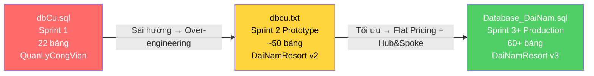

# 📊 CONFLUENCE: DB MIGRATION ANALYSIS
## ADR-003 Phụ Lục — So Sánh Chi Tiết 3 Phiên Bản Schema

**Space:** SD001-Engineering  
**Author:** Nguyễn Tấn Nhị  
**Loại:** Technical Wiki  

---

## 1. TỔNG QUAN TIẾN HÓA

---

## 2. MA TRẬN SO SÁNH CHI TIẾT

### 2.1 Master Data

| Khái niệm | ❌ dbCu.sql (v1) | ⚠️ dbcu.txt (v2 thử nghiệm) | ✅ Database_DaiNam.sql (v3) |
|:-----------|:-----------------|:------------------------------|:---------------------------|
| **Database name** | `QuanLyCongVien` | `DaiNamResort` | `DaiNamResort` |
| **Tài khoản NV** | `TaiKhoan` (bảng riêng, FK→NhanVien) | Merged vào `NhanVien.TenDangNhap` | `NhanVien.TenDangNhap` + RBAC |
| **RBAC** | ❌ Cột `VaiTro` hardcode | ✅ `VaiTro` + `QuyenHan` + `PhanQuyen` | ✅ 5 VaiTro × 36 QuyenHan |
| **Sản phẩm** | `LoaiVe` + `DichVu` + `DanhMucDichVu` (3 bảng) | `SanPham` (1 bảng universal) | `SanPham` + **`SanPham_Ve`** (Weak Entity) |
| **Đơn vị tính** | `DichVu.DonViTinh` (cột text) | `DonViTinh` (bảng) + `QuyDoiDonVi` | `DonViTinh` + `QuyDoiDonVi` + `IdDonViCoBan` FK |
| **Đoàn khách** | ❌ KHÔNG CÓ | `DoanKhach` (đơn giản, 6 cột) | `DoanKhach` (11 cột + workflow) + **`DoanKhach_DichVu`** |
| **Khu vực** | `KhuVuc` (flat — mọi loại chung) | `KhuVuc` + `KhuVucBien.Id` riêng + `KhuVucThu.Id` riêng | `KhuVuc` + Weak Entity (`KhuVucBien.PK=FK`, `KhuVucThu.PK=FK`) |
| **Trò chơi** | `TroChoi` (bảng riêng) | `TroChoi` (bảng riêng) | Gộp vào `DanhSachThietBi` (`LoaiThietBi='TroChoi'`) |

### 2.2 Giao Dịch & Tài Chính

| Khái niệm | ❌ dbCu.sql (v1) | ⚠️ dbcu.txt (v2) | ✅ Database_DaiNam.sql (v3) |
|:-----------|:-----------------|:-------------------|:---------------------------|
| **Hóa đơn** | `HoaDon` + 2 bảng detail | `DonHang` + 1 `ChiTietDonHang` | `DonHang` + `ChiTietDonHang` **HUB** |
| **Chi tiết** | `ChiTietHoaDon_Ve` + `ChiTietHoaDon_DichVu` | `ChiTietDonHang` (CHECK exclusive OR) | `ChiTietDonHang` (CHECK bỏ — BUS validate) |
| **CTDH computed** | `ThanhTien DECIMAL` (manual) | `DonGiaThucTe` (manual) | `ThanhTien AS (SoLuong * DonGiaThucTe) PERSISTED` ✅ |
| **Giá gốc tracking** | ❌ Chỉ `DonGia` | ❌ Chỉ `DonGiaThucTe` | ✅ `DonGiaGoc` + `TienGiamGiaDong` + `DonGiaThucTe` |
| **Nguồn bán** | ❌ | ❌ | ✅ `DonHang.NguonBan` ('POS','WEB','APP') |
| **Phương thức TT** | `HoaDon.PhuongThuc` (1 cột) | `PhieuThu.PhuongThuc` | `PhieuThu.PhuongThuc` (9 loại) + bỏ exclusive OR |
| **Phiếu thu** | ❌ KHÔNG CÓ | ✅ `PhieuThu` (exclusive OR: DonHang XOR GiaoDichVi) | ✅ `PhieuThu` (bỏ exclusive OR — linh hoạt hơn) |
| **Phiếu chi** | ❌ KHÔNG CÓ | ✅ `PhieuChi` | ✅ `PhieuChi` |
| **Ví điện tử** | `ViDienTu.SoDu` + `TienCoc` | `ViDienTu.SoDuKhaDung` + `SoDuDongBang` | `ViDienTu.SoDuKhaDung` + `SoDuDongBang` |
| **Thẻ RFID** | ❌ (MaRFID nằm trong ViDienTu) | ✅ `TheRFID` tách riêng | ✅ `TheRFID` tách riêng |
| **Giao dịch ví** | `LichSuGiaoDichVi` (4 loại) | `GiaoDichVi` (8 loại) + `HashSignature` | `GiaoDichVi` (8 loại) + `HashSignature` + `ParentTransactionId` |
| **OCC** | ❌ | `RowVer` trên ViDienTu, Phong, BanAn | `RowVer` trên 6 bảng |
| **Audit trail** | ❌ | ❌ | ✅ `AuditDonHang` (Trigger) |

### 2.3 Dịch Vụ Đặt Chỗ

| Khái niệm | ❌ dbCu.sql (v1) | ⚠️ dbcu.txt (v2) | ✅ Database_DaiNam.sql (v3) |
|:-----------|:-----------------|:-------------------|:---------------------------|
| **Hub pattern** | ❌ | ❌ (FK trực tiếp DonHang) | ✅ Tất cả FK qua `ChiTietDonHang` |
| **Khách sạn** | ❌ KHÔNG CÓ | `Phong.IdSanPham` (trực tiếp) | `LoaiPhong` → `Phong.IdLoaiPhong` (tách loại phòng) |
| **Bãi xe** | ❌ KHÔNG CÓ | `LuotVaoRaBaiXe` (basic) | + `LoaiXe` column + `AnhBienSo` + `GiaGuiXe` bảng giá |
| **Nhà hàng** | ❌ KHÔNG CÓ | `DatBan` (3 trạng thái) | `DatBan` (5 trạng thái + TienCoc + IdPhieuThuCoc + IdKhachHang) |
| **Thuê đồ** | ❌ KHÔNG CÓ | `ThueDoChiTiet.IdDonHang` | `ThueDoChiTiet.IdChiTietDonHang` + `TienThueDaThu` |

### 2.4 Giá & Khuyến Mãi

| Khái niệm | ❌ dbCu.sql (v1) | ⚠️ dbcu.txt (v2) | ✅ Database_DaiNam.sql (v3) |
|:-----------|:-----------------|:-------------------|:---------------------------|
| **Bảng giá** | `BangGia` + `LoaiNgay` col + NgayBatDau/KetThuc | 3 bảng: `DM_LoaiGia` + `BangGia` + `BangGia_BieuDoGio` | **Flat Matrix**: 3 cột giá inline + `CauHinhNgayLe` |
| **Khuyến mãi** | `KhuyenMai` (2 loại: PhanTram/SoTien) | `KhuyenMai` (4 loại + DongGia + MuaXTangY) | `KhuyenMai` (4 loại) |
| **Combo** | `ChiTietCombo` (LoaiVeCha + LoaiVeCon) | `Combo` + `ComboChiTiet` + TyLePhanBo | `Combo` + `ComboChiTiet` + Trigger 100% |
| **Loyalty** | `KhachHang.DiemTichLuy` + 2 dòng config | `KhachHang.DiemTichLuy` | `LichSuDiem` Ledger + `QuyTacDiem` Engine |

### 2.5 Vận Hành & Bảo Trì

| Khái niệm | ❌ dbCu.sql (v1) | ⚠️ dbcu.txt (v2) | ✅ Database_DaiNam.sql (v3) |
|:-----------|:-----------------|:-------------------|:---------------------------|
| **Bảo trì** | `BaoTri` (chỉ TroChoi) | `BaoTriPhuongTienDua` (chỉ trường đua) | `DanhSachThietBi` + `LichBaoTri` (TOÀN KHU) |
| **Lịch ca** | `CaLam` + `PhanCa` | ❌ | `LichLamViec` (Kanban) |
| **Kiểm kho** | ❌ | ❌ | `LichKiemKho` + `ChiTietKiemKho` (ChenhLech PERSISTED) |
| **Thẻ kho** | ❌ | ❌ | `TheKho` (Immutable Ledger) |
| **Kiosk** | ❌ | `Kiosk` + `TonKhoKiosk` (riêng) | `Kiosk` + TonKho merged (`LoaiKho='Kiosk'`) |
| **Đánh giá DV** | ❌ | ❌ | `DanhGiaDichVu` (1-5 sao + nhận xét) |
| **Soft Delete** | ❌ | `IsDeleted` trên Master Data | `IsDeleted` + **Filtered Indexes** |

---

## 3. CÁC BẢNG BỊ XÓA / THAY THẾ

| Bảng cũ (v1/v2) | Số phận | Lý do |
|:-----------------|:--------|:------|
| `TaiKhoan` (v1) | 🗑️ Xóa | Merge vào `NhanVien.TenDangNhap` |
| `LoaiVe` (v1) | 🗑️ Xóa | Merge vào `SanPham` (LoaiSanPham='Ve') |
| `DichVu` (v1) | 🗑️ Xóa | Merge vào `SanPham` |
| `DanhMucDichVu` (v1) | 🗑️ Xóa | Phân biệt bằng LoaiSanPham |
| `ChiTietHoaDon_Ve` (v1) | 🗑️ Xóa | Merge vào `ChiTietDonHang` |
| `ChiTietHoaDon_DichVu` (v1) | 🗑️ Xóa | Merge vào `ChiTietDonHang` |
| `HoaDon` (v1) | 🔄 Rename | → `DonHang` |
| `CaLam` + `PhanCa` (v1) | 🔄 Thay thế | → `LichLamViec` |
| `BaoTri` (v1) | 🔄 Thay thế | → `DanhSachThietBi` + `LichBaoTri` |
| `BangGia` (v1) | 🔄 Redesign | → Flat Matrix (3 cột giá) |
| `CauHinhHeThong` (v1) | 🗑️ Xóa | → `QuyTacDiem` + `CauHinhNgayLe` |
| `DM_LoaiGia` (v2) | 🗑️ Xóa | Over-engineering → Flat matrix |
| `BangGia_BieuDoGio` (v2) | 🗑️ Xóa | Over-engineering |
| `TonKhoKiosk` (v2) | 🗑️ Xóa | Merge vào `TonKho` (LoaiKho='Kiosk') |
| `ThietBiApp` (v2) | 🗑️ Xóa | Không phụ thuộc FCM app mobile |

---

## 4. THỐNG KÊ SỐ LƯỢNG

| Metric | v1 (dbCu.sql) | v2 (dbcu.txt) | v3 (Database_DaiNam.sql) |
|:-------|:-------------:|:-------------:|:------------------------:|
| **CREATE TABLE** | 22 | ~50 | 60+ |
| **FOREIGN KEY** | 33 | ~60 | 80+ |
| **CHECK constraint** | 35 | ~40 | 50+ |
| **UNIQUE constraint** | 14 | ~15 | 20+ |
| **INDEX** | 17 | ~25 | 40+ |
| **VIEW** | 0 | 0 | 6 |
| **TRIGGER** | 0 | 0 | 2 |
| **STORED PROC** | 0 | 1 | 1 |
| **Computed columns** | 0 | 0 | 3 (PERSISTED) |
| **Filtered indexes** | 0 | 0 | 3 |
| **File size** | 26 KB | 51 KB | 124 KB |
| **Lines of SQL** | 559 | ~1051 | 2268 |
