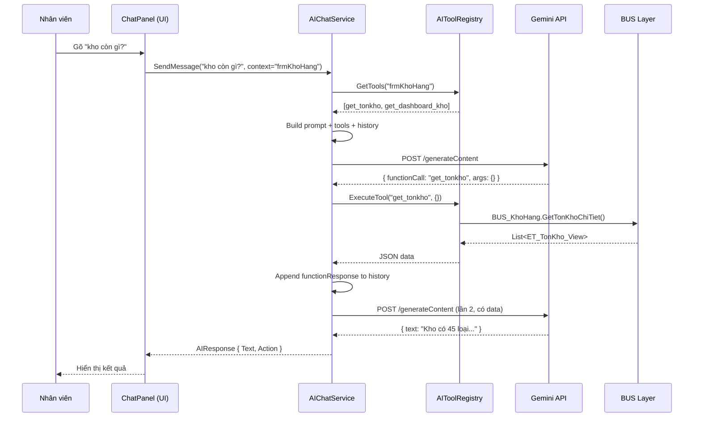

# 🤖 AI Chatbox Agent — Thiết Kế Chi Tiết

> **Dự án:** Quản Lý Công Viên Đại Nam  
> **Tính năng:** Trợ lý AI tích hợp trong ứng dụng WinForms POS  
> **Kiến trúc:** ReAct Agent (Reason + Act) — Multi-Context Function Calling  
> **AI Provider:** Google Gemini 2.0 Flash  
> **Framework:** .NET Framework 4.7.2 (WinForms)

---

## 1. Ý TƯỞNG GỐC

### 1.1. Vấn đề hiện tại

Ứng dụng POS Đại Nam có **30+ form** phân thành 5 nhóm (Tiền Sảnh, Quản Trị, Vận Hành, Báo Cáo, Hệ Thống). Nhân viên mới phải **nhớ vị trí từng chức năng**, click qua nhiều tầng menu để tìm đúng form. Khi cần tra cứu nhanh (ví dụ: "kho còn bao nhiêu nước?"), nhân viên phải tự mở form → chọn kho → đọc lưới.

### 1.2. Giải pháp

Một **Chatbox thông minh** nằm ở góc phải dưới màn hình. Nhân viên chỉ cần gõ tiếng Việt tự nhiên:

```
Nhân viên: "Xem kho hàng"
   → AI tự mở frmKhoHang

Nhân viên: "Kho chính còn bao nhiêu nước suối?"
   → AI tự gọi hàm lấy data tồn kho → Trả kết quả ngay trong chatbox
```

### 1.3. Điểm đặc biệt — Hệ thống "Hai Não"

Đây không phải chatbox đơn thuần. Hệ thống hoạt động theo **2 chế độ não bộ** tùy ngữ cảnh:

| Chế độ | Khi nào | AI biết gì | AI làm được gì |
|--------|---------|-------------|-----------------|
| **Não Điều Hướng** | Đang ở Form1 (Main) | Danh sách 30+ forms | Mở form theo yêu cầu |
| **Não Chuyên Sâu** | Đang ở form cụ thể (vd: frmKhoHang) | Data + nghiệp vụ của form đó | Truy vấn data, phân tích, trả lời |

Khi nhân viên **chuyển form**, AI tự động **đổi não** — đổi prompt, đổi danh sách hàm, đổi ngữ cảnh.

---

## 2. LUỒNG HOẠT ĐỘNG CHI TIẾT

### 2.1. Kịch bản 1: Điều hướng đơn giản

```
┌─────────────────────────────────────────────────────────────┐
│  Nhân viên gõ: "mở kho hàng"                               │
│                                                             │
│  Bước 1: AI nhận tin nhắn                                   │
│  Bước 2: AI đang ở chế độ NÃO ĐIỀU HƯỚNG                   │
│  Bước 3: System prompt chứa danh sách forms:                │
│          - frmBanHang: Bán hàng POS                         │
│          - frmKhoHang: Quản lý kho hàng, tồn kho  ← MATCH! │
│          - frmDonHang: Tra cứu đơn hàng                     │
│          ...                                                │
│  Bước 4: AI trả về JSON:                                    │
│          {                                                  │
│            "text": "Đang mở Kho Hàng cho bạn!",             │
│            "action": "open_form",                           │
│            "form_name": "frmKhoHang"                        │
│          }                                                  │
│  Bước 5: App parse JSON → gọi Form1.OpenChildForm()        │
│  Bước 6: frmKhoHang mở ra                                  │
│  Bước 7: AI TỰ ĐỘNG chuyển sang NÃO CHUYÊN SÂU (KhoHang)  │
└─────────────────────────────────────────────────────────────┘
```

### 2.2. Kịch bản 2: Truy vấn data cần ReAct Loop

Đây là phần **ĐỈNH CAO** — AI tự nhận ra mình cần data, tự gọi hàm, tự xử lý kết quả.

```
┌─────────────────────────────────────────────────────────────┐
│  Nhân viên gõ: "Kho chính tháng 3 có bao nhiêu hàng?"      │
│                                                             │
│  ══ VÒNG LẶP 1 ══                                          │
│  AI đang ở NÃO CHUYÊN SÂU (KhoHang)                        │
│  AI suy nghĩ: "Người dùng hỏi tồn kho, tôi cần gọi hàm"  │
│  AI trả về:                                                 │
│  {                                                          │
│    "function_call": {                                       │
│      "name": "get_tonkho",                                  │
│      "args": { "ten_kho": "Kho chính" }                     │
│    }                                                        │
│  }                                                          │
│                                                             │
│  App nhận function_call → gọi BUS_KhoHang.GetTonKhoChiTiet()│
│  App nhận kết quả: [{ "Nước suối": 150, "Mì tôm": 30, ...}]│
│  App gửi kết quả LẠI cho AI (functionResponse)              │
│                                                             │
│  ══ VÒNG LẶP 2 ══                                          │
│  AI nhận được data → suy nghĩ → đủ data rồi → trả lời      │
│  AI trả về:                                                 │
│  {                                                          │
│    "text": "Kho chính hiện có 45 loại sản phẩm:\n           │
│             - Nước suối: 150 chai\n                         │
│             - Mì tôm: 30 gói (⚠ Sắp hết!)\n               │
│             - ...\n                                         │
│             Tổng giá trị tồn kho: 12.500.000đ",            │
│    "action": "respond"                                      │
│  }                                                          │
│                                                             │
│  App hiển thị text lên chatbox ✅                            │
└─────────────────────────────────────────────────────────────┘
```

### 2.3. Kịch bản 3: ReAct nhiều vòng (AI cần gọi 2+ hàm)

```
┌─────────────────────────────────────────────────────────────┐
│  Nhân viên gõ: "So sánh tồn kho giữa Kho chính và Kho phụ"│
│                                                             │
│  ══ VÒNG 1: AI gọi get_tonkho(kho="Kho chính") ══          │
│  → Nhận được data Kho chính                                 │
│                                                             │
│  ══ VÒNG 2: AI gọi get_tonkho(kho="Kho phụ") ══            │
│  → Nhận được data Kho phụ                                   │
│                                                             │
│  ══ VÒNG 3: AI có đủ 2 bộ data → trả lời ══                │
│  "Kho chính có 45 loại (12.5tr), Kho phụ có 20 loại (5tr)" │
│  "Chênh lệch: Kho chính nhiều hơn 25 loại SP..."           │
└─────────────────────────────────────────────────────────────┘
```

---

## 3. KIẾN TRÚC KỸ THUẬT

### 3.1. Cấu trúc file

```
GUI/
├── AI/                          ← THƯ MỤC MỚI
│   ├── AIChatService.cs         ← Lõi giao tiếp Gemini API + ReAct loop
│   ├── AIChatPanel.cs           ← UI Panel chatbox (code-behind)
│   ├── AIChatPanel.Designer.cs  ← UI Panel chatbox (designer)
│   ├── AIToolRegistry.cs        ← Đăng ký Tools theo context
│   ├── AIModels.cs              ← Các class model: AIResponse, AItool...
│   ├── IAIFormContext.cs         ← Interface cho form đăng ký context
│   └── AIConfig.cs              ← API Key, model name, endpoint
```

### 3.2. Luồng Data Flow



### 3.3. Gemini API Request Format

Mỗi lần gọi Gemini, ta gửi JSON có cấu trúc như sau:

```json
{
  "system_instruction": {
    "parts": [{ "text": "Bạn là trợ lý AI của Đại Nam. Đang ở form Kho Hàng..." }]
  },
  "contents": [
    { "role": "user",  "parts": [{ "text": "kho còn gì?" }] },
    { "role": "model", "parts": [{ "functionCall": { "name": "get_tonkho", "args": {} } }] },
    { "role": "user",  "parts": [{ "functionResponse": { "name": "get_tonkho", "response": { "data": [...] } } }] },
    { "role": "model", "parts": [{ "text": "Kho có 45 loại sản phẩm..." }] }
  ],
  "tools": [{
    "functionDeclarations": [
      {
        "name": "get_tonkho",
        "description": "Lấy danh sách tồn kho chi tiết theo kho",
        "parameters": {
          "type": "OBJECT",
          "properties": {
            "ten_kho": { "type": "STRING", "description": "Tên kho (vd: Kho chính). Để trống = tất cả kho" }
          }
        }
      },
      {
        "name": "open_form",
        "description": "Mở/chuyển sang một form khác trong ứng dụng",
        "parameters": {
          "type": "OBJECT",
          "properties": {
            "form_name": { "type": "STRING", "description": "Tên form (vd: frmBanHang, frmDonHang)" }
          },
          "required": ["form_name"]
        }
      }
    ]
  }]
}
```

### 3.4. Gemini API Response — 2 trường hợp

**Trường hợp A: AI muốn gọi hàm (cần data)**
```json
{
  "candidates": [{
    "content": {
      "parts": [{
        "functionCall": {
          "name": "get_tonkho",
          "args": { "ten_kho": "Kho chính" }
        }
      }],
      "role": "model"
    }
  }]
}
```
→ App bắt được `functionCall` → Gọi BUS layer → Gửi kết quả lại → Vòng lặp tiếp

**Trường hợp B: AI trả lời text (đã đủ data)**
```json
{
  "candidates": [{
    "content": {
      "parts": [{
        "text": "Kho chính có 45 loại sản phẩm, tổng giá trị 12.5 triệu đồng."
      }],
      "role": "model"
    }
  }]
}
```
→ App parse `text` → Hiển thị lên ChatPanel

---

## 4. BẢNG TOOL REGISTRY — CHI TIẾT TỪNG FORM

### 4.1. Navigation Mode (Form1 — Main Dashboard)

| Tool Name | Mô tả | Tham số | Gọi hàm gì |
|-----------|--------|---------|-------------|
| `open_form` | Mở form theo tên | `form_name: string` | `Form1.NavigateToFormByAI()` |

**System Prompt cho Navigation Mode:**
```
Bạn là trợ lý AI của hệ thống Quản Lý Công Viên Đại Nam.
Người dùng đang ở màn hình chính. Bạn có thể mở các form sau:

TIỀN SẢNH:
- frmBanHang: Bán hàng POS, tạo đơn hàng mới
- frmKiemSoatVe: Soát vé, quét QR vé điện tử
- frmDatPhong: Đặt phòng khách sạn
- frmDatBan: Đặt bàn nhà hàng
- frmThueDo: Cho thuê vật dụng (áo phao, xe đạp...)
- frmGuiXe: Quản lý bãi đỗ xe

QUẢN TRỊ:
- frmSanPham: Quản lý danh mục sản phẩm
- frmBangGia: Thiết lập bảng giá vé
- frmCombo: Quản lý combo vé + dịch vụ
- frmKhuVuc: Quản lý khu vực công viên
- frmKhachHang: Quản lý hồ sơ khách hàng
- frmDoanKhach: Quản lý đoàn khách
- frmKhuyenMai: Chương trình khuyến mãi
- frmTheRFID: Quản lý thẻ RFID
- frmViDienTu: Quản lý ví điện tử

VẬN HÀNH:
- frmNhanVien: Quản lý nhân sự
- frmLichLamViec: Lịch làm việc, chấm công
- frmKhoHang: Kho hàng, tồn kho, nhập/xuất
- frmPhieuNhapXuat: Phiếu nhập xuất kho
- frmSuCo: Báo cáo sự cố
- frmBaoTri: Lịch bảo trì thiết bị
- frmTroChoi: Quản lý trò chơi
- frmNhaHang: Quản lý nhà hàng
- frmDongVat: Quản lý động vật

BÁO CÁO:
- frmDashboard: Dashboard tổng quan
- frmDonHang: Tra cứu đơn hàng, hoá đơn
- frmPhieuThuChi: Sổ thu chi, công nợ

Khi người dùng yêu cầu mở form, hãy dùng tool open_form.
Nếu không chắc form nào, hãy hỏi lại.
Trả lời bằng tiếng Việt, ngắn gọn, thân thiện.
```

### 4.2. frmKhoHang — Kho Hàng

| Tool Name | Mô tả | Tham số | BUS Method |
|-----------|--------|---------|------------|
| `get_tonkho` | Lấy tồn kho chi tiết | `ten_kho?: string` | `BUS_KhoHang.GetTonKhoChiTiet(idKho)` |
| `get_dashboard_kho` | Số liệu tổng quan kho | `ten_kho?: string` | `BUS_KhoHang.GetDashboardMetrics(idKho)` |
| `open_form` | Chuyển form khác | `form_name: string` | `Form1.NavigateToFormByAI()` |

### 4.3. frmDonHang — Đơn Hàng

| Tool Name | Mô tả | Tham số | BUS Method |
|-----------|--------|---------|------------|
| `get_orders` | Tìm đơn hàng | `from_date?: string, to_date?: string, status?: string` | `BUS_DonHang.LoadDS()` + filter |
| `get_order_detail` | Chi tiết 1 đơn | `ma_don_hang: string` | `BUS_ChiTietDonHang.LoadDS(idDonHang)` |
| `open_form` | Chuyển form khác | `form_name: string` | `Form1.NavigateToFormByAI()` |

### 4.4. frmKhachHang — Khách Hàng

| Tool Name | Mô tả | Tham số | BUS Method |
|-----------|--------|---------|------------|
| `get_customers` | Tìm khách hàng | `keyword?: string, loai_khach?: string` | `BUS_KhachHang.LoadDS()` + filter |
| `get_customer_detail` | Thông tin 1 khách | `sdt: string` | `BUS_KhachHang.LayTheoSDT()` |
| `open_form` | Chuyển form khác | `form_name: string` | `Form1.NavigateToFormByAI()` |

---

## 5. CONTEXT SWITCHING — "ĐỔI NÃO"

### 5.1. Cơ chế hoạt động

Mỗi khi nhân viên chuyển form (click menu hoặc AI mở form), hệ thống:

```
1. Phát hiện form mới đang active
2. Kiểm tra form có implement IAIFormContext không
3. NẾU CÓ  → Đổi sang Não Chuyên Sâu (prompt riêng + tools riêng)
4. NẾU KHÔNG → Giữ nguyên Não Điều Hướng (chỉ có open_form)
5. XÓA conversation history cũ (bắt đầu context chat mới)
```

### 5.2. Interface IAIFormContext

```csharp
public interface IAIFormContext
{
    /// <summary>Tên context (vd: "frmKhoHang")</summary>
    string AIContextName { get; }
    
    /// <summary>Mô tả cho AI hiểu form này làm gì</summary>
    string AIContextDescription { get; }
}
```

Ví dụ `frmKhoHang` implement:

```csharp
public partial class frmKhoHang : Form, IBaseForm, IAIFormContext
{
    public string AIContextName => "frmKhoHang";
    public string AIContextDescription => 
        "Form Kho Hàng: quản lý tồn kho, nhập/xuất kho, kiểm kê. " +
        "Người dùng có thể hỏi về số lượng tồn, sản phẩm sắp hết, giá trị kho.";
}
```

### 5.3. Minh hoạ dòng chảy đổi não

```
Thời điểm T0: Nhân viên mở app → Form1 active
              AI ở NÃO ĐIỀU HƯỚNG
              Tools = [open_form]
              Prompt = "Danh sách 30+ forms..."

Thời điểm T1: Nhân viên gõ "mở kho hàng"
              AI gọi open_form("frmKhoHang")
              frmKhoHang mở ra
              
              ★ HỆ THỐNG TỰ ĐỘNG ĐỔI NÃO ★
              
              AI chuyển sang NÃO CHUYÊN SÂU (KhoHang)
              Tools = [get_tonkho, get_dashboard_kho, open_form]
              Prompt = "Bạn đang ở Kho Hàng..."
              History = [] (reset)

Thời điểm T2: Nhân viên gõ "còn bao nhiêu nước?"
              AI gọi get_tonkho() → nhận data → trả lời
              
Thời điểm T3: Nhân viên click menu "Đơn Hàng"
              frmDonHang mở ra
              
              ★ ĐỔI NÃO LẦN 2 ★
              
              Tools = [get_orders, get_order_detail, open_form]
              Prompt = "Bạn đang ở Đơn Hàng..."
              History = [] (reset)
```

---

## 6. REACT LOOP — GIẢI THÍCH SÂU

### 6.1. ReAct là gì?

**ReAct = Reason + Act** (Suy luận + Hành động). Đây là pattern AI Agent tiên tiến nhất hiện tại (2025-2026), được Google DeepMind nghiên cứu.

Thay vì AI chỉ trả lời text, AI có khả năng **suy luận xem mình cần gì** → **tự hành động (gọi hàm)** → **nhận kết quả** → **suy luận tiếp** → **trả lời**.

### 6.2. Pseudo-code ReAct Loop

```csharp
public async Task<AIResponse> SendMessage(string userMessage)
{
    // Thêm tin nhắn user vào history
    _history.Add(new { role = "user", text = userMessage });
    
    // Lặp tối đa 3 vòng (chống infinite loop)
    for (int loop = 0; loop < MAX_LOOPS; loop++)
    {
        // Gửi toàn bộ history + tools lên Gemini
        var response = await CallGeminiAPI(_systemPrompt, _history, _currentTools);
        
        // CASE A: AI muốn gọi hàm
        if (response.HasFunctionCall)
        {
            // Thêm function call vào history
            _history.Add(new { role = "model", functionCall = response.FunctionCall });
            
            // Thực thi hàm trên BUS layer
            string result = ExecuteTool(response.FunctionCall.Name, response.FunctionCall.Args);
            
            // Thêm kết quả vào history
            _history.Add(new { role = "user", functionResponse = result });
            
            // TIẾP TỤC VÒNG LẶP → gửi lại cho AI có data mới
            continue;
        }
        
        // CASE B: AI trả lời text → THOÁT VÒNG LẶP
        return new AIResponse 
        { 
            Text = response.Text,
            Action = ExtractAction(response.Text) // open_form nếu có
        };
    }
    
    return new AIResponse { Text = "Xin lỗi, tôi không thể xử lý yêu cầu này." };
}
```

### 6.3. Giới hạn an toàn

| Giới hạn | Giá trị | Lý do |
|----------|---------|-------|
| Max ReAct loops | 3 | Chống infinite loop từ API |
| Max data rows trả về | 50 | Tránh token quá lớn |
| Timeout per API call | 15 giây | UX không chờ quá lâu |
| Max conversation turns | 20 | Giữ context window gọn |

---

## 7. UI/UX DESIGN

### 7.1. Chat Bubble Button

Một nút tròn ở **góc phải dưới** của `pnlDesktop`, phong cách giống chatbot hỗ trợ:

```
                                          ┌──────┐
                                          │  🤖  │  ← bounce animation
                                          └──────┘
```

- Size: 56×56px, bo tròn
- Màu: Gold gradient (theo design system Đại Nam)
- Icon: Robot / Sparkles
- Animation: Nhẹ nhàng bounce khi có tin mới
- Click → Toggle ChatPanel

### 7.2. ChatPanel Layout

```
╔═══════════════════════════════════════╗
║  🤖 Đại Nam AI ─────────── [─] [X]  ║ ← Header (Dark, dragable)
╠═══════════════════════════════════════╣
║                                       ║
║  ┌─────────────────────────────┐      ║
║  │ Bot: Xin chào! Tôi là trợ  │      ║ ← Message List (ScrollPanel)
║  │ lý AI Đại Nam. Bạn có thể  │      ║
║  │ hỏi tôi bất cứ điều gì!   │      ║
║  └─────────────────────────────┘      ║
║                                       ║
║      ┌─────────────────────────────┐  ║
║      │ UserMsg: Xem kho hàng      │  ║ ← Tin nhắn User (aligned right)
║      └─────────────────────────────┘  ║
║                                       ║
║  ┌─────────────────────────────┐      ║
║  │ Bot: 🔄 Đang mở Kho Hàng...│      ║
║  └─────────────────────────────┘      ║
║                                       ║
║  ┌─────────────────────────────┐      ║
║  │ Bot: ✅ Đã mở Kho Hàng!    │      ║
║  │ Bây giờ bạn có thể hỏi về  │      ║
║  │ tồn kho, sản phẩm, nhập    │      ║
║  │ xuất...                     │      ║
║  └─────────────────────────────┘      ║
║                                       ║
╠═══════════════════════════════════════╣
║  ┌────────────────────────┐ ┌──────┐  ║
║  │ Nhập tin nhắn...       │ │  ↑   │  ║ ← Input area
║  └────────────────────────┘ └──────┘  ║
╚═══════════════════════════════════════╝
     380px wide × 520px tall
```

- **Theme**: Follow ThemeManager (dark/light)
- **Resize**: Có thể kéo góc để resize
- **Minimize**: Nút [─] thu nhỏ về bubble
- **Position**: Góc phải dưới pnlDesktop

### 7.3. Message Bubbles

```
Bot message:                    User message:
┌──────────────────┐                    ┌──────────────────┐
│ 🤖 Kho chính có  │                    │ Kho còn gì?      │
│ 45 loại SP...    │                    └──────────────────┘
└──────────────────┘                     Màu: Gold/Tertiary
 Màu: Surface-Container                  Align: Right
 Align: Left
```

---

## 8. IMPLEMENTATION CHECKLIST

### Phase 1: Foundation (Ưu tiên)
- [ ] `AIConfig.cs` — API key, endpoint config
- [ ] `AIModels.cs` — Response/Request models
- [ ] `AIChatService.cs` — Gemini REST API + ReAct loop
- [ ] `AIToolRegistry.cs` — Tool definitions + execution
- [ ] `IAIFormContext.cs` — Interface

### Phase 2: UI
- [ ] `AIChatPanel.cs` — Chat panel UI
- [ ] Chat bubble button trong Form1
- [ ] Message rendering (bot/user bubbles)
- [ ] Typing indicator animation
- [ ] Theme integration

### Phase 3: Integration
- [ ] Form1 → thêm chat button + AI bridge
- [ ] `frmKhoHang` implement `IAIFormContext`
- [ ] `frmDonHang` implement `IAIFormContext`
- [ ] `frmKhachHang` implement `IAIFormContext`
- [ ] Context switching logic

### Phase 4: Polish
- [ ] Error handling (no internet, API error)
- [ ] Debounce/throttle (chống spam)
- [ ] Conversation persistence (giữ chat khi đổi form)
- [ ] Keyboard shortcut (Ctrl+Space mở chat)

---

## 9. RỦI RO VÀ GIẢI PHÁP

| Rủi ro | Mức độ | Giải pháp |
|--------|--------|-----------|
| Không có internet | 🟡 Trung bình | Hiển thị "Không có kết nối AI", app vẫn chạy bình thường |
| API trả chậm | 🟡 Trung bình | Timeout 15s + typing indicator |
| AI hiểu sai ý | 🟢 Thấp | Prompt engineering chặt chẽ + form descriptions rõ ràng |
| Gemini Rate Limit (15 RPM) | 🟡 Trung bình | Debounce 2s giữa các lần gửi |
| Token quá lớn (data nhiều) | 🟢 Thấp | Limit 50 rows/items trong mỗi tool response |
| Infinite loop | 🔴 Cao | Max 3 vòng ReAct cứng |

---

> **Tác giả**: AI Antigravity + Developer Team  
> **Ngày tạo**: 09/04/2026  
> **Trạng thái**: Thiết kế → Chờ duyệt → Triển khai
