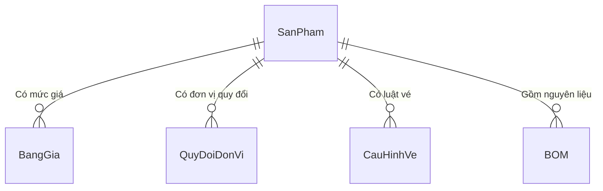

# Khu Du Lịch Đại Nam
# Đặc Tả Yêu Cầu Phần Mềm
# Mã dự án: DN01
# Mã tài liệu: DN01_SRS_QuanLySanPham_v1.0

Hồ Chí Minh, Tháng 04/2026

---

## Lịch sử thay đổi

| Ngày hiệu lực | Hạng mục thay đổi | A/M/D | Mô tả | Phiên bản |
|---|---|---|---|---|
| 19/04/2026 | Phát hành lần đầu | A | | 1.0 |

*A - Thêm mới, M - Chỉnh sửa, D - Xóa bỏ*

---

## 0. Phạm vi tài liệu

Tài liệu này đặc tả phân hệ Quản lý Sản phẩm thuộc hệ thống quản lý vận hành Khu Du lịch Đại Nam.
- **Phạm vi bao gồm:** khai báo sản phẩm, bảng giá, quy đổi đơn vị, cấu hình vé và F&B.
- **Không bao gồm:** quản lý tồn kho, thanh toán, báo cáo (được đặc tả ở tài liệu riêng).
- **Đối tượng đọc:** BA, Lập trình viên (Dev), Chuyên viên kiểm thử (Tester).

---

## Mục lục

1. [Quản lý sản phẩm & dịch vụ](#1-quản-lý-sản-phẩm--dịch-vụ)
   - 1.1. [Màn hình danh sách sản phẩm](#11-màn-hình-danh-sách-sản-phẩm)
   - 1.2. [Màn hình chi tiết sản phẩm — Tab thông tin chung](#12-màn-hình-chi-tiết-sản-phẩm--tab-thông-tin-chung)
   - 1.3. [Tab bảng giá](#13-tab-bảng-giá)
   - 1.4. [Tab quy đổi đơn vị tính](#14-tab-quy-đổi-đơn-vị-tính)
   - 1.5. [Tab cấu hình vận hành — biến thể vé](#15-tab-cấu-hình-vận-hành--biến-thể-vé)
   - 1.6. [Tab cấu hình vận hành — biến thể F&B](#16-tab-cấu-hình-vận-hành--biến-thể-fb)
   - 1.7. [Xóa sản phẩm](#17-xóa-sản-phẩm)
2. [Yêu cầu khác](#2-yêu-cầu-khác)
   - 2.1. [Định dạng dữ liệu](#21-định-dạng-dữ-liệu)
   - 2.2. [Danh mục dữ liệu tham chiếu](#22-danh-mục-dữ-liệu-tham-chiếu)
   - 2.3. [Bảng mã thông báo lỗi](#23-bảng-mã-thông-báo-lỗi)

---

## 0. Tổng quan & Phạm vi (Overview & Scope)

Tài liệu này đặc tả phân hệ Quản lý Sản phẩm thuộc hệ thống quản lý vận hành Khu Du lịch Đại Nam.
- **Phạm vi bao gồm:** khai báo sản phẩm, bảng giá, quy đổi đơn vị, cấu hình vé và F&B.
- **Không bao gồm:** quản lý tồn kho, thanh toán, báo cáo (được đặc tả ở tài liệu riêng).
- **Đối tượng đọc:** BA, Lập trình viên (Dev), Chuyên viên kiểm thử (Tester).

---

# 1. Quản lý sản phẩm & dịch vụ

Phân hệ quản lý sản phẩm bao gồm các chức năng sau:

- Tra cứu, lọc danh sách sản phẩm
- Thêm mới sản phẩm
- Chỉnh sửa thông tin sản phẩm
- Thiết lập bảng giá (đa mức, đa thời gian)
- Lập bảng quy đổi đơn vị tính
- Cấu hình vận hành theo loại (vé cổng xoay, F&B định mức BOM)
- Xóa ẩn sản phẩm

---

## 1.1. Màn hình danh sách sản phẩm

### 1.1.1. Tổng quan

Màn hình này hiển thị toàn bộ danh mục sản phẩm dưới dạng lưới. Bên trái là lưới danh sách, bên phải là panel chi tiết (Split View). Khi người dùng chọn một dòng trên lưới, panel phải tự nạp thông tin chi tiết của sản phẩm đó.

### 1.1.2. Tác nhân

- Quản lý (thêm, sửa, xóa sản phẩm)
- Nhân viên kế toán (xem, lập quy đổi, lập BOM)

### 1.1.3. Biểu đồ use-case

```text
Quản lý ──── Tìm kiếm sản phẩm
         ├── Thêm mới sản phẩm
         ├── Chỉnh sửa sản phẩm
         ├── Thiết lập bảng giá          <<include>> Thêm/Sửa
         ├── Lập bảng quy đổi ĐVT       <<include>> Thêm/Sửa
         ├── Cấu hình quyền quẹt vé     <<extend>> Thêm/Sửa (chỉ khi SP là Vé)
         ├── Cấu hình định mức BOM      <<extend>> Thêm/Sửa (chỉ khi SP là F&B)
         └── Xóa ẩn sản phẩm
```

#### 1.1.3.1. Tiền điều kiện

- Người dùng đã đăng nhập.
- Các danh mục đơn vị tính, cổng xoay, khu vực POS, cấu hình thuế đã tồn tại.

#### 1.1.3.2. Hậu điều kiện

Dữ liệu sản phẩm được lưu đồng bộ vào cơ sở dữ liệu (bảng SanPham, BangGia, QuyDoiDonVi và các bảng phụ thuộc loại hình).

#### 1.1.3.3. Điểm kích hoạt

Người dùng truy cập menu Danh mục, chọn mục Hàng hóa và Dịch vụ.

### 1.1.4. Luồng thao tác

#### 1.1.4.1. Tình huống 1 — Thêm mới vé dịch vụ

| | Người dùng | Hệ thống |
|---|---|---|
| 1 | Nhấn nút Thêm mới. | Bật panel chi tiết bên phải. Tab Thông tin chung mở mặc định. Các trường ở trạng thái trống. |
| 2 | Nhập mã SP, tên vé, chọn ĐVT là Lượt. Chọn loại SP là Vé dịch vụ. | Tự sinh tiền tố mã: VE_. Tab 4 đổi thành Cấu hình vé. Checkbox Là vật tư tự tắt và khóa xám. |
| 3 | Chuyển sang Tab cấu hình vé, thiết lập đối tượng: Người lớn. Thêm dòng trên lưới quẹt cổng: Khu Trượt Nước (1 lượt). | Ghi nhận. |
| 4 | Chuyển sang Tab bảng giá, thêm dòng giá: Loại Mặc định, giá 150,000. | Kiểm tra thời hiệu không chồng lấp. |
| 5a | Nhấn nút Lưu (Dữ liệu hợp lệ). | Lưu thành công, tải lại lưới danh sách và hiển thị thông báo MSG_LUU_THANH_CONG. |
| 5b | Nhấn nút Lưu (Mã SP trùng). | Dừng lưu, focus vào ô Mã SP, hiển thị thông báo ERR_TRUNG_MASP. |
| 5c | Nhấn nút Lưu (Bảng giá trống). | Tự ép trạng thái về Tạm ngưng, hỏi xác nhận trước khi lưu. |
| 5d | Lỗi server / Timeout. | Hiển thị thông báo MSG_LUU_THAT_BAI, giữ nguyên dữ liệu trên form để tránh mất công sức nhập liệu. |

#### 1.1.4.2. Tình huống 2 — Khai báo món ăn F&B

| | Người dùng | Hệ thống |
|---|---|---|
| 1 | Nhấn nút Thêm mới. Nhập tên Bia Heineken, chọn ĐVT gốc là Lon, loại SP là Đồ uống. Tích Là vật tư, chọn thuế VAT 8%. | Tự sinh tiền tố DU_. Tab 4 đổi thành Cấu hình F&B. |
| 2 | Chuyển sang Tab quy đổi ĐVT, nhấn nút Thêm dòng, chọn ĐVT đích là Thùng, hệ số bằng 24. | Kiểm tra hệ số lớn hơn 0. |
| 3 | Tích ô Áp dụng toàn bộ điểm bán. | Khóa xám danh sách điểm bán, mặc định áp dụng tất cả. |
| 4 | Nhấn nút Lưu. | Lưu đồng bộ tất cả tab, thông báo thành công. |

#### 1.1.4.3. Tình huống 3 — Chỉnh sửa sản phẩm

| | Người dùng | Hệ thống |
|---|---|---|
| 1 | Nhấp chọn một dòng trên lưới danh sách. | Panel phải tự nạp thông tin sản phẩm đó. Mã SP và Loại SP bị khóa (Read-only). |
| 2 | Sửa các trường cần thay đổi (tên, giá, quy đổi...). | Kích hoạt cờ đã thay đổi. |
| 3 | Nhấn nút Lưu. | Hệ thống kiểm tra, lưu và thông báo thành công, sau đó tải lại lưới. |

#### 1.1.4.4. Tình huống 4 — Cảnh báo mất dữ liệu khi chuyển dòng

| | Người dùng | Hệ thống |
|---|---|---|
| 1 | Đang sửa SP A chưa lưu, nhấp sang dòng SP B trên lưới. | Hiển thị hộp thoại xác nhận với 3 nút: Có, Không, Hủy. |
| 2a | Nhấn nút Có. | Lưu SP A, nếu hợp lệ thì chuyển sang SP B. Nếu lỗi thì giữ nguyên tại SP A. |
| 2b | Nhấn nút Không. | Bỏ qua thay đổi, chuyển sang SP B. |
| 2c | Nhấn nút Hủy. | Giữ nguyên tại SP A, không chuyển dòng. |

### 1.1.5. Giao diện

#### 1.1.5.1. Mô tả màn hình — Thanh công cụ

| STT | Tên trường | Control type | Required | Data type | Default value | Mô tả / Tooltip |
|---|---|---|---|---|---|---|
| 1 | Thêm mới | Button | N/A | N/A | N/A | Bật panel chi tiết ở chế độ thêm mới. |
| 2 | Làm mới | Button | N/A | N/A | N/A | Đặt bộ lọc về Tất cả, tải lại dữ liệu. |
| 3 | Tìm kiếm | Text field | No | Text | Blank | Lọc trực tiếp trên lưới theo Mã SP hoặc Tên SP. (*) Tooltip: "Gõ mã hoặc tên để tìm nhanh" |

#### 1.1.5.2. Mô tả màn hình — Bộ lọc nhanh

| STT | Tên trường | Control type | Required | Data type | Default value | Mô tả |
|---|---|---|---|---|---|---|
| 1 | Tất cả | Button (Toggle) | N/A | N/A | Đang chọn | Hiển thị tất cả loại sản phẩm |
| 2 | Vé | Button (Toggle) | N/A | N/A | N/A | Lọc sản phẩm thuộc nhóm Vé vào khu |
| 3 | Đồ ăn | Button (Toggle) | N/A | N/A | N/A | Lọc nhóm Ăn uống |
| 4 | Đồ uống | Button (Toggle) | N/A | N/A | N/A | Lọc nhóm Đồ uống |
| 5 | Cho thuê | Button (Toggle) | N/A | N/A | N/A | Lọc nhóm Tủ đồ / Cho thuê |
| 6 | Lưu trú | Button (Toggle) | N/A | N/A | N/A | Lọc nhóm Lưu trú |
| 7 | Vật tư | Button (Toggle) | N/A | N/A | N/A | Lọc nhóm Nguyên liệu |

Nút đang chọn được tô nổi bật (màu primary), các nút khác ở trạng thái mờ.

#### 1.1.5.3. Mô tả màn hình — Lưới sản phẩm (Grid Control, Read-only)

| STT | Tên cột | Control type | Data type | Mô tả |
|---|---|---|---|---|
| 1 | Mã SP | Label | Text | Mã định danh sản phẩm |
| 2 | Tên SP | Label | Text | Tên hiển thị |
| 3 | Loại SP | Label | Text | Nhóm loại sản phẩm. Cột này được nhóm (group) để lưới hiển thị dạng cây phân cấp. Giá trị hiển thị được dịch đa ngôn ngữ. |
| 4 | Trạng thái | Label | Text | Đang bán, Tạm ngưng, hoặc Ngừng bán. Giá trị hiển thị được dịch đa ngôn ngữ. |
| 5 | Hành động | Button (Delete) | N/A | Nút Xóa cố định bên phải. Nhấn sẽ hiển hộp thoại xác nhận trước khi xóa ẩn. |

#### 1.1.5.4. Row style — Lưới sản phẩm

| Trạng thái | Màu chữ |
|---|---|
| DangBan | Xanh lá (Success) |
| TamNgung | Vàng đậm (Amber) |
| NgungBan | Đỏ (Danger) |

#### 1.1.5.5. Mô tả màn hình — Thanh trạng thái

| STT | Tên trường | Control type | Data type | Mô tả |
|---|---|---|---|---|
| 1 | Tổng SP | Label | Text | Hiển thị: "Tổng {N}" với N = số sản phẩm trên lưới |

### 1.1.6. Mô tả nghiệp vụ

| STT | Tên | Quy tắc |
|---|---|---|
| 1 | Split View | Lưới bên trái, panel chi tiết bên phải. Panel chi tiết ẩn cho đến khi người dùng chọn 1 dòng hoặc nhấn nút Thêm mới. |
| 2 | Nhóm theo loại | Cột Loại SP được nhóm (GroupIndex = 0), lưới hiển thị dạng cây. Tất cả nhóm mở rộng mặc định. |
| 3 | Lọc nhanh | Nhấn nút lọc, hệ thống tải lại dữ liệu theo loại SP. Nút đang chọn được highlight. |
| 4 | Tìm kiếm | Gõ ký tự vào ô tìm, lưới tự lọc ngay (client-side filter trên cột Mã SP và Tên SP). |
| 5 | Đa ngôn ngữ | Khi ngôn ngữ thay đổi: tải lại toàn bộ lưới, label, nút bấm, bộ lọc, và panel chi tiết. |
| 6 | Dirty tracking | Khi chuyển dòng mà panel chi tiết đang có dữ liệu chưa lưu, hệ thống hiển thị hộp thoại xác nhận 3 nút (Có, Không, Hủy). |

### 1.1.7. Liên kết use-case

- Màn hình chi tiết sản phẩm
- Xóa sản phẩm

---

## 1.2. Màn hình chi tiết sản phẩm — Tab thông tin chung

### 1.2.1. Tổng quan

Panel này được nạp vào nửa phải của Split View. Gồm 4 tab: Thông tin chung, Bảng giá, Quy đổi ĐVT, và Cấu hình vận hành. Tab Cấu hình vận hành (tab 4) là panel động, hiển thị nội dung khác nhau tùy loại SP.

### 1.2.2. Giao diện

#### 1.2.2.1. Mô tả màn hình — Tab thông tin chung

| STT | Tên trường | Control type | Required | Data type | Default value | Mô tả / Tooltip |
|---|---|---|---|---|---|---|
| 1 | Ảnh đại diện | Picture Edit | No | Image | Blank | Nhấn chuột vào ảnh sẽ mở hộp thoại chọn file (jpg, png, gif, webp). (*) Tooltip: "Click chọn ảnh đại diện" |
| 2 | Mã SP | Text field | Yes | Text | Blank (thêm mới) / Read-only (sửa) | Khi thêm mới: tự sinh tiền tố theo loại SP (VE_, FB_, DU_...). Nhân viên chỉ gõ phần đuôi. Khi sửa: khóa cứng, không cho thay đổi. |
| 3 | Tên SP | Text field | Yes | Text | Blank | Tối đa 150 ký tự. |
| 4 | Loại SP | Image Combo Box | Yes | Text | Blank | Quyết định nội dung Tab 4 (Cấu hình vận hành). Khóa cứng khi ở chế độ sửa. (*) Tooltip: không có — thao tác tự giải thích |
| 5 | ĐVT gốc | Search Lookup Edit | Yes | Integer | Blank | Danh sách đơn vị tính đang hoạt động. (*) Tooltip: "Nên chọn đơn vị nhỏ nhất (VD: Lon thay vì Thùng)" |
| 6 | Thuế VAT | Search Lookup Edit | Yes | Integer | Blank | Danh sách cấu hình thuế (Mã, Tên, %VAT). |
| 7 | Trạng thái | Image Combo Box | Yes | Text | DangBan | Đang bán, Tạm ngưng, hoặc Ngừng bán. |
| 8 | Điểm bán | Checked Combo Box Edit | No | Text (multi-select) | Blank | Chọn các kiosk/POS được phép bán SP này. (*) Tooltip: Chọn các quầy được phép bán |
| 9 | Áp dụng toàn bộ POS | Check Box | No | Boolean | Unchecked | Tích vào thì khóa xám danh sách điểm bán, tự áp dụng tất cả. |
| 10 | Là vật tư | Check Box | No | Boolean | Unchecked | Nếu loại SP là dịch vụ ảo (Vé) thì tự động tắt và khóa xám. (*) Tooltip: Sản phẩm cần theo dõi xuất nhập kho |
| 11 | Quản lý lô (HSD) | Check Box | No | Boolean | Unchecked | Nếu loại SP là dịch vụ ảo thì tự động tắt và khóa xám. (*) Tooltip: Bật để hệ thống theo dõi hạn sử dụng theo từng lô |
| 12 | Giá tham khảo | Text field (Read-only) | — | Text | "Chưa có" | Luôn khóa. Hút giá trị từ dòng bảng giá mặc định đầu tiên. (*) Tooltip: "Giá bán hiện tại (chỉ đọc). Sửa tại Tab bảng giá." |
| 13 | Lưu | Button | N/A | N/A | N/A | Lưu toàn bộ 4 tab. Hotkey: Ctrl+S. |
| 14 | Hủy | Button | N/A | N/A | N/A | Nếu đang sửa: tải lại dữ liệu gốc. Nếu đang thêm mới: đặt lại trạng thái trống. Hotkey: Esc. |

### 1.2.3. Mô tả nghiệp vụ

| STT | Tên | Quy tắc |
|---|---|---|
| 1 | Immutable Product Type | Khi đã lưu thành công, Loại SP bị khóa vĩnh viễn. Không cho đổi loại để tránh sai lệch dữ liệu liên quan (lưới cổng xoay, BOM, bảng giá cho thuê). |
| 2 | Tiền tố mã tự động | Khi thêm mới: đổi loại SP thì mã SP tự cập nhật tiền tố (VE_, FB_, DU_...). Nếu ô mã đang chứa tiền tố cũ (dưới 4 ký tự, kết thúc bằng dấu gạch dưới) thì thay bằng tiền tố mới. |
| 3 | Sản phẩm ảo | Loại SP là Vé thì checkbox Là vật tư và Quản lý lô tự tắt và khóa. Không cần theo dõi kho cho vé. |
| 4 | Pricing Survival | Nếu trạng thái là Đang bán nhưng bảng giá trống hoặc không có dòng nào có giá lớn hơn hoặc bằng 0 (trừ loại Nguyên liệu), hệ thống tự ép trạng thái về Tạm ngưng. |
| 5 | Ảnh đại diện | File ảnh được sao chép vào thư mục Uploads/SanPham/ với tên UUID. Đường dẫn tương đối lưu vào cơ sở dữ liệu. |
| 6 | Dirty tracking | Mọi thao tác sửa đổi trên bất kỳ control nào (text, combo, grid) đều kích hoạt cờ đã thay đổi. |
| 7 | Hotkey | Ctrl+S = Lưu. Esc = Hủy. Focus Tab flow trên toàn form. |

### 1.2.4. Quy tắc kiểm tra dữ liệu

| STT | Quy tắc | Mã thông báo |
|---|---|---|
| 1 | Mã SP bắt buộc, không được chỉ chứa tiền tố | ERR_REQUIRED_MASP |
| 2 | Tên SP bắt buộc | ERR_REQUIRED_TENSP |
| 3 | Loại SP bắt buộc | ERR_REQUIRED_LOAISP |
| 4 | ĐVT gốc bắt buộc | ERR_REQUIRED_DVT |
| 5 | Mã SP bị trùng với SP đã tồn tại | ERR_TRUNG_MASP |
| 6 | Mã SP chỉ chứa tiền tố mà chưa nhập thêm phần đuôi | ERR_MASP_CHI_TIENTO |

### 1.2.5. Liên kết use-case

- Màn hình danh sách sản phẩm
- Tab bảng giá
- Tab quy đổi ĐVT
- Tab cấu hình vận hành

---

## 1.3. Tab bảng giá

### 1.3.1. Tổng quan

Tab này quản lý giá bán linh hoạt theo thời gian. Cho phép tạo nhiều mức giá song song (giá mặc định, giá ngày lễ, giá khuyến mãi). Nếu loại SP là Cho thuê, lưới tự hiện thêm các cột phụ thu thuê đồ.

### 1.3.2. Giao diện

#### 1.3.2.1. Mô tả màn hình — Lưới bảng giá (Grid Control, Editable)

| STT | Tên cột | Control type | Required | Data type | Default value | Mô tả / Tooltip |
|---|---|---|---|---|---|---|
| 1 | Loại giá | Image Combo Box (in-grid) | Yes | Text | MacDinh | Mặc định, Ngày lễ, hoặc Khuyến mãi. |
| 2 | Hiệu lực từ | Date Edit (in-grid) | Yes | Date | Today | Ngày bắt đầu áp dụng. Định dạng dd/MM/yyyy. |
| 3 | Hiệu lực đến | Date Edit (in-grid) | Yes | Date | Today + 1 năm | Ngày kết thúc. Định dạng dd/MM/yyyy. |
| 4 | Giá bán | Spin Edit (in-grid) | Yes | Decimal(15,0) | 0 | Giá bán tính trên ĐVT gốc. Định dạng N0. |
| 5 | Tiền cọc | Spin Edit (in-grid) | Conditional | Decimal(15,0) | 0 | Chỉ hiện khi loại SP là Cho thuê. |
| 6 | Phút block đầu | Spin Edit (in-grid) | Conditional | Integer | 0 | Chỉ hiện khi loại SP là Cho thuê. Số phút tính trong block giá đầu. |
| 7 | Phút tiếp | Spin Edit (in-grid) | Conditional | Integer | 0 | Chỉ hiện khi loại SP là Cho thuê. Khoảng phút tính phụ thu tiếp theo. |
| 8 | Giá phụ thu | Spin Edit (in-grid) | Conditional | Decimal(15,0) | 0 | Chỉ hiện khi loại SP là Cho thuê. Giá cho mỗi block phút tiếp. |
| 9 | Xóa | Button (Delete icon) | N/A | N/A | N/A | Nút xóa dòng, cố định bên phải. |

**Thao tác thêm dòng:** nhấn nút "Thêm dòng" ở phía dưới lưới. Dòng mới được khởi tạo với giá trị mặc định.

### 1.3.3. Mô tả nghiệp vụ

| STT | Tên | Quy tắc |
|---|---|---|
| 1 | Chống chồng lấp giờ | Không cho tạo 2 mức giá cùng loại (cùng Mặc định) có khoảng hiệu lực gối lên nhau. |
| 2 | Trọng số loại giá | Xác định mức giá áp dụng tại thời điểm bán hàng theo độ ưu tiên: <br/> 1. Ngày thường, không KM: áp dụng Giá Mặc định <br/> 2. Ngày có Khuyến mãi: áp dụng Giá Khuyến mãi <br/> 3. Ngày lễ (dù có KM hay không): áp dụng Giá Ngày lễ (ưu tiên cao nhất) <br/> Nhiều dòng cùng loại, cùng ngày bị chặn bởi quy tắc chống chồng lấp. |
| 3 | Cột cho thuê | Các cột TienCoc, PhutBlock, PhutTiep, GiaPhuThu chỉ hiện khi loại SP thuộc nhóm Cho thuê (TuDo, DoCho, ChoiNghiMat). Các loại khác thì ẩn hoàn toàn. |
| 4 | Highlight dòng đã sửa | Dòng vừa chỉnh sửa trên lưới (chưa lưu) được tô nền vàng nhạt (#FFFFE6). |
| 5 | Inline edit | Người dùng sửa trực tiếp trên lưới, không cần popup. Giá trị tự lưu khi rời cell. |

### 1.3.4. Liên kết use-case

- Tab thông tin chung

---

## 1.4. Tab quy đổi đơn vị tính

### 1.4.1. Tổng quan

Tab này giải quyết bài toán nhập kho theo quy cách đóng gói lớn nhưng bán lẻ theo đơn vị gốc. Mỗi dòng là một quy tắc: "1 ĐVT đích = N ĐVT gốc".

### 1.4.2. Giao diện

#### 1.4.2.1. Mô tả màn hình — Lưới quy đổi (Grid Control, Editable)

| STT | Tên cột | Control type | Required | Data type | Default value | Mô tả / Tooltip |
|---|---|---|---|---|---|---|
| 1 | ĐVT đích | Search Lookup Edit (in-grid) | Yes | Integer | Blank | Chọn đơn vị mới (VD: "Thùng", "Lốc"). Chỉ hiện ĐVT đang hoạt động. |
| 2 | Hệ số | Spin Edit (in-grid) | Yes | Decimal | 1 | Tỷ lệ: 1 ĐVT đích = N ĐVT gốc (VD: 1 Thùng = 24 Lon). Định dạng: 0.#### (tự cắt số 0 thừa). |
| 3 | Giá bán | Spin Edit (in-grid) | No | Decimal | Blank | Mức giá ấn định khi bán theo quy cách này. Nếu để trống hệ thống sẽ hiển thị "Tự tính". |
| 4 | Xóa | Button (Delete icon) | N/A | N/A | N/A | Nút xóa dòng, cố định bên phải. |

**Thao tác thêm dòng:** nhấn nút "Thêm dòng" ở phía dưới lưới.

### 1.4.3. Mô tả nghiệp vụ

| STT | Tên | Quy tắc |
|---|---|---|
| 1 | Đơn vị nguyên tử | Mỗi sản phẩm chỉ có 1 mã duy nhất với ĐVT gốc nhỏ nhất. Nghiêm cấm tạo mã sản phẩm biến thể theo quy cách đóng gói. |
| 2 | Hệ số dương | Hệ số quy đổi phải là số dương. Nếu nhập nhỏ hơn hoặc bằng 0 hoặc để trống, hệ thống báo lỗi. |
| 3 | Highlight dòng đã sửa | Dòng vừa chỉnh sửa được tô nền vàng nhạt (#FFFFE6). |
| 4a | Giá bán linh hoạt (Tự tính) | Nếu ô giá bán trong cấu hình quy đổi bị bỏ trống, hệ thống tự động hiển thị chữ "Tự tính". Khi bán hàng sẽ tự tính giá bán bằng đơn giá gốc nhân với hệ số quy đổi. |
| 4b | Giá bán linh hoạt (Giá ấn định) | Nếu nhập một số tiền cụ thể vào cột Giá bán, hệ thống sẽ sử dụng đúng mức giá ấn định này khi bán, bỏ qua mọi thay đổi của giá gốc. |

### 1.4.4. Quy tắc kiểm tra dữ liệu

| STT | Quy tắc | Mã thông báo |
|---|---|---|
| 1 | Hệ số quy đổi phải là số dương hợp lệ | ERR_HESO_KHONGHOPLE |

### 1.4.5. Liên kết use-case

- Tab thông tin chung

---

## 1.5. Tab cấu hình vận hành — biến thể vé

### 1.5.1. Tổng quan

Tab này chỉ hiển thị khi loại SP là Vé (VeVaoKhu hoặc VeTroChoi). Cho phép cấu hình đối tượng áp dụng (người lớn / trẻ em) và danh sách quyền truy cập cổng xoay.

### 1.5.2. Điều kiện hiển thị

Loại SP là VeVaoKhu hoặc VeTroChoi.

### 1.5.3. Giao diện

#### 1.5.3.1. Mô tả màn hình

| STT | Tên trường | Control type | Required | Data type | Default value | Mô tả / Tooltip |
|---|---|---|---|---|---|---|
| 1 | Kích hoạt quyền truy cập | Check Box | No | Boolean | Unchecked | Bật để cho phép quẹt vé tại cổng xoay. |
| 2 | Đối tượng | Combo Box | Yes | Text | Blank | "Người lớn" / "Trẻ em" / "Tất cả". |
| 3 | Lưới quyền truy cập | Grid Control (Editable) | Conditional | — | Blank | Cột: Khu vực + Số lượt. Thêm dòng = thêm 1 khu vực được quẹt vé. |

### 1.5.4. Mô tả nghiệp vụ

| STT | Tên | Quy tắc |
|---|---|---|
| 1 | Vé lẻ chỉ 1 khu | Nếu là Vé trò chơi (lẻ), hệ thống chặn thêm dòng thứ 2 trên lưới quyền truy cập. |
| 2 | Không cho rỗng | Nếu đã tích Kích hoạt quyền truy cập nhưng lười rỗng khi lưu, hệ thống báo lỗi. |

### 1.5.5. Quy tắc kiểm tra dữ liệu

| STT | Quy tắc | Mã thông báo |
|---|---|---|
| 1 | Lưới quyền truy cập cổng xoay không được rỗng khi đã kích hoạt | ERR_LUOI_CONG_RONG |

### 1.5.6. Liên kết use-case

- Tab thông tin chung

---

## 1.6. Tab cấu hình vận hành — biến thể F&B

### 1.6.1. Tổng quan

Tab này chỉ hiển thị khi loại SP là F&B (AnUong hoặc DoUong). Cho phép cấu hình cảnh báo dị ứng, nhà hàng xuất món, và lưới định mức tiêu hao nguyên liệu (BOM).

### 1.6.2. Điều kiện hiển thị

Loại SP là AnUong hoặc DoUong.

### 1.6.3. Giao diện

#### 1.6.3.1. Mô tả màn hình — Phần thông tin chung F&B

| STT | Tên trường | Control type | Required | Data type | Default value | Mô tả |
|---|---|---|---|---|---|---|
| 1 | Cảnh báo dị ứng | Memo Edit | No | Text | Blank | Ghi chú thành phần gây dị ứng. |
| 2 | Nhà hàng xuất món | Search Lookup Edit | No | Integer | Blank | Chọn điểm xuất món (nhà hàng / quầy bar). |

#### 1.6.3.2. Mô tả màn hình — Lưới BOM (Grid Control, Editable)

| STT | Tên cột | Control type | Required | Data type | Default value | Mô tả / Tooltip |
|---|---|---|---|---|---|---|
| 1 | Nguyên liệu | Search Lookup Edit (in-grid) | Yes | Integer | Blank | Chọn vật tư nguyên liệu. Chặn chọn sản phẩm dịch vụ (Vé) vào làm nguyên liệu. (*) Tooltip: "Gõ để tìm vật tư" |
| 2 | ĐVT | Label (Read-only) | — | Text | Blank | Tự lấy ĐVT gốc của nguyên liệu sau khi chọn. |
| 3 | Số lượng tiêu hao | Spin Edit (in-grid) | Yes | Decimal(18,3) | 1.000 | Kiểu N3. Cho phép nhập vi mô (VD: 0.002 kg). Không làm tròn chẵn. (*) Tooltip: "Lượng tiêu hao cho 1 đơn vị thành phẩm" |
| 4 | Xóa | Button (Delete icon) | N/A | N/A | N/A | Nút xóa dòng, cố định bên phải. |

**Thao tác thêm dòng:** nhấn nút "Thêm dòng" ở phía dưới lưới.

### 1.6.4. Mô tả nghiệp vụ

| STT | Tên | Quy tắc |
|---|---|---|
| 1 | Chặn sản phẩm ảo | Lookup nguyên liệu chỉ liệt kê sản phẩm có cờ Là vật tư bật. Chặn việc chọn Vé hoặc dịch vụ ảo vào làm nguyên liệu. |
| 2 | BOM chỉ hệ thống | Tất cả dòng BOM trên lưới chỉ nằm trong hệ thống. Chỉ khi nhấn nút Lưu ở form cha, dữ liệu mới được ghi vào cơ sở dữ liệu. |
| 3 | Highlight dòng đã sửa | Dòng vừa chỉnh sửa được tô nền vàng nhạt (#FFFFE6). |

### 1.6.5. Liên kết use-case

- Tab thông tin chung

---

## 1.7. Xóa sản phẩm

### 1.7.1. Tổng quan

Chức năng xóa ẩn sản phẩm (soft delete). Hệ thống không xóa vật lý mà chỉ đặt cờ DaXoa = 1.

### 1.7.2. Tác nhân

Quản lý.

### 1.7.3. Luồng thao tác

| | Người dùng | Hệ thống |
|---|---|---|
| 1 | Nhấn nút Xóa ở cột hành động trên lưới. | Hiển thị hộp thoại xác nhận xóa. |
| 2 | Nhấn nút Có. | Kiểm tra ràng buộc: tồn kho lớn hơn 0 hoặc có đơn hàng đang treo. Nếu có, hệ thống từ chối và hiển thị lý do. Nếu không, đặt cờ DaXoa và tải lại lưới. |

### 1.7.4. Mô tả nghiệp vụ

| STT | Tên | Quy tắc |
|---|---|---|
| 1 | Kiểm tra tồn kho | Nếu tồn kho lớn hơn 0, hệ thống từ chối xóa và hiển thị thông báo. |
| 2 | Kiểm tra đơn hàng | Nếu có đơn hàng chưa thanh toán liên quan, hệ thống từ chối xóa và hiển thị thông báo. |
| 3 | Xóa ẩn dữ liệu | Hệ thống chỉ chuyển trạng thái đánh dấu đã xóa thay vì xóa dứt điểm dữ liệu. Việc này nhằm bảo vệ lịch sử hóa đơn hoặc chứng từ kế toán trong quá khứ không bị đứt gãy thông tin ràng buộc. Việc xóa làm sản phẩm không còn hiển thị trên mọi giao diện bán hàng và quản lý. |

### 1.7.5. Quy tắc kiểm tra dữ liệu

| STT | Quy tắc | Mã thông báo |
|---|---|---|
| 1 | Sản phẩm vẫn còn tồn kho | ERR_CONTONKHO |
| 2 | Sản phẩm đang nằm trong đơn hàng chưa chốt | ERR_CONDONHANG |

### 1.7.6. Liên kết use-case

- Màn hình danh sách sản phẩm

---

# 2. Yêu cầu khác

## 2.1. Định dạng dữ liệu

### 2.1.1. Ngày giờ

- Định dạng ngày mặc định: dd/MM/yyyy. Ví dụ: 19/04/2026

### 2.1.2. Số

- Số tiền: dấu phẩy phân cách hàng nghìn, không có chữ số thập phân. Ví dụ: 150,000
- Hệ số quy đổi: định dạng 0.#### (tự cắt số 0 thừa). Ví dụ: 24, 4.5
- Số lượng BOM: định dạng N3. Ví dụ: 0.002

## 2.2. Danh mục dữ liệu tham chiếu

### 2.2.1. Loại sản phẩm

| Mã | Tên hiển thị | Tiền tố mã |
|---|---|---|
| VeVaoKhu | Vé vào khu | VE_ |
| VeTroChoi | Vé trò chơi | VE_ |
| AnUong | Ăn uống | FB_ |
| DoUong | Đồ uống | DU_ |
| HangHoa | Hàng hóa | HH_ |
| TuDo | Tủ đồ / Cho thuê | CT_ |
| DoCho | Đồ cho (thú) | DC_ |
| ChoiNghiMat | Chòi nghỉ mát | CN_ |
| LuuTru | Lưu trú | LT_ |
| NguyenLieu | Nguyên liệu | NL_ |
| GuiXe | Gửi xe | GX_ |
| DatChoThuAn | Đặt chỗ thú ăn | DA_ |

### 2.2.2. Trạng thái sản phẩm

| Mã | Tên hiển thị |
|---|---|
| DangBan | Đang bán |
| TamNgung | Tạm ngưng |
| NgungBan | Ngừng bán |

### 2.2.3. Loại giá bán

| Mã | Tên hiển thị |
|---|---|
| MacDinh | Mặc định |
| NgayLe | Ngày lễ |
| KhuyenMai | Khuyến mãi |

## 2.3. Bảng mã thông báo lỗi

| Mã thông báo | Nội dung tiếng Việt |
|---|---|
| ERR_REQUIRED_MASP | Bắt buộc có mã sản phẩm |
| ERR_REQUIRED_TENSP | Bắt buộc nhập tên sản phẩm |
| ERR_REQUIRED_LOAISP | Bắt buộc chọn loại sản phẩm |
| ERR_REQUIRED_DVT | Bắt buộc chọn đơn vị tính |
| ERR_TRUNG_MASP | Mã sản phẩm đã tồn tại: {0} |
| ERR_MASP_CHI_TIENTO | Mã sản phẩm không được chỉ chứa mỗi tiền tố. Hãy gõ tiếp hoặc quét mã vạch. |
| ERR_HESO_KHONGHOPLE | Tỷ lệ quy đổi phải là số dương hợp lệ |
| ERR_LUOI_CONG_RONG | Lưới quyền truy cập cổng xoay không được để trống |
| ERR_NGAY_KHONGHOPLE | Ngày hiệu lực đến phải sau ngày hiệu lực từ |
| ERR_ANH_SAIDINHDANG | Ảnh không đúng định dạng. Chỉ chấp nhận jpg, png, gif, webp |
| ERR_LUOI_VE_QUA1DONG | Vé trò chơi chỉ được cấu hình 1 khu vực quẹt vé |
| ERR_GIABAN_AMHOAC0 | Giá bán phải lớn hơn 0 |
| ERR_CONTONKHO | Sản phẩm còn tồn kho, không thể xóa |
| ERR_CONDONHANG | Sản phẩm đang nằm trong đơn hàng chưa chốt, không thể xóa |
| MSG_LUU_THANH_CONG | Lưu thành công |
| MSG_LUU_THAT_BAI | Lưu thất bại |
| MSG_UNSAVED | Dữ liệu chưa được lưu! Bạn có muốn lưu trước khi chuyển? |
| MSG_XOA_THANH_CONG | Đã xóa sản phẩm |

## 2.4. Phân quyền truy cập (Authorization Matrix)

| Chức năng | Quản lý | Kế toán |
|---|---|---|
| Thêm / Sửa / Xóa SP | ✓ | ✗ |
| Xem danh sách SP | ✓ | ✓ |
| Lập bảng giá | ✓ | ✗ |
| Lập quy đổi ĐVT | ✓ | ✓ |
| Cấu hình định mức BOM | ✓ | ✓ |

## 2.5. Yêu cầu phi chức năng (Non-Functional Requirements)

1. **Hiệu năng:** Tải lưới danh sách sản phẩm (10,000 bản ghi) dưới 2 giây. Tìm kiếm realtime trên ô Text field (delay 300ms chống spam).
2. **Khả năng chịu tải:** Hỗ trợ tối đa 50,000 mã sản phẩm và 5,000 công thức BOM mà không ảnh hưởng UI thread.
3. **Môi trường ứng dụng:** Ứng dụng Desktop WinForms, độ phân giải màn hình tối thiểu 1366x768.

## 2.6. Sơ đồ thực thể liên kết (ERD)


