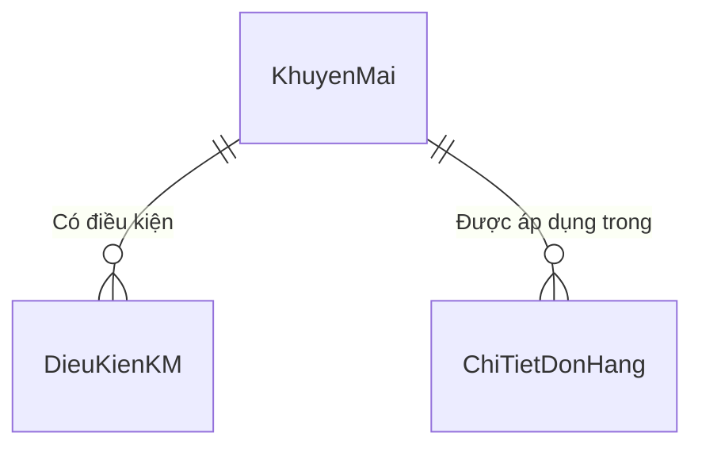

# Khu Du Lịch Đại Nam
# Đặc Tả Yêu Cầu Phần Mềm
# Mã dự án: DN01
# Mã tài liệu: DN01_SRS_KhuyenMai_v1.0

Hồ Chí Minh, Tháng 05/2026

---

## Lịch sử thay đổi

| Ngày hiệu lực | Hạng mục thay đổi | A/M/D | Mô tả | Phiên bản |
|---|---|---|---|---|
| 02/05/2026 | Phát hành lần đầu | A | | 1.0 |

*A - Thêm mới, M - Chỉnh sửa, D - Xóa bỏ*

---

## 0. Phạm vi tài liệu

Tài liệu đặc tả phân hệ Quản lý Khuyến Mãi thuộc hệ thống quản lý vận hành Khu Du lịch Đại Nam.

- **Phạm vi bao gồm:** khai báo chương trình khuyến mãi, thiết lập điều kiện áp dụng, lọc và tìm kiếm, xóa chương trình.
- **Không bao gồm:** tự động áp mã tại POS, tính điểm tích lũy, báo cáo doanh thu theo khuyến mãi.
- **Đối tượng đọc:** BA, Dev, Tester.

---

## Mục lục

1. [Quản lý Khuyến Mãi](#1-quản-lý-khuyến-mãi)
   - 1.1. [Màn hình danh sách khuyến mãi](#11-màn-hình-danh-sách-khuyến-mãi)
   - 1.2. [Màn hình chi tiết chương trình khuyến mãi](#12-màn-hình-chi-tiết-chương-trình-khuyến-mãi)
   - 1.3. [Xóa chương trình khuyến mãi](#13-xóa-chương-trình-khuyến-mãi)
2. [Yêu cầu khác](#2-yêu-cầu-khác)
   - 2.1. [Định dạng dữ liệu](#21-định-dạng-dữ-liệu)
   - 2.2. [Danh mục dữ liệu tham chiếu](#22-danh-mục-dữ-liệu-tham-chiếu)
   - 2.3. [Bảng mã thông báo lỗi](#23-bảng-mã-thông-báo-lỗi)

---

# 1. Quản lý Khuyến Mãi

Phân hệ cho phép Quản lý khai báo và duy trì các chương trình giảm giá tại điểm bán. Mỗi chương trình gồm thông tin định danh (mã, tên, loại giảm, giá trị, thời hạn) và một tập điều kiện ràng buộc đối tượng được hưởng. Khi thu ngân nhập mã tại POS hoặc checkout lưu trú, hệ thống đối chiếu toàn bộ điều kiện trước khi cấp giảm giá. Chương trình hết thời hạn hoặc bị tắt sẽ không được áp dụng dù mã vẫn tồn tại trong cơ sở dữ liệu.

---

## 1.1. Màn hình danh sách khuyến mãi

### 1.1.1. Tổng quan

Màn hình gồm hai vùng: bên trái là lưới danh sách toàn bộ chương trình khuyến mãi, bên phải là màn hình chi tiết. Khi chọn một dòng trên lưới, màn hình chi tiết bên phải tự nạp thông tin chương trình đó. Khi nhấn nút Thêm mới, màn hình chi tiết được xóa trắng sẵn sàng nhập liệu.

### 1.1.2. Tác nhân

- Quản lý (thêm, sửa, xóa chương trình khuyến mãi và điều kiện)

### 1.1.3. Biểu đồ use-case

```text
Quản lý ──── Tìm kiếm / Lọc danh sách
         ├── Thêm mới chương trình KM
         ├── Chỉnh sửa thông tin KM        <<include>> Thiết lập điều kiện
         └── Xóa chương trình KM
```

#### 1.1.3.1. Tiền điều kiện

- Người dùng đã đăng nhập và có quyền truy cập menu Danh mục.

#### 1.1.3.2. Hậu điều kiện

Dữ liệu chương trình khuyến mãi và điều kiện được lưu đồng bộ vào cơ sở dữ liệu.

#### 1.1.3.3. Điểm kích hoạt

Người dùng truy cập menu Danh mục, chọn mục Quản lý Khuyến mãi.

### 1.1.4. Luồng thao tác

#### 1.1.4.1. Tình huống 1 — Thêm mới chương trình (happy path)

| | Người dùng | Hệ thống |
|---|---|---|
| 1 | Nhấn nút Thêm mới. | Xóa trắng màn hình chi tiết bên phải. Lưới điều kiện bị xóa trắng. Con trỏ nhảy vào ô Mã KM. |
| 2 | Nhập Mã KM, Tên, chọn Loại giảm và Giá trị. Nhập Từ ngày, Đến ngày, Đơn tối thiểu. | Ghi nhận. |
| 3 | Tích ô Đang hoạt động nếu muốn kích hoạt ngay. | Ghi nhận. |
| 4 | Nhấn nút Lưu thông tin. | Kiểm tra hợp lệ. Lưu thành công. Tải lại lưới danh sách. Hiển thị MSG_KM_LUU_OK. |
| 5 | Nhấn nút Thêm điều kiện trên lưới điều kiện, chọn Loại điều kiện và Giá trị điều kiện. | Thêm dòng mới vào lưới. |
| 6 | Nhấn nút Lưu điều kiện. | Lưu toàn bộ dòng điều kiện vào cơ sở dữ liệu. Hiển thị MSG_KM_DK_LUU_OK. |

#### 1.1.4.2. Tình huống 2 — Lưu thất bại vì dữ liệu không hợp lệ

| | Người dùng | Hệ thống |
|---|---|---|
| 2a | Nhấn Lưu thông tin khi Mã KM để trống. | Dừng lưu. Focus vào ô Mã KM. Hiển thị ERR_KM_MA_RONG. |
| 2b | Nhấn Lưu thông tin khi Mã KM đã tồn tại. | Dừng lưu. Hiển thị ERR_KM_TRUNG_MA. |
| 2c | Nhấn Lưu thông tin khi Giá trị giảm bằng 0. | Dừng lưu. Hiển thị ERR_KM_GIA_TRI_SAI. |
| 2d | Nhấn Lưu thông tin khi Loại giảm là Phần trăm nhưng Giá trị vượt quá 100. | Dừng lưu. Hiển thị ERR_KM_PHANTRAM_VUOT. |
| 2e | Nhấn Lưu thông tin khi Từ ngày sau Đến ngày. | Dừng lưu. Hiển thị ERR_KM_NGAY_SAI. |

#### 1.1.4.3. Tình huống 3 — Lọc và tìm kiếm

| | Người dùng | Hệ thống |
|---|---|---|
| 1 | Chọn Đang hoạt động trên Combo Box lọc. | Lưới chỉ hiển thị chương trình có cờ bật và chưa quá Đến ngày. |
| 2 | Gõ từ khóa vào ô tìm kiếm. | Lưới lọc tức thì theo Mã KM hoặc Tên KM chứa từ khóa. |

### 1.1.5. Giao diện

#### 1.1.5.1. Mô tả màn hình — Thanh công cụ và bộ lọc (vùng trái)

| STT | Tên trường | Control type | Required | Data type | Default value | Mô tả |
|---|---|---|---|---|---|---|
| 1 | Thêm mới | Button | N/A | N/A | N/A | Xóa trắng màn hình chi tiết, chuẩn bị nhập mới. |
| 2 | Xóa | Button | N/A | N/A | N/A | Xóa chương trình đang chọn. Luôn hỏi xác nhận trước. |
| 3 | Tìm kiếm | Text Edit | No | Text | Blank | Lọc lưới theo Mã KM hoặc Tên KM. (*) Placeholder: "Tìm theo mã hoặc tên..." |
| 4 | Lọc trạng thái | Combo Box | No | Text | Tất cả | Ba giá trị: Tất cả, Đang hoạt động, Hết hạn. |

#### 1.1.5.2. Mô tả màn hình — Lưới danh sách (Grid Control, Read-only)

| STT | Tên cột | Control type | Data type | Mô tả |
|---|---|---|---|---|
| 1 | Mã KM | Label | Text | Mã định danh duy nhất. |
| 2 | Tên KM | Label | Text | Tên mô tả chương trình. |
| 3 | Loại giảm | Label | Text | Phần trăm hoặc Số tiền. |
| 4 | Giá trị | Label | Decimal | Số tiền hoặc tỷ lệ phần trăm. |
| 5 | Trạng thái | Label | Boolean | Đang hoạt động (xanh lá) hoặc Hết hạn / Tắt (đỏ). |

### 1.1.6. Mô tả nghiệp vụ

| STT | Tên | Quy tắc |
|---|---|---|
| 1 | Split View | Lưới bên trái, màn hình chi tiết bên phải. Màn hình chi tiết hiển thị ở trạng thái trống khi mới mở. |
| 2 | Lọc Đang hoạt động | Chương trình được tính là đang hoạt động khi cờ Đang hoạt động được bật và Đến ngày lớn hơn hoặc bằng thời điểm hiện tại. |
| 3 | Lọc Hết hạn | Chương trình được tính là hết hạn khi cờ bị tắt hoặc Đến ngày nhỏ hơn thời điểm hiện tại. |
| 4 | Tìm kiếm | Lưới lọc tức thì, không cần nhấn nút. Không phân biệt hoa thường. |
| 5 | Lưới rỗng | Nếu không có kết quả, lưới hiển thị dòng chữ nghiêng ở giữa: "Chưa có chương trình khuyến mãi nào." |

### 1.1.7. Quy tắc kiểm tra dữ liệu

| STT | Quy tắc | Mã thông báo |
|---|---|---|
| 1 | Mã KM không được để trống | ERR_KM_MA_RONG |
| 2 | Tên KM không được để trống | ERR_KM_TEN_RONG |
| 3 | Giá trị giảm phải lớn hơn 0 | ERR_KM_GIA_TRI_SAI |
| 4 | Nếu Loại giảm là Phần trăm thì Giá trị không được vượt quá 100 | ERR_KM_PHANTRAM_VUOT |
| 5 | Ngày bắt đầu phải trước ngày kết thúc | ERR_KM_NGAY_SAI |
| 6 | Mã KM đã tồn tại trong hệ thống | ERR_KM_TRUNG_MA |

### 1.1.8. Liên kết use-case

- Màn hình chi tiết chương trình khuyến mãi (1.2)
- Xóa chương trình khuyến mãi (1.3)

---

## 1.2. Màn hình chi tiết chương trình khuyến mãi

### 1.2.1. Tổng quan

Màn hình chi tiết nằm ở nửa phải của Split View, gồm hai phần trên cùng một màn hình, không có tab:

- **Phần trên — Thông tin chung:** các trường nhập liệu mô tả chương trình (mã, tên, loại giảm, giá trị, thời hạn, trạng thái).
- **Phần dưới — Lưới điều kiện áp dụng:** lưới cho phép thêm, xóa các điều kiện ràng buộc đối tượng được hưởng khuyến mãi (hạng thành viên).

Hai phần dùng chung một màn hình. Mỗi phần có nút Lưu riêng: nút Lưu thông tin lưu phần trên, nút Lưu điều kiện lưu lưới dưới.

### 1.2.2. Tác nhân

- Quản lý

### 1.2.3. Luồng thao tác

#### 1.2.3.1. Tình huống 1 — Chỉnh sửa thông tin chương trình đang tồn tại

| | Người dùng | Hệ thống |
|---|---|---|
| 1 | Nhấp chọn một dòng trên lưới danh sách bên trái. | Màn hình chi tiết nạp đầy đủ thông tin. Mã KM bị khóa Read-only. |
| 2 | Sửa Tên, Giá trị, Đến ngày hoặc các trường khác. | Ghi nhận thay đổi. |
| 3 | Nhấn nút Lưu thông tin. | Kiểm tra hợp lệ. Lưu thành công. Tải lại lưới danh sách. Hiển thị MSG_KM_LUU_OK. |

#### 1.2.3.2. Tình huống 2 — Thêm điều kiện cho chương trình

| | Người dùng | Hệ thống |
|---|---|---|
| 1 | Chọn chương trình trên lưới (hoặc vừa lưu xong chương trình mới). | Màn hình chi tiết nạp dữ liệu. Lưới điều kiện ở phần dưới hiển thị các điều kiện hiện có (nếu có). |
| 2 | Nhấn nút Thêm điều kiện. | Thêm một dòng mới vào lưới điều kiện với giá trị mặc định trống. |
| 3 | Chọn Loại điều kiện là HangThanhVien, chọn Phép so là bằng, nhập Giá trị điều kiện là Vang. | Ghi nhận. |
| 4 | Nhấn nút Lưu điều kiện. | Lưu toàn bộ dòng trong lưới vào cơ sở dữ liệu. Hiển thị MSG_KM_DK_LUU_OK. |

#### 1.2.3.3. Tình huống 3 — Xóa một điều kiện

| | Người dùng | Hệ thống |
|---|---|---|
| 1 | Nhấp chọn một dòng trên lưới điều kiện. | Dòng được highlight. |
| 2 | Nhấn nút Xóa điều kiện. | Xóa dòng khỏi lưới (chỉ xóa trên giao diện, chưa ghi vào cơ sở dữ liệu). |
| 3 | Nhấn nút Lưu điều kiện. | Ghi nhận danh sách điều kiện mới vào cơ sở dữ liệu. |

### 1.2.4. Giao diện

#### 1.2.4.1. Mô tả màn hình — Phần thông tin chung

| STT | Tên trường | Control type | Required | Data type | Default value | Mô tả |
|---|---|---|---|---|---|---|
| 1 | Mã KM | Text Edit | Yes | Nvarchar(20) | Blank (thêm) / Read-only (sửa) | Mã định danh duy nhất. Bị khóa sau khi lưu lần đầu. (*) Tooltip: "Mã định danh duy nhất của chương trình khuyến mãi" |
| 2 | Tên KM | Text Edit | Yes | Nvarchar(150) | Blank | Tên mô tả ngắn gọn. (*) Tooltip: "Tên mô tả ngắn gọn cho chương trình khuyến mãi" |
| 3 | Loại giảm | Combo Box | Yes | Nvarchar(20) | Blank | Hai giá trị: Phần trăm hoặc Số tiền. Quyết định cách tính giảm giá khi áp dụng. |
| 4 | Giá trị giảm | Spin Edit | Yes | Decimal(15,0) | 0 | Nếu Loại giảm là Phần trăm thì giá trị từ 1 đến 100. Nếu là Số tiền thì là số nguyên dương tính bằng đồng. (*) Tooltip: "Giá trị giảm (% hoặc số tiền cố định)" |
| 5 | Từ ngày | Date Edit | Yes | DateTime | Ngày hiện tại | Ngày bắt đầu áp dụng. Định dạng dd/MM/yyyy. |
| 6 | Đến ngày | Date Edit | Yes | DateTime | Ngày hiện tại + 1 tháng | Ngày kết thúc. Phải sau Từ ngày. Định dạng dd/MM/yyyy. |
| 7 | Đơn tối thiểu | Spin Edit | No | Decimal(15,0) | 0 | Tổng đơn hàng tối thiểu để mã được chấp nhận. Nếu để 0 thì không yêu cầu đơn tối thiểu. (*) Tooltip: "Tổng tiền tối thiểu của đơn hàng để áp dụng KM" |
| 8 | Số lần tối đa | Spin Edit | No | Integer | Blank | Số lần toàn hệ thống được dùng mã này. Nếu để trống thì không giới hạn lượt. (*) Tooltip: "Bỏ trống = không giới hạn số lần sử dụng" |
| 9 | Đang hoạt động | Check Box | No | Boolean | Checked | Bật thì chương trình có thể áp dụng tại POS nếu còn trong thời hạn. Tắt thì hệ thống từ chối kể cả chưa hết hạn. |
| 10 | Cho phép kết hợp KM khác | Check Box | No | Boolean | Unchecked | Bật thì chương trình có thể áp dụng đồng thời với chương trình khác trên cùng đơn hàng. (*) Tooltip: "Cho phép cộng dồn với khuyến mãi khác (Stackable)" |
| 11 | Lưu thông tin | Button | N/A | N/A | N/A | Lưu phần thông tin chung. Hotkey: Ctrl+S. |

#### 1.2.4.2. Mô tả màn hình — Phần lưới điều kiện (Grid Control, Editable)

| STT | Tên cột | Control type | Required | Data type | Default value | Mô tả |
|---|---|---|---|---|---|---|
| 1 | Loại điều kiện | Combo Box (in-grid) | Yes | Nvarchar(30) | Blank | Hiện tại hỗ trợ một loại duy nhất: HangThanhVien (Hạng thành viên). |
| 2 | Phép so | Combo Box (in-grid) | Yes | Nvarchar(5) | = | Hai giá trị: bằng (=) hoặc thuộc danh sách (IN). Phép IN cho phép nhập nhiều giá trị cách nhau bằng dấu phẩy ở cột Giá trị. |
| 3 | Giá trị điều kiện | Text Edit (in-grid) | Yes | Nvarchar(100) | Blank | Giá trị so sánh. Ví dụ: Vang, KimCuong. Nếu Phép so là IN thì nhập nhiều giá trị cách nhau bằng dấu phẩy: Vang,KimCuong. |

**Thao tác bổ sung lưới:**

| STT | Tên trường | Control type | Required | Data type | Default value | Mô tả |
|---|---|---|---|---|---|---|
| 1 | Thêm điều kiện | Button | N/A | N/A | N/A | Thêm một dòng mới vào lưới điều kiện. |
| 2 | Xóa điều kiện | Button | N/A | N/A | N/A | Xóa dòng đang chọn khỏi lưới (chưa ghi cơ sở dữ liệu). |
| 3 | Lưu điều kiện | Button | N/A | N/A | N/A | Lưu toàn bộ danh sách điều kiện trong lưới vào cơ sở dữ liệu. |

### 1.2.5. Mô tả nghiệp vụ

| STT | Tên | Quy tắc |
|---|---|---|
| 1 | Mã KM bất biến | Sau khi lưu thành công lần đầu, Mã KM bị khóa vĩnh viễn để tránh làm mất lịch sử giao dịch đã dùng mã này. |
| 2 | Giá trị Phần trăm | Nếu Loại giảm là Phần trăm, Giá trị phải từ 1 đến 100. Hệ thống chặn nhập số ngoài khoảng này. |
| 3 | Trạng thái và thời hạn | Một chương trình chỉ được áp dụng tại POS khi đồng thời cờ Đang hoạt động được bật và thời điểm hiện tại nằm trong khoảng Từ ngày đến Đến ngày. |
| 4 | Kết hợp điều kiện AND | Nếu một chương trình có nhiều dòng điều kiện, tất cả điều kiện phải đồng thời thỏa mãn thì mã mới được chấp nhận. Không hỗ trợ điều kiện OR trong cùng một chương trình. Nếu muốn dùng OR thì tạo thêm chương trình khuyến mãi riêng. |
| 5 | Lưu điều kiện độc lập | Nút Lưu điều kiện lưu riêng lưới điều kiện, không phụ thuộc nút Lưu thông tin. Hai thao tác hoàn toàn độc lập. |
| 6 | Lưới điều kiện rỗng | Lưới hiển thị dòng chữ nghiêng ở giữa: "Chưa có điều kiện nào." khi không có dòng nào. |

### 1.2.6. Quy tắc kiểm tra dữ liệu

| STT | Quy tắc | Mã thông báo |
|---|---|---|
| 1 | Mã KM không được để trống | ERR_KM_MA_RONG |
| 2 | Tên KM không được để trống | ERR_KM_TEN_RONG |
| 3 | Giá trị giảm phải lớn hơn 0 | ERR_KM_GIA_TRI_SAI |
| 4 | Nếu Loại giảm là Phần trăm thì Giá trị không được vượt quá 100 | ERR_KM_PHANTRAM_VUOT |
| 5 | Ngày bắt đầu phải trước ngày kết thúc | ERR_KM_NGAY_SAI |
| 6 | Mã KM đã tồn tại trong hệ thống | ERR_KM_TRUNG_MA |

### 1.2.7. Liên kết use-case

- Màn hình danh sách khuyến mãi (1.1)
- Xóa chương trình khuyến mãi (1.3)

---

## 1.3. Xóa chương trình khuyến mãi

### 1.3.1. Tổng quan

Chức năng xóa vĩnh viễn (hard delete) chương trình khuyến mãi. Hệ thống kiểm tra ràng buộc trước khi cho phép xóa.

### 1.3.2. Tác nhân

- Quản lý

### 1.3.3. Luồng thao tác

| | Người dùng | Hệ thống |
|---|---|---|
| 1 | Chọn chương trình trên lưới danh sách. Nhấn nút Xóa. | Hiển thị hộp thoại xác nhận. |
| 2a | Nhấn nút Có trong hộp thoại. | Kiểm tra ràng buộc. Nếu chương trình chưa từng được sử dụng trong bất kỳ đơn hàng nào thì xóa vĩnh viễn, tải lại lưới, hiển thị MSG_KM_XOA_OK. |
| 2b | — | Nếu chương trình đã từng được áp dụng cho ít nhất một đơn hàng, hệ thống từ chối xóa và chuyển trạng thái về Tắt thay thế, thông báo lý do cho người dùng. |
| 3 | Nhấn nút Không trong hộp thoại. | Hủy thao tác, giữ nguyên. |

### 1.3.4. Mô tả nghiệp vụ

| STT | Tên | Quy tắc |
|---|---|---|
| 1 | Kiểm tra lịch sử sử dụng | Nếu mã khuyến mãi đã được áp dụng cho ít nhất một giao dịch, hệ thống không xóa vật lý mà chỉ tắt cờ Đang hoạt động để bảo toàn lịch sử hóa đơn. |
| 2 | Chưa từng dùng | Nếu chưa có giao dịch nào dùng mã, hệ thống xóa vĩnh viễn cả chương trình lẫn toàn bộ điều kiện liên quan. |
| 3 | Bắt buộc chọn trước | Nếu chưa chọn chương trình nào trên lưới mà nhấn Xóa, hệ thống hiển thị thông báo nhắc chọn trước. |

### 1.3.5. Quy tắc kiểm tra dữ liệu

| STT | Quy tắc | Mã thông báo |
|---|---|---|
| 1 | Chưa chọn chương trình nào để xóa | MSG_KM_CHON_TRUOC |
| 2 | Hỏi xác nhận trước khi xóa | MSG_KM_XOA_CONFIRM |
| 3 | Xóa thành công | MSG_KM_XOA_OK |

### 1.3.6. Liên kết use-case

- Màn hình danh sách khuyến mãi (1.1)

---

# 2. Yêu cầu khác

## 2.1. Định dạng dữ liệu

| Loại | Định dạng | Ví dụ |
|---|---|---|
| Ngày | dd/MM/yyyy | 02/05/2026 |
| Số tiền | Phân cách hàng nghìn, không thập phân, kèm ₫ | 50,000₫ |
| Phần trăm | Số nguyên từ 1 đến 100, kèm ký hiệu % | 15% |

## 2.2. Danh mục dữ liệu tham chiếu

### 2.2.1. Loại giảm giá

| Mã | Tên hiển thị |
|---|---|
| PhanTram | Phần trăm |
| SoTien | Số tiền cố định |

### 2.2.2. Loại điều kiện áp dụng

| Mã | Tên hiển thị | Mô tả |
|---|---|---|
| HangThanhVien | Hạng thành viên | Chỉ áp dụng cho khách đạt hạng thành viên nhất định. |

### 2.2.3. Phép so sánh điều kiện

| Mã | Tên hiển thị | Mô tả |
|---|---|---|
| = | Bằng | Giá trị thành viên phải đúng bằng giá trị điều kiện. |
| IN | Thuộc danh sách | Giá trị thành viên nằm trong danh sách cách nhau bằng dấu phẩy. |

### 2.2.4. Hạng thành viên tham chiếu

| Mã | Tên hiển thị |
|---|---|
| Thuong | Thường |
| Bac | Bạc |
| Vang | Vàng |
| KimCuong | Kim Cương |

## 2.3. Bảng mã thông báo lỗi

| Mã thông báo | Nội dung tiếng Việt |
|---|---|
| ERR_KM_MA_RONG | Mã KM không được để trống |
| ERR_KM_TEN_RONG | Tên không được để trống |
| ERR_KM_GIA_TRI_SAI | Giá trị giảm phải lớn hơn 0 |
| ERR_KM_PHANTRAM_VUOT | Giảm phần trăm không được vượt quá 100 |
| ERR_KM_NGAY_SAI | Ngày bắt đầu phải trước ngày kết thúc |
| ERR_KM_TRUNG_MA | Mã KM đã tồn tại. Vui lòng dùng mã khác |
| MSG_KM_LUU_OK | Lưu chương trình khuyến mãi thành công |
| MSG_KM_XOA_OK | Xóa chương trình khuyến mãi thành công |
| MSG_KM_DK_LUU_OK | Lưu điều kiện thành công |
| MSG_KM_CHON_TRUOC | Vui lòng chọn một chương trình KM trước |
| MSG_KM_XOA_CONFIRM | Bạn có chắc muốn xóa chương trình này không? |

## 2.4. Phân quyền truy cập

| Chức năng | Quản lý | Thu ngân | Thủ kho |
|---|---|---|---|
| Thêm / Sửa / Xóa chương trình KM | Có | Không | Không |
| Xem danh sách KM | Có | Không | Không |
| Áp mã KM tại POS | — | Có | Không |

## 2.5. Sơ đồ thực thể liên kết (ERD)


