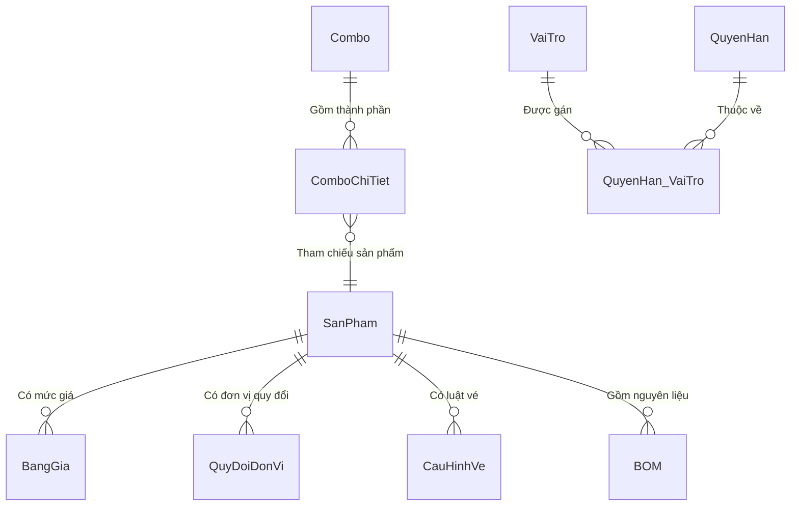

# Khu Du Lịch Đại Nam
# Đặc Tả Yêu Cầu Phần Mềm — Hệ Thống & Danh Mục
# Mã dự án: DN01
# Mã tài liệu: DN01_SRS_HeThong_DanhMuc_v1.6

Hồ Chí Minh, Tháng 04/2026

---

## Lịch sử thay đổi

| Ngày hiệu lực | Hạng mục thay đổi | A/M/D | Mô tả | Phiên bản |
|---|---|---|---|---|
| 19/04/2026 | CN09 Quản lý Sản phẩm – phát hành lần đầu | A | | 1.0 |
| 23/04/2026 | CN06 Quản lý Combo – phát hành lần đầu | A | | 1.0 |
| 23/04/2026 | CN02 Quản lý Phân quyền – phát hành lần đầu | A | | 1.0 |
| 24/04/2026 | Gộp ba tài liệu thành một và tinh chỉnh chuẩn SRS | M | | 1.2 |
| 25/04/2026 | Cập nhật luồng nghiệp vụ F&B (Poka-Yoke Tồn kho & BOM) | M | Theo CR-042: Nhân viên kêu giao diện khó dùng, hay quên nhập BOM. Phân tách loại SP để tự động hóa chặn lỗi. | 1.3 |
| 26/04/2026 | Tích hợp module CN04 (Quản lý Khách hàng & Thẻ RFID) | M | Chuẩn hóa CSDL, gom lỗi và từ điển vào Master SRS | 1.4 |
| 27/04/2026 | Tích hợp module CN11 (Danh mục Kho hàng) | M | Gộp phân hệ danh mục kho hàng vào hệ thống cốt lõi | 1.5 |
| 27/04/2026 | Tích hợp module CN10 (Trung tâm Kho) | M | Gộp phân hệ quản lý kho (tạo phiếu, tồn kho, lịch sử, cảnh báo) vào tài liệu hợp nhất | 1.6 |

*A - Thêm mới, M - Chỉnh sửa, D - Xóa bỏ*

---

## 0. Phạm vi tài liệu

Tài liệu này đặc tả **các phân hệ nền tảng** thuộc hệ thống quản lý vận hành Khu Du lịch Đại Nam, bao gồm sáu module con:

- **CN09 – Quản lý Sản phẩm & Dịch vụ**: khai báo sản phẩm, bảng giá, quy đổi đơn vị, cấu hình vé và F&B.
- **CN06 – Quản lý Combo Sản phẩm**: tạo và chỉnh sửa combo; thiết lập thành phần rổ combo; phân bổ tỷ lệ doanh thu.
- **CN02 – Phân quyền hệ thống**: quản lý vai trò, cấu hình phân quyền truy cập chức năng.
- **CN04 – Quản lý Khách hàng**: lưu trữ hồ sơ, quản lý thẻ RFID, ví điện tử, và điểm tích lũy khách hàng.
- **CN11 – Quản lý Danh mục Kho hàng**: thêm mới, chỉnh sửa, ngưng hoạt động kho hàng vật lý.
- **CN10 – Trung tâm Kho**: tạo phiếu kho (nhập, xuất, chuyển, kiểm kê), tra cứu tồn kho, lịch sử giao dịch, cảnh báo hạn sử dụng và tồn tối thiểu.

**Không bao gồm:** thanh toán, báo cáo tài chính, bán hàng POS (được đặc tả tại các tài liệu riêng).

**Đối tượng đọc:** BA, Lập trình viên (Dev), Chuyên viên kiểm thử (Tester).

---

## Mục lục

1. [CN09 – Quản lý Sản phẩm & Dịch vụ](#1-cn09--quản-lý-sản-phẩm--dịch-vụ)
   - 1.1. Màn hình danh sách sản phẩm
   - 1.2. Tab thông tin chung
   - 1.3. Tab bảng giá
   - 1.4. Tab quy đổi đơn vị tính
   - 1.5. Tab cấu hình vận hành – biến thể Vé
   - 1.6. Tab cấu hình vận hành – biến thể F&B
   - 1.7. Tab cấu hình vận hành – biến thể Lưu trú
   - 1.8. Tab cấu hình vận hành – biến thể Cho thuê
   - 1.9. Xóa sản phẩm
2. [CN06 – Quản lý Combo Sản phẩm](#2-cn06--quản-lý-combo-sản-phẩm)
   - 2.1. Màn hình danh sách Combo
   - 2.2. Thông tin Combo
   - 2.3. Kho Sản phẩm và Rổ Combo
   - 2.4. Thêm mới Combo
   - 2.5. Chỉnh sửa Combo
   - 2.6. Xóa Combo
3. [CN02 – Phân quyền hệ thống](#3-cn02--phân-quyền-hệ-thống)
   - 3.1. Màn hình thiết lập phân quyền
   - 3.2. Xem quyền theo vai trò
   - 3.3. Cập nhật quyền cho vai trò
4. [CN04 – Quản lý Khách hàng](#4-cn04--quản-lý-khách-hàng)
   - 4.1. Màn hình danh sách khách hàng
   - 4.2. Màn hình chi tiết khách hàng
   - 4.3. Form thêm mới và chỉnh sửa khách hàng
   - 4.4. Nạp tiền ví điện tử
   - 4.5. Cấp ví và thẻ RFID
   - 4.6. Khóa và mở khóa thẻ RFID
   - 4.7. Điều chỉnh điểm tích lũy
   - 4.8. Xóa khách hàng
5. [CN11 – Quản lý Danh mục Kho hàng](#5-cn11--quản-lý-danh-mục-kho-hàng)
   - 5.1. Màn hình danh sách kho
   - 5.2. Màn hình chi tiết kho hàng
   - 5.3. Ngưng hoạt động kho
6. [CN10 – Trung tâm Kho](#6-cn10--trung-tâm-kho)
   - 6.1. Màn hình trung tâm kho
   - 6.2. Màn hình tạo phiếu kho
   - 6.3. Màn hình tồn kho
   - 6.4. Màn hình lịch sử giao dịch
   - 6.5. Màn hình cảnh báo
   - 6.6. Vòng đời chứng từ kho
   - 6.7. Tích hợp CN06 ↔ CN10 — Trừ kho BOM
7. [Yêu cầu chung](#7-yêu-cầu-chung)
   - 7.1. Định dạng dữ liệu
   - 7.2. Danh mục dữ liệu tham chiếu
   - 7.3. Bảng mã thông báo lỗi (hợp nhất)
   - 7.4. Phân quyền truy cập
   - 7.5. Yêu cầu phi chức năng
   - 7.6. Sơ đồ thực thể liên kết (ERD)
---

# 1. CN09 – Quản lý Sản phẩm & Dịch vụ

Phân hệ CN09 đóng vai trò khởi tạo dữ liệu lõi cho toàn hệ thống. Mọi sản phẩm từ Vé, F&B đến Dịch vụ đều được định nghĩa tại đây kèm bảng giá và định mức tiêu hao nguyên liệu (BOM). Đây là tiền đề bắt buộc để các module Bán hàng (POS) và Quản lý Kho có thể hoạt động.

---

## 1.1. Màn hình danh sách sản phẩm

### 1.1.1. Tổng quan

Màn hình này hiển thị toàn bộ danh mục sản phẩm dưới dạng lưới. Bên trái là lưới danh sách, bên phải là panel chi tiết (Split View). Khi người dùng chọn một dòng trên lưới, panel phải tự nạp thông tin chi tiết của sản phẩm đó.

### 1.1.2. Tác nhân

- Quản lý (thêm, sửa, xóa sản phẩm)
- Nhân viên kế toán (xem, lập quy đổi, lập BOM)

### 1.1.3. Biểu đồ use-case

[Placeholder: Chèn ảnh Biểu đồ Use-case / Activity Diagram tại đây]

- **Tác nhân:** Quản lý, Nhân viên kế toán
- **Chức năng:**
  - Tìm kiếm sản phẩm
  - Thêm mới sản phẩm
  - Chỉnh sửa sản phẩm
  - Thiết lập bảng giá (<<include>> Thêm/Sửa)
  - Lập bảng quy đổi ĐVT (<<include>> Thêm/Sửa)
  - Cấu hình quyền quẹt vé (<<extend>> Thêm/Sửa - chỉ khi SP là Vé)
  - Cấu hình định mức BOM (<<extend>> Thêm/Sửa - chỉ khi SP là F&B)
  - Xóa ẩn sản phẩm

#### 1.1.3.1. Tiền điều kiện

- Người dùng đã đăng nhập.
- Các danh mục đơn vị tính, cổng xoay, khu vực POS, cấu hình thuế đã tồn tại.

#### 1.1.3.2. Hậu điều kiện

Dữ liệu sản phẩm được lưu đồng bộ vào cơ sở dữ liệu (bảng SanPham, BangGia, QuyDoiDonVi và các bảng phụ thuộc loại hình).

#### 1.1.3.3. Điểm kích hoạt

Người dùng truy cập menu Danh mục, chọn mục Hàng hóa và Dịch vụ.

### 1.1.4. Luồng thao tác

#### 1.1.4.1. Tình huống 1 — Thêm mới vé dịch vụ

| | Người dùng | Hệ thống |
|---|---|---|
| 1 | Nhấn nút Thêm mới. | Bật panel chi tiết bên phải. Tab Thông tin chung mở mặc định. Các trường ở trạng thái trống. |
| 2 | Nhập mã SP, tên vé, chọn ĐVT là Lượt. Chọn loại SP là Vé dịch vụ. | Tự sinh tiền tố mã: VE_. Tab 4 đổi thành Cấu hình vé. Checkbox Là vật tư tự tắt và khóa xám. |
| 3 | Chuyển sang Tab cấu hình vé, thiết lập đối tượng: Người lớn. Thêm dòng trên lưới quẹt cổng: Khu Trượt Nước (1 lượt). | Ghi nhận. |
| 4 | Chuyển sang Tab bảng giá, thêm dòng giá: Loại Mặc định, giá 150,000. | Kiểm tra thời hiệu không chồng lấp. |
| 5a | Nhấn nút Lưu (Dữ liệu hợp lệ). | Lưu thành công, tải lại lưới danh sách và hiển thị thông báo MSG_LUU_THANH_CONG. |
| 5b | Nhấn nút Lưu (Mã SP trùng). | Dừng lưu, focus vào ô Mã SP, hiển thị thông báo ERR_TRUNG_MASP. |
| 5c | Nhấn nút Lưu (Bảng giá trống). | Tự ép trạng thái về Tạm ngưng, hỏi xác nhận trước khi lưu. |
| 5d | Lỗi server / Timeout. | Hiển thị thông báo MSG_LUU_THAT_BAI, giữ nguyên dữ liệu trên form để tránh mất công sức nhập liệu. |

#### 1.1.4.2. Tình huống 2 — Khai báo món ăn F&B

| | Người dùng | Hệ thống |
|---|---|---|
| 1 | Nhấn nút Thêm mới. Nhập tên Bia Heineken, chọn ĐVT gốc là Lon, loại SP là Đồ uống. Tích Là vật tư, chọn thuế VAT 8%. | Tự sinh tiền tố DU_. Tab 4 đổi thành Cấu hình F&B. |
| 2 | Chuyển sang Tab quy đổi ĐVT, nhấn nút Thêm dòng, chọn ĐVT đích là Thùng, hệ số bằng 24. | Kiểm tra hệ số lớn hơn 0. |
| 3 | Tích ô Áp dụng toàn bộ điểm bán. | Khóa xám danh sách điểm bán, mặc định áp dụng tất cả. |
| 4 | Nhấn nút Lưu. | Lưu đồng bộ tất cả tab, thông báo thành công. |

#### 1.1.4.3. Tình huống 3 — Chỉnh sửa sản phẩm

| | Người dùng | Hệ thống |
|---|---|---|
| 1 | Nhấp chọn một dòng trên lưới danh sách. | Panel phải tự nạp thông tin sản phẩm đó. Mã SP và Loại SP bị khóa (Read-only). |
| 2 | Sửa các trường cần thay đổi (tên, giá, quy đổi...). | Kích hoạt cờ đã thay đổi. |
| 3 | Nhấn nút Lưu. | Hệ thống kiểm tra, lưu và thông báo thành công, sau đó tải lại lưới. |

#### 1.1.4.4. Tình huống 4 — Cảnh báo mất dữ liệu khi chuyển dòng

| | Người dùng | Hệ thống |
|---|---|---|
| 1 | Đang sửa SP A chưa lưu, nhấp sang dòng SP B trên lưới. | Hiển thị hộp thoại xác nhận với 3 nút: Có, Không, Hủy. |
| 2a | Nhấn nút Có. | Lưu SP A, nếu hợp lệ thì chuyển sang SP B. Nếu lỗi thì giữ nguyên tại SP A. |
| 2b | Nhấn nút Không. | Bỏ qua thay đổi, chuyển sang SP B. |
| 2c | Nhấn nút Hủy. | Giữ nguyên tại SP A, không chuyển dòng. |

### 1.1.5. Giao diện

[Placeholder: Chèn ảnh Prototype / Wireframe giao diện tại đây]

#### 1.1.5.1. Mô tả màn hình — Thanh công cụ

| STT | Tên trường | Control type | Required | Data type | Default value | Mô tả / Tooltip |
|---|---|---|---|---|---|---|
| 1 | Thêm mới | Button | N/A | N/A | N/A | Bật panel chi tiết ở chế độ thêm mới. |
| 2 | Làm mới | Button | N/A | N/A | N/A | Đặt bộ lọc về Tất cả, tải lại dữ liệu. |
| 3 | Tìm kiếm | Text field | No | Text | Blank | Lọc trực tiếp trên lưới theo Mã SP hoặc Tên SP. (*) Tooltip: "Gõ mã hoặc tên để tìm nhanh" |

#### 1.1.5.2. Mô tả màn hình — Bộ lọc nhanh

| STT | Tên trường | Control type | Required | Data type | Default value | Mô tả |
|---|---|---|---|---|---|---|
| 1 | Tất cả | Button (Toggle) | N/A | N/A | Đang chọn | Hiển thị tất cả loại sản phẩm |
| 2 | Vé | Button (Toggle) | N/A | N/A | N/A | Lọc sản phẩm thuộc nhóm Vé vào khu |
| 3 | Đồ ăn | Button (Toggle) | N/A | N/A | N/A | Lọc nhóm Ăn uống |
| 4 | Đồ uống | Button (Toggle) | N/A | N/A | N/A | Lọc nhóm Đồ uống |
| 5 | Cho thuê | Button (Toggle) | N/A | N/A | N/A | Lọc nhóm Tủ đồ / Cho thuê |
| 6 | Lưu trú | Button (Toggle) | N/A | N/A | N/A | Lọc nhóm Lưu trú |
| 7 | Vật tư | Button (Toggle) | N/A | N/A | N/A | Lọc nhóm Nguyên liệu |

Nút đang chọn được tô nổi bật (màu primary), các nút khác ở trạng thái mờ.

#### 1.1.5.3. Mô tả màn hình — Lưới sản phẩm (Grid Control, Read-only)

| STT | Tên cột | Control type | Data type | Mô tả |
|---|---|---|---|---|
| 1 | Mã SP | Label | Text | Mã định danh sản phẩm |
| 2 | Tên SP | Label | Text | Tên hiển thị |
| 3 | Loại SP | Label | Text | Nhóm loại sản phẩm. Cột này được nhóm (group) để lưới hiển thị dạng cây phân cấp. Giá trị hiển thị được dịch đa ngôn ngữ. |
| 4 | Trạng thái | Label | Text | Đang bán, Tạm ngưng, hoặc Ngừng bán. Giá trị hiển thị được dịch đa ngôn ngữ. |
| 5 | Hành động | Button (Delete) | N/A | Nút Xóa cố định bên phải. Nhấn sẽ hiển hộp thoại xác nhận trước khi xóa ẩn. |

#### 1.1.5.4. Row style — Lưới sản phẩm

| Trạng thái | Màu chữ |
|---|---|
| DangBan | Xanh lá (Success) |
| TamNgung | Vàng đậm (Amber) |
| NgungBan | Đỏ (Danger) |

#### 1.1.5.5. Mô tả màn hình — Thanh trạng thái

| STT | Tên trường | Control type | Data type | Mô tả |
|---|---|---|---|---|
| 1 | Tổng SP | Label | Text | Hiển thị: "Tổng {N}" với N = số sản phẩm trên lưới |

### 1.1.6. Mô tả nghiệp vụ

| STT | Tên | Quy tắc |
|---|---|---|
| 1 | Split View | Lưới bên trái, panel chi tiết bên phải. Panel chi tiết ẩn cho đến khi người dùng chọn 1 dòng hoặc nhấn nút Thêm mới. |
| 2 | Nhóm theo loại | Cột Loại SP được nhóm (GroupIndex = 0), lưới hiển thị dạng cây. Tất cả nhóm mở rộng mặc định. |
| 3 | Lọc nhanh | Nhấn nút lọc, hệ thống tải lại dữ liệu theo loại SP. Nút đang chọn được highlight. |
| 4 | Tìm kiếm | Gõ ký tự vào ô tìm, lưới tự lọc ngay (client-side filter trên cột Mã SP và Tên SP). |
| 5 | Đa ngôn ngữ | Khi ngôn ngữ thay đổi: tải lại toàn bộ lưới, label, nút bấm, bộ lọc, và panel chi tiết. |
| 6 | Dirty tracking | Khi chuyển dòng mà panel chi tiết đang có dữ liệu chưa lưu, hệ thống hiển thị hộp thoại xác nhận 3 nút (Có, Không, Hủy). |

### 1.1.7. Quy tắc kiểm tra

| STT | Quy tắc | Mã thông báo |
|---|---|---|
| 1 | Không có quy tắc kiểm tra đặc biệt tại màn hình danh sách | — |

### 1.1.8. Liên kết use-case

- Màn hình chi tiết sản phẩm
- Xóa sản phẩm

---

## 1.2. Màn hình chi tiết sản phẩm — Tab thông tin chung

### 1.2.1. Tổng quan

Panel này được nạp vào nửa phải của Split View. Gồm 4 tab: Thông tin chung, Bảng giá, Quy đổi ĐVT, và Cấu hình vận hành. Tab Cấu hình vận hành (tab 4) là panel động, hiển thị nội dung khác nhau tùy loại SP.

### 1.2.2. Giao diện

#### 1.2.2.1. Mô tả màn hình — Tab thông tin chung

| STT | Tên trường | Control type | Required | Data type | Default value | Mô tả / Tooltip |
|---|---|---|---|---|---|---|
| 1 | Ảnh đại diện | Picture Edit | No | Image | Blank | Nhấn chuột vào ảnh sẽ mở hộp thoại chọn file (jpg, png, gif, webp). (*) Tooltip: "Click chọn ảnh đại diện" |
| 2 | Mã SP | Text field | Yes | Text | Blank (thêm mới) / Read-only (sửa) | Khi thêm mới: tự sinh tiền tố theo loại SP (VE_, FB_, DU_...). Nhân viên chỉ gõ phần đuôi. Khi sửa: khóa cứng, không cho thay đổi. |
| 3 | Tên SP | Text field | Yes | Text | Blank | Tối đa 150 ký tự. |
| 4 | Loại SP | Image Combo Box | Yes | Text | Blank | Quyết định nội dung Tab 4 (Cấu hình vận hành). Khóa cứng khi ở chế độ sửa. (*) Tooltip: không có — thao tác tự giải thích |
| 5 | ĐVT gốc | Search Lookup Edit | Yes | Integer | Blank | Danh sách đơn vị tính đang hoạt động. (*) Tooltip: "Nên chọn đơn vị nhỏ nhất (VD: Lon thay vì Thùng)" |
| 6 | Thuế VAT | Search Lookup Edit | Yes | Integer | Blank | Danh sách cấu hình thuế (Mã, Tên, %VAT). |
| 7 | Trạng thái | Image Combo Box | Yes | Text | DangBan | Đang bán, Tạm ngưng, hoặc Ngừng bán. |
| 8 | Điểm bán | Checked Combo Box Edit | No | Text (multi-select) | Blank | Chọn các kiosk/POS được phép bán SP này. (*) Tooltip: Chọn các quầy được phép bán |
| 9 | Áp dụng toàn bộ POS | Check Box | No | Boolean | Unchecked | Tích vào thì khóa xám danh sách điểm bán, tự áp dụng tất cả. |
| 10 | Là vật tư | Check Box | No | Boolean | Unchecked | Nếu loại SP là dịch vụ ảo (Vé) thì tự động tắt và khóa xám. (*) Tooltip: Sản phẩm cần theo dõi xuất nhập kho |
| 11 | Quản lý lô (HSD) | Check Box | No | Boolean | Unchecked | Nếu loại SP là dịch vụ ảo thì tự động tắt và khóa xám. (*) Tooltip: Bật để hệ thống theo dõi hạn sử dụng theo từng lô |
| 12 | Giá tham khảo | Text field (Read-only) | — | Text | "Chưa có" | Luôn khóa. Hút giá trị từ dòng bảng giá mặc định đầu tiên. (*) Tooltip: "Giá bán hiện tại (chỉ đọc). Sửa tại Tab bảng giá." |
| 13 | Lưu | Button | N/A | N/A | N/A | Lưu toàn bộ 4 tab. Hotkey: Ctrl+S. |
| 14 | Hủy | Button | N/A | N/A | N/A | Nếu đang sửa: tải lại dữ liệu gốc. Nếu đang thêm mới: đặt lại trạng thái trống. Hotkey: Esc. |

### 1.2.3. Mô tả nghiệp vụ

| STT | Tên | Quy tắc |
|---|---|---|
| 1 | Immutable Product Type | Khi đã lưu thành công, Loại SP bị khóa vĩnh viễn. Không cho đổi loại để tránh sai lệch dữ liệu liên quan (lưới cổng xoay, BOM, bảng giá cho thuê). |
| 2 | Tiền tố mã tự động | Khi thêm mới: đổi loại SP thì mã SP tự cập nhật tiền tố (VE_, FB_, DU_...). Nếu ô mã đang chứa tiền tố cũ (dưới 4 ký tự, kết thúc bằng dấu gạch dưới) thì thay bằng tiền tố mới. |
| 3a | Sản phẩm ảo | Nhóm Vé / Lưu trú / Gửi xe / Dịch vụ: Tự động tắt checkbox Là vật tư & Quản lý lô và khóa cứng. Không cần theo dõi kho. |
| 3b | Vật tư bắt buộc | Nhóm Nguyên Liệu / Hàng Hóa / Đồ Cho Thuê / Đồ Uống Đóng Chai / Đồ Ăn Tiện Lợi: Tự động BẬT checkbox Là vật tư và khóa cứng. Bắt buộc có tồn kho. |
| 3c | Cấm tồn kho (Ép BOM) | Nhóm Đồ Uống / Đồ Ăn (Chế biến/Pha chế): Tự động TẮT checkbox Là vật tư và khóa cứng. Cấm nhập tồn kho trực tiếp, bắt buộc phải trừ kho gián tiếp qua định mức BOM. |
| 4 | Pricing Survival | Nếu trạng thái là Đang bán nhưng bảng giá trống hoặc không có dòng nào có giá lớn hơn hoặc bằng 0 (trừ loại Nguyên liệu), hệ thống tự ép trạng thái về Tạm ngưng. |
| 5 | Ảnh đại diện | File ảnh được sao chép vào thư mục Uploads/SanPham/ với tên UUID. Đường dẫn tương đối lưu vào cơ sở dữ liệu. |
| 6 | Dirty tracking | Mọi thao tác sửa đổi trên bất kỳ control nào (text, combo, grid) đều kích hoạt cờ đã thay đổi. |
| 7 | Hotkey | Ctrl+S = Lưu. Esc = Hủy. Focus Tab flow trên toàn form. |

### 1.2.4. Quy tắc kiểm tra

| STT | Quy tắc | Mã thông báo |
|---|---|---|
| 1 | Mã SP bắt buộc, không được chỉ chứa tiền tố | ERR_REQUIRED_MASP |
| 2 | Tên SP bắt buộc | ERR_REQUIRED_TENSP |
| 3 | Loại SP bắt buộc | ERR_REQUIRED_LOAISP |
| 4 | ĐVT gốc bắt buộc | ERR_REQUIRED_DVT |
| 5 | Mã SP bị trùng với SP đã tồn tại | ERR_TRUNG_MASP |
| 6 | Mã SP chỉ chứa tiền tố mà chưa nhập thêm phần đuôi | ERR_MASP_CHI_TIENTO |

### 1.2.5. Liên kết use-case

- Màn hình danh sách sản phẩm
- Tab bảng giá
- Tab quy đổi ĐVT
- Tab cấu hình vận hành

---

## 1.3. Tab bảng giá

### 1.3.1. Tổng quan

Tab này quản lý giá bán linh hoạt theo thời gian. Cho phép tạo nhiều mức giá song song (giá mặc định, giá ngày lễ, giá khuyến mãi). Nếu loại SP là Cho thuê, lưới tự hiện thêm các cột phụ thu thuê đồ.

### 1.3.2. Giao diện

#### 1.3.2.1. Mô tả màn hình — Lưới bảng giá (Grid Control, Editable)

| STT | Tên cột | Control type | Required | Data type | Default value | Mô tả / Tooltip |
|---|---|---|---|---|---|---|
| 1 | Loại giá | Image Combo Box (in-grid) | Yes | Text | MacDinh | Mặc định, Ngày lễ, hoặc Khuyến mãi. |
| 2 | Hiệu lực từ | Date Edit (in-grid) | Yes | Date | Today | Ngày bắt đầu áp dụng. Định dạng dd/MM/yyyy. |
| 3 | Hiệu lực đến | Date Edit (in-grid) | Yes | Date | Today + 1 năm | Ngày kết thúc. Định dạng dd/MM/yyyy. |
| 4 | Giá bán | Spin Edit (in-grid) | Yes | Decimal(15,0) | 0 | Giá bán tính trên ĐVT gốc. Định dạng N0. |
| 5 | Tiền cọc | Spin Edit (in-grid) | Conditional | Decimal(15,0) | 0 | Chỉ hiện khi loại SP là Cho thuê. |
| 6 | Phút block đầu | Spin Edit (in-grid) | Conditional | Integer | 0 | Chỉ hiện khi loại SP là Cho thuê. Số phút tính trong block giá đầu. |
| 7 | Phút tiếp | Spin Edit (in-grid) | Conditional | Integer | 0 | Chỉ hiện khi loại SP là Cho thuê. Khoảng phút tính phụ thu tiếp theo. |
| 8 | Giá phụ thu | Spin Edit (in-grid) | Conditional | Decimal(15,0) | 0 | Chỉ hiện khi loại SP là Cho thuê. Giá cho mỗi block phút tiếp. |
| 9 | Xóa | Button (Delete icon) | N/A | N/A | N/A | Nút xóa dòng, cố định bên phải. |

**Thao tác thêm dòng:** nhấn nút "Thêm dòng" ở phía dưới lưới. Dòng mới được khởi tạo với giá trị mặc định.

### 1.3.3. Mô tả nghiệp vụ

| STT | Tên | Quy tắc |
|---|---|---|
| 1 | Chống chồng lấp giờ | Không cho tạo 2 mức giá cùng loại (cùng Mặc định) có khoảng hiệu lực gối lên nhau. |
| 2 | Trọng số loại giá | Xác định mức giá áp dụng tại thời điểm bán hàng theo độ ưu tiên: <br/> 1. Ngày thường, không KM: áp dụng Giá Mặc định <br/> 2. Ngày có Khuyến mãi: áp dụng Giá Khuyến mãi <br/> 3. Ngày lễ (dù có KM hay không): áp dụng Giá Ngày lễ (ưu tiên cao nhất) <br/> Nhiều dòng cùng loại, cùng ngày bị chặn bởi quy tắc chống chồng lấp. |
| 3 | Cột cho thuê | Các cột TienCoc, PhutBlock, PhutTiep, GiaPhuThu chỉ hiện khi loại SP thuộc nhóm Cho thuê (TuDo, DoCho, ChoiNghiMat). Các loại khác thì ẩn hoàn toàn. |
| 4 | Highlight dòng đã sửa | Dòng vừa chỉnh sửa trên lưới (chưa lưu) được tô nền vàng nhạt (#FFFFE6). |
| 5 | Inline edit | Người dùng sửa trực tiếp trên lưới, không cần popup. Giá trị tự lưu khi rời cell. |

### 1.3.4. Liên kết use-case

- Tab thông tin chung

---

## 1.4. Tab quy đổi đơn vị tính

### 1.4.1. Tổng quan

Tab này giải quyết bài toán nhập kho theo quy cách đóng gói lớn nhưng bán lẻ theo đơn vị gốc. Mỗi dòng là một quy tắc: "1 ĐVT đích = N ĐVT gốc".

### 1.4.2. Giao diện

#### 1.4.2.1. Mô tả màn hình — Lưới quy đổi (Grid Control, Editable)

| STT | Tên cột | Control type | Required | Data type | Default value | Mô tả / Tooltip |
|---|---|---|---|---|---|---|
| 1 | ĐVT đích | Search Lookup Edit (in-grid) | Yes | Integer | Blank | Chọn đơn vị mới (VD: "Thùng", "Lốc"). Chỉ hiện ĐVT đang hoạt động. |
| 2 | Hệ số | Spin Edit (in-grid) | Yes | Decimal | 1 | Tỷ lệ: 1 ĐVT đích = N ĐVT gốc (VD: 1 Thùng = 24 Lon). Định dạng: 0.#### (tự cắt số 0 thừa). |
| 3 | Giá bán | Spin Edit (in-grid) | No | Decimal | Blank | Mức giá ấn định khi bán theo quy cách này. Nếu để trống hệ thống sẽ hiển thị "Tự tính". |
| 4 | Xóa | Button (Delete icon) | N/A | N/A | N/A | Nút xóa dòng, cố định bên phải. |

**Thao tác thêm dòng:** nhấn nút "Thêm dòng" ở phía dưới lưới.

### 1.4.3. Mô tả nghiệp vụ

| STT | Tên | Quy tắc |
|---|---|---|
| 1 | Đơn vị nguyên tử | Mỗi sản phẩm chỉ có 1 mã duy nhất với ĐVT gốc nhỏ nhất. Nghiêm cấm tạo mã sản phẩm biến thể theo quy cách đóng gói. |
| 2 | Hệ số dương | Hệ số quy đổi phải là số dương. Nếu nhập nhỏ hơn hoặc bằng 0 hoặc để trống, hệ thống báo lỗi. |
| 3 | Highlight dòng đã sửa | Dòng vừa chỉnh sửa được tô nền vàng nhạt (#FFFFE6). |
| 4a | Giá bán linh hoạt (Tự tính) | Nếu ô giá bán trong cấu hình quy đổi bị bỏ trống, hệ thống tự động hiển thị chữ "Tự tính". Khi bán hàng sẽ tự tính giá bán bằng đơn giá gốc nhân với hệ số quy đổi. |
| 4b | Giá bán linh hoạt (Giá ấn định) | Nếu nhập một số tiền cụ thể vào cột Giá bán, hệ thống sẽ sử dụng đúng mức giá ấn định này khi bán, bỏ qua mọi thay đổi của giá gốc. |

### 1.4.4. Quy tắc kiểm tra

| STT | Quy tắc | Mã thông báo |
|---|---|---|
| 1 | Hệ số quy đổi phải là số dương hợp lệ | ERR_HESO_KHONGHOPLE |

### 1.4.5. Liên kết use-case

- Tab thông tin chung

---

## 1.5. Tab cấu hình vận hành — biến thể vé

### 1.5.1. Tổng quan

Tab này chỉ hiển thị khi loại SP là Vé (VeVaoKhu hoặc VeTroChoi). Cho phép cấu hình đối tượng áp dụng (người lớn / trẻ em) và danh sách quyền truy cập cổng xoay.

### 1.5.2. Điều kiện hiển thị

Loại SP là VeVaoKhu hoặc VeTroChoi.

### 1.5.3. Giao diện

#### 1.5.3.1. Mô tả màn hình

| STT | Tên trường | Control type | Required | Data type | Default value | Mô tả / Tooltip |
|---|---|---|---|---|---|---|
| 1 | Kích hoạt quyền truy cập | Check Box | No | Boolean | Unchecked | Bật để cho phép quẹt vé tại cổng xoay. |
| 2 | Đối tượng | Combo Box | Yes | Text | Blank | "Người lớn" / "Trẻ em" / "Tất cả". |
| 3 | Lưới quyền truy cập | Grid Control (Editable) | Conditional | — | Blank | Cột: Khu vực + Số lượt. Thêm dòng = thêm 1 khu vực được quẹt vé. |

### 1.5.4. Mô tả nghiệp vụ

| STT | Tên | Quy tắc |
|---|---|---|
| 1 | Vé lẻ chỉ 1 khu | Nếu là Vé trò chơi (lẻ), hệ thống chặn thêm dòng thứ 2 trên lưới quyền truy cập. |
| 2 | Không cho rỗng | Nếu đã tích Kích hoạt quyền truy cập nhưng lười rỗng khi lưu, hệ thống báo lỗi. |

### 1.5.5. Quy tắc kiểm tra

| STT | Quy tắc | Mã thông báo |
|---|---|---|
| 1 | Lưới quyền truy cập cổng xoay không được rỗng khi đã kích hoạt | ERR_LUOI_CONG_RONG |

### 1.5.6. Liên kết use-case

- Tab thông tin chung

---

## 1.6. Tab cấu hình vận hành — biến thể F&B

### 1.6.1. Tổng quan

Tab này chỉ hiển thị khi loại SP là F&B (AnUong hoặc DoUong). Cho phép cấu hình cảnh báo dị ứng, nhà hàng xuất món, và lưới định mức tiêu hao nguyên liệu (BOM).

### 1.6.2. Điều kiện hiển thị

Loại SP là AnUong hoặc DoUong.

### 1.6.3. Giao diện

#### 1.6.3.1. Mô tả màn hình — Phần thông tin chung F&B

| STT | Tên trường | Control type | Required | Data type | Default value | Mô tả |
|---|---|---|---|---|---|---|
| 1 | Cảnh báo dị ứng | Memo Edit | No | Text | Blank | Ghi chú thành phần gây dị ứng. |
| 2 | Nhà hàng xuất món | Search Lookup Edit | No | Integer | Blank | Chọn điểm xuất món (nhà hàng / quầy bar). |

#### 1.6.3.2. Mô tả màn hình — Lưới BOM (Grid Control, Editable)

| STT | Tên cột | Control type | Required | Data type | Default value | Mô tả / Tooltip |
|---|---|---|---|---|---|---|
| 1 | Nguyên liệu | Search Lookup Edit (in-grid) | Yes | Integer | Blank | Chọn vật tư nguyên liệu. Chặn chọn sản phẩm dịch vụ (Vé) vào làm nguyên liệu. (*) Tooltip: "Gõ để tìm vật tư" |
| 2 | ĐVT | Label (Read-only) | — | Text | Blank | Tự lấy ĐVT gốc của nguyên liệu sau khi chọn. |
| 3 | Số lượng tiêu hao | Spin Edit (in-grid) | Yes | Decimal(18,3) | 1.000 | Kiểu N3. Cho phép nhập vi mô (VD: 0.002 kg). Không làm tròn chẵn. (*) Tooltip: "Lượng tiêu hao cho 1 đơn vị thành phẩm" |
| 4 | Xóa | Button (Delete icon) | N/A | N/A | N/A | Nút xóa dòng, cố định bên phải. |

**Thao tác thêm dòng:** nhấn nút "Thêm dòng" ở phía dưới lưới.

### 1.6.4. Mô tả nghiệp vụ

| STT | Tên | Quy tắc |
|---|---|---|
| 1 | Chặn sản phẩm ảo | Lookup nguyên liệu chỉ liệt kê sản phẩm có cờ Là vật tư bật. Chặn việc chọn Vé hoặc dịch vụ ảo vào làm nguyên liệu. |
| 2 | BOM chỉ hệ thống | Tất cả dòng BOM trên lưới chỉ nằm trong hệ thống. Chỉ khi nhấn nút Lưu ở form cha, dữ liệu mới được ghi vào cơ sở dữ liệu. |
| 3 | Highlight dòng đã sửa | Dòng vừa chỉnh sửa được tô nền vàng nhạt (#FFFFE6). |
| 4 | Bắt buộc khai báo BOM | Sản phẩm F&B pha chế/chế biến bắt buộc phải có ít nhất 1 dòng định mức nguyên liệu. Nếu rỗng, hệ thống khóa chặn không cho lưu (Hard error). |

### 1.6.5. Quy tắc kiểm tra

| STT | Quy tắc | Mã thông báo |
|---|---|---|
| 1 | Bắt lỗi cứng (Chặn lưu) khi lưu sản phẩm F&B chế biến (Không phải vật tư) mà chưa khai báo Định Mức Nguyên Liệu (BOM). Yêu cầu bổ sung BOM hoặc đổi sang loại Tiện lợi. | ERR_SP_FNB_MISSING_BOM |

### 1.6.6. Liên kết use-case

- Tab thông tin chung

---

## 1.7. Tab cấu hình vận hành —  Lưu trú

### 1.7.1. Tổng quan

Tab này chỉ hiển thị khi loại SP là Khách Sạn (Lưu trú). Cho phép cấu hình các thông số sức chứa của loại phòng, diện tích, tiện nghi và danh sách vật tư mặc định cần chuẩn bị trước khi khách nhận phòng.

### 1.7.2. Điều kiện hiển thị

Loại SP là KhachSan.

### 1.7.3. Giao diện

#### 1.7.3.1. Mô tả màn hình — Cấu hình phòng

| STT | Tên trường | Control type | Required | Data type | Default value | Mô tả |
|---|---|---|---|---|---|---|
| 1 | Sức chứa (Người lớn) | Spin Edit | Yes | Integer | 2 | Số lượng người lớn tối đa cho phép trong phòng. |
| 2 | Trẻ em tối đa | Spin Edit | Yes | Integer | 1 | Số lượng trẻ em tối đa cho phép. |
| 3 | Diện tích (m2) | Text Edit | No | Decimal | Blank | Diện tích phòng dùng để hiển thị thông tin. |
| 4 | Tiện nghi | Memo Edit | No | Text | Blank | Các trang bị gắn liền với kiến trúc (View biển, Ban công, Bồn tắm...). |

#### 1.7.3.2. Mô tả màn hình — Lưới vật tư thiết lập (Grid Control, Editable)

| STT | Tên cột | Control type | Required | Data type | Default value | Mô tả |
|---|---|---|---|---|---|---|
| 1 | Tên vật tư | Search Lookup Edit (in-grid) | Yes | Integer | Blank | Chọn các sản phẩm được đánh dấu "Là vật tư". |
| 2 | Số lượng Setup | Spin Edit (in-grid) | Yes | Integer | 1 | Số lượng mặc định nhân viên buồng phòng cần chuẩn bị. |
| 3 | Xóa | Button (Delete icon) | N/A | N/A | N/A | Nút xóa dòng, cố định bên phải. |

### 1.7.4. Mô tả nghiệp vụ

| STT | Tên | Quy tắc |
|---|---|---|
| 1 | Chỉ định Vật Tư | Chỉ cho phép chọn sản phẩm thuộc nhóm Vật tư để cấu hình thiết lập phòng mặc định. Không được chọn sản phẩm ảo. |

### 1.7.5. Quy tắc kiểm tra

| STT | Quy tắc | Mã thông báo |
|---|---|---|
| 1 | Số người lớn không được âm hoặc bằng 0 | ERR_SP_SONGUOI_KHONGHOPLE |

### 1.7.6. Liên kết use-case

- Tab thông tin chung

---

## 1.8. Tab cấu hình vận hành — Cho thuê

### 1.8.1. Tổng quan

Tab này chỉ hiển thị khi loại SP thuộc nhóm Cho thuê (Tủ đồ, Chòi nghỉ mát, Phương tiện). Cho phép quản lý danh sách tài sản vật lý (có mã vạch) thuộc loại sản phẩm này để hỗ trợ quét trả/thuê tại POS.

### 1.8.2. Điều kiện hiển thị

Loại SP là TuDo, ChoiNghiMat, PhuongTien.

### 1.8.3. Giao diện

#### 1.8.3.1. Mô tả màn hình — Lưới Tài sản cho thuê (Grid Control, Editable)

| STT | Tên cột | Control type | Required | Data type | Default value | Mô tả |
|---|---|---|---|---|---|---|
| 1 | Tên tài sản | Text Edit (in-grid) | Yes | Nvarchar(150) | Blank | Tên gợi nhớ (VD: Xe đạp điện số 1, Chòi VIP 1). |
| 2 | Mã vạch / Biển số | Text Edit (in-grid) | Yes | Varchar(50) | Blank | Mã vạch dán trên thiết bị để quét tại máy POS. Không được trùng lặp. |
| 3 | Khu vực | Search Lookup Edit (in-grid) | No | Integer | Blank | Khu vực mặc định quản lý tài sản này. |
| 4 | Trạng thái | Label (Read-only) | N/A | Text | SanSang | Trạng thái hiện tại (Sẵn sàng, Đang thuê, Bảo trì). Mặc định khi thêm mới luôn là SanSang. |
| 5 | Số ghế / Sức chứa | Spin Edit (in-grid) | Conditional | Integer | 1 | Sức chứa hoặc số ghế (Chỉ hiện khi là Chòi hoặc Phương tiện). |
| 6 | Xóa | Button (Delete icon) | N/A | N/A | N/A | Xóa tài sản khỏi hệ thống (Chỉ cho phép xóa khi trạng thái là SanSang). |

### 1.8.4. Mô tả nghiệp vụ

| STT | Tên | Quy tắc |
|---|---|---|
| 1 | Chặn xóa tài sản đang thuê | Chỉ cho phép xóa dòng (Xóa vật lý) nếu tài sản có trạng thái SanSang. Nếu đang thuê, nút xóa vô hiệu lực. |
| 2 | Mã vạch duy nhất | Mã vạch / Biển số nhập vào lưới không được trùng lặp trong nội bộ lưới và trong CSDL. |
| 3 | Đồng bộ hóa | Các tài sản mới được thêm hoặc xóa khỏi lưới sẽ đồng bộ lưu vào các bảng vật lý (TaiSanChoThue, TuDo, ChoiNghiMat...) tương ứng với Loại SP khi bấm nút Lưu ở form cha. |

### 1.8.5. Quy tắc kiểm tra

| STT | Quy tắc | Mã thông báo |
|---|---|---|
| 1 | Mã vạch trùng lặp trên lưới hoặc trong DB | ERR_TRUNG_MAVACH_THIETBI |
| 2 | Không thể xóa tài sản đang ở trạng thái Đang thuê | ERR_TAISAN_DANG_THUE |

### 1.8.6. Liên kết use-case

- Tab thông tin chung

---

## 1.9. Xóa sản phẩm

### 1.9.1. Tổng quan

Chức năng xóa ẩn sản phẩm (soft delete). Hệ thống không xóa vật lý mà chỉ đặt cờ DaXoa = 1.

### 1.9.2. Tác nhân

Quản lý.

### 1.9.3. Biểu đồ use-case / Activity Diagram

[Placeholder: Chèn ảnh Biểu đồ Use-case / Activity Diagram tại đây]

[Placeholder: Chèn ảnh Biểu đồ Use-case / Activity Diagram tại đây]

### 1.9.4. Luồng thao tác

| | Người dùng | Hệ thống |
|---|---|---|
| 1 | Nhấn nút Xóa ở cột hành động trên lưới. | Hiển thị hộp thoại xác nhận xóa. |
| 2 | Nhấn nút Có. | Kiểm tra ràng buộc: tồn kho lớn hơn 0 hoặc có đơn hàng đang treo. Nếu có, hệ thống từ chối và hiển thị lý do. Nếu không, đặt cờ DaXoa và tải lại lưới. |

### 1.9.5. Giao diện

[Placeholder: Chèn ảnh Prototype / Wireframe giao diện tại đây]

[Placeholder: Chèn ảnh Prototype / Wireframe giao diện tại đây]

Sử dụng hộp thoại xác nhận tiêu chuẩn (MessageBox) của hệ thống, không có form giao diện riêng.

### 1.9.6. Mô tả nghiệp vụ

| STT | Tên | Quy tắc |
|---|---|---|
| 1 | Kiểm tra tồn kho | Nếu tồn kho lớn hơn 0, hệ thống từ chối xóa và hiển thị thông báo. |
| 2 | Kiểm tra đơn hàng | Nếu có đơn hàng chưa thanh toán liên quan, hệ thống từ chối xóa và hiển thị thông báo. |
| 3 | Xóa ẩn dữ liệu | Hệ thống chỉ chuyển trạng thái đánh dấu đã xóa thay vì xóa dứt điểm dữ liệu. Việc này nhằm bảo vệ lịch sử hóa đơn hoặc chứng từ kế toán trong quá khứ không bị đứt gãy thông tin ràng buộc. Việc xóa làm sản phẩm không còn hiển thị trên mọi giao diện bán hàng và quản lý. |

### 1.9.7. Quy tắc kiểm tra

| STT | Quy tắc | Mã thông báo |
|---|---|---|
| 1 | Sản phẩm vẫn còn tồn kho | ERR_CONTONKHO |
| 2 | Sản phẩm đang nằm trong đơn hàng chưa chốt | ERR_CONDONHANG |

### 1.9.8. Liên kết use-case

- Màn hình danh sách sản phẩm

---

---

# 2. CN06 – Quản lý Combo Sản phẩm

Phân hệ CN06 cho phép đóng gói nhiều sản phẩm đơn lẻ thành một Combo với giá bán trọn gói. Điểm mấu chốt của phân hệ này là cơ chế **Phân bổ tỷ lệ doanh thu**, giúp hệ thống tự động bóc tách doanh thu cho từng mặt hàng thành phần (ví dụ: chia doanh thu cho nhà hàng và khu vui chơi khi bán Combo). Dữ liệu combo được lưu tại bảng Combo và ComboChiTiet.

---

## 2.1. Màn hình danh sách combo

### 2.1.1. Tổng quan

Màn hình hiển thị dưới dạng chia đôi (Split View). Bên trái là lưới danh sách combo. Bên phải chia thành 2 phần: phần trên là thông tin chung của combo, phần dưới chia đôi thành Kho sản phẩm (trái) và Rổ combo (phải). Khi người dùng chọn một dòng trên lưới combo, toàn bộ panel phải tự nạp thông tin của combo đó.

### 2.1.2. Tác nhân

- Quản lý (thêm, sửa, xóa combo, thiết lập tỷ lệ phân bổ)

### 2.1.3. Biểu đồ use-case

[Placeholder: Chèn ảnh Biểu đồ Use-case / Activity Diagram tại đây]

- **Tác nhân:** Quản lý
- **Chức năng:**
  - Xem danh sách combo
  - Thêm mới combo
  - Chỉnh sửa combo
  - Thiết lập thành phần combo (<<extend>> Thêm/Sửa)
  - Phân bổ tỷ lệ doanh thu (<<extend>> Thêm/Sửa)
  - Xóa ẩn combo

#### 2.1.3.1. Tiền điều kiện

- Người dùng đã đăng nhập.
- Danh mục sản phẩm đã được thiết lập (tối thiểu 1 sản phẩm đang bán).

#### 2.1.3.2. Hậu điều kiện

Dữ liệu combo được lưu đồng bộ vào cơ sở dữ liệu, bao gồm thông tin chung và danh sách thành phần.

#### 2.1.3.3. Điểm kích hoạt

Người dùng truy cập menu Danh mục, chọn mục Combo sản phẩm.

### 2.1.4. Giao diện

#### 2.1.4.1. Mô tả màn hình — Thanh tiêu đề

| STT | Tên trường | Control type | Required | Data type | Default value | Mô tả |
|---|---|---|---|---|---|---|
| 1 | Tiêu đề | Label | N/A | N/A | N/A | Hiển thị tên phân hệ: Quản lý Combo sản phẩm. |
| 2 | Thêm combo | Button | N/A | N/A | N/A | Xóa trắng form, chuyển sang chế độ thêm mới. |
| 3 | Làm mới | Button | N/A | N/A | N/A | Tải lại toàn bộ dữ liệu từ cơ sở dữ liệu. |

#### 2.1.4.2. Mô tả màn hình — Lưới danh sách combo (Grid Control, Read-only)

| STT | Tên cột | Control type | Data type | Mô tả |
|---|---|---|---|---|
| 1 | Mã | Label | Text | Mã combo tự sinh bởi hệ thống. |
| 2 | Tên Combo | Label | Text | Tên hiển thị của combo. |
| 3 | Trạng thái | Label | Text | Bản nháp, Hoạt động, hoặc Ngừng áp dụng. Màu chữ thay đổi theo trạng thái. |

#### 2.1.4.3. Row style — Lưới danh sách combo

| Trạng thái | Màu chữ |
|---|---|
| Hoạt động | Xanh lá  |
| Bản nháp | Vàng đậm |
| Ngừng áp dụng | Đỏ |

#### 2.1.4.4. Mô tả màn hình — Thanh trạng thái

| STT | Tên trường | Control type | Data type | Mô tả |
|---|---|---|---|---|
| 1 | Tổng combo | Label | Text | Hiển thị: Tổng N với N bằng số combo trên lưới. |

### 2.1.5. Mô tả nghiệp vụ

| STT | Tên | Quy tắc |
|---|---|---|
| 1 | Split View | Lưới combo bên trái (khoảng 1 phần 4 chiều rộng). Panel chi tiết bên phải gồm thông tin chung ở trên, kho sản phẩm và rổ combo ở dưới. |
| 2 | Chọn dòng | Khi nhấn chọn một combo trên lưới, panel phải tự nạp toàn bộ thông tin và danh sách thành phần của combo đó. |
| 3 | Đa ngôn ngữ | Khi ngôn ngữ thay đổi, tải lại toàn bộ label, nút bấm, tiêu đề. |

### 2.1.6. Quy tắc kiểm tra

| STT | Quy tắc | Mã thông báo |
|---|---|---|
| 1 | Không có quy tắc kiểm tra đặc biệt tại màn hình danh sách | — |

### 2.1.7. Liên kết use-case

- Thông tin combo (1.2)
- Kho sản phẩm và Rổ combo (1.3)
- Xóa combo (1.6)

---

## 2.2. Thông tin combo

### 6.2.1. Tổng quan

Panel thông tin chung nằm ở phần trên bên phải của Split View. Hiển thị các trường nhập liệu cơ bản của combo và các nút hành động chính.

### 6.2.2. Giao diện

#### 6.2.2.1. Mô tả màn hình — Panel thông tin chung

| STT | Tên trường | Control type | Required | Data type | Default value | Mô tả |
|---|---|---|---|---|---|---|
| 1 | Mã Code | Text Edit (Read-only) | N/A | Text | Blank | Mã combo do hệ thống tự sinh khi lưu. Khi thêm mới hiển thị chữ (Tự sinh). Không cho chỉnh sửa. |
| 2 | Tên Combo | Text Edit | Yes | Nvarchar(200) | Blank | Tên hiển thị của combo. |
| 3 | Giá Combo | Text Edit | Yes | Decimal(15,0) | Blank | Giá bán trọn gói. Định dạng N0. |
| 4 | Trạng thái | Combo Box | Yes | Text | Bản nháp | Bản nháp, Hoạt động, hoặc Ngừng áp dụng. Không cho gõ tự do, chỉ chọn từ danh sách. |
| 5 | Mô tả | Memo Edit | No | Text | Blank | Ghi chú nội dung combo. Trải rộng toàn bộ chiều ngang. |
| 6 | Thêm Combo | Button | N/A | N/A | N/A | Xóa trắng form, chuẩn bị chế độ thêm mới. |
| 7 | Lưu Combo | Button | N/A | N/A | N/A | Lưu thông tin combo và toàn bộ rổ chi tiết. |
| 8 | Xóa Combo | Button | N/A | N/A | N/A | Xóa ẩn combo đang chọn. |

### 6.2.3. Mô tả nghiệp vụ

| STT | Tên | Quy tắc |
|---|---|---|
| 1 | Mã tự sinh | Mã combo được hệ thống tự tạo khi lưu lần đầu. Người dùng không nhập mã. |
| 2 | Ép trạng thái Bản nháp | Nếu người dùng chọn trạng thái Hoạt động nhưng tổng tỷ lệ phân bổ trong rổ combo chưa đạt đúng 100%, hệ thống tự động chuyển trạng thái về Bản nháp và hiển thị cảnh báo. |
| 3 | Lưu đồng bộ | Khi nhấn nút Lưu Combo, hệ thống lưu cả thông tin chung lẫn danh sách thành phần trong rổ combo cùng lúc. |

### 6.2.4. Quy tắc kiểm tra

| STT | Quy tắc | Mã thông báo |
|---|---|---|
| 1 | Tên combo bắt buộc, không được để trống | ERR_COMBO_TEN_RONG |
| 2 | Giá combo không được là số âm | ERR_COMBO_GIA_AM |

### 6.2.5. Liên kết use-case

- Màn hình danh sách combo (1.1)
- Kho sản phẩm và Rổ combo (1.3)

---

## 2.3. Kho sản phẩm và Rổ combo

### 2.3.1. Tổng quan

Phần dưới của panel phải chia đôi theo chiều ngang. Bên trái là Kho sản phẩm, hiển thị toàn bộ sản phẩm có thể chọn vào combo. Bên phải là Rổ combo, hiển thị các sản phẩm đã được chọn vào combo hiện tại kèm số lượng, đơn giá, thành tiền và tỷ lệ phân bổ doanh thu.

### 2.3.2. Giao diện

#### 2.3.2.1. Mô tả màn hình — Panel Kho sản phẩm

| STT | Tên trường | Control type | Required | Data type | Default value | Mô tả |
|---|---|---|---|---|---|---|
| 1 | Tìm sản phẩm | Text Edit | No | Text | Blank | Lọc trực tiếp trên lưới kho theo mã hoặc tên sản phẩm. (*) Placeholder: "Tìm sản phẩm..." |
| 2 | Thêm vào Rổ | Button | N/A | N/A | N/A | Thêm sản phẩm đang chọn trên lưới kho vào rổ combo. |

#### 2.3.2.2. Mô tả màn hình — Lưới Kho sản phẩm (Grid Control, Read-only)

| STT | Tên cột | Control type | Data type | Mô tả |
|---|---|---|---|---|
| 1 | Mã SP | Label | Text | Mã sản phẩm. |
| 2 | Tên Sản Phẩm | Label | Text | Tên hiển thị sản phẩm. |
| 3 | Giá Bán | Label | Decimal(15,0) | Giá bán hiện tại. Định dạng N0. |

#### 2.3.2.3. Mô tả màn hình — Lưới Rổ combo (Grid Control, Editable)

| STT | Tên cột | Control type | Required | Data type | Default value | Mô tả |
|---|---|---|---|---|---|---|
| 1 | Tên SP | Label (Read-only) | N/A | Text | N/A | Tên sản phẩm, không cho sửa. |
| 2 | SL | Spin Edit (in-grid) | Yes | Integer | 1 | Số lượng sản phẩm trong combo. |
| 3 | Đơn giá | Label (Read-only) | N/A | Decimal(15,0) | N/A | Giá bán đơn lẻ. Định dạng N0. Không cho sửa. |
| 4 | Thành tiền | Label (Read-only) | N/A | Decimal(15,0) | N/A | Bằng đơn giá nhân số lượng. Định dạng N0. Tự tính. |
| 5 | Phân bổ (%) | Spin Edit (in-grid) | Yes | Decimal(5,2) | 0 | Tỷ lệ phân bổ doanh thu. Định dạng N2. |
| 6 | Xóa | Button (Delete icon) | N/A | N/A | N/A | Nút xóa dòng khỏi rổ, cố định bên phải. |

#### 2.3.2.4. Mô tả màn hình — Footer Rổ combo

| STT | Tên trường | Control type | Required | Data type | Default value | Mô tả |
|---|---|---|---|---|---|---|
| 1 | Tổng phân bổ | Label | N/A | Text | Phân bổ: 0.00% / 100% | Tổng tỷ lệ phân bổ hiện tại. Xanh lá khi đạt 100%, vàng khi chưa đủ, đỏ khi vượt 100%. |
| 2 | Tổng giá gốc | Label | N/A | Text | Giá gốc: 0₫ | Tổng thành tiền tất cả sản phẩm trong rổ. |
| 3 | Chia đều | Button | N/A | N/A | N/A | Tự chia đều tỷ lệ phân bổ cho tất cả sản phẩm sao cho tổng bằng 100%. |
| 4 | Thanh phân bổ | Bar Chart | N/A | N/A | N/A | Thanh ngang trực quan hiển thị tỷ lệ phân bổ từng sản phẩm bằng màu khác nhau. |

### 2.3.3. Mô tả nghiệp vụ

| STT | Tên | Quy tắc |
|---|---|---|
| 1 | Thêm vào rổ | Nhấn nút Thêm vào Rổ hoặc nhấn đúp chuột vào dòng trên lưới kho. Nếu sản phẩm đã có trong rổ, hệ thống tự cộng thêm 1 vào số lượng. |
| 2 | Tìm kiếm kho | Gõ ký tự vào ô tìm, lưới kho tự lọc ngay theo mã hoặc tên sản phẩm. |
| 3 | Chia đều tỷ lệ | Chia bằng nhau cho tất cả sản phẩm. Dòng cuối nhận phần dư để tổng luôn đạt chính xác 100%. |
| 4 | Cập nhật tức thì | Mỗi khi thay đổi số lượng hoặc tỷ lệ, hệ thống tự cập nhật tổng và thanh phân bổ ngay. |
| 5 | Dữ liệu tạm | Dữ liệu rổ chỉ nằm trong bộ nhớ tạm của ứng dụng. Chỉ khi nhấn Lưu Combo mới ghi vào cơ sở dữ liệu. |
| 6 | Tỷ lệ phân bổ dùng để gì | Tỷ lệ phân bổ được hệ thống dùng để tính doanh thu theo từng thành phần khi báo cáo. Ví dụ: combo 300,000₫, sản phẩm chiếm 60% → doanh thu phân bổ = 180,000₫. |

### 2.3.4. Liên kết use-case

- Thông tin combo (1.2)
- Thêm mới combo (1.4)
- Chỉnh sửa combo (1.5)

---

## 2.4. Thêm mới combo

### 2.4.1. Tổng quan

Cho phép tạo một combo mới bao gồm thông tin chung và danh sách thành phần sản phẩm.

### 2.4.2. Tác nhân

- Quản lý

### 2.4.3. Luồng thao tác

#### 2.4.3.1. Tình huống 1 — Thêm combo thành công

| | Người dùng | Hệ thống |
|---|---|---|
| 1 | Nhấn nút Thêm Combo. | Xóa trắng form. Mã combo hiển thị chữ (Tự sinh). Trạng thái mặc định là Bản nháp. Rổ combo trống. |
| 2 | Nhập tên combo, giá combo, mô tả. Chọn trạng thái. | Ghi nhận. |
| 3 | Trên lưới Kho, nhấn đúp hoặc nhấn nút Thêm vào Rổ để chọn sản phẩm. | Sản phẩm xuất hiện trên rổ combo với số lượng bằng 1. |
| 4 | Nhập tỷ lệ phân bổ cho từng sản phẩm, hoặc nhấn nút Chia đều. | Cập nhật tổng phân bổ và thanh trực quan. |
| 5 | Nhấn nút Lưu Combo. | Kiểm tra tên không trống, giá không âm. Nếu trạng thái Hoạt động mà tổng phân bổ khác 100%, ép về Bản nháp và cảnh báo. Lưu combo và chi tiết rổ, thông báo thành công, tải lại lưới. |

### 2.4.4. Quy tắc kiểm tra

| STT | Quy tắc | Mã thông báo |
|---|---|---|
| 1 | Tên combo bắt buộc | ERR_COMBO_TEN_RONG |
| 2 | Giá combo không được âm | ERR_COMBO_GIA_AM |
| 3 | Tổng phân bổ phải đạt 100% nếu muốn kích hoạt | MSG_COMBO_TYLE_CHUA_DU |

### 2.4.5. Liên kết use-case

- Thông tin combo (1.2)
- Kho sản phẩm và Rổ combo (1.3)

---

## 2.5. Chỉnh sửa combo

### 2.5.1. Tổng quan

Cho phép chỉnh sửa thông tin và thành phần của combo đã tồn tại.

### 2.5.2. Tác nhân

- Quản lý

### 2.5.3. Luồng thao tác

#### 2.5.3.1. Tình huống 1 — Chỉnh sửa thành công

| | Người dùng | Hệ thống |
|---|---|---|
| 1 | Nhấp chọn một combo trên lưới danh sách. | Nạp thông tin combo: mã, tên, giá, mô tả, trạng thái. Nạp danh sách thành phần vào rổ combo. |
| 2 | Sửa các trường cần thay đổi. | Cập nhật tổng phân bổ và thanh trực quan. |
| 3 | Nhấn nút Lưu Combo. | Kiểm tra nghiệp vụ. Lưu thông tin và ghi đè rổ chi tiết. Thông báo thành công, tải lại rổ. |

### 2.5.4. Mô tả nghiệp vụ

| STT | Tên | Quy tắc |
|---|---|---|
| 1 | Ghi đè rổ | Khi lưu, xóa toàn bộ thành phần cũ rồi ghi lại danh sách mới từ rổ. |
| 2 | Ép Bản nháp | Nếu chuyển sang Hoạt động mà tổng phân bổ khác 100%, tự ép về Bản nháp. |

### 2.5.4. Quy tắc kiểm tra

| STT | Quy tắc | Mã thông báo |
|---|---|---|
| 1 | Tên combo bắt buộc, không được để trống | ERR_COMBO_TEN_RONG |
| 2 | Giá combo không được là số âm | ERR_COMBO_GIA_AM |
| 3 | Tổng phân bổ phải đạt 100% nếu muốn kích hoạt | MSG_COMBO_TYLE_CHUA_DU |

### 2.5.5. Liên kết use-case

- Màn hình danh sách combo (1.1)
- Kho sản phẩm và Rổ combo (1.3)

---

## 2.6. Xóa combo

### 2.6.1. Tổng quan

Chức năng xóa ẩn combo (soft delete). Hệ thống không xóa vật lý mà chỉ đánh dấu đã xóa.

### 2.6.2. Tác nhân

- Quản lý

### 2.6.3. Luồng thao tác

| | Người dùng | Hệ thống |
|---|---|---|
| 1 | Chọn một combo trên lưới, nhấn nút Xóa Combo. | Hiển thị hộp thoại xác nhận xóa kèm tên combo. |
| 2 | Nhấn nút Có. | Đánh dấu combo đã xóa. Thông báo thành công. Tải lại lưới và xóa trắng form. |

### 2.6.4. Giao diện

[Placeholder: Chèn ảnh Prototype / Wireframe giao diện tại đây]

Sử dụng hộp thoại xác nhận tiêu chuẩn (MessageBox) của hệ thống.

### 2.6.5. Mô tả nghiệp vụ

| STT | Tên | Quy tắc |
|---|---|---|
| 1 | Xóa ẩn | Combo chỉ được đánh dấu đã xóa, không xóa vật lý. Combo đã xóa không còn hiển thị trên lưới. |
| 2 | Phải chọn combo | Nếu chưa chọn combo nào, nút Xóa Combo không thực hiện hành động nào. |

### 2.6.6. Quy tắc kiểm tra

| STT | Quy tắc | Mã thông báo |
|---|---|---|
| 1 | Xóa thành công | MSG_XOA_OK |

### 2.6.7. Liên kết use-case

- Màn hình danh sách combo (1.1)

---

---

# 3. CN02 – Phân quyền hệ thống

Phân hệ CN02 (Phân quyền) kiểm soát quyền truy cập của người dùng trên toàn hệ thống dựa trên vai trò (Role-Based Access Control - RBAC). Vì bảng QuyenHan chứa tất cả các chức năng, màn hình phân quyền sẽ nhóm các quyền lại thành cấu trúc cây (Tree List) giúp quản trị viên dễ dàng tích/bỏ tích quyền cho từng Role thay vì phải thao tác trên lưới phẳng.

---

## 3.1. Màn hình thiết lập phân quyền

### 3.1.1. Tổng quan

Màn hình này hiển thị dưới dạng chia đôi (Split View). Bên trái là danh sách các vai trò trong hệ thống. Bên phải là cây phân quyền hiển thị toàn bộ danh mục quyền hạn được tổ chức theo nhóm chức năng. Khi người dùng chọn một vai trò bên trái, cây bên phải tự động tích chọn các quyền đã được gán cho vai trò đó.

### 3.1.2. Tác nhân

- Quản trị viên hệ thống (xem, gán, thu hồi quyền)

### 3.1.3. Biểu đồ use-case

[Placeholder: Chèn ảnh Biểu đồ Use-case / Activity Diagram tại đây]

- **Tác nhân:** Quản trị viên
- **Chức năng:**
  - Xem danh sách vai trò
  - Xem quyền theo vai trò
  - Gán quyền cho vai trò
  - Thu hồi quyền khỏi vai trò
  - Lưu thay đổi phân quyền

#### 3.1.3.1. Tiền điều kiện

- Người dùng đã đăng nhập với tài khoản có quyền quản trị hệ thống.
- Danh mục vai trò đã được thiết lập trong hệ thống (tối thiểu 1 vai trò).
- Danh mục quyền hạn đã được khai báo trong cơ sở dữ liệu, mỗi quyền thuộc một nhóm quyền nhất định.

#### 3.1.3.2. Hậu điều kiện

Dữ liệu phân quyền được lưu đồng bộ vào cơ sở dữ liệu. Vai trò được chọn sẽ chỉ có quyền truy cập các chức năng đã được tích chọn trên cây phân quyền.

#### 3.1.3.3. Điểm kích hoạt

Người dùng truy cập menu Hệ thống, chọn mục Phân quyền.

### 3.1.4. Giao diện

#### 3.1.4.1. Mô tả màn hình — Panel danh sách vai trò (bên trái)

| STT | Tên trường | Control type | Required | Data type | Default value | Mô tả |
|---|---|---|---|---|---|---|
| 1 | Danh sách vai trò | List Box | N/A | N/A | Dòng đầu tiên | Hiển thị tên các vai trò đang có trong hệ thống. Chọn một vai trò để xem và thiết lập quyền. |

#### 3.1.4.2. Mô tả màn hình — Panel cây phân quyền (bên phải)

| STT | Tên trường | Control type | Required | Data type | Default value | Mô tả |
|---|---|---|---|---|---|---|
| 1 | Cây phân quyền | Tree List | N/A | N/A | Tất cả bỏ chọn | Hiển thị toàn bộ danh mục quyền theo dạng cây phân cấp 2 bậc. Mỗi nút có ô tích chọn. |
| 2 | Cột Danh mục quyền | Tree List Column | N/A | Text | N/A | Hiển thị tên nhóm quyền hoặc tên quyền cụ thể. |

#### 3.1.4.3. Mô tả màn hình — Thanh công cụ (Footer)

| STT | Tên trường | Control type | Required | Data type | Default value | Mô tả |
|---|---|---|---|---|---|---|
| 1 | Lưu thay đổi | Button | N/A | N/A | N/A | Lưu toàn bộ thay đổi phân quyền cho vai trò đang chọn. |
| 2 | Làm mới | Button | N/A | N/A | N/A | Tải lại danh sách vai trò và cây phân quyền từ cơ sở dữ liệu. Mọi thay đổi chưa lưu sẽ bị mất. |

### 3.1.5. Mô tả nghiệp vụ

| STT | Tên | Quy tắc |
|---|---|---|
| 1 | Split View | Giao diện chia đôi theo chiều ngang. Bên trái là danh sách vai trò (chiếm khoảng 1 phần 4 chiều rộng). Bên phải là cây phân quyền. |
| 2 | Cây phân cấp 2 bậc | Bậc 1 là các nhóm quyền (nút cha). Bậc 2 là các quyền cụ thể (nút con), đại diện cho từng thao tác trong nhóm đó. |
| 3 | Nhóm quyền tự động | Hệ thống tự phân nhóm các quyền dựa trên trường Nhóm quyền trong cơ sở dữ liệu. Những quyền không thuộc nhóm nào được tự động gom vào nhóm Khác. |
| 4 | Tích chọn đệ quy | Khi tích hoặc bỏ tích một nút cha, tất cả các nút con bên trong tự động được tích hoặc bỏ tích theo. Khi bỏ một nút con, nút cha chuyển về trạng thái nửa tích (indeterminate). |
| 5 | Không cho sửa tên | Cây phân quyền chỉ cho phép tích chọn và bỏ chọn. Không cho phép chỉnh sửa tên quyền trực tiếp trên cây. |
| 6 | Mở rộng mặc định | Khi tải lên, tất cả các nhóm quyền trên cây đều ở trạng thái mở rộng để người dùng nhìn thấy toàn bộ quyền. |
| 7 | Đa ngôn ngữ | Tên nhóm quyền trên cây được dịch đa ngôn ngữ. Tiêu đề form, tên nút, tên cột cũng được dịch theo ngôn ngữ đang dùng. |

### 3.1.6. Quy tắc kiểm tra

| STT | Quy tắc | Mã thông báo |
|---|---|---|
| 1 | Không có quy tắc đặc biệt | — |

### 3.1.7. Liên kết use-case

- Xem quyền theo vai trò (3.2)
- Cập nhật quyền cho vai trò (3.3)

---

## 3.2. Xem quyền theo vai trò

### 3.2.1. Tổng quan

Khi người dùng chọn một vai trò trên danh sách bên trái, hệ thống tự động truy vấn danh sách quyền đã gán cho vai trò đó và hiển thị lên cây phân quyền bằng cách tích chọn các nút con tương ứng.

### 3.2.2. Tác nhân

- Quản trị viên hệ thống

### 3.2.3. Luồng thao tác

#### 3.2.3.1. Tình huống 1 — Xem quyền của một vai trò

| | Quản trị viên | Hệ thống |
|---|---|---|
| 1 | Chọn một vai trò trên danh sách bên trái (ví dụ: Quản lý). | Truy vấn danh sách quyền đã gán cho vai trò đó từ cơ sở dữ liệu. |
| 2 | — | Bỏ tích toàn bộ cây trước. Sau đó tích chọn các nút con có quyền nằm trong danh sách vừa truy vấn. Các nút cha tự động cập nhật trạng thái tích (đầy hoặc nửa tích). |

#### 3.2.3.2. Tình huống 2 — Chuyển sang vai trò khác

| | Quản trị viên | Hệ thống |
|---|---|---|
| 1 | Chọn một vai trò khác trên danh sách. | Bỏ tích toàn bộ cây. Tải lại danh sách quyền của vai trò mới và tích chọn tương ứng. |

#### 3.2.3.3. Tình huống 3 — Lỗi khi tải quyền

| | Quản trị viên | Hệ thống |
|---|---|---|
| 1 | Chọn một vai trò trên danh sách. | Truy vấn danh sách quyền nhưng xảy ra lỗi kết nối. Hiển thị thông báo lỗi. Cây phân quyền giữ nguyên trạng thái cũ. |

### 3.2.4. Mô tả nghiệp vụ

| STT | Tên | Quy tắc |
|---|---|---|
| 1 | Chỉ tích nút con | Hệ thống chỉ tích chọn các nút con (quyền cụ thể). Các nút cha (nhóm quyền) tự cập nhật trạng thái tích dựa trên nút con bên trong. |
| 2 | Tải ngay khi chọn | Mỗi khi người dùng chọn một vai trò mới, cây tự cập nhật ngay lập tức. |

### 3.2.5. Quy tắc kiểm tra

| STT | Quy tắc | Mã thông báo |
|---|---|---|
| 1 | Không có quy tắc kiểm tra đặc biệt cho thao tác xem | — |

### 3.2.6. Liên kết use-case

- Màn hình thiết lập phân quyền (3.1)
- Cập nhật quyền cho vai trò (3.3)

---

## 3.3. Cập nhật quyền cho vai trò

### 3.3.1. Tổng quan

Cho phép quản trị viên thay đổi bộ quyền của một vai trò bằng cách tích chọn hoặc bỏ chọn các quyền trên cây, sau đó lưu thay đổi để ghi nhận vào cơ sở dữ liệu.

### 3.3.2. Tác nhân

- Quản trị viên hệ thống

### 3.3.3. Luồng thao tác

#### 3.3.3.1. Tình huống 1 — Gán thêm quyền cho vai trò

| | Quản trị viên | Hệ thống |
|---|---|---|
| 1 | Chọn vai trò Nhân viên thu ngân trên danh sách. | Tải và hiển thị quyền hiện có của vai trò trên cây. |
| 2 | Tích chọn thêm các quyền mong muốn. | Tất cả nút con tương ứng được tích. |
| 3 | Nhấn Lưu thay đổi. | Hệ thống thu thập toàn bộ quyền đang được tích trên cây (chỉ lấy nút con, bỏ qua nút cha). Ghi đè toàn bộ quyền cũ. Hiển thị thông báo cập nhật thành công. |

#### 3.3.3.2. Tình huống 2 — Thu hồi quyền khỏi vai trò

| | Quản trị viên | Hệ thống |
|---|---|---|
| 1 | Chọn vai trò cần thu hồi quyền. | Tải và hiển thị quyền hiện có. |
| 2 | Bỏ tích các quyền muốn thu hồi. | Cập nhật trạng thái cây. |
| 3 | Nhấn Lưu thay đổi. | Lưu bộ quyền mới. Hiển thị thông báo thành công. |

#### 3.3.3.3. Tình huống 3 — Lưu khi chưa chọn vai trò

| | Quản trị viên | Hệ thống |
|---|---|---|
| 1 | Nhấn Lưu thay đổi mà chưa chọn vai trò nào. | Bỏ qua yêu cầu lưu. |

#### 3.3.3.4. Tình huống 4 — Lưu thất bại

| | Quản trị viên | Hệ thống |
|---|---|---|
| 1 | Nhấn Lưu thay đổi. | Xảy ra lỗi kết nối. Hiển thị thông báo lỗi cụ thể. |

### 3.3.4. Mô tả nghiệp vụ

| STT | Tên | Quy tắc |
|---|---|---|
| 1 | Ghi đè toàn bộ | Xóa toàn bộ quyền cũ rồi ghi lại danh sách quyền mới để đồng bộ. |
| 2 | Chỉ lưu nút con | Chỉ lưu các quyền cụ thể. Nút cha không lưu vào CSDL. |
| 3 | Kiểm tra vai trò hợp lệ | Từ chối cập nhật nếu mã vai trò không hợp lệ (nhỏ hơn 0). |
| 4 | Làm mới | Chức năng làm mới tải lại danh sách và cây phân quyền, hủy bỏ các thay đổi chưa lưu. |

### 3.3.5. Quy tắc kiểm tra

| STT | Quy tắc | Mã thông báo |
|---|---|---|
| 1 | Phải chọn một vai trò trước khi lưu | ERR_PHANQUYEN_CHUA_CHON_VAITRO |
| 2 | Mã vai trò phải là số dương hợp lệ | ERR_PHANQUYEN_INVALID_ROLE |

### 3.3.6. Liên kết use-case

- Màn hình thiết lập phân quyền (3.1)
- Xem quyền theo vai trò (3.2)

---

# 4. CN04 – Quản lý Khách hàng

Phân hệ CN04 (Quản lý Khách hàng) đóng vai trò trung tâm trong việc lưu trữ hồ sơ, quản lý thẻ RFID, ví điện tử và điểm tích lũy của khách tham quan. Đây là phân hệ nền tảng giúp cá nhân hóa trải nghiệm khách hàng và hỗ trợ thanh toán không tiền mặt tại các điểm bán (POS).

---

## 4.1. Màn hình danh sách khách hàng

### 4.1.1. Tổng quan

Màn hình này hiển thị toàn bộ danh sách khách hàng dưới dạng lưới bên trái. Bên phải là panel chi tiết hồ sơ khách hàng (Split View). Khi người dùng chọn một dòng trên lưới, panel phải tự nạp thông tin chi tiết của khách hàng đó bao gồm số dư ví, điểm tích lũy, trạng thái thẻ RFID và tổng chi tiêu.

### 4.1.2. Tác nhân

- Quản lý (thêm, sửa, xóa khách hàng, điều chỉnh điểm)
- Thu ngân (xem thông tin, nạp tiền ví, cấp thẻ)

### 4.1.3. Biểu đồ use-case

[Placeholder: Chèn ảnh Biểu đồ Use-case / Activity Diagram tại đây]

#### 4.1.3.1. Tiền điều kiện

- Người dùng đã đăng nhập.
- Người dùng có quyền truy cập menu Khách hàng.

#### 4.1.3.2. Hậu điều kiện

Dữ liệu khách hàng được lưu đồng bộ vào cơ sở dữ liệu (bảng ThongTin và KhachHang).

#### 4.1.3.3. Điểm kích hoạt

Người dùng truy cập menu Quản lý, chọn mục Khách hàng.

### 4.1.4. Luồng thao tác

#### 4.1.4.1. Tình huống 1 — Tìm kiếm khách hàng

| STT | Người dùng | Hệ thống |
|---|---|---|
| 1 | Nhập từ khóa vào ô tìm kiếm (số điện thoại, mã thẻ, tên khách hàng). | Tự lọc lưới theo thời gian thực. Lưới chỉ hiển thị các khách hàng khớp điều kiện. |
| 2 | Nhấn nút Làm mới. | Xóa ô tìm kiếm, tải lại toàn bộ danh sách. |

#### 4.1.4.2. Tình huống 2 — Xem chi tiết khách hàng

| STT | Người dùng | Hệ thống |
|---|---|---|
| 1 | Nhấp chọn một dòng trên lưới danh sách. | Panel phải hiển thị đầy đủ hồ sơ khách hàng: tên, loại khách, mã KH, SĐT, email, CCCD, địa chỉ, ngày đăng ký, hạng thành viên. |
| 2 | — | Nạp bốn thẻ chỉ số: Số dư khả dụng, Điểm tích lũy, Trạng thái thẻ RFID, Tổng chi tiêu. |
| 3 | — | Hiển thị các nút thao tác tùy trạng thái: Nạp tiền ví (nếu đã có ví), Khóa thẻ hoặc Mở khóa thẻ (nếu có thẻ), Cấp ví và thẻ (nếu chưa có ví), Chỉnh sửa điểm. |
| 4 | — | Nạp hai tab lịch sử: Lịch sử giao dịch ví và Lịch sử điểm. |

### 4.1.5. Giao diện

#### 4.1.5.1. Mô tả màn hình — Thanh công cụ

| STT | Tên trường | Control type | Required | Data type | Default value | Mô tả |
|---|---|---|---|---|---|---|
| 1 | Thêm mới | Button | N/A | N/A | N/A | Mở form thêm mới khách hàng ở panel phải. |
| 2 | Làm mới | Button | N/A | N/A | N/A | Xóa ô tìm kiếm, tải lại toàn bộ danh sách. |
| 3 | Tìm kiếm | Text Edit | No | Text | Blank | Lọc trực tiếp trên lưới theo SĐT, mã thẻ hoặc tên KH. (*) Placeholder: "Nhập SĐT, Mã thẻ, Tên KH..." |

#### 4.1.5.2. Mô tả màn hình — Lưới khách hàng (Grid Control, Read-only)

| STT | Tên cột | Control type | Data type | Mô tả |
|---|---|---|---|---|
| 1 | Mã KH | Label | Text | Mã định danh khách hàng, sinh tự động theo format KH00001. |
| 2 | Họ Tên | Label | Text | Tên hiển thị của khách hàng. |
| 3 | SĐT | Label | Text | Số điện thoại. |
| 4 | Loại khách | Label | Text | Cá nhân, Đoàn khách, Doanh nghiệp, HSSV, hoặc Nội bộ. Giá trị hiển thị được dịch đa ngôn ngữ. |

#### 4.1.5.3. Row style — Lưới khách hàng

| Điều kiện | Hiệu ứng |
|---|---|
| Hạng thành viên là Kim Cương | Nền vàng nhạt, tên in đậm. |

#### 4.1.5.4. Mô tả màn hình — Thanh trạng thái

| STT | Tên trường | Control type | Data type | Mô tả |
|---|---|---|---|---|
| 1 | Tổng KH | Label | Text | Hiển thị tổng số khách hàng trên lưới. Ví dụ: 150 Khách hàng |

### 4.1.6. Mô tả nghiệp vụ

| STT | Tên | Quy tắc |
|---|---|---|
| 1 | Split View | Lưới bên trái, panel chi tiết bên phải. Panel chi tiết ẩn cho đến khi người dùng chọn 1 dòng hoặc nhấn nút Thêm mới. |
| 2 | Tìm kiếm thời gian thực | Gõ ký tự vào ô tìm kiếm, hệ thống tự gọi lại dữ liệu từ máy chủ theo từ khóa. Tìm theo SĐT, mã KH, CCCD hoặc tên. |
| 3 | Đa ngôn ngữ | Khi ngôn ngữ thay đổi, hệ thống tải lại toàn bộ lưới, nạp lại combo box, label, nút bấm, và panel chi tiết. |
| 4 | Dirty tracking | Khi chuyển dòng mà form chỉnh sửa đang có dữ liệu chưa lưu, hệ thống hiển thị hộp thoại xác nhận hủy. Nếu người dùng từ chối, lưới giữ nguyên dòng cũ. |
| 5 | Sắp xếp | Danh sách mặc định sắp xếp theo ngày tạo giảm dần, khách mới nhất hiện trên cùng. |

### 4.1.7. Quy tắc kiểm tra

Không có đặc tả riêng.

### 4.1.8. Liên kết use-case

- Màn hình chi tiết khách hàng (1.2)
- Form thêm mới và chỉnh sửa khách hàng (1.3)
- Xóa khách hàng (1.8)

---

---

## 4.2. Màn hình chi tiết khách hàng

### 4.2.1. Tổng quan

Panel này được nạp vào nửa phải của Split View khi người dùng chọn một khách hàng trên lưới. Gồm ba vùng chính: vùng header (tên khách, badge loại khách, thông tin cơ bản), vùng chỉ số (bốn thẻ metric), và vùng tab lịch sử (hai tab: Lịch sử giao dịch ví và Lịch sử điểm).

### 4.2.2. Tác nhân

Không có đặc tả riêng.

### 4.2.3. Biểu đồ use-case

[Placeholder: Chèn ảnh Biểu đồ Use-case / Activity Diagram tại đây]

### 4.2.4. Luồng thao tác

Không có đặc tả riêng.

### 4.2.5. Giao diện

#### 4.2.2.1. Mô tả màn hình — Vùng header

| STT | Tên trường | Control type | Required | Data type | Default value | Mô tả |
|---|---|---|---|---|---|---|
| 1 | Tên khách hàng | Label (Read-only) | — | Text | — | Họ tên đầy đủ, font lớn, in đậm. |
| 2 | Badge loại khách | Label (Read-only) | — | Text | — | Hiển thị loại khách (Cá nhân, Đoàn khách...) trên nền xanh Teal. Vị trí nằm cạnh phải tên. |
| 3 | Mã KH | Label (Read-only) | — | Text | — | Mã KH: KH00001 |
| 4 | SĐT | Label (Read-only) | — | Text | — | SĐT: 0901234567 |
| 5 | Email | Label (Read-only) | — | Text | — | Nếu trống hiển thị dấu gạch ngang. |
| 6 | CCCD | Label (Read-only) | — | Text | — | Nếu trống hiển thị dấu gạch ngang. |
| 7 | Địa chỉ | Label (Read-only) | — | Text | — | Nếu trống hiển thị dấu gạch ngang. |
| 8 | Ngày ĐK | Label (Read-only) | — | Date | — | Định dạng dd/MM/yyyy. |
| 9 | Hạng TV | Label (Read-only) | — | Text | — | Hạng thành viên, dịch đa ngôn ngữ. |

#### 4.2.2.2. Mô tả màn hình — Vùng chỉ số (Metrics)

| STT | Tên trường | Control type | Required | Data type | Default value | Mô tả |
|---|---|---|---|---|---|---|
| 1 | Số dư khả dụng | Label (Read-only) | — | Decimal(18,0) | 0đ | Tổng nạp trừ tổng chi từ sổ cái ví. Màu Teal. Định dạng N0 kèm đ. |
| 2 | Điểm tích lũy | Label (Read-only) | — | Integer | 0 pts | Số dư sau giao dịch điểm gần nhất. Màu xanh lá. |
| 3 | Thẻ RFID | Label (Read-only) | — | Text | N/A | Trạng thái thẻ kèm mã thẻ. Xanh lá nếu Đang dùng, đỏ nếu Đã khóa, xám nếu trạng thái khác. |
| 4 | Tổng chi tiêu | Label (Read-only) | — | Decimal(18,0) | 0đ | Tổng giá trị đơn hàng (trừ đơn đã hủy). Màu navy. |

#### 4.2.2.3. Mô tả màn hình — Thanh hành động

| STT | Tên trường | Control type | Required | Data type | Default value | Mô tả |
|---|---|---|---|---|---|---|
| 1 | Nạp tiền ví | Button | N/A | N/A | N/A | Chỉ hiện khi khách đã có ví điện tử. Mở hộp thoại nạp tiền. |
| 2 | Khóa thẻ / Mở khóa thẻ | Button | N/A | N/A | N/A | Chỉ hiện khi khách có thẻ RFID. Nếu thẻ Đang dùng thì hiện Khóa thẻ (nút đỏ). Nếu thẻ Đã khóa thì hiện Mở khóa thẻ (nút xanh). |
| 3 | Cấp ví và thẻ | Button | N/A | N/A | N/A | Chỉ hiện khi khách chưa có ví điện tử. |
| 4 | Chỉnh sửa điểm | Button | N/A | N/A | N/A | Luôn hiện. Mở hộp thoại nhập điểm cộng hoặc trừ. |
| 5 | Sửa | Button | N/A | N/A | N/A | Mở form chỉnh sửa, nạp dữ liệu hiện tại vào các trường. |
| 6 | Xóa | Button | N/A | N/A | N/A | Xóa ẩn khách hàng sau khi xác nhận. |

#### 4.2.2.4. Mô tả màn hình — Tab Lịch sử giao dịch ví (Grid Control, Read-only)

| STT | Tên cột | Control type | Data type | Mô tả |
|---|---|---|---|---|
| 1 | Mã GD | Label | Text | Mã giao dịch. |
| 2 | Nhóm GD | Label | Text | Nhóm giao dịch. |
| 3 | Loại GD | Label | Text | Nạp, Trừ, Thu, Chi, hoặc Cộng. Dịch đa ngôn ngữ. |
| 4 | Số Tiền | Label | Decimal | Hiển thị dấu cộng (+) và màu xanh lá cho giao dịch Nạp hoặc Cộng. Dấu trừ (-) và màu đỏ cho giao dịch Trừ hoặc Chi. Định dạng N0. |
| 5 | Thời Gian | Label | DateTime | Định dạng dd/MM/yyyy HH:mm. |

#### 4.2.2.5. Mô tả màn hình — Tab Lịch sử điểm (Grid Control, Read-only)

| STT | Tên cột | Control type | Data type | Mô tả |
|---|---|---|---|---|
| 1 | Loại GD | Label | Text | Cộng Điểm hoặc Trừ Điểm. Dịch đa ngôn ngữ. |
| 2 | Số Điểm | Label | Integer | Hiển thị dấu cộng (+) và màu xanh lá khi Cộng Điểm. Dấu trừ (-) và màu đỏ khi Trừ Điểm. Định dạng N0. |
| 3 | Số Dư Sau GD | Label | Integer | Số dư điểm sau giao dịch. Định dạng N0. |
| 4 | Mô Tả | Label | Text | Nội dung mô tả giao dịch điểm. |
| 5 | Thời Gian | Label | DateTime | Định dạng dd/MM/yyyy HH:mm. |

### 4.2.6. Mô tả nghiệp vụ

| STT | Tên | Quy tắc |
|---|---|---|
| 1 | Số dư ví | Số dư khả dụng bằng tổng các bút toán Nạp (Cộng) trừ đi tổng các bút toán Trừ trong sổ cái ví của khách hàng. |
| 2 | Điểm tích lũy | Lấy giá trị số dư sau giao dịch của bản ghi lịch sử điểm mới nhất. |
| 3 | Nút thao tác động | Các nút Nạp tiền ví, Khóa thẻ, Cấp ví và thẻ chỉ xuất hiện tùy trạng thái dữ liệu. Nếu khách chưa có ví thì chỉ hiện nút Cấp ví và thẻ, không hiện Nạp tiền ví. |
| 4 | Nút Khóa thẻ đa trạng thái | Cùng một vị trí nút nhưng đổi nhãn và màu tùy trạng thái thẻ hiện tại: Đang dùng thì hiện Khóa thẻ (đỏ), Đã khóa thì hiện Mở khóa thẻ (xanh). |
| 5 | Đa ngôn ngữ | Toàn bộ label, caption cột, giá trị loại giao dịch, loại khách, hạng thành viên đều được dịch qua hệ thống đa ngôn ngữ. |

### 4.2.7. Quy tắc kiểm tra

Không có đặc tả riêng.

### 4.2.8. Liên kết use-case

- Màn hình danh sách khách hàng (1.1)
- Nạp tiền ví điện tử (1.4)
- Cấp ví và thẻ RFID (1.5)
- Khóa và mở khóa thẻ RFID (1.6)
- Điều chỉnh điểm tích lũy (1.7)

---

---

## 4.3. Form thêm mới và chỉnh sửa khách hàng

### 4.3.1. Tổng quan

Form này hiển thị dạng panel inline ở phía dưới vùng header, thay thế tạm thời vùng chỉ số và tab lịch sử. Dùng chung cho cả hai chế độ thêm mới và chỉnh sửa.

### 4.3.2. Tác nhân

Không có đặc tả riêng.

### 4.3.3. Biểu đồ use-case

[Placeholder: Chèn ảnh Biểu đồ Use-case / Activity Diagram tại đây]

### 4.3.4. Luồng thao tác

#### 4.3.3.1. Tình huống 1 — Thêm mới khách hàng

| STT | Người dùng | Hệ thống |
|---|---|---|
| 1 | Nhấn nút Thêm mới trên thanh công cụ. | Ẩn panel chi tiết, hiển thị form nhập liệu trống. Tiêu đề đổi thành Thêm khách hàng mới. |
| 2 | Nhập họ tên, điện thoại, chọn loại khách. Nhập thêm email, CCCD, địa chỉ nếu có. | Ghi nhận. |
| 3 | Nhấn nút Lưu hoặc phím F2. | Kiểm tra nghiệp vụ. Nếu hợp lệ: sinh mã KH tự động, lưu vào cơ sở dữ liệu, thông báo thành công, đóng form, tải lại lưới, mở chi tiết khách vừa tạo. |

#### 4.3.3.2. Tình huống 2 — Chỉnh sửa khách hàng

| STT | Người dùng | Hệ thống |
|---|---|---|
| 1 | Chọn khách hàng trên lưới, nhấn nút Sửa. | Hiển thị form nhập liệu, nạp dữ liệu hiện tại vào các trường. |
| 2 | Sửa các trường cần thay đổi. | Kích hoạt cờ đã thay đổi. |
| 3 | Nhấn nút Lưu hoặc phím F2. | Kiểm tra nghiệp vụ. Nếu hợp lệ: cập nhật cơ sở dữ liệu, thông báo thành công, đóng form, tải lại lưới, mở lại chi tiết. |

#### 4.3.3.3. Tình huống 3 — Hủy thao tác khi có dữ liệu chưa lưu

| STT | Người dùng | Hệ thống |
|---|---|---|
| 1 | Nhấn nút Hủy hoặc phím Esc khi đang có dữ liệu chưa lưu. | Hiển thị hộp thoại xác nhận hủy. |
| 2a | Xác nhận hủy. | Đóng form, quay về chế độ xem chi tiết (nếu đang sửa) hoặc ẩn panel (nếu đang thêm mới). |
| 2b | Từ chối hủy. | Giữ nguyên form, người dùng tiếp tục nhập liệu. |

### 4.3.5. Giao diện

#### 4.3.2.1. Mô tả màn hình — Form nhập liệu

| STT | Tên trường | Control type | Required | Data type | Default value | Mô tả |
|---|---|---|---|---|---|---|
| 1 | Họ tên | Text Edit | Yes | Nvarchar(200) | Blank | Họ và tên đầy đủ khách hàng. |
| 2 | Điện thoại | Text Edit (Masked) | Yes | Varchar(11) | Blank | Mask input chỉ cho phép nhập số, tối đa 11 ký tự. |
| 3 | Email | Text Edit | No | Nvarchar(200) | Blank | Địa chỉ email. |
| 4 | CCCD | Text Edit (Masked) | No | Varchar(12) | Blank | Mask input chỉ cho phép nhập số, tối đa 12 ký tự. |
| 5 | Địa chỉ | Text Edit | No | Nvarchar(300) | Blank | Địa chỉ liên lạc. |
| 6 | Loại khách | Combo Box | Yes | Varchar(20) | Cá nhân | Cá nhân, Đoàn khách, Doanh nghiệp, HSSV, hoặc Nội bộ. Giá trị hiển thị dịch đa ngôn ngữ. |
| 7 | Hạng thành viên | Combo Box | Yes | Varchar(20) | Thường | Thường, Bạc, Vàng, hoặc Kim Cương. Giá trị hiển thị dịch đa ngôn ngữ. |
| 8 | Lưu | Button | N/A | N/A | N/A | Lưu dữ liệu. Hotkey: F2. |
| 9 | Hủy | Button | N/A | N/A | N/A | Đóng form, quay về chế độ xem. Hotkey: Esc. Nếu có dữ liệu chưa lưu thì hiện hộp thoại xác nhận. |

### 4.3.6. Mô tả nghiệp vụ

| STT | Tên | Quy tắc |
|---|---|---|
| 1 | Sinh mã tự động | Khi thêm mới, mã khách hàng được hệ thống tự sinh theo format KH00001, tăng dần. Người dùng không cần nhập mã. |
| 2 | Kiểm tra trùng SĐT | Số điện thoại phải là duy nhất trong toàn hệ thống (trừ bản ghi đang sửa). Nếu trùng, hệ thống từ chối và thông báo. |
| 3 | Kiểm tra trùng CCCD | Nếu có nhập CCCD, hệ thống kiểm tra trùng (trừ bản ghi đang sửa). Nếu trùng, hệ thống từ chối và thông báo. |
| 4 | Dirty tracking | Mọi thao tác sửa đổi trên bất kỳ trường nào đều kích hoạt cờ đã thay đổi. Cờ này quyết định việc hiển thị hộp thoại xác nhận khi hủy hoặc chuyển dòng. |
| 5 | Hotkey | F2 bằng Lưu. Esc bằng Hủy. |
| 6 | Input Mask | Trường Điện thoại chỉ cho phép nhập số, tối đa 11 ký tự. Trường CCCD chỉ cho phép nhập số, tối đa 12 ký tự. |

### 4.3.7. Quy tắc kiểm tra

| STT | Quy tắc | Mã thông báo |
|---|---|---|
| 1 | Họ tên không được để trống | ERR_KH_TEN_RONG |
| 2 | Số điện thoại không được để trống | ERR_KH_SDT_RONG |
| 3 | Số điện thoại trùng với khách hàng khác | ERR_KH_SDT_TRUNG |
| 4 | CCCD trùng với khách hàng khác | ERR_KH_CCCD_TRUNG |

### 4.3.8. Liên kết use-case

- Màn hình danh sách khách hàng (1.1)

---

---

## 4.4. Nạp tiền ví điện tử

### 4.4.1. Tổng quan

Hộp thoại cho phép nhân viên nạp tiền vào ví điện tử của khách hàng. Hỗ trợ nhiều phương thức thanh toán.

### 4.4.2. Tác nhân

Thu ngân, Quản lý.

### 4.4.3. Biểu đồ use-case

[Placeholder: Chèn ảnh Biểu đồ Use-case / Activity Diagram tại đây]

### 4.4.4. Luồng thao tác

#### 4.4.3.1. Tình huống 1 — Nạp tiền thành công

| STT | Người dùng | Hệ thống |
|---|---|---|
| 1 | Nhấn nút Nạp tiền ví trên màn hình chi tiết. | Mở hộp thoại Nạp tiền ví điện tử. |
| 2 | Nhập số tiền, chọn phương thức thanh toán. | Ghi nhận. |
| 3 | Nhấn nút Xác nhận nạp tiền. | Kiểm tra số tiền lớn hơn 0. Nếu hợp lệ: tạo bút toán nạp trong sổ cái ví, lập chứng từ tài chính, thông báo thành công, tải lại chi tiết khách hàng. |

#### 4.4.3.2. Tình huống 2 — Lỗi hệ thống khi ghi dữ liệu

| STT | Người dùng | Hệ thống |
|---|---|---|
| 1 | Nhấn nút Xác nhận nạp tiền. | Thực hiện ghi dữ liệu. Nếu xảy ra lỗi kết nối hoặc lỗi cơ sở dữ liệu: giữ nguyên hộp thoại, hiển thị ERR_SYSTEM_FAIL, không ghi bất kỳ bút toán nào. |

### 4.4.5. Giao diện

#### 4.4.4.1. Mô tả màn hình — Hộp thoại nạp tiền

| STT | Tên trường | Control type | Required | Data type | Default value | Mô tả |
|---|---|---|---|---|---|---|
| 1 | Số tiền nạp | Spin Edit | Yes | Decimal(18,0) | 0 | Số tiền cần nạp. Phải lớn hơn 0. |
| 2 | Hình thức thanh toán | Combo Box | Yes | Varchar(20) | Tiền mặt | Tiền mặt, Chuyển khoản, QR Code, Ví MoMo, hoặc Thẻ ngân hàng. |
| 3 | Xác nhận nạp tiền | Button | N/A | N/A | N/A | Thực hiện nạp tiền. |
| 4 | Hủy | Button | N/A | N/A | N/A | Đóng hộp thoại, không nạp. |

### 4.4.6. Mô tả nghiệp vụ

Không có đặc tả riêng.

### 4.4.7. Quy tắc kiểm tra

| STT | Quy tắc | Mã thông báo |
|---|---|---|
| 1 | Số tiền nạp phải lớn hơn 0 | ERR_VI_SO_TIEN_AM |

### 4.4.8. Liên kết use-case

- Màn hình chi tiết khách hàng (1.2)

---

---

## 4.5. Cấp ví và thẻ RFID

### 4.5.1. Tổng quan

Chức năng tạo ví điện tử và gán thẻ RFID cho khách hàng chưa có ví. Nhân viên quét hoặc nhập mã thẻ RFID vật lý, hệ thống tự tạo ví và liên kết.

### 4.5.2. Tác nhân

Không có đặc tả riêng.

### 4.5.3. Biểu đồ use-case

[Placeholder: Chèn ảnh Biểu đồ Use-case / Activity Diagram tại đây]

### 4.5.4. Luồng thao tác

#### 4.5.2.1. Tình huống 1 — Cấp ví thành công

| STT | Người dùng | Hệ thống |
|---|---|---|
| 1 | Nhấn nút Cấp ví và thẻ trên màn hình chi tiết. | Mở hộp thoại nhập mã thẻ RFID. |
| 2 | Nhập mã thẻ RFID, nhấn nút xác nhận. | Kiểm tra mã thẻ hợp lệ và chưa bị gán cho ai, đồng thời kiểm tra khách chưa có ví. Nếu hợp lệ: tạo ví điện tử, gán thẻ RFID, thông báo thành công, tải lại chi tiết. |

#### 4.5.2.2. Tình huống 2 — Mã thẻ đã được gán cho khách khác

| STT | Người dùng | Hệ thống |
|---|---|---|
| 1 | Nhập mã thẻ RFID, nhấn nút xác nhận. | Phát hiện mã thẻ đã tồn tại trong hệ thống. Hiển thị ERR_RFID_MA_TRUNG, giữ nguyên hộp thoại để nhân viên nhập mã thẻ khác. |

#### 4.5.2.3. Tình huống 3 — Khách đã có ví từ trước

| STT | Người dùng | Hệ thống |
|---|---|---|
| 1 | Nhấn nút Cấp ví và thẻ. | Phát hiện khách đã có ví điện tử. Hiển thị ERR_VI_DA_CO. Nút Cấp ví và thẻ tự ẩn sau khi tải lại chi tiết. |

### 4.5.5. Giao diện

[Placeholder: Chèn ảnh Prototype / Wireframe giao diện tại đây]

### 4.5.6. Mô tả nghiệp vụ

| STT | Tên | Quy tắc |
|---|---|---|
| 1 | Một khách một ví | Mỗi khách hàng chỉ có tối đa một ví điện tử. Nếu đã có ví, nút Cấp ví và thẻ tự ẩn. |
| 2 | Thẻ duy nhất | Mã thẻ RFID phải là duy nhất trong toàn hệ thống. Nếu trùng, hệ thống từ chối. |

### 4.5.7. Quy tắc kiểm tra

| STT | Quy tắc | Mã thông báo |
|---|---|---|
| 1 | Mã thẻ RFID không được để trống | ERR_RFID_MA_RONG |
| 2 | Mã thẻ RFID đã được gán cho khách khác | ERR_RFID_MA_TRUNG |
| 3 | Khách hàng đã có ví điện tử | ERR_VI_DA_CO |

### 4.5.8. Liên kết use-case

- Màn hình chi tiết khách hàng (1.2)

---

---

## 4.6. Khóa và mở khóa thẻ RFID

### 4.6.1. Tổng quan

Cho phép nhân viên khóa hoặc mở khóa thẻ RFID của khách hàng. Thẻ bị khóa sẽ không thể dùng để thanh toán tại POS.

### 4.6.2. Tác nhân

Không có đặc tả riêng.

### 4.6.3. Biểu đồ use-case

[Placeholder: Chèn ảnh Biểu đồ Use-case / Activity Diagram tại đây]

### 4.6.4. Luồng thao tác

#### 4.6.2.1. Tình huống 1 — Khóa thẻ

| STT | Người dùng | Hệ thống |
|---|---|---|
| 1 | Nhấn nút Khóa thẻ (khi thẻ đang ở trạng thái Đang dùng). | Chuyển trạng thái thẻ sang Đã khóa. Thông báo thành công. Tải lại chi tiết. Nút đổi thành Mở khóa thẻ. |

#### 4.6.2.2. Tình huống 2 — Mở khóa thẻ

| STT | Người dùng | Hệ thống |
|---|---|---|
| 1 | Nhấn nút Mở khóa thẻ (khi thẻ đang ở trạng thái Đã khóa). | Chuyển trạng thái thẻ sang Đang dùng. Thông báo thành công. Tải lại chi tiết. Nút đổi thành Khóa thẻ. |

#### 4.6.2.3. Tình huống 3 — Thẻ đã ở đúng trạng thái mục tiêu

| STT | Người dùng | Hệ thống |
|---|---|---|
| 1 | Nhấn nút (ví dụ: nhấn Khóa thẻ khi thẻ đã ở trạng thái Đã khóa). | Hệ thống phát hiện thẻ đã ở trạng thái mục tiêu. Hiển thị ERR_RFID_TRANG_THAI_TRUNG, không thực hiện thay đổi. |

### 4.6.5. Giao diện

[Placeholder: Chèn ảnh Prototype / Wireframe giao diện tại đây]

### 4.6.6. Mô tả nghiệp vụ

Không có đặc tả riêng.

### 4.6.7. Quy tắc kiểm tra

| STT | Quy tắc | Mã thông báo |
|---|---|---|
| 1 | Không tìm thấy thẻ RFID hợp lệ của khách hàng này | ERR_RFID_KHONG_TIM_THAY |
| 2 | Thẻ đã ở trạng thái mục tiêu, không cần thực hiện lại | ERR_RFID_TRANG_THAI_TRUNG |

### 4.6.8. Liên kết use-case

- Màn hình chi tiết khách hàng (1.2)

---

---

## 4.7. Điều chỉnh điểm tích lũy

### 4.7.1. Tổng quan

Hộp thoại cho phép nhân viên cộng hoặc trừ điểm tích lũy thủ công cho khách hàng. Thao tác được ghi nhật ký kèm tên nhân viên thực hiện.

### 4.7.2. Tác nhân

Không có đặc tả riêng.

### 4.7.3. Biểu đồ use-case

[Placeholder: Chèn ảnh Biểu đồ Use-case / Activity Diagram tại đây]

### 4.7.4. Luồng thao tác

#### 4.7.2.1. Tình huống 1 — Cộng điểm

| STT | Người dùng | Hệ thống |
|---|---|---|
| 1 | Nhấn nút Chỉnh sửa điểm. | Mở hộp thoại nhập điểm. |
| 2 | Nhập số điểm dương (ví dụ: 100), nhập lý do. Nhấn nút xác nhận. | Cộng điểm vào tài khoản khách, ghi lịch sử điểm kèm tên nhân viên. Thông báo thành công, tải lại chi tiết. |

#### 4.7.2.2. Tình huống 2 — Trừ điểm

| STT | Người dùng | Hệ thống |
|---|---|---|
| 1 | Nhập số điểm âm (ví dụ: -50), nhập lý do. Nhấn nút xác nhận. | Trừ điểm khỏi tài khoản khách. Ghi lịch sử. Thông báo thành công. |

### 4.7.5. Giao diện

#### 4.7.3.1. Mô tả màn hình — Hộp thoại điều chỉnh điểm

| STT | Tên trường | Control type | Required | Data type | Default value | Mô tả |
|---|---|---|---|---|---|---|
| 1 | Số điểm | Spin Edit | Yes | Integer | 100 | Cho phép nhập từ -1,000,000 đến 1,000,000. Dương là cộng, âm là trừ. |
| 2 | Lý do | Text Edit | Yes | Text | Điều chỉnh cộng/trừ thao tác tay | Bắt buộc nhập. Nội dung lưu kèm tên nhân viên vào lịch sử. |
| 3 | OK | Button | N/A | N/A | N/A | Xác nhận điều chỉnh. |
| 4 | Cancel | Button | N/A | N/A | N/A | Hủy, đóng hộp thoại. |

### 4.7.6. Mô tả nghiệp vụ

Không có đặc tả riêng.

### 4.7.7. Quy tắc kiểm tra

| STT | Quy tắc | Mã thông báo |
|---|---|---|
| 1 | Số điểm không được bằng 0 | ERR_DIEM_BANG_KHONG |
| 2 | Lý do không được để trống | ERR_DIEM_LY_DO_RONG |

### 4.7.8. Liên kết use-case

- Màn hình chi tiết khách hàng (1.2)

---

---

## 4.8. Xóa khách hàng

### 4.8.1. Tổng quan

Chức năng xóa ẩn khách hàng (soft delete). Hệ thống không xóa vật lý mà chỉ đánh dấu đã xóa.

### 4.8.2. Tác nhân

Quản lý.

### 4.8.3. Biểu đồ use-case

[Placeholder: Chèn ảnh Biểu đồ Use-case / Activity Diagram tại đây]

### 4.8.4. Luồng thao tác

| STT | Người dùng | Hệ thống |
|---|---|---|
| 1 | Nhấn nút Xóa trên màn hình chi tiết. | Hiển thị hộp thoại xác nhận xóa kèm tên khách hàng. |
| 2 | Nhấn xác nhận. | Đánh dấu đã xóa, thông báo thành công, tải lại lưới, ẩn panel chi tiết. |

### 4.8.5. Giao diện

[Placeholder: Chèn ảnh Prototype / Wireframe giao diện tại đây]

### 4.8.6. Mô tả nghiệp vụ

| STT | Tên | Quy tắc |
|---|---|---|
| 1 | Xóa ẩn | Hệ thống chỉ đánh dấu đã xóa, không xóa vật lý. Dữ liệu lịch sử giao dịch, điểm, ví vẫn được bảo toàn. Khách hàng đã xóa không còn hiển thị trên mọi giao diện. |

### 4.8.7. Quy tắc kiểm tra

Không có đặc tả riêng.

### 4.8.8. Liên kết use-case

- Màn hình danh sách khách hàng (1.1)

---

---


---

# 5. CN11 – Quản lý Danh mục Kho hàng

Phân hệ quản lý danh mục kho hàng cho phép nhân viên thiết lập dữ liệu nền tảng về các kho vật lý trong hệ thống. Mỗi kho hàng gắn với một khu vực địa lý, có các thuộc tính vận hành riêng (cho phép tồn âm).

Phân hệ bao gồm các chức năng:

- Tra cứu danh sách kho hàng
- Thêm mới kho hàng
- Chỉnh sửa thông tin kho hàng
- Ngưng hoạt động kho hàng

---

## 5.1. Màn hình danh sách kho

### 5.1.1. Tổng quan

Màn hình hiển thị toàn bộ danh mục kho hàng dưới dạng lưới bên trái (Split View). Bên phải là panel chi tiết kho. Khi người dùng chọn một dòng trên lưới, panel phải tự nạp thông tin chi tiết của kho đó.

### 5.1.2. Tác nhân

- Quản lý kho (thêm, sửa, ngưng kho)
- Nhân viên kế toán (xem danh mục kho)

### 5.1.3. Biểu đồ use-case

```
Quản lý kho ──── Tra cứu danh sách kho
            ├── Thêm mới kho hàng
            ├── Chỉnh sửa thông tin kho
            └── Ngưng hoạt động kho
```

#### 5.1.3.1. Tiền điều kiện

- Người dùng đã đăng nhập.
- Danh mục khu vực đã tồn tại trong hệ thống.
- Danh mục trạng thái kho đã được thiết lập.

#### 5.1.3.2. Hậu điều kiện

Dữ liệu kho hàng được lưu thành công.

#### 5.1.3.3. Điểm kích hoạt

Người dùng truy cập menu Kho, chọn mục Danh mục kho hàng.

### 5.1.4. Luồng thao tác

#### 5.1.4.1. Tình huống 1 — Thêm mới kho vật lý

| Bước | Người dùng | Hệ thống |
|---|---|---|
| 1 | Nhấn nút Thêm mới. | Bật panel chi tiết bên phải. Các trường ở trạng thái trống. Con trỏ tự focus vào ô mã kho. |
| 2 | Nhập mã kho KHO_BIDA, tên kho Kho Bi-da Nước, chọn khu vực Khu Trượt Nước. | Ghi nhận. |
| 3 | Để trạng thái mặc định Hoạt động. | Trạng thái mặc định là Hoạt động. Checkbox Cho phép tồn âm và ô khu vực ở trạng thái khả dụng. |
| 4 | Nhấn nút Lưu. | Validate mã kho + tên kho. Nếu hợp lệ thì lưu vào cơ sở dữ liệu, thông báo thành công và tải lại lưới. |


#### 5.1.4.2. Tình huống 2 — Chỉnh sửa kho

| Bước | Người dùng | Hệ thống |
|---|---|---|
| 1 | Nhấp chọn một dòng trên lưới. | Panel phải tự nạp: mã, tên, khu vực, tồn âm, trạng thái. |
| 2 | Sửa các trường cần thay đổi. | Ghi nhận. |
| 3 | Nhấn nút Lưu. | Kiểm tra dữ liệu, lưu, thông báo thành công và tải lại lưới. |

### 5.1.5. Giao diện

#### 5.1.5.1. Mô tả màn hình — Thanh công cụ

| STT | Tên trường | Control type | Required | Data type | Default value | Mô tả |
|---|---|---|---|---|---|---|
| 1 | Thêm mới | Button (Primary) | N/A | N/A | N/A | Bật panel chi tiết ở chế độ thêm mới. |
| 2 | Xóa | Button (Outline / Coral) | N/A | N/A | N/A | Ngưng hoạt động kho đang chọn (xem mục 5.3). |
| 3 | Làm mới | Button (Outline / Navy) | N/A | N/A | N/A | Tải lại dữ liệu lưới. |
| 4 | Tìm kiếm | Text field | No | Text | Blank | Lọc nhanh trên lưới. (*) Tooltip: Gõ mã hoặc tên để tìm nhanh |

#### 5.1.5.2. Mô tả màn hình — Lưới danh sách kho (Grid Control, Read-only)

| STT | Tên trường | Control type | Required | Data type | Default value | Mô tả |
|---|---|---|---|---|---|---|
| 1 | Mã kho | Label | N/A | Text | N/A | Mã định danh, VD: KHO_CHINH |
| 2 | Tên kho | Label | N/A | Text | N/A | Tên hiển thị |
| 3 | Trạng thái | Label | N/A | Text | N/A | Hiển thị theo từ điển KHO_TRANG_THAI. Giá trị dịch đa ngôn ngữ. |

#### 5.1.5.3. Row style — Lưới danh sách kho

Màu chữ cột trạng thái được nạp động từ bảng TuDien (trường MauSac). Nếu bảng từ điển có mã màu xanh đậm cho trạng thái Hoạt động thì cột trạng thái hiện chữ màu xanh đậm.

### 5.1.6. Mô tả nghiệp vụ

| STT | Tên | Quy tắc |
|---|---|---|
| 1 | Split View | Lưới bên trái, panel chi tiết bên phải. Panel chi tiết ẩn cho đến khi nhấn Thêm mới hoặc chọn dòng. |
| 2 | Đa ngôn ngữ | Khi ngôn ngữ thay đổi: tải lại lưới, label, nút bấm, và panel chi tiết. Trạng thái kho hiển thị theo LanguageManager, fallback lấy NhanHienThi từ TuDien. |
| 3 | Row style động | Màu trạng thái nạp từ bảng TuDien.MauSac. Có try-catch xử lý lỗi format màu. |
| 4 | Auto-fit columns | Các cột tự chỉnh độ rộng phù hợp nội dung (BestFitColumns). |

### 5.1.7. Quy tắc kiểm tra dữ liệu

| STT | Quy tắc | Mã thông báo |
|---|---|---|
| 1 | Không có quy tắc đặc biệt | — |

### 5.1.8. Liên kết use-case

- Màn hình chi tiết kho hàng
- Ngưng hoạt động kho
- Phân hệ Trung tâm Kho (CN10) — sử dụng danh mục kho để chọn kho nhập/xuất

---

## 5.2. Màn hình chi tiết kho hàng

### 5.2.1. Tổng quan

Panel chi tiết được nhúng bên phải SplitContainer. Cho phép nhập/sửa thông tin một kho: mã, tên, khu vực, kho ảo, tồn âm, trạng thái.

### 5.2.2. Giao diện

#### 5.2.2.1. Mô tả màn hình — Form chi tiết

| STT | Tên trường | Control type | Required | Data type | Default value | Mô tả / Tooltip |
|---|---|---|---|---|---|---|
| 1 | Mã kho | Text field | Yes | Text | Blank | Mã định danh kho hàng. VD: KHO_CHINH. |
| 2 | Tên kho | Text field | Yes | Text | Blank | Tên hiển thị cho kho. |
| 3 | Khu vực | Search Lookup Edit | No | Integer | Blank | Chọn khu vực địa lý. Popup hiện: Mã khu vực, Tên khu vực. (*) Tooltip: Chọn khu vực đặt kho |
| 4 | Cho phép tồn âm | Check Box | No | Boolean | Unchecked | Cho phép số lượng tồn kho xuống dưới 0. (*) Tooltip tiêu đề: "Tồn âm". (*) Tooltip nội dung: "Cảnh báo — cho phép xuất kho khi tồn là 0. Chỉ bật khi kho có quy trình bù trừ sau." |
| 5 | Trạng thái | Image Combo Box | Yes | Text | HoatDong | Nạp giá trị từ bảng TuDien nhóm KHO_TRANG_THAI. Fallback: Hoạt động / Ngưng hoạt động. |
| 6 | Lưu | Button (Primary) | N/A | N/A | N/A | Lưu thông tin kho. |
| 7 | Hủy | Button (Outline / Danger) | N/A | N/A | N/A | Ẩn panel chi tiết. |

### 5.2.3. Mô tả nghiệp vụ

| STT | Tên | Quy tắc |
|---|---|---|
| 1 | Event callback | Sau khi lưu thành công, panel bắn sự kiện DaLuuXong cho form cha để tải lại lưới. |
| 2 | Focus thông minh | Ở chế độ thêm mới: con trỏ tự focus vào ô mã kho. |

### 5.2.4. Quy tắc kiểm tra dữ liệu

| STT | Quy tắc | Mã thông báo |
|---|---|---|
| 1 | Mã kho bắt buộc | ERR_REQUIRED_MAKHO |
| 2 | Tên kho bắt buộc | ERR_REQUIRED_TENKHO |
| 3 | Mã kho bị trùng với kho đã tồn tại | ERR_TRUNG_MAKHO |

### 5.2.5. Liên kết use-case

- Màn hình danh sách kho
- Ngưng hoạt động kho

---

## 5.3. Ngưng hoạt động kho

### 5.3.1. Tổng quan

Chức năng ngưng hoạt động kho hàng. Hệ thống không xóa vật lý bản ghi mà chuyển trạng thái sang Ngưng hoạt động.

### 5.3.2. Tác nhân

Quản lý kho.

### 5.3.3. Luồng thao tác

| Bước | Người dùng | Hệ thống |
|---|---|---|
| 1 | Chọn dòng kho trên lưới. Nhấn nút Xóa. | Hiển thị hộp thoại xác nhận: Xác nhận ngưng hoạt động kho này? |
| 2 | Nhấn Có. | Kiểm tra ràng buộc tồn kho và phiếu kho đang xử lý. Nếu có ràng buộc thì từ chối và hiển thị lý do. Nếu không có ràng buộc thì chuyển trạng thái sang Ngưng hoạt động, ẩn panel chi tiết, tải lại lưới và thông báo thành công. |

#### 5.3.3.2. Tình huống 2 — Lỗi hệ thống

| Bước | Người dùng | Hệ thống |
|---|---|---|
| 1 | Xác nhận ngưng kho. | Xảy ra lỗi kết nối khi ghi CSDL. Hiển thị thông báo lỗi. Trạng thái kho giữ nguyên, không thay đổi. |

### 5.3.4. Mô tả nghiệp vụ

| STT | Tên | Quy tắc |
|---|---|---|
| 1 | Kiểm tra tồn kho | Nếu kho còn sản phẩm tồn kho lớn hơn 0 thì từ chối ngưng hoạt động. |
| 2 | Kiểm tra phiếu kho | Nếu có phiếu kho đang ở trạng thái Mới hoặc Đang xử lý liên quan thì từ chối ngưng hoạt động. |
| 3 | Soft delete | Không xóa bản ghi. Chỉ chuyển trạng thái sang Ngưng hoạt động. |

### 5.3.5. Quy tắc kiểm tra dữ liệu

| STT | Quy tắc | Mã thông báo |
|---|---|---|
| 1 | Kho còn tồn kho, không thể ngưng | ERR_KHO_CON_TON |
| 2 | Kho có phiếu đang xử lý | ERR_KHO_CO_PHIEU |

### 5.3.6. Liên kết use-case

- Màn hình danh sách kho


---

# 6. CN10 – Trung tâm Kho

Phân hệ CN10 (Trung tâm Kho) quản lý toàn bộ luồng xuất nhập kho: tạo phiếu kho (nhập, xuất, chuyển, kiểm kê), tra cứu tồn kho, lịch sử giao dịch, và cảnh báo (hạn sử dụng, tồn tối thiểu). Áp dụng nguyên lý kế toán kép: mọi di chuyển hàng đều có kho xuất và kho nhập, các đầu mối bên ngoài được mô phỏng thành kho ảo.

---

## 6.1. Màn hình trung tâm kho

### 6.1.1. Tổng quan

Màn hình này là giao diện điều hướng chính của phân hệ kho. Bên trái hiển thị thanh chức năng cố định, bên phải hiển thị nội dung thay đổi tùy theo chức năng đang chọn.

### 6.1.2. Tác nhân

Tất cả nhân viên có quyền truy cập module kho.

### 6.1.3. Biểu đồ use-case

```
Nhân viên kho ──── Điều hướng chức năng
                   ├── Tạo phiếu
                   ├── Xem tồn kho
                   ├── Xem lịch sử
                   ├── Xem cảnh báo
                   └── Phê duyệt / Hủy phiếu
```

#### 6.1.3.1. Tiền điều kiện

- Người dùng đã đăng nhập hệ thống.
- Người dùng có quyền truy cập module kho.

#### 6.1.3.2. Hậu điều kiện

Màn hình con tương ứng được nạp vào vùng nội dung bên phải.

#### 6.1.3.3. Điểm kích hoạt

Người dùng truy cập menu Kho, chọn mục Trung tâm kho.

### 6.1.4. Luồng thao tác

| | Người dùng | Hệ thống |
|---|---|---|
| 1 | Mở màn hình trung tâm kho. | Hiển thị thanh điều hướng bên trái. Nạp mặc định màn hình Tạo phiếu vào vùng nội dung bên phải. Truy vấn cơ sở dữ liệu để hiển thị tối đa 10 phiếu gần đây (trong vòng 30 ngày). Tính số lô sắp hết hạn và số mặt hàng dưới mức tồn tối thiểu thực tế để hiển thị ô cảnh báo. |
| 2 | Nhấn một trong 4 nút chức năng trên thanh trái. | Nếu màn hình hiện tại là Tạo phiếu và phiếu đang soạn chưa lưu thì hiển thị hộp thoại xác nhận. Nếu chọn Không thì giữ nguyên. Nếu chọn Có thì hủy dữ liệu và nạp màn hình mới. |
| 3 | Nhấn chuột phải vào phiếu trong danh sách bên trái. | Hiển thị context menu: Phê duyệt ghi sổ, Hủy phiếu. Nếu chọn Phê duyệt, hệ thống ghi sổ cái kho và cập nhật trạng thái phiếu. Nếu chọn Hủy, hệ thống hiển thị hộp thoại xác nhận trước khi xóa phiếu. |
| 4 | Nhấn đúp vào phiếu trong danh sách bên trái. | Mở lại phiếu đó ở chế độ xem trong màn hình tạo phiếu. |

### 6.1.5. Giao diện

#### 6.1.5.1. Mô tả màn hình — Thanh điều hướng bên trái

| STT | Tên trường | Control type | Required | Data type | Default value | Mô tả |
|---|---|---|---|---|---|---|
| 1 | Tạo phiếu | Button | N/A | N/A | Đang chọn | Nạp màn hình tạo phiếu mới vào vùng phải |
| 2 | Tồn kho | Button | N/A | N/A | N/A | Nạp màn hình tra cứu tồn kho |
| 3 | Lịch sử G.Dịch | Button | N/A | N/A | N/A | Nạp màn hình xem lịch sử phiếu |
| 4 | Cảnh báo | Button | N/A | N/A | N/A | Nạp màn hình cảnh báo. Nút này được tô nổi bật khác biệt. |
| 5 | DS phiếu gần đây | Image List Box | N/A | N/A | N/A | Hiển thị tối đa 10 phiếu gần nhất trong vòng 30 ngày, lấy từ cơ sở dữ liệu. Mỗi dòng gồm mã phiếu kèm biểu tượng trạng thái dạng vòng tròn màu: xanh lá cho Đã duyệt, đỏ cho Đã hủy, vàng cho Mới hoặc Chờ duyệt. Hỗ trợ nhấn đúp và nhấn chuột phải. |
| 6 | Cảnh báo HSD | Label | N/A | N/A | N/A | Hiển thị số lượng thực tế từ cơ sở dữ liệu theo mẫu: "{X} Lô sắp hết HSD". X là số lô hàng có hạn sử dụng còn lại dưới 7 ngày. |
| 7 | Cảnh báo tồn min | Label | N/A | N/A | N/A | Hiển thị số lượng thực tế từ cơ sở dữ liệu theo mẫu: "{X} Mặt hàng dưới mức tối thiểu". X là số sản phẩm có tồn kho thấp hơn mức cảnh báo đã thiết lập. |

#### 6.1.5.2. Context menu — Danh sách phiếu gần đây

Kích hoạt khi: người dùng nhấn chuột phải vào một phiếu trong danh sách.

| STT | Menu item | Mô tả |
|---|---|---|
| 1 | Phê duyệt ghi sổ | Duyệt phiếu đang chọn. Hệ thống ghi sổ cái kho. Cập nhật trạng thái phiếu thành Đã duyệt. Hiển thị thông báo kết quả. |
| 2 | Hủy phiếu | Hủy phiếu đang chọn. Cập nhật trạng thái thành Đã hủy. Hiển thị thông báo kết quả. |

### 6.1.6. Mô tả nghiệp vụ

| STT | Tên | Quy tắc |
|---|---|---|
| 1 | Nạp mặc định | Khi mở trung tâm kho, hệ thống tự động nạp màn hình Tạo phiếu |
| 2 | Chuyển trang | Khi chuyển sang màn hình khác, hủy và giải phóng bộ nhớ màn hình cũ, khởi tạo màn hình mới |
| 3 | Bảo vệ dữ liệu | Chỉ cảnh báo khi rời khỏi màn hình Tạo phiếu có dữ liệu chưa lưu |
| 4 | Bỏ qua kiểm tra tồn kho | Khi phê duyệt chứng từ, nếu là phiếu Nhập mua (NHAP_MUA) hoặc Khách trả hàng (KHACH_TRA) từ nguồn kho ảo, hệ thống sẽ bỏ qua bước kiểm tra tồn kho hiện tại để cho phép nhập hàng mới vào. |
| 5 | Đa ngôn ngữ | Khi ngôn ngữ hệ thống thay đổi, tất cả nhãn, nút bấm, tiêu đề cột trên thanh trái và màn hình con đang mở đều cập nhật tức thì |
| 6 | Double-click phiếu | Nhấn đúp vào phiếu để mở lại phiếu ở chế độ xem |

### 6.1.7. Quy tắc kiểm tra dữ liệu

| STT | Quy tắc | Mã thông báo |
|---|---|---|
| 1 | Không có quy tắc đặc biệt | — |

### 6.1.8. Liên kết use-case

- Tạo phiếu kho
- Tồn kho
- Lịch sử giao dịch
- Cảnh báo

---

## 6.2. Màn hình tạo phiếu kho

### 6.2.1. Tổng quan

Màn hình này dùng để tạo mới phiếu xuất nhập kho. Giao diện thay đổi linh hoạt theo loại phiếu đang chọn: ẩn/hiện các trường nhập liệu và các cột trên lưới chi tiết cho phù hợp.

Hệ thống áp dụng nguyên lý kế toán kép: mọi di chuyển hàng đều có kho xuất và kho nhập. Các đầu mối bên ngoài (nhà cung cấp, khách hàng, thùng rác) được mô phỏng thành kho ảo. Người dùng chỉ chọn kho thật, kho ảo do hệ thống tự gán.

### 6.2.2. Tác nhân

- Thủ kho (tạo phiếu nhập, xuất, chuyển, hủy)
- Quản lý kho (tạo phiếu kiểm kê)
- Bếp trưởng (tạo phiếu xuất sản xuất)

### 6.2.3. Biểu đồ use-case

```
Thủ kho ──── Tạo phiếu kho
```

#### 6.2.3.1. Tiền điều kiện

- Người dùng đã đăng nhập.
- Danh mục kho hàng, sản phẩm, đơn vị tính, nhà cung cấp đã tồn tại trong hệ thống.

#### 6.2.3.2. Hậu điều kiện

Phiếu mới được lưu vào cơ sở dữ liệu với trạng thái Mới.

#### 6.2.3.3. Điểm kích hoạt

Nhấn nút Tạo phiếu trên thanh điều hướng bên trái của trung tâm kho.

### 6.2.4. Luồng thao tác

#### 6.2.4.1. Tình huống 1 — Nhập hàng từ nhà cung cấp

| | Người dùng | Hệ thống |
|---|---|---|
| 1 | Mở màn hình tạo phiếu. | Hiển thị màn hình tạo phiếu. Loại phiếu mặc định là phiếu đầu tiên trong danh sách. Sinh mã phiếu tự động. |
| 2 | Chọn loại phiếu Nhập mua từ NCC. | Ẩn ô Kho xuất. Hiện ô Kho nhập và ô Nhà cung cấp. Hiện cột đơn giá, thành tiền trên lưới chi tiết. |
| 3 | Chọn kho nhập. Chọn nhà cung cấp. | Ghi nhận. |
| 4 | Bấm vào vùng trống lưới chi tiết để thêm dòng. Chọn sản phẩm, nhập số lượng và đơn giá. | Tự điền tên sản phẩm, đơn vị tính. Tính thành tiền bằng số lượng nhân đơn giá. |
| 5 | Nhấn nút Lưu. | Kiểm tra các trường bắt buộc. Nếu hợp lệ thì lưu phiếu vào cơ sở dữ liệu, thông báo thành công và sinh mã phiếu mới cho lần kế. |

#### 6.2.4.2. Tình huống 2 — Chuyển kho nội bộ

| | Người dùng | Hệ thống |
|---|---|---|
| 1 | Chọn loại phiếu Chuyển kho. | Hiện ô Kho xuất và Kho nhập. Hiện bảng hàng tồn tại kho xuất ở nửa trái. Ẩn dòng nhập mới trên lưới chi tiết. |
| 2 | Chọn kho xuất và kho nhập. | Nạp danh sách hàng tồn tại kho xuất vào bảng trái. |
| 3 | Nhấn đúp hàng ở bảng trái. | Hàng nhảy sang lưới chi tiết bên phải. |
| 4 | Nhấn đúp hàng ở lưới phải (nếu muốn bỏ ra). | Hàng quay lại bảng trái. |
| 5 | Nhấn nút Lưu. | Kiểm tra, lưu phiếu chuyển kho. |

#### 6.2.4.3. Tình huống 3 — Kiểm kê kho

| | Người dùng | Hệ thống |
|---|---|---|
| 1 | Chọn loại phiếu Kiểm kê điều chỉnh. | Ẩn cột đơn giá, thành tiền. Hiện cột Đếm thực tế. Nếu người dùng có quyền quản lý kho thì hiển thị thêm cột Tồn máy và Lệch. Nếu không có quyền thì chỉ hiển thị cột Đếm thực tế. |
| 2 | Chọn kho kiểm. Thêm hàng, nhập số đếm thực tế. | Tự tính cột Lệch bằng đếm thực tế trừ tồn máy. |
| 3 | Nhấn nút Lưu. | Lưu phiếu kiểm kê với trạng thái Mới. |

#### 6.2.4.4. Tình huống 4 — Dữ liệu không hợp lệ

| | Người dùng | Hệ thống |
|---|---|---|
| 1 | Mở màn hình tạo phiếu. Chọn loại phiếu bất kỳ. | Hiển thị form nhập liệu tương ứng. |
| 2 | Không chọn kho hoặc lưới chi tiết rồng, nhấn Lưu. | Hiển thị thông báo lỗi tương ứng (ERR_CHONKHO, ERR_CHITIETRONG). Không lưu phiếu. |

### 6.2.5. Giao diện

#### 6.2.5.1. Mô tả màn hình — Phần header (thông tin chung)

| STT | Tên trường | Control type | Required | Data type | Default value | Mô tả |
|---|---|---|---|---|---|---|
| 1 | Loại phiếu | Image Combo Box | Yes | Text | Phiếu đầu tiên | Chọn loại nghiệp vụ. Khi đổi loại thì toàn bộ giao diện thay đổi theo (xem bảng 1.2.5.3). |
| 2 | Mã phiếu | Text field (Read-only) | Yes | Text | Auto-generated | Sinh theo quy tắc: tiền tố loại phiếu + số thứ tự. Không cho sửa. (*) Tooltip: "Mã phiếu tự động sinh bởi hệ thống" |
| 3 | Ngày lập phiếu | Date picker | Yes | Date | Today | Định dạng dd/MM/yyyy. |
| 4 | Kho xuất | Search Lookup Edit | Conditional | Integer | Blank | Chỉ hiển thị kho thật (kho ảo bị lọc ra). Ẩn/hiện tùy loại phiếu. (*) Tooltip: "Chọn kho xuất hàng" |
| 5 | Kho nhập | Search Lookup Edit | Conditional | Integer | Blank | Chỉ hiển thị kho thật. Ẩn/hiện tùy loại phiếu. (*) Tooltip: "Chọn kho nhận hàng" |
| 6 | Đối tác | Search Lookup Edit | Conditional | Integer | Blank | Danh sách nhà cung cấp hoặc khách hàng. Ẩn/hiện tùy loại phiếu. (*) Tooltip: "Chọn nhà cung cấp hoặc khách hàng liên quan" |
| 7 | Ghi chú | Memo Edit | No | Text | Blank | |
| 8 | Lưu | Button | N/A | N/A | N/A | Lưu phiếu vào cơ sở dữ liệu. |
| 9 | Hủy | Button | N/A | N/A | N/A | Xóa trắng lưới chi tiết, đặt lại trạng thái chưa thay đổi. |
| 10 | In phiếu | Button | N/A | N/A | N/A | Mở bản xem trước phiếu kho để in. Hệ thống báo lỗi nếu phiếu chưa được lưu. |

#### 6.2.5.2. Mô tả màn hình — Lưới chi tiết hàng hóa (Grid Control)

| STT | Tên cột | Control type | Required | Data type | Default value | Mô tả |
|---|---|---|---|---|---|---|
| 1 | Mã sản phẩm | Search Lookup Edit (in-grid) | Yes | Text | Blank | Gõ mã hoặc tên sản phẩm đều tìm được. Khi chọn thì hệ thống tự điền tên và đơn vị tính. (*) Tooltip: "Gõ để tìm kiếm sản phẩm" |
| 2 | Tên sản phẩm | Label (Read-only) | — | Text | Blank | Tự điền sau khi chọn mã sản phẩm. Không cho sửa. |
| 3 | Đơn vị tính | Label (Read-only) | — | Text | Blank | Lấy đơn vị tính gốc của sản phẩm. Không cho sửa. |
| 4 | Số lượng | Spin Edit | Yes | Decimal(18,3) | 1 | Không cho nhập giá trị âm. (*) Tooltip: "Nhập số lượng xuất/nhập" |
| 5 | Đơn giá | Spin Edit | Conditional | Decimal(15,0) | 0 | Chỉ hiện ở loại phiếu có liên quan đến tiền. (*) Tooltip: "Đơn giá tại thời điểm giao dịch" |
| 6 | Thành tiền | Label (Read-only) | — | Decimal | 0 | Tự tính bằng Số lượng nhân Đơn giá. Không cho sửa. |
| 7 | Tồn máy | Label (Read-only) | — | Decimal(18,3) | 0 | Chỉ hiện khi loại phiếu là Kiểm kê. Tồn kho hệ thống đang ghi nhận. (*) Tooltip: "Số lượng hệ thống đang ghi nhận" |
| 8 | Đếm thực tế | Spin Edit | Conditional | Decimal(18,3) | 0 | Chỉ hiện khi loại phiếu là Kiểm kê. Nhân viên nhập số đếm tay. (*) Tooltip: "Nhập số lượng đếm thực tế ngoài kho" |
| 9 | Lệch | Label (Read-only) | — | Decimal(18,3) | 0 | Chỉ hiện khi loại phiếu là Kiểm kê. Tự tính bằng Đếm thực tế trừ Tồn máy. (*) Tooltip: "Chênh lệch giữa thực tế và hệ thống" |

**Thao tác thêm dòng:**
- Nhấn chuột vào vùng trống phía dưới lưới. Khi lưới rỗng, hệ thống hiển thị dòng chữ hướng dẫn dạng chữ nghiêng, màu xám: "Bấm chuột vào vùng này để thêm sản phẩm..."

#### 6.2.5.3. Context menu — Lưới chi tiết hàng hóa

Kích hoạt khi: người dùng nhấn chuột phải vào một dòng hàng trên lưới chi tiết.

| STT | Menu item | Mô tả |
|---|---|---|
| 1 | Xóa dòng | Xóa dòng hàng đang chọn khỏi lưới. Nếu loại phiếu là Chuyển kho, dòng bị xóa sẽ được trả lại bảng nguồn bên trái. |

#### 6.2.5.4. Bảng quy tắc ẩn/hiện theo loại phiếu

| Loại phiếu | Kho xuất | Kho nhập | Đối tác | Đơn giá / Thành tiền | Bảng nguồn (nửa trái) |
|---|---|---|---|---|---|
| Nhập mua từ NCC | Hidden | Visible | Visible (label: Nhà cung cấp) | Visible | Hidden |
| Xuất bán | Visible | Hidden | Hidden | Visible | Hidden |
| Trả hàng NCC | Visible | Hidden | Visible (label: Nhà cung cấp) | Visible | Hidden |
| Khách trả hàng | Hidden | Visible | Visible (label: "Đối tác") | Visible | Hidden |
| Chuyển kho | Visible | Visible | Hidden | Hidden | Visible |
| Hủy / Hao hụt | Visible | Hidden | Hidden | Hidden | Hidden |
| Xuất bảo trì | Visible | Hidden | Hidden | Hidden | Hidden |
| Xuất sản xuất | Visible | Hidden | Hidden | Hidden | Hidden |
| Kiểm kê điều chỉnh | Visible (label: "Kho kiểm") | Hidden | Hidden | Hidden | Hidden |

### 6.2.6. Mô tả nghiệp vụ

| STT | Tên | Quy tắc |
|---|---|---|
| 1 | Loại phiếu | Khi thay đổi: sinh lại mã phiếu mới, ẩn tất cả cột lưới rồi hiện lại theo quy tắc bảng 1.2.5.4, ẩn/hiện các ô nhập header tương ứng |
| 2 | Mã phiếu | Tự sinh theo quy tắc tiền tố. Ví dụ: phiếu nhập mua dùng mã PN_001, xuất bán dùng mã PX_001, chuyển kho dùng mã PC_001, kiểm kê dùng mã PK_001 |
| 3 | Kho ảo tự gán | Nhập mua: kho xuất là kho ảo KHO_NCC. Xuất bán: kho nhập là kho ảo KHO_KHACH. Trả NCC: kho nhập là kho ảo KHO_NCC. Khách trả: kho xuất là kho ảo KHO_KHACH. Hủy hàng: kho nhập là kho ảo KHO_HUY. Kiểm kê thiếu: kho nhập là kho ảo KHO_THAT_THOAT. Người dùng không thấy và không chọn kho ảo. |
| 4 | Chuyển kho — bảng nguồn | Bảng nửa trái hiển thị hàng tồn tại kho xuất đã chọn. Nhấn đúp dòng bên trái để chuyển sang lưới phải. Nhấn đúp dòng bên phải để trả lại bên trái. Không cho thêm dòng mới bằng tay (ẩn New Item Row). |
| 5 | Kiểm kê — phân quyền | Nếu người dùng có quyền quản lý kho thì hiển thị cột Tồn máy và Lệch. Nếu không thì chỉ hiển thị cột Đếm thực tế. Mục đích: tránh nhân viên đếm thiên vị theo số máy. |
| 6 | Dirty tracking | Mọi thao tác sửa đổi trên phiếu (đổi loại, chọn kho, thêm/xóa/sửa dòng) đều kích hoạt cờ "đã thay đổi". Cờ này phục vụ cảnh báo khi chuyển trang. Khi lưu thành công hoặc nhấn nút Hủy thì cờ được reset. |
| 7 | Nút Lưu | Kiểm tra dữ liệu, nếu hợp lệ thì lưu phiếu ở trạng thái Mới, thông báo thành công, xóa lưới và sinh mã phiếu mới |
| 8 | Nút Hủy | Xóa trắng lưới chi tiết, reset cờ dirty |
| 9 | Chọn sản phẩm | Khi người dùng chọn sản phẩm từ Search Lookup, hệ thống tự động điền "Tên sản phẩm" và "Đơn vị tính" vào dòng tương ứng |
| 10 | Tính thành tiền | Khi Số lượng hoặc Đơn giá thay đổi thì Thành tiền tự tính lại bằng Số lượng nhân Đơn giá |
| 11 | Tính lệch | Khi Đếm thực tế hoặc Tồn máy thay đổi thì Lệch tự tính lại bằng Đếm thực tế trừ Tồn máy |
| 12 | Kiểm kê — xử lý chênh lệch khi duyệt | Khi quản lý duyệt phiếu kiểm kê, hệ thống sử dụng kho ảo KHO_CHENH_LECH làm trung gian. Với mỗi dòng có chênh lệch khác 0: (a) Nếu thực tế lớn hơn tồn máy (thừa hàng): ghi sổ cái KHO_CHENH_LECH → Kho kiểm với số lượng bằng giá trị tuyệt đối chênh lệch. (b) Nếu thực tế nhỏ hơn tồn máy (thiếu hàng): ghi sổ cái Kho kiểm → KHO_CHENH_LECH với số lượng bằng giá trị tuyệt đối chênh lệch. Dòng có chênh lệch bằng 0 được bỏ qua, không ghi sổ cái. |

### 6.2.7. Quy tắc kiểm tra dữ liệu

| STT | Quy tắc | Mã thông báo |
|---|---|---|
| 1 | Phiếu nhập mua hoặc khách trả: bắt buộc chọn kho nhập | ERR_CHON_KHO_NHAP |
| 2 | Phiếu chuyển kho: bắt buộc chọn cả kho xuất lẫn kho nhập | ERR_CHON_KHO_CHUYEN |
| 3 | Phiếu chuyển kho: kho xuất không được trùng kho nhập | ERR_KHO_TRUNG |
| 4 | Các loại phiếu khác: bắt buộc chọn kho xuất | ERR_CHON_KHO_XUAT |
| 5 | Lưới chi tiết phải có ít nhất 1 dòng hàng hợp lệ (có mã sản phẩm) | ERR_CHITIETRONG |
| 6 | Ngày lập phiếu không được trống, không được trước năm 1900 | ERR_CHONNGAY |
| 7 | Phiếu nhập mua, trả NCC: bắt buộc chọn đối tác | ERR_CHONDOITAC |
| 8 | Phiếu xuất: tồn kho không đủ để xuất | ERR_TONKHO_KHONGDU |

### 6.2.8. Liên kết use-case

- Trung tâm kho
- Tồn kho
- Lịch sử giao dịch

---

## 6.3. Màn hình tồn kho

### 6.3.1. Tổng quan

Màn hình này hiển thị số lượng tồn hiện tại của từng mặt hàng tại từng kho. Hỗ trợ lọc theo kho và nhóm sản phẩm. Hỗ trợ xuất dữ liệu ra file Excel.

### 6.3.2. Tác nhân

Tất cả nhân viên có quyền truy cập module kho.

### 6.3.3. Biểu đồ use-case

```
Nhân viên kho ──── Tra cứu tồn kho
                   └── Xuất Excel
```

#### 6.3.3.1. Tiền điều kiện

Người dùng đã đăng nhập.

#### 6.3.3.2. Hậu điều kiện

Danh sách tồn kho được hiển thị theo bộ lọc đã chọn.

#### 6.3.3.3. Điểm kích hoạt

Nhấn nút Tồn kho trên thanh điều hướng bên trái.

### 6.3.4. Luồng thao tác

| | Người dùng | Hệ thống |
|---|---|---|
| 1 | Mở màn hình tồn kho. | Hiển thị bộ lọc và lưới tồn kho với dữ liệu mặc định (tất cả kho, tất cả nhóm). |
| 2 | Chọn kho và/hoặc nhóm sản phẩm, nhấn Lọc. | Tải lại dữ liệu theo bộ lọc. |
| 3 | Nhấn Xuất Excel. | Xuất toàn bộ lưới ra file .xlsx, mở file sau khi xuất. |

### 6.3.5. Giao diện

#### 6.3.5.1. Mô tả màn hình — Bộ lọc

| STT | Tên trường | Control type | Required | Data type | Default value | Mô tả |
|---|---|---|---|---|---|---|
| 1 | Kho | Search Lookup Edit | No | Integer | All | Danh sách kho thật. Để trống để lọc tất cả. (*) Tooltip: "Chọn kho cần xem tồn" |
| 2 | Nhóm sản phẩm | Combo Box | No | Text | All | Lọc theo nhóm: ăn uống, nguyên liệu, hàng hóa... |
| 3 | Lọc | Button | N/A | N/A | N/A | Tải lại dữ liệu theo bộ lọc |
| 4 | Xuất Excel | Button | N/A | N/A | N/A | Xuất lưới ra file .xlsx và mở. (*) Tooltip: "Xuất toàn bộ dữ liệu sang Excel" |

#### 6.3.5.2. Mô tả màn hình — Lưới tồn kho (Grid Control, Read-only)

Dữ liệu tồn kho được tính từ sổ cái kho: tổng số lượng nhập vào kho thật trừ đi tổng số lượng xuất khỏi kho thật. Chỉ hiển thị các kho thật, không hiển thị kho ảo.

| STT | Tên hiển thị | Control type | Data type | Mô tả |
|---|---|---|---|---|
| 1 | Mã SP | Label | Text | Mã định danh sản phẩm |
| 2 | Tên sản phẩm | Label | Text | Tên hiển thị |
| 3 | ĐVT | Label | Text | Đơn vị tính gốc của sản phẩm |
| 4 | Kho | Label | Text | Tên kho thật đang chứa hàng |
| 5 | Tồn kho | Label | Decimal(18,3) | Số lượng tồn hiện tại, tính bằng tổng nhập trừ tổng xuất |
| 6 | Trạng thái | Label | Text | Bình thường hoặc Dưới mức. Hệ thống tự động đánh giá dựa trên mức cảnh báo đã thiết lập cho từng sản phẩm. |

### 6.3.6. Mô tả nghiệp vụ

| STT | Tên | Quy tắc |
|---|---|---|
| 1 | Row style | Dòng có trạng thái Dưới mức thì nền đỏ nhạt (#FFEBEE), chữ đỏ đậm (DarkRed) |
| 2 | Xuất Excel | Xuất toàn bộ dữ liệu trên lưới (không phân trang) ra file TonKho.xlsx. Tự mở file sau khi xuất. |

### 6.3.7. Quy tắc kiểm tra dữ liệu

| STT | Quy tắc | Mã thông báo |
|---|---|---|
| 1 | Không có quy tắc đặc biệt | — |

### 6.3.8. Liên kết use-case

- Trung tâm kho
- Cảnh báo (thẻ tồn tối thiểu)

---

## 6.4. Màn hình lịch sử giao dịch

### 6.4.1. Tổng quan

Màn hình này hiển thị danh sách các chứng từ kho đã tạo trong một khoảng thời gian, lấy từ cơ sở dữ liệu. Mỗi dòng là một phiếu kho.

### 6.4.2. Tác nhân

Tất cả nhân viên có quyền truy cập module kho.

### 6.4.3. Biểu đồ use-case

```
Nhân viên kho ──── Tra cứu lịch sử giao dịch
```

#### 6.4.3.1. Tiền điều kiện

Người dùng đã đăng nhập.

#### 6.4.3.2. Hậu điều kiện

Danh sách giao dịch được hiển thị theo bộ lọc.

#### 6.4.3.3. Điểm kích hoạt

Nhấn nút Lịch sử giao dịch trên thanh điều hướng bên trái.

### 6.4.4. Luồng thao tác

| | Người dùng | Hệ thống |
|---|---|---|
| 1 | Mở màn hình lịch sử. | Hiển thị bộ lọc với giá trị mặc định: từ ngày là 30 ngày trước, đến ngày là hôm nay. Tải dữ liệu theo mặc định. |
| 2 | Thay đổi bộ lọc (kho, khoảng ngày), nhấn Tìm kiếm. | Tải lại dữ liệu theo bộ lọc mới. |

### 6.4.5. Giao diện

#### 6.4.5.1. Mô tả màn hình — Bộ lọc

| STT | Tên trường | Control type | Required | Data type | Default value | Mô tả |
|---|---|---|---|---|---|---|
| 1 | Kho | Search Lookup Edit | No | Integer | All | Danh sách kho thật. (*) Tooltip: "Chọn kho cần xem lịch sử" |
| 2 | Từ ngày | Date Edit | No | Date | Today − 30 | Mốc bắt đầu. Định dạng dd/MM/yyyy. |
| 3 | Đến ngày | Date Edit | No | Date | Today | Mốc kết thúc. Định dạng dd/MM/yyyy. |
| 4 | Tìm kiếm | Button | N/A | N/A | N/A | Tải lại dữ liệu theo bộ lọc |

#### 6.4.5.2. Mô tả màn hình — Lưới lịch sử (Grid Control, Read-only)

Mỗi dòng hiển thị một chứng từ kho. Người dùng nhấn đúp để xem chi tiết mặt hàng bên trong.

| STT | Tên hiển thị | Control type | Data type | Mô tả |
|---|---|---|---|---|
| 1 | Ngày | Label | DateTime | Ngày lập chứng từ. Định dạng dd/MM/yyyy HH:mm |
| 2 | Mã phiếu | Label | Text | Mã chứng từ kho |
| 3 | Loại | Label | Text | Loại phiếu: nhập mua, xuất bán, chuyển kho, kiểm kê... |
| 4 | Trạng thái | Label | Text | Trạng thái hiện tại của phiếu: Mới, Chờ duyệt, Đã duyệt, Đã hủy |
| 5 | Ghi chú | Label | Text | Ghi chú kèm theo phiếu |

### 6.4.6. Mô tả nghiệp vụ

| STT | Tên | Quy tắc |
|---|---|---|
| 1 | Dữ liệu mặc định | Khi mở lần đầu, tự lấy dữ liệu 30 ngày gần nhất |
| 2 | Lọc theo kho | Để trống để hiển thị tất cả kho |

### 6.4.7. Quy tắc kiểm tra dữ liệu

| STT | Quy tắc | Mã thông báo |
|---|---|---|
| 1 | "Từ ngày" không được lớn hơn "Đến ngày" | ERR_CONSTRAINT_DATE_FROMTO |
| 2 | Định dạng ngày không hợp lệ | ERR_FORMAT_DATE |

### 6.4.8. Liên kết use-case

- Trung tâm kho
- Tạo phiếu kho

---

## 6.5. Màn hình cảnh báo

### 6.5.1. Tổng quan

Màn hình này tổng hợp hai loại cảnh báo quan trọng của kho, trình bày dưới dạng hai thẻ chuyển đổi (Tab Control): cảnh báo hạn sử dụng và cảnh báo tồn tối thiểu.

### 6.5.2. Tác nhân

- Quản lý kho
- Thủ kho

### 6.5.3. Biểu đồ use-case

```
Quản lý kho ──── Xem cảnh báo hạn sử dụng
             └── Xem cảnh báo tồn tối thiểu
```

#### 6.5.3.1. Tiền điều kiện

Người dùng đã đăng nhập.

#### 6.5.3.2. Hậu điều kiện

Danh sách cảnh báo được hiển thị.

#### 6.5.3.3. Điểm kích hoạt

Nhấn nút Cảnh báo trên thanh điều hướng bên trái.

### 6.5.4. Luồng thao tác

| | Người dùng | Hệ thống |
|---|---|---|
| 1 | Mở màn hình cảnh báo. | Hiển thị Tab Control gồm 2 tab page. Tab Hạn sử dụng mở mặc định. Tải dữ liệu cho cả 2 tab. |
| 2 | Chuyển sang tab Tồn tối thiểu. | Hiển thị danh sách hàng dưới mức tồn tối thiểu. |

### 6.5.5. Giao diện

#### 6.5.5.1. Mô tả màn hình — Tab 1: Hạn sử dụng (Grid Control, Read-only)

Dữ liệu lấy từ bảng lô hàng: các lô có hạn sử dụng còn lại dưới 7 ngày và vẫn còn hàng trong kho.

| STT | Tên hiển thị | Control type | Data type | Mô tả |
|---|---|---|---|---|
| 1 | Lô hàng | Label | Text | Mã lô nhập |
| 2 | Tên sản phẩm | Label | Text | Tên mặt hàng |
| 3 | Hạn sử dụng | Label | Date | Định dạng dd/MM/yyyy |
| 4 | Còn lại (ngày) | Label | Integer | Số ngày còn lại đến khi hết hạn. Hệ thống tự tính dựa trên ngày hiện tại. |
| 5 | Số lượng | Label | Decimal(18,3) | Số lượng còn tồn của lô |

#### 6.5.5.2. Mô tả màn hình — Tab 2: Tồn tối thiểu (Grid Control, Read-only)

Dữ liệu lấy bằng cách so sánh tồn kho thực tế với mức tồn tối thiểu đã thiết lập. Chỉ hiển những sản phẩm có tồn kho thấp hơn mức cảnh báo.

| STT | Tên hiển thị | Control type | Data type | Mô tả |
|---|---|---|---|---|
| 1 | Mã SP | Label | Text | Mã định danh sản phẩm |
| 2 | Tên sản phẩm | Label | Text | Tên hiển thị |
| 3 | Kho | Label | Text | Tên kho |
| 4 | Tồn kho | Label | Decimal(18,3) | Số lượng hiện có, tính từ sổ cái kho |
| 5 | Mức cảnh báo | Label | Decimal(18,3) | Ngưỡng tối thiểu đã thiết lập |
| 6 | Thiếu | Label | Decimal(18,3) | Hiệu của tồn kho trừ mức cảnh báo, luôn là số âm |

### 6.5.6. Mô tả nghiệp vụ

| STT | Tên | Quy tắc |
|---|---|---|
| 1 | Row style — Tab HSD | Còn lại từ 3 ngày trở xuống thì nền đỏ nhạt (#FFEBEE), chữ đỏ đậm (DarkRed). Còn lại từ 4 đến 7 ngày thì nền cam nhạt (#FFF3E0), chữ cam đậm (DarkOrange). |
| 2 | Row style — Tab tồn min | Tất cả dòng thì nền đỏ nhạt (#FFEBEE), chữ đỏ đậm (DarkRed). Lý do: xuất hiện ở tab này tức là đã dưới mức). |
| 3 | Nguồn dữ liệu HSD | Lấy các lô hàng có hạn sử dụng còn lại dưới 7 ngày, chỉ lấy lô vẫn còn hàng (trạng thái Còn hàng). Số ngày còn lại được hệ thống tự tính dựa trên ngày hiện tại. |
| 4 | Nguồn dữ liệu tồn min | Hệ thống so sánh tồn kho thực tế (tính từ sổ cái kho) với mức cảnh báo đã thiết lập cho từng mặt hàng tại từng kho. Chỉ hiện những hàng có tồn thấp hơn ngưỡng cảnh báo. |

### 6.5.7. Quy tắc kiểm tra dữ liệu

| STT | Quy tắc | Mã thông báo |
|---|---|---|
| 1 | Không có quy tắc đặc biệt | — |

### 6.5.8. Liên kết use-case

- Trung tâm kho
- Tồn kho
- Tạo phiếu kho (tạo phiếu hủy cho hàng hết hạn, tạo phiếu nhập bổ sung cho hàng thiếu)

---

## 6.6. Vòng đời chứng từ kho

```
Mới -- Chờ duyệt -- Đã duyệt
              └-- Đã hủy
Mới -- Đã hủy
```

Mô tả:

1. Nhân viên tạo phiếu mới, trạng thái là Mới.
2. Nhân viên gửi phiếu lên quản lý, trạng thái chuyển thành Chờ duyệt.
3. Quản lý xem xét phiếu:
   - 3a. Nếu đồng ý thì trạng thái chuyển thành Đã duyệt. Hệ thống ghi sổ cái kho và cập nhật tồn kho.
   - 3b. Nếu từ chối thì trạng thái chuyển thành Đã hủy.
4. Nhân viên có thể tự hủy phiếu đang ở trạng thái Mới, trạng thái chuyển thành Đã hủy.

Bảng chuyển trạng thái:

| Trạng thái hiện tại / Tiếp theo | Mới | Chờ duyệt | Đã duyệt | Đã hủy |
|---|---|---|---|---|
| Mới | | x | | x |
| Chờ duyệt | | | x | x |
| Đã duyệt | | | | |
| Đã hủy | | | | |

---

## 6.7. Tích hợp CN06 ↔ CN10 — Trừ kho nguyên liệu BOM khi bán Combo

### 6.7.1. Tổng quan

Khi POS bán sản phẩm F&B có định mức BOM (CN09 mục 1.6), hệ thống cần tự động trừ tồn kho nguyên liệu theo công thức đã khai báo. Tương tự khi bán Combo (CN06) chứa thành phần F&B, toàn bộ nguyên liệu BOM của từng thành phần phải được trừ kho.

### 6.7.2. Quy tắc nghiệp vụ

| STT | Tên | Quy tắc |
|---|---|---|
| 1 | Trừ kho F&B đơn lẻ | Khi đơn hàng POS chốt thành công, với mỗi sản phẩm F&B có BOM: hệ thống tạo bút toán sổ cái loại XUAT_SANXUAT từ kho nguyên liệu mặc định sang KHO_SANXUAT (kho ảo tiêu hao sản xuất). Số lượng trừ bằng số lượng bán nhân định mức tiêu hao từng nguyên liệu. |
| 2 | Trừ kho Combo chứa F&B | Khi bán Combo, hệ thống duyệt từng thành phần trong rổ combo (ComboChiTiet). Nếu thành phần là F&B có BOM, áp dụng quy tắc 1 cho số lượng bằng số lượng thành phần nhân số lượng combo bán. |
| 3 | Phạm vi Sprint 1 | Trong Sprint 1, việc trừ kho BOM được thực hiện thủ công bằng phiếu Xuất sản xuất (XUAT_SANXUAT). Tự động hóa tích hợp POS sẽ triển khai trong Sprint 2. |

### 6.7.3. Liên kết use-case

- CN09 Tab cấu hình F&B — Lưới BOM (mục 1.6)
- CN06 Kho sản phẩm và Rổ combo (mục 2.3)
- Tạo phiếu kho — loại XUAT_SANXUAT (mục 6.2)

---

# 7. Yêu cầu chung

## 7.1. Định dạng dữ liệu

### 7.1.1. Ngày giờ
- Định dạng ngày mặc định: dd/MM/yyyy. Ví dụ: 19/04/2026

### 7.1.2. Số (Sản phẩm)
- Số tiền: dấu phẩy phân cách hàng nghìn, không có chữ số thập phân. Ví dụ: 150,000
- Hệ số quy đổi: định dạng 0.#### (tự cắt số 0 thừa). Ví dụ: 24, 4.5
- Số lượng BOM: định dạng N3. Ví dụ: 0.002

### 7.1.3. Số (Combo)
- Giá combo: dấu phẩy phân cách hàng nghìn, kèm ký hiệu ₫. Ví dụ: 350,000₫
- Tỷ lệ phân bổ: định dạng N2 (2 chữ số thập phân). Ví dụ: 33.33%

---

## 7.2. Danh mục dữ liệu tham chiếu

### 7.2.1. Loại sản phẩm (CN09)

| Mã | Tên hiển thị | Tiền tố mã (Code) |
|---|---|---|
| VeVaoKhu | Vé vào khu | VE_ |
| VeTroChoi | Vé trò chơi | VE_ |
| AnUong | Ăn uống | FB_ |
| DoUong | Đồ uống | FB_ |
| HangHoa | Hàng hóa | HH_ |
| DoUongDongChai | Đồ uống đóng chai | HH_ |
| AnUongTienLoi | Ăn uống tiện lợi | HH_ |
| DoChoThue | Đồ cho thuê | HH_ |
| TuDo | Tủ đồ | TD_ |
| PhuongTien | Phương tiện | XE_ |
| ChoiNghiMat | Chòi nghỉ mát | P_ |
| LuuTru | Lưu trú | P_ |
| NguyenLieu | Nguyên liệu | NL_ |
| GuiXe | Gửi xe | SP_ |
| DatChoThuAn | Đặt chỗ thú ăn | SP_ |
| Combo | Combo | SP_ |

### 7.2.2. Trạng thái sản phẩm (CN09)

| Mã | Tên hiển thị |
|---|---|
| DangBan | Đang bán |
| TamNgung | Tạm ngưng |
| NgungBan | Ngừng bán |

### 7.2.3. Loại giá bán (CN09)

| Mã | Tên hiển thị |
|---|---|
| MacDinh | Mặc định |
| NgayLe | Ngày lễ |
| KhuyenMai | Khuyến mãi |

### 7.2.4. Trạng thái combo (CN06)

| Mã | Tên hiển thị |
|---|---|
| BanNhap | Bản nháp |
| HoatDong | Hoạt động |
| NgungApDung | Ngưng áp dụng |

### 7.2.5. Vai trò mẫu (CN02)

| Tên vai trò | Mô tả |
|---|---|
| Quản trị viên | Toàn quyền truy cập hệ thống |
| Quản lý | Quản lý nhân sự, sản phẩm, báo cáo |
| Thu ngân | Thao tác bán hàng POS |
| Kế toán | Xem báo cáo, quản lý kho |
| Nhân viên | Quyền hạn chế, chỉ xem |

### 7.2.6. Nhóm quyền mẫu (CN02)

| Nhóm quyền | Ví dụ quyền con |
|---|---|
| Quản lý Bán Hàng | Tạo đơn hàng, Hủy đơn hàng, Hoàn hàng |
| Quản lý Sản Phẩm | Thêm sản phẩm, Sửa sản phẩm, Xóa sản phẩm |
| Quản lý Kho | Nhập kho, Xuất kho, Kiểm kê |
| Quản lý Nhân Sự | Thêm nhân viên, Sửa nhân viên, Phân ca |
| Báo Cáo | Xem báo cáo doanh thu, Xem báo cáo tồn kho |
| Hệ Thống | Phân quyền, Cấu hình hệ thống |
| Khác | Các quyền chưa được phân nhóm |

### 7.2.7. Loại khách hàng

| Mã | Tên hiển thị |
|---|---|
| CaNhan | Cá nhân |
| Doan | Đoàn khách |
| DoanhNghiep | Doanh nghiệp |
| HocSinhSinhVien | HSSV |
| NoiBo | Nội bộ |

### 7.2.8. Hạng thành viên

| Mã | Tên hiển thị |
|---|---|
| Thuong | Thường |
| Bac | Bạc |
| Vang | Vàng |
| KimCuong | Kim Cương |

### 7.2.9. Trạng thái thẻ RFID

| Mã | Tên hiển thị |
|---|---|
| DangDung | Đang dùng |
| DaKhoa | Đã khóa |
| ChuaKichHoat | Chưa kích hoạt |
| DaTra | Đã trả |

### 7.2.10. Loại giao dịch ví

| Mã | Tên hiển thị |
|---|---|
| Nap | Nạp |
| Tru | Trừ |
| Thu | Thu |
| Chi | Chi |
| Cong | Cộng |

### 7.2.11. Loại giao dịch điểm

| Mã | Tên hiển thị |
|---|---|
| CongDiem | Cộng Điểm |
| TruDiem | Trừ Điểm |

### 7.2.12. Phương thức thanh toán (nạp ví)

| Mã | Tên hiển thị |
|---|---|
| TienMat | Tiền mặt |
| ChuyenKhoan | Chuyển khoản |
| QR | QR Code |
| MoMo | Ví MoMo |
| TheNganHang | Thẻ ngân hàng |


Giá trị nạp từ bảng TuDien, nhóm KHO_TRANG_THAI.

| Mã | Tên hiển thị | Màu sắc |
|---|---|---|
| HoatDong | Hoạt động | #2E7D32 (xanh lá) |
| NgungHoatDong | Ngưng hoạt động | #C62828 (đỏ) |

#### 7.2.8.  Kho ảo hệ thống (seed mặc định)

| Mã kho | Tên kho | Mục đích |
|---|---|---|
| KHO_NCC | Kho nhà cung cấp | Đầu nguồn cho phiếu nhập mua từ NCC |
| KHO_HAOHUT | Kho hao hụt | Điểm đến cho phiếu hủy hàng / hao hụt |
| KHO_BAN | Kho bán hàng (ảo) | Điểm đến cho phiếu xuất bán |


### 7.2.13. Loại phiếu kho (CN10)

| Mã | Tên hiển thị |
|---|---|
| NHAP_MUA | Nhập mua từ NCC |
| XUAT_BAN | Xuất bán cho khách |
| TRA_NCC | Trả hàng cho NCC |
| KHACH_TRA | Khách trả hàng |
| HUY_HONG | Hủy / Hao hụt |
| CHUYEN_KHO | Chuyển kho |
| KIEM_KE | Kiểm kê điều chỉnh |
| XUAT_BAOTRI | Xuất vật tư bảo trì |
| XUAT_SANXUAT | Xuất sản xuất (BOM) |

### 7.2.14. Trạng thái chứng từ kho (CN10)

| Mã | Tên hiển thị |
|---|---|
| Moi | Mới |
| ChoDuyet | Chờ duyệt |
| DaDuyet | Đã duyệt |
| DaHuy | Đã hủy |

### 7.2.15. Kho ảo hệ thống (CN10)

| Mã kho | Tên | Mô tả |
|---|---|---|
| KHO_NCC | Nhà cung cấp | Đại diện cho nguồn hàng bên ngoài |
| KHO_KHACH | Khách hàng | Đại diện cho hàng đã bán ra |
| KHO_HUY | Hủy hỏng / Hết hạn | Đại diện cho hàng bị loại bỏ |
| KHO_THAT_THOAT | Thất thoát | Đại diện cho hàng mất mát |
| KHO_TRA | Hàng trả lại | Đại diện cho hàng NCC nhận trả |
| KHO_THU | Hàng cho thú ăn | Đại diện cho thức ăn xuất cho khu thú |
| KHO_BAOTRI | Bảo trì | Điểm đến cho phiếu xuất vật tư bảo trì |
| KHO_SANXUAT | Sản xuất / Tiêu hao | Điểm đến cho phiếu xuất sản xuất (BOM) |
| KHO_CHENH_LECH | Chênh lệch kiểm kê | Kho trung gian xử lý thừa/thiếu khi duyệt phiếu kiểm kê |

### 7.2.16. Trạng thái tồn kho (CN10)

| Mã | Tên hiển thị | Mô tả |
|---|---|---|
| BINH_THUONG | Bình thường | Tồn kho lớn hơn hoặc bằng mức cảnh báo |
| DUOI_MUC | Dưới mức | Tồn kho thấp hơn mức cảnh báo đã thiết lập |

### 7.2.17. Trạng thái lô hàng (CN10)

| Mã | Tên hiển thị |
|---|---|
| ConHang | Còn hàng |
| HetHang | Hết hàng |
| DaHuy | Đã hủy |

## 7.3. Bảng mã thông báo lỗi (Hợp nhất)

| Mã thông báo | Module | Nội dung tiếng Việt |
|---|---|---|
| ERR_REQUIRED_MASP | CN09 | Bắt buộc có mã sản phẩm |
| ERR_REQUIRED_TENSP | CN09 | Bắt buộc nhập tên sản phẩm |
| ERR_REQUIRED_LOAISP | CN09 | Bắt buộc chọn loại sản phẩm |
| ERR_REQUIRED_DVT | CN09 | Bắt buộc chọn đơn vị tính |
| ERR_TRUNG_MASP | CN09 | Mã sản phẩm đã tồn tại: {0} |
| ERR_MASP_CHI_TIENTO | CN09 | Mã sản phẩm không được chỉ chứa mỗi tiền tố. Hãy gõ tiếp hoặc quét mã vạch. |
| ERR_HESO_KHONGHOPLE | CN09 | Tỷ lệ quy đổi phải là số dương hợp lệ |
| ERR_LUOI_CONG_RONG | CN09 | Lưới quyền truy cập cổng xoay không được để trống |
| ERR_NGAY_KHONGHOPLE | CN09 | Ngày hiệu lực đến phải sau ngày hiệu lực từ |
| ERR_ANH_SAIDINHDANG | CN09 | Ảnh không đúng định dạng. Chỉ chấp nhận jpg, png, gif, webp |
| ERR_LUOI_VE_QUA1DONG | CN09 | Vé trò chơi chỉ được cấu hình 1 khu vực quẹt vé |
| ERR_GIABAN_AMHOAC0 | CN09 | Giá bán phải lớn hơn 0 |
| ERR_VAT_KHONGHOPLE | CN09 | Thuế VAT không được nhỏ hơn 0 hoặc lớn hơn 100 |
| ERR_SP_SONGUOI_KHONGHOPLE | CN09 | Số người lớn không được âm hoặc bằng 0 |
| ERR_TRUNG_MAVACH_THIETBI | CN09 | Mã vạch/Biển số tài sản không được trùng lặp |
| ERR_TAISAN_DANG_THUE | CN09 | Không thể xóa tài sản đang ở trạng thái Đang thuê |
| ERR_CONTONKHO | CN09 | Sản phẩm còn tồn kho, không thể xóa |
| ERR_CONDONHANG | CN09 | Sản phẩm đang nằm trong đơn hàng chưa chốt, không thể xóa |
| ERR_COMBO_TEN_RONG | CN06 | Tên combo không được để trống |
| ERR_COMBO_GIA_AM | CN06 | Giá combo không được là số âm |
| MSG_COMBO_TYLE_CHUA_DU | CN06 | Tổng tỷ lệ phân bổ chưa đạt 100%, combo tự chuyển về trạng thái Bản nháp |
| ERR_PHANQUYEN_CHUA_CHON_VAITRO | CN02 | Vui lòng chọn một vai trò trước khi lưu |
| ERR_PHANQUYEN_INVALID_ROLE | CN02 | Vai trò không hợp lệ, không thể cập nhật quyền |
| MSG_PHANQUYEN_SUCCESS | CN02 | Cập nhật phân quyền thành công |
| ERR_PHANQUYEN_FAIL | CN02 | Cập nhật phân quyền thất bại. Vui lòng thử lại |
| MSG_LUU_THANH_CONG | Chung | Lưu thành công |
| MSG_LUU_THAT_BAI | Chung | Lưu thất bại |
| MSG_UNSAVED | Chung | Dữ liệu chưa được lưu! Bạn có muốn lưu trước khi chuyển? |
| MSG_XOA_THANH_CONG | Chung | Xóa thành công |
| ERR_KH_TEN_RONG | CN04 | Họ tên không được để trống |
| ERR_KH_SDT_RONG | CN04 | Số điện thoại không được để trống |
| ERR_KH_SDT_TRUNG | CN04 | Số điện thoại đã tồn tại trong hệ thống |
| ERR_KH_CCCD_TRUNG | CN04 | Số CCCD đã tồn tại trong hệ thống |
| ERR_VI_SO_TIEN_AM | CN04 | Số tiền phải lớn hơn 0 |
| ERR_VI_CHUA_CO | CN04 | Khách hàng chưa có ví điện tử |
| ERR_VI_DA_CO | CN04 | Khách hàng đã có ví điện tử, không thể cấp thêm |
| ERR_RFID_MA_RONG | CN04 | Vui lòng nhập mã thẻ RFID |
| ERR_RFID_MA_TRUNG | CN04 | Mã thẻ RFID đã được gán cho khách hàng khác |
| ERR_RFID_KHONG_TIM_THAY | CN04 | Không tìm thấy thẻ RFID hợp lệ cho khách hàng này |
| ERR_RFID_TRANG_THAI_TRUNG | CN04 | Thẻ đã ở trạng thái này, không cần thực hiện lại |
| ERR_DIEM_BANG_KHONG | CN04 | Số điểm điều chỉnh không được bằng 0 |
| ERR_DIEM_LY_DO_RONG | CN04 | Lý do điều chỉnh điểm không được để trống |
| ERR_SYSTEM_FAIL | CN04 | Lỗi hệ thống, vui lòng thử lại |
| MSG_KH_LUU_OK | CN04 | Lưu thông tin khách hàng thành công |
| MSG_KH_XOA_OK | CN04 | Đã xóa khách hàng |
| MSG_NAP_TIEN_OK | CN04 | Nạp tiền ví thành công |
| MSG_RFID_KICH_HOAT_OK | CN04 | Cấp ví và thẻ RFID thành công |
| MSG_RFID_KHOA_OK | CN04 | Đã khóa thẻ RFID |
| MSG_RFID_MO_KHOA_OK | CN04 | Đã mở khóa thẻ RFID |
| ERR_CHON_KHO_NHAP | CN10 | Vui lòng chọn kho nhập |
| ERR_CHON_KHO_XUAT | CN10 | Vui lòng chọn kho xuất |
| ERR_CHON_KHO_CHUYEN | CN10 | Vui lòng chọn cả kho xuất và kho nhập |
| ERR_KHO_TRUNG | CN10 | Kho xuất và kho nhập không được trùng nhau |
| ERR_CHITIETRONG | CN10 | Chưa có chi tiết hàng hóa |
| ERR_CHONNGAY | CN10 | Vui lòng chọn ngày lập phiếu hợp lệ |
| ERR_CHONDOITAC | CN10 | Vui lòng chọn đối tác |
| ERR_TONKHO_KHONGDU | CN10 | Tồn kho không đủ để xuất |
| ERR_CONSTRAINT_DATE_FROMTO | CN10 | Từ ngày không được lớn hơn Đến ngày |
| ERR_FORMAT_DATE | CN10 | Định dạng ngày không hợp lệ |
| MSG_DUYETTHANHCONG | CN10 | Đã phê duyệt phiếu |
| MSG_HUYTHANHCONG | CN10 | Đã hủy phiếu |
| MSG_CTK_DUYET_OK | CN10 | Phê duyệt chứng từ thành công |
| MSG_CTK_XOA_OK | CN10 | Xóa chứng từ thành công |
| ERR_CTK_KHONG_TON_TAI | CN10 | Không tìm thấy chứng từ |
| ERR_CTK_DA_DUYET_TRUOC_DO | CN10 | Chứng từ này đã được duyệt trước đó |
| MSG_KHO_CHUA_LUU_KHONG_IN | CN10 | Vui lòng lưu phiếu trước khi in |


---

## 7.4. Phân quyền truy cập

| Chức năng | Quản lý | Kế toán | Quản trị hệ thống |
|---|---|---|---|
| Thêm / Sửa / Xóa Sản phẩm | ✓ | ✗ | ✓ |
| Xem danh sách Sản phẩm | ✓ | ✓ | ✓ |
| Lập bảng giá | ✓ | ✗ | ✓ |
| Lập quy đổi ĐVT | ✓ | ✓ | ✓ |
| Cấu hình định mức BOM | ✓ | ✓ | ✓ |
| Thêm / Sửa / Xóa Combo | ✓ | ✗ | ✓ |
| Xem danh sách Combo | ✓ | ✓ | ✓ |
| Thiết lập Phân quyền | ✗ | ✗ | ✓ |

---

## 7.5. Yêu cầu phi chức năng

1. **Hiệu năng:** Tải lưới danh sách sản phẩm (10,000 bản ghi) dưới 2 giây. Tìm kiếm realtime (delay 300ms chống spam).
2. **Khả năng chịu tải:** Hỗ trợ tối đa 50,000 mã sản phẩm và 5,000 công thức BOM mà không ảnh hưởng UI thread.
3. **Môi trường ứng dụng:** Desktop WinForms, độ phân giải màn hình tối thiểu 1366×768.

---

### 7.5.4. Yêu cầu bảo mật (Security)
- **Mã hóa dữ liệu**: Toàn bộ thông tin định danh khách hàng (CCCD, SĐT) và mật khẩu phải được mã hóa (AES-256).
- **Audit Log**: Mọi thao tác nạp/trừ ví tiền (CN04), thay đổi số dư kho (CN09) phải được lưu vết trong bảng `LichSuHeThong` với thông tin người dùng, thời gian và địa chỉ IP.

### 7.5.5. Khả năng sẵn sàng & Sao lưu (Availability & Backup)
- **Uptime**: Hệ thống đảm bảo thời gian uptime > 99.9%.
- **Sao lưu**: Database được backup tự động định kỳ 24h, hỗ trợ phục hồi dữ liệu Point-in-Time trong vòng 7 ngày gần nhất.

## 7.6. Sơ đồ thực thể liên kết (ERD)


