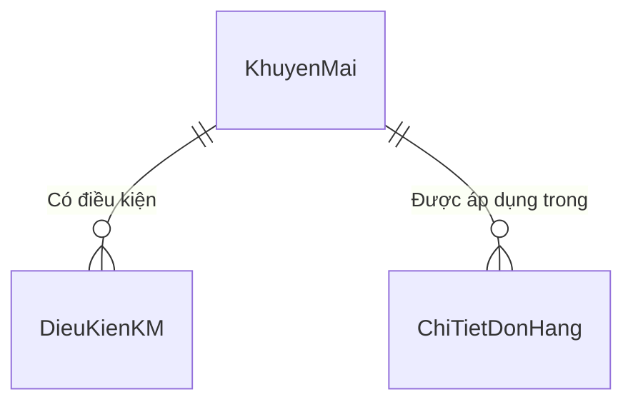
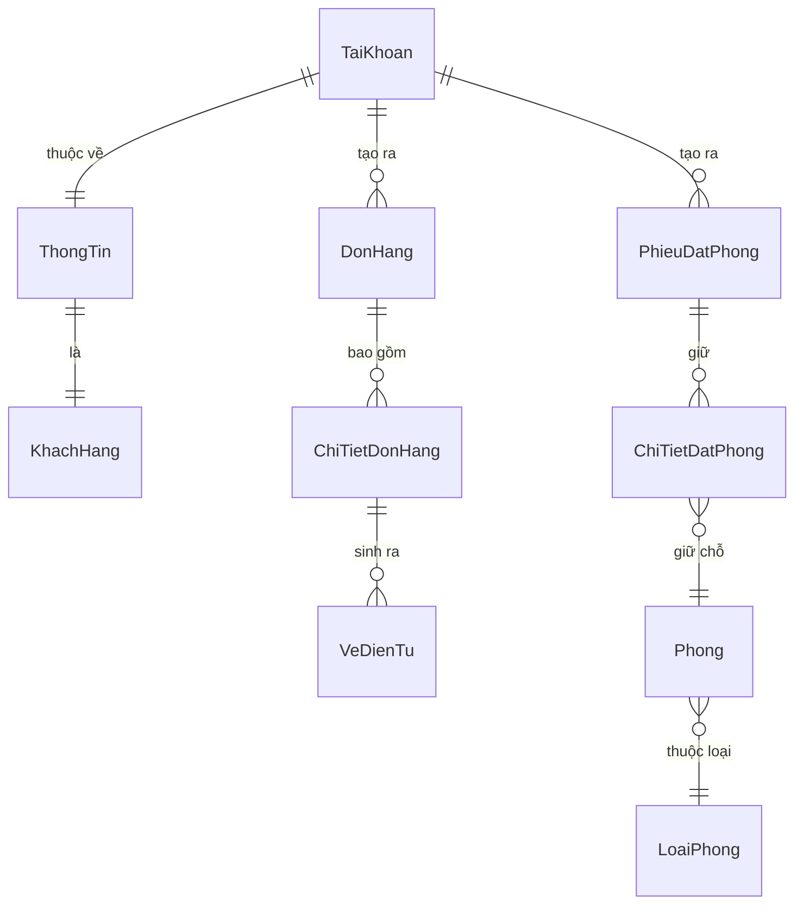
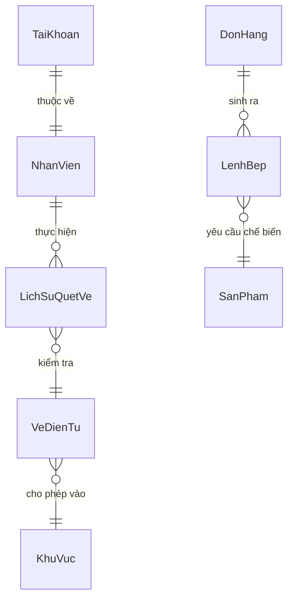
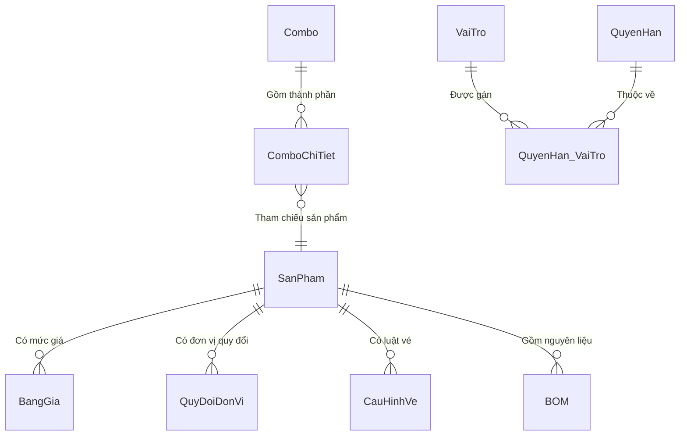

# Khu Du Lịch Đại Nam
# Đặc Tả Yêu Cầu Phần Mềm — Hệ Thống & Danh Mục
# Mã dự án: DN01
# Mã tài liệu: DN01_SRS_HeThong_DanhMuc_v2.0

Hồ Chí Minh, Tháng 05/2026

---

## Lịch sử thay đổi

| Ngày hiệu lực | Hạng mục thay đổi | A/M/D | Mô tả | Phiên bản |
|---|---|---|---|---|
| 19/04/2026 | CN09 Quản lý Sản phẩm – phát hành lần đầu | A | | 1.0 |
| 23/04/2026 | CN06 Quản lý Combo – phát hành lần đầu | A | | 1.0 |
| 23/04/2026 | CN02 Quản lý Phân quyền – phát hành lần đầu | A | | 1.0 |
| 24/04/2026 | Gộp ba tài liệu thành một và tinh chỉnh chuẩn SRS | M | | 1.2 |
| 25/04/2026 | Cập nhật luồng nghiệp vụ F&B (Kiểm soát BOM và tồn kho) | M | Cải tiến giao diện theo phản hồi người dùng: phân loại sản phẩm rõ hơn để tránh bỏ quên nhập định mức nguyên liệu. | 1.3 |
| 26/04/2026 | Tích hợp module CN04 (Quản lý Khách hàng & Thẻ RFID) | M | Chuẩn hóa CSDL, gom lỗi và từ điển vào Master SRS | 1.4 |
| 27/04/2026 | Tích hợp module CN11 (Danh mục Kho hàng) | M | Gộp phân hệ danh mục kho hàng vào hệ thống cốt lõi | 1.5 |
| 27/04/2026 | Tích hợp module CN10 (Trung tâm Kho) | M | Gộp phân hệ quản lý kho (tạo phiếu, tồn kho, lịch sử, cảnh báo) vào tài liệu hợp nhất | 1.6 |
| 08/05/2026 | Tích hợp module CN03 (Bán hàng POS) | M | Gộp phân hệ bán hàng vào tài liệu hợp nhất | 1.7 |
| 08/05/2026 | Tích hợp module CN08 (Khuyến mãi) | M | Gộp phân hệ khuyến mãi | 1.8 |
| 08/05/2026 | Tích hợp CN05 (Nhà hàng & Lưu trú) | M | Gộp phân hệ lưu trú | 1.9 |
| 08/05/2026 | Tích hợp CN07 (AI Assistant) | M | Gộp phân hệ trợ lý AI | 1.10 |
| 08/05/2026 | Tích hợp CN12 (Báo cáo Doanh thu) | M | Gộp phân hệ báo cáo | 1.11 |
| 08/05/2026 | Tích hợp CN13 (Web Portal Khách hàng) | M | Gộp phân hệ Web Portal | 1.12 |
| 08/05/2026 | Tích hợp CN14 (Ứng dụng Nhân viên) | M | Gộp Staff App (Soát vé + KDS) | 1.13 |

*A - Thêm mới, M - Chỉnh sửa, D - Xóa bỏ*

---

## 0. Phạm vi tài liệu

Tài liệu này đặc tả **các phân hệ nền tảng** thuộc hệ thống quản lý vận hành Khu Du lịch Đại Nam, bao gồm sáu module con:

- **CN09 – Quản lý Sản phẩm & Dịch vụ**: khai báo sản phẩm, bảng giá, quy đổi đơn vị, cấu hình vé và F&B.
- **CN06 – Quản lý Combo Sản phẩm**: tạo và chỉnh sửa combo; thiết lập thành phần rổ combo; phân bổ tỷ lệ doanh thu.
- **CN02 – Phân quyền hệ thống**: quản lý vai trò, cấu hình phân quyền truy cập chức năng.
- **CN04 – Quản lý Khách hàng**: lưu trữ hồ sơ, quản lý thẻ RFID, ví điện tử, và điểm tích lũy khách hàng.
- **CN11 – Quản lý Danh mục Kho hàng**: thêm mới, chỉnh sửa, ngưng hoạt động kho hàng vật lý.
- **CN10 – Trung tâm Kho**: tạo phiếu kho (nhập, xuất, chuyển, kiểm kê), tra cứu tồn kho, lịch sử giao dịch, cảnh báo hạn sử dụng và tồn tối thiểu.

- **CN03 – Bán hàng POS**: màn hình POS, thanh toán, hoàn hàng, in hóa đơn.
- **CN08 – Quản lý Khuyến mãi**: khai báo, áp dụng và quản lý chương trình khuyến mãi.
- **CN05 – Nhà hàng & Lưu trú**: sơ đồ phòng, đặt phòng, check-in/out, và phân hệ nhà hàng.
- **CN07 – Trợ lý AI**: tư vấn nghiệp vụ, tra cứu hội thoại, gợi ý bán hàng.
- **CN12 – Báo cáo Doanh thu**: tra cứu và xuất báo cáo doanh thu theo thời gian/điểm bán.
- **CN13 – Web Portal Khách hàng**: đăng ký, mua vé, đặt phòng trực tuyến, xem lịch sử.
- **CN14 – Ứng dụng Nhân viên (Staff App)**: soát vé cổng (camera QR), màn hình bếp KDS.

**Lưu ý:** Tài liệu này là bản hợp nhất toàn bộ SRS của dự án DN01.

**Đối tượng đọc:** BA, Lập trình viên (Dev), Chuyên viên kiểm thử (Tester).

---

## Mục lục

1. [CN09 – Quản lý Sản phẩm & Dịch vụ](#1-cn09--quản-lý-sản-phẩm--dịch-vụ)
   - 1.1. Màn hình danh sách sản phẩm
   - 1.2. Tab thông tin chung
   - 1.3. Tab bảng giá
   - 1.4. Tab quy đổi đơn vị tính
   - 1.5. Tab cấu hình vận hành – biến thể Vé
   - 1.6. Tab cấu hình vận hành – biến thể F&B
   - 1.7. Tab cấu hình vận hành – biến thể Lưu trú
   - 1.8. Tab cấu hình vận hành – biến thể Cho thuê
   - 1.9. Xóa sản phẩm
2. [CN06 – Quản lý Combo Sản phẩm](#2-cn06--quản-lý-combo-sản-phẩm)
   - 2.1. Màn hình danh sách Combo
   - 2.2. Thông tin Combo
   - 2.3. Kho Sản phẩm và Rổ Combo
   - 2.4. Thêm mới Combo
   - 2.5. Chỉnh sửa Combo
   - 2.6. Xóa Combo
3. [CN02 – Phân quyền hệ thống](#3-cn02--phân-quyền-hệ-thống)
   - 3.1. Màn hình thiết lập phân quyền
   - 3.2. Xem quyền theo vai trò
   - 3.3. Cập nhật quyền cho vai trò
4. [CN04 – Quản lý Khách hàng](#4-cn04--quản-lý-khách-hàng)
   - 4.1. Màn hình danh sách khách hàng
   - 4.2. Màn hình chi tiết khách hàng
   - 4.3. Form thêm mới và chỉnh sửa khách hàng
   - 4.4. Nạp tiền ví điện tử
   - 4.5. Cấp ví và thẻ RFID
   - 4.6. Khóa và mở khóa thẻ RFID
   - 4.7. Điều chỉnh điểm tích lũy
   - 4.8. Xóa khách hàng
5. [CN11 – Quản lý Danh mục Kho hàng](#5-cn11--quản-lý-danh-mục-kho-hàng)
   - 5.1. Màn hình danh sách kho
   - 5.2. Màn hình chi tiết kho hàng
   - 5.3. Ngưng hoạt động kho
6. [CN10 – Trung tâm Kho](#6-cn10--trung-tâm-kho)
   - 6.1. Màn hình trung tâm kho
   - 6.2. Màn hình tạo phiếu kho
   - 6.3. Màn hình tồn kho
   - 6.4. Màn hình lịch sử giao dịch
   - 6.5. Màn hình cảnh báo
   - 6.6. Vòng đời chứng từ kho
   - 6.7. Tích hợp CN06 ↔ CN10 — Trừ kho BOM
7. [CN03 – Bán hàng POS](#7-cn03--bán-hàng-pos)
8. [CN08 – Quản lý Khuyến mãi](#8-cn08--quản-lý-khuyến-mãi)
9. [CN05 – Nhà hàng & Lưu trú](#9-cn05--nhà-hàng--lưu-trú)
10. [CN07 – Trợ lý AI](#10-cn07--trợ-lý-ai)
11. [CN12 – Báo cáo Doanh thu](#11-cn12--báo-cáo-doanh-thu)
12. [CN13 – Web Portal Khách hàng](#12-cn13--web-portal-khách-hàng)
13. [CN14 – Ứng dụng Nhân viên (Staff App)](#13-cn14--ứng-dụng-nhân-viên-staff-app)
14. [Yêu cầu chung](#14-yêu-cầu-chung)
   - 7.1. Định dạng dữ liệu
   - 7.2. Danh mục dữ liệu tham chiếu
   - 7.3. Bảng mã thông báo lỗi (hợp nhất)
   - 7.4. Phân quyền truy cập
   - 7.5. Yêu cầu phi chức năng
   - 7.6. Sơ đồ thực thể liên kết (ERD)
---

# 1. CN09 – Quản lý Sản phẩm & Dịch vụ

Phân hệ CN09 đóng vai trò khởi tạo dữ liệu lõi cho toàn hệ thống. Mọi sản phẩm từ Vé, F&B đến Dịch vụ đều được định nghĩa tại đây kèm bảng giá và định mức tiêu hao nguyên liệu (BOM). Đây là tiền đề bắt buộc để các module Bán hàng (POS) và Quản lý Kho có thể hoạt động.

---

## 1.1. Màn hình danh sách sản phẩm

### 1.1.1. Tổng quan

Màn hình này hiển thị toàn bộ danh mục sản phẩm dưới dạng lưới. Bên trái là lưới danh sách, bên phải là panel chi tiết (Giao diện chia hai vùng (trái-phải)). Khi người dùng chọn một dòng trên lưới, panel phải tự nạp thông tin chi tiết của sản phẩm đó.

### 1.1.2. Tác nhân

- Quản lý (thêm, sửa, xóa sản phẩm)
- Nhân viên kế toán (xem, lập quy đổi, lập BOM)

### 1.1.3. Biểu đồ use-case

[Placeholder: Chèn ảnh Biểu đồ Use-case / Activity Diagram tại đây]

- **Tác nhân:** Quản lý, Nhân viên kế toán
- **Chức năng:**
  - Tìm kiếm sản phẩm
  - Thêm mới sản phẩm
  - Chỉnh sửa sản phẩm
  - Thiết lập bảng giá (<<include>> Thêm/Sửa)
  - Lập bảng quy đổi ĐVT (<<include>> Thêm/Sửa)
  - Cấu hình quyền quẹt vé (<<extend>> Thêm/Sửa - chỉ khi SP là Vé)
  - Cấu hình định mức BOM (<<extend>> Thêm/Sửa - chỉ khi SP là F&B)
  - Xóa ẩn sản phẩm

#### 1.1.3.1. Tiền điều kiện

- Người dùng đã đăng nhập.
- Các danh mục đơn vị tính, cổng xoay, khu vực POS, cấu hình thuế đã tồn tại.

#### 1.1.3.2. Hậu điều kiện

Dữ liệu sản phẩm được lưu đồng bộ vào cơ sở dữ liệu (bảng SanPham, BangGia, QuyDoiDonVi và các bảng phụ thuộc loại hình).

#### 1.1.3.3. Điểm kích hoạt

Người dùng truy cập menu Danh mục, chọn mục Hàng hóa và Dịch vụ.

### 1.1.4. Luồng thao tác

#### 1.1.4.1. Tình huống 1 — Thêm mới vé dịch vụ

| | Người dùng | Hệ thống |
|---|---|---|
| 1 | Nhấn nút Thêm mới. | Bật panel chi tiết bên phải. Tab Thông tin chung mở mặc định. Các trường ở trạng thái trống. |
| 2 | Nhập mã SP, tên vé, chọn ĐVT là Lượt. Chọn loại SP là Vé dịch vụ. | Tự sinh tiền tố mã: VE_. Tab 4 đổi thành Cấu hình vé. Checkbox Là vật tư tự tắt và khóa xám. |
| 3 | Chuyển sang Tab cấu hình vé, thiết lập đối tượng: Người lớn. Thêm dòng trên lưới quẹt cổng: Khu Trượt Nước (1 lượt). | Ghi nhận. |
| 4 | Chuyển sang Tab bảng giá, thêm dòng giá: Loại Mặc định, giá 150,000. | Kiểm tra thời hiệu không chồng lấp. |
| 5a | Nhấn nút Lưu (Dữ liệu hợp lệ). | Lưu thành công, tải lại lưới danh sách và hiển thị thông báo MSG_LUU_THANH_CONG. |
| 5b | Nhấn nút Lưu (Mã SP trùng). | Dừng lưu, focus vào ô Mã SP, hiển thị thông báo ERR_TRUNG_MASP. |
| 5c | Nhấn nút Lưu (Bảng giá trống). | Tự ép trạng thái về Tạm ngưng, hỏi xác nhận trước khi lưu. |
| 5d | Lỗi server / Timeout. | Hiển thị thông báo MSG_LUU_THAT_BAI, giữ nguyên dữ liệu trên form để tránh mất công sức nhập liệu. |

#### 1.1.4.2. Tình huống 2 — Khai báo món ăn F&B

| | Người dùng | Hệ thống |
|---|---|---|
| 1 | Nhấn nút Thêm mới. Nhập tên Bia Heineken, chọn ĐVT gốc là Lon, loại SP là Đồ uống. Tích Là vật tư, chọn thuế VAT 8%. | Tự sinh tiền tố DU_. Tab 4 đổi thành Cấu hình F&B. |
| 2 | Chuyển sang Tab quy đổi ĐVT, nhấn nút Thêm dòng, chọn ĐVT đích là Thùng, hệ số bằng 24. | Kiểm tra hệ số lớn hơn 0. |
| 3 | Tích ô Áp dụng toàn bộ điểm bán. | Khóa xám danh sách điểm bán, mặc định áp dụng tất cả. |
| 4 | Nhấn nút Lưu. | Lưu đồng bộ tất cả tab, thông báo thành công. |

#### 1.1.4.3. Tình huống 3 — Chỉnh sửa sản phẩm

| | Người dùng | Hệ thống |
|---|---|---|
| 1 | Nhấp chọn một dòng trên lưới danh sách. | Panel phải tự nạp thông tin sản phẩm đó. Mã SP và Loại SP bị khóa (Read-only). |
| 2 | Sửa các trường cần thay đổi (tên, giá, quy đổi...). | Kích hoạt cờ đã thay đổi. |
| 3 | Nhấn nút Lưu. | Hệ thống kiểm tra, lưu và thông báo thành công, sau đó tải lại lưới. |

#### 1.1.4.4. Tình huống 4 — Cảnh báo mất dữ liệu khi chuyển dòng

| | Người dùng | Hệ thống |
|---|---|---|
| 1 | Đang sửa SP A chưa lưu, nhấp sang dòng SP B trên lưới. | Hiển thị hộp thoại xác nhận với 3 nút: Có, Không, Hủy. |
| 2a | Nhấn nút Có. | Lưu SP A, nếu hợp lệ thì chuyển sang SP B. Nếu lỗi thì giữ nguyên tại SP A. |
| 2b | Nhấn nút Không. | Bỏ qua thay đổi, chuyển sang SP B. |
| 2c | Nhấn nút Hủy. | Giữ nguyên tại SP A, không chuyển dòng. |

### 1.1.5. Giao diện

[Placeholder: Chèn ảnh Prototype / Wireframe giao diện tại đây]

#### 1.1.5.1. Mô tả màn hình — Thanh công cụ

| STT | Tên trường | Control type | Required | Data type | Default value | Mô tả / Tooltip |
|---|---|---|---|---|---|---|
| 1 | Thêm mới | Button | N/A | N/A | N/A | Bật panel chi tiết ở chế độ thêm mới. |
| 2 | Làm mới | Button | N/A | N/A | N/A | Đặt bộ lọc về Tất cả, tải lại dữ liệu. |
| 3 | Tìm kiếm | Text field | No | Text | Blank | Lọc trực tiếp trên lưới theo Mã SP hoặc Tên SP. (*) Tooltip: "Gõ mã hoặc tên để tìm nhanh" |

#### 1.1.5.2. Mô tả màn hình — Bộ lọc nhanh

| STT | Tên trường | Control type | Required | Data type | Default value | Mô tả |
|---|---|---|---|---|---|---|
| 1 | Tất cả | Button (Toggle) | N/A | N/A | Đang chọn | Hiển thị tất cả loại sản phẩm |
| 2 | Vé | Button (Toggle) | N/A | N/A | N/A | Lọc sản phẩm thuộc nhóm Vé vào khu |
| 3 | Đồ ăn | Button (Toggle) | N/A | N/A | N/A | Lọc nhóm Ăn uống |
| 4 | Đồ uống | Button (Toggle) | N/A | N/A | N/A | Lọc nhóm Đồ uống |
| 5 | Cho thuê | Button (Toggle) | N/A | N/A | N/A | Lọc nhóm Tủ đồ / Cho thuê |
| 6 | Lưu trú | Button (Toggle) | N/A | N/A | N/A | Lọc nhóm Lưu trú |
| 7 | Vật tư | Button (Toggle) | N/A | N/A | N/A | Lọc nhóm Nguyên liệu |

Nút đang chọn được tô nổi bật (màu primary), các nút khác ở trạng thái mờ.

#### 1.1.5.3. Mô tả màn hình — Lưới sản phẩm (Grid Control, Read-only)

| STT | Tên cột | Control type | Data type | Mô tả |
|---|---|---|---|---|
| 1 | Mã SP | Label | Text | Mã định danh sản phẩm |
| 2 | Tên SP | Label | Text | Tên hiển thị |
| 3 | Loại SP | Label | Text | Nhóm loại sản phẩm. Cột này được nhóm (group) để lưới hiển thị dạng cây phân cấp. Giá trị hiển thị được dịch đa ngôn ngữ. |
| 4 | Trạng thái | Label | Text | Đang bán, Tạm ngưng, hoặc Ngừng bán. Giá trị hiển thị được dịch đa ngôn ngữ. |
| 5 | Hành động | Button (Delete) | N/A | Nút Xóa cố định bên phải. Nhấn sẽ hiển hộp thoại xác nhận trước khi xóa ẩn. |

#### 1.1.5.4. Row style — Lưới sản phẩm

| Trạng thái | Màu chữ |
|---|---|
| DangBan | Xanh lá (Success) |
| TamNgung | Vàng đậm (Amber) |
| NgungBan | Đỏ (Danger) |

#### 1.1.5.5. Mô tả màn hình — Thanh trạng thái

| STT | Tên trường | Control type | Data type | Mô tả |
|---|---|---|---|---|
| 1 | Tổng SP | Label | Text | Hiển thị: "Tổng {N}" với N = số sản phẩm trên lưới |

### 1.1.6. Mô tả nghiệp vụ

| STT | Tên | Quy tắc |
|---|---|---|
| 1 | Giao diện chia hai vùng (trái-phải) | Lưới bên trái, panel chi tiết bên phải. Panel chi tiết ẩn cho đến khi người dùng chọn 1 dòng hoặc nhấn nút Thêm mới. |
| 2 | Nhóm theo loại | Cột Loại SP được nhóm (cột được nhóm đầu tiên), lưới hiển thị dạng cây. Tất cả nhóm mở rộng mặc định. |
| 3 | Lọc nhanh | Nhấn nút lọc, hệ thống tải lại dữ liệu theo loại SP. Nút đang chọn được highlight. |
| 4 | Tìm kiếm | Gõ ký tự vào ô tìm, lưới tự lọc ngay (lọc trực tiếp trên giao diện trên cột Mã SP và Tên SP). |
| 5 | Đa ngôn ngữ | Khi ngôn ngữ thay đổi: tải lại toàn bộ lưới, label, nút bấm, bộ lọc, và panel chi tiết. |
| 6 | Phát hiện dữ liệu chưa lưu | Khi chuyển dòng mà panel chi tiết đang có dữ liệu chưa lưu, hệ thống hiển thị hộp thoại xác nhận 3 nút (Có, Không, Hủy). |

### 1.1.7. Quy tắc kiểm tra

| STT | Quy tắc | Mã thông báo |
|---|---|---|
| 1 | Không có quy tắc kiểm tra đặc biệt tại màn hình danh sách | — |

### 1.1.8. Liên kết use-case

- Màn hình chi tiết sản phẩm
- Xóa sản phẩm

---

## 1.2. Màn hình chi tiết sản phẩm — Tab thông tin chung

### 1.2.1. Tổng quan

Panel này được nạp vào nửa phải của Giao diện chia hai vùng (trái-phải). Gồm 4 tab: Thông tin chung, Bảng giá, Quy đổi ĐVT, và Cấu hình vận hành. Tab Cấu hình vận hành (tab 4) là panel động, hiển thị nội dung khác nhau tùy loại SP.

### 1.2.2. Giao diện

#### 1.2.2.1. Mô tả màn hình — Tab thông tin chung

| STT | Tên trường | Control type | Required | Data type | Default value | Mô tả / Tooltip |
|---|---|---|---|---|---|---|
| 1 | Ảnh đại diện | Ô chọn ảnh | No | Image | Blank | Nhấn chuột vào ảnh sẽ mở hộp thoại chọn file (jpg, png, gif, webp). (*) Tooltip: "Click chọn ảnh đại diện" |
| 2 | Mã SP | Text field | Yes | Text | Blank (thêm mới) / Read-only (sửa) | Khi thêm mới: tự sinh tiền tố theo loại SP (VE_, FB_, DU_...). Nhân viên chỉ gõ phần đuôi. Khi sửa: khóa cứng, không cho thay đổi. |
| 3 | Tên SP | Text field | Yes | Text | Blank | Tối đa 150 ký tự. |
| 4 | Loại SP | Danh sách thả xuống | Yes | Text | Blank | Quyết định nội dung Tab 4 (Cấu hình vận hành). Khóa cứng khi ở chế độ sửa. (*) Tooltip: không có — thao tác tự giải thích |
| 5 | ĐVT gốc | Ô tìm kiếm và chọn | Yes | Integer | Blank | Danh sách đơn vị tính đang hoạt động. (*) Tooltip: "Nên chọn đơn vị nhỏ nhất (VD: Lon thay vì Thùng)" |
| 6 | Thuế VAT | Ô tìm kiếm và chọn | Yes | Integer | Blank | Danh sách cấu hình thuế (Mã, Tên, %VAT). |
| 7 | Trạng thái | Danh sách thả xuống | Yes | Text | DangBan | Đang bán, Tạm ngưng, hoặc Ngừng bán. |
| 8 | Điểm bán | Ô chọn nhiều giá trị | No | Text (multi-select) | Blank | Chọn các kiosk/POS được phép bán SP này. (*) Tooltip: Chọn các quầy được phép bán |
| 9 | Áp dụng toàn bộ POS | Ô tích chọn | No | Boolean | Unchecked | Tích vào thì khóa xám danh sách điểm bán, tự áp dụng tất cả. |
| 10 | Là vật tư | Ô tích chọn | No | Boolean | Unchecked | Nếu loại SP là dịch vụ ảo (Vé) thì tự động tắt và khóa xám. (*) Tooltip: Sản phẩm cần theo dõi xuất nhập kho |
| 11 | Quản lý lô (HSD) | Ô tích chọn | No | Boolean | Unchecked | Nếu loại SP là dịch vụ ảo thì tự động tắt và khóa xám. (*) Tooltip: Bật để hệ thống theo dõi hạn sử dụng theo từng lô |
| 12 | Giá tham khảo | Text field (Read-only) | — | Text | "Chưa có" | Luôn khóa. Hút giá trị từ dòng bảng giá mặc định đầu tiên. (*) Tooltip: "Giá bán hiện tại (chỉ đọc). Sửa tại Tab bảng giá." |
| 13 | Lưu | Button | N/A | N/A | N/A | Lưu toàn bộ 4 tab. Hotkey: Ctrl+S. |
| 14 | Hủy | Button | N/A | N/A | N/A | Nếu đang sửa: tải lại dữ liệu gốc. Nếu đang thêm mới: đặt lại trạng thái trống. Hotkey: Esc. |

### 1.2.3. Mô tả nghiệp vụ

| STT | Tên | Quy tắc |
|---|---|---|
| 1 | Khóa loại sản phẩm sau khi lưu | Khi đã lưu thành công, Loại SP bị khóa vĩnh viễn. Không cho đổi loại để tránh sai lệch dữ liệu liên quan (lưới cổng xoay, BOM, bảng giá cho thuê). |
| 2 | Tiền tố mã tự động | Khi thêm mới: đổi loại SP thì mã SP tự cập nhật tiền tố (VE_, FB_, DU_...). Nếu ô mã đang chứa tiền tố cũ (dưới 4 ký tự, kết thúc bằng dấu gạch dưới) thì thay bằng tiền tố mới. |
| 3a | Sản phẩm ảo | Nhóm Vé / Lưu trú / Gửi xe / Dịch vụ: Tự động tắt checkbox Là vật tư & Quản lý lô và khóa cứng. Không cần theo dõi kho. |
| 3b | Vật tư bắt buộc | Nhóm Nguyên Liệu / Hàng Hóa / Đồ Cho Thuê / Đồ Uống Đóng Chai / Đồ Ăn Tiện Lợi: Tự động BẬT checkbox Là vật tư và khóa cứng. Bắt buộc có tồn kho. |
| 3c | Cấm tồn kho (Ép BOM) | Nhóm Đồ Uống / Đồ Ăn (Chế biến/Pha chế): Tự động TẮT checkbox Là vật tư và khóa cứng. Cấm nhập tồn kho trực tiếp, bắt buộc phải trừ kho gián tiếp qua định mức BOM. |
| 4 | Kiểm tra giá bán khi lưu | Nếu trạng thái là Đang bán nhưng bảng giá trống hoặc không có dòng nào có giá lớn hơn hoặc bằng 0 (trừ loại Nguyên liệu), hệ thống tự ép trạng thái về Tạm ngưng. |
| 5 | Ảnh đại diện | File ảnh được sao chép vào thư mục Uploads/SanPham/ với tên UUID. Đường dẫn tương đối lưu vào cơ sở dữ liệu. |
| 6 | Phát hiện dữ liệu chưa lưu | Mọi thao tác sửa đổi trên bất kỳ control nào (text, combo, grid) đều kích hoạt cờ đã thay đổi. |
| 7 | Hotkey | Ctrl+S = Lưu. Esc = Hủy. Focus Tab flow trên toàn form. |

### 1.2.4. Quy tắc kiểm tra

| STT | Quy tắc | Mã thông báo |
|---|---|---|
| 1 | Mã SP bắt buộc, không được chỉ chứa tiền tố | ERR_REQUIRED_MASP |
| 2 | Tên SP bắt buộc | ERR_REQUIRED_TENSP |
| 3 | Loại SP bắt buộc | ERR_REQUIRED_LOAISP |
| 4 | ĐVT gốc bắt buộc | ERR_REQUIRED_DVT |
| 5 | Mã SP bị trùng với SP đã tồn tại | ERR_TRUNG_MASP |
| 6 | Mã SP chỉ chứa tiền tố mà chưa nhập thêm phần đuôi | ERR_MASP_CHI_TIENTO |

### 1.2.5. Liên kết use-case

- Màn hình danh sách sản phẩm
- Tab bảng giá
- Tab quy đổi ĐVT
- Tab cấu hình vận hành

---

## 1.3. Tab bảng giá

### 1.3.1. Tổng quan

Tab này quản lý giá bán linh hoạt theo thời gian. Cho phép tạo nhiều mức giá song song (giá mặc định, giá ngày lễ, giá khuyến mãi). Nếu loại SP là Cho thuê, lưới tự hiện thêm các cột phụ thu thuê đồ.

### 1.3.2. Giao diện

#### 1.3.2.1. Mô tả màn hình — Lưới bảng giá (Grid Control, Editable)

| STT | Tên cột | Control type | Required | Data type | Default value | Mô tả / Tooltip |
|---|---|---|---|---|---|---|
| 1 | Loại giá | Danh sách chọn (trong lưới) | Yes | Text | MacDinh | Mặc định, Ngày lễ, hoặc Khuyến mãi. |
| 2 | Hiệu lực từ | Ô chọn ngày (trong lưới) | Yes | Date | Today | Ngày bắt đầu áp dụng. Định dạng dd/MM/yyyy. |
| 3 | Hiệu lực đến | Ô chọn ngày (trong lưới) | Yes | Date | Today + 1 năm | Ngày kết thúc. Định dạng dd/MM/yyyy. |
| 4 | Giá bán | Ô nhập số (trong lưới) | Yes | Decimal(15,0) | 0 | Giá bán tính trên ĐVT gốc. Định dạng N0. |
| 5 | Tiền cọc | Ô nhập số (trong lưới) | Conditional | Decimal(15,0) | 0 | Chỉ hiện khi loại SP là Cho thuê. |
| 6 | Phút block đầu | Ô nhập số (trong lưới) | Conditional | Integer | 0 | Chỉ hiện khi loại SP là Cho thuê. Số phút tính trong block giá đầu. |
| 7 | Phút tiếp | Ô nhập số (trong lưới) | Conditional | Integer | 0 | Chỉ hiện khi loại SP là Cho thuê. Khoảng phút tính phụ thu tiếp theo. |
| 8 | Giá phụ thu | Ô nhập số (trong lưới) | Conditional | Decimal(15,0) | 0 | Chỉ hiện khi loại SP là Cho thuê. Giá cho mỗi block phút tiếp. |
| 9 | Xóa | Button (Delete icon) | N/A | N/A | N/A | Nút xóa dòng, cố định bên phải. |

**Thao tác thêm dòng:** nhấn nút "Thêm dòng" ở phía dưới lưới. Dòng mới được khởi tạo với giá trị mặc định.

### 1.3.3. Mô tả nghiệp vụ

| STT | Tên | Quy tắc |
|---|---|---|
| 1 | Chống chồng lấp giờ | Không cho tạo 2 mức giá cùng loại (cùng Mặc định) có khoảng hiệu lực gối lên nhau. |
| 2 | Trọng số loại giá | Xác định mức giá áp dụng tại thời điểm bán hàng theo độ ưu tiên: <br/> 1. Ngày thường, không KM: áp dụng Giá Mặc định <br/> 2. Ngày có Khuyến mãi: áp dụng Giá Khuyến mãi <br/> 3. Ngày lễ (dù có KM hay không): áp dụng Giá Ngày lễ (ưu tiên cao nhất) <br/> Nhiều dòng cùng loại, cùng ngày bị chặn bởi quy tắc chống chồng lấp. |
| 3 | Cột cho thuê | Các cột TienCoc, PhutBlock, PhutTiep, GiaPhuThu chỉ hiện khi loại SP thuộc nhóm Cho thuê (TuDo, DoCho, ChoiNghiMat). Các loại khác thì ẩn hoàn toàn. |
| 4 | Highlight dòng đã sửa | Dòng vừa chỉnh sửa trên lưới (chưa lưu) được tô nền vàng nhạt (#FFFFE6). |
| 5 | Chỉnh sửa trực tiếp trên lưới | Người dùng sửa trực tiếp trên lưới, không cần popup. Giá trị tự lưu khi rời cell. |

### 1.3.4. Liên kết use-case

- Tab thông tin chung

---

## 1.4. Tab quy đổi đơn vị tính

### 1.4.1. Tổng quan

Tab này giải quyết bài toán nhập kho theo quy cách đóng gói lớn nhưng bán lẻ theo đơn vị gốc. Mỗi dòng là một quy tắc: "1 ĐVT đích = N ĐVT gốc".

### 1.4.2. Giao diện

#### 1.4.2.1. Mô tả màn hình — Lưới quy đổi (Grid Control, Editable)

| STT | Tên cột | Control type | Required | Data type | Default value | Mô tả / Tooltip |
|---|---|---|---|---|---|---|
| 1 | ĐVT đích | Ô tìm kiếm và chọn (trong lưới) | Yes | Integer | Blank | Chọn đơn vị mới (VD: "Thùng", "Lốc"). Chỉ hiện ĐVT đang hoạt động. |
| 2 | Hệ số | Ô nhập số (trong lưới) | Yes | Decimal | 1 | Tỷ lệ: 1 ĐVT đích = N ĐVT gốc (VD: 1 Thùng = 24 Lon). Định dạng: 0.#### (tự cắt số 0 thừa). |
| 3 | Giá bán | Ô nhập số (trong lưới) | No | Decimal | Blank | Mức giá ấn định khi bán theo quy cách này. Nếu để trống hệ thống sẽ hiển thị "Tự tính". |
| 4 | Xóa | Button (Delete icon) | N/A | N/A | N/A | Nút xóa dòng, cố định bên phải. |

**Thao tác thêm dòng:** nhấn nút "Thêm dòng" ở phía dưới lưới.

### 1.4.3. Mô tả nghiệp vụ

| STT | Tên | Quy tắc |
|---|---|---|
| 1 | Đơn vị nguyên tử | Mỗi sản phẩm chỉ có 1 mã duy nhất với ĐVT gốc nhỏ nhất. Nghiêm cấm tạo mã sản phẩm biến thể theo quy cách đóng gói. |
| 2 | Hệ số dương | Hệ số quy đổi phải là số dương. Nếu nhập nhỏ hơn hoặc bằng 0 hoặc để trống, hệ thống báo lỗi. |
| 3 | Highlight dòng đã sửa | Dòng vừa chỉnh sửa được tô nền vàng nhạt (#FFFFE6). |
| 4a | Giá bán linh hoạt (Tự tính) | Nếu ô giá bán trong cấu hình quy đổi bị bỏ trống, hệ thống tự động hiển thị chữ "Tự tính". Khi bán hàng sẽ tự tính giá bán bằng đơn giá gốc nhân với hệ số quy đổi. |
| 4b | Giá bán linh hoạt (Giá ấn định) | Nếu nhập một số tiền cụ thể vào cột Giá bán, hệ thống sẽ sử dụng đúng mức giá ấn định này khi bán, bỏ qua mọi thay đổi của giá gốc. |

### 1.4.4. Quy tắc kiểm tra

| STT | Quy tắc | Mã thông báo |
|---|---|---|
| 1 | Hệ số quy đổi phải là số dương hợp lệ | ERR_HESO_KHONGHOPLE |

### 1.4.5. Liên kết use-case

- Tab thông tin chung

---

## 1.5. Tab cấu hình vận hành — biến thể vé

### 1.5.1. Tổng quan

Tab này chỉ hiển thị khi loại SP là Vé (VeVaoKhu hoặc VeTroChoi). Cho phép cấu hình đối tượng áp dụng (người lớn / trẻ em) và danh sách quyền truy cập cổng xoay.

### 1.5.2. Điều kiện hiển thị

Loại SP là VeVaoKhu hoặc VeTroChoi.

### 1.5.3. Giao diện

#### 1.5.3.1. Mô tả màn hình

| STT | Tên trường | Control type | Required | Data type | Default value | Mô tả / Tooltip |
|---|---|---|---|---|---|---|
| 1 | Kích hoạt quyền truy cập | Ô tích chọn | No | Boolean | Unchecked | Bật để cho phép quẹt vé tại cổng xoay. |
| 2 | Đối tượng | Combo Box | Yes | Text | Blank | "Người lớn" / "Trẻ em" / "Tất cả". |
| 3 | Lưới quyền truy cập | Grid Control (Editable) | Conditional | — | Blank | Cột: Khu vực + Số lượt. Thêm dòng = thêm 1 khu vực được quẹt vé. |

### 1.5.4. Mô tả nghiệp vụ

| STT | Tên | Quy tắc |
|---|---|---|
| 1 | Vé lẻ chỉ 1 khu | Nếu là Vé trò chơi (lẻ), hệ thống chặn thêm dòng thứ 2 trên lưới quyền truy cập. |
| 2 | Không cho rỗng | Nếu đã tích Kích hoạt quyền truy cập nhưng lười rỗng khi lưu, hệ thống báo lỗi. |

### 1.5.5. Quy tắc kiểm tra

| STT | Quy tắc | Mã thông báo |
|---|---|---|
| 1 | Lưới quyền truy cập cổng xoay không được rỗng khi đã kích hoạt | ERR_LUOI_CONG_RONG |

### 1.5.6. Liên kết use-case

- Tab thông tin chung

---

## 1.6. Tab cấu hình vận hành — biến thể F&B

### 1.6.1. Tổng quan

Tab này chỉ hiển thị khi loại SP là F&B (AnUong hoặc DoUong). Cho phép cấu hình cảnh báo dị ứng, nhà hàng xuất món, và lưới định mức tiêu hao nguyên liệu (BOM).

### 1.6.2. Điều kiện hiển thị

Loại SP là AnUong hoặc DoUong.

### 1.6.3. Giao diện

#### 1.6.3.1. Mô tả màn hình — Phần thông tin chung F&B

| STT | Tên trường | Control type | Required | Data type | Default value | Mô tả |
|---|---|---|---|---|---|---|
| 1 | Cảnh báo dị ứng | Ô nhập văn bản nhiều dòng | No | Text | Blank | Ghi chú thành phần gây dị ứng. |
| 2 | Nhà hàng xuất món | Ô tìm kiếm và chọn | No | Integer | Blank | Chọn điểm xuất món (nhà hàng / quầy bar). |

#### 1.6.3.2. Mô tả màn hình — Lưới BOM (Grid Control, Editable)

| STT | Tên cột | Control type | Required | Data type | Default value | Mô tả / Tooltip |
|---|---|---|---|---|---|---|
| 1 | Nguyên liệu | Ô tìm kiếm và chọn (trong lưới) | Yes | Integer | Blank | Chọn vật tư nguyên liệu. Chặn chọn sản phẩm dịch vụ (Vé) vào làm nguyên liệu. (*) Tooltip: "Gõ để tìm vật tư" |
| 2 | ĐVT | Label (Read-only) | — | Text | Blank | Tự lấy ĐVT gốc của nguyên liệu sau khi chọn. |
| 3 | Số lượng tiêu hao | Ô nhập số (trong lưới) | Yes | Decimal(18,3) | 1.000 | Kiểu N3. Cho phép nhập vi mô (VD: 0.002 kg). Không làm tròn chẵn. (*) Tooltip: "Lượng tiêu hao cho 1 đơn vị thành phẩm" |
| 4 | Xóa | Button (Delete icon) | N/A | N/A | N/A | Nút xóa dòng, cố định bên phải. |

**Thao tác thêm dòng:** nhấn nút "Thêm dòng" ở phía dưới lưới.

### 1.6.4. Mô tả nghiệp vụ

| STT | Tên | Quy tắc |
|---|---|---|
| 1 | Chặn sản phẩm ảo | Lookup nguyên liệu chỉ liệt kê sản phẩm có cờ Là vật tư bật. Chặn việc chọn Vé hoặc dịch vụ ảo vào làm nguyên liệu. |
| 2 | BOM chỉ hệ thống | Tất cả dòng BOM trên lưới chỉ nằm trong hệ thống. Chỉ khi nhấn nút Lưu ở form cha, dữ liệu mới được ghi vào cơ sở dữ liệu. |
| 3 | Highlight dòng đã sửa | Dòng vừa chỉnh sửa được tô nền vàng nhạt (#FFFFE6). |
| 4 | Bắt buộc khai báo BOM | Sản phẩm F&B pha chế/chế biến bắt buộc phải có ít nhất 1 dòng định mức nguyên liệu. Nếu rỗng, hệ thống khóa chặn không cho lưu (Lỗi chặn (không cho lưu)). |

### 1.6.5. Quy tắc kiểm tra

| STT | Quy tắc | Mã thông báo |
|---|---|---|
| 1 | Báo lỗi và không cho lưu khi lưu sản phẩm F&B chế biến (Không phải vật tư) mà chưa khai báo Định Mức Nguyên Liệu (BOM). Yêu cầu bổ sung BOM hoặc đổi sang loại Tiện lợi. | ERR_SP_FNB_MISSING_BOM |

### 1.6.6. Liên kết use-case

- Tab thông tin chung

---

## 1.7. Tab cấu hình vận hành —  Lưu trú

### 1.7.1. Tổng quan

Tab này chỉ hiển thị khi loại SP là Khách Sạn (Lưu trú). Cho phép cấu hình các thông số sức chứa của loại phòng, diện tích, tiện nghi và danh sách vật tư mặc định cần chuẩn bị trước khi khách nhận phòng.

### 1.7.2. Điều kiện hiển thị

Loại SP là KhachSan.

### 1.7.3. Giao diện

#### 1.7.3.1. Mô tả màn hình — Cấu hình phòng

| STT | Tên trường | Control type | Required | Data type | Default value | Mô tả |
|---|---|---|---|---|---|---|
| 1 | Sức chứa (Người lớn) | Ô nhập số | Yes | Integer | 2 | Số lượng người lớn tối đa cho phép trong phòng. |
| 2 | Trẻ em tối đa | Ô nhập số | Yes | Integer | 1 | Số lượng trẻ em tối đa cho phép. |
| 3 | Diện tích (m2) | Ô nhập chữ | No | Decimal | Blank | Diện tích phòng dùng để hiển thị thông tin. |
| 4 | Tiện nghi | Ô nhập văn bản nhiều dòng | No | Text | Blank | Các trang bị gắn liền với kiến trúc (View biển, Ban công, Bồn tắm...). |

#### 1.7.3.2. Mô tả màn hình — Lưới vật tư thiết lập (Grid Control, Editable)

| STT | Tên cột | Control type | Required | Data type | Default value | Mô tả |
|---|---|---|---|---|---|---|
| 1 | Tên vật tư | Ô tìm kiếm và chọn (trong lưới) | Yes | Integer | Blank | Chọn các sản phẩm được đánh dấu "Là vật tư". |
| 2 | Số lượng Setup | Ô nhập số (trong lưới) | Yes | Integer | 1 | Số lượng mặc định nhân viên buồng phòng cần chuẩn bị. |
| 3 | Xóa | Button (Delete icon) | N/A | N/A | N/A | Nút xóa dòng, cố định bên phải. |

### 1.7.4. Mô tả nghiệp vụ

| STT | Tên | Quy tắc |
|---|---|---|
| 1 | Chỉ định Vật Tư | Chỉ cho phép chọn sản phẩm thuộc nhóm Vật tư để cấu hình thiết lập phòng mặc định. Không được chọn sản phẩm ảo. |

### 1.7.5. Quy tắc kiểm tra

| STT | Quy tắc | Mã thông báo |
|---|---|---|
| 1 | Số người lớn không được âm hoặc bằng 0 | ERR_SP_SONGUOI_KHONGHOPLE |

### 1.7.6. Liên kết use-case

- Tab thông tin chung

---

## 1.8. Tab cấu hình vận hành — Cho thuê

### 1.8.1. Tổng quan

Tab này chỉ hiển thị khi loại SP thuộc nhóm Cho thuê (Tủ đồ, Chòi nghỉ mát, Phương tiện). Cho phép quản lý danh sách tài sản vật lý (có mã vạch) thuộc loại sản phẩm này để hỗ trợ quét trả/thuê tại POS.

### 1.8.2. Điều kiện hiển thị

Loại SP là TuDo, ChoiNghiMat, PhuongTien.

### 1.8.3. Giao diện

#### 1.8.3.1. Mô tả màn hình — Lưới Tài sản cho thuê (Grid Control, Editable)

| STT | Tên cột | Control type | Required | Data type | Default value | Mô tả |
|---|---|---|---|---|---|---|
| 1 | Tên tài sản | Ô nhập chữ (trong lưới) | Yes | Nvarchar(150) | Blank | Tên gợi nhớ (VD: Xe đạp điện số 1, Chòi VIP 1). |
| 2 | Mã vạch / Biển số | Ô nhập chữ (trong lưới) | Yes | Varchar(50) | Blank | Mã vạch dán trên thiết bị để quét tại máy POS. Không được trùng lặp. |
| 3 | Khu vực | Ô tìm kiếm và chọn (trong lưới) | No | Integer | Blank | Khu vực mặc định quản lý tài sản này. |
| 4 | Trạng thái | Label (Read-only) | N/A | Text | SanSang | Trạng thái hiện tại (Sẵn sàng, Đang thuê, Bảo trì). Mặc định khi thêm mới luôn là SanSang. |
| 5 | Số ghế / Sức chứa | Ô nhập số (trong lưới) | Conditional | Integer | 1 | Sức chứa hoặc số ghế (Chỉ hiện khi là Chòi hoặc Phương tiện). |
| 6 | Xóa | Button (Delete icon) | N/A | N/A | N/A | Xóa tài sản khỏi hệ thống (Chỉ cho phép xóa khi trạng thái là SanSang). |

### 1.8.4. Mô tả nghiệp vụ

| STT | Tên | Quy tắc |
|---|---|---|
| 1 | Chặn xóa tài sản đang thuê | Chỉ cho phép xóa dòng (Xóa vật lý) nếu tài sản có trạng thái SanSang. Nếu đang thuê, nút xóa vô hiệu lực. |
| 2 | Mã vạch duy nhất | Mã vạch / Biển số nhập vào lưới không được trùng lặp trong nội bộ lưới và trong CSDL. |
| 3 | Đồng bộ hóa | Các tài sản mới được thêm hoặc xóa khỏi lưới sẽ đồng bộ lưu vào các bảng vật lý (TaiSanChoThue, TuDo, ChoiNghiMat...) tương ứng với Loại SP khi bấm nút Lưu ở form cha. |

### 1.8.5. Quy tắc kiểm tra

| STT | Quy tắc | Mã thông báo |
|---|---|---|
| 1 | Mã vạch trùng lặp trên lưới hoặc trong DB | ERR_TRUNG_MAVACH_THIETBI |
| 2 | Không thể xóa tài sản đang ở trạng thái Đang thuê | ERR_TAISAN_DANG_THUE |

### 1.8.6. Liên kết use-case

- Tab thông tin chung

---

## 1.9. Xóa sản phẩm

### 1.9.1. Tổng quan

Chức năng xóa ẩn sản phẩm (soft delete). Hệ thống không xóa vật lý mà chỉ đặt cờ DaXoa = 1.

### 1.9.2. Tác nhân

Quản lý.

### 1.9.3. Biểu đồ use-case / Activity Diagram

[Placeholder: Chèn ảnh Biểu đồ Use-case / Activity Diagram tại đây]

[Placeholder: Chèn ảnh Biểu đồ Use-case / Activity Diagram tại đây]

### 1.9.4. Luồng thao tác

| | Người dùng | Hệ thống |
|---|---|---|
| 1 | Nhấn nút Xóa ở cột hành động trên lưới. | Hiển thị hộp thoại xác nhận xóa. |
| 2 | Nhấn nút Có. | Kiểm tra ràng buộc: tồn kho lớn hơn 0 hoặc có đơn hàng đang treo. Nếu có, hệ thống từ chối và hiển thị lý do. Nếu không, đặt cờ DaXoa và tải lại lưới. |

### 1.9.5. Giao diện

[Placeholder: Chèn ảnh Prototype / Wireframe giao diện tại đây]

[Placeholder: Chèn ảnh Prototype / Wireframe giao diện tại đây]

Sử dụng hộp thoại xác nhận tiêu chuẩn (MessageBox) của hệ thống, không có form giao diện riêng.

### 1.9.6. Mô tả nghiệp vụ

| STT | Tên | Quy tắc |
|---|---|---|
| 1 | Kiểm tra tồn kho | Nếu tồn kho lớn hơn 0, hệ thống từ chối xóa và hiển thị thông báo. |
| 2 | Kiểm tra đơn hàng | Nếu có đơn hàng chưa thanh toán liên quan, hệ thống từ chối xóa và hiển thị thông báo. |
| 3 | Xóa ẩn dữ liệu | Hệ thống chỉ chuyển trạng thái đánh dấu đã xóa thay vì xóa dứt điểm dữ liệu. Việc này nhằm bảo vệ lịch sử hóa đơn hoặc chứng từ kế toán trong quá khứ không bị đứt gãy thông tin ràng buộc. Việc xóa làm sản phẩm không còn hiển thị trên mọi giao diện bán hàng và quản lý. |

### 1.9.7. Quy tắc kiểm tra

| STT | Quy tắc | Mã thông báo |
|---|---|---|
| 1 | Sản phẩm vẫn còn tồn kho | ERR_CONTONKHO |
| 2 | Sản phẩm đang nằm trong đơn hàng chưa chốt | ERR_CONDONHANG |

### 1.9.8. Liên kết use-case

- Màn hình danh sách sản phẩm

---

---

# 2. CN06 – Quản lý Combo Sản phẩm

Phân hệ CN06 cho phép đóng gói nhiều sản phẩm đơn lẻ thành một Combo với giá bán trọn gói. Điểm mấu chốt của phân hệ này là cơ chế **Phân bổ tỷ lệ doanh thu**, giúp hệ thống tự động bóc tách doanh thu cho từng mặt hàng thành phần (ví dụ: chia doanh thu cho nhà hàng và khu vui chơi khi bán Combo). Dữ liệu combo được lưu tại bảng Combo và ComboChiTiet.

---

## 2.1. Màn hình danh sách combo

### 2.1.1. Tổng quan

Màn hình hiển thị dưới dạng chia đôi (Giao diện chia hai vùng (trái-phải)). Bên trái là lưới danh sách combo. Bên phải chia thành 2 phần: phần trên là thông tin chung của combo, phần dưới chia đôi thành Kho sản phẩm (trái) và Rổ combo (phải). Khi người dùng chọn một dòng trên lưới combo, toàn bộ panel phải tự nạp thông tin của combo đó.

### 2.1.2. Tác nhân

- Quản lý (thêm, sửa, xóa combo, thiết lập tỷ lệ phân bổ)

### 2.1.3. Biểu đồ use-case

[Placeholder: Chèn ảnh Biểu đồ Use-case / Activity Diagram tại đây]

- **Tác nhân:** Quản lý
- **Chức năng:**
  - Xem danh sách combo
  - Thêm mới combo
  - Chỉnh sửa combo
  - Thiết lập thành phần combo (<<extend>> Thêm/Sửa)
  - Phân bổ tỷ lệ doanh thu (<<extend>> Thêm/Sửa)
  - Xóa ẩn combo

#### 2.1.3.1. Tiền điều kiện

- Người dùng đã đăng nhập.
- Danh mục sản phẩm đã được thiết lập (tối thiểu 1 sản phẩm đang bán).

#### 2.1.3.2. Hậu điều kiện

Dữ liệu combo được lưu đồng bộ vào cơ sở dữ liệu, bao gồm thông tin chung và danh sách thành phần.

#### 2.1.3.3. Điểm kích hoạt

Người dùng truy cập menu Danh mục, chọn mục Combo sản phẩm.

### 2.1.4. Giao diện

#### 2.1.4.1. Mô tả màn hình — Thanh tiêu đề

| STT | Tên trường | Control type | Required | Data type | Default value | Mô tả |
|---|---|---|---|---|---|---|
| 1 | Tiêu đề | Label | N/A | N/A | N/A | Hiển thị tên phân hệ: Quản lý Combo sản phẩm. |
| 2 | Thêm combo | Button | N/A | N/A | N/A | Xóa trắng form, chuyển sang chế độ thêm mới. |
| 3 | Làm mới | Button | N/A | N/A | N/A | Tải lại toàn bộ dữ liệu từ cơ sở dữ liệu. |

#### 2.1.4.2. Mô tả màn hình — Lưới danh sách combo (Grid Control, Read-only)

| STT | Tên cột | Control type | Data type | Mô tả |
|---|---|---|---|---|
| 1 | Mã | Label | Text | Mã combo tự sinh bởi hệ thống. |
| 2 | Tên Combo | Label | Text | Tên hiển thị của combo. |
| 3 | Trạng thái | Label | Text | Bản nháp, Hoạt động, hoặc Ngừng áp dụng. Màu chữ thay đổi theo trạng thái. |

#### 2.1.4.3. Row style — Lưới danh sách combo

| Trạng thái | Màu chữ |
|---|---|
| Hoạt động | Xanh lá  |
| Bản nháp | Vàng đậm |
| Ngừng áp dụng | Đỏ |

#### 2.1.4.4. Mô tả màn hình — Thanh trạng thái

| STT | Tên trường | Control type | Data type | Mô tả |
|---|---|---|---|---|
| 1 | Tổng combo | Label | Text | Hiển thị: Tổng N với N bằng số combo trên lưới. |

### 2.1.5. Mô tả nghiệp vụ

| STT | Tên | Quy tắc |
|---|---|---|
| 1 | Giao diện chia hai vùng (trái-phải) | Lưới combo bên trái (khoảng 1 phần 4 chiều rộng). Panel chi tiết bên phải gồm thông tin chung ở trên, kho sản phẩm và rổ combo ở dưới. |
| 2 | Chọn dòng | Khi nhấn chọn một combo trên lưới, panel phải tự nạp toàn bộ thông tin và danh sách thành phần của combo đó. |
| 3 | Đa ngôn ngữ | Khi ngôn ngữ thay đổi, tải lại toàn bộ label, nút bấm, tiêu đề. |

### 2.1.6. Quy tắc kiểm tra

| STT | Quy tắc | Mã thông báo |
|---|---|---|
| 1 | Không có quy tắc kiểm tra đặc biệt tại màn hình danh sách | — |

### 2.1.7. Liên kết use-case

- Thông tin combo (1.2)
- Kho sản phẩm và Rổ combo (1.3)
- Xóa combo (1.6)

---

## 2.2. Thông tin combo

### 6.2.1. Tổng quan

Panel thông tin chung nằm ở phần trên bên phải của Giao diện chia hai vùng (trái-phải). Hiển thị các trường nhập liệu cơ bản của combo và các nút hành động chính.

### 6.2.2. Giao diện

#### 6.2.2.1. Mô tả màn hình — Panel thông tin chung

| STT | Tên trường | Control type | Required | Data type | Default value | Mô tả |
|---|---|---|---|---|---|---|
| 1 | Mã Code | Ô nhập chữ (Read-only) | N/A | Text | Blank | Mã combo do hệ thống tự sinh khi lưu. Khi thêm mới hiển thị chữ (Tự sinh). Không cho chỉnh sửa. |
| 2 | Tên Combo | Ô nhập chữ | Yes | Nvarchar(200) | Blank | Tên hiển thị của combo. |
| 3 | Giá Combo | Ô nhập chữ | Yes | Decimal(15,0) | Blank | Giá bán trọn gói. Định dạng N0. |
| 4 | Trạng thái | Combo Box | Yes | Text | Bản nháp | Bản nháp, Hoạt động, hoặc Ngừng áp dụng. Không cho gõ tự do, chỉ chọn từ danh sách. |
| 5 | Mô tả | Ô nhập văn bản nhiều dòng | No | Text | Blank | Ghi chú nội dung combo. Trải rộng toàn bộ chiều ngang. |
| 6 | Thêm Combo | Button | N/A | N/A | N/A | Xóa trắng form, chuẩn bị chế độ thêm mới. |
| 7 | Lưu Combo | Button | N/A | N/A | N/A | Lưu thông tin combo và toàn bộ rổ chi tiết. |
| 8 | Xóa Combo | Button | N/A | N/A | N/A | Xóa ẩn combo đang chọn. |

### 6.2.3. Mô tả nghiệp vụ

| STT | Tên | Quy tắc |
|---|---|---|
| 1 | Mã tự sinh | Mã combo được hệ thống tự tạo khi lưu lần đầu. Người dùng không nhập mã. |
| 2 | Ép trạng thái Bản nháp | Nếu người dùng chọn trạng thái Hoạt động nhưng tổng tỷ lệ phân bổ trong rổ combo chưa đạt đúng 100%, hệ thống tự động chuyển trạng thái về Bản nháp và hiển thị cảnh báo. |
| 3 | Lưu đồng bộ | Khi nhấn nút Lưu Combo, hệ thống lưu cả thông tin chung lẫn danh sách thành phần trong rổ combo cùng lúc. |

### 6.2.4. Quy tắc kiểm tra

| STT | Quy tắc | Mã thông báo |
|---|---|---|
| 1 | Tên combo bắt buộc, không được để trống | ERR_COMBO_TEN_RONG |
| 2 | Giá combo không được là số âm | ERR_COMBO_GIA_AM |

### 6.2.5. Liên kết use-case

- Màn hình danh sách combo (1.1)
- Kho sản phẩm và Rổ combo (1.3)

---

## 2.3. Kho sản phẩm và Rổ combo

### 2.3.1. Tổng quan

Phần dưới của panel phải chia đôi theo chiều ngang. Bên trái là Kho sản phẩm, hiển thị toàn bộ sản phẩm có thể chọn vào combo. Bên phải là Rổ combo, hiển thị các sản phẩm đã được chọn vào combo hiện tại kèm số lượng, đơn giá, thành tiền và tỷ lệ phân bổ doanh thu.

### 2.3.2. Giao diện

#### 2.3.2.1. Mô tả màn hình — Panel Kho sản phẩm

| STT | Tên trường | Control type | Required | Data type | Default value | Mô tả |
|---|---|---|---|---|---|---|
| 1 | Tìm sản phẩm | Ô nhập chữ | No | Text | Blank | Lọc trực tiếp trên lưới kho theo mã hoặc tên sản phẩm. (*) Placeholder: "Tìm sản phẩm..." |
| 2 | Thêm vào Rổ | Button | N/A | N/A | N/A | Thêm sản phẩm đang chọn trên lưới kho vào rổ combo. |

#### 2.3.2.2. Mô tả màn hình — Lưới Kho sản phẩm (Grid Control, Read-only)

| STT | Tên cột | Control type | Data type | Mô tả |
|---|---|---|---|---|
| 1 | Mã SP | Label | Text | Mã sản phẩm. |
| 2 | Tên Sản Phẩm | Label | Text | Tên hiển thị sản phẩm. |
| 3 | Giá Bán | Label | Decimal(15,0) | Giá bán hiện tại. Định dạng N0. |

#### 2.3.2.3. Mô tả màn hình — Lưới Rổ combo (Grid Control, Editable)

| STT | Tên cột | Control type | Required | Data type | Default value | Mô tả |
|---|---|---|---|---|---|---|
| 1 | Tên SP | Label (Read-only) | N/A | Text | N/A | Tên sản phẩm, không cho sửa. |
| 2 | SL | Ô nhập số (trong lưới) | Yes | Integer | 1 | Số lượng sản phẩm trong combo. |
| 3 | Đơn giá | Label (Read-only) | N/A | Decimal(15,0) | N/A | Giá bán đơn lẻ. Định dạng N0. Không cho sửa. |
| 4 | Thành tiền | Label (Read-only) | N/A | Decimal(15,0) | N/A | Bằng đơn giá nhân số lượng. Định dạng N0. Tự tính. |
| 5 | Phân bổ (%) | Ô nhập số (trong lưới) | Yes | Decimal(5,2) | 0 | Tỷ lệ phân bổ doanh thu. Định dạng N2. |
| 6 | Xóa | Button (Delete icon) | N/A | N/A | N/A | Nút xóa dòng khỏi rổ, cố định bên phải. |

#### 2.3.2.4. Mô tả màn hình — Footer Rổ combo

| STT | Tên trường | Control type | Required | Data type | Default value | Mô tả |
|---|---|---|---|---|---|---|
| 1 | Tổng phân bổ | Label | N/A | Text | Phân bổ: 0.00% / 100% | Tổng tỷ lệ phân bổ hiện tại. Xanh lá khi đạt 100%, vàng khi chưa đủ, đỏ khi vượt 100%. |
| 2 | Tổng giá gốc | Label | N/A | Text | Giá gốc: 0₫ | Tổng thành tiền tất cả sản phẩm trong rổ. |
| 3 | Chia đều | Button | N/A | N/A | N/A | Tự chia đều tỷ lệ phân bổ cho tất cả sản phẩm sao cho tổng bằng 100%. |
| 4 | Thanh phân bổ | Bar Chart | N/A | N/A | N/A | Thanh ngang trực quan hiển thị tỷ lệ phân bổ từng sản phẩm bằng màu khác nhau. |

### 2.3.3. Mô tả nghiệp vụ

| STT | Tên | Quy tắc |
|---|---|---|
| 1 | Thêm vào rổ | Nhấn nút Thêm vào Rổ hoặc nhấn đúp chuột vào dòng trên lưới kho. Nếu sản phẩm đã có trong rổ, hệ thống tự cộng thêm 1 vào số lượng. |
| 2 | Tìm kiếm kho | Gõ ký tự vào ô tìm, lưới kho tự lọc ngay theo mã hoặc tên sản phẩm. |
| 3 | Chia đều tỷ lệ | Chia bằng nhau cho tất cả sản phẩm. Dòng cuối nhận phần dư để tổng luôn đạt chính xác 100%. |
| 4 | Cập nhật tức thì | Mỗi khi thay đổi số lượng hoặc tỷ lệ, hệ thống tự cập nhật tổng và thanh phân bổ ngay. |
| 5 | Dữ liệu tạm | Dữ liệu rổ chỉ nằm trong bộ nhớ tạm của ứng dụng. Chỉ khi nhấn Lưu Combo mới ghi vào cơ sở dữ liệu. |
| 6 | Tỷ lệ phân bổ dùng để gì | Tỷ lệ phân bổ được hệ thống dùng để tính doanh thu theo từng thành phần khi báo cáo. Ví dụ: combo 300,000₫, sản phẩm chiếm 60% → doanh thu phân bổ = 180,000₫. |

### 2.3.4. Liên kết use-case

- Thông tin combo (1.2)
- Thêm mới combo (1.4)
- Chỉnh sửa combo (1.5)

---

## 2.4. Thêm mới combo

### 2.4.1. Tổng quan

Cho phép tạo một combo mới bao gồm thông tin chung và danh sách thành phần sản phẩm.

### 2.4.2. Tác nhân

- Quản lý

### 2.4.3. Luồng thao tác

#### 2.4.3.1. Tình huống 1 — Thêm combo thành công

| | Người dùng | Hệ thống |
|---|---|---|
| 1 | Nhấn nút Thêm Combo. | Xóa trắng form. Mã combo hiển thị chữ (Tự sinh). Trạng thái mặc định là Bản nháp. Rổ combo trống. |
| 2 | Nhập tên combo, giá combo, mô tả. Chọn trạng thái. | Ghi nhận. |
| 3 | Trên lưới Kho, nhấn đúp hoặc nhấn nút Thêm vào Rổ để chọn sản phẩm. | Sản phẩm xuất hiện trên rổ combo với số lượng bằng 1. |
| 4 | Nhập tỷ lệ phân bổ cho từng sản phẩm, hoặc nhấn nút Chia đều. | Cập nhật tổng phân bổ và thanh trực quan. |
| 5 | Nhấn nút Lưu Combo. | Kiểm tra tên không trống, giá không âm. Nếu trạng thái Hoạt động mà tổng phân bổ khác 100%, ép về Bản nháp và cảnh báo. Lưu combo và chi tiết rổ, thông báo thành công, tải lại lưới. |

### 2.4.4. Quy tắc kiểm tra

| STT | Quy tắc | Mã thông báo |
|---|---|---|
| 1 | Tên combo bắt buộc | ERR_COMBO_TEN_RONG |
| 2 | Giá combo không được âm | ERR_COMBO_GIA_AM |
| 3 | Tổng phân bổ phải đạt 100% nếu muốn kích hoạt | MSG_COMBO_TYLE_CHUA_DU |

### 2.4.5. Liên kết use-case

- Thông tin combo (1.2)
- Kho sản phẩm và Rổ combo (1.3)

---

## 2.5. Chỉnh sửa combo

### 2.5.1. Tổng quan

Cho phép chỉnh sửa thông tin và thành phần của combo đã tồn tại.

### 2.5.2. Tác nhân

- Quản lý

### 2.5.3. Luồng thao tác

#### 2.5.3.1. Tình huống 1 — Chỉnh sửa thành công

| | Người dùng | Hệ thống |
|---|---|---|
| 1 | Nhấp chọn một combo trên lưới danh sách. | Nạp thông tin combo: mã, tên, giá, mô tả, trạng thái. Nạp danh sách thành phần vào rổ combo. |
| 2 | Sửa các trường cần thay đổi. | Cập nhật tổng phân bổ và thanh trực quan. |
| 3 | Nhấn nút Lưu Combo. | Kiểm tra nghiệp vụ. Lưu thông tin và ghi đè rổ chi tiết. Thông báo thành công, tải lại rổ. |

### 2.5.4. Mô tả nghiệp vụ

| STT | Tên | Quy tắc |
|---|---|---|
| 1 | Ghi đè rổ | Khi lưu, xóa toàn bộ thành phần cũ rồi ghi lại danh sách mới từ rổ. |
| 2 | Ép Bản nháp | Nếu chuyển sang Hoạt động mà tổng phân bổ khác 100%, tự ép về Bản nháp. |

### 2.5.4. Quy tắc kiểm tra

| STT | Quy tắc | Mã thông báo |
|---|---|---|
| 1 | Tên combo bắt buộc, không được để trống | ERR_COMBO_TEN_RONG |
| 2 | Giá combo không được là số âm | ERR_COMBO_GIA_AM |
| 3 | Tổng phân bổ phải đạt 100% nếu muốn kích hoạt | MSG_COMBO_TYLE_CHUA_DU |

### 2.5.5. Liên kết use-case

- Màn hình danh sách combo (1.1)
- Kho sản phẩm và Rổ combo (1.3)

---

## 2.6. Xóa combo

### 2.6.1. Tổng quan

Chức năng xóa ẩn combo (soft delete). Hệ thống không xóa vật lý mà chỉ đánh dấu đã xóa.

### 2.6.2. Tác nhân

- Quản lý

### 2.6.3. Luồng thao tác

| | Người dùng | Hệ thống |
|---|---|---|
| 1 | Chọn một combo trên lưới, nhấn nút Xóa Combo. | Hiển thị hộp thoại xác nhận xóa kèm tên combo. |
| 2 | Nhấn nút Có. | Đánh dấu combo đã xóa. Thông báo thành công. Tải lại lưới và xóa trắng form. |

### 2.6.4. Giao diện

[Placeholder: Chèn ảnh Prototype / Wireframe giao diện tại đây]

Sử dụng hộp thoại xác nhận tiêu chuẩn (MessageBox) của hệ thống.

### 2.6.5. Mô tả nghiệp vụ

| STT | Tên | Quy tắc |
|---|---|---|
| 1 | Xóa ẩn | Combo chỉ được đánh dấu đã xóa, không xóa vật lý. Combo đã xóa không còn hiển thị trên lưới. |
| 2 | Phải chọn combo | Nếu chưa chọn combo nào, nút Xóa Combo không thực hiện hành động nào. |

### 2.6.6. Quy tắc kiểm tra

| STT | Quy tắc | Mã thông báo |
|---|---|---|
| 1 | Xóa thành công | MSG_XOA_OK |

### 2.6.7. Liên kết use-case

- Màn hình danh sách combo (1.1)

---

---

# 3. CN02 – Phân quyền hệ thống

Phân hệ CN02 (Phân quyền) kiểm soát quyền truy cập của người dùng trên toàn hệ thống dựa trên vai trò (Role-Based Access Control - RBAC). Vì bảng QuyenHan chứa tất cả các chức năng, màn hình phân quyền sẽ nhóm các quyền lại thành cấu trúc cây (Tree List) giúp quản trị viên dễ dàng tích/bỏ tích quyền cho từng Role thay vì phải thao tác trên lưới phẳng.

---

## 3.1. Màn hình thiết lập phân quyền

### 3.1.1. Tổng quan

Màn hình này hiển thị dưới dạng chia đôi (Giao diện chia hai vùng (trái-phải)). Bên trái là danh sách các vai trò trong hệ thống. Bên phải là cây phân quyền hiển thị toàn bộ danh mục quyền hạn được tổ chức theo nhóm chức năng. Khi người dùng chọn một vai trò bên trái, cây bên phải tự động tích chọn các quyền đã được gán cho vai trò đó.

### 3.1.2. Tác nhân

- Quản trị viên hệ thống (xem, gán, thu hồi quyền)

### 3.1.3. Biểu đồ use-case

[Placeholder: Chèn ảnh Biểu đồ Use-case / Activity Diagram tại đây]

- **Tác nhân:** Quản trị viên
- **Chức năng:**
  - Xem danh sách vai trò
  - Xem quyền theo vai trò
  - Gán quyền cho vai trò
  - Thu hồi quyền khỏi vai trò
  - Lưu thay đổi phân quyền

#### 3.1.3.1. Tiền điều kiện

- Người dùng đã đăng nhập với tài khoản có quyền quản trị hệ thống.
- Danh mục vai trò đã được thiết lập trong hệ thống (tối thiểu 1 vai trò).
- Danh mục quyền hạn đã được khai báo trong cơ sở dữ liệu, mỗi quyền thuộc một nhóm quyền nhất định.

#### 3.1.3.2. Hậu điều kiện

Dữ liệu phân quyền được lưu đồng bộ vào cơ sở dữ liệu. Vai trò được chọn sẽ chỉ có quyền truy cập các chức năng đã được tích chọn trên cây phân quyền.

#### 3.1.3.3. Điểm kích hoạt

Người dùng truy cập menu Hệ thống, chọn mục Phân quyền.

### 3.1.4. Giao diện

#### 3.1.4.1. Mô tả màn hình — Panel danh sách vai trò (bên trái)

| STT | Tên trường | Control type | Required | Data type | Default value | Mô tả |
|---|---|---|---|---|---|---|
| 1 | Danh sách vai trò | List Box | N/A | N/A | Dòng đầu tiên | Hiển thị tên các vai trò đang có trong hệ thống. Chọn một vai trò để xem và thiết lập quyền. |

#### 3.1.4.2. Mô tả màn hình — Panel cây phân quyền (bên phải)

| STT | Tên trường | Control type | Required | Data type | Default value | Mô tả |
|---|---|---|---|---|---|---|
| 1 | Cây phân quyền | Tree List | N/A | N/A | Tất cả bỏ chọn | Hiển thị toàn bộ danh mục quyền theo dạng cây phân cấp 2 bậc. Mỗi nút có ô tích chọn. |
| 2 | Cột Danh mục quyền | Tree List Column | N/A | Text | N/A | Hiển thị tên nhóm quyền hoặc tên quyền cụ thể. |

#### 3.1.4.3. Mô tả màn hình — Thanh công cụ (Footer)

| STT | Tên trường | Control type | Required | Data type | Default value | Mô tả |
|---|---|---|---|---|---|---|
| 1 | Lưu thay đổi | Button | N/A | N/A | N/A | Lưu toàn bộ thay đổi phân quyền cho vai trò đang chọn. |
| 2 | Làm mới | Button | N/A | N/A | N/A | Tải lại danh sách vai trò và cây phân quyền từ cơ sở dữ liệu. Mọi thay đổi chưa lưu sẽ bị mất. |

### 3.1.5. Mô tả nghiệp vụ

| STT | Tên | Quy tắc |
|---|---|---|
| 1 | Giao diện chia hai vùng (trái-phải) | Giao diện chia đôi theo chiều ngang. Bên trái là danh sách vai trò (chiếm khoảng 1 phần 4 chiều rộng). Bên phải là cây phân quyền. |
| 2 | Cây phân cấp 2 bậc | Bậc 1 là các nhóm quyền (nút cha). Bậc 2 là các quyền cụ thể (nút con), đại diện cho từng thao tác trong nhóm đó. |
| 3 | Nhóm quyền tự động | Hệ thống tự phân nhóm các quyền dựa trên trường Nhóm quyền trong cơ sở dữ liệu. Những quyền không thuộc nhóm nào được tự động gom vào nhóm Khác. |
| 4 | Tích chọn đệ quy | Khi tích hoặc bỏ tích một nút cha, tất cả các nút con bên trong tự động được tích hoặc bỏ tích theo. Khi bỏ một nút con, nút cha chuyển về trạng thái nửa tích (indeterminate). |
| 5 | Không cho sửa tên | Cây phân quyền chỉ cho phép tích chọn và bỏ chọn. Không cho phép chỉnh sửa tên quyền trực tiếp trên cây. |
| 6 | Mở rộng mặc định | Khi tải lên, tất cả các nhóm quyền trên cây đều ở trạng thái mở rộng để người dùng nhìn thấy toàn bộ quyền. |
| 7 | Đa ngôn ngữ | Tên nhóm quyền trên cây được dịch đa ngôn ngữ. Tiêu đề form, tên nút, tên cột cũng được dịch theo ngôn ngữ đang dùng. |

### 3.1.6. Quy tắc kiểm tra

| STT | Quy tắc | Mã thông báo |
|---|---|---|
| 1 | Không có quy tắc đặc biệt | — |

### 3.1.7. Liên kết use-case

- Xem quyền theo vai trò (3.2)
- Cập nhật quyền cho vai trò (3.3)

---

## 3.2. Xem quyền theo vai trò

### 3.2.1. Tổng quan

Khi người dùng chọn một vai trò trên danh sách bên trái, hệ thống tự động truy vấn danh sách quyền đã gán cho vai trò đó và hiển thị lên cây phân quyền bằng cách tích chọn các nút con tương ứng.

### 3.2.2. Tác nhân

- Quản trị viên hệ thống

### 3.2.3. Luồng thao tác

#### 3.2.3.1. Tình huống 1 — Xem quyền của một vai trò

| | Quản trị viên | Hệ thống |
|---|---|---|
| 1 | Chọn một vai trò trên danh sách bên trái (ví dụ: Quản lý). | Truy vấn danh sách quyền đã gán cho vai trò đó từ cơ sở dữ liệu. |
| 2 | — | Bỏ tích toàn bộ cây trước. Sau đó tích chọn các nút con có quyền nằm trong danh sách vừa truy vấn. Các nút cha tự động cập nhật trạng thái tích (đầy hoặc nửa tích). |

#### 3.2.3.2. Tình huống 2 — Chuyển sang vai trò khác

| | Quản trị viên | Hệ thống |
|---|---|---|
| 1 | Chọn một vai trò khác trên danh sách. | Bỏ tích toàn bộ cây. Tải lại danh sách quyền của vai trò mới và tích chọn tương ứng. |

#### 3.2.3.3. Tình huống 3 — Lỗi khi tải quyền

| | Quản trị viên | Hệ thống |
|---|---|---|
| 1 | Chọn một vai trò trên danh sách. | Truy vấn danh sách quyền nhưng xảy ra lỗi kết nối. Hiển thị thông báo lỗi. Cây phân quyền giữ nguyên trạng thái cũ. |

### 3.2.4. Mô tả nghiệp vụ

| STT | Tên | Quy tắc |
|---|---|---|
| 1 | Chỉ tích nút con | Hệ thống chỉ tích chọn các nút con (quyền cụ thể). Các nút cha (nhóm quyền) tự cập nhật trạng thái tích dựa trên nút con bên trong. |
| 2 | Tải ngay khi chọn | Mỗi khi người dùng chọn một vai trò mới, cây tự cập nhật ngay lập tức. |

### 3.2.5. Quy tắc kiểm tra

| STT | Quy tắc | Mã thông báo |
|---|---|---|
| 1 | Không có quy tắc kiểm tra đặc biệt cho thao tác xem | — |

### 3.2.6. Liên kết use-case

- Màn hình thiết lập phân quyền (3.1)
- Cập nhật quyền cho vai trò (3.3)

---

## 3.3. Cập nhật quyền cho vai trò

### 3.3.1. Tổng quan

Cho phép quản trị viên thay đổi bộ quyền của một vai trò bằng cách tích chọn hoặc bỏ chọn các quyền trên cây, sau đó lưu thay đổi để ghi nhận vào cơ sở dữ liệu.

### 3.3.2. Tác nhân

- Quản trị viên hệ thống

### 3.3.3. Luồng thao tác

#### 3.3.3.1. Tình huống 1 — Gán thêm quyền cho vai trò

| | Quản trị viên | Hệ thống |
|---|---|---|
| 1 | Chọn vai trò Nhân viên thu ngân trên danh sách. | Tải và hiển thị quyền hiện có của vai trò trên cây. |
| 2 | Tích chọn thêm các quyền mong muốn. | Tất cả nút con tương ứng được tích. |
| 3 | Nhấn Lưu thay đổi. | Hệ thống thu thập toàn bộ quyền đang được tích trên cây (chỉ lấy nút con, bỏ qua nút cha). Ghi đè toàn bộ quyền cũ. Hiển thị thông báo cập nhật thành công. |

#### 3.3.3.2. Tình huống 2 — Thu hồi quyền khỏi vai trò

| | Quản trị viên | Hệ thống |
|---|---|---|
| 1 | Chọn vai trò cần thu hồi quyền. | Tải và hiển thị quyền hiện có. |
| 2 | Bỏ tích các quyền muốn thu hồi. | Cập nhật trạng thái cây. |
| 3 | Nhấn Lưu thay đổi. | Lưu bộ quyền mới. Hiển thị thông báo thành công. |

#### 3.3.3.3. Tình huống 3 — Lưu khi chưa chọn vai trò

| | Quản trị viên | Hệ thống |
|---|---|---|
| 1 | Nhấn Lưu thay đổi mà chưa chọn vai trò nào. | Bỏ qua yêu cầu lưu. |

#### 3.3.3.4. Tình huống 4 — Lưu thất bại

| | Quản trị viên | Hệ thống |
|---|---|---|
| 1 | Nhấn Lưu thay đổi. | Xảy ra lỗi kết nối. Hiển thị thông báo lỗi cụ thể. |

### 3.3.4. Mô tả nghiệp vụ

| STT | Tên | Quy tắc |
|---|---|---|
| 1 | Ghi đè toàn bộ | Xóa toàn bộ quyền cũ rồi ghi lại danh sách quyền mới để đồng bộ. |
| 2 | Chỉ lưu nút con | Chỉ lưu các quyền cụ thể. Nút cha không lưu vào CSDL. |
| 3 | Kiểm tra vai trò hợp lệ | Từ chối cập nhật nếu mã vai trò không hợp lệ (nhỏ hơn 0). |
| 4 | Làm mới | Chức năng làm mới tải lại danh sách và cây phân quyền, hủy bỏ các thay đổi chưa lưu. |

### 3.3.5. Quy tắc kiểm tra

| STT | Quy tắc | Mã thông báo |
|---|---|---|
| 1 | Phải chọn một vai trò trước khi lưu | ERR_PHANQUYEN_CHUA_CHON_VAITRO |
| 2 | Mã vai trò phải là số dương hợp lệ | ERR_PHANQUYEN_INVALID_ROLE |

### 3.3.6. Liên kết use-case

- Màn hình thiết lập phân quyền (3.1)
- Xem quyền theo vai trò (3.2)

---

# 4. CN04 – Quản lý Khách hàng

Phân hệ CN04 (Quản lý Khách hàng) đóng vai trò trung tâm trong việc lưu trữ hồ sơ, quản lý thẻ RFID, ví điện tử và điểm tích lũy của khách tham quan. Đây là phân hệ nền tảng giúp cá nhân hóa trải nghiệm khách hàng và hỗ trợ thanh toán không tiền mặt tại các điểm bán (POS).

---

## 4.1. Màn hình danh sách khách hàng

### 4.1.1. Tổng quan

Màn hình này hiển thị toàn bộ danh sách khách hàng dưới dạng lưới bên trái. Bên phải là panel chi tiết hồ sơ khách hàng (Giao diện chia hai vùng (trái-phải)). Khi người dùng chọn một dòng trên lưới, panel phải tự nạp thông tin chi tiết của khách hàng đó bao gồm số dư ví, điểm tích lũy, trạng thái thẻ RFID và tổng chi tiêu.

### 4.1.2. Tác nhân

- Quản lý (thêm, sửa, xóa khách hàng, điều chỉnh điểm)
- Thu ngân (xem thông tin, nạp tiền ví, cấp thẻ)

### 4.1.3. Biểu đồ use-case

[Placeholder: Chèn ảnh Biểu đồ Use-case / Activity Diagram tại đây]

#### 4.1.3.1. Tiền điều kiện

- Người dùng đã đăng nhập.
- Người dùng có quyền truy cập menu Khách hàng.

#### 4.1.3.2. Hậu điều kiện

Dữ liệu khách hàng được lưu đồng bộ vào cơ sở dữ liệu (bảng ThongTin và KhachHang).

#### 4.1.3.3. Điểm kích hoạt

Người dùng truy cập menu Quản lý, chọn mục Khách hàng.

### 4.1.4. Luồng thao tác

#### 4.1.4.1. Tình huống 1 — Tìm kiếm khách hàng

| STT | Người dùng | Hệ thống |
|---|---|---|
| 1 | Nhập từ khóa vào ô tìm kiếm (số điện thoại, mã thẻ, tên khách hàng). | Tự lọc lưới theo thời gian thực. Lưới chỉ hiển thị các khách hàng khớp điều kiện. |
| 2 | Nhấn nút Làm mới. | Xóa ô tìm kiếm, tải lại toàn bộ danh sách. |

#### 4.1.4.2. Tình huống 2 — Xem chi tiết khách hàng

| STT | Người dùng | Hệ thống |
|---|---|---|
| 1 | Nhấp chọn một dòng trên lưới danh sách. | Panel phải hiển thị đầy đủ hồ sơ khách hàng: tên, loại khách, mã KH, SĐT, email, CCCD, địa chỉ, ngày đăng ký, hạng thành viên. |
| 2 | — | Nạp bốn thẻ chỉ số: Số dư khả dụng, Điểm tích lũy, Trạng thái thẻ RFID, Tổng chi tiêu. |
| 3 | — | Hiển thị các nút thao tác tùy trạng thái: Nạp tiền ví (nếu đã có ví), Khóa thẻ hoặc Mở khóa thẻ (nếu có thẻ), Cấp ví và thẻ (nếu chưa có ví), Chỉnh sửa điểm. |
| 4 | — | Nạp hai tab lịch sử: Lịch sử giao dịch ví và Lịch sử điểm. |

### 4.1.5. Giao diện

#### 4.1.5.1. Mô tả màn hình — Thanh công cụ

| STT | Tên trường | Control type | Required | Data type | Default value | Mô tả |
|---|---|---|---|---|---|---|
| 1 | Thêm mới | Button | N/A | N/A | N/A | Mở form thêm mới khách hàng ở panel phải. |
| 2 | Làm mới | Button | N/A | N/A | N/A | Xóa ô tìm kiếm, tải lại toàn bộ danh sách. |
| 3 | Tìm kiếm | Ô nhập chữ | No | Text | Blank | Lọc trực tiếp trên lưới theo SĐT, mã thẻ hoặc tên KH. (*) Placeholder: "Nhập SĐT, Mã thẻ, Tên KH..." |

#### 4.1.5.2. Mô tả màn hình — Lưới khách hàng (Grid Control, Read-only)

| STT | Tên cột | Control type | Data type | Mô tả |
|---|---|---|---|---|
| 1 | Mã KH | Label | Text | Mã định danh khách hàng, sinh tự động theo format KH00001. |
| 2 | Họ Tên | Label | Text | Tên hiển thị của khách hàng. |
| 3 | SĐT | Label | Text | Số điện thoại. |
| 4 | Loại khách | Label | Text | Cá nhân, Đoàn khách, Doanh nghiệp, HSSV, hoặc Nội bộ. Giá trị hiển thị được dịch đa ngôn ngữ. |

#### 4.1.5.3. Row style — Lưới khách hàng

| Điều kiện | Hiệu ứng |
|---|---|
| Hạng thành viên là Kim Cương | Nền vàng nhạt, tên in đậm. |

#### 4.1.5.4. Mô tả màn hình — Thanh trạng thái

| STT | Tên trường | Control type | Data type | Mô tả |
|---|---|---|---|---|
| 1 | Tổng KH | Label | Text | Hiển thị tổng số khách hàng trên lưới. Ví dụ: 150 Khách hàng |

### 4.1.6. Mô tả nghiệp vụ

| STT | Tên | Quy tắc |
|---|---|---|
| 1 | Giao diện chia hai vùng (trái-phải) | Lưới bên trái, panel chi tiết bên phải. Panel chi tiết ẩn cho đến khi người dùng chọn 1 dòng hoặc nhấn nút Thêm mới. |
| 2 | Tìm kiếm thời gian thực | Gõ ký tự vào ô tìm kiếm, hệ thống tự gọi lại dữ liệu từ máy chủ theo từ khóa. Tìm theo SĐT, mã KH, CCCD hoặc tên. |
| 3 | Đa ngôn ngữ | Khi ngôn ngữ thay đổi, hệ thống tải lại toàn bộ lưới, nạp lại combo box, label, nút bấm, và panel chi tiết. |
| 4 | Phát hiện dữ liệu chưa lưu | Khi chuyển dòng mà form chỉnh sửa đang có dữ liệu chưa lưu, hệ thống hiển thị hộp thoại xác nhận hủy. Nếu người dùng từ chối, lưới giữ nguyên dòng cũ. |
| 5 | Sắp xếp | Danh sách mặc định sắp xếp theo ngày tạo giảm dần, khách mới nhất hiện trên cùng. |

### 4.1.7. Quy tắc kiểm tra

Không có đặc tả riêng.

### 4.1.8. Liên kết use-case

- Màn hình chi tiết khách hàng (1.2)
- Form thêm mới và chỉnh sửa khách hàng (1.3)
- Xóa khách hàng (1.8)

---

---

## 4.2. Màn hình chi tiết khách hàng

### 4.2.1. Tổng quan

Panel này được nạp vào nửa phải của Giao diện chia hai vùng (trái-phải) khi người dùng chọn một khách hàng trên lưới. Gồm ba vùng chính: vùng header (tên khách, badge loại khách, thông tin cơ bản), vùng chỉ số (bốn thẻ metric), và vùng tab lịch sử (hai tab: Lịch sử giao dịch ví và Lịch sử điểm).

### 4.2.2. Tác nhân

Không có đặc tả riêng.

### 4.2.3. Biểu đồ use-case

[Placeholder: Chèn ảnh Biểu đồ Use-case / Activity Diagram tại đây]

### 4.2.4. Luồng thao tác

Không có đặc tả riêng.

### 4.2.5. Giao diện

#### 4.2.2.1. Mô tả màn hình — Vùng header

| STT | Tên trường | Control type | Required | Data type | Default value | Mô tả |
|---|---|---|---|---|---|---|
| 1 | Tên khách hàng | Label (Read-only) | — | Text | — | Họ tên đầy đủ, font lớn, in đậm. |
| 2 | Badge loại khách | Label (Read-only) | — | Text | — | Hiển thị loại khách (Cá nhân, Đoàn khách...) trên nền xanh Teal. Vị trí nằm cạnh phải tên. |
| 3 | Mã KH | Label (Read-only) | — | Text | — | Mã KH: KH00001 |
| 4 | SĐT | Label (Read-only) | — | Text | — | SĐT: 0901234567 |
| 5 | Email | Label (Read-only) | — | Text | — | Nếu trống hiển thị dấu gạch ngang. |
| 6 | CCCD | Label (Read-only) | — | Text | — | Nếu trống hiển thị dấu gạch ngang. |
| 7 | Địa chỉ | Label (Read-only) | — | Text | — | Nếu trống hiển thị dấu gạch ngang. |
| 8 | Ngày ĐK | Label (Read-only) | — | Date | — | Định dạng dd/MM/yyyy. |
| 9 | Hạng TV | Label (Read-only) | — | Text | — | Hạng thành viên, dịch đa ngôn ngữ. |

#### 4.2.2.2. Mô tả màn hình — Vùng chỉ số (Metrics)

| STT | Tên trường | Control type | Required | Data type | Default value | Mô tả |
|---|---|---|---|---|---|---|
| 1 | Số dư khả dụng | Label (Read-only) | — | Decimal(18,0) | 0đ | Tổng nạp trừ tổng chi từ sổ cái ví. Màu Teal. Định dạng N0 kèm đ. |
| 2 | Điểm tích lũy | Label (Read-only) | — | Integer | 0 pts | Số dư sau giao dịch điểm gần nhất. Màu xanh lá. |
| 3 | Thẻ RFID | Label (Read-only) | — | Text | N/A | Trạng thái thẻ kèm mã thẻ. Xanh lá nếu Đang dùng, đỏ nếu Đã khóa, xám nếu trạng thái khác. |
| 4 | Tổng chi tiêu | Label (Read-only) | — | Decimal(18,0) | 0đ | Tổng giá trị đơn hàng (trừ đơn đã hủy). Màu navy. |

#### 4.2.2.3. Mô tả màn hình — Thanh hành động

| STT | Tên trường | Control type | Required | Data type | Default value | Mô tả |
|---|---|---|---|---|---|---|
| 1 | Nạp tiền ví | Button | N/A | N/A | N/A | Chỉ hiện khi khách đã có ví điện tử. Mở hộp thoại nạp tiền. |
| 2 | Khóa thẻ / Mở khóa thẻ | Button | N/A | N/A | N/A | Chỉ hiện khi khách có thẻ RFID. Nếu thẻ Đang dùng thì hiện Khóa thẻ (nút đỏ). Nếu thẻ Đã khóa thì hiện Mở khóa thẻ (nút xanh). |
| 3 | Cấp ví và thẻ | Button | N/A | N/A | N/A | Chỉ hiện khi khách chưa có ví điện tử. |
| 4 | Chỉnh sửa điểm | Button | N/A | N/A | N/A | Luôn hiện. Mở hộp thoại nhập điểm cộng hoặc trừ. |
| 5 | Sửa | Button | N/A | N/A | N/A | Mở form chỉnh sửa, nạp dữ liệu hiện tại vào các trường. |
| 6 | Xóa | Button | N/A | N/A | N/A | Xóa ẩn khách hàng sau khi xác nhận. |

#### 4.2.2.4. Mô tả màn hình — Tab Lịch sử giao dịch ví (Grid Control, Read-only)

| STT | Tên cột | Control type | Data type | Mô tả |
|---|---|---|---|---|
| 1 | Mã GD | Label | Text | Mã giao dịch. |
| 2 | Nhóm GD | Label | Text | Nhóm giao dịch. |
| 3 | Loại GD | Label | Text | Nạp, Trừ, Thu, Chi, hoặc Cộng. Dịch đa ngôn ngữ. |
| 4 | Số Tiền | Label | Decimal | Hiển thị dấu cộng (+) và màu xanh lá cho giao dịch Nạp hoặc Cộng. Dấu trừ (-) và màu đỏ cho giao dịch Trừ hoặc Chi. Định dạng N0. |
| 5 | Thời Gian | Label | DateTime | Định dạng dd/MM/yyyy HH:mm. |

#### 4.2.2.5. Mô tả màn hình — Tab Lịch sử điểm (Grid Control, Read-only)

| STT | Tên cột | Control type | Data type | Mô tả |
|---|---|---|---|---|
| 1 | Loại GD | Label | Text | Cộng Điểm hoặc Trừ Điểm. Dịch đa ngôn ngữ. |
| 2 | Số Điểm | Label | Integer | Hiển thị dấu cộng (+) và màu xanh lá khi Cộng Điểm. Dấu trừ (-) và màu đỏ khi Trừ Điểm. Định dạng N0. |
| 3 | Số Dư Sau GD | Label | Integer | Số dư điểm sau giao dịch. Định dạng N0. |
| 4 | Mô Tả | Label | Text | Nội dung mô tả giao dịch điểm. |
| 5 | Thời Gian | Label | DateTime | Định dạng dd/MM/yyyy HH:mm. |

### 4.2.6. Mô tả nghiệp vụ

| STT | Tên | Quy tắc |
|---|---|---|
| 1 | Số dư ví | Số dư khả dụng bằng tổng các bút toán Nạp (Cộng) trừ đi tổng các bút toán Trừ trong sổ cái ví của khách hàng. |
| 2 | Điểm tích lũy | Lấy giá trị số dư sau giao dịch của bản ghi lịch sử điểm mới nhất. |
| 3 | Nút thao tác động | Các nút Nạp tiền ví, Khóa thẻ, Cấp ví và thẻ chỉ xuất hiện tùy trạng thái dữ liệu. Nếu khách chưa có ví thì chỉ hiện nút Cấp ví và thẻ, không hiện Nạp tiền ví. |
| 4 | Nút Khóa thẻ đa trạng thái | Cùng một vị trí nút nhưng đổi nhãn và màu tùy trạng thái thẻ hiện tại: Đang dùng thì hiện Khóa thẻ (đỏ), Đã khóa thì hiện Mở khóa thẻ (xanh). |
| 5 | Đa ngôn ngữ | Toàn bộ label, caption cột, giá trị loại giao dịch, loại khách, hạng thành viên đều được dịch qua hệ thống đa ngôn ngữ. |

### 4.2.7. Quy tắc kiểm tra

Không có đặc tả riêng.

### 4.2.8. Liên kết use-case

- Màn hình danh sách khách hàng (1.1)
- Nạp tiền ví điện tử (1.4)
- Cấp ví và thẻ RFID (1.5)
- Khóa và mở khóa thẻ RFID (1.6)
- Điều chỉnh điểm tích lũy (1.7)

---

---

## 4.3. Form thêm mới và chỉnh sửa khách hàng

### 4.3.1. Tổng quan

Form này hiển thị dạng panel inline ở phía dưới vùng header, thay thế tạm thời vùng chỉ số và tab lịch sử. Dùng chung cho cả hai chế độ thêm mới và chỉnh sửa.

### 4.3.2. Tác nhân

Không có đặc tả riêng.

### 4.3.3. Biểu đồ use-case

[Placeholder: Chèn ảnh Biểu đồ Use-case / Activity Diagram tại đây]

### 4.3.4. Luồng thao tác

#### 4.3.3.1. Tình huống 1 — Thêm mới khách hàng

| STT | Người dùng | Hệ thống |
|---|---|---|
| 1 | Nhấn nút Thêm mới trên thanh công cụ. | Ẩn panel chi tiết, hiển thị form nhập liệu trống. Tiêu đề đổi thành Thêm khách hàng mới. |
| 2 | Nhập họ tên, điện thoại, chọn loại khách. Nhập thêm email, CCCD, địa chỉ nếu có. | Ghi nhận. |
| 3 | Nhấn nút Lưu hoặc phím F2. | Kiểm tra nghiệp vụ. Nếu hợp lệ: sinh mã KH tự động, lưu vào cơ sở dữ liệu, thông báo thành công, đóng form, tải lại lưới, mở chi tiết khách vừa tạo. |

#### 4.3.3.2. Tình huống 2 — Chỉnh sửa khách hàng

| STT | Người dùng | Hệ thống |
|---|---|---|
| 1 | Chọn khách hàng trên lưới, nhấn nút Sửa. | Hiển thị form nhập liệu, nạp dữ liệu hiện tại vào các trường. |
| 2 | Sửa các trường cần thay đổi. | Kích hoạt cờ đã thay đổi. |
| 3 | Nhấn nút Lưu hoặc phím F2. | Kiểm tra nghiệp vụ. Nếu hợp lệ: cập nhật cơ sở dữ liệu, thông báo thành công, đóng form, tải lại lưới, mở lại chi tiết. |

#### 4.3.3.3. Tình huống 3 — Hủy thao tác khi có dữ liệu chưa lưu

| STT | Người dùng | Hệ thống |
|---|---|---|
| 1 | Nhấn nút Hủy hoặc phím Esc khi đang có dữ liệu chưa lưu. | Hiển thị hộp thoại xác nhận hủy. |
| 2a | Xác nhận hủy. | Đóng form, quay về chế độ xem chi tiết (nếu đang sửa) hoặc ẩn panel (nếu đang thêm mới). |
| 2b | Từ chối hủy. | Giữ nguyên form, người dùng tiếp tục nhập liệu. |

### 4.3.5. Giao diện

#### 4.3.2.1. Mô tả màn hình — Form nhập liệu

| STT | Tên trường | Control type | Required | Data type | Default value | Mô tả |
|---|---|---|---|---|---|---|
| 1 | Họ tên | Ô nhập chữ | Yes | Nvarchar(200) | Blank | Họ và tên đầy đủ khách hàng. |
| 2 | Điện thoại | Ô nhập chữ (Masked) | Yes | Varchar(11) | Blank | Mask input chỉ cho phép nhập số, tối đa 11 ký tự. |
| 3 | Email | Ô nhập chữ | No | Nvarchar(200) | Blank | Địa chỉ email. |
| 4 | CCCD | Ô nhập chữ (Masked) | No | Varchar(12) | Blank | Mask input chỉ cho phép nhập số, tối đa 12 ký tự. |
| 5 | Địa chỉ | Ô nhập chữ | No | Nvarchar(300) | Blank | Địa chỉ liên lạc. |
| 6 | Loại khách | Combo Box | Yes | Varchar(20) | Cá nhân | Cá nhân, Đoàn khách, Doanh nghiệp, HSSV, hoặc Nội bộ. Giá trị hiển thị dịch đa ngôn ngữ. |
| 7 | Hạng thành viên | Combo Box | Yes | Varchar(20) | Thường | Thường, Bạc, Vàng, hoặc Kim Cương. Giá trị hiển thị dịch đa ngôn ngữ. |
| 8 | Lưu | Button | N/A | N/A | N/A | Lưu dữ liệu. Hotkey: F2. |
| 9 | Hủy | Button | N/A | N/A | N/A | Đóng form, quay về chế độ xem. Hotkey: Esc. Nếu có dữ liệu chưa lưu thì hiện hộp thoại xác nhận. |

### 4.3.6. Mô tả nghiệp vụ

| STT | Tên | Quy tắc |
|---|---|---|
| 1 | Sinh mã tự động | Khi thêm mới, mã khách hàng được hệ thống tự sinh theo format KH00001, tăng dần. Người dùng không cần nhập mã. |
| 2 | Kiểm tra trùng SĐT | Số điện thoại phải là duy nhất trong toàn hệ thống (trừ bản ghi đang sửa). Nếu trùng, hệ thống từ chối và thông báo. |
| 3 | Kiểm tra trùng CCCD | Nếu có nhập CCCD, hệ thống kiểm tra trùng (trừ bản ghi đang sửa). Nếu trùng, hệ thống từ chối và thông báo. |
| 4 | Phát hiện dữ liệu chưa lưu | Mọi thao tác sửa đổi trên bất kỳ trường nào đều kích hoạt cờ đã thay đổi. Cờ này quyết định việc hiển thị hộp thoại xác nhận khi hủy hoặc chuyển dòng. |
| 5 | Hotkey | F2 bằng Lưu. Esc bằng Hủy. |
| 6 | Input Mask | Trường Điện thoại chỉ cho phép nhập số, tối đa 11 ký tự. Trường CCCD chỉ cho phép nhập số, tối đa 12 ký tự. |

### 4.3.7. Quy tắc kiểm tra

| STT | Quy tắc | Mã thông báo |
|---|---|---|
| 1 | Họ tên không được để trống | ERR_KH_TEN_RONG |
| 2 | Số điện thoại không được để trống | ERR_KH_SDT_RONG |
| 3 | Số điện thoại trùng với khách hàng khác | ERR_KH_SDT_TRUNG |
| 4 | CCCD trùng với khách hàng khác | ERR_KH_CCCD_TRUNG |

### 4.3.8. Liên kết use-case

- Màn hình danh sách khách hàng (1.1)

---

---

## 4.4. Nạp tiền ví điện tử

### 4.4.1. Tổng quan

Hộp thoại cho phép nhân viên nạp tiền vào ví điện tử của khách hàng. Hỗ trợ nhiều phương thức thanh toán.

### 4.4.2. Tác nhân

Thu ngân, Quản lý.

### 4.4.3. Biểu đồ use-case

[Placeholder: Chèn ảnh Biểu đồ Use-case / Activity Diagram tại đây]

### 4.4.4. Luồng thao tác

#### 4.4.3.1. Tình huống 1 — Nạp tiền thành công

| STT | Người dùng | Hệ thống |
|---|---|---|
| 1 | Nhấn nút Nạp tiền ví trên màn hình chi tiết. | Mở hộp thoại Nạp tiền ví điện tử. |
| 2 | Nhập số tiền, chọn phương thức thanh toán. | Ghi nhận. |
| 3 | Nhấn nút Xác nhận nạp tiền. | Kiểm tra số tiền lớn hơn 0. Nếu hợp lệ: tạo bút toán nạp trong sổ cái ví, lập chứng từ tài chính, thông báo thành công, tải lại chi tiết khách hàng. |

#### 4.4.3.2. Tình huống 2 — Lỗi hệ thống khi ghi dữ liệu

| STT | Người dùng | Hệ thống |
|---|---|---|
| 1 | Nhấn nút Xác nhận nạp tiền. | Thực hiện ghi dữ liệu. Nếu xảy ra lỗi kết nối hoặc lỗi cơ sở dữ liệu: giữ nguyên hộp thoại, hiển thị ERR_SYSTEM_FAIL, không ghi bất kỳ bút toán nào. |

### 4.4.5. Giao diện

#### 4.4.4.1. Mô tả màn hình — Hộp thoại nạp tiền

| STT | Tên trường | Control type | Required | Data type | Default value | Mô tả |
|---|---|---|---|---|---|---|
| 1 | Số tiền nạp | Ô nhập số | Yes | Decimal(18,0) | 0 | Số tiền cần nạp. Phải lớn hơn 0. |
| 2 | Hình thức thanh toán | Combo Box | Yes | Varchar(20) | Tiền mặt | Tiền mặt, Chuyển khoản, QR Code, Ví MoMo, hoặc Thẻ ngân hàng. |
| 3 | Xác nhận nạp tiền | Button | N/A | N/A | N/A | Thực hiện nạp tiền. |
| 4 | Hủy | Button | N/A | N/A | N/A | Đóng hộp thoại, không nạp. |

### 4.4.6. Mô tả nghiệp vụ

Không có đặc tả riêng.

### 4.4.7. Quy tắc kiểm tra

| STT | Quy tắc | Mã thông báo |
|---|---|---|
| 1 | Số tiền nạp phải lớn hơn 0 | ERR_VI_SO_TIEN_AM |

### 4.4.8. Liên kết use-case

- Màn hình chi tiết khách hàng (1.2)

---

---

## 4.5. Cấp ví và thẻ RFID

### 4.5.1. Tổng quan

Chức năng tạo ví điện tử và gán thẻ RFID cho khách hàng chưa có ví. Nhân viên quét hoặc nhập mã thẻ RFID vật lý, hệ thống tự tạo ví và liên kết.

### 4.5.2. Tác nhân

Không có đặc tả riêng.

### 4.5.3. Biểu đồ use-case

[Placeholder: Chèn ảnh Biểu đồ Use-case / Activity Diagram tại đây]

### 4.5.4. Luồng thao tác

#### 4.5.2.1. Tình huống 1 — Cấp ví thành công

| STT | Người dùng | Hệ thống |
|---|---|---|
| 1 | Nhấn nút Cấp ví và thẻ trên màn hình chi tiết. | Mở hộp thoại nhập mã thẻ RFID. |
| 2 | Nhập mã thẻ RFID, nhấn nút xác nhận. | Kiểm tra mã thẻ hợp lệ và chưa bị gán cho ai, đồng thời kiểm tra khách chưa có ví. Nếu hợp lệ: tạo ví điện tử, gán thẻ RFID, thông báo thành công, tải lại chi tiết. |

#### 4.5.2.2. Tình huống 2 — Mã thẻ đã được gán cho khách khác

| STT | Người dùng | Hệ thống |
|---|---|---|
| 1 | Nhập mã thẻ RFID, nhấn nút xác nhận. | Phát hiện mã thẻ đã tồn tại trong hệ thống. Hiển thị ERR_RFID_MA_TRUNG, giữ nguyên hộp thoại để nhân viên nhập mã thẻ khác. |

#### 4.5.2.3. Tình huống 3 — Khách đã có ví từ trước

| STT | Người dùng | Hệ thống |
|---|---|---|
| 1 | Nhấn nút Cấp ví và thẻ. | Phát hiện khách đã có ví điện tử. Hiển thị ERR_VI_DA_CO. Nút Cấp ví và thẻ tự ẩn sau khi tải lại chi tiết. |

### 4.5.5. Giao diện

[Placeholder: Chèn ảnh Prototype / Wireframe giao diện tại đây]

### 4.5.6. Mô tả nghiệp vụ

| STT | Tên | Quy tắc |
|---|---|---|
| 1 | Một khách một ví | Mỗi khách hàng chỉ có tối đa một ví điện tử. Nếu đã có ví, nút Cấp ví và thẻ tự ẩn. |
| 2 | Thẻ duy nhất | Mã thẻ RFID phải là duy nhất trong toàn hệ thống. Nếu trùng, hệ thống từ chối. |

### 4.5.7. Quy tắc kiểm tra

| STT | Quy tắc | Mã thông báo |
|---|---|---|
| 1 | Mã thẻ RFID không được để trống | ERR_RFID_MA_RONG |
| 2 | Mã thẻ RFID đã được gán cho khách khác | ERR_RFID_MA_TRUNG |
| 3 | Khách hàng đã có ví điện tử | ERR_VI_DA_CO |

### 4.5.8. Liên kết use-case

- Màn hình chi tiết khách hàng (1.2)

---

---

## 4.6. Khóa và mở khóa thẻ RFID

### 4.6.1. Tổng quan

Cho phép nhân viên khóa hoặc mở khóa thẻ RFID của khách hàng. Thẻ bị khóa sẽ không thể dùng để thanh toán tại POS.

### 4.6.2. Tác nhân

Không có đặc tả riêng.

### 4.6.3. Biểu đồ use-case

[Placeholder: Chèn ảnh Biểu đồ Use-case / Activity Diagram tại đây]

### 4.6.4. Luồng thao tác

#### 4.6.2.1. Tình huống 1 — Khóa thẻ

| STT | Người dùng | Hệ thống |
|---|---|---|
| 1 | Nhấn nút Khóa thẻ (khi thẻ đang ở trạng thái Đang dùng). | Chuyển trạng thái thẻ sang Đã khóa. Thông báo thành công. Tải lại chi tiết. Nút đổi thành Mở khóa thẻ. |

#### 4.6.2.2. Tình huống 2 — Mở khóa thẻ

| STT | Người dùng | Hệ thống |
|---|---|---|
| 1 | Nhấn nút Mở khóa thẻ (khi thẻ đang ở trạng thái Đã khóa). | Chuyển trạng thái thẻ sang Đang dùng. Thông báo thành công. Tải lại chi tiết. Nút đổi thành Khóa thẻ. |

#### 4.6.2.3. Tình huống 3 — Thẻ đã ở đúng trạng thái mục tiêu

| STT | Người dùng | Hệ thống |
|---|---|---|
| 1 | Nhấn nút (ví dụ: nhấn Khóa thẻ khi thẻ đã ở trạng thái Đã khóa). | Hệ thống phát hiện thẻ đã ở trạng thái mục tiêu. Hiển thị ERR_RFID_TRANG_THAI_TRUNG, không thực hiện thay đổi. |

### 4.6.5. Giao diện

[Placeholder: Chèn ảnh Prototype / Wireframe giao diện tại đây]

### 4.6.6. Mô tả nghiệp vụ

Không có đặc tả riêng.

### 4.6.7. Quy tắc kiểm tra

| STT | Quy tắc | Mã thông báo |
|---|---|---|
| 1 | Không tìm thấy thẻ RFID hợp lệ của khách hàng này | ERR_RFID_KHONG_TIM_THAY |
| 2 | Thẻ đã ở trạng thái mục tiêu, không cần thực hiện lại | ERR_RFID_TRANG_THAI_TRUNG |

### 4.6.8. Liên kết use-case

- Màn hình chi tiết khách hàng (1.2)

---

---

## 4.7. Điều chỉnh điểm tích lũy

### 4.7.1. Tổng quan

Hộp thoại cho phép nhân viên cộng hoặc trừ điểm tích lũy thủ công cho khách hàng. Thao tác được ghi nhật ký kèm tên nhân viên thực hiện.

### 4.7.2. Tác nhân

Không có đặc tả riêng.

### 4.7.3. Biểu đồ use-case

[Placeholder: Chèn ảnh Biểu đồ Use-case / Activity Diagram tại đây]

### 4.7.4. Luồng thao tác

#### 4.7.2.1. Tình huống 1 — Cộng điểm

| STT | Người dùng | Hệ thống |
|---|---|---|
| 1 | Nhấn nút Chỉnh sửa điểm. | Mở hộp thoại nhập điểm. |
| 2 | Nhập số điểm dương (ví dụ: 100), nhập lý do. Nhấn nút xác nhận. | Cộng điểm vào tài khoản khách, ghi lịch sử điểm kèm tên nhân viên. Thông báo thành công, tải lại chi tiết. |

#### 4.7.2.2. Tình huống 2 — Trừ điểm

| STT | Người dùng | Hệ thống |
|---|---|---|
| 1 | Nhập số điểm âm (ví dụ: -50), nhập lý do. Nhấn nút xác nhận. | Trừ điểm khỏi tài khoản khách. Ghi lịch sử. Thông báo thành công. |

### 4.7.5. Giao diện

#### 4.7.3.1. Mô tả màn hình — Hộp thoại điều chỉnh điểm

| STT | Tên trường | Control type | Required | Data type | Default value | Mô tả |
|---|---|---|---|---|---|---|
| 1 | Số điểm | Ô nhập số | Yes | Integer | 100 | Cho phép nhập từ -1,000,000 đến 1,000,000. Dương là cộng, âm là trừ. |
| 2 | Lý do | Ô nhập chữ | Yes | Text | Điều chỉnh cộng/trừ thao tác tay | Bắt buộc nhập. Nội dung lưu kèm tên nhân viên vào lịch sử. |
| 3 | OK | Button | N/A | N/A | N/A | Xác nhận điều chỉnh. |
| 4 | Cancel | Button | N/A | N/A | N/A | Hủy, đóng hộp thoại. |

### 4.7.6. Mô tả nghiệp vụ

Không có đặc tả riêng.

### 4.7.7. Quy tắc kiểm tra

| STT | Quy tắc | Mã thông báo |
|---|---|---|
| 1 | Số điểm không được bằng 0 | ERR_DIEM_BANG_KHONG |
| 2 | Lý do không được để trống | ERR_DIEM_LY_DO_RONG |

### 4.7.8. Liên kết use-case

- Màn hình chi tiết khách hàng (1.2)

---

---

## 4.8. Xóa khách hàng

### 4.8.1. Tổng quan

Chức năng xóa ẩn khách hàng (soft delete). Hệ thống không xóa vật lý mà chỉ đánh dấu đã xóa.

### 4.8.2. Tác nhân

Quản lý.

### 4.8.3. Biểu đồ use-case

[Placeholder: Chèn ảnh Biểu đồ Use-case / Activity Diagram tại đây]

### 4.8.4. Luồng thao tác

| STT | Người dùng | Hệ thống |
|---|---|---|
| 1 | Nhấn nút Xóa trên màn hình chi tiết. | Hiển thị hộp thoại xác nhận xóa kèm tên khách hàng. |
| 2 | Nhấn xác nhận. | Đánh dấu đã xóa, thông báo thành công, tải lại lưới, ẩn panel chi tiết. |

### 4.8.5. Giao diện

[Placeholder: Chèn ảnh Prototype / Wireframe giao diện tại đây]

### 4.8.6. Mô tả nghiệp vụ

| STT | Tên | Quy tắc |
|---|---|---|
| 1 | Xóa ẩn | Hệ thống chỉ đánh dấu đã xóa, không xóa vật lý. Dữ liệu lịch sử giao dịch, điểm, ví vẫn được bảo toàn. Khách hàng đã xóa không còn hiển thị trên mọi giao diện. |

### 4.8.7. Quy tắc kiểm tra

Không có đặc tả riêng.

### 4.8.8. Liên kết use-case

- Màn hình danh sách khách hàng (1.1)

---

---


---

# 5. CN11 – Quản lý Danh mục Kho hàng

Phân hệ quản lý danh mục kho hàng cho phép nhân viên thiết lập dữ liệu nền tảng về các kho vật lý trong hệ thống. Mỗi kho hàng gắn với một khu vực địa lý, có các thuộc tính vận hành riêng (cho phép tồn âm).

Phân hệ bao gồm các chức năng:

- Tra cứu danh sách kho hàng
- Thêm mới kho hàng
- Chỉnh sửa thông tin kho hàng
- Ngưng hoạt động kho hàng

---

## 5.1. Màn hình danh sách kho

### 5.1.1. Tổng quan

Màn hình hiển thị toàn bộ danh mục kho hàng dưới dạng lưới bên trái (Giao diện chia hai vùng (trái-phải)). Bên phải là panel chi tiết kho. Khi người dùng chọn một dòng trên lưới, panel phải tự nạp thông tin chi tiết của kho đó.

### 5.1.2. Tác nhân

- Quản lý kho (thêm, sửa, ngưng kho)
- Nhân viên kế toán (xem danh mục kho)

### 5.1.3. Biểu đồ use-case

```
Quản lý kho ──── Tra cứu danh sách kho
            ├── Thêm mới kho hàng
            ├── Chỉnh sửa thông tin kho
            └── Ngưng hoạt động kho
```

#### 5.1.3.1. Tiền điều kiện

- Người dùng đã đăng nhập.
- Danh mục khu vực đã tồn tại trong hệ thống.
- Danh mục trạng thái kho đã được thiết lập.

#### 5.1.3.2. Hậu điều kiện

Dữ liệu kho hàng được lưu thành công.

#### 5.1.3.3. Điểm kích hoạt

Người dùng truy cập menu Kho, chọn mục Danh mục kho hàng.

### 5.1.4. Luồng thao tác

#### 5.1.4.1. Tình huống 1 — Thêm mới kho vật lý

| Bước | Người dùng | Hệ thống |
|---|---|---|
| 1 | Nhấn nút Thêm mới. | Bật panel chi tiết bên phải. Các trường ở trạng thái trống. Con trỏ tự focus vào ô mã kho. |
| 2 | Nhập mã kho KHO_BIDA, tên kho Kho Bi-da Nước, chọn khu vực Khu Trượt Nước. | Ghi nhận. |
| 3 | Để trạng thái mặc định Hoạt động. | Trạng thái mặc định là Hoạt động. Checkbox Cho phép tồn âm và ô khu vực ở trạng thái khả dụng. |
| 4 | Nhấn nút Lưu. | Validate mã kho + tên kho. Nếu hợp lệ thì lưu vào cơ sở dữ liệu, thông báo thành công và tải lại lưới. |


#### 5.1.4.2. Tình huống 2 — Chỉnh sửa kho

| Bước | Người dùng | Hệ thống |
|---|---|---|
| 1 | Nhấp chọn một dòng trên lưới. | Panel phải tự nạp: mã, tên, khu vực, tồn âm, trạng thái. |
| 2 | Sửa các trường cần thay đổi. | Ghi nhận. |
| 3 | Nhấn nút Lưu. | Kiểm tra dữ liệu, lưu, thông báo thành công và tải lại lưới. |

### 5.1.5. Giao diện

#### 5.1.5.1. Mô tả màn hình — Thanh công cụ

| STT | Tên trường | Control type | Required | Data type | Default value | Mô tả |
|---|---|---|---|---|---|---|
| 1 | Thêm mới | Button (Primary) | N/A | N/A | N/A | Bật panel chi tiết ở chế độ thêm mới. |
| 2 | Xóa | Button (Outline / Coral) | N/A | N/A | N/A | Ngưng hoạt động kho đang chọn (xem mục 5.3). |
| 3 | Làm mới | Button (Outline / Navy) | N/A | N/A | N/A | Tải lại dữ liệu lưới. |
| 4 | Tìm kiếm | Text field | No | Text | Blank | Lọc nhanh trên lưới. (*) Tooltip: Gõ mã hoặc tên để tìm nhanh |

#### 5.1.5.2. Mô tả màn hình — Lưới danh sách kho (Grid Control, Read-only)

| STT | Tên trường | Control type | Required | Data type | Default value | Mô tả |
|---|---|---|---|---|---|---|
| 1 | Mã kho | Label | N/A | Text | N/A | Mã định danh, VD: KHO_CHINH |
| 2 | Tên kho | Label | N/A | Text | N/A | Tên hiển thị |
| 3 | Trạng thái | Label | N/A | Text | N/A | Hiển thị theo từ điển KHO_TRANG_THAI. Giá trị dịch đa ngôn ngữ. |

#### 5.1.5.3. Row style — Lưới danh sách kho

Màu chữ cột trạng thái được nạp động từ bảng TuDien (trường MauSac). Nếu bảng từ điển có mã màu xanh đậm cho trạng thái Hoạt động thì cột trạng thái hiện chữ màu xanh đậm.

### 5.1.6. Mô tả nghiệp vụ

| STT | Tên | Quy tắc |
|---|---|---|
| 1 | Giao diện chia hai vùng (trái-phải) | Lưới bên trái, panel chi tiết bên phải. Panel chi tiết ẩn cho đến khi nhấn Thêm mới hoặc chọn dòng. |
| 2 | Đa ngôn ngữ | Khi ngôn ngữ thay đổi: tải lại lưới, label, nút bấm, và panel chi tiết. Trạng thái kho hiển thị theo LanguageManager, fallback lấy NhanHienThi từ TuDien. |
| 3 | Row style động | Màu trạng thái nạp từ bảng TuDien.MauSac. Có try-catch xử lý lỗi format màu. |
| 4 | Auto-fit columns | Các cột tự chỉnh độ rộng phù hợp nội dung (BestFitColumns). |

### 5.1.7. Quy tắc kiểm tra dữ liệu

| STT | Quy tắc | Mã thông báo |
|---|---|---|
| 1 | Không có quy tắc đặc biệt | — |

### 5.1.8. Liên kết use-case

- Màn hình chi tiết kho hàng
- Ngưng hoạt động kho
- Phân hệ Trung tâm Kho (CN10) — sử dụng danh mục kho để chọn kho nhập/xuất

---

## 5.2. Màn hình chi tiết kho hàng

### 5.2.1. Tổng quan

Panel chi tiết được nhúng bên phải SplitContainer. Cho phép nhập/sửa thông tin một kho: mã, tên, khu vực, kho ảo, tồn âm, trạng thái.

### 5.2.2. Giao diện

#### 5.2.2.1. Mô tả màn hình — Form chi tiết

| STT | Tên trường | Control type | Required | Data type | Default value | Mô tả / Tooltip |
|---|---|---|---|---|---|---|
| 1 | Mã kho | Text field | Yes | Text | Blank | Mã định danh kho hàng. VD: KHO_CHINH. |
| 2 | Tên kho | Text field | Yes | Text | Blank | Tên hiển thị cho kho. |
| 3 | Khu vực | Ô tìm kiếm và chọn | No | Integer | Blank | Chọn khu vực địa lý. Popup hiện: Mã khu vực, Tên khu vực. (*) Tooltip: Chọn khu vực đặt kho |
| 4 | Cho phép tồn âm | Ô tích chọn | No | Boolean | Unchecked | Cho phép số lượng tồn kho xuống dưới 0. (*) Tooltip tiêu đề: "Tồn âm". (*) Tooltip nội dung: "Cảnh báo — cho phép xuất kho khi tồn là 0. Chỉ bật khi kho có quy trình bù trừ sau." |
| 5 | Trạng thái | Danh sách thả xuống | Yes | Text | HoatDong | Nạp giá trị từ bảng TuDien nhóm KHO_TRANG_THAI. Fallback: Hoạt động / Ngưng hoạt động. |
| 6 | Lưu | Button (Primary) | N/A | N/A | N/A | Lưu thông tin kho. |
| 7 | Hủy | Button (Outline / Danger) | N/A | N/A | N/A | Ẩn panel chi tiết. |

### 5.2.3. Mô tả nghiệp vụ

| STT | Tên | Quy tắc |
|---|---|---|
| 1 | Event callback | Sau khi lưu thành công, panel bắn sự kiện DaLuuXong cho form cha để tải lại lưới. |
| 2 | Focus thông minh | Ở chế độ thêm mới: con trỏ tự focus vào ô mã kho. |

### 5.2.4. Quy tắc kiểm tra dữ liệu

| STT | Quy tắc | Mã thông báo |
|---|---|---|
| 1 | Mã kho bắt buộc | ERR_REQUIRED_MAKHO |
| 2 | Tên kho bắt buộc | ERR_REQUIRED_TENKHO |
| 3 | Mã kho bị trùng với kho đã tồn tại | ERR_TRUNG_MAKHO |

### 5.2.5. Liên kết use-case

- Màn hình danh sách kho
- Ngưng hoạt động kho

---

## 5.3. Ngưng hoạt động kho

### 5.3.1. Tổng quan

Chức năng ngưng hoạt động kho hàng. Hệ thống không xóa vật lý bản ghi mà chuyển trạng thái sang Ngưng hoạt động.

### 5.3.2. Tác nhân

Quản lý kho.

### 5.3.3. Luồng thao tác

| Bước | Người dùng | Hệ thống |
|---|---|---|
| 1 | Chọn dòng kho trên lưới. Nhấn nút Xóa. | Hiển thị hộp thoại xác nhận: Xác nhận ngưng hoạt động kho này? |
| 2 | Nhấn Có. | Kiểm tra ràng buộc tồn kho và phiếu kho đang xử lý. Nếu có ràng buộc thì từ chối và hiển thị lý do. Nếu không có ràng buộc thì chuyển trạng thái sang Ngưng hoạt động, ẩn panel chi tiết, tải lại lưới và thông báo thành công. |

#### 5.3.3.2. Tình huống 2 — Lỗi hệ thống

| Bước | Người dùng | Hệ thống |
|---|---|---|
| 1 | Xác nhận ngưng kho. | Xảy ra lỗi kết nối khi ghi CSDL. Hiển thị thông báo lỗi. Trạng thái kho giữ nguyên, không thay đổi. |

### 5.3.4. Mô tả nghiệp vụ

| STT | Tên | Quy tắc |
|---|---|---|
| 1 | Kiểm tra tồn kho | Nếu kho còn sản phẩm tồn kho lớn hơn 0 thì từ chối ngưng hoạt động. |
| 2 | Kiểm tra phiếu kho | Nếu có phiếu kho đang ở trạng thái Mới hoặc Đang xử lý liên quan thì từ chối ngưng hoạt động. |
| 3 | Soft delete | Không xóa bản ghi. Chỉ chuyển trạng thái sang Ngưng hoạt động. |

### 5.3.5. Quy tắc kiểm tra dữ liệu

| STT | Quy tắc | Mã thông báo |
|---|---|---|
| 1 | Kho còn tồn kho, không thể ngưng | ERR_KHO_CON_TON |
| 2 | Kho có phiếu đang xử lý | ERR_KHO_CO_PHIEU |

### 5.3.6. Liên kết use-case

- Màn hình danh sách kho


---

# 6. CN10 – Trung tâm Kho

Phân hệ CN10 (Trung tâm Kho) quản lý toàn bộ luồng xuất nhập kho: tạo phiếu kho (nhập, xuất, chuyển, kiểm kê), tra cứu tồn kho, lịch sử giao dịch, và cảnh báo (hạn sử dụng, tồn tối thiểu). Áp dụng nguyên lý kế toán kép: mọi di chuyển hàng đều có kho xuất và kho nhập, các đầu mối bên ngoài được mô phỏng thành kho ảo.

---

## 6.1. Màn hình trung tâm kho

### 6.1.1. Tổng quan

Màn hình này là giao diện điều hướng chính của phân hệ kho. Bên trái hiển thị thanh chức năng cố định, bên phải hiển thị nội dung thay đổi tùy theo chức năng đang chọn.

### 6.1.2. Tác nhân

Tất cả nhân viên có quyền truy cập module kho.

### 6.1.3. Biểu đồ use-case

```
Nhân viên kho ──── Điều hướng chức năng
                   ├── Tạo phiếu
                   ├── Xem tồn kho
                   ├── Xem lịch sử
                   ├── Xem cảnh báo
                   └── Phê duyệt / Hủy phiếu
```

#### 6.1.3.1. Tiền điều kiện

- Người dùng đã đăng nhập hệ thống.
- Người dùng có quyền truy cập module kho.

#### 6.1.3.2. Hậu điều kiện

Màn hình con tương ứng được nạp vào vùng nội dung bên phải.

#### 6.1.3.3. Điểm kích hoạt

Người dùng truy cập menu Kho, chọn mục Trung tâm kho.

### 6.1.4. Luồng thao tác

| | Người dùng | Hệ thống |
|---|---|---|
| 1 | Mở màn hình trung tâm kho. | Hiển thị thanh điều hướng bên trái. Nạp mặc định màn hình Tạo phiếu vào vùng nội dung bên phải. Truy vấn cơ sở dữ liệu để hiển thị tối đa 10 phiếu gần đây (trong vòng 30 ngày). Tính số lô sắp hết hạn và số mặt hàng dưới mức tồn tối thiểu thực tế để hiển thị ô cảnh báo. |
| 2 | Nhấn một trong 4 nút chức năng trên thanh trái. | Nếu màn hình hiện tại là Tạo phiếu và phiếu đang soạn chưa lưu thì hiển thị hộp thoại xác nhận. Nếu chọn Không thì giữ nguyên. Nếu chọn Có thì hủy dữ liệu và nạp màn hình mới. |
| 3 | Nhấn chuột phải vào phiếu trong danh sách bên trái. | Hiển thị context menu: Phê duyệt ghi sổ, Hủy phiếu. Nếu chọn Phê duyệt, hệ thống ghi sổ cái kho và cập nhật trạng thái phiếu. Nếu chọn Hủy, hệ thống hiển thị hộp thoại xác nhận trước khi xóa phiếu. |
| 4 | Nhấn đúp vào phiếu trong danh sách bên trái. | Mở lại phiếu đó ở chế độ xem trong màn hình tạo phiếu. |

### 6.1.5. Giao diện

#### 6.1.5.1. Mô tả màn hình — Thanh điều hướng bên trái

| STT | Tên trường | Control type | Required | Data type | Default value | Mô tả |
|---|---|---|---|---|---|---|
| 1 | Tạo phiếu | Button | N/A | N/A | Đang chọn | Nạp màn hình tạo phiếu mới vào vùng phải |
| 2 | Tồn kho | Button | N/A | N/A | N/A | Nạp màn hình tra cứu tồn kho |
| 3 | Lịch sử G.Dịch | Button | N/A | N/A | N/A | Nạp màn hình xem lịch sử phiếu |
| 4 | Cảnh báo | Button | N/A | N/A | N/A | Nạp màn hình cảnh báo. Nút này được tô nổi bật khác biệt. |
| 5 | DS phiếu gần đây | Image List Box | N/A | N/A | N/A | Hiển thị tối đa 10 phiếu gần nhất trong vòng 30 ngày, lấy từ cơ sở dữ liệu. Mỗi dòng gồm mã phiếu kèm biểu tượng trạng thái dạng vòng tròn màu: xanh lá cho Đã duyệt, đỏ cho Đã hủy, vàng cho Mới hoặc Chờ duyệt. Hỗ trợ nhấn đúp và nhấn chuột phải. |
| 6 | Cảnh báo HSD | Label | N/A | N/A | N/A | Hiển thị số lượng thực tế từ cơ sở dữ liệu theo mẫu: "{X} Lô sắp hết HSD". X là số lô hàng có hạn sử dụng còn lại dưới 7 ngày. |
| 7 | Cảnh báo tồn min | Label | N/A | N/A | N/A | Hiển thị số lượng thực tế từ cơ sở dữ liệu theo mẫu: "{X} Mặt hàng dưới mức tối thiểu". X là số sản phẩm có tồn kho thấp hơn mức cảnh báo đã thiết lập. |

#### 6.1.5.2. Context menu — Danh sách phiếu gần đây

Kích hoạt khi: người dùng nhấn chuột phải vào một phiếu trong danh sách.

| STT | Menu item | Mô tả |
|---|---|---|
| 1 | Phê duyệt ghi sổ | Duyệt phiếu đang chọn. Hệ thống ghi sổ cái kho. Cập nhật trạng thái phiếu thành Đã duyệt. Hiển thị thông báo kết quả. |
| 2 | Hủy phiếu | Hủy phiếu đang chọn. Cập nhật trạng thái thành Đã hủy. Hiển thị thông báo kết quả. |

### 6.1.6. Mô tả nghiệp vụ

| STT | Tên | Quy tắc |
|---|---|---|
| 1 | Nạp mặc định | Khi mở trung tâm kho, hệ thống tự động nạp màn hình Tạo phiếu |
| 2 | Chuyển trang | Khi chuyển sang màn hình khác, hủy và giải phóng bộ nhớ màn hình cũ, khởi tạo màn hình mới |
| 3 | Bảo vệ dữ liệu | Chỉ cảnh báo khi rời khỏi màn hình Tạo phiếu có dữ liệu chưa lưu |
| 4 | Bỏ qua kiểm tra tồn kho | Khi phê duyệt chứng từ, nếu là phiếu Nhập mua (NHAP_MUA) hoặc Khách trả hàng (KHACH_TRA) từ nguồn kho ảo, hệ thống sẽ bỏ qua bước kiểm tra tồn kho hiện tại để cho phép nhập hàng mới vào. |
| 5 | Đa ngôn ngữ | Khi ngôn ngữ hệ thống thay đổi, tất cả nhãn, nút bấm, tiêu đề cột trên thanh trái và màn hình con đang mở đều cập nhật tức thì |
| 6 | Double-click phiếu | Nhấn đúp vào phiếu để mở lại phiếu ở chế độ xem |

### 6.1.7. Quy tắc kiểm tra dữ liệu

| STT | Quy tắc | Mã thông báo |
|---|---|---|
| 1 | Không có quy tắc đặc biệt | — |

### 6.1.8. Liên kết use-case

- Tạo phiếu kho
- Tồn kho
- Lịch sử giao dịch
- Cảnh báo

---

## 6.2. Màn hình tạo phiếu kho

### 6.2.1. Tổng quan

Màn hình này dùng để tạo mới phiếu xuất nhập kho. Giao diện thay đổi linh hoạt theo loại phiếu đang chọn: ẩn/hiện các trường nhập liệu và các cột trên lưới chi tiết cho phù hợp.

Hệ thống áp dụng nguyên lý kế toán kép: mọi di chuyển hàng đều có kho xuất và kho nhập. Các đầu mối bên ngoài (nhà cung cấp, khách hàng, thùng rác) được mô phỏng thành kho ảo. Người dùng chỉ chọn kho thật, kho ảo do hệ thống tự gán.

### 6.2.2. Tác nhân

- Thủ kho (tạo phiếu nhập, xuất, chuyển, hủy)
- Quản lý kho (tạo phiếu kiểm kê)
- Bếp trưởng (tạo phiếu xuất sản xuất)

### 6.2.3. Biểu đồ use-case

```
Thủ kho ──── Tạo phiếu kho
```

#### 6.2.3.1. Tiền điều kiện

- Người dùng đã đăng nhập.
- Danh mục kho hàng, sản phẩm, đơn vị tính, nhà cung cấp đã tồn tại trong hệ thống.

#### 6.2.3.2. Hậu điều kiện

Phiếu mới được lưu vào cơ sở dữ liệu với trạng thái Mới.

#### 6.2.3.3. Điểm kích hoạt

Nhấn nút Tạo phiếu trên thanh điều hướng bên trái của trung tâm kho.

### 6.2.4. Luồng thao tác

#### 6.2.4.1. Tình huống 1 — Nhập hàng từ nhà cung cấp

| | Người dùng | Hệ thống |
|---|---|---|
| 1 | Mở màn hình tạo phiếu. | Hiển thị màn hình tạo phiếu. Loại phiếu mặc định là phiếu đầu tiên trong danh sách. Sinh mã phiếu tự động. |
| 2 | Chọn loại phiếu Nhập mua từ NCC. | Ẩn ô Kho xuất. Hiện ô Kho nhập và ô Nhà cung cấp. Hiện cột đơn giá, thành tiền trên lưới chi tiết. |
| 3 | Chọn kho nhập. Chọn nhà cung cấp. | Ghi nhận. |
| 4 | Bấm vào vùng trống lưới chi tiết để thêm dòng. Chọn sản phẩm, nhập số lượng và đơn giá. | Tự điền tên sản phẩm, đơn vị tính. Tính thành tiền bằng số lượng nhân đơn giá. |
| 5 | Nhấn nút Lưu. | Kiểm tra các trường bắt buộc. Nếu hợp lệ thì lưu phiếu vào cơ sở dữ liệu, thông báo thành công và sinh mã phiếu mới cho lần kế. |

#### 6.2.4.2. Tình huống 2 — Chuyển kho nội bộ

| | Người dùng | Hệ thống |
|---|---|---|
| 1 | Chọn loại phiếu Chuyển kho. | Hiện ô Kho xuất và Kho nhập. Hiện bảng hàng tồn tại kho xuất ở nửa trái. Ẩn dòng nhập mới trên lưới chi tiết. |
| 2 | Chọn kho xuất và kho nhập. | Nạp danh sách hàng tồn tại kho xuất vào bảng trái. |
| 3 | Nhấn đúp hàng ở bảng trái. | Hàng nhảy sang lưới chi tiết bên phải. |
| 4 | Nhấn đúp hàng ở lưới phải (nếu muốn bỏ ra). | Hàng quay lại bảng trái. |
| 5 | Nhấn nút Lưu. | Kiểm tra, lưu phiếu chuyển kho. |

#### 6.2.4.3. Tình huống 3 — Kiểm kê kho

| | Người dùng | Hệ thống |
|---|---|---|
| 1 | Chọn loại phiếu Kiểm kê điều chỉnh. | Ẩn cột đơn giá, thành tiền. Hiện cột Đếm thực tế. Nếu người dùng có quyền quản lý kho thì hiển thị thêm cột Tồn máy và Lệch. Nếu không có quyền thì chỉ hiển thị cột Đếm thực tế. |
| 2 | Chọn kho kiểm. Thêm hàng, nhập số đếm thực tế. | Tự tính cột Lệch bằng đếm thực tế trừ tồn máy. |
| 3 | Nhấn nút Lưu. | Lưu phiếu kiểm kê với trạng thái Mới. |

#### 6.2.4.4. Tình huống 4 — Dữ liệu không hợp lệ

| | Người dùng | Hệ thống |
|---|---|---|
| 1 | Mở màn hình tạo phiếu. Chọn loại phiếu bất kỳ. | Hiển thị form nhập liệu tương ứng. |
| 2 | Không chọn kho hoặc lưới chi tiết rồng, nhấn Lưu. | Hiển thị thông báo lỗi tương ứng (ERR_CHONKHO, ERR_CHITIETRONG). Không lưu phiếu. |

### 6.2.5. Giao diện

#### 6.2.5.1. Mô tả màn hình — Phần header (thông tin chung)

| STT | Tên trường | Control type | Required | Data type | Default value | Mô tả |
|---|---|---|---|---|---|---|
| 1 | Loại phiếu | Danh sách thả xuống | Yes | Text | Phiếu đầu tiên | Chọn loại nghiệp vụ. Khi đổi loại thì toàn bộ giao diện thay đổi theo (xem bảng 1.2.5.3). |
| 2 | Mã phiếu | Text field (Read-only) | Yes | Text | Auto-generated | Sinh theo quy tắc: tiền tố loại phiếu + số thứ tự. Không cho sửa. (*) Tooltip: "Mã phiếu tự động sinh bởi hệ thống" |
| 3 | Ngày lập phiếu | Date picker | Yes | Date | Today | Định dạng dd/MM/yyyy. |
| 4 | Kho xuất | Ô tìm kiếm và chọn | Conditional | Integer | Blank | Chỉ hiển thị kho thật (kho ảo bị lọc ra). Ẩn/hiện tùy loại phiếu. (*) Tooltip: "Chọn kho xuất hàng" |
| 5 | Kho nhập | Ô tìm kiếm và chọn | Conditional | Integer | Blank | Chỉ hiển thị kho thật. Ẩn/hiện tùy loại phiếu. (*) Tooltip: "Chọn kho nhận hàng" |
| 6 | Đối tác | Ô tìm kiếm và chọn | Conditional | Integer | Blank | Danh sách nhà cung cấp hoặc khách hàng. Ẩn/hiện tùy loại phiếu. (*) Tooltip: "Chọn nhà cung cấp hoặc khách hàng liên quan" |
| 7 | Ghi chú | Ô nhập văn bản nhiều dòng | No | Text | Blank | |
| 8 | Lưu | Button | N/A | N/A | N/A | Lưu phiếu vào cơ sở dữ liệu. |
| 9 | Hủy | Button | N/A | N/A | N/A | Xóa trắng lưới chi tiết, đặt lại trạng thái chưa thay đổi. |
| 10 | In phiếu | Button | N/A | N/A | N/A | Mở bản xem trước phiếu kho để in. Hệ thống báo lỗi nếu phiếu chưa được lưu. |

#### 6.2.5.2. Mô tả màn hình — Lưới chi tiết hàng hóa (Grid Control)

| STT | Tên cột | Control type | Required | Data type | Default value | Mô tả |
|---|---|---|---|---|---|---|
| 1 | Mã sản phẩm | Ô tìm kiếm và chọn (trong lưới) | Yes | Text | Blank | Gõ mã hoặc tên sản phẩm đều tìm được. Khi chọn thì hệ thống tự điền tên và đơn vị tính. (*) Tooltip: "Gõ để tìm kiếm sản phẩm" |
| 2 | Tên sản phẩm | Label (Read-only) | — | Text | Blank | Tự điền sau khi chọn mã sản phẩm. Không cho sửa. |
| 3 | Đơn vị tính | Label (Read-only) | — | Text | Blank | Lấy đơn vị tính gốc của sản phẩm. Không cho sửa. |
| 4 | Số lượng | Ô nhập số | Yes | Decimal(18,3) | 1 | Không cho nhập giá trị âm. (*) Tooltip: "Nhập số lượng xuất/nhập" |
| 5 | Đơn giá | Ô nhập số | Conditional | Decimal(15,0) | 0 | Chỉ hiện ở loại phiếu có liên quan đến tiền. (*) Tooltip: "Đơn giá tại thời điểm giao dịch" |
| 6 | Thành tiền | Label (Read-only) | — | Decimal | 0 | Tự tính bằng Số lượng nhân Đơn giá. Không cho sửa. |
| 7 | Tồn máy | Label (Read-only) | — | Decimal(18,3) | 0 | Chỉ hiện khi loại phiếu là Kiểm kê. Tồn kho hệ thống đang ghi nhận. (*) Tooltip: "Số lượng hệ thống đang ghi nhận" |
| 8 | Đếm thực tế | Ô nhập số | Conditional | Decimal(18,3) | 0 | Chỉ hiện khi loại phiếu là Kiểm kê. Nhân viên nhập số đếm tay. (*) Tooltip: "Nhập số lượng đếm thực tế ngoài kho" |
| 9 | Lệch | Label (Read-only) | — | Decimal(18,3) | 0 | Chỉ hiện khi loại phiếu là Kiểm kê. Tự tính bằng Đếm thực tế trừ Tồn máy. (*) Tooltip: "Chênh lệch giữa thực tế và hệ thống" |

**Thao tác thêm dòng:**
- Nhấn chuột vào vùng trống phía dưới lưới. Khi lưới rỗng, hệ thống hiển thị dòng chữ hướng dẫn dạng chữ nghiêng, màu xám: "Bấm chuột vào vùng này để thêm sản phẩm..."

#### 6.2.5.3. Context menu — Lưới chi tiết hàng hóa

Kích hoạt khi: người dùng nhấn chuột phải vào một dòng hàng trên lưới chi tiết.

| STT | Menu item | Mô tả |
|---|---|---|
| 1 | Xóa dòng | Xóa dòng hàng đang chọn khỏi lưới. Nếu loại phiếu là Chuyển kho, dòng bị xóa sẽ được trả lại bảng nguồn bên trái. |

#### 6.2.5.4. Bảng quy tắc ẩn/hiện theo loại phiếu

| Loại phiếu | Kho xuất | Kho nhập | Đối tác | Đơn giá / Thành tiền | Bảng nguồn (nửa trái) |
|---|---|---|---|---|---|
| Nhập mua từ NCC | Hidden | Visible | Visible (label: Nhà cung cấp) | Visible | Hidden |
| Xuất bán | Visible | Hidden | Hidden | Visible | Hidden |
| Trả hàng NCC | Visible | Hidden | Visible (label: Nhà cung cấp) | Visible | Hidden |
| Khách trả hàng | Hidden | Visible | Visible (label: "Đối tác") | Visible | Hidden |
| Chuyển kho | Visible | Visible | Hidden | Hidden | Visible |
| Hủy / Hao hụt | Visible | Hidden | Hidden | Hidden | Hidden |
| Xuất bảo trì | Visible | Hidden | Hidden | Hidden | Hidden |
| Xuất sản xuất | Visible | Hidden | Hidden | Hidden | Hidden |
| Kiểm kê điều chỉnh | Visible (label: "Kho kiểm") | Hidden | Hidden | Hidden | Hidden |

### 6.2.6. Mô tả nghiệp vụ

| STT | Tên | Quy tắc |
|---|---|---|
| 1 | Loại phiếu | Khi thay đổi: sinh lại mã phiếu mới, ẩn tất cả cột lưới rồi hiện lại theo quy tắc bảng 1.2.5.4, ẩn/hiện các ô nhập header tương ứng |
| 2 | Mã phiếu | Tự sinh theo quy tắc tiền tố. Ví dụ: phiếu nhập mua dùng mã PN_001, xuất bán dùng mã PX_001, chuyển kho dùng mã PC_001, kiểm kê dùng mã PK_001 |
| 3 | Kho ảo tự gán | Nhập mua: kho xuất là kho ảo KHO_NCC. Xuất bán: kho nhập là kho ảo KHO_KHACH. Trả NCC: kho nhập là kho ảo KHO_NCC. Khách trả: kho xuất là kho ảo KHO_KHACH. Hủy hàng: kho nhập là kho ảo KHO_HUY. Kiểm kê thiếu: kho nhập là kho ảo KHO_THAT_THOAT. Người dùng không thấy và không chọn kho ảo. |
| 4 | Chuyển kho — bảng nguồn | Bảng nửa trái hiển thị hàng tồn tại kho xuất đã chọn. Nhấn đúp dòng bên trái để chuyển sang lưới phải. Nhấn đúp dòng bên phải để trả lại bên trái. Không cho thêm dòng mới bằng tay (ẩn New Item Row). |
| 5 | Kiểm kê — phân quyền | Nếu người dùng có quyền quản lý kho thì hiển thị cột Tồn máy và Lệch. Nếu không thì chỉ hiển thị cột Đếm thực tế. Mục đích: tránh nhân viên đếm thiên vị theo số máy. |
| 6 | Phát hiện dữ liệu chưa lưu | Mọi thao tác sửa đổi trên phiếu (đổi loại, chọn kho, thêm/xóa/sửa dòng) đều kích hoạt cờ "đã thay đổi". Cờ này phục vụ cảnh báo khi chuyển trang. Khi lưu thành công hoặc nhấn nút Hủy thì cờ được reset. |
| 7 | Nút Lưu | Kiểm tra dữ liệu, nếu hợp lệ thì lưu phiếu ở trạng thái Mới, thông báo thành công, xóa lưới và sinh mã phiếu mới |
| 8 | Nút Hủy | Xóa trắng lưới chi tiết, reset cờ dirty |
| 9 | Chọn sản phẩm | Khi người dùng chọn sản phẩm từ Search Lookup, hệ thống tự động điền "Tên sản phẩm" và "Đơn vị tính" vào dòng tương ứng |
| 10 | Tính thành tiền | Khi Số lượng hoặc Đơn giá thay đổi thì Thành tiền tự tính lại bằng Số lượng nhân Đơn giá |
| 11 | Tính lệch | Khi Đếm thực tế hoặc Tồn máy thay đổi thì Lệch tự tính lại bằng Đếm thực tế trừ Tồn máy |
| 12 | Kiểm kê — xử lý chênh lệch khi duyệt | Khi quản lý duyệt phiếu kiểm kê, hệ thống sử dụng kho ảo KHO_CHENH_LECH làm trung gian. Với mỗi dòng có chênh lệch khác 0: (a) Nếu thực tế lớn hơn tồn máy (thừa hàng): ghi sổ cái KHO_CHENH_LECH → Kho kiểm với số lượng bằng giá trị tuyệt đối chênh lệch. (b) Nếu thực tế nhỏ hơn tồn máy (thiếu hàng): ghi sổ cái Kho kiểm → KHO_CHENH_LECH với số lượng bằng giá trị tuyệt đối chênh lệch. Dòng có chênh lệch bằng 0 được bỏ qua, không ghi sổ cái. |

### 6.2.7. Quy tắc kiểm tra dữ liệu

| STT | Quy tắc | Mã thông báo |
|---|---|---|
| 1 | Phiếu nhập mua hoặc khách trả: bắt buộc chọn kho nhập | ERR_CHON_KHO_NHAP |
| 2 | Phiếu chuyển kho: bắt buộc chọn cả kho xuất lẫn kho nhập | ERR_CHON_KHO_CHUYEN |
| 3 | Phiếu chuyển kho: kho xuất không được trùng kho nhập | ERR_KHO_TRUNG |
| 4 | Các loại phiếu khác: bắt buộc chọn kho xuất | ERR_CHON_KHO_XUAT |
| 5 | Lưới chi tiết phải có ít nhất 1 dòng hàng hợp lệ (có mã sản phẩm) | ERR_CHITIETRONG |
| 6 | Ngày lập phiếu không được trống, không được trước năm 1900 | ERR_CHONNGAY |
| 7 | Phiếu nhập mua, trả NCC: bắt buộc chọn đối tác | ERR_CHONDOITAC |
| 8 | Phiếu xuất: tồn kho không đủ để xuất | ERR_TONKHO_KHONGDU |

### 6.2.8. Liên kết use-case

- Trung tâm kho
- Tồn kho
- Lịch sử giao dịch

---

## 6.3. Màn hình tồn kho

### 6.3.1. Tổng quan

Màn hình này hiển thị số lượng tồn hiện tại của từng mặt hàng tại từng kho. Hỗ trợ lọc theo kho và nhóm sản phẩm. Hỗ trợ xuất dữ liệu ra file Excel.

### 6.3.2. Tác nhân

Tất cả nhân viên có quyền truy cập module kho.

### 6.3.3. Biểu đồ use-case

```
Nhân viên kho ──── Tra cứu tồn kho
                   └── Xuất Excel
```

#### 6.3.3.1. Tiền điều kiện

Người dùng đã đăng nhập.

#### 6.3.3.2. Hậu điều kiện

Danh sách tồn kho được hiển thị theo bộ lọc đã chọn.

#### 6.3.3.3. Điểm kích hoạt

Nhấn nút Tồn kho trên thanh điều hướng bên trái.

### 6.3.4. Luồng thao tác

| | Người dùng | Hệ thống |
|---|---|---|
| 1 | Mở màn hình tồn kho. | Hiển thị bộ lọc và lưới tồn kho với dữ liệu mặc định (tất cả kho, tất cả nhóm). |
| 2 | Chọn kho và/hoặc nhóm sản phẩm, nhấn Lọc. | Tải lại dữ liệu theo bộ lọc. |
| 3 | Nhấn Xuất Excel. | Xuất toàn bộ lưới ra file .xlsx, mở file sau khi xuất. |

### 6.3.5. Giao diện

#### 6.3.5.1. Mô tả màn hình — Bộ lọc

| STT | Tên trường | Control type | Required | Data type | Default value | Mô tả |
|---|---|---|---|---|---|---|
| 1 | Kho | Ô tìm kiếm và chọn | No | Integer | All | Danh sách kho thật. Để trống để lọc tất cả. (*) Tooltip: "Chọn kho cần xem tồn" |
| 2 | Nhóm sản phẩm | Combo Box | No | Text | All | Lọc theo nhóm: ăn uống, nguyên liệu, hàng hóa... |
| 3 | Lọc | Button | N/A | N/A | N/A | Tải lại dữ liệu theo bộ lọc |
| 4 | Xuất Excel | Button | N/A | N/A | N/A | Xuất lưới ra file .xlsx và mở. (*) Tooltip: "Xuất toàn bộ dữ liệu sang Excel" |

#### 6.3.5.2. Mô tả màn hình — Lưới tồn kho (Grid Control, Read-only)

Dữ liệu tồn kho được tính từ sổ cái kho: tổng số lượng nhập vào kho thật trừ đi tổng số lượng xuất khỏi kho thật. Chỉ hiển thị các kho thật, không hiển thị kho ảo.

| STT | Tên hiển thị | Control type | Data type | Mô tả |
|---|---|---|---|---|
| 1 | Mã SP | Label | Text | Mã định danh sản phẩm |
| 2 | Tên sản phẩm | Label | Text | Tên hiển thị |
| 3 | ĐVT | Label | Text | Đơn vị tính gốc của sản phẩm |
| 4 | Kho | Label | Text | Tên kho thật đang chứa hàng |
| 5 | Tồn kho | Label | Decimal(18,3) | Số lượng tồn hiện tại, tính bằng tổng nhập trừ tổng xuất |
| 6 | Trạng thái | Label | Text | Bình thường hoặc Dưới mức. Hệ thống tự động đánh giá dựa trên mức cảnh báo đã thiết lập cho từng sản phẩm. |

### 6.3.6. Mô tả nghiệp vụ

| STT | Tên | Quy tắc |
|---|---|---|
| 1 | Row style | Dòng có trạng thái Dưới mức thì nền đỏ nhạt (#FFEBEE), chữ đỏ đậm (DarkRed) |
| 2 | Xuất Excel | Xuất toàn bộ dữ liệu trên lưới (không phân trang) ra file TonKho.xlsx. Tự mở file sau khi xuất. |

### 6.3.7. Quy tắc kiểm tra dữ liệu

| STT | Quy tắc | Mã thông báo |
|---|---|---|
| 1 | Không có quy tắc đặc biệt | — |

### 6.3.8. Liên kết use-case

- Trung tâm kho
- Cảnh báo (thẻ tồn tối thiểu)

---

## 6.4. Màn hình lịch sử giao dịch

### 6.4.1. Tổng quan

Màn hình này hiển thị danh sách các chứng từ kho đã tạo trong một khoảng thời gian, lấy từ cơ sở dữ liệu. Mỗi dòng là một phiếu kho.

### 6.4.2. Tác nhân

Tất cả nhân viên có quyền truy cập module kho.

### 6.4.3. Biểu đồ use-case

```
Nhân viên kho ──── Tra cứu lịch sử giao dịch
```

#### 6.4.3.1. Tiền điều kiện

Người dùng đã đăng nhập.

#### 6.4.3.2. Hậu điều kiện

Danh sách giao dịch được hiển thị theo bộ lọc.

#### 6.4.3.3. Điểm kích hoạt

Nhấn nút Lịch sử giao dịch trên thanh điều hướng bên trái.

### 6.4.4. Luồng thao tác

| | Người dùng | Hệ thống |
|---|---|---|
| 1 | Mở màn hình lịch sử. | Hiển thị bộ lọc với giá trị mặc định: từ ngày là 30 ngày trước, đến ngày là hôm nay. Tải dữ liệu theo mặc định. |
| 2 | Thay đổi bộ lọc (kho, khoảng ngày), nhấn Tìm kiếm. | Tải lại dữ liệu theo bộ lọc mới. |

### 6.4.5. Giao diện

#### 6.4.5.1. Mô tả màn hình — Bộ lọc

| STT | Tên trường | Control type | Required | Data type | Default value | Mô tả |
|---|---|---|---|---|---|---|
| 1 | Kho | Ô tìm kiếm và chọn | No | Integer | All | Danh sách kho thật. (*) Tooltip: "Chọn kho cần xem lịch sử" |
| 2 | Từ ngày | Ô chọn ngày | No | Date | Today − 30 | Mốc bắt đầu. Định dạng dd/MM/yyyy. |
| 3 | Đến ngày | Ô chọn ngày | No | Date | Today | Mốc kết thúc. Định dạng dd/MM/yyyy. |
| 4 | Tìm kiếm | Button | N/A | N/A | N/A | Tải lại dữ liệu theo bộ lọc |

#### 6.4.5.2. Mô tả màn hình — Lưới lịch sử (Grid Control, Read-only)

Mỗi dòng hiển thị một chứng từ kho. Người dùng nhấn đúp để xem chi tiết mặt hàng bên trong.

| STT | Tên hiển thị | Control type | Data type | Mô tả |
|---|---|---|---|---|
| 1 | Ngày | Label | DateTime | Ngày lập chứng từ. Định dạng dd/MM/yyyy HH:mm |
| 2 | Mã phiếu | Label | Text | Mã chứng từ kho |
| 3 | Loại | Label | Text | Loại phiếu: nhập mua, xuất bán, chuyển kho, kiểm kê... |
| 4 | Trạng thái | Label | Text | Trạng thái hiện tại của phiếu: Mới, Chờ duyệt, Đã duyệt, Đã hủy |
| 5 | Ghi chú | Label | Text | Ghi chú kèm theo phiếu |

### 6.4.6. Mô tả nghiệp vụ

| STT | Tên | Quy tắc |
|---|---|---|
| 1 | Dữ liệu mặc định | Khi mở lần đầu, tự lấy dữ liệu 30 ngày gần nhất |
| 2 | Lọc theo kho | Để trống để hiển thị tất cả kho |

### 6.4.7. Quy tắc kiểm tra dữ liệu

| STT | Quy tắc | Mã thông báo |
|---|---|---|
| 1 | "Từ ngày" không được lớn hơn "Đến ngày" | ERR_CONSTRAINT_DATE_FROMTO |
| 2 | Định dạng ngày không hợp lệ | ERR_FORMAT_DATE |

### 6.4.8. Liên kết use-case

- Trung tâm kho
- Tạo phiếu kho

---

## 6.5. Màn hình cảnh báo

### 6.5.1. Tổng quan

Màn hình này tổng hợp hai loại cảnh báo quan trọng của kho, trình bày dưới dạng hai thẻ chuyển đổi (Tab Control): cảnh báo hạn sử dụng và cảnh báo tồn tối thiểu.

### 6.5.2. Tác nhân

- Quản lý kho
- Thủ kho

### 6.5.3. Biểu đồ use-case

```
Quản lý kho ──── Xem cảnh báo hạn sử dụng
             └── Xem cảnh báo tồn tối thiểu
```

#### 6.5.3.1. Tiền điều kiện

Người dùng đã đăng nhập.

#### 6.5.3.2. Hậu điều kiện

Danh sách cảnh báo được hiển thị.

#### 6.5.3.3. Điểm kích hoạt

Nhấn nút Cảnh báo trên thanh điều hướng bên trái.

### 6.5.4. Luồng thao tác

| | Người dùng | Hệ thống |
|---|---|---|
| 1 | Mở màn hình cảnh báo. | Hiển thị Tab Control gồm 2 tab page. Tab Hạn sử dụng mở mặc định. Tải dữ liệu cho cả 2 tab. |
| 2 | Chuyển sang tab Tồn tối thiểu. | Hiển thị danh sách hàng dưới mức tồn tối thiểu. |

### 6.5.5. Giao diện

#### 6.5.5.1. Mô tả màn hình — Tab 1: Hạn sử dụng (Grid Control, Read-only)

Dữ liệu lấy từ bảng lô hàng: các lô có hạn sử dụng còn lại dưới 7 ngày và vẫn còn hàng trong kho.

| STT | Tên hiển thị | Control type | Data type | Mô tả |
|---|---|---|---|---|
| 1 | Lô hàng | Label | Text | Mã lô nhập |
| 2 | Tên sản phẩm | Label | Text | Tên mặt hàng |
| 3 | Hạn sử dụng | Label | Date | Định dạng dd/MM/yyyy |
| 4 | Còn lại (ngày) | Label | Integer | Số ngày còn lại đến khi hết hạn. Hệ thống tự tính dựa trên ngày hiện tại. |
| 5 | Số lượng | Label | Decimal(18,3) | Số lượng còn tồn của lô |

#### 6.5.5.2. Mô tả màn hình — Tab 2: Tồn tối thiểu (Grid Control, Read-only)

Dữ liệu lấy bằng cách so sánh tồn kho thực tế với mức tồn tối thiểu đã thiết lập. Chỉ hiển những sản phẩm có tồn kho thấp hơn mức cảnh báo.

| STT | Tên hiển thị | Control type | Data type | Mô tả |
|---|---|---|---|---|
| 1 | Mã SP | Label | Text | Mã định danh sản phẩm |
| 2 | Tên sản phẩm | Label | Text | Tên hiển thị |
| 3 | Kho | Label | Text | Tên kho |
| 4 | Tồn kho | Label | Decimal(18,3) | Số lượng hiện có, tính từ sổ cái kho |
| 5 | Mức cảnh báo | Label | Decimal(18,3) | Ngưỡng tối thiểu đã thiết lập |
| 6 | Thiếu | Label | Decimal(18,3) | Hiệu của tồn kho trừ mức cảnh báo, luôn là số âm |

### 6.5.6. Mô tả nghiệp vụ

| STT | Tên | Quy tắc |
|---|---|---|
| 1 | Row style — Tab HSD | Còn lại từ 3 ngày trở xuống thì nền đỏ nhạt (#FFEBEE), chữ đỏ đậm (DarkRed). Còn lại từ 4 đến 7 ngày thì nền cam nhạt (#FFF3E0), chữ cam đậm (DarkOrange). |
| 2 | Row style — Tab tồn min | Tất cả dòng thì nền đỏ nhạt (#FFEBEE), chữ đỏ đậm (DarkRed). Lý do: xuất hiện ở tab này tức là đã dưới mức). |
| 3 | Nguồn dữ liệu HSD | Lấy các lô hàng có hạn sử dụng còn lại dưới 7 ngày, chỉ lấy lô vẫn còn hàng (trạng thái Còn hàng). Số ngày còn lại được hệ thống tự tính dựa trên ngày hiện tại. |
| 4 | Nguồn dữ liệu tồn min | Hệ thống so sánh tồn kho thực tế (tính từ sổ cái kho) với mức cảnh báo đã thiết lập cho từng mặt hàng tại từng kho. Chỉ hiện những hàng có tồn thấp hơn ngưỡng cảnh báo. |

### 6.5.7. Quy tắc kiểm tra dữ liệu

| STT | Quy tắc | Mã thông báo |
|---|---|---|
| 1 | Không có quy tắc đặc biệt | — |

### 6.5.8. Liên kết use-case

- Trung tâm kho
- Tồn kho
- Tạo phiếu kho (tạo phiếu hủy cho hàng hết hạn, tạo phiếu nhập bổ sung cho hàng thiếu)

---

## 6.6. Vòng đời chứng từ kho

```
Mới -- Chờ duyệt -- Đã duyệt
              └-- Đã hủy
Mới -- Đã hủy
```

Mô tả:

1. Nhân viên tạo phiếu mới, trạng thái là Mới.
2. Nhân viên gửi phiếu lên quản lý, trạng thái chuyển thành Chờ duyệt.
3. Quản lý xem xét phiếu:
   - 3a. Nếu đồng ý thì trạng thái chuyển thành Đã duyệt. Hệ thống ghi sổ cái kho và cập nhật tồn kho.
   - 3b. Nếu từ chối thì trạng thái chuyển thành Đã hủy.
4. Nhân viên có thể tự hủy phiếu đang ở trạng thái Mới, trạng thái chuyển thành Đã hủy.

Bảng chuyển trạng thái:

| Trạng thái hiện tại / Tiếp theo | Mới | Chờ duyệt | Đã duyệt | Đã hủy |
|---|---|---|---|---|
| Mới | | x | | x |
| Chờ duyệt | | | x | x |
| Đã duyệt | | | | |
| Đã hủy | | | | |

---

## 6.7. Tích hợp CN06 ↔ CN10 — Trừ kho nguyên liệu BOM khi bán Combo

### 6.7.1. Tổng quan

Khi POS bán sản phẩm F&B có định mức BOM (CN09 mục 1.6), hệ thống cần tự động trừ tồn kho nguyên liệu theo công thức đã khai báo. Tương tự khi bán Combo (CN06) chứa thành phần F&B, toàn bộ nguyên liệu BOM của từng thành phần phải được trừ kho.

### 6.7.2. Quy tắc nghiệp vụ

| STT | Tên | Quy tắc |
|---|---|---|
| 1 | Trừ kho F&B đơn lẻ | Khi đơn hàng POS chốt thành công, với mỗi sản phẩm F&B có BOM: hệ thống tạo bút toán sổ cái loại XUAT_SANXUAT từ kho nguyên liệu mặc định sang KHO_SANXUAT (kho ảo tiêu hao sản xuất). Số lượng trừ bằng số lượng bán nhân định mức tiêu hao từng nguyên liệu. |
| 2 | Trừ kho Combo chứa F&B | Khi bán Combo, hệ thống duyệt từng thành phần trong rổ combo (ComboChiTiet). Nếu thành phần là F&B có BOM, áp dụng quy tắc 1 cho số lượng bằng số lượng thành phần nhân số lượng combo bán. |
| 3 | Phạm vi Sprint 1 | Trong Sprint 1, việc trừ kho BOM được thực hiện thủ công bằng phiếu Xuất sản xuất (XUAT_SANXUAT). Tự động hóa tích hợp POS sẽ triển khai trong Sprint 2. |

### 6.7.3. Liên kết use-case

- CN09 Tab cấu hình F&B — Lưới BOM (mục 1.6)
- CN06 Kho sản phẩm và Rổ combo (mục 2.3)
- Tạo phiếu kho — loại XUAT_SANXUAT (mục 6.2)

---


---

# 7. CN03 – Bán hàng POS

> **Sprint 3** | Nguồn: `03_SRS_BanHangPOS.md`

## 1. Bán hàng tại quầy (POS)

Phân hệ bán hàng tại quầy bao gồm các chức năng sau:

- Mở và đóng phiên thu ngân (quản lý ca làm việc)
- Quét hoặc gõ mã sản phẩm để thêm vào giỏ hàng
- Gắn khách hàng thành viên vào đơn hàng
- Áp dụng chương trình khuyến mãi
- Thu tiền đa phương thức (tiền mặt, chuyển khoản, ví RFID, điểm tích lũy)
- Phát hành vé điện tử (mã QR) sau khi thanh toán
- Hoàn hàng, hoàn vé theo nghiệp vụ khu du lịch
- Chốt ca và đối soát tiền mặt trong két

---

### 1.1. Phiên thu ngân

#### 1.1.1. Tổng quan

Trước khi bắt đầu bán hàng, nhân viên thu ngân bắt buộc phải mở một phiên làm việc. Phiên thu ngân ghi nhận thời gian mở ca, số tiền ban đầu trong két, và máy POS đang sử dụng. Khi kết thúc ca, nhân viên đóng phiên và hệ thống tự đối soát tổng thu thực tế với tổng thu hệ thống ghi nhận.

#### 1.1.2. Tác nhân

- Thu ngân (mở ca, bán hàng, đóng ca)
- Quản lý (xem lịch sử phiên, xử lý chênh lệch)

#### 1.1.3. Biểu đồ use-case

```
Thu ngân ──── Mở phiên thu ngân
         ├── Bán hàng (xem mục 1.2)
         ├── Hoàn hàng (xem mục 1.8)
         └── Đóng phiên thu ngân

Quản lý ──── Xem lịch sử phiên
         └── Xử lý chênh lệch
```

##### 1.1.3.1. Tiền điều kiện

- Nhân viên đã đăng nhập vào hệ thống.
- Danh mục máy POS (điểm bán) đã được thiết lập.
- Nhân viên chưa có phiên thu ngân nào đang mở.

##### 1.1.3.2. Hậu điều kiện

Hệ thống tạo một bản ghi phiên thu ngân ở trạng thái Đang mở. Tất cả hóa đơn phát sinh trong ca sẽ gắn vào phiên này.

##### 1.1.3.3. Điểm kích hoạt

Nhân viên truy cập module POS. Nếu chưa có phiên mở, hệ thống tự bật form mở phiên.

#### 1.1.4. Luồng thao tác

##### 1.1.4.1. Tình huống 1 — Mở phiên bình thường

| | Thu ngân | Hệ thống |
|---|---|---|
| 1 | Chọn máy POS từ danh sách, nhập số tiền đầu ca trong két. | Kiểm tra máy đó có đang bị nhân viên khác sử dụng không. |
| 2 | Nhấn nút Mở phiên. | Nếu máy trống, hệ thống tạo phiên mới, ghi nhận thời gian mở, rồi chuyển sang màn hình bán hàng. Nếu máy đang bận thì thông báo từ chối. |

##### 1.1.4.2. Tình huống 2 — Mở phiên khi đã có phiên chưa đóng (Mở thủ công)

| | Thu ngân | Hệ thống |
|---|---|---|
| 1 | Mở form Mở phiên và nhấn nút Mở phiên. | Phát hiện nhân viên này vẫn còn phiên đang mở, hệ thống thông báo yêu cầu đóng phiên cũ trước khi mở phiên mới. |

##### 1.1.4.3. Tình huống 3 — Phục hồi phiên khi thoát ứng dụng

| | Thu ngân | Hệ thống |
|---|---|---|
| 1 | Truy cập lại màn hình POS sau khi thoát app hoặc đăng nhập từ máy tính khác. | Phát hiện nhân viên này vẫn còn phiên đang mở, hệ thống **tự động phục hồi** phiên làm việc cũ mà không yêu cầu nhập lại tiền đầu ca. |
| 2 | — | Tự động load lại mã máy POS, danh mục hàng hóa của quầy, và lịch sử giỏ hàng (nếu có lưu) để tiếp tục bán hàng. |

#### 1.1.5. Giao diện

##### 1.1.5.1. Mô tả màn hình — Form mở phiên

| STT | Tên trường | Control type | Required | Data type | Default value | Mô tả |
|---|---|---|---|---|---|---|
| 1 | Máy POS | Combo Box | Yes | Integer (FK) | Blank | Danh sách các máy POS đang hoạt động. Chỉ hiển thị máy chưa bị nhân viên khác chiếm giữ. |
| 1b | Kho bán hàng | Combo Box | Yes | Integer (FK) | Blank | Chọn kho lưu trữ gắn với ca làm việc. Mọi thao tác xuất/nhập tồn kho sẽ mặc định chọc vào kho này. |
| 2 | Tiền đầu ca | Ô nhập số | Yes | Decimal(15,0) | 0 | Số tiền mặt nhân viên nhận trước ca. Định dạng N0 (phân cách hàng nghìn). (*) Tooltip: Nhập số tiền mặt đang có trong két |
| 3 | Ghi chú | Ô nhập văn bản nhiều dòng | No | Text | Blank | Ghi chú tùy ý (ví dụ: Ca sáng, Nhận bàn giao từ ca trước). |
| 4 | Mở phiên | Button | N/A | N/A | N/A | Xác nhận mở ca. Hotkey: Enter. |

#### 1.1.6. Mô tả nghiệp vụ

| STT | Tên | Quy tắc |
|---|---|---|
| 1 | Một nhân viên — một phiên | Mỗi nhân viên chỉ được mở tối đa 1 phiên cùng lúc. Phải đóng phiên hiện tại trước khi mở phiên mới. |
| 2 | Một máy — một phiên | Mỗi máy POS chỉ cho phép 1 phiên đang mở tại một thời điểm. Tránh 2 nhân viên dùng chung máy gây rối đối soát. |
| 3 | Kho gắn theo máy | Mỗi máy POS được gắn với một kho hàng. Đây là kho mặc định dùng để trừ tồn khi bán và nhập trả khi hoàn hàng. |
| 4 | Bắt buộc có phiên | Mọi thao tác bán hàng, hoàn hàng đều yêu cầu phiên thu ngân đang mở. Nếu không có phiên, hệ thống sẽ chặn thao tác. |
| 5 | Tự động phục hồi phiên | Khi thu ngân vô tình đóng ứng dụng, chuyển tab, hoặc đăng nhập sang một máy tính khác, hệ thống sẽ tự động quét trạng thái. Nếu có phiên Đang mở của nhân viên đó, hệ thống sẽ tự động phục hồi phiên thay vì bắt mở phiên mới, đảm bảo tính liên tục của ca làm việc. |

#### 1.1.7. Quy tắc kiểm tra

| STT | Quy tắc | Mã thông báo |
|---|---|---|
| 1 | Bắt buộc chọn máy POS | ERR_POS_NO_MACHINE |
| 2 | Tiền đầu ca phải là số không âm | ERR_POS_INVALID_OPENING_CASH |
| 3 | Máy POS đã được nhân viên khác sử dụng | ERR_POS_MACHINE_IN_USE |
| 4 | Nhân viên đã có phiên đang mở | ERR_POS_ALREADY_OPENED_SESSION |

#### 1.1.8. Liên kết use-case

- Màn hình bán hàng chính (1.2)
- Đóng phiên thu ngân (1.9)

---

### 1.2. Màn hình bán hàng chính

#### 1.2.1. Tổng quan

Màn hình bán hàng chia làm 3 vùng chính: phía trên là thanh quét mã và thông tin khách hàng; giữa bên trái là danh mục sản phẩm dạng lưới tile (có ảnh, có tên, có giá); giữa bên phải là giỏ hàng chi tiết; phía dưới là bảng tổng hợp tài chính và các nút thao tác nhanh.

#### 1.2.2. Tác nhân

- Thu ngân (thao tác chính)

#### 1.2.3. Biểu đồ use-case
Không có

#### 1.2.4. Luồng thao tác
Tham khảo các luồng quét mã, giỏ hàng bên dưới.

#### 1.2.5. Giao diện

##### 1.2.5.1. Mô tả màn hình — Thanh trên (Top bar)

| STT | Tên trường | Control type | Required | Data type | Default value | Mô tả |
|---|---|---|---|---|---|---|
| 1 | Tiêu đề hệ thống | Label | N/A | Text | N/A | Hiển thị tên hệ thống, ví dụ: ĐẠI NAM POS. |
| 2 | Trạng thái phiên | Label | N/A | Text | N/A | Hiển thị mã máy, tên nhân viên, thời gian mở ca. Cập nhật tự động khi mở hoặc đóng phiên. |
| 3 | Ô quét mã | Ô nhập chữ | No | Text | Blank | Nhận đầu vào từ bàn phím, máy quét, hoặc ứng dụng quét trên điện thoại. Xem chi tiết mục 1.3. (*) Placeholder: Quét mã vạch hoặc gõ tên sản phẩm... |

##### 1.2.5.2. Mô tả màn hình — Thanh tab lọc danh mục

| STT | Tên trường | Control type | Required | Data type | Default value | Mô tả |
|---|---|---|---|---|---|---|
| 1 | Tất cả | Tab Page | N/A | N/A | Đang chọn | Hiển thị toàn bộ sản phẩm đang bán. |
| 2 | Vé | Tab Page | N/A | N/A | N/A | Lọc sản phẩm thuộc nhóm Vé vào khu và Vé trò chơi. |
| 2b | Combo | Tab Page | N/A | N/A | N/A | Lọc các gói Combo sản phẩm/dịch vụ kết hợp. |
| 3 | F&B | Tab Page | N/A | N/A | N/A | Lọc nhóm Ăn uống và Đồ uống. |
| 4 | Hàng hóa | Tab Page | N/A | N/A | N/A | Lọc các nhóm còn lại (Hàng hóa, Tủ đồ, Cho thuê...). |

Tab đang chọn được tô nổi bật (màu primary), các tab khác ở trạng thái mờ.

##### 1.2.5.3. Mô tả màn hình — Lưới sản phẩm (Tile View, Read-only)

| STT | Tên hiển thị | Control type | Data type | Mô tả |
|---|---|---|---|---|
| 1 | Ảnh đại diện | Image | Image | Ảnh sản phẩm thu nhỏ. Nếu chưa có ảnh, hiển thị ảnh mặc định theo loại sản phẩm. |
| 2 | Tên sản phẩm | Label | Text | Tên hiển thị, tối đa 2 dòng. Cắt dấu ba chấm nếu quá dài. |
| 3 | Loại sản phẩm | Label | Text | Nhãn phân loại. Giá trị hiển thị được dịch đa ngôn ngữ. |
| 4 | Giá bán | Label | Decimal | Giá bán hiện tại. Định dạng N0 kèm ký hiệu tiền tệ. |
| 5 | Trạng thái tồn kho | Badge / Label | Text | Nếu sản phẩm là vật tư/hàng hóa có tồn kho = 0, hiển thị badge "Hết hàng" (màu đỏ) đè lên ảnh sản phẩm và làm mờ toàn bộ tile để người dùng dễ nhận biết. |

Mỗi tile có kích thước cố định 180×230 pixel. Khi nhấn vào tile, hệ thống thêm 1 đơn vị sản phẩm đó vào giỏ hàng.

##### 1.2.5.4. Mô tả màn hình — Panel khách hàng

| STT | Tên trường | Control type | Required | Data type | Default value | Mô tả |
|---|---|---|---|---|---|---|
| 1 | Ô tìm khách | Ô nhập chữ | No | Text | Blank | Nhập số điện thoại, mã khách hàng, hoặc mã RFID. (*) Placeholder: SĐT / Mã KH / Quét RFID... |
| 2 | Nút Tìm | Button | N/A | N/A | N/A | Tra cứu khách hàng theo nội dung đã nhập. Nếu tìm thấy, hiển thị thông tin bên dưới. Nếu không, thông báo. |
| 3 | Tên khách | Label | N/A | Text | Trống | Tên khách hàng sau khi gắn. Trống nếu khách vãng lai. |
| 4 | Hạng thành viên | Label | N/A | Text | Trống | Hiển thị hạng thành viên (Bạc, Vàng, Kim cương). Quyết định mức chiết khấu tự động. |
| 5 | Số điểm tích lũy | Label | N/A | Integer | 0 | Số điểm hiện có. Có thể dùng để thanh toán một phần đơn hàng. |
| 5b | Số dư ví RFID | Label | N/A | Decimal(15,0) | Trống | Số dư ví RFID hiện tại. Chỉ hiển thị khi khách có ví RFID. Định dạng N0 kèm ký hiệu đ. |
| 6 | Nút bỏ chọn | Button | N/A | N/A | N/A | Bỏ gắn khách hàng, đơn hàng quay về chế độ khách vãng lai. (*) Tooltip: Bỏ chọn khách hàng |

##### 1.2.5.5. Mô tả màn hình — Thanh nút thao tác

| STT | Tên trường | Control type | Required | Data type | Default value | Mô tả |
|---|---|---|---|---|---|---|
| 1 | Thanh toán | Button | N/A | N/A | N/A | Mở form thanh toán (xem mục 1.7). Hotkey: F2. Bị vô hiệu hóa khi giỏ hàng trống. |
| 1b | Lịch sử | Button | N/A | N/A | N/A | Mở danh sách đơn hàng trong phiên hiện tại (xem mục 1.10). Hotkey: F4. |
| 1c | Nạp ví | Button | N/A | N/A | N/A | Mở form nạp tiền vào ví RFID của khách (xem mục 1.11). Hotkey: F5. |
| 2 | Xóa giỏ | Button | N/A | N/A | N/A | Xóa toàn bộ giỏ hàng sau khi người dùng xác nhận qua hộp thoại. Hotkey: Esc. |
| 3 | Xóa KM | Button | N/A | N/A | N/A | Xóa mã khuyến mãi đang áp dụng trên đơn hàng. |
| 4 | Hoàn trả | Button | N/A | N/A | N/A | Mở form hoàn hàng (xem mục 1.8). Hotkey: F9. |
| 5 | Đóng phiên | Button | N/A | N/A | N/A | Mở form đóng phiên thu ngân (xem mục 1.9). Hotkey: F8. |

#### 1.2.6. Mô tả nghiệp vụ

| STT | Tên | Quy tắc |
|---|---|---|
| 1 | Phím tắt | F2 thanh toán, F4 lịch sử đơn hàng, F5 nạp ví RFID, F8 đóng phiên, F9 hoàn hàng, Esc xóa giỏ. |
| 2 | Auto-focus | Sau mỗi thao tác (thêm sản phẩm, thanh toán xong, xóa giỏ), con trỏ tự quay về ô quét mã để sẵn sàng quét tiếp. |
| 3 | Reset khách sau thanh toán | Sau khi hoàn tất thanh toán, hệ thống tự bỏ chọn khách hàng. Tránh trường hợp đơn sau thừa hưởng chiết khấu đơn trước. |
| 4 | Chặn khi chưa mở phiên | Nếu thu ngân chưa mở phiên, hệ thống chặn mọi thao tác bán hàng, hoàn hàng, đóng phiên và hiển thị thông báo yêu cầu mở phiên. |
| 5 | Đa ngôn ngữ | Khi ngôn ngữ thay đổi, tải lại toàn bộ label, nút, tab lọc, tiêu đề cột giỏ hàng, và giá trị cột Loại SP trên tile. |
| 6 | Đơn giá hiển thị danh mục | Mọi ô sản phẩm trên lưới danh mục luôn niêm yết giá bán của đơn vị gốc ban đầu. Các biến động giá khi hoán đổi đơn vị bán lớn hơn chỉ được áp dụng cục bộ vào lưới giỏ hàng. |
| 7 | Bán Combo | Khi thu ngân chọn một Combo, hệ thống thêm đúng một dòng Combo vào giỏ hàng với giá bán tổng của Combo. Danh sách các sản phẩm/dịch vụ thành phần sẽ được hiển thị dưới dạng Tooltip khi người dùng di chuột vào dòng Combo đó. |
| 8 | Giới hạn danh mục (Menu_POS) | Danh sách sản phẩm hiển thị trên màn hình POS được tải tự động theo cấu hình Menu (thực đơn) của từng Điểm bán hàng (máy POS). Hệ thống tự động loại bỏ các sản phẩm thuộc loại "Lưu trú" và "Đồ cho thuê" khỏi màn hình POS bán lẻ, nhằm tránh sai sót trong nghiệp vụ (do các dịch vụ này cần luồng Check-in riêng). |
| 9 | Ghi nhật ký thao tác | Hệ thống tự động ghi nhật ký mỗi khi thu ngân thanh toán hoặc hủy giỏ hàng. Mỗi bản ghi bao gồm mã phiên, hành động, mã nhân viên, và thời gian. Dữ liệu nhật ký phục vụ đối soát và kiểm toán nội bộ. |

#### 1.2.7. Quy tắc kiểm tra

| STT | Quy tắc | Mã thông báo |
|---|---|---|
| 1 | Không có | |

#### 1.2.8. Liên kết use-case

- Quét mã vạch và tìm sản phẩm (1.3)
- Giỏ hàng (1.4)
- Thanh toán (1.7)
- Hoàn hàng (1.8)
- Đóng phiên thu ngân (1.9)

---

### 1.3. Quét mã vạch, QR Code và tìm sản phẩm

#### 1.3.1. Tổng quan

Hệ thống hỗ trợ 3 luồng đọc mã vạch/QR Code:
1. **Máy quét vật lý / Bàn phím:** Ô tìm kiếm nhận tín hiệu từ máy quét phần cứng hoặc bàn phím (Trigger bằng phím Enter).
2. **Camera / Điện thoại (Webcam / DroidCam):** Tích hợp engine giải mã hình ảnh (ZXing). Hỗ trợ quét live-feed qua Webcam laptop hoặc dùng điện thoại làm máy quét qua mạng LAN (DroidCam). Tần số quét: 400ms/frame.
3. **Quét từ file ảnh:** Upload file ảnh có chứa mã vạch/QR để phần mềm tự bóc tách dữ liệu.

#### 1.3.2. Tác nhân

- Thu ngân

#### 1.3.3. Biểu đồ use-case
Không có

#### 1.3.4. Luồng thao tác

Khi thu ngân nhấn Enter trên ô quét mã, hệ thống thực hiện các bước sau theo thứ tự ưu tiên:

| Ưu tiên | Điều kiện | Hành động |
|---|---|---|
| 1 | Nội dung bắt đầu bằng tiền tố RF- | Hệ thống cắt tiền tố, tra cứu thẻ RFID. Nếu tìm thấy khách hàng thì gắn vào đơn hàng hiện tại. Nếu không tìm thấy thì thông báo lỗi. |
| 2 | Nội dung bắt đầu bằng tiền tố KM- | Áp dụng mã khuyến mãi (xem mục 1.6). |
| 2b | Nội dung bắt đầu bằng tiền tố BK- | Kiểm tra mã Booking đoàn. Nếu hợp lệ, hệ thống hiển thị hộp thoại xác nhận cho biết số lượng quyền lợi chưa sử dụng và hỏi thu ngân có muốn đưa vào giỏ hàng với giá 0đ không. Nếu thu ngân chọn Có, lấy danh sách quyền lợi chưa sử dụng và đưa từng dòng vào giỏ. |
| 2c | Nội dung chứa ký tự * | Hệ thống tách chuỗi thành 2 phần: số lượng và mã sản phẩm. Ví dụ: 5*VE123 nghĩa là thêm 5 đơn vị sản phẩm VE123 vào giỏ. Nếu phần trước dấu * không phải số nguyên dương, xử lý như chuỗi thông thường. |
| 3 | Khớp chính xác mã sản phẩm | So sánh với mã sản phẩm trong danh mục, không phân biệt hoa thường. Nếu tìm thấy thì thêm 1 đơn vị vào giỏ. |
| 4 | Nội dung là số nguyên | Thử tra theo mã định danh nội bộ của sản phẩm. Nếu trùng thì xử lý như khớp chính xác. |
| 5 | Không khớp mã nào | Tìm kiếm mờ theo tên sản phẩm. Nếu trả về đúng 1 kết quả thì xử lý như khớp chính xác. Nếu nhiều hơn 1, thông báo số lượng kết quả và hướng dẫn thu ngân chọn trên danh mục. Nếu không có kết quả nào thì thông báo không tìm thấy. |
| 6 | Khớp sản phẩm nhưng hết hàng (tồn kho = 0) | Nếu sản phẩm là vật tư/hàng hóa có theo dõi tồn kho và số lượng tồn hiện tại bằng 0, hệ thống cảnh báo "Sản phẩm đã hết hàng" và chặn không cho thêm vào giỏ. (Dịch vụ và vé không kiểm tra tồn kho). |

#### 1.3.5. Giao diện

##### 1.3.5.1. Mô tả — Khu vực quét mã

| STT | Tên trường | Control type | Required | Data type | Default value | Mô tả |
|---|---|---|---|---|---|---|
| 1 | Ô quét mã | Ô nhập chữ | No | Text | Blank | Nhận chuỗi ký tự. Xử lý khi Enter. Tự động clear sau khi quét. (*) Placeholder: Quét mã vạch hoặc gõ tên sản phẩm... |
| 2 | Quét qua Camera | Button | N/A | N/A | N/A | Bật cửa sổ live-feed camera. Tự động nhận diện mã và ném sản phẩm vào giỏ. |
| 3 | Quét từ file ảnh | Button | N/A | N/A | N/A | Mở hộp thoại chọn file ảnh chứa mã vạch/QR Code. |

#### 1.3.6. Mô tả nghiệp vụ

| STT | Tên | Quy tắc |
|---|---|---|
| 1 | Tương thích thiết bị đầu vào | Hỗ trợ: (1) Máy quét mã vạch 1D/2D cổng USB (Keyboard wedge). (2) Webcam máy tính. (3) Điện thoại di động (qua DroidCam). |
| 2 | Xóa ô sau khi xử lý | Tự động clear ô text sau mỗi lần nhấn Enter để sẵn sàng nhận luồng quét tiếp theo. |
| 3 | Không phân biệt hoa thường | Case-insensitive. `ve_001` và `VE_001` là như nhau. |
| 4 | Gộp dòng trùng | Nếu sản phẩm đã có trong giỏ, tự động +1 Số lượng. Nếu quét thành phần của Combo thì chỉ gộp vào đúng Combo đó. |
| 5 | Anti-duplicate (Cooldown) | Ở chế độ quét Camera, áp dụng cooldown 2000ms cho cùng một mã để chống tình trạng quét đúp (thêm 2 lần cùng 1 sản phẩm do cầm tay giữ lâu). |
| 6 | Âm thanh xác nhận | Khi camera quét được mã thành công, hệ thống phát âm thanh beep ngắn. |

#### 1.3.7. Quy tắc kiểm tra

| STT | Quy tắc | Mã thông báo |
|---|---|---|
| 1 | Sản phẩm không tồn tại trong danh mục | ERR_POS_PRODUCT_NOT_FOUND |
| 2 | Nhiều sản phẩm trùng tên, không xác định được duy nhất | MSG_POS_MULTI_RESULT |
| 3 | Thẻ RFID không tồn tại hoặc bị vô hiệu hóa | ERR_POS_RFID_NOT_FOUND_OR_INACTIVE |

#### 1.3.8. Liên kết use-case

- Giỏ hàng (1.4)
- Khách hàng và chiết khấu thành viên (1.5)
- Khuyến mãi (1.6)

---

### 1.4. Giỏ hàng

#### 1.4.1. Tổng quan

Giỏ hàng là danh sách các sản phẩm mà khách hàng đang muốn mua. Mỗi dòng trong giỏ hiển thị tên sản phẩm, đơn giá, số lượng, và thành tiền. Thu ngân có thể tăng, giảm số lượng hoặc xóa từng dòng.

#### 1.4.2. Tác nhân

- Thu ngân

#### 1.4.3. Biểu đồ use-case
Không có

#### 1.4.4. Luồng thao tác
Sử dụng các lưới giỏ hàng để thao tác (thêm/sửa/xóa).

#### 1.4.5. Giao diện

##### 1.4.5.1. Mô tả màn hình — Lưới giỏ hàng (Grid Control, Editable)

| STT | Tên cột | Control type | Required | Data type | Default value | Mô tả |
|---|---|---|---|---|---|---|
| 1 | Sản phẩm | Label (Read-only) | N/A | Text | N/A | Tên sản phẩm. Không cho chỉnh sửa. |
| 2 | Đơn giá | Label (Read-only) | N/A | Decimal(15,0) | N/A | Giá bán 1 đơn vị. Định dạng N0 (phân cách hàng nghìn). Không cho chỉnh sửa. |
| 3 | Số lượng | Button Edit (nút [-] [+] và ô số) | Yes | Decimal | 1 | Cho phép tăng, giảm bằng nút hoặc gõ trực tiếp. Hỗ trợ số thập phân (ví dụ: 1.5) nếu mua theo thùng/lốc. Nếu giảm về 0, hệ thống tự xóa dòng khỏi giỏ. |
| 3b | Đơn vị | Lookup Edit (in-grid) | No | Text | Đơn vị gốc | Danh sách đơn vị tính quy đổi kèm giá bán. Khi chọn đơn vị mới, hệ thống cập nhật đơn giá và tính lại thành tiền. |
| 4 | Thành tiền | Label (Read-only, auto-calc) | N/A | Decimal(15,0) | N/A | Bằng Đơn giá nhân Số lượng. Tự cập nhật khi số lượng thay đổi. Định dạng N0. |
| 5 | Xóa | Button (Trash icon) | N/A | N/A | N/A | Xóa dòng khỏi giỏ hàng. Cố định bên phải. |

##### 1.4.5.2. Mô tả màn hình — Bảng tổng hợp (Summary Panel)

| STT | Tên trường | Control type | Data type | Mô tả |
|---|---|---|---|---|
| 1 | Tiền hàng | Label (Read-only) | Decimal(15,0) | Tổng thành tiền tất cả các dòng trong giỏ. Định dạng N0. |
| 2 | Thuế VAT | Label (Read-only) | Decimal(15,0) | Tổng thuế của tất cả sản phẩm. Tính từ thuế suất gắn theo từng sản phẩm. |
| 3 | Giảm giá | Label (Read-only) | Decimal(15,0) | Tổng giảm giá đang áp dụng (chiết khấu hạng hoặc khuyến mãi, lấy mức cao hơn). |
| 4 | TỔNG | Label (Read-only, Bold) | Decimal(15,0) | Bằng Tiền hàng cộng Thuế VAT trừ Giảm giá. Đây là số tiền khách phải trả. Font chữ lớn, in đậm. |
| 5 | Gợi ý Khuyến mãi | Label (Read-only) | Text | Hiển thị mô tả nguồn gốc số tiền được giảm giá, đồng thời hiển thị câu gợi ý Upsell (ví dụ: "Gợi ý: Mua thêm 50,000đ để giảm 10%"). Ẩn khi không có giảm giá và không có gợi ý. |

#### 1.4.6. Mô tả nghiệp vụ

| STT | Tên | Quy tắc |
|---|---|---|
| 1 | Gộp dòng trùng | Nếu quét hoặc nhấn tile sản phẩm đã có trong giỏ, hệ thống tăng số lượng dòng đó thêm 1 thay vì tạo dòng mới. Nếu sản phẩm là thành phần được xé lẻ từ một Combo thì chỉ gộp dòng với các thành phần cùng loại thuộc cùng một Combo đó. |
| 2 | Tự tính thành tiền | Mỗi khi số lượng thay đổi, hệ thống tính lại thành tiền của dòng đó và cập nhật bảng tổng hợp. |
| 3 | Xóa dòng khi số lượng bằng 0 | Nếu thu ngân nhấn nút trừ hoặc nhập số lượng bằng 0, hệ thống tự xóa dòng khỏi giỏ. |
| 4 | Xóa toàn bộ | Nút Xóa giỏ sẽ xóa tất cả các dòng sau khi người dùng xác nhận qua hộp thoại. |
| 5 | Quy đổi đơn vị linh hoạt | Nếu sản phẩm có đơn vị quy đổi, thu ngân được phép sửa giá trị tại cột đơn vị tính trên lưới giỏ hàng. Danh sách thả xuống sẽ chỉ hiển thị tên đơn vị tính và giá bán. Khi chọn đơn vị tính mới, hệ thống tự động tải giá bán và tính lại đơn giá cho dòng sản phẩm đó mà không làm ảnh hưởng đến lưới danh mục hiển thị bên ngoài. |
| 6 | Quản lý thành phần Combo | Thu ngân có thể tăng giảm số lượng hoặc xóa từng món thành phần của Combo như một sản phẩm độc lập. Hệ thống ngầm ghi nhận nguồn gốc của sản phẩm để phục vụ việc trừ kho, xuất vé và thống kê doanh thu Combo chính xác. |
| 7 | Gợi ý Upsell (Khuyến mãi) | Mỗi khi giỏ hàng thay đổi, hệ thống sẽ tính toán khoảng cách đến mốc khuyến mãi hoặc mốc chiết khấu hạng thành viên tiếp theo. Nếu giỏ hàng còn thiếu một khoản tiền nhỏ sẽ đạt mốc giảm giá, hệ thống sẽ tự động hiển thị dòng Gợi ý (Upsell) dưới bảng tổng hợp để nhắc thu ngân tư vấn khách mua thêm. |
| 8 | Kiểm tra tồn kho khi tăng số lượng | Khi thu ngân tăng số lượng sản phẩm vật tư trên giỏ hàng hoặc thêm sản phẩm đã có trong giỏ, hệ thống kiểm tra tổng số lượng (quy đổi về đơn vị gốc) không vượt quá tồn kho hiện tại tại kho bán của phiên. Nếu vượt, hệ thống cảnh báo và tự động giới hạn số lượng về mức tối đa có thể bán. |

#### 1.4.7. Quy tắc kiểm tra

| STT | Quy tắc | Mã thông báo |
|---|---|---|
| 1 | Không có | |

#### 1.4.8. Liên kết use-case

- Quét mã vạch và tìm sản phẩm (1.3)
- Thanh toán (1.7)

---

### 1.5. Khách hàng và chiết khấu thành viên

#### 1.5.1. Tổng quan

Hệ thống cho phép gắn khách hàng thành viên vào đơn hàng. Khi gắn, hệ thống tự tính chiết khấu theo hạng (Bạc 5%, Vàng 10%, Kim cương 15%). Chiết khấu chỉ áp dụng cho các dòng sản phẩm đủ điều kiện giảm giá (không áp cho đồ ăn, đồ uống).

#### 1.5.2. Tác nhân

- Thu ngân

#### 1.5.3. Biểu đồ use-case
Không có

#### 1.5.4. Luồng thao tác

##### 1.5.4.1. Tình huống 1 — Gắn khách hàng bằng số điện thoại

| | Thu ngân | Hệ thống |
|---|---|---|
| 1 | Nhập số điện thoại vào ô Tìm khách, nhấn nút Tìm. | Tra cứu trong danh sách khách hàng. Nếu tìm thấy, hiển thị tên, hạng, số điểm. Nếu không, thông báo không tìm thấy. |
| 2 | — | Hệ thống tự tính lại bảng tổng hợp với mức chiết khấu mới theo hạng thành viên. |

##### 1.5.4.2. Tình huống 2 — Gắn khách hàng bằng quét RFID

| | Thu ngân | Hệ thống |
|---|---|---|
| 1 | Quét vòng tay RFID vào ô quét mã (tiền tố RF-). | Cắt tiền tố, tra cứu thẻ RFID. Nếu tìm thấy, hiển thị thông tin khách hàng. |

##### 1.5.4.3. Tình huống 3 — Bỏ chọn khách hàng

| | Thu ngân | Hệ thống |
|---|---|---|
| 1 | Nhấn nút bỏ chọn (X). | Xóa thông tin khách khỏi đơn. Chiết khấu hạng về 0%. Tính lại bảng tổng hợp. |

#### 1.5.5. Giao diện
Không có giao diện riêng.

#### 1.5.6. Mô tả nghiệp vụ

##### 1.5.6.1. Quy tắc tính giảm giá

Hệ thống xử lý 2 nguồn giảm giá theo quy tắc lấy mức cao nhất (không cộng dồn), trừ khi chương trình khuyến mãi cho phép chồng chéo:

| Nguồn | Cách tính | Ví dụ |
|---|---|---|
| Chiết khấu hạng | Phần trăm trên tổng tiền các dòng được giảm. Tỷ lệ lấy từ bảng cấu hình theo hạng thành viên. | Vàng 10% trên 500,000đ giảm 50,000đ |
| Khuyến mãi | Giảm theo phần trăm hoặc số tiền cố định (xem mục 1.6). | Mã khuyến mãi giảm 30,000đ |
| Kết quả | Lấy mức lớn hơn giữa 2 nguồn (mặc định không chồng chéo). | So sánh **số tiền được giảm** thực tế. Ví dụ: max(50,000 ; 30,000) lấy 50,000đ. |

##### 1.5.6.2. Các quy tắc khác

| STT | Tên | Quy tắc |
|---|---|---|
| 1 | F&B không giảm giá | Đồ ăn, đồ uống, và nguyên liệu không bao giờ được tính vào tổng tiền giảm giá. |
| 2 | Chồng chéo có điều kiện | Nếu chương trình khuyến mãi được cấu hình cho phép chồng chéo, chiết khấu hạng và khuyến mãi được cộng dồn thay vì lấy mức lớn hơn. |
| 3 | Khách vãng lai | Nếu không gắn khách hàng, chiết khấu hạng bằng 0%. Chỉ có thể áp dụng khuyến mãi bằng cách quét mã thủ công. |
| 4 | Tỷ lệ cấu hình động | Phần trăm chiết khấu theo hạng lấy từ bảng cấu hình hệ thống. Quản trị viên có thể thay đổi tỷ lệ mà không cần sửa phần mềm. |

#### 1.5.7. Quy tắc kiểm tra

| STT | Quy tắc | Mã thông báo |
|---|---|---|
| 1 | Không tìm thấy khách hàng theo SĐT hoặc mã | ERR_POS_CUSTOMER_NOT_FOUND |
| 2 | Thẻ RFID không gắn với khách hàng nào | ERR_POS_RFID_NOT_FOUND_OR_INACTIVE |

#### 1.5.8. Liên kết use-case

- Màn hình bán hàng chính (1.2)
- Thanh toán (1.7)

---

### 1.6. Khuyến mãi

#### 1.6.1. Tổng quan

Thu ngân quét hoặc gõ mã khuyến mãi (dạng KM-ABC123) vào ô quét mã. Hệ thống kiểm tra tính hợp lệ, điều kiện áp dụng, và tính số tiền giảm.

#### 1.6.2. Tác nhân

- Thu ngân

#### 1.6.3. Biểu đồ use-case
Không có

#### 1.6.4. Luồng thao tác

| | Thu ngân | Hệ thống |
|---|---|---|
| 1 | Quét hoặc gõ mã khuyến mãi vào ô quét mã. | Tra cứu mã trong danh sách chương trình khuyến mãi đang hoạt động. |
| 2 | — | Kiểm tra: (a) mã có tồn tại không, (b) còn lượt sử dụng không, (c) đơn hàng đạt giá trị tối thiểu không, (d) khách hàng có thuộc đối tượng áp dụng không. |
| 3 | — | Nếu hợp lệ, hiển thị tên chương trình và số tiền giảm trên bảng tổng hợp. Nếu không hợp lệ, thông báo lý do từ chối cụ thể. |
| 4 | Nếu muốn hủy, nhấn nút Xóa KM. | Xóa khuyến mãi khỏi đơn, tính lại bảng tổng hợp. |

#### 1.6.5. Giao diện
Không có giao diện riêng.

#### 1.6.6. Mô tả nghiệp vụ

| STT | Tên | Quy tắc |
|---|---|---|
| 1 | Loại giảm giá | Hỗ trợ 2 loại: giảm theo phần trăm trên tổng tiền được giảm, hoặc giảm cố định một số tiền. |
| 2 | Giới hạn lượt dùng | Mỗi mã khuyến mãi có thể giới hạn tổng số lượt sử dụng. Khi hết lượt, hệ thống từ chối áp dụng. |
| 3 | Đơn tối thiểu | Mỗi mã khuyến mãi có thể yêu cầu giá trị đơn hàng tối thiểu. Nếu chưa đạt, hệ thống từ chối. |
| 4 | Điều kiện đối tượng | Một số mã khuyến mãi chỉ dành cho hạng thành viên nhất định (ví dụ: chỉ khách Vàng, Kim cương). |
| 5 | Ghi lịch sử | Sau khi thanh toán thành công, hệ thống ghi lại mã khuyến mãi đã dùng, mã đơn hàng, và số tiền giảm thực tế vào bảng lịch sử. |

#### 1.6.7. Quy tắc kiểm tra

| STT | Quy tắc | Mã thông báo |
|---|---|---|
| 1 | Chưa nhập mã khuyến mãi | ERR_KM_EMPTY |
| 2 | Mã khuyến mãi không tồn tại | ERR_KM_NOT_FOUND |
| 3 | Mã khuyến mãi đã hết lượt sử dụng | ERR_KM_HET_LUOT |
| 4 | Đơn hàng chưa đạt giá trị tối thiểu | ERR_KM_DON_TOI_THIEU |
| 5 | Khách hàng không thuộc đối tượng áp dụng | ERR_KM_DIEU_KIEN |

#### 1.6.8. Liên kết use-case

- Quét mã vạch và tìm sản phẩm (1.3)
- Thanh toán (1.7)

---

### 1.7. Thanh toán

#### 1.7.1. Tổng quan

Khi giỏ hàng đã sẵn sàng, thu ngân nhấn F2 hoặc nút Thanh toán để mở form thanh toán. Form này cho phép chia nhỏ số tiền thanh toán thành nhiều phương thức khác nhau (ví dụ: trả 200,000đ tiền mặt, trả 100,000đ bằng ví RFID).

#### 1.7.2. Tác nhân

- Thu ngân

#### 1.7.3. Biểu đồ use-case
Không có

#### 1.7.4. Luồng thao tác

##### 1.7.4.1. Tình huống 1 — Thanh toán tiền mặt đơn giản

| | Thu ngân | Hệ thống |
|---|---|---|
| 1 | Nhấn F5. | Mở form thanh toán. Hiển thị tổng số tiền cần thu. Hệ thống tự thêm 1 dòng phương thức Tiền mặt với số tiền bằng tổng cần thu. |
| 2 | Nhập số tiền khách đưa (có thể lớn hơn tổng). | Hiển thị tiền thừa bằng tiền khách đưa trừ tổng cần thu. |
| 3 | Nhấn nút Xác nhận. | Kiểm tra tổng đã trả lớn hơn hoặc bằng tổng phải thu. Nếu đủ, hệ thống tạo đơn hàng, trừ tồn kho (nếu là vật tư), phát hành vé điện tử (nếu là vé), cộng điểm tích lũy (nếu có khách hàng), và lập chứng từ tài chính. |
| 4 | — | Hiển thị form Kết quả thanh toán gồm mã đơn, tiền thừa, danh sách vé đã phát. Thu ngân có thể chọn In Hóa Đơn hoặc In Vé. Khi đóng form, hệ thống xóa giỏ hàng, bỏ chọn khách hàng và sẵn sàng cho đơn mới. |

##### 1.7.4.2. Tình huống 2 — Thanh toán hỗn hợp (tiền mặt kết hợp ví RFID)

| | Thu ngân | Hệ thống |
|---|---|---|
| 1 | Mở form thanh toán. Thêm dòng phương thức Ví RFID với số tiền 100,000đ. | Hiện panel nhập mã thẻ RFID. |
| 2 | Quét hoặc gõ mã thẻ RFID. | Tra cứu thẻ, xác minh số dư trong ví. Nếu đủ thì xác nhận. Nếu không đủ thì thông báo lỗi. |
| 3 | Thêm dòng Tiền mặt với phần còn lại. Nhấn nút Xác nhận. | Trừ tiền ví RFID, thu tiền mặt, hoàn tất đơn hàng. |

##### 1.7.4.3. Tình huống 3 — Thanh toán bằng điểm tích lũy

| | Thu ngân | Hệ thống |
|---|---|---|
| 1 | Mở form thanh toán. Tích ô Dùng điểm tích lũy. | Tính số điểm tối đa được dùng dựa trên: (a) số điểm khách đang có, (b) giới hạn phần trăm tối đa trên tổng đơn (cấu hình hệ thống, mặc định 50%). Quy đổi điểm ra tiền theo tỷ lệ cấu hình (mặc định: 1 điểm tương đương 1,000đ). |
| 2 | Thu ngân nhập phần tiền mặt còn lại. Nhấn nút Xác nhận. | Trừ điểm, thu tiền mặt, hoàn tất đơn hàng. |

#### 1.7.5. Giao diện

##### 1.7.5.1. Mô tả màn hình — Form thanh toán

| STT | Tên trường | Control type | Required | Data type | Default value | Mô tả |
|---|---|---|---|---|---|---|
| 1 | Tổng cần thu | Label (Read-only, Bold) | N/A | Decimal(15,0) | N/A | Tổng tiền khách cần trả. Font chữ lớn, in đậm. Chỉ đọc. |
| 2 | Lưới phương thức | Grid Control (Editable) | Yes | — | 1 dòng Tiền mặt | Gồm 2 cột: Phương thức (Danh sách thả xuống) và Số tiền (Ô nhập số). Cho phép thêm, xóa dòng. |
| 3 | Phương thức (cột trong lưới) | Danh sách chọn (trong lưới) | Yes | Text | TienMat | Chọn phương thức: Tiền mặt, Chuyển khoản, Ví RFID, QR, MoMo, Thẻ ngân hàng. |
| 4 | Số tiền (cột trong lưới) | Ô nhập số (trong lưới) | Yes | Decimal(15,0) | 0 | Số tiền khách trả theo phương thức này. Định dạng N0. Không cho nhập số âm. |
| 5 | Panel RFID | Ô nhập chữ | Conditional | Text | Blank | Chỉ hiển thị khi có ít nhất 1 dòng chọn phương thức Ví RFID. Thu ngân quét hoặc gõ mã thẻ vào đây. |
| 5b | Thao tác nhanh | Button | N/A | N/A | N/A | Cụm nút (Vừa đủ, 500.000, 1.000.000) giúp thu ngân điền nhanh số tiền khách đưa vào dòng Tiền mặt. |
| 6 | Dùng điểm tích lũy | Ô tích chọn / Ô nhập số | No | Boolean/Integer | Unchecked/0 | Chỉ hiển thị khi khách hàng có điểm. Nếu đơn hàng đã được giảm giá (KM/VIP), phần nhập điểm sẽ bị khóa và báo đỏ. |
| 7 | Điểm sẽ dùng | Label (Read-only) | N/A | Text | — | Hiển thị số điểm sẽ dùng và số tiền quy đổi tương ứng. Ví dụ: 50 điểm tương đương 50,000đ. |
| 8 | Đã trả | Label (Read-only) | N/A | Decimal(15,0) | 0 | Tổng tiền đã nhập từ tất cả các dòng. Đổi màu xanh khi đủ, đỏ khi thiếu. |
| 9 | Còn thiếu | Label (Read-only) | N/A | Decimal(15,0) | 0 | Bằng Tổng cần thu trừ Đã trả. Ẩn khi đã trả đủ. |
| 10 | Tiền thừa | Label (Read-only) | N/A | Decimal(15,0) | 0 | Bằng Đã trả trừ Tổng cần thu. Chỉ hiện khi Đã trả lớn hơn Tổng cần thu. |
| 11 | Nút Xác nhận | Button | N/A | N/A | N/A | Bị vô hiệu hóa cho đến khi tổng đã trả lớn hơn hoặc bằng tổng cần thu. |
| 12 | Nút Hủy | Button | N/A | N/A | N/A | Đóng form, quay lại màn hình bán hàng. Giỏ hàng được giữ nguyên. |

##### 1.7.5.2. Mô tả màn hình — Form kết quả thanh toán (In hóa đơn / In vé)

| STT | Tên trường | Control type | Required | Data type | Default value | Mô tả |
|---|---|---|---|---|---|---|
| 1 | Mã đơn | Label (Read-only) | N/A | Text | N/A | Hiển thị mã đơn hàng. |
| 2 | Tiền thừa | Label (Read-only) | N/A | Decimal(15,0) | N/A | Số tiền thừa trả lại cho khách. |
| 3 | Lưới vé phát hành | Grid Control (Read-only) | N/A | — | N/A | Hiển thị danh sách vé (Mã vạch, Tên vé) nếu đơn hàng có vé. Ẩn nếu không có vé. |
| 4 | In Hóa Đơn | Button | N/A | N/A | N/A | Sử dụng DevExpress XtraReport để preview và in hóa đơn khổ K80. |
| 5 | In Vé | Button | N/A | N/A | N/A | Mở giao diện preview danh sách thẻ vé điện tử (QR Code) để in. Bị vô hiệu hóa nếu đơn không có vé. |
| 6 | Đóng | Button | N/A | N/A | N/A | Đóng form. Hotkey: Enter hoặc Esc. |

#### 1.7.6. Mô tả nghiệp vụ

| STT | Tên | Quy tắc |
|---|---|---|
| 1 | Không cho số tiền âm | Mọi dòng thanh toán phải có số tiền lớn hơn hoặc bằng 0. Nếu nhập âm, hệ thống thông báo lỗi và chặn xác nhận. |
| 2 | Kiểm tra số dư RFID | Trước khi xác nhận, hệ thống tra cứu thẻ qua mã RFID, kiểm tra số dư ví lớn hơn hoặc bằng số tiền dòng đó. |
| 3 | Kiểm tra số dư điểm | Nếu dùng điểm, hệ thống xác minh số điểm hiện tại của khách lớn hơn hoặc bằng số điểm sẽ dùng. |
| 4 | Giao dịch nguyên tử | Toàn bộ quá trình sau khi xác nhận thanh toán (tạo đơn hàng, trừ kho, trừ ví, cộng điểm, lập chứng từ) diễn ra trong một giao dịch duy nhất. Nếu bất kỳ bước nào thất bại, hệ thống hủy toàn bộ, không lưu dữ liệu nửa vời. |
| 5 | Phát vé điện tử | Nếu đơn hàng chứa sản phẩm loại Vé, hệ thống tự phát hành vé điện tử kèm mã QR. Số lượng vé bằng đúng số lượng vé đã mua. |
| 6 | Tích điểm | Nếu đơn có gắn khách hàng, hệ thống cộng điểm theo tỷ lệ cấu hình. Điểm được tính trên **số tiền khách thực trả** (sau khi đã trừ mọi chiết khấu và khuyến mãi). |
| 7 | Tiền thừa | Tiền thừa bằng tổng đã trả trừ tổng cần thu. Hiển thị trên thông báo kết quả để thu ngân trả lại khách. |
| 8 | Trừ tồn kho theo đơn vị gốc | Các mặt hàng có khả năng theo dõi vật lý, khi bán theo đơn vị quy đổi lớn hơn, kho hàng tự động quy đổi thành lượng hệ số và giảm trực tiếp theo đơn vị gốc nhằm đảm bảo số liệu đối soát chính xác tuyệt đối. |
| 9 | Không cộng dồn điểm | Nếu đơn hàng đã áp dụng mã khuyến mãi hoặc chiết khấu hạng thành viên, hệ thống sẽ chặn không cho phép thanh toán bằng điểm tích lũy (không áp dụng đồng thời giảm giá và trừ điểm). |
| 10 | Thông báo nổi | Sau khi thanh toán thành công, hệ thống hiển thị thông báo nổi (toast) trong 3 giây gồm mã đơn, tiền thừa, và số vé phát hành (nếu có). |

#### 1.7.7. Quy tắc kiểm tra

| STT | Quy tắc | Mã thông báo |
|---|---|---|
| 1 | Giỏ hàng không được rỗng | ERR_POS_CART_EMPTY |
| 2 | Phải có phiên thu ngân đang mở | ERR_POS_NO_OPEN_SESSION |
| 3 | Tổng tiền đã trả phải lớn hơn hoặc bằng tổng cần thu | ERR_POS_PAYMENT_INSUFFICIENT |
| 4 | Ví RFID: phải có mã thẻ hợp lệ | ERR_POS_RFID_PAYMENT_NO_ID |
| 5 | Ví RFID: số dư ví không đủ | ERR_POS_RFID_INSUFFICIENT_BALANCE |
| 6 | Điểm tích lũy không đủ | ERR_POS_INSUFFICIENT_POINTS |
| 7 | Số tiền thanh toán không được âm | ERR_PAY_NEGATIVE_AMOUNT |

#### 1.7.8. Liên kết use-case

- Giỏ hàng (1.4)
- Khách hàng và chiết khấu thành viên (1.5)
- Khuyến mãi (1.6)

---

### 1.8. Hoàn hàng và hoàn vé

#### 1.8.1. Tổng quan

Khi khách hàng muốn trả hàng hoặc hủy vé chưa sử dụng, thu ngân truy cập chức năng hoàn hàng (F9). Hệ thống tìm đơn hàng gốc theo mã, hiển thị danh sách các dòng có thể hoàn, tính số tiền hoàn theo tỷ lệ thực trả (sau giảm giá), và lập phiếu chi hoàn tiền.

#### 1.8.2. Tác nhân

- Thu ngân (thực hiện hoàn hàng)
- Quản lý (phê duyệt nếu quy trình yêu cầu)

#### 1.8.3. Biểu đồ use-case
Không có

#### 1.8.4. Luồng thao tác

| | Thu ngân | Hệ thống |
|---|---|---|
| 1 | Nhấn F9 hoặc nút Hoàn trả. | Kiểm tra phiên thu ngân đang mở. Nếu có phiên, hệ thống mở form hoàn hàng. Nếu chưa có phiên, thông báo yêu cầu mở phiên trước. |
| 2 | Nhập mã đơn hàng cần hoàn, nhấn nút Tìm. | Tra cứu đơn hàng. Nếu không tìm thấy hoặc đơn đã hủy, hệ thống thông báo cho thu ngân. Nếu tìm thấy, hiển thị thông tin đơn (ngày tạo, khách hàng, tổng thanh toán) cùng danh sách chi tiết. |
| 3 | Với mỗi dòng muốn hoàn: nhập số lượng hoàn và lý do. | Kiểm tra ngay tại ô nhập: số lượng hoàn không vượt quá số lượng còn lại (bằng số đã mua trừ đi số đã hoàn trước đó). Nếu vượt, hệ thống cảnh báo ngay tại ô nhập. |
| 4 | Nhấn nút Hoàn hàng. | Hiển thị hộp thoại xác nhận với nội dung cảnh báo thao tác này không thể phục hồi. |
| 5 | Nhấn nút Có. | Thực hiện hoàn hàng trong một giao dịch (xem mục 1.8.5). |

#### 1.8.5. Giao diện

##### 1.8.5.1. Mô tả màn hình — Form hoàn hàng

| STT | Tên trường | Control type | Required | Data type | Default value | Mô tả |
|---|---|---|---|---|---|---|
| 1 | Mã đơn hàng | Ô nhập chữ | Yes | Text | Blank | Nhập mã đơn hàng cần hoàn. (*) Tooltip: Nhập mã đơn hàng gốc |
| 2 | Nút Tìm | Button | N/A | N/A | N/A | Tra cứu và hiển thị thông tin đơn hàng bên dưới. |
| 3 | Thông tin đơn | Label (Read-only) | N/A | Text | Trống | Hiển thị ngày tạo, mã khách hàng (hoặc Khách lẻ), tổng thanh toán. Chỉ hiện sau khi tìm thấy đơn. |

##### 1.8.5.2. Mô tả màn hình — Lưới chi tiết hoàn hàng (Grid Control, Editable)

| STT | Tên cột | Control type | Required | Data type | Default value | Mô tả |
|---|---|---|---|---|---|---|
| 1 | Sản phẩm | Label (Read-only) | N/A | Text | N/A | Tên sản phẩm trong đơn hàng gốc. |
| 2 | Loại | Label (Read-only) | N/A | Text | N/A | Loại sản phẩm (Vé, Hàng hóa, F&B...). Giá trị hiển thị được dịch đa ngôn ngữ. |
| 3 | Đã mua | Label (Read-only) | N/A | Integer | N/A | Số lượng đã mua trong đơn gốc. |
| 4 | Đã hoàn | Label (Read-only) | N/A | Integer | 0 | Số lượng đã hoàn từ các lần hoàn trước. |
| 5 | Đơn giá | Label (Read-only) | N/A | Decimal(15,0) | N/A | Đơn giá lúc mua. Định dạng N0. |
| 6 | SL muốn hoàn | Ô nhập số (trong lưới) | Conditional | Integer | 0 | Số lượng muốn hoàn lần này. Tối đa bằng Đã mua trừ Đã hoàn. Kiểm tra ngay khi rời ô. (*) Tooltip: Nhập số lượng muốn hoàn |
| 7 | Lý do | Ô nhập chữ (trong lưới) | Conditional | Text | Blank | Lý do hoàn. Bắt buộc nhập khi SL muốn hoàn > 0. Nếu để trống hệ thống sẽ chặn hoàn. |

##### 1.8.5.3. Mô tả màn hình — Thanh nút

| STT | Tên trường | Control type | Required | Data type | Default value | Mô tả |
|---|---|---|---|---|---|---|
| 1 | Nút Hoàn hàng | Button | N/A | N/A | N/A | Thực hiện hoàn. Bị vô hiệu hóa khi chưa nhập số lượng hoàn cho bất kỳ dòng nào. |
| 2 | Nút Đóng | Button | N/A | N/A | N/A | Đóng form, không thực hiện hoàn. |

#### 1.8.6. Mô tả nghiệp vụ

| STT | Tên | Quy tắc |
|---|---|---|
| 1 | Hoàn theo tỷ lệ thực trả | Nếu đơn hàng gốc có giảm giá tổng bill (chiết khấu hạng, khuyến mãi), số tiền hoàn mỗi dòng phải tính đúng theo tỷ lệ khách thực chi. Ví dụ: mua áo 100,000đ, bill được giảm 10%, khách chỉ trả 90,000đ. Khi hoàn, hệ thống trả lại 90,000đ chứ không phải 100,000đ. |
| 2 | Giới hạn thời gian hoàn | Vé (vé vào khu, vé trò chơi): mặc định không cho hoàn vì vé chỉ có giá trị trong ngày mua. Hàng hóa: cho phép hoàn trong 7 ngày kể từ ngày mua. Giới hạn này lấy từ bảng cấu hình hệ thống, quản trị viên có thể thay đổi mà không cần sửa phần mềm. |
| 3 | Hủy vé chưa sử dụng | Nếu dòng hoàn là Vé, hệ thống tìm các vé điện tử đã phát hành mà chưa quét cổng, rồi hủy đúng số lượng hoàn. Nếu vé đã bị quét sử dụng, hệ thống từ chối hoàn vé đó. |
| 4 | Nhập trả kho | Hàng hóa vật lý (có đánh dấu là vật tư) được nhập trả về kho mặc định gắn với máy POS. Dịch vụ và đồ ăn, đồ uống không nhập kho. |
| 5 | Phân bổ hoàn tiền | Hệ thống tự phân bổ tiền hoàn theo phương thức mà khách đã trả lúc mua. Ưu tiên hoàn vào ví RFID trước, sau đó đến chuyển khoản và ví điện tử, cuối cùng mới mở két chi tiền mặt. |
| 6 | Thu hồi điểm | Nếu lúc mua khách được cộng điểm tích lũy, hệ thống sẽ trừ lại phần điểm tương ứng với giá trị hàng hoàn. Cho phép điểm âm (theo quy tắc kế toán). |
| 7 | Cập nhật trạng thái đơn | Nếu tất cả dòng chi tiết trong đơn đã hoàn hết, trạng thái đơn hàng chuyển thành Đã hoàn. Nếu chỉ hoàn một phần thì trạng thái dòng ghi nhận là Hoàn một phần. |
| 8 | Mã phiếu chi duy nhất | Mỗi lần hoàn tạo ra 1 phiếu chi riêng với mã duy nhất (kèm dấu thời gian). Cho phép hoàn nhiều lần cho cùng 1 đơn hàng mà không bị trùng mã. |
| 9 | Lý do bắt buộc | Bắt buộc nhập lý do hoàn cho mỗi dòng sản phẩm. Nếu để trống, hệ thống chặn không cho hoàn. |

#### 1.8.7. Quy tắc kiểm tra

| STT | Quy tắc | Mã thông báo |
|---|---|---|
| 1 | Mã đơn hàng không được để trống | ERR_REFUND_EMPTY_CODE |
| 2 | Đơn hàng không tồn tại hoặc đã hủy | ERR_REFUND_NOT_FOUND |
| 3 | Phải có ít nhất 1 dòng có số lượng hoàn lớn hơn 0 | ERR_HOAN_NO_ITEMS |
| 4 | Số lượng hoàn vượt quá số lượng còn lại | ERR_REFUND_OVER_QTY |
| 5 | Số lượng hoàn không được âm | ERR_REFUND_NEGATIVE_QTY |
| 6 | Lý do hoàn không được để trống | ERR_HOAN_REASON_REQUIRED |
| 7 | Vé không được hoàn (theo cấu hình) | ERR_HOAN_VE_KHONG_DUOC_HOAN |
| 8 | Đơn hàng đã quá hạn hoàn | ERR_HOAN_QUA_HAN |
| 9 | Vé đã được quét sử dụng, không thể hoàn | PARTIAL_TICKET_SCANNED |

#### 1.8.8. Liên kết use-case

- Phiên thu ngân (1.1)
- Màn hình bán hàng chính (1.2)

---

### 1.9. Đóng phiên thu ngân

#### 1.9.1. Tổng quan

Khi kết thúc ca, thu ngân đóng phiên (F8). Hệ thống tính tổng doanh thu trong ca, yêu cầu nhập số tiền mặt thực tế trong két, và tính chênh lệch. Kết quả chốt ca được lưu lại để phục vụ đối soát.

#### 1.9.2. Tác nhân

- Thu ngân

#### 1.9.3. Biểu đồ use-case
Không có

#### 1.9.4. Luồng thao tác

| | Thu ngân | Hệ thống |
|---|---|---|
| 1 | Nhấn F8 hoặc nút Đóng phiên. | Kiểm tra phiên đang mở. Nếu có phiên, hệ thống kiểm tra trạng thái giỏ hàng. |
| 2 | Giỏ hàng có sản phẩm chưa thanh toán | Hệ thống hiển thị hộp thoại cảnh báo: Giỏ hàng đang có sản phẩm chưa thanh toán. Đóng phiên sẽ hủy toàn bộ giỏ hàng này. Bạn có chắc chắn muốn tiếp tục?. Nếu thu ngân chọn Không, hủy đóng phiên. Nếu chọn Có, tiếp tục bước 3. |
| 3 | Đếm tiền trong két, nhập số tiền thực tế. Nhập ghi chú (tùy chọn). Nhấn nút Chốt Ca. | Hệ thống tính tổng thu trong ca (từ các chứng từ thu), cập nhật trạng thái phiên thành Đã đóng, ghi thời gian đóng. Xóa giỏ hàng hiện tại nếu có. |
| 4 | — | Hiển thị bảng chốt ca gồm tổng thu hệ thống và mức chênh lệch trực tiếp trên form (không đóng form ngay). Nút Chốt Ca biến thành nút Đóng. Thu ngân xem kết quả rồi nhấn Đóng. |

#### 1.9.5. Giao diện

##### 1.9.5.1. Mô tả màn hình — Form đóng phiên

| STT | Tên trường | Control type | Required | Data type | Default value | Mô tả |
|---|---|---|---|---|---|---|
| 1 | Tiền đầu ca | Label (Read-only) | N/A | Decimal(15,0) | N/A | Số tiền nhập lúc mở phiên. Chỉ đọc, định dạng N0. |
| 2 | Tiền cuối ca (thực tế) | Ô nhập số | Yes | Decimal(15,0) | 0 | Số tiền mặt thực tế trong két khi đóng. Định dạng N0. (*) Tooltip: Đếm tiền trong két rồi nhập vào đây |
| 3 | Tổng thu hệ thống | Label (Read-only) | N/A | Decimal(15,0) | N/A | (Chỉ hiện SAU khi chốt ca) Tổng các chứng từ thanh toán tiền mặt. |
| 4 | Chênh lệch | Label (Read-only) | N/A | Decimal(15,0) | 0 | (Chỉ hiện SAU khi chốt ca) Bằng Tiền cuối ca trừ đi (Tiền đầu ca cộng Tổng thu). Dương là thừa, âm là thiếu. Đổi màu đỏ nếu thiếu. |
| 5 | Ghi chú | Ô nhập văn bản nhiều dòng | No | Text | Blank | Ghi chú tùy ý. |
| 6 | Nút Chốt Ca / Đóng | Button | N/A | N/A | N/A | Ban đầu là nút Chốt Ca. Sau khi chốt thành công thì chuyển thành nút Đóng. |

#### 1.9.6. Mô tả nghiệp vụ

| STT | Tên | Quy tắc |
|---|---|---|
| 1 | Tổng thu tự động | Tổng thu được tính tự động từ các hóa đơn trong ca, không cho phép sửa tay. |
| 2 | Cho phép chênh lệch | Hệ thống không chặn đóng phiên khi có chênh lệch. Chênh lệch được ghi nhận để quản lý xử lý sau. |
| 3 | Khóa phiên | Sau khi đóng phiên, phiên chuyển trạng thái Đã đóng và không thể mở lại. Nhân viên muốn bán tiếp phải mở phiên mới. |
| 4 | Xóa giỏ hàng | Khi đóng phiên, giỏ hàng hiện tại bị xóa. Dữ liệu chưa thanh toán sẽ mất. |
| 5 | Đối soát cảnh báo | Hệ thống tự động tính toán chênh lệch giữa (Tiền đầu ca + Tổng thu) và Tiền thực tế. Nếu phát hiện thừa hoặc thiếu tiền, số chênh lệch được highlight màu đỏ cảnh báo thu ngân, đồng thời ghi log "Chênh lệch két" để chuyển lên cấp Quản lý đối soát. |

#### 1.9.7. Quy tắc kiểm tra

| STT | Quy tắc | Mã thông báo |
|---|---|---|
| 1 | Chưa có phiên đang mở | ERR_POS_NO_OPEN_SESSION |
| 2 | Tiền cuối ca phải là số không âm | ERR_POS_INVALID_CLOSING_CASH |

#### 1.9.8. Liên kết use-case

- Phiên thu ngân (1.1)
- Màn hình bán hàng chính (1.2)

---

### 1.10. Lịch sử đơn hàng

#### 1.10.1. Tổng quan

Thu ngân có thể xem lại danh sách các đơn hàng đã thanh toán thành công trong phiên thu ngân hiện tại, đồng thời có thể in lại hóa đơn nếu cần.

#### 1.10.2. Tác nhân

- Thu ngân

#### 1.10.3. Biểu đồ use-case
Không có

#### 1.10.4. Luồng thao tác

| | Thu ngân | Hệ thống |
|---|---|---|
| 1 | Nhấn F4. | Kiểm tra phiên thu ngân đang mở. Nếu có, mở form Lịch sử đơn hàng và tải danh sách các đơn của phiên này. |
| 2 | Nhấp đúp vào một dòng đơn hàng. | Mở hộp thoại Kết quả thanh toán của đơn hàng đó, cho phép thu ngân chọn in lại hóa đơn. |

#### 1.10.5. Giao diện

##### 1.10.5.1. Lưới lịch sử đơn hàng (Grid Control, Read-only)

| STT | Tên hiển thị | Control type | Data type | Mô tả |
|---|---|---|---|---|
| 1 | Mã đơn hàng | Label | Text | Mã hóa đơn duy nhất. |
| 2 | Khách hàng | Label | Text | Tên khách hàng (nếu có). |
| 3 | Thời gian | Label | DateTime | Thời điểm thanh toán. |
| 4 | Tổng tiền | Label | Decimal(15,0) | Tổng tiền khách đã trả. Định dạng N0. |

#### 1.10.6. Mô tả nghiệp vụ

| STT | Tên | Quy tắc |
|---|---|---|
| 1 | Phạm vi hiển thị | Chỉ hiển thị các đơn hàng thuộc phiên thu ngân Đang mở của chính thu ngân đó. Không hiển thị đơn của ca trước hoặc của nhân viên khác. |
| 2 | Không tự động in | Khi nhấp đúp xem chi tiết, hệ thống mở form Kết quả thanh toán nhưng không tự động đẩy lệnh xuống máy in nhiệt để tránh in thừa, mà phải do thu ngân chủ động nhấn nút In Hóa Đơn hoặc In Vé. |

#### 1.10.7. Quy tắc kiểm tra

| STT | Quy tắc | Mã thông báo |
|---|---|---|
| 1 | Không có | |

#### 1.10.8. Liên kết use-case

- Màn hình bán hàng chính (1.2)

---

### 1.11. Nạp ví RFID

#### 1.11.1. Tổng quan

Khách hàng có thể nạp thêm tiền vào vòng tay RFID trực tiếp tại quầy POS bán lẻ thay vì phải đến quầy trung tâm.

#### 1.11.2. Tác nhân

- Thu ngân

#### 1.11.3. Biểu đồ use-case
Không có

#### 1.11.4. Luồng thao tác

| | Thu ngân | Hệ thống |
|---|---|---|
| 1 | Nhấn F5. | Mở form Nạp tiền Ví RFID. |
| 2 | Quét vòng tay RFID. | Truy xuất thông tin khách hàng và số dư hiện tại. |
| 3 | Nhập số tiền khách muốn nạp và chọn phương thức thanh toán. Nhấn Xác nhận. | Cộng tiền vào số dư ví RFID, ghi nhận giao dịch nạp tiền, in biên lai nạp tiền. Nếu khách hàng này đang được gắn trong giỏ hàng hiện tại, hệ thống tự động làm mới số dư ví hiển thị trên POS. |

#### 1.11.5. Giao diện

(Chi tiết giao diện Nạp ví RFID được mô tả ở SRS Tài Chính. Tại đây chỉ gọi form sang).

#### 1.11.6. Mô tả nghiệp vụ

| STT | Tên | Quy tắc |
|---|---|---|
| 1 | Làm mới số dư | Sau khi nạp thành công và đóng form, nếu màn hình POS đang chọn đúng vị khách đó, hệ thống tự động cập nhật số dư hiển thị mới nhất để khách có thể mua hàng ngay lập tức. |

#### 1.11.7. Quy tắc kiểm tra

| STT | Quy tắc | Mã thông báo |
|---|---|---|
| 1 | (Xem thêm SRS Tài Chính) | |

#### 1.11.8. Liên kết use-case

- Màn hình bán hàng chính (1.2)

---

---

# 8. CN08 – Quản lý Khuyến mãi

> **Sprint 3** | Nguồn: `04_SRS_KhuyenMai_v1.0.md`

## 1. Quản lý Khuyến Mãi

Phân hệ cho phép Quản lý khai báo và duy trì các chương trình giảm giá tại điểm bán. Mỗi chương trình gồm thông tin định danh (mã, tên, loại giảm, giá trị, thời hạn) và một tập điều kiện ràng buộc đối tượng được hưởng. Khi thu ngân nhập mã tại POS hoặc checkout lưu trú, hệ thống đối chiếu toàn bộ điều kiện trước khi cấp giảm giá. Chương trình hết thời hạn hoặc bị tắt sẽ không được áp dụng dù mã vẫn tồn tại trong cơ sở dữ liệu.

---

### 1.1. Màn hình danh sách khuyến mãi

#### 1.1.1. Tổng quan

Màn hình gồm hai vùng: bên trái là lưới danh sách toàn bộ chương trình khuyến mãi, bên phải là màn hình chi tiết. Khi chọn một dòng trên lưới, màn hình chi tiết bên phải tự nạp thông tin chương trình đó. Khi nhấn nút Thêm mới, màn hình chi tiết được xóa trắng sẵn sàng nhập liệu.

#### 1.1.2. Tác nhân

- Quản lý (thêm, sửa, xóa chương trình khuyến mãi và điều kiện)

#### 1.1.3. Biểu đồ use-case

```text
Quản lý ──── Tìm kiếm / Lọc danh sách
         ├── Thêm mới chương trình KM
         ├── Chỉnh sửa thông tin KM        <<include>> Thiết lập điều kiện
         └── Xóa chương trình KM
```

##### 1.1.3.1. Tiền điều kiện

- Người dùng đã đăng nhập và có quyền truy cập menu Danh mục.

##### 1.1.3.2. Hậu điều kiện

Dữ liệu chương trình khuyến mãi và điều kiện được lưu đồng bộ vào cơ sở dữ liệu.

##### 1.1.3.3. Điểm kích hoạt

Người dùng truy cập menu Danh mục, chọn mục Quản lý Khuyến mãi.

#### 1.1.4. Luồng thao tác

##### 1.1.4.1. Tình huống 1 — Thêm mới chương trình (happy path)

| | Người dùng | Hệ thống |
|---|---|---|
| 1 | Nhấn nút Thêm mới. | Xóa trắng màn hình chi tiết bên phải. Lưới điều kiện bị xóa trắng. Con trỏ nhảy vào ô Mã KM. |
| 2 | Nhập Mã KM, Tên, chọn Loại giảm và Giá trị. Nhập Từ ngày, Đến ngày, Đơn tối thiểu. | Ghi nhận. |
| 3 | Tích ô Đang hoạt động nếu muốn kích hoạt ngay. | Ghi nhận. |
| 4 | Nhấn nút Lưu thông tin. | Kiểm tra hợp lệ. Lưu thành công. Tải lại lưới danh sách. Hiển thị MSG_KM_LUU_OK. |
| 5 | Nhấn nút Thêm điều kiện trên lưới điều kiện, chọn Loại điều kiện và Giá trị điều kiện. | Thêm dòng mới vào lưới. |
| 6 | Nhấn nút Lưu điều kiện. | Lưu toàn bộ dòng điều kiện vào cơ sở dữ liệu. Hiển thị MSG_KM_DK_LUU_OK. |

##### 1.1.4.2. Tình huống 2 — Lưu thất bại vì dữ liệu không hợp lệ

| | Người dùng | Hệ thống |
|---|---|---|
| 2a | Nhấn Lưu thông tin khi Mã KM để trống. | Dừng lưu. Focus vào ô Mã KM. Hiển thị ERR_KM_MA_RONG. |
| 2b | Nhấn Lưu thông tin khi Mã KM đã tồn tại. | Dừng lưu. Hiển thị ERR_KM_TRUNG_MA. |
| 2c | Nhấn Lưu thông tin khi Giá trị giảm bằng 0. | Dừng lưu. Hiển thị ERR_KM_GIA_TRI_SAI. |
| 2d | Nhấn Lưu thông tin khi Loại giảm là Phần trăm nhưng Giá trị vượt quá 100. | Dừng lưu. Hiển thị ERR_KM_PHANTRAM_VUOT. |
| 2e | Nhấn Lưu thông tin khi Từ ngày sau Đến ngày. | Dừng lưu. Hiển thị ERR_KM_NGAY_SAI. |

##### 1.1.4.3. Tình huống 3 — Lọc và tìm kiếm

| | Người dùng | Hệ thống |
|---|---|---|
| 1 | Chọn Đang hoạt động trên Combo Box lọc. | Lưới chỉ hiển thị chương trình có cờ bật và chưa quá Đến ngày. |
| 2 | Gõ từ khóa vào ô tìm kiếm. | Lưới lọc tức thì theo Mã KM hoặc Tên KM chứa từ khóa. |

#### 1.1.5. Giao diện

##### 1.1.5.1. Mô tả màn hình — Thanh công cụ và bộ lọc (vùng trái)

| STT | Tên trường | Control type | Required | Data type | Default value | Mô tả |
|---|---|---|---|---|---|---|
| 1 | Thêm mới | Button | N/A | N/A | N/A | Xóa trắng màn hình chi tiết, chuẩn bị nhập mới. |
| 2 | Xóa | Button | N/A | N/A | N/A | Xóa chương trình đang chọn. Luôn hỏi xác nhận trước. |
| 3 | Tìm kiếm | Ô nhập chữ | No | Text | Blank | Lọc lưới theo Mã KM hoặc Tên KM. (*) Placeholder: "Tìm theo mã hoặc tên..." |
| 4 | Lọc trạng thái | Combo Box | No | Text | Tất cả | Ba giá trị: Tất cả, Đang hoạt động, Hết hạn. |

##### 1.1.5.2. Mô tả màn hình — Lưới danh sách (Grid Control, Read-only)

| STT | Tên cột | Control type | Data type | Mô tả |
|---|---|---|---|---|
| 1 | Mã KM | Label | Text | Mã định danh duy nhất. |
| 2 | Tên KM | Label | Text | Tên mô tả chương trình. |
| 3 | Loại giảm | Label | Text | Phần trăm hoặc Số tiền. |
| 4 | Giá trị | Label | Decimal | Số tiền hoặc tỷ lệ phần trăm. |
| 5 | Trạng thái | Label | Boolean | Đang hoạt động (xanh lá) hoặc Hết hạn / Tắt (đỏ). |

#### 1.1.6. Mô tả nghiệp vụ

| STT | Tên | Quy tắc |
|---|---|---|
| 1 | Giao diện chia hai vùng (trái-phải) | Lưới bên trái, màn hình chi tiết bên phải. Màn hình chi tiết hiển thị ở trạng thái trống khi mới mở. |
| 2 | Lọc Đang hoạt động | Chương trình được tính là đang hoạt động khi cờ Đang hoạt động được bật và Đến ngày lớn hơn hoặc bằng thời điểm hiện tại. |
| 3 | Lọc Hết hạn | Chương trình được tính là hết hạn khi cờ bị tắt hoặc Đến ngày nhỏ hơn thời điểm hiện tại. |
| 4 | Tìm kiếm | Lưới lọc tức thì, không cần nhấn nút. Không phân biệt hoa thường. |
| 5 | Lưới rỗng | Nếu không có kết quả, lưới hiển thị dòng chữ nghiêng ở giữa: "Chưa có chương trình khuyến mãi nào." |

#### 1.1.7. Quy tắc kiểm tra dữ liệu

| STT | Quy tắc | Mã thông báo |
|---|---|---|
| 1 | Mã KM không được để trống | ERR_KM_MA_RONG |
| 2 | Tên KM không được để trống | ERR_KM_TEN_RONG |
| 3 | Giá trị giảm phải lớn hơn 0 | ERR_KM_GIA_TRI_SAI |
| 4 | Nếu Loại giảm là Phần trăm thì Giá trị không được vượt quá 100 | ERR_KM_PHANTRAM_VUOT |
| 5 | Ngày bắt đầu phải trước ngày kết thúc | ERR_KM_NGAY_SAI |
| 6 | Mã KM đã tồn tại trong hệ thống | ERR_KM_TRUNG_MA |

#### 1.1.8. Liên kết use-case

- Màn hình chi tiết chương trình khuyến mãi (1.2)
- Xóa chương trình khuyến mãi (1.3)

---

### 1.2. Màn hình chi tiết chương trình khuyến mãi

#### 1.2.1. Tổng quan

Màn hình chi tiết nằm ở nửa phải của Giao diện chia hai vùng (trái-phải), gồm hai phần trên cùng một màn hình, không có tab:

- **Phần trên — Thông tin chung:** các trường nhập liệu mô tả chương trình (mã, tên, loại giảm, giá trị, thời hạn, trạng thái).
- **Phần dưới — Lưới điều kiện áp dụng:** lưới cho phép thêm, xóa các điều kiện ràng buộc đối tượng được hưởng khuyến mãi (hạng thành viên).

Hai phần dùng chung một màn hình. Mỗi phần có nút Lưu riêng: nút Lưu thông tin lưu phần trên, nút Lưu điều kiện lưu lưới dưới.

#### 1.2.2. Tác nhân

- Quản lý

#### 1.2.3. Luồng thao tác

##### 1.2.3.1. Tình huống 1 — Chỉnh sửa thông tin chương trình đang tồn tại

| | Người dùng | Hệ thống |
|---|---|---|
| 1 | Nhấp chọn một dòng trên lưới danh sách bên trái. | Màn hình chi tiết nạp đầy đủ thông tin. Mã KM bị khóa Read-only. |
| 2 | Sửa Tên, Giá trị, Đến ngày hoặc các trường khác. | Ghi nhận thay đổi. |
| 3 | Nhấn nút Lưu thông tin. | Kiểm tra hợp lệ. Lưu thành công. Tải lại lưới danh sách. Hiển thị MSG_KM_LUU_OK. |

##### 1.2.3.2. Tình huống 2 — Thêm điều kiện cho chương trình

| | Người dùng | Hệ thống |
|---|---|---|
| 1 | Chọn chương trình trên lưới (hoặc vừa lưu xong chương trình mới). | Màn hình chi tiết nạp dữ liệu. Lưới điều kiện ở phần dưới hiển thị các điều kiện hiện có (nếu có). |
| 2 | Nhấn nút Thêm điều kiện. | Thêm một dòng mới vào lưới điều kiện với giá trị mặc định trống. |
| 3 | Chọn Loại điều kiện là HangThanhVien, chọn Phép so là bằng, nhập Giá trị điều kiện là Vang. | Ghi nhận. |
| 4 | Nhấn nút Lưu điều kiện. | Lưu toàn bộ dòng trong lưới vào cơ sở dữ liệu. Hiển thị MSG_KM_DK_LUU_OK. |

##### 1.2.3.3. Tình huống 3 — Xóa một điều kiện

| | Người dùng | Hệ thống |
|---|---|---|
| 1 | Nhấp chọn một dòng trên lưới điều kiện. | Dòng được highlight. |
| 2 | Nhấn nút Xóa điều kiện. | Xóa dòng khỏi lưới (chỉ xóa trên giao diện, chưa ghi vào cơ sở dữ liệu). |
| 3 | Nhấn nút Lưu điều kiện. | Ghi nhận danh sách điều kiện mới vào cơ sở dữ liệu. |

#### 1.2.4. Giao diện

##### 1.2.4.1. Mô tả màn hình — Phần thông tin chung

| STT | Tên trường | Control type | Required | Data type | Default value | Mô tả |
|---|---|---|---|---|---|---|
| 1 | Mã KM | Ô nhập chữ | Yes | Nvarchar(20) | Blank (thêm) / Read-only (sửa) | Mã định danh duy nhất. Bị khóa sau khi lưu lần đầu. (*) Tooltip: "Mã định danh duy nhất của chương trình khuyến mãi" |
| 2 | Tên KM | Ô nhập chữ | Yes | Nvarchar(150) | Blank | Tên mô tả ngắn gọn. (*) Tooltip: "Tên mô tả ngắn gọn cho chương trình khuyến mãi" |
| 3 | Loại giảm | Combo Box | Yes | Nvarchar(20) | Blank | Hai giá trị: Phần trăm hoặc Số tiền. Quyết định cách tính giảm giá khi áp dụng. |
| 4 | Giá trị giảm | Ô nhập số | Yes | Decimal(15,0) | 0 | Nếu Loại giảm là Phần trăm thì giá trị từ 1 đến 100. Nếu là Số tiền thì là số nguyên dương tính bằng đồng. (*) Tooltip: "Giá trị giảm (% hoặc số tiền cố định)" |
| 5 | Từ ngày | Ô chọn ngày | Yes | DateTime | Ngày hiện tại | Ngày bắt đầu áp dụng. Định dạng dd/MM/yyyy. |
| 6 | Đến ngày | Ô chọn ngày | Yes | DateTime | Ngày hiện tại + 1 tháng | Ngày kết thúc. Phải sau Từ ngày. Định dạng dd/MM/yyyy. |
| 7 | Đơn tối thiểu | Ô nhập số | No | Decimal(15,0) | 0 | Tổng đơn hàng tối thiểu để mã được chấp nhận. Nếu để 0 thì không yêu cầu đơn tối thiểu. (*) Tooltip: "Tổng tiền tối thiểu của đơn hàng để áp dụng KM" |
| 8 | Số lần tối đa | Ô nhập số | No | Integer | Blank | Số lần toàn hệ thống được dùng mã này. Nếu để trống thì không giới hạn lượt. (*) Tooltip: "Bỏ trống = không giới hạn số lần sử dụng" |
| 9 | Đang hoạt động | Ô tích chọn | No | Boolean | Checked | Bật thì chương trình có thể áp dụng tại POS nếu còn trong thời hạn. Tắt thì hệ thống từ chối kể cả chưa hết hạn. |
| 10 | Cho phép kết hợp KM khác | Ô tích chọn | No | Boolean | Unchecked | Bật thì chương trình có thể áp dụng đồng thời với chương trình khác trên cùng đơn hàng. (*) Tooltip: "Cho phép cộng dồn với khuyến mãi khác (Stackable)" |
| 11 | Lưu thông tin | Button | N/A | N/A | N/A | Lưu phần thông tin chung. Hotkey: Ctrl+S. |

##### 1.2.4.2. Mô tả màn hình — Phần lưới điều kiện (Grid Control, Editable)

| STT | Tên cột | Control type | Required | Data type | Default value | Mô tả |
|---|---|---|---|---|---|---|
| 1 | Loại điều kiện | Combo Box (in-grid) | Yes | Nvarchar(30) | Blank | Hiện tại hỗ trợ một loại duy nhất: HangThanhVien (Hạng thành viên). |
| 2 | Phép so | Combo Box (in-grid) | Yes | Nvarchar(5) | = | Hai giá trị: bằng (=) hoặc thuộc danh sách (IN). Phép IN cho phép nhập nhiều giá trị cách nhau bằng dấu phẩy ở cột Giá trị. |
| 3 | Giá trị điều kiện | Ô nhập chữ (trong lưới) | Yes | Nvarchar(100) | Blank | Giá trị so sánh. Ví dụ: Vang, KimCuong. Nếu Phép so là IN thì nhập nhiều giá trị cách nhau bằng dấu phẩy: Vang,KimCuong. |

**Thao tác bổ sung lưới:**

| STT | Tên trường | Control type | Required | Data type | Default value | Mô tả |
|---|---|---|---|---|---|---|
| 1 | Thêm điều kiện | Button | N/A | N/A | N/A | Thêm một dòng mới vào lưới điều kiện. |
| 2 | Xóa điều kiện | Button | N/A | N/A | N/A | Xóa dòng đang chọn khỏi lưới (chưa ghi cơ sở dữ liệu). |
| 3 | Lưu điều kiện | Button | N/A | N/A | N/A | Lưu toàn bộ danh sách điều kiện trong lưới vào cơ sở dữ liệu. |

#### 1.2.5. Mô tả nghiệp vụ

| STT | Tên | Quy tắc |
|---|---|---|
| 1 | Mã KM bất biến | Sau khi lưu thành công lần đầu, Mã KM bị khóa vĩnh viễn để tránh làm mất lịch sử giao dịch đã dùng mã này. |
| 2 | Giá trị Phần trăm | Nếu Loại giảm là Phần trăm, Giá trị phải từ 1 đến 100. Hệ thống chặn nhập số ngoài khoảng này. |
| 3 | Trạng thái và thời hạn | Một chương trình chỉ được áp dụng tại POS khi đồng thời cờ Đang hoạt động được bật và thời điểm hiện tại nằm trong khoảng Từ ngày đến Đến ngày. |
| 4 | Kết hợp điều kiện AND | Nếu một chương trình có nhiều dòng điều kiện, tất cả điều kiện phải đồng thời thỏa mãn thì mã mới được chấp nhận. Không hỗ trợ điều kiện OR trong cùng một chương trình. Nếu muốn dùng OR thì tạo thêm chương trình khuyến mãi riêng. |
| 5 | Lưu điều kiện độc lập | Nút Lưu điều kiện lưu riêng lưới điều kiện, không phụ thuộc nút Lưu thông tin. Hai thao tác hoàn toàn độc lập. |
| 6 | Lưới điều kiện rỗng | Lưới hiển thị dòng chữ nghiêng ở giữa: "Chưa có điều kiện nào." khi không có dòng nào. |

#### 1.2.6. Quy tắc kiểm tra dữ liệu

| STT | Quy tắc | Mã thông báo |
|---|---|---|
| 1 | Mã KM không được để trống | ERR_KM_MA_RONG |
| 2 | Tên KM không được để trống | ERR_KM_TEN_RONG |
| 3 | Giá trị giảm phải lớn hơn 0 | ERR_KM_GIA_TRI_SAI |
| 4 | Nếu Loại giảm là Phần trăm thì Giá trị không được vượt quá 100 | ERR_KM_PHANTRAM_VUOT |
| 5 | Ngày bắt đầu phải trước ngày kết thúc | ERR_KM_NGAY_SAI |
| 6 | Mã KM đã tồn tại trong hệ thống | ERR_KM_TRUNG_MA |

#### 1.2.7. Liên kết use-case

- Màn hình danh sách khuyến mãi (1.1)
- Xóa chương trình khuyến mãi (1.3)

---

### 1.3. Xóa chương trình khuyến mãi

#### 1.3.1. Tổng quan

Chức năng xóa vĩnh viễn (hard delete) chương trình khuyến mãi. Hệ thống kiểm tra ràng buộc trước khi cho phép xóa.

#### 1.3.2. Tác nhân

- Quản lý

#### 1.3.3. Luồng thao tác

| | Người dùng | Hệ thống |
|---|---|---|
| 1 | Chọn chương trình trên lưới danh sách. Nhấn nút Xóa. | Hiển thị hộp thoại xác nhận. |
| 2a | Nhấn nút Có trong hộp thoại. | Kiểm tra ràng buộc. Nếu chương trình chưa từng được sử dụng trong bất kỳ đơn hàng nào thì xóa vĩnh viễn, tải lại lưới, hiển thị MSG_KM_XOA_OK. |
| 2b | — | Nếu chương trình đã từng được áp dụng cho ít nhất một đơn hàng, hệ thống từ chối xóa và chuyển trạng thái về Tắt thay thế, thông báo lý do cho người dùng. |
| 3 | Nhấn nút Không trong hộp thoại. | Hủy thao tác, giữ nguyên. |

#### 1.3.4. Mô tả nghiệp vụ

| STT | Tên | Quy tắc |
|---|---|---|
| 1 | Kiểm tra lịch sử sử dụng | Nếu mã khuyến mãi đã được áp dụng cho ít nhất một giao dịch, hệ thống không xóa vật lý mà chỉ tắt cờ Đang hoạt động để bảo toàn lịch sử hóa đơn. |
| 2 | Chưa từng dùng | Nếu chưa có giao dịch nào dùng mã, hệ thống xóa vĩnh viễn cả chương trình lẫn toàn bộ điều kiện liên quan. |
| 3 | Bắt buộc chọn trước | Nếu chưa chọn chương trình nào trên lưới mà nhấn Xóa, hệ thống hiển thị thông báo nhắc chọn trước. |

#### 1.3.5. Quy tắc kiểm tra dữ liệu

| STT | Quy tắc | Mã thông báo |
|---|---|---|
| 1 | Chưa chọn chương trình nào để xóa | MSG_KM_CHON_TRUOC |
| 2 | Hỏi xác nhận trước khi xóa | MSG_KM_XOA_CONFIRM |
| 3 | Xóa thành công | MSG_KM_XOA_OK |

#### 1.3.6. Liên kết use-case

- Màn hình danh sách khuyến mãi (1.1)

---


## 2. Phân quyền và Dữ liệu
### 2.4. Phân quyền truy cập

| Chức năng | Quản lý | Thu ngân | Thủ kho |
|---|---|---|---|
| Thêm / Sửa / Xóa chương trình KM | Có | Không | Không |
| Xem danh sách KM | Có | Không | Không |
| Áp mã KM tại POS | — | Có | Không |

### 2.5. Sơ đồ thực thể liên kết (ERD)



---

# 9. CN05 – Nhà hàng & Lưu trú

> **Sprint 4** | Nguồn: `09_SRS_LuuTru_v1.0.md`

## 1. Quản Lý Lưu Trú

### 1.1. Sơ đồ phòng

#### 1.1.1. Tổng quan

Màn hình Sơ đồ phòng là giao diện trung tâm của module Lưu Trú, hiển thị toàn bộ phòng lưu trú dưới dạng lưới ô tile (Tile View). Mỗi ô tile đại diện cho một phòng và thể hiện trạng thái hiện tại bằng màu sắc để nhân viên lễ tân nhận biết nhanh mà không cần đọc từng dòng. Khi nhân viên chọn một phòng, bảng thông tin chi tiết bên phải (Sidebar) hiển thị đầy đủ thông tin khách hàng, thời gian lưu trú và số liệu tài chính tạm tính. Từ Sidebar, nhân viên thực hiện tất cả nghiệp vụ thao tác phòng: trả phòng, phụ thu, đổi phòng, gia hạn, mở minibar. Hành động click đôi trực tiếp lên ô tile mở form phù hợp theo trạng thái phòng đó, còn click phải mở menu ngữ cảnh với các lệnh tương ứng.

#### 1.1.2. Tác nhân

- **Nhân viên lễ tân**: sử dụng màn hình này để theo dõi và thao tác toàn bộ phòng trong ca làm việc.
- **Quản lý**: có thể xem nhưng không thực hiện các thao tác nghiệp vụ nếu chưa mở phiên thu ngân.

#### 1.1.3. Biểu đồ use-case

_(Sơ đồ tổng quan tham chiếu từ tài liệu thiết kế kiến trúc module Lưu Trú)_

##### 1.1.3.1. Tiền điều kiện

- Nhân viên đã đăng nhập vào hệ thống.
- Nhân viên đã mở phiên thu ngân cho ca làm việc hiện tại. Nếu chưa mở phiên, hệ thống nhắc nhở và cho phép mở ngay trước khi thao tác.

##### 1.1.3.2. Hậu điều kiện

- Sơ đồ phòng hiển thị đúng trạng thái hiện tại của tất cả phòng.
- Mọi thay đổi từ các nghiệp vụ con (nhận phòng, trả phòng…) đều được phản ánh ngay sau khi màn hình làm mới.

##### 1.1.3.3. Điểm kích hoạt

- Nhân viên mở module Lưu Trú từ menu chính của ứng dụng.

#### 1.1.4. Luồng thao tác

##### 1.1.4.1. Tình huống 1 — Mở màn hình và kiểm tra phiên thu ngân

| | Nhân viên lễ tân | Hệ thống |
|---|---|---|
| 1 | Nhấn vào module Lưu Trú trên menu chính. | Tải màn hình Sơ đồ phòng. Đồng thời kiểm tra xem nhân viên có phiên thu ngân đang mở không. |
| 2 | — | Nếu nhân viên đã có phiên đang mở, hệ thống lưu lại mã phiên đó vào bộ nhớ làm việc và hiển thị sơ đồ phòng bình thường. |
| 3 | — | Nếu chưa có phiên, hệ thống hiện hộp thoại xác nhận: "Bạn chưa mở phiên thu ngân. Vui lòng mở phiên trước khi thao tác." |
| 4 | Nhấn Đồng ý. | Hệ thống mở form Mở Phiên Thu Ngân. Sau khi nhân viên hoàn tất, hệ thống lưu mã phiên mới và tiếp tục hiển thị sơ đồ. |
| 5 | — | Sau khi phiên được xác nhận, hệ thống tải danh sách phòng và hiển thị toàn bộ ô tile theo đúng trạng thái. |

##### 1.1.4.2. Tình huống 2 — Chọn phòng và xem thông tin chi tiết

| | Nhân viên lễ tân | Hệ thống |
|---|---|---|
| 1 | Nhấn một lần vào ô tile phòng bất kỳ trên sơ đồ. | Hệ thống xác định phòng được chọn, tải thông tin chi tiết phòng đó từ cơ sở dữ liệu. |
| 2 | — | Nếu phòng đang ở trạng thái Đang ở, hệ thống tính toán tiền phòng và tiền phạt lố giờ (nếu có) tại thời điểm hiện tại, rồi hiển thị vào Sidebar. |
| 3 | — | Sidebar hiển thị: mã phòng, tên loại phòng, nhãn trạng thái, họ tên khách, SĐT, giờ check-in, giờ check-out dự kiến, tiền phòng tạm tính, phụ thu, tiền đã cọc, tổng tiền tạm tính. |
| 4 | — | Hệ thống bật hoặc tắt các nút thao tác trên Sidebar tùy theo trạng thái phòng. Cụ thể: chỉ khi phòng ở trạng thái Đang ở thì các nút Trả phòng, Phụ thu, Đổi phòng, Gia hạn, Minibar mới được bật. |

##### 1.1.4.3. Tình huống 3 — Click đôi vào ô tile để mở form nghiệp vụ

| | Nhân viên lễ tân | Hệ thống |
|---|---|---|
| 1 | Nhấn đôi vào ô tile một phòng có trạng thái Trống và chưa có đặt trước. | Hệ thống mở form Nhận phòng / Đặt phòng (xem mục 1.2), với phòng đó được chọn sẵn và cố định. |
| 2 | Nhấn đôi vào ô tile một phòng có trạng thái Trống nhưng đã có đặt trước (trạng thái booking là Chờ đến). | Hệ thống hiện hộp thoại xác nhận: "Phòng này đã được đặt trước. Bạn muốn Check-in khách vào ở ngay bây giờ?" Nếu nhân viên xác nhận, hệ thống yêu cầu nhập mã thẻ RFID (có thể bỏ trống), sau đó thực hiện check-in và làm mới sơ đồ. |
| 3 | Nhấn đôi vào ô tile một phòng có trạng thái Đang ở. | Hệ thống mở form Trả phòng (xem mục 1.3) với thông tin phòng đó được nạp sẵn. |
| 4 | Nhấn đôi vào ô tile một phòng có trạng thái Chờ dọn. | Hệ thống hiện hộp thoại xác nhận: "Xác nhận đã dọn phòng xong?" Nếu đồng ý, hệ thống chuyển phòng về trạng thái Trống và làm mới sơ đồ. |

##### 1.1.4.4. Tình huống 4 — Click phải để mở menu ngữ cảnh

| | Nhân viên lễ tân | Hệ thống |
|---|---|---|
| 1 | Nhấn chuột phải vào ô tile bất kỳ. | Hệ thống xác định trạng thái phòng và trạng thái booking của phòng đó, rồi chỉ hiển thị các lệnh phù hợp trong menu ngữ cảnh. |
| 2 | — | Nếu phòng Trống và có booking Chờ đến: hiển thị lệnh Check-in và Hủy đặt phòng. |
| 3 | — | Nếu phòng Đang ở: hiển thị lệnh Minibar, Đổi phòng, Gia hạn. |
| 4 | — | Nếu phòng Chờ dọn: hiển thị lệnh Dọn xong. |
| 5 | — | Nếu phòng Trống và không có booking: hiển thị lệnh Đưa vào bảo trì. |
| 6 | — | Nếu phòng Bảo trì: hiển thị lệnh Sửa xong. |
| 7 | — | Nếu không có lệnh nào phù hợp, menu ngữ cảnh không hiển thị. |
| 8 | Chọn một lệnh trong menu. | Hệ thống thực thi nghiệp vụ tương ứng (xem các mục 1.2 đến 1.8) rồi làm mới sơ đồ. |

#### 1.1.5. Giao diện

##### 1.1.5.1. Khu vực Sơ đồ phòng (Tile View)

| STT | Tên trường | Control type | Required | Data type | Default value | Mô tả |
|---|---|---|---|---|---|---|
| 1 | Mã phòng | Label (in-tile) | N/A | Nvarchar(50) | N/A | Hiển thị mã định danh phòng trên ô tile. |
| 2 | Loại phòng | Label (in-tile) | N/A | Nvarchar(100) | N/A | Hiển thị tên loại phòng bên dưới mã phòng trên ô tile. |
| 3 | Tên khách hàng | Label (in-tile) | N/A | Nvarchar(200) | Blank | Hiển thị tên khách đang lưu trú. Để trống nếu phòng chưa có khách. |
| 4 | Màu nền ô tile | Tile View | N/A | N/A | N/A | Màu nền thay đổi theo trạng thái phòng: xanh lá cho Trống, đỏ cho Đang ở, cam cho Chờ dọn, xám cho Bảo trì. |

##### 1.1.5.2. Khu vực Sidebar — Thông tin phòng

**Nhóm Khách hàng**

| STT | Tên trường | Control type | Required | Data type | Default value | Mô tả |
|---|---|---|---|---|---|---|
| 1 | Tiêu đề phòng | Label (Read-only) | N/A | Text | N/A | Hiển thị "Mã phòng - Tên loại phòng" ở đầu Sidebar. |
| 2 | Trạng thái | Label (Read-only) | N/A | Text | N/A | Nhãn trạng thái phòng. Màu chữ: xanh lá cho Trống, đỏ cho Đang ở, cam cho Chờ dọn, xám cho các trạng thái khác. |
| 3 | Họ tên | Label (Read-only) | N/A | Nvarchar(200) | -- | Hiển thị họ tên khách đang lưu trú. Hiển thị -- nếu chưa có dữ liệu. |
| 4 | Số điện thoại | Label (Read-only) | N/A | Nvarchar(20) | -- | Hiển thị SĐT khách. Hiển thị -- nếu chưa có dữ liệu. |

**Nhóm Thời gian**

| STT | Tên trường | Control type | Required | Data type | Default value | Mô tả |
|---|---|---|---|---|---|---|
| 5 | Giờ Check-in | Label (Read-only) | N/A | DateTime | -- | Hiển thị thời điểm check-in thực tế theo định dạng dd/MM/yyyy HH:mm. |
| 6 | Giờ Check-out | Label (Read-only) | N/A | DateTime | -- | Hiển thị thời điểm check-out dự kiến theo định dạng dd/MM/yyyy HH:mm. |

**Nhóm Tài chính** _(chỉ hiển thị giá trị khi phòng ở trạng thái Đang ở)_

| STT | Tên trường | Control type | Required | Data type | Default value | Mô tả |
|---|---|---|---|---|---|---|
| 7 | Tiền phòng | Label (Read-only) | N/A | Decimal(15,0) | -- | Tiền phòng tạm tính tại thời điểm xem, theo số đêm thực tế. Hiển thị theo định dạng N,NNNđ. |
| 8 | Phụ thu | Label (Read-only) | N/A | Decimal(15,0) | -- | Tiền phạt lố giờ tạm tính (nếu có). Hiển thị theo định dạng N,NNNđ. |
| 9 | Đã cọc | Label (Read-only) | N/A | Decimal(15,0) | -- | Số tiền đặt cọc khách đã nộp khi nhận phòng. Hiển thị theo định dạng N,NNNđ. |
| 10 | Tổng tiền | Label (Read-only) | N/A | Decimal(15,0) | -- | Tổng tạm tính = Tiền phòng + Phụ thu - Đã cọc. Màu chữ đỏ khi phòng đang ở. Hiển thị theo định dạng N,NNNđ. |

**Nhóm Thao tác**

| STT | Tên trường | Control type | Required | Data type | Default value | Mô tả |
|---|---|---|---|---|---|---|
| 11 | Trả phòng | Button | N/A | N/A | N/A | Mở form Trả phòng. Chỉ bật khi phòng ở trạng thái Đang ở. |
| 12 | Phụ thu | Button | N/A | N/A | N/A | Mở form Phụ thu dịch vụ. Chỉ bật khi phòng ở trạng thái Đang ở. |
| 13 | Đổi phòng | Button | N/A | N/A | N/A | Mở form Đổi phòng. Chỉ bật khi phòng ở trạng thái Đang ở. |
| 14 | Gia hạn | Button | N/A | N/A | N/A | Mở form Gia hạn phòng. Chỉ bật khi phòng ở trạng thái Đang ở. |
| 15 | Minibar | Button | N/A | N/A | N/A | Mở form Minibar để thêm đồ ăn thức uống vào bill phòng. Chỉ bật khi phòng ở trạng thái Đang ở. |
| 16 | Làm mới | Button | N/A | N/A | N/A | Tải lại toàn bộ danh sách phòng và cập nhật sơ đồ. |

#### 1.1.6. Mô tả nghiệp vụ

| STT | Tên | Quy tắc |
|---|---|---|
| 1 | Phiên thu ngân | Khi nhân viên truy cập module Lưu Trú, hệ thống kiểm tra phiên thu ngân đang hoạt động của nhân viên đó. Nếu chưa có phiên, hệ thống yêu cầu mở phiên trước khi cho phép thao tác, vì mọi giao dịch tài chính phát sinh trong module này đều phải gắn với một phiên thu ngân cụ thể để đảm bảo tính toàn vẹn sổ sách. |
| 2 | Hiển thị sơ đồ phòng | Sơ đồ phòng hiển thị tất cả phòng thuộc khu vực phụ trách của nhân viên. Màu sắc ô tile phản ánh trạng thái tức thời: phòng Trống có thể nhận khách mới, phòng Đang ở đang có khách lưu trú, phòng Chờ dọn vừa có khách trả phòng và chưa được dọn vệ sinh, phòng Bảo trì tạm thời không thể nhận khách. |
| 3 | Tính giá phòng | Khi nhân viên chọn một phòng đang ở, hệ thống tự động tính tiền phòng và phạt lố giờ (nếu thời điểm hiện tại đã quá giờ trả phòng dự kiến) để hiển thị con số tạm tính. Con số này giúp nhân viên tư vấn nhanh cho khách mà không cần mở form Trả phòng. |
| 4 | Thao tác nhanh | Hành động click đôi được thiết kế để rút ngắn thao tác: thay vì phải chọn phòng rồi nhấn nút trên Sidebar, nhân viên có thể click đôi trực tiếp vào ô tile để mở ngay form phù hợp. Hành động click phải cung cấp menu ngữ cảnh chứa các lệnh đặc thù hơn, ví dụ hủy đặt phòng hoặc chuyển phòng sang bảo trì. |

#### 1.1.7. Quy tắc kiểm tra

| STT | Quy tắc | Mã thông báo |
|---|---|---|
| 1 | Nếu nhân viên chưa có phiên thu ngân đang mở, hệ thống không cho phép thực hiện bất kỳ thao tác nghiệp vụ nào cho đến khi mở phiên. | ERR_LT_CHUA_MO_PHIEN |
| 2 | Nếu phòng không ở trạng thái Đang ở, tất cả nút thao tác trên Sidebar đều ở trạng thái vô hiệu hóa. | N/A |
| 3 | Nếu không có phòng nào trong danh sách, hệ thống hiển thị thông báo lỗi từ phía máy chủ. | ERR_LT_LOAD_PHONG_THAT_BAI |

#### 1.1.8. Liên kết use-case

- Nhận phòng / Đặt phòng (mục 1.2)
- Trả phòng (mục 1.3)
- Đổi phòng (mục 1.4)
- Gia hạn phòng (mục 1.5)
- Minibar (mục 1.6)
- Phụ thu dịch vụ (mục 1.7)
- Cập nhật trạng thái phòng (mục 1.8)

---

### 1.2. Nhận phòng / Đặt phòng

#### 1.2.1. Tổng quan

Form Nhận phòng / Đặt phòng cho phép nhân viên lễ tân ghi nhận thông tin khách hàng, chọn phòng, xác định thời gian lưu trú và thực hiện check-in ngay lập tức. Hệ thống tự động tra cứu thông tin khách theo số điện thoại nếu khách đã từng lưu trú trước đó, đồng thời tính giá phòng dự kiến theo số đêm để nhân viên tư vấn cho khách trước khi xác nhận. Mã thẻ RFID có thể được liên kết với lượt lưu trú này để kiểm soát truy cập phòng.

#### 1.2.2. Tác nhân

- **Nhân viên lễ tân**: nhập thông tin và thực hiện nhận phòng.

#### 1.2.3. Biểu đồ use-case

_(Tham chiếu sơ đồ use-case module Lưu Trú)_

##### 1.2.3.1. Tiền điều kiện

- Nhân viên đã mở phiên thu ngân.
- Có ít nhất một phòng ở trạng thái Trống.
- Form được mở từ màn hình Sơ đồ phòng (click đôi vào phòng Trống hoặc qua menu ngữ cảnh).

##### 1.2.3.2. Hậu điều kiện

- Phòng được chuyển sang trạng thái Đang ở.
- Hồ sơ đặt phòng và thông tin khách hàng được lưu vào cơ sở dữ liệu.
- Sơ đồ phòng được làm mới tự động.

##### 1.2.3.3. Điểm kích hoạt

- Nhân viên click đôi vào ô tile một phòng Trống (không có booking) trên Sơ đồ phòng.

#### 1.2.4. Luồng thao tác

##### 1.2.4.1. Tình huống 1 — Nhận phòng cho khách mới

| | Nhân viên lễ tân | Hệ thống |
|---|---|---|
| 1 | Click đôi vào ô tile phòng Trống. | Hệ thống mở form Nhận phòng / Đặt phòng. Trường Phòng lựa chọn được điền sẵn tên phòng đó và bị khóa, không cho thay đổi. Giờ Check-in mặc định là thời điểm hiện tại; Giờ Check-out mặc định là 12:00 ngày hôm sau. |
| 2 | Nhập số điện thoại của khách rồi chuyển sang trường tiếp theo. | Hệ thống tra cứu khách hàng theo số điện thoại. Nếu tìm thấy và trường Tên khách hàng đang trống, hệ thống tự động điền tên khách vào. |
| 3 | Nhập tên khách hàng (nếu chưa tự điền), điều chỉnh giờ Check-in và Check-out theo thực tế. | Hệ thống tính lại Giá phòng dự kiến mỗi khi phòng, giờ Check-in hoặc giờ Check-out thay đổi. Kết quả hiển thị theo dạng: "tổng tiền (số đêm x đơn giá)". |
| 4 | Nhập số người, tiền đặt cọc (nếu có) và mã thẻ RFID (nếu có). | — |
| 5 | Nhấn nút Nhận phòng. | Hệ thống kiểm tra toàn bộ dữ liệu đầu vào theo quy tắc tại mục 1.2.7. Nếu hợp lệ, hệ thống thực hiện tạo hồ sơ đặt phòng và check-in, chuyển phòng sang trạng thái Đang ở, hiển thị thông báo thành công rồi đóng form. |

##### 1.2.4.2. Tình huống 2 — Dữ liệu nhập không hợp lệ

| | Nhân viên lễ tân | Hệ thống |
|---|---|---|
| 1 | Nhấn nút Nhận phòng khi chưa nhập đủ hoặc nhập sai thông tin. | Hệ thống dừng xử lý, hiển thị thông báo lỗi tương ứng (xem mục 1.2.7), đặt con trỏ vào trường lỗi đầu tiên. |
| 2 | Sửa lại thông tin theo hướng dẫn lỗi, nhấn Nhận phòng lại. | Hệ thống kiểm tra lại và xử lý nếu hợp lệ. |

#### 1.2.5. Giao diện

| STT | Tên trường | Control type | Required | Data type | Default value | Mô tả |
|---|---|---|---|---|---|---|
| 1 | Tên khách hàng | Ô nhập chữ | Yes | Nvarchar(200) | Blank | Tên đầy đủ của khách lưu trú. Hệ thống tự điền nếu tìm thấy khách theo SĐT. |
| 2 | Số điện thoại | Ô nhập chữ | Yes | Nvarchar(20) | Blank | SĐT khách, tối thiểu 10 ký tự số. Khi rời khỏi trường này, hệ thống tra cứu khách tự động. |
| 3 | Phòng lựa chọn | Ô tìm kiếm và chọn | Yes | Integer | Blank | Danh sách chỉ hiển thị các phòng đang ở trạng thái Trống. Cột hiển thị trong popup: Mã phòng, Loại phòng. Nếu mở form từ click đôi ô tile, trường này được điền sẵn và bị khóa. |
| 4 | Giờ Check-in | Ô chọn ngày | Yes | DateTime | Thời điểm hiện tại | Ngày giờ check-in thực tế. Thay đổi giá trị này sẽ kích hoạt tính lại giá dự kiến. |
| 5 | Giờ Check-out | Ô chọn ngày | Yes | DateTime | 12:00 ngày hôm sau | Ngày giờ check-out dự kiến. Thay đổi giá trị này sẽ kích hoạt tính lại giá dự kiến. |
| 6 | Giá phòng dự kiến | Ô nhập chữ | N/A | Text | 0đ | Read-only. Hệ thống tự tính theo công thức: đơn giá phòng nhân số đêm. Hiển thị dạng "tổng (số đêm x đơn giá)". Chữ màu đỏ, đậm. Không thể chỉnh sửa. |
| 7 | Số người ở | Ô nhập số | Yes | Integer | 1 | Số khách lưu trú trong phòng. Phải lớn hơn 0 và không vượt quá sức chứa tối đa của phòng. |
| 8 | Mã thẻ RFID | Ô nhập chữ | No | Nvarchar(100) | Blank | Mã thẻ RFID để liên kết với lượt lưu trú, dùng cho kiểm soát truy cập. Để trống nếu không dùng. |
| 9 | Tiền đặt cọc | Ô nhập số | No | Decimal(15,0) | 0 | Số tiền khách nộp trước khi nhận phòng. Được trừ vào tổng thanh toán khi trả phòng. |
| 10 | Nhận phòng | Button | N/A | N/A | N/A | Xác nhận toàn bộ thông tin và thực hiện check-in. Hotkey: F2. |
| 11 | Hủy bỏ | Button | N/A | N/A | N/A | Đóng form mà không lưu. Hotkey: Escape. |

#### 1.2.6. Mô tả nghiệp vụ

| STT | Tên | Quy tắc |
|---|---|---|
| 1 | Nhận phòng tổng hợp | Nghiệp vụ nhận phòng kết hợp hai bước truyền thống — tạo phiếu đặt phòng và check-in — thành một thao tác duy nhất, phù hợp với tình huống khách walk-in (đến trực tiếp mà không đặt trước). Hệ thống tạo phiếu đặt phòng nội bộ rồi lập tức chuyển trạng thái phòng sang Đang ở trong cùng một giao dịch, đảm bảo không có khoảng thời gian hệ thống hiển thị phòng sai trạng thái. |
| 2 | Tính giá phòng | Giá phòng dự kiến được tính theo cơ chế giá động: hệ thống tra cứu bảng giá hiệu lực tại thời điểm check-in, nhân với số đêm (tính theo ngày tròn của khoảng cách giữa check-in và check-out, tối thiểu 1 đêm). Đây chỉ là con số tham khảo — giá chính thức sẽ được tính lại lúc trả phòng dựa trên thực tế lưu trú. |
| 3 | Tra cứu khách hàng tự động | Khi nhân viên nhập SĐT và chuyển sang trường khác, hệ thống tự tra cứu khách hàng theo số điện thoại. Nếu tìm thấy và trường tên chưa được nhập, hệ thống điền tự động để tiết kiệm thời gian. Nhân viên vẫn có thể sửa tên nếu cần. |
| 4 | Tiền đặt cọc | Tiền đặt cọc không phải bắt buộc nhưng nếu có, số tiền này được ghi nhận vào hồ sơ đặt phòng và sẽ được tự động trừ vào tổng thanh toán khi khách trả phòng. |

#### 1.2.7. Quy tắc kiểm tra

| STT | Quy tắc | Mã thông báo |
|---|---|---|
| 1 | Tên khách hàng không được để trống. | ERR_LT_THIEU_TEN_KHACH |
| 2 | Số điện thoại không được để trống và phải có ít nhất 10 ký tự. | ERR_LT_SDT_KHONG_HOP_LE |
| 3 | Phải chọn phòng lưu trú. | ERR_LT_THIEU_PHONG |
| 4 | Số người phải lớn hơn 0. | ERR_LT_SO_NGUOI_KHONG_HOP_LE |
| 5 | Số người không được vượt quá sức chứa tối đa của phòng đã chọn. | ERR_LT_VUOT_SO_NGUOI_TOI_DA |

#### 1.2.8. Liên kết use-case

- Sơ đồ phòng (mục 1.1) — form được mở từ đây.
- Cập nhật trạng thái phòng (mục 1.8) — trạng thái phòng được chuyển sang Đang ở sau khi nhận phòng thành công.

---

### 1.3. Trả phòng (Check-out)

#### 1.3.1. Tổng quan

Form Trả phòng tổng hợp toàn bộ chi phí phát sinh trong lượt lưu trú của khách: tiền phòng, tiền phạt lố giờ, phụ thu khác, trừ tiền cọc và giảm giá (khuyến mãi hoặc điểm tích lũy). Nhân viên xác nhận phương thức thanh toán và hoàn tất trả phòng. Hệ thống tự động in hóa đơn sau khi giao dịch thành công và chuyển phòng sang trạng thái Chờ dọn.

#### 1.3.2. Tác nhân

- **Nhân viên lễ tân / Thu ngân**: thực hiện thao tác trả phòng và thu tiền.

#### 1.3.3. Biểu đồ use-case

_(Tham chiếu sơ đồ use-case module Lưu Trú)_

##### 1.3.3.1. Tiền điều kiện

- Phòng đang ở trạng thái Đang ở.
- Nhân viên đã mở phiên thu ngân.

##### 1.3.3.2. Hậu điều kiện

- Phòng chuyển sang trạng thái Chờ dọn.
- Giao dịch thanh toán được ghi nhận vào phiên thu ngân.
- Điểm tích lũy của khách được cập nhật (nếu áp dụng quy đổi điểm).
- Hóa đơn được in hoặc hiển thị để in.

##### 1.3.3.3. Điểm kích hoạt

- Nhân viên nhấn nút Trả phòng trên Sidebar hoặc click đôi vào ô tile phòng Đang ở.

#### 1.3.4. Luồng thao tác

##### 1.3.4.1. Tình huống 1 — Trả phòng thông thường (đúng giờ, không khuyến mãi)

| | Nhân viên lễ tân | Hệ thống |
|---|---|---|
| 1 | Mở form Trả phòng từ Sidebar hoặc click đôi ô tile phòng Đang ở. | Hệ thống tải thông tin phòng, tính tiền phòng theo số đêm thực tế và kiểm tra lố giờ. Nếu thời điểm hiện tại chưa qua giờ check-out dự kiến, tiền phạt bằng 0. Hệ thống cũng tải thông tin hạng thành viên và điểm tích lũy của khách. |
| 2 | — | Hệ thống tự kiểm tra và áp dụng khuyến mãi tốt nhất hiện hành phù hợp với tổng tiền và hạng thành viên của khách. Nếu có khuyến mãi gợi ý (gần đủ điều kiện hưởng ưu đãi cao hơn), hệ thống hiển thị gợi ý dưới dạng nhãn màu cam. |
| 3 | Kiểm tra các số liệu tài chính trên form, chọn phương thức thanh toán. | — |
| 4 | Nhấn nút Trả phòng. | Hệ thống kiểm tra phiên thu ngân. Nếu phiên còn hiệu lực, hệ thống ghi nhận giao dịch, chuyển phòng sang Chờ dọn, hiển thị thông báo thành công, mở form xem trước hóa đơn để in. |

##### 1.3.4.2. Tình huống 2 — Khách trả phòng trễ (lố giờ)

| | Nhân viên lễ tân | Hệ thống |
|---|---|---|
| 1 | Mở form Trả phòng khi thời điểm hiện tại đã qua giờ check-out dự kiến. | Hệ thống tính tiền phạt lố giờ theo quy tắc nghiệp vụ (ví dụ: phụ phí theo số giờ hoặc tính thêm đêm). Điền sẵn ghi chú phụ thu với nội dung mô tả lý do phạt. |
| 2 | Xem xét tiền phạt, điều chỉnh nếu cần (ví dụ: nhập thêm phụ thu khác). | Hệ thống tự động cập nhật tổng thanh toán mỗi khi giá trị phụ thu thay đổi. |
| 3 | Chọn phương thức thanh toán, nhấn Trả phòng. | Hệ thống xử lý như tình huống 1. |

##### 1.3.4.3. Tình huống 3 — Áp dụng mã khuyến mãi thủ công

| | Nhân viên lễ tân | Hệ thống |
|---|---|---|
| 1 | Nhập mã khuyến mãi vào trường Khuyến mãi, nhấn nút Áp dụng. | Hệ thống kiểm tra mã: còn hiệu lực, phù hợp với hạng thành viên và tổng hóa đơn. Nếu hợp lệ, tính số tiền giảm thực tế và cập nhật tổng thanh toán. |
| 2 | — | Nếu mã không hợp lệ hoặc đã hết lượt, hệ thống hiển thị lỗi, xóa mã vừa nhập và giữ nguyên tổng tiền cũ. |

##### 1.3.4.4. Tình huống 4 — Sử dụng điểm tích lũy

| | Nhân viên lễ tân | Hệ thống |
|---|---|---|
| 1 | Tích chọn ô Sử dụng điểm tích lũy. | Hệ thống kiểm tra điểm khả dụng của khách. Nếu điểm lớn hơn 0, hệ thống quy đổi toàn bộ điểm sang tiền giảm theo tỉ lệ quy định (1 điểm = 1,000đ) và cập nhật tổng thanh toán. |
| 2 | — | Nếu khách không có điểm, hệ thống hiển thị lỗi và bỏ tích ô tự động. |
| 3 | — | Hệ thống áp dụng quy tắc: chỉ lấy khoản giảm lớn hơn giữa khuyến mãi và điểm, không cộng dồn cả hai. |

#### 1.3.5. Giao diện

**Khu vực thông tin (Read-only)**

| STT | Tên trường | Control type | Required | Data type | Default value | Mô tả |
|---|---|---|---|---|---|---|
| 1 | Phòng | Ô nhập chữ | N/A | Nvarchar(50) | Blank | Read-only. Mã phòng đang trả. |
| 2 | Khách hàng | Ô nhập chữ | N/A | Nvarchar(200) | Blank | Read-only. Tên khách đang lưu trú. |
| 3 | Giờ In/Out | Ô nhập chữ | N/A | Text | Blank | Read-only. Hiển thị khoảng thời gian lưu trú theo định dạng "dd/MM HH:mm - dd/MM HH:mm". |

**Khu vực tài chính**

| STT | Tên trường | Control type | Required | Data type | Default value | Mô tả |
|---|---|---|---|---|---|---|
| 4 | Tiền phòng | Ô nhập số | N/A | Decimal(15,0) | 0 | Read-only. Tiền phòng do hệ thống tính tự động theo số đêm thực tế. |
| 5 | Tiền phạt | Ô nhập số | N/A | Decimal(15,0) | 0 | Read-only. Tiền phạt lố giờ (nếu có). Hệ thống tự tính và điền. |
| 6 | Tiền cọc | Ô nhập số | N/A | Decimal(15,0) | 0 | Read-only. Số tiền đặt cọc đã thu khi nhận phòng, tự động trừ vào tổng. |
| 7 | Phụ thu khác | Ô nhập số | No | Decimal(15,0) | 0 | Các khoản phụ thu phát sinh ngoài tiền phòng và tiền phạt (ví dụ: phí giặt ủi, phá hỏng đồ). |
| 8 | Ghi chú phụ thu | Ô nhập chữ | No | Nvarchar(500) | Blank | Ghi chú lý do phụ thu. Hệ thống tự điền ghi chú phạt lố giờ nếu có tiền phạt. |
| 9 | Tổng thanh toán | Ô nhập số | N/A | Decimal(15,0) | 0 | Read-only. Tổng = Tiền phòng + Tiền phạt + Phụ thu khác - Tiền cọc - Giảm giá. Tối thiểu bằng 0. |

**Khu vực thanh toán và ưu đãi**

| STT | Tên trường | Control type | Required | Data type | Default value | Mô tả |
|---|---|---|---|---|---|---|
| 10 | Phương thức thanh toán | Combo Box | Yes | Text | Tiền mặt | Danh sách: Tiền mặt, Chuyển khoản, Thẻ ngân hàng. |
| 11 | Mã khuyến mãi | Ô nhập chữ | No | Nvarchar(50) | Blank | Nhân viên nhập mã khuyến mãi để áp dụng giảm giá thủ công. |
| 12 | Áp dụng | Button | N/A | N/A | N/A | Kiểm tra và áp dụng mã khuyến mãi đã nhập. |
| 13 | Sử dụng điểm tích lũy | Ô tích chọn | No | Boolean | Unchecked | Tích để quy đổi toàn bộ điểm tích lũy của khách sang tiền giảm. |
| 14 | Điểm khả dụng | Label (Read-only) | N/A | Text | N/A | Hiển thị số điểm tích lũy khả dụng hiện tại của khách. |
| 15 | Gợi ý khuyến mãi | Label (Read-only) | N/A | Text | Blank | Hiển thị gợi ý nếu khách gần đủ điều kiện hưởng ưu đãi cao hơn. Màu cam. |
| 16 | Trả phòng | Button | N/A | N/A | N/A | Xác nhận và hoàn tất giao dịch trả phòng. |
| 17 | Hủy bỏ | Button | N/A | N/A | N/A | Đóng form mà không thực hiện trả phòng. |

#### 1.3.6. Mô tả nghiệp vụ

| STT | Tên | Quy tắc |
|---|---|---|
| 1 | Tính giá phòng | Tiền phòng được tính dựa trên số đêm thực tế (chênh lệch ngày giữa ngày check-in và ngày trả phòng hiện tại). Nếu khách trả phòng muộn hơn giờ quy định, hệ thống tính thêm tiền phạt lố giờ. Tiền phạt và lý do phạt được tự động điền vào ghi chú phụ thu để nhân viên thông báo cho khách. |
| 2 | Áp dụng khuyến mãi | Hệ thống tự động tìm khuyến mãi tốt nhất phù hợp với tổng tiền và hạng thành viên của khách và áp dụng ngay khi mở form. Nhân viên vẫn có thể nhập mã khuyến mãi khác để thay thế. Khi khách muốn dùng điểm tích lũy, hệ thống so sánh số tiền giảm từ khuyến mãi và từ điểm, rồi chỉ áp dụng khoản giảm lớn hơn để bảo vệ lợi ích khách hàng, tránh tình huống hai ưu đãi chồng lên nhau làm hệ thống bị lỗ. |
| 3 | Xử lý hóa đơn | Sau khi xác nhận trả phòng thành công, hệ thống tự mở giao diện xem trước hóa đơn. Nếu xảy ra lỗi khi in, hệ thống chỉ thông báo lỗi in riêng và không hủy giao dịch đã hoàn tất. |

#### 1.3.7. Quy tắc kiểm tra

| STT | Quy tắc | Mã thông báo |
|---|---|---|
| 1 | Nếu phiên thu ngân của nhân viên đã hết hiệu lực hoặc chưa mở, hệ thống yêu cầu mở phiên trước khi trả phòng. | ERR_LT_CHUA_MO_PHIEN |
| 2 | Nếu khách tích chọn dùng điểm nhưng số điểm khả dụng bằng 0, hệ thống từ chối và bỏ tích ô tự động. | ERR_LT_KHONG_CO_DIEM |
| 3 | Mã khuyến mãi phải còn hiệu lực và phù hợp với hạng thành viên cũng như tổng hóa đơn. Nếu không hợp lệ, hệ thống xóa mã và không áp dụng giảm giá. | ERR_LT_MA_KM_KHONG_HOP_LE |
| 4 | Tổng thanh toán tối thiểu bằng 0đ, không âm. | N/A |

#### 1.3.8. Liên kết use-case

- Sơ đồ phòng (mục 1.1) — điểm khởi động.
- Cập nhật trạng thái phòng (mục 1.8) — phòng chuyển sang Chờ dọn sau khi trả phòng.

---

### 1.4. Đổi phòng

#### 1.4.1. Tổng quan

Chức năng Đổi phòng cho phép chuyển toàn bộ hồ sơ lưu trú của khách từ phòng hiện tại sang một phòng trống khác mà không cần trả phòng và nhận phòng lại. Nhân viên chọn phòng mới và ghi lý do đổi phòng. Hệ thống cập nhật trạng thái cả hai phòng và giữ nguyên toàn bộ thông tin khách, thời gian lưu trú và các khoản phụ thu đã phát sinh.

#### 1.4.2. Tác nhân

- **Nhân viên lễ tân**: thực hiện đổi phòng theo yêu cầu của khách.

#### 1.4.3. Biểu đồ use-case

_(Tham chiếu sơ đồ use-case module Lưu Trú)_

##### 1.4.3.1. Tiền điều kiện

- Phòng hiện tại đang ở trạng thái Đang ở.
- Có ít nhất một phòng khác đang ở trạng thái Trống và chưa có booking nào đang chờ.

##### 1.4.3.2. Hậu điều kiện

- Phòng cũ chuyển sang trạng thái Chờ dọn.
- Phòng mới chuyển sang trạng thái Đang ở với hồ sơ khách từ phòng cũ.
- Sơ đồ phòng được làm mới.

##### 1.4.3.3. Điểm kích hoạt

- Nhân viên nhấn nút Đổi phòng trên Sidebar hoặc chọn lệnh Đổi phòng từ menu ngữ cảnh.

#### 1.4.4. Luồng thao tác

##### 1.4.4.1. Tình huống 1 — Đổi phòng thành công

| | Nhân viên lễ tân | Hệ thống |
|---|---|---|
| 1 | Nhấn nút Đổi phòng (hoặc chọn từ menu ngữ cảnh). | Hệ thống lấy danh sách phòng trống chưa có booking, nếu có ít nhất một phòng thì mở form Đổi phòng. |
| 2 | Chọn phòng mới từ danh sách, nhập lý do đổi phòng (nếu có). | — |
| 3 | Nhấn nút Xác nhận. | Hệ thống chuyển hồ sơ lưu trú sang phòng mới, cập nhật trạng thái phòng cũ thành Chờ dọn, phòng mới thành Đang ở, rồi làm mới sơ đồ phòng. |

##### 1.4.4.2. Tình huống 2 — Không có phòng trống

| | Nhân viên lễ tân | Hệ thống |
|---|---|---|
| 1 | Nhấn nút Đổi phòng. | Hệ thống kiểm tra danh sách phòng trống. Nếu không có phòng nào phù hợp, hệ thống hiển thị thông báo lỗi và không mở form. |

#### 1.4.5. Giao diện

| STT | Tên trường | Control type | Required | Data type | Default value | Mô tả |
|---|---|---|---|---|---|---|
| 1 | Chọn phòng mới | Combo Box | Yes | Integer | Blank | Danh sách chỉ chứa các phòng đang trống và chưa có booking đang chờ. |
| 2 | Lý do đổi phòng | Ô nhập chữ | No | Nvarchar(500) | Blank | Ghi chú lý do khách yêu cầu đổi phòng để lưu lịch sử. |
| 3 | Xác nhận | Button | N/A | N/A | N/A | Thực hiện đổi phòng. |
| 4 | Hủy bỏ | Button | N/A | N/A | N/A | Đóng form mà không đổi phòng. |

#### 1.4.6. Mô tả nghiệp vụ

| STT | Tên | Quy tắc |
|---|---|---|
| 1 | Điều kiện đổi phòng | Khi đổi phòng, hệ thống chỉ chấp nhận phòng trống hoàn toàn (trạng thái Trống và không có booking đang chờ đến). Điều này tránh xung đột khi phòng mới tuy chưa có khách nhưng đã được đặt trước cho khách khác sắp đến. Lý do đổi phòng được lưu vào lịch sử giao dịch phòng để phục vụ tra cứu về sau. |

#### 1.4.7. Quy tắc kiểm tra

| STT | Quy tắc | Mã thông báo |
|---|---|---|
| 1 | Nếu không có phòng trống nào phù hợp để đổi, hệ thống thông báo lỗi và không mở form. | ERR_LT_KHONG_CO_PHONG_TRONG |
| 2 | Phòng mới phải được chọn trước khi nhấn Xác nhận. | N/A |

#### 1.4.8. Liên kết use-case

- Sơ đồ phòng (mục 1.1) — điểm khởi động.
- Cập nhật trạng thái phòng (mục 1.8) — phòng cũ chuyển sang Chờ dọn, phòng mới chuyển sang Đang ở.

---

### 1.5. Gia hạn phòng

#### 1.5.1. Tổng quan

Chức năng Gia hạn phòng cho phép nhân viên dời ngày check-out dự kiến sang một ngày muộn hơn theo yêu cầu của khách. Thao tác này không phát sinh thanh toán ngay; tiền phòng cho số đêm gia hạn sẽ được tính gộp vào hóa đơn khi khách trả phòng.

#### 1.5.2. Tác nhân

- **Nhân viên lễ tân**: thực hiện gia hạn theo yêu cầu của khách.

#### 1.5.3. Biểu đồ use-case

_(Tham chiếu sơ đồ use-case module Lưu Trú)_

##### 1.5.3.1. Tiền điều kiện

- Phòng đang ở trạng thái Đang ở và có giờ check-out dự kiến.

##### 1.5.3.2. Hậu điều kiện

- Ngày check-out dự kiến của phòng được cập nhật sang ngày mới.
- Sidebar làm mới để phản ánh ngày check-out mới.

##### 1.5.3.3. Điểm kích hoạt

- Nhân viên nhấn nút Gia hạn trên Sidebar hoặc chọn từ menu ngữ cảnh.

#### 1.5.4. Luồng thao tác

##### 1.5.4.1. Tình huống 1 — Gia hạn phòng thành công

| | Nhân viên lễ tân | Hệ thống |
|---|---|---|
| 1 | Nhấn nút Gia hạn. | Hệ thống mở form Gia hạn phòng. Trường Ngày trả mới mặc định bằng ngày check-out hiện tại cộng thêm 1 ngày. Không cho phép chọn ngày trước hoặc bằng ngày check-out hiện tại. |
| 2 | Chọn ngày trả mới từ lịch, nhấn Xác nhận. | Hệ thống cập nhật ngày check-out, làm mới dữ liệu sơ đồ và Sidebar. |

#### 1.5.5. Giao diện

| STT | Tên trường | Control type | Required | Data type | Default value | Mô tả |
|---|---|---|---|---|---|---|
| 1 | Ngày trả mới | Ô chọn ngày | Yes | DateTime | Ngày check-out hiện tại + 1 ngày | Ngày check-out mới. Giá trị nhỏ nhất được phép chọn là ngày check-out hiện tại cộng 1 ngày. |
| 2 | Xác nhận | Button | N/A | N/A | N/A | Lưu ngày trả mới và đóng form. |
| 3 | Hủy bỏ | Button | N/A | N/A | N/A | Đóng form mà không thay đổi ngày trả phòng. |

#### 1.5.6. Mô tả nghiệp vụ

| STT | Tên | Quy tắc |
|---|---|---|
| 1 | Điều kiện gia hạn | Gia hạn chỉ cho phép dời ngày check-out về phía tương lai. Hệ thống khóa lịch để nhân viên không thể chọn ngày trước hoặc bằng ngày check-out hiện tại, tránh tình huống vô tình rút ngắn thời gian lưu trú của khách. |

#### 1.5.7. Quy tắc kiểm tra

| STT | Quy tắc | Mã thông báo |
|---|---|---|
| 1 | Ngày trả mới phải lớn hơn ngày check-out hiện tại ít nhất 1 ngày. Lịch tự động chặn không cho chọn ngày không hợp lệ. | N/A |

#### 1.5.8. Liên kết use-case

- Sơ đồ phòng (mục 1.1) — điểm khởi động.

---

### 1.6. Minibar

#### 1.6.1. Tổng quan

Chức năng Minibar cho phép nhân viên lễ tân thêm đồ ăn, thức uống hoặc hàng hóa tiêu hao vào hóa đơn phòng. Mỗi lần mở form Minibar, hệ thống hiển thị danh sách sản phẩm có sẵn trong kho Minibar (thuộc phiên thu ngân hiện tại). Nhân viên chọn sản phẩm, nhập số lượng, rồi xác nhận. Hệ thống ghi nhận chi phí vào hồ sơ đặt phòng và trừ tồn kho tương ứng. Tổng tiền Minibar sẽ được cộng gộp vào hóa đơn trả phòng.

#### 1.6.2. Tác nhân

- **Nhân viên lễ tân**: thêm sản phẩm Minibar vào bill phòng.

#### 1.6.3. Biểu đồ use-case

_(Tham chiếu sơ đồ use-case module Lưu Trú)_

##### 1.6.3.1. Tiền điều kiện

- Phòng đang ở trạng thái Đang ở.
- Nhân viên đã mở phiên thu ngân.

##### 1.6.3.2. Hậu điều kiện

- Chi phí Minibar được ghi nhận vào hồ sơ đặt phòng.
- Tồn kho sản phẩm được trừ tương ứng.

##### 1.6.3.3. Điểm kích hoạt

- Nhân viên nhấn nút Minibar trên Sidebar hoặc chọn lệnh Minibar từ menu ngữ cảnh.

#### 1.6.4. Luồng thao tác

##### 1.6.4.1. Tình huống 1 — Thêm sản phẩm Minibar thành công

| | Nhân viên lễ tân | Hệ thống |
|---|---|---|
| 1 | Nhấn nút Minibar trên Sidebar hoặc chọn từ menu ngữ cảnh. | Hệ thống mở form Minibar, tải danh sách sản phẩm từ kho Minibar kèm giá bán hiện hành. |
| 2 | Chọn sản phẩm từ danh sách, nhập số lượng. | — |
| 3 | Nhấn nút Xác nhận. | Hệ thống ghi nhận chi phí vào hồ sơ phòng, trừ tồn kho, hiển thị thông báo thành công rồi đóng form. |

#### 1.6.5. Giao diện

| STT | Tên trường | Control type | Required | Data type | Default value | Mô tả |
|---|---|---|---|---|---|---|
| 1 | Danh sách sản phẩm | Grid Control | N/A | N/A | N/A | Hiển thị danh sách sản phẩm Minibar: tên, đơn giá, tồn kho. Nhân viên nhấp đúp hoặc nhấn nút để chọn sản phẩm. |
| 2 | Số lượng | Ô nhập số | Yes | Integer | 1 | Số lượng sản phẩm muốn thêm. Phải lớn hơn 0. |
| 3 | Xác nhận | Button | N/A | N/A | N/A | Ghi nhận chi phí Minibar vào hồ sơ phòng. |
| 4 | Hủy bỏ | Button | N/A | N/A | N/A | Đóng form mà không thêm sản phẩm. |

#### 1.6.6. Mô tả nghiệp vụ

| STT | Tên | Quy tắc |
|---|---|---|
| 1 | Khác biệt với Phụ thu | Minibar ghi nhận chi phí theo từng sản phẩm cụ thể (có mã hàng, đơn giá, số lượng) và trừ tồn kho. Phụ thu dịch vụ (mục 1.7) ghi nhận khoản tiền tổng gộp không liên kết với sản phẩm kho. |
| 2 | Trừ tồn kho | Khi xác nhận Minibar, hệ thống trừ số lượng khỏi kho bán hàng đang hoạt động trong phiên thu ngân hiện tại. Nếu tồn kho không đủ, hệ thống từ chối và thông báo lỗi. |
| 3 | Cộng gộp vào hóa đơn | Tất cả chi phí Minibar được cộng gộp vào tổng hóa đơn khi khách trả phòng, hiển thị thành từng dòng chi tiết trên bill. |

#### 1.6.7. Quy tắc kiểm tra

| STT | Quy tắc | Mã thông báo |
|---|---|---|
| 1 | Số lượng phải lớn hơn 0. | ERR_LT_SO_LUONG_KHONG_HOP_LE |
| 2 | Tồn kho sản phẩm phải đủ cho số lượng yêu cầu. | ERR_POS_TONKHO_KHONGDU |

#### 1.6.8. Liên kết use-case

- Sơ đồ phòng (mục 1.1) — điểm khởi động.
- Trả phòng (mục 1.3) — chi phí Minibar được tổng hợp khi trả phòng.

---

### 1.7. Phụ thu dịch vụ

#### 1.7.1. Tổng quan

Chức năng Phụ thu dịch vụ cho phép nhân viên ghi nhận các khoản chi phí phát sinh không thuộc Minibar vào hồ sơ phòng, ví dụ: phí giặt ủi, phí làm vỡ đồ, phí dịch vụ đặc biệt. Nhân viên nhập số tiền và ghi chú lý do, hệ thống lưu khoản phụ thu vào đơn hàng của phòng.

#### 1.7.2. Tác nhân

- **Nhân viên lễ tân**: ghi nhận khoản phụ thu theo yêu cầu thực tế.

#### 1.7.3. Biểu đồ use-case

_(Tham chiếu sơ đồ use-case module Lưu Trú)_

##### 1.7.3.1. Tiền điều kiện

- Phòng đang ở trạng thái Đang ở.

##### 1.7.3.2. Hậu điều kiện

- Khoản phụ thu được lưu vào hồ sơ đặt phòng.

##### 1.7.3.3. Điểm kích hoạt

- Nhân viên nhấn nút Phụ thu trên Sidebar.

#### 1.7.4. Luồng thao tác

##### 1.7.4.1. Tình huống 1 — Ghi nhận phụ thu thành công

| | Nhân viên lễ tân | Hệ thống |
|---|---|---|
| 1 | Nhấn nút Phụ thu trên Sidebar. | Hệ thống mở hộp thoại Phụ thu dịch vụ. |
| 2 | Nhập số tiền phụ thu và ghi chú lý do. | — |
| 3 | Nhấn nút Xác nhận. | Hệ thống kiểm tra số tiền hợp lệ (lớn hơn 0) và ghi chú không trống. Nếu hợp lệ, lưu khoản phụ thu vào hồ sơ phòng, hiển thị thông báo MSG_PHU_THU_THANH_CONG rồi đóng hộp thoại. |

##### 1.7.4.2. Tình huống 2 — Dữ liệu không hợp lệ

| | Nhân viên lễ tân | Hệ thống |
|---|---|---|
| 1 | Nhập số tiền bằng 0 hoặc bỏ trống ghi chú, nhấn Xác nhận. | Hệ thống dừng xử lý, hiển thị thông báo lỗi tương ứng. |

#### 1.7.5. Giao diện

| STT | Tên trường | Control type | Required | Data type | Default value | Mô tả |
|---|---|---|---|---|---|---|
| 1 | Số tiền phụ thu | Ô nhập số | Yes | Decimal(15,0) | 0 | Số tiền phụ thu phải lớn hơn 0đ. |
| 2 | Ghi chú | Ô nhập chữ | Yes | Nvarchar(500) | Blank | Lý do phụ thu, ví dụ: làm vỡ ly, giặt ủi, phí dịch vụ đặc biệt. |
| 3 | Xác nhận | Button | N/A | N/A | N/A | Lưu khoản phụ thu. |
| 4 | Hủy bỏ | Button | N/A | N/A | N/A | Đóng hộp thoại mà không lưu. |

#### 1.7.6. Mô tả nghiệp vụ

| STT | Tên | Quy tắc |
|---|---|---|
| 1 | Phụ thu tổng gộp | Phụ thu dịch vụ không liên kết với sản phẩm kho, không trừ tồn kho. Đây là khoản tiền tự do do nhân viên nhập thủ công để ghi nhận chi phí phát sinh ngoài danh mục sản phẩm. |
| 2 | Cộng gộp vào bill | Tất cả khoản phụ thu được hiển thị trên hóa đơn trả phòng dưới dạng dòng riêng biệt kèm ghi chú lý do. |

#### 1.7.7. Quy tắc kiểm tra

| STT | Quy tắc | Mã thông báo |
|---|---|---|
| 1 | Số tiền phụ thu phải lớn hơn 0. | ERR_TIEN_PHU_THU_INVALID |
| 2 | Ghi chú không được để trống. | ERR_GHI_CHU_INVALID |

#### 1.7.8. Liên kết use-case

- Sơ đồ phòng (mục 1.1) — điểm khởi động.
- Trả phòng (mục 1.3) — khoản phụ thu được tổng hợp khi trả phòng.

---

### 1.8. Cập nhật trạng thái phòng

#### 1.8.1. Tổng quan

Hệ thống quản lý trạng thái phòng theo máy trạng thái tuyến tính. Mỗi phòng chỉ có thể chuyển sang các trạng thái hợp lệ tiếp theo tùy thuộc trạng thái hiện tại. Nhân viên thực hiện chuyển trạng thái thông qua menu ngữ cảnh hoặc hành động click đôi trên Sơ đồ phòng.

#### 1.8.2. Tác nhân

- **Nhân viên lễ tân**: thực hiện chuyển trạng thái phòng.

#### 1.8.3. Biểu đồ use-case

_(Tham chiếu sơ đồ use-case module Lưu Trú)_

##### 1.8.3.1. Tiền điều kiện

- Phòng tồn tại trong hệ thống.

##### 1.8.3.2. Hậu điều kiện

- Trạng thái phòng được cập nhật trong cơ sở dữ liệu.
- Sơ đồ phòng được làm mới.

##### 1.8.3.3. Điểm kích hoạt

- Nhân viên chọn lệnh từ menu ngữ cảnh (click phải) hoặc click đôi vào ô tile.

#### 1.8.4. Luồng thao tác

##### 1.8.4.1. Tình huống 1 — Xác nhận dọn phòng xong

| | Nhân viên lễ tân | Hệ thống |
|---|---|---|
| 1 | Click đôi vào ô tile phòng Chờ dọn hoặc chọn lệnh Dọn xong từ menu ngữ cảnh. | Hệ thống hiện hộp thoại xác nhận. |
| 2 | Nhấn Đồng ý. | Hệ thống chuyển phòng sang trạng thái Trống, làm mới sơ đồ. |

##### 1.8.4.2. Tình huống 2 — Đưa phòng vào bảo trì

| | Nhân viên lễ tân | Hệ thống |
|---|---|---|
| 1 | Click phải vào phòng Trống (không có booking), chọn lệnh Đưa vào bảo trì. | Hệ thống chuyển phòng sang trạng thái Bảo trì, làm mới sơ đồ. |

##### 1.8.4.3. Tình huống 3 — Hoàn thành bảo trì

| | Nhân viên lễ tân | Hệ thống |
|---|---|---|
| 1 | Click phải vào phòng Bảo trì, chọn lệnh Sửa xong. | Hệ thống chuyển phòng sang trạng thái Trống, làm mới sơ đồ. |

#### 1.8.5. Giao diện

Không có form riêng. Thao tác chuyển trạng thái thực hiện trực tiếp qua menu ngữ cảnh và hộp thoại xác nhận trên Sơ đồ phòng.

#### 1.8.6. Mô tả nghiệp vụ

| STT | Tên | Quy tắc |
|---|---|---|
| 1 | Máy trạng thái | Trạng thái phòng tuân thủ luồng chuyển đổi: Trống có thể chuyển sang Đang ở (khi check-in) hoặc Bảo trì. Đang ở chuyển sang Chờ dọn (khi trả phòng). Chờ dọn chuyển sang Trống (khi dọn xong). Bảo trì chuyển sang Trống (khi sửa xong). Không có luồng chuyển ngược hoặc bỏ bước. |
| 2 | Menu ngữ cảnh động | Hệ thống chỉ hiển thị các lệnh hợp lệ trong menu ngữ cảnh dựa trên trạng thái hiện tại của phòng, ngăn chặn nhân viên thực hiện thao tác sai trình tự. |

#### 1.8.7. Quy tắc kiểm tra

| STT | Quy tắc | Mã thông báo |
|---|---|---|
| 1 | Chỉ cho phép chuyển sang trạng thái hợp lệ tiếp theo. | N/A |

#### 1.8.8. Liên kết use-case

- Sơ đồ phòng (mục 1.1) — mọi thao tác chuyển trạng thái đều thực hiện tại đây.

---

### 1.9. Hủy đặt phòng

#### 1.9.1. Tổng quan

Chức năng Hủy đặt phòng cho phép nhân viên hủy phiếu đặt phòng đang ở trạng thái Chờ đến (chưa check-in). Khi hủy, hệ thống kiểm tra thời điểm hủy so với ngày check-in dự kiến để quyết định hoàn cọc: nếu hủy trước ngày check-in từ 3 ngày trở lên thì hoàn 100% tiền cọc, nếu hủy trong vòng 3 ngày trước check-in thì không hoàn cọc.

#### 1.9.2. Tác nhân

- **Nhân viên lễ tân**: thực hiện hủy đặt phòng theo yêu cầu.

#### 1.9.3. Biểu đồ use-case

_(Tham chiếu sơ đồ use-case module Lưu Trú)_

##### 1.9.3.1. Tiền điều kiện

- Phòng có phiếu đặt phòng ở trạng thái Chờ đến.

##### 1.9.3.2. Hậu điều kiện

- Phiếu đặt phòng chuyển sang trạng thái Đã hủy.
- Nếu đủ điều kiện hoàn cọc, chứng từ tài chính hoàn tiền được tạo.
- Sơ đồ phòng được làm mới.

##### 1.9.3.3. Điểm kích hoạt

- Nhân viên click phải vào phòng có booking Chờ đến, chọn lệnh Hủy đặt phòng từ menu ngữ cảnh.

#### 1.9.4. Luồng thao tác

##### 1.9.4.1. Tình huống 1 — Hủy và hoàn cọc (trước 3 ngày)

| | Nhân viên lễ tân | Hệ thống |
|---|---|---|
| 1 | Click phải vào phòng Trống có booking Chờ đến, chọn Hủy đặt phòng. | Hệ thống hiện hộp thoại xác nhận. |
| 2 | Nhấn Có. | Hệ thống kiểm tra khoảng cách giữa thời điểm hủy và ngày check-in dự kiến. Nếu từ 3 ngày trở lên, hệ thống tạo chứng từ hoàn 100% tiền cọc, chuyển phiếu sang Đã hủy, làm mới sơ đồ. |

##### 1.9.4.2. Tình huống 2 — Hủy không hoàn cọc (trong 3 ngày)

| | Nhân viên lễ tân | Hệ thống |
|---|---|---|
| 1 | Click phải vào phòng Trống có booking Chờ đến, chọn Hủy đặt phòng. | Hệ thống hiện hộp thoại xác nhận. |
| 2 | Nhấn Có. | Hệ thống kiểm tra khoảng cách ngày. Nếu dưới 3 ngày, hệ thống không tạo chứng từ hoàn tiền, chuyển phiếu sang Đã hủy, làm mới sơ đồ. |

#### 1.9.5. Giao diện

Không có form riêng. Thao tác hủy thực hiện qua menu ngữ cảnh và hộp thoại xác nhận.

#### 1.9.6. Mô tả nghiệp vụ

| STT | Tên | Quy tắc |
|---|---|---|
| 1 | Chính sách hoàn cọc | Nếu thời điểm hủy cách ngày check-in dự kiến từ 3 ngày trở lên, khách được hoàn 100% tiền cọc. Nếu dưới 3 ngày, khách mất toàn bộ tiền cọc. Chính sách này bảo vệ doanh nghiệp khỏi tình trạng hủy phòng sát ngày khiến phòng không kịp bán lại. |
| 2 | Chứng từ hoàn tiền | Khi hoàn cọc, hệ thống tạo chứng từ tài chính loại Chi với lý do ghi rõ mã phiếu đặt phòng bị hủy. Chứng từ này phục vụ đối soát sổ sách tài chính cuối ca. |

#### 1.9.7. Quy tắc kiểm tra

| STT | Quy tắc | Mã thông báo |
|---|---|---|
| 1 | Phải xác nhận trước khi hủy. | N/A |

#### 1.9.8. Liên kết use-case

- Sơ đồ phòng (mục 1.1) — điểm khởi động.

---

### 1.10. Xem bill tạm

#### 1.10.1. Tổng quan

Chức năng Xem bill tạm cho phép nhân viên xem trước toàn bộ chi phí phát sinh của phòng đang ở mà không cần thực hiện trả phòng. Hệ thống tổng hợp tiền phòng, tiền phạt lố giờ (nếu có), các khoản Minibar và phụ thu dịch vụ, rồi hiển thị dưới dạng hóa đơn xem trước có thể in.

#### 1.10.2. Tác nhân

- **Nhân viên lễ tân**: xem trước hóa đơn để tư vấn cho khách.

#### 1.10.3. Biểu đồ use-case

_(Tham chiếu sơ đồ use-case module Lưu Trú)_

##### 1.10.3.1. Tiền điều kiện

- Phòng đang ở trạng thái Đang ở.
- Phòng có ít nhất một khoản chi phí phát sinh.

##### 1.10.3.2. Hậu điều kiện

- Không thay đổi dữ liệu. Chức năng chỉ đọc và hiển thị.

##### 1.10.3.3. Điểm kích hoạt

- Nhân viên nhấn nút In bill tạm trên Sidebar.

#### 1.10.4. Luồng thao tác

##### 1.10.4.1. Tình huống 1 — Xem bill thành công

| | Nhân viên lễ tân | Hệ thống |
|---|---|---|
| 1 | Nhấn nút In bill tạm trên Sidebar. | Hệ thống tải danh sách chi phí phát sinh của phòng: tiền phòng, phạt lố giờ, Minibar, phụ thu dịch vụ. |
| 2 | — | Hệ thống tính tổng bill và trừ tiền cọc, rồi mở giao diện xem trước hóa đơn (Print Preview). Nhân viên có thể in hoặc đóng. |

##### 1.10.4.2. Tình huống 2 — Chưa có chi phí

| | Nhân viên lễ tân | Hệ thống |
|---|---|---|
| 1 | Nhấn nút In bill tạm khi phòng chưa có khoản phát sinh nào. | Hệ thống hiển thị thông báo MSG_BILL_TRONG và không mở hóa đơn. |

#### 1.10.5. Giao diện

Không có form nhập liệu riêng. Hệ thống mở giao diện Print Preview của báo cáo hóa đơn lưu trú.

#### 1.10.6. Mô tả nghiệp vụ

| STT | Tên | Quy tắc |
|---|---|---|
| 1 | Chỉ đọc | Xem bill tạm không tạo giao dịch tài chính, không thay đổi trạng thái phòng, không ghi nhận thanh toán. Đây là công cụ tham khảo giúp nhân viên tư vấn chi phí cho khách trước khi trả phòng. |
| 2 | Hiển thị chi tiết | Hóa đơn tạm hiển thị từng dòng chi phí riêng biệt: tiền phòng (số đêm nhân đơn giá), tiền phạt lố giờ, từng sản phẩm Minibar, từng khoản phụ thu kèm ghi chú. Cuối hóa đơn tổng hợp tổng chi phí, tiền cọc đã thu và số tiền còn lại dự kiến. |

#### 1.10.7. Quy tắc kiểm tra

| STT | Quy tắc | Mã thông báo |
|---|---|---|
| 1 | Nếu chưa có chi phí phát sinh nào, không mở hóa đơn mà hiển thị thông báo. | MSG_BILL_TRONG |

#### 1.10.8. Liên kết use-case

- Sơ đồ phòng (mục 1.1) — điểm khởi động.
- Trả phòng (mục 1.3) — hóa đơn chính thức được tạo tại đây.

---


# 10. CN07 – Trợ lý AI

> **Sprint 4** | Nguồn: `07_SRS_AIAssistant.md`

## 1. Trợ lý AI

Trợ lý AI là tính năng hỗ trợ người dùng tương tác với hệ thống bằng ngôn ngữ tự nhiên. Người dùng có thể hỏi đáp, yêu cầu hướng dẫn sử dụng, tra cứu dữ liệu, hoặc ra lệnh lọc danh sách và mở chức năng mà không cần thao tác thủ công. Bao gồm các chức năng sau:

- Trò chuyện hỏi đáp với AI
- Nhận gợi ý câu hỏi phù hợp với chức năng đang mở
- Ra lệnh bằng ngôn ngữ tự nhiên để lọc dữ liệu, mở chức năng
- Cài đặt khóa kết nối và phiên bản AI

---

### 1.1. Bảng trò chuyện

#### 1.1.1. Tổng quan

Bảng trò chuyện là một khung nổi trên giao diện chính, có thể kéo thả di chuyển. Người dùng nhập câu hỏi bằng ngôn ngữ tự nhiên (Ngôn ngữ), AI trả lời trong cùng khung hội thoại. Bảng này hiển thị trên mọi chức năng và tự động thay đổi nội dung gợi ý khi người dùng chuyển sang chức năng khác.

#### 1.1.2. Tác nhân

- Tất cả người dùng đã đăng nhập

#### 1.1.3. Biểu đồ use-case

```
Người dùng ──── Gửi câu hỏi cho AI
            ├── Nhấn gợi ý câu hỏi
            ├── Ra lệnh lọc danh sách         <<extend>> Gửi câu hỏi
            ├── Ra lệnh mở chức năng          <<extend>> Gửi câu hỏi
            ├── Xóa lịch sử trò chuyện
            └── Cài đặt kết nối AI
```

##### 1.1.3.1. Tiền điều kiện

- Người dùng đã đăng nhập vào hệ thống.
- Khóa kết nối AI (API Key) đã được thiết lập trong phần Cài đặt.

##### 1.1.3.2. Hậu điều kiện

Không thay đổi dữ liệu nghiệp vụ. Trợ lý AI chỉ đọc dữ liệu và điều khiển giao diện.

##### 1.1.3.3. Điểm kích hoạt

Người dùng nhấn nút AI trên thanh công cụ chính hoặc bảng trò chuyện đang hiển thị sẵn.

#### 1.1.4. Giao diện

##### 1.1.4.1. Mô tả màn hình — Thanh tiêu đề bảng trò chuyện

| STT | Tên trường | Control type | Required | Data type | Default value | Mô tả |
|---|---|---|---|---|---|---|
| 1 | Tiêu đề | Label | N/A | N/A | AI Assistant | Tên bảng trò chuyện. Đổi theo ngôn ngữ hệ thống. |
| 2 | Cài đặt | Button (icon) | N/A | N/A | N/A | Mở cửa sổ Cài đặt kết nối AI. |
| 3 | Xóa lịch sử | Button (icon) | N/A | N/A | N/A | Xóa toàn bộ nội dung hội thoại và đặt lại ngữ cảnh. |
| 4 | Đóng | Button (icon) | N/A | N/A | N/A | Ẩn bảng trò chuyện khỏi màn hình. |

##### 1.1.4.2. Mô tả màn hình — Vùng hội thoại

| STT | Tên trường | Control type | Required | Data type | Default value | Mô tả |
|---|---|---|---|---|---|---|
| 1 | Khung hội thoại | Text Area (Read-only) | N/A | Text | Blank | Hiển thị toàn bộ lịch sử trò chuyện giữa người dùng và AI. Tự cuộn xuống cuối khi có tin nhắn mới. |
| 2 | Chỉ báo xử lý | Label | N/A | Text | Blank | Hiển thị dòng chữ nhấp nháy khi AI đang xử lý câu trả lời. Ẩn khi AI trả lời xong. |

##### 1.1.4.3. Mô tả màn hình — Vùng gợi ý

| STT | Tên trường | Control type | Required | Data type | Default value | Mô tả |
|---|---|---|---|---|---|---|
| 1 | Nút gợi ý | Button (tối đa 3 nút) | N/A | N/A | N/A | Hiển thị tối đa 3 câu hỏi gợi ý phù hợp với chức năng đang mở. Nhấn vào nút sẽ tự điền câu hỏi và gửi cho AI. |

##### 1.1.4.4. Mô tả màn hình — Thanh nhập liệu

| STT | Tên trường | Control type | Required | Data type | Default value | Mô tả |
|---|---|---|---|---|---|---|
| 1 | Ô nhập câu hỏi | Ô nhập chữ | Yes | Text | Blank | Placeholder hiển thị gợi ý nhập. Hỗ trợ gửi bằng phím Enter. |
| 2 | Gửi | Button | N/A | N/A | N/A | Gửi nội dung trong ô nhập cho AI xử lý. |

#### 1.1.5. Mô tả nghiệp vụ

| STT | Tên | Quy tắc |
|---|---|---|
| 1 | Kéo thả | Người dùng có thể nhấn giữ thanh tiêu đề để kéo bảng trò chuyện đến vị trí bất kỳ trên màn hình. |
| 2 | Nổi trên giao diện | Bảng trò chuyện luôn hiển thị phía trên các chức năng khác, không bị che khuất. |
| 3 | Đa ngôn ngữ | Tiêu đề, nút bấm, gợi ý nhập và dòng chỉ báo xử lý thay đổi theo ngôn ngữ hệ thống. |
| 4 | Xóa lịch sử | Khi nhấn nút Xóa lịch sử, toàn bộ nội dung hội thoại bị xóa và AI quên hết ngữ cảnh trước đó. |

#### 1.1.6. Liên kết use-case

- Gửi câu hỏi (1.2)
- Gợi ý theo ngữ cảnh (1.3)
- Cài đặt kết nối AI (1.5)

---

### 1.2. Gửi câu hỏi

#### 1.2.1. Tổng quan

Người dùng nhập câu hỏi bằng ngôn ngữ tự nhiên, AI phân tích và trả lời. Nếu câu hỏi liên quan đến dữ liệu trong hệ thống, AI tự động tra cứu rồi tổng hợp kết quả. Nếu câu hỏi yêu cầu hành động (lọc danh sách, mở chức năng), AI thực hiện lệnh tương ứng trên giao diện.

#### 1.2.2. Tác nhân

- Tất cả người dùng đã đăng nhập

#### 1.2.3. Luồng thao tác

##### 1.2.3.1. Tình huống 1 — Gửi câu hỏi thành công

| | Người dùng | Hệ thống |
|---|---|---|
| 1 | Nhập câu hỏi vào ô nhập liệu, nhấn nút Gửi hoặc phím Enter. | Kiểm tra khóa kết nối đã thiết lập chưa. |
| 2 | | Hiển thị câu hỏi trong khung hội thoại với nhãn Bạn. Hiển thị chỉ báo xử lý (AI đang xử lý...). |
| 3 | | AI phân tích câu hỏi. Nếu cần tra cứu dữ liệu, AI tự gọi chức năng phù hợp. |
| 4 | | Hiển thị câu trả lời trong khung hội thoại với nhãn AI. Tắt chỉ báo xử lý. |

##### 1.2.3.2. Tình huống 2 — Chưa có khóa kết nối

| | Người dùng | Hệ thống |
|---|---|---|
| 1 | Nhập câu hỏi, nhấn Gửi. | Phát hiện chưa có khóa kết nối. Hiển thị thông báo yêu cầu thiết lập. Tự mở cửa sổ Cài đặt kết nối AI. |

#### 1.2.4. Mô tả nghiệp vụ

| STT | Tên | Quy tắc |
|---|---|---|
| 1 | Chống gửi liên tục | Hệ thống chặn gửi câu hỏi mới trong vòng 1.5 giây sau lần gửi trước để tránh trùng lặp. |
| 2 | Ô nhập trống | Nếu ô nhập không có nội dung, nút Gửi không thực hiện hành động nào. |
| 3 | Khóa nhập khi xử lý | Trong lúc AI đang xử lý, ô nhập và nút Gửi bị vô hiệu hóa. Khi AI trả lời xong, tự bật lại. |
| 4 | Định dạng hội thoại | Mỗi tin nhắn hiển thị trên dòng riêng. Tin nhắn của người dùng có ký hiệu mở đầu khác tin nhắn của AI để dễ phân biệt. |

#### 1.2.5. Liên kết use-case

- Bảng trò chuyện (1.1)
- Lệnh thông minh (1.4)
- Cài đặt kết nối AI (1.5)

---

### 1.3. Gợi ý theo ngữ cảnh

#### 1.3.1. Tổng quan

Khi người dùng chuyển sang một chức năng khác (ví dụ: từ Sản phẩm sang Khách hàng), bảng trò chuyện tự động cập nhật danh sách gợi ý câu hỏi phù hợp với chức năng đang mở. Tối đa 3 gợi ý hiển thị dưới dạng nút bấm nhanh.

#### 1.3.2. Tác nhân

- Tất cả người dùng đã đăng nhập

#### 1.3.3. Luồng thao tác

| | Người dùng | Hệ thống |
|---|---|---|
| 1 | Mở hoặc chuyển sang một chức năng trong hệ thống. | Nhận diện chức năng hiện tại. Cập nhật ngữ cảnh cho AI. Hiển thị tối đa 3 câu hỏi gợi ý dưới khung hội thoại. |
| 2 | Nhấn vào một nút gợi ý. | Tự điền nội dung gợi ý vào ô nhập và gửi câu hỏi cho AI. |

#### 1.3.4. Mô tả nghiệp vụ

| STT | Tên | Quy tắc |
|---|---|---|
| 1 | Danh sách gợi ý | Mỗi chức năng có bộ gợi ý riêng. Ví dụ: chức năng Sản phẩm gợi ý "Liệt kê sản phẩm đang bán", chức năng Kho gợi ý "Xem tồn kho hiện tại". |
| 2 | Ẩn khi không có | Nếu chức năng hiện tại không có gợi ý nào, vùng gợi ý tự ẩn. |
| 3 | Tối đa 3 gợi ý | Hệ thống chỉ hiển thị tối đa 3 nút gợi ý để không chiếm quá nhiều diện tích. |
| 4 | Đa ngôn ngữ | Nội dung gợi ý hiển thị theo ngôn ngữ hệ thống hiện tại. |

#### 1.3.5. Danh sách gợi ý theo chức năng

| Chức năng | Gợi ý mẫu |
|---|---|
| Sản phẩm | Liệt kê sản phẩm đang bán / Lọc sản phẩm loại vé / Hướng dẫn thêm sản phẩm |
| Combo | Xem danh sách combo / Kiểm tra combo nào chưa đủ tỷ lệ phân bổ |
| Kho hàng | Xem tồn kho hiện tại / Hướng dẫn tạo phiếu nhập kho |
| Khách hàng | Tìm khách hàng / Lọc khách hạng Vàng trở lên |
| Phân quyền | Hướng dẫn phân quyền / Liệt kê vai trò hiện có |
| Trang chủ | Hôm nay là ngày mấy / Hướng dẫn sử dụng hệ thống |

#### 1.3.6. Liên kết use-case

- Bảng trò chuyện (1.1)
- Gửi câu hỏi (1.2)

---

### 1.4. Lệnh thông minh

#### 1.4.1. Tổng quan

Ngoài việc trả lời câu hỏi, AI có khả năng thực hiện hành động trên giao diện thay người dùng. Khi nhận được yêu cầu phù hợp, AI tự động tra cứu dữ liệu từ hệ thống, lọc danh sách trên lưới, hoặc mở chức năng khác. Người dùng chỉ cần diễn đạt bằng ngôn ngữ tự nhiên mà không cần biết cách thao tác cụ thể.

#### 1.4.2. Tác nhân

- Tất cả người dùng đã đăng nhập

#### 1.4.3. Danh sách lệnh hỗ trợ

##### 1.4.3.1. Nhóm lệnh — Tra cứu dữ liệu

| STT | Khả năng | Phạm vi | Ví dụ câu hỏi |
|---|---|---|---|
| 1 | Xem danh sách sản phẩm | Chức năng Sản phẩm | "Liệt kê tất cả sản phẩm loại vé" |
| 2 | Xem danh sách combo | Chức năng Combo | "Có bao nhiêu combo đang hoạt động?" |
| 3 | Xem chi tiết thành phần combo | Chức năng Combo | "Combo số 5 gồm những sản phẩm nào?" |
| 4 | Xem danh sách kho hàng | Chức năng Kho | "Liệt kê các kho đang hoạt động" |
| 5 | Tìm kiếm khách hàng | Chức năng Khách hàng | "Tìm khách hàng tên Nguyễn Văn A" |
| 6 | Xem ngày giờ hiện tại | Mọi chức năng | "Hôm nay là thứ mấy?" |

##### 1.4.3.2. Nhóm lệnh — Điều khiển giao diện

| STT | Khả năng | Phạm vi | Ví dụ câu hỏi |
|---|---|---|---|
| 1 | Lọc danh sách trên lưới | Sản phẩm, Combo, Khách hàng | "Lọc sản phẩm có giá trên 200,000" |
| 2 | Mở chức năng | Mọi chức năng | "Mở quản lý kho hàng" |

##### 1.4.3.3. Nhóm lệnh — Hướng dẫn sử dụng

| STT | Khả năng | Phạm vi | Ví dụ câu hỏi |
|---|---|---|---|
| 1 | Hướng dẫn tạo đơn hàng | Mọi chức năng | "Làm sao để tạo đơn hàng mới?" |
| 2 | Hướng dẫn nhập xuất kho | Mọi chức năng | "Cách tạo phiếu nhập kho" |
| 3 | Hướng dẫn quản lý khách hàng | Mọi chức năng | "Làm sao thêm khách hàng?" |
| 4 | Hướng dẫn quản lý combo | Mọi chức năng | "Hướng dẫn tạo combo" |
| 5 | Hướng dẫn phân quyền | Mọi chức năng | "Cách phân quyền cho nhân viên" |

#### 1.4.4. Luồng thao tác

##### 1.4.4.1. Tình huống 1 — Tra cứu dữ liệu

| | Người dùng | Hệ thống |
|---|---|---|
| 1 | Nhập câu hỏi liên quan đến dữ liệu, ví dụ: "Liệt kê sản phẩm loại vé". | AI nhận diện yêu cầu tra cứu dữ liệu. |
| 2 | | AI tự động truy vấn dữ liệu từ hệ thống với bộ lọc phù hợp. |
| 3 | | Tổng hợp kết quả (giới hạn số dòng hiển thị) và trả lời trong khung hội thoại. |

##### 1.4.4.2. Tình huống 2 — Lọc danh sách trên lưới

| | Người dùng | Hệ thống |
|---|---|---|
| 1 | Nhập yêu cầu lọc, ví dụ: "Lọc sản phẩm giá trên 200,000". | AI chuyển đổi yêu cầu thành điều kiện lọc. |
| 2 | | Gửi lệnh lọc về lưới dữ liệu đang hiển thị. Lưới tự cập nhật chỉ hiển thị các dòng thỏa điều kiện. |
| 3 | | AI trả lời xác nhận: đã lọc thành công. |

##### 1.4.4.3. Tình huống 3 — Mở chức năng

| | Người dùng | Hệ thống |
|---|---|---|
| 1 | Nhập yêu cầu mở chức năng, ví dụ: "Mở quản lý khách hàng". | AI nhận diện tên chức năng. |
| 2 | | Gửi lệnh mở chức năng tương ứng. Giao diện chuyển sang chức năng được yêu cầu. |

#### 1.4.5. Mô tả nghiệp vụ

| STT | Tên | Quy tắc |
|---|---|---|
| 1 | Chỉ đọc dữ liệu | AI chỉ được phép tra cứu và hiển thị dữ liệu. Không được thêm, sửa hoặc xóa bất kỳ dữ liệu nghiệp vụ nào. |
| 2 | Phạm vi theo chức năng | AI chỉ tra cứu được dữ liệu liên quan đến chức năng đang mở. Ví dụ: đang ở chức năng Sản phẩm thì chỉ tra cứu được sản phẩm, không tra cứu được khách hàng. |
| 3 | Giới hạn kết quả | Khi dữ liệu trả về nhiều, AI chỉ hiển thị một số dòng đầu tiên kèm tổng số bản ghi. |
| 4 | Ngôn ngữ tự nhiên | Người dùng không cần nhớ cú pháp hay mã lệnh. Chỉ cần diễn đạt bằng Ngôn ngywx tự nhiên. |
| 5 | Danh sách chức năng có thể mở | Trang chủ, POS (Bán lẻ), Sản phẩm, Combo, Danh mục kho, Trung tâm kho, Khách hàng, Phân quyền. |

#### 1.4.6. Liên kết use-case

- Gửi câu hỏi (1.2)
- Gợi ý theo ngữ cảnh (1.3)

---

### 1.5. Cài đặt kết nối AI

#### 1.5.1. Tổng quan

Cửa sổ cho phép quản trị viên thiết lập khóa kết nối (API Key) và phiên bản AI sử dụng. Có chức năng kiểm tra kết nối trước khi lưu để đảm bảo khóa hợp lệ.

#### 1.5.2. Tác nhân

- Quản trị viên

#### 1.5.3. Giao diện

##### 1.5.3.1. Mô tả màn hình — Cửa sổ Cài đặt kết nối AI

| STT | Tên trường | Control type | Required | Data type | Default value | Mô tả |
|---|---|---|---|---|---|---|
| 1 | Khóa kết nối | Ô nhập chữ (mật khẩu) | Yes | Text | Blank | Nhập khóa kết nối AI. Ký tự hiển thị dạng dấu sao để bảo mật. |
| 2 | Phiên bản AI | Ô nhập chữ | No | Text | gemini-2.5-flash | Tên phiên bản AI sử dụng. Mặc định là phiên bản mới nhất. |
| 3 | Kiểm tra kết nối | Button | N/A | N/A | N/A | Gửi yêu cầu thử nghiệm đến dịch vụ AI để kiểm tra khóa có hoạt động không. |
| 4 | Lưu | Button | N/A | N/A | N/A | Lưu khóa kết nối và phiên bản AI vào bộ nhớ hệ thống. |
| 5 | Trạng thái | Label | N/A | Text | Blank | Hiển thị kết quả kiểm tra hoặc thông báo lưu thành công. Đổi màu theo trạng thái (xanh lá = thành công, đỏ = lỗi, xanh dương = đang kiểm tra). |

#### 1.5.4. Luồng thao tác

##### 1.5.4.1. Tình huống 1 — Cài đặt thành công

| | Người dùng | Hệ thống |
|---|---|---|
| 1 | Nhấn nút Cài đặt trên thanh tiêu đề bảng trò chuyện. | Mở cửa sổ Cài đặt kết nối AI. Hiển thị giá trị đã lưu (nếu có). |
| 2 | Nhập khóa kết nối. Tùy chọn sửa phiên bản AI. | Ghi nhận. |
| 3 | Nhấn nút Kiểm tra kết nối. | Hiển thị trạng thái "Đang kiểm tra..." (chữ xanh dương). Gửi yêu cầu thử nghiệm. Nếu thành công, hiển thị "Kết nối thành công!" (chữ xanh lá). |
| 4 | Nhấn nút Lưu. | Lưu khóa và phiên bản. Hiển thị "Đã lưu!" (chữ xanh lá). |

##### 1.5.4.2. Tình huống 2 — Khóa kết nối không hợp lệ

| | Người dùng | Hệ thống |
|---|---|---|
| 1 | Nhập khóa sai, nhấn Kiểm tra kết nối. | Gửi yêu cầu thử nghiệm. Nhận phản hồi lỗi. Hiển thị mã lỗi và lý do (chữ đỏ). |

##### 1.5.4.3. Tình huống 3 — Chưa nhập khóa

| | Người dùng | Hệ thống |
|---|---|---|
| 1 | Để trống ô khóa kết nối, nhấn Kiểm tra kết nối. | Hiển thị thông báo "Chưa nhập khóa kết nối" (chữ đỏ). |

#### 1.5.5. Mô tả nghiệp vụ

| STT | Tên | Quy tắc |
|---|---|---|
| 1 | Bảo mật khóa | Khóa kết nối hiển thị dạng dấu sao, không hiện rõ ký tự. Khóa được lưu trên máy người dùng, không gửi đến máy chủ nội bộ. |
| 2 | Thời gian chờ kiểm tra | Yêu cầu kiểm tra kết nối có giới hạn 10 giây. Nếu quá thời gian, hiển thị lỗi hết thời gian chờ. |
| 3 | Vô hiệu hóa nút | Trong lúc đang kiểm tra, nút Kiểm tra kết nối bị vô hiệu hóa. Khi xong tự bật lại. |
| 4 | Đa ngôn ngữ | Tiêu đề cửa sổ, nhãn trường, nút bấm, thông báo kết quả đổi theo ngôn ngữ hệ thống. |

#### 1.5.6. Quy tắc kiểm tra dữ liệu

| STT | Quy tắc | Mã thông báo |
|---|---|---|
| 1 | Khóa kết nối bắt buộc khi kiểm tra | AI_SETTINGS_NO_KEY |
| 2 | Phiên bản AI mặc định nếu để trống | Không có thông báo, tự dùng giá trị mặc định |

#### 1.5.7. Liên kết use-case

- Bảng trò chuyện (1.1)
- Gửi câu hỏi (1.2)

---

---

# 11. CN12 – Báo cáo Doanh thu

> **Sprint 4** | Nguồn: `08_SRS_BaoCaoDoanhThu_v1.0.md`

## 1. CN12 – Báo cáo Doanh thu

### 1.1. Truy vấn dữ liệu doanh thu tổng hợp

#### 1.1.1. Tổng quan
Use-case này mô tả cách người dùng truy xuất số liệu doanh thu tổng hợp trong một khoảng thời gian cụ thể. Hệ thống sẽ quét toàn bộ hóa đơn hợp lệ từ các dịch vụ Vé, F&B, Lưu trú, Cho thuê để trả về kết quả phân tích chi tiết.

#### 1.1.2. Tác nhân
- Nhân viên kế toán, Quản lý

#### 1.1.3. Biểu đồ use-case / Activity Diagram
- [Tải sơ đồ Use Case](file:///c:/Users/ADMIN/Desktop/DaiNamNew/docs/Sprint1/08_UseCase_BaoCaoDoanhThu_v1.0.html)
- [Xem luồng Activity Diagram](file:///c:/Users/ADMIN/Desktop/DaiNamNew/activity_diagrams.html)

##### 1.1.3.1. Tiền điều kiện
- Người dùng đã đăng nhập thành công và được cấp quyền kế toán hoặc quản lý.

##### 1.1.3.2. Hậu điều kiện
- Số liệu tổng hợp được nạp tạm thời vào bộ nhớ đệm và hiển thị trực quan trên lưới.

##### 1.1.3.3. Điểm kích hoạt
Người dùng nhấn nút Làm mới trên thanh công cụ.

#### 1.1.4. Luồng thao tác

##### 1.1.4.1. Tình huống 1 — Luồng chuẩn (Happy Path)
| | Nhân viên kế toán | Hệ thống |
|---|---|---|
| 1 | Nhập khoảng thời gian hợp lệ tại Từ ngày và Đến ngày. | Ghi nhận khoảng thời gian. |
| 2 | Nhấn nút Làm mới. | Kiểm tra ràng buộc ngày. |
| 3 | — | Truy xuất dữ liệu doanh thu theo thời gian đã chọn. |
| 4 | — | Cập nhật số liệu và nạp toàn bộ danh mục sản phẩm liên quan lên Pivot Grid. |

##### 1.1.4.2. Tình huống 2 — Khoảng thời gian không hợp lệ
| | Nhân viên kế toán | Hệ thống |
|---|---|---|
| 1 | Nhập ngày bắt đầu lớn hơn ngày kết thúc. | Ghi nhận giá trị. |
| 2 | Nhấn nút Làm mới. | Chặn thao tác, hiển thị thông báo lỗi ERR_BC_NGAY_KHONG_HOP_LE. |

#### 1.1.5. Giao diện

##### 1.1.5.1. Bảng thuộc tính các trường dữ liệu (Field Description Table)
| STT | Tên trường | Control type | Required | Data type | Default value | Mô tả |
|---|---|---|---|---|---|---|
| 1 | Từ ngày | Ô chọn ngày | Yes | DateTime | Ngày 1 của tháng | Mốc thời gian bắt đầu thống kê. (*) Tooltip: Chọn ngày bắt đầu |
| 2 | Đến ngày | Ô chọn ngày | Yes | DateTime | Ngày hiện tại | Mốc thời gian kết thúc thống kê. (*) Tooltip: Chọn ngày kết thúc |
| 3 | Làm mới | Button | N/A | N/A | N/A | Nạp lại dữ liệu giao dịch. |
| 4 | Tổng Doanh Thu | Label | N/A | Decimal(18,0) | 0₫ | Hiển thị tổng tiền thu được. |

#### 1.1.6. Mô tả nghiệp vụ
| STT | Tên | Quy tắc |
|---|---|---|
| 1 | Định nghĩa doanh thu | Doanh thu chỉ được ghi nhận đối với các đơn hàng có trạng thái Đã thanh toán. Các đơn hàng bị hủy hoặc đang phục vụ không được cộng dồn. |
| 2 | Bóc tách nguồn tiền | Tiền được chia nhỏ dựa theo bảng chi tiết đơn hàng để bảo đảm doanh thu được ghi nhận đúng cho từng dịch vụ thành phần trong trường hợp thanh toán gộp. |

#### 1.1.7. Quy tắc kiểm tra
| STT | Quy tắc | Mã thông báo |
|---|---|---|
| 1 | Ngày bắt đầu không được lớn hơn ngày kết thúc | ERR_BC_NGAY_KHONG_HOP_LE |

#### 1.1.8. Liên kết use-case
- Tùy biến chiều phân tích dữ liệu (1.2)

---

### 1.2. Tùy biến chiều phân tích dữ liệu (Xoay trục Pivot)

#### 1.2.1. Tổng quan
Người dùng có thể tùy ý sắp xếp, gom nhóm các cột Ngày giao dịch, Khách hàng, Thu ngân, Nhóm sản phẩm để phục vụ các nhu cầu báo cáo chuyên sâu khác nhau.

#### 1.2.2. Tác nhân
- Nhân viên kế toán

#### 1.2.3. Biểu đồ use-case / Activity Diagram
- [Tải sơ đồ Use Case](file:///c:/Users/ADMIN/Desktop/DaiNamNew/docs/Sprint1/08_UseCase_BaoCaoDoanhThu_v1.0.html)
- [Xem luồng Activity Diagram](file:///c:/Users/ADMIN/Desktop/DaiNamNew/activity_diagrams.html)

##### 1.2.3.1. Tiền điều kiện
- Lưới đã được nạp dữ liệu thành công từ use-case 1.1.

##### 1.2.3.2. Hậu điều kiện
- Bố cục lưới thay đổi tương ứng với cấu hình người dùng vừa thiết lập.

##### 1.2.3.3. Điểm kích hoạt
Người dùng kéo thả tiêu đề cột trên giao diện lưới.

#### 1.2.4. Luồng thao tác

##### 1.2.4.1. Tình huống 1 — Phân tích doanh thu theo Nhân viên thu ngân
| | Nhân viên kế toán | Hệ thống |
|---|---|---|
| 1 | Kéo cột Thu ngân từ vùng Lọc thả vào vùng Dòng. | Tự động gom nhóm dữ liệu theo từng Thu ngân. |
| 2 | — | Tính toán lại doanh thu tổng cho từng thu ngân tại các dòng trung gian. |

#### 1.2.5. Giao diện

##### 1.2.5.1. Bảng dữ liệu Pivot Grid (Read-only)
| STT | Tên hiển thị | Control type | Data type | Mô tả |
|---|---|---|---|---|
| 1 | Ngày giao dịch | Label (in-grid) | DateTime | Mốc thời gian bán hàng |
| 2 | Loại giao dịch | Label (in-grid) | Nvarchar(100) | Nhóm doanh thu dịch vụ |
| 3 | Tên sản phẩm | Label (in-grid) | Nvarchar(200) | Tên mặt hàng kinh doanh |
| 4 | Doanh thu | Label (in-grid) | Decimal(18,0) | Số tiền thanh toán |

#### 1.2.6. Mô tả nghiệp vụ
| STT | Tên | Quy tắc |
|---|---|---|
| 1 | Kéo thả linh hoạt | Hỗ trợ kéo thả các trường từ danh sách (Field List) vào bốn vùng hiển thị chính (Row, Column, Data, Filter). |

#### 1.2.7. Quy tắc kiểm tra
| STT | Quy tắc | Mã thông báo |
|---|---|---|
| 1 | Vùng dữ liệu phải luôn chứa ít nhất 1 trường giá trị số | — |

#### 1.2.8. Liên kết use-case
- Xuất báo cáo định dạng Excel (1.3)

---

### 1.3. Xuất báo cáo định dạng Excel

#### 1.3.1. Tổng quan
Hỗ trợ xuất toàn bộ giao diện báo cáo doanh thu ra tệp tin Excel (.xlsx) giữ nguyên cấu trúc phân tích đã dựng.

#### 1.3.2. Tác nhân
- Nhân viên kế toán

#### 1.3.3. Biểu đồ use-case / Activity Diagram
- [Tải sơ đồ Use Case](file:///c:/Users/ADMIN/Desktop/DaiNamNew/docs/Sprint1/08_UseCase_BaoCaoDoanhThu_v1.0.html)
- [Xem luồng Activity Diagram](file:///c:/Users/ADMIN/Desktop/DaiNamNew/activity_diagrams.html)

##### 1.3.3.1. Tiền điều kiện
- Báo cáo đang có dữ liệu hiển thị.

##### 1.3.3.2. Hậu điều kiện
- File Excel được lưu thành công xuống ổ đĩa máy tính.

##### 1.3.3.3. Điểm kích hoạt
Người dùng bấm nút Xuất Excel.

#### 1.3.4. Luồng thao tác

##### 1.3.4.1. Tình huống 1 — Xuất file thành công
| | Nhân viên kế toán | Hệ thống |
|---|---|---|
| 1 | Nhấp nút Xuất Excel. | Mở cửa sổ lưu tệp tin hệ thống. |
| 2 | Đặt tên tệp tin và nhấn Lưu. | Trích xuất dữ liệu Pivot Grid và tiến hành xuất file. |
| 3 | — | Thông báo thành công MSG_BC_XUAT_EXCEL_THANH_CONG. |

#### 1.3.5. Giao diện
Sử dụng SaveFileDialog hệ thống để lưu tệp tin.

#### 1.3.6. Mô tả nghiệp vụ
| STT | Tên | Quy tắc |
|---|---|---|
| 1 | WYSIWYG | Bố cục dữ liệu, gom nhóm, các dòng tổng thu trong tệp Excel phải giống hệt bố cục đang xem trên màn hình ứng dụng. |

#### 1.3.7. Quy tắc kiểm tra
| STT | Quy tắc | Mã thông báo |
|---|---|---|
| 1 | Không thể xuất báo cáo khi bảng dữ liệu đang rỗng | ERR_BC_DULIEU_RONG |

#### 1.3.8. Liên kết use-case
- Truy vấn dữ liệu doanh thu tổng hợp (1.1)

---

---

# 12. CN13 – Web Portal Khách hàng

> **Sprint 5** | Nguồn: `10_SRS_Web_KhachHang_v1.0.md`

## 1. Cổng thông tin Khách hàng

Phân hệ Web Portal dành cho khách hàng cá nhân bên ngoài truy cập qua trình duyệt. Khách hàng tự phục vụ hoàn toàn: đăng ký tài khoản bằng số điện thoại, chọn và mua vé tham quan khu du lịch, đặt trước phòng khách sạn, và theo dõi tình trạng sử dụng dịch vụ cá nhân của mình. Mọi giao dịch đều yêu cầu phiên đăng nhập hợp lệ để xác định danh tính khách hàng, tránh trường hợp dữ liệu đặt chỗ bị trống người nhận.

---

### 1.1. Xác thực tài khoản khách hàng

#### 1.1.1. Tổng quan

Khách hàng truy cập trang Đăng ký để tạo tài khoản mới dựa trên số điện thoại cá nhân, hoặc trang Đăng nhập nếu đã có tài khoản. Sau khi xác thực thành công, hệ thống cấp phát phiên đăng nhập (token) lưu trên thiết bị, cho phép thực hiện mua vé và đặt phòng mà không cần nhập lại thông tin ở các bước tiếp theo.

#### 1.1.2. Tác nhân

- **Khách hàng chưa có tài khoản:** thực hiện Đăng ký.
- **Khách hàng đã có tài khoản:** thực hiện Đăng nhập.

#### 1.1.3. Biểu đồ use-case

```text
Khách hàng ──── Đăng ký tài khoản mới
             └── Đăng nhập hệ thống
```

##### 1.1.3.1. Tiền điều kiện

- Khách hàng có thiết bị kết nối Internet và trình duyệt web.
- Hệ thống Web API đang hoạt động bình thường.

##### 1.1.3.2. Hậu điều kiện

- Phiên đăng nhập (Bearer Token) được lưu vào bộ nhớ phiên của trình duyệt.
- Thông tin khách hàng (Họ tên, Loại khách, Hạng thành viên) được hiển thị trên thanh điều hướng.
- Tất cả các chức năng yêu cầu xác thực (mua vé, đặt phòng, xem lịch sử) được mở khóa.

##### 1.1.3.3. Điểm kích hoạt

- Khách hàng nhấn vào liên kết Đăng nhập hoặc Đăng ký trên thanh điều hướng.
- Khách hàng cố gắng thực hiện một thao tác yêu cầu đăng nhập (ví dụ: nhấn Thanh toán khi chưa đăng nhập) — hệ thống tự động chuyển hướng sang trang Đăng nhập.

#### 1.1.4. Luồng thao tác

##### 1.1.4.1. Tình huống 1 — Đăng ký tài khoản thành công

| | Khách hàng | Hệ thống |
|---|---|---|
| 1 | Nhấn Đăng ký trên thanh menu. | Hiển thị form Đăng ký với các trường nhập liệu ở trạng thái trống. |
| 2 | Nhập đầy đủ Họ tên, Số điện thoại, Mật khẩu và Xác nhận mật khẩu. | Không có hành động tức thì. |
| 3 | Nhấn nút Đăng ký. | Kiểm tra tất cả trường không trống. Kiểm tra mật khẩu và xác nhận mật khẩu khớp nhau. Gửi yêu cầu lên server. |
| 4 | — | Server kiểm tra số điện thoại chưa được đăng ký. Tạo bản ghi đối tác cá nhân, khách hàng hạng Thường và tài khoản Web. Mật khẩu được băm (hash) trước khi lưu. Trả về token. |
| 5 | — | Lưu token vào phiên trình duyệt. Hiển thị thông báo Đăng ký thành công. Chuyển hướng về trang chủ. Thanh điều hướng cập nhật hiển thị tên khách hàng. |

##### 1.1.4.2. Tình huống 2 — Đăng ký thất bại do số điện thoại đã tồn tại

| | Khách hàng | Hệ thống |
|---|---|---|
| 1 | Nhập đầy đủ thông tin đăng ký, trong đó số điện thoại đã được tài khoản khác sử dụng. Nhấn nút Đăng ký. | Gửi yêu cầu lên server. |
| 2 | — | Server phát hiện số điện thoại đã tồn tại. Trả về lỗi ERR_WEB_REG_TRUNG_SDT. |
| 3 | — | Hiển thị thông báo lỗi ngay bên dưới trường Số điện thoại. Giữ nguyên toàn bộ dữ liệu đã nhập, không xóa trắng form. |

##### 1.1.4.3. Tình huống 3 — Đăng nhập thành công

| | Khách hàng | Hệ thống |
|---|---|---|
| 1 | Nhấn Đăng nhập. Nhập Số điện thoại và Mật khẩu. | Hiển thị form Đăng nhập. |
| 2 | Nhấn nút Đăng nhập. | Kiểm tra hai trường không trống. Băm mật khẩu nhập vào và so sánh với giá trị lưu trên cơ sở dữ liệu. |
| 3 | — | Xác thực khớp. Cập nhật thời gian đăng nhập gần nhất. Trả về token kèm thông tin tên khách hàng và vai trò. |
| 4 | — | Lưu token. Cập nhật thanh điều hướng. Chuyển hướng về trang trước đó hoặc trang chủ. |

##### 1.1.4.4. Tình huống 4 — Đăng nhập thất bại

| | Khách hàng | Hệ thống |
|---|---|---|
| 1 | Nhập Số điện thoại hoặc Mật khẩu sai. Nhấn Đăng nhập. | Gửi yêu cầu lên server. |
| 2 | — | Không tìm thấy bản ghi khớp (sai mật khẩu hoặc tài khoản bị vô hiệu hóa). Trả về lỗi ERR_WEB_LOGIN_SAI. |
| 3 | — | Hiển thị thông báo lỗi chung. Không tiết lộ cụ thể sai ở trường nào để tránh kẻ tấn công dò tìm tài khoản. Giữ nguyên số điện thoại đã nhập, xóa trắng trường mật khẩu. |

#### 1.1.5. Giao diện

##### 1.1.5.1. Mô tả màn hình — Form Đăng ký

| STT | Tên trường | Control type | Required | Data type | Default value | Mô tả |
|---|---|---|---|---|---|---|
| 1 | Họ và tên | Ô nhập chữ | Yes | Nvarchar(200) | Blank | Họ tên đầy đủ của khách hàng. Không được chỉ có khoảng trắng. |
| 2 | Số điện thoại | Ô nhập chữ | Yes | Nvarchar(20) | Blank | Dùng làm tên đăng nhập và định danh tài khoản duy nhất. (*) Placeholder: "0901234567" |
| 3 | Mật khẩu | Ô nhập chữ (Password) | Yes | Text | Blank | Ký tự bị ẩn khi nhập. |
| 4 | Xác nhận mật khẩu | Ô nhập chữ (Password) | Yes | Text | Blank | Phải khớp chính xác với trường Mật khẩu. |
| 5 | Đăng ký | Button | N/A | N/A | N/A | Gửi yêu cầu đăng ký. Hiển thị trạng thái đang xử lý khi đang chờ phản hồi. |
| 6 | Liên kết Đăng nhập | Hyperlink | N/A | N/A | N/A | Chuyển hướng sang trang Đăng nhập dành cho khách hàng đã có tài khoản. |

##### 1.1.5.2. Mô tả màn hình — Form Đăng nhập

| STT | Tên trường | Control type | Required | Data type | Default value | Mô tả |
|---|---|---|---|---|---|---|
| 1 | Số điện thoại | Ô nhập chữ | Yes | Nvarchar(20) | Blank | Tên đăng nhập của tài khoản. (*) Placeholder: "0901234567" |
| 2 | Mật khẩu | Ô nhập chữ (Password) | Yes | Text | Blank | Ký tự bị ẩn khi nhập. |
| 3 | Đăng nhập | Button | N/A | N/A | N/A | Gửi yêu cầu xác thực. Bị vô hiệu hóa trong khi hệ thống đang xử lý. |
| 4 | Liên kết Đăng ký | Hyperlink | N/A | N/A | N/A | Chuyển hướng sang trang Đăng ký dành cho khách hàng mới. |

##### 1.1.5.3. Hộp thông báo lỗi inline

| Trạng thái | Màu hiển thị |
|---|---|
| Lỗi nhập liệu / Xác thực thất bại | Đỏ (Danger) — hiển thị sát bên dưới form |
| Thành công | Xanh lá (Success) — thông báo ngắn tự ẩn sau 3 giây |

#### 1.1.6. Mô tả nghiệp vụ

| STT | Tên | Quy tắc |
|---|---|---|
| 1 | Tài khoản duy nhất theo SĐT | Mỗi số điện thoại chỉ được đăng ký một tài khoản duy nhất. Nếu số điện thoại đã tồn tại, hệ thống từ chối và yêu cầu dùng số khác hoặc đăng nhập vào tài khoản cũ. |
| 2 | Khách hàng cá nhân mặc định | Khi đăng ký thành công, hệ thống tự động tạo hồ sơ đối tác loại Cá nhân và hồ sơ khách hàng với hạng thành viên Thường. Khách hàng không được tự chọn hạng thành viên. |
| 3 | Bảo mật mật khẩu | Mật khẩu không bao giờ được lưu dưới dạng văn bản thô. Hệ thống băm mật khẩu bằng thuật toán mã hóa một chiều (không thể giải ngược) trước khi lưu vào cơ sở dữ liệu. Khi đăng nhập, hệ thống băm mật khẩu vừa nhập rồi so sánh với giá trị băm đã lưu. |
| 4 | Thời hạn phiên đăng nhập | Token được cấp có thời hạn 7 ngày kể từ thời điểm tạo. Sau khi hết hạn, khách hàng phải đăng nhập lại. |
| 5 | Tự động chuyển hướng đến đăng nhập | Nếu khách hàng chưa đăng nhập mà thực hiện thao tác mua vé hoặc đặt phòng, hệ thống lập tức chuyển hướng sang trang Đăng nhập thay vì để thao tác tiếp tục nhưng thất bại. |
| 6 | Thông báo lỗi chung | Khi đăng nhập thất bại, hệ thống không tiết lộ cụ thể sai số điện thoại hay sai mật khẩu để ngăn chặn tấn công liệt kê tài khoản (account enumeration). |

#### 1.1.7. Quy tắc kiểm tra

| STT | Quy tắc | Mã thông báo |
|---|---|---|
| 1 | Tất cả trường đăng ký bắt buộc không được để trống | ERR_WEB_REG_TRONG |
| 2 | Xác nhận mật khẩu phải khớp với mật khẩu | ERR_WEB_REG_MATKHAU_KHONGKHOP |
| 3 | Số điện thoại đã được đăng ký trước đó | ERR_WEB_REG_TRUNG_SDT |
| 4 | Số điện thoại hoặc Mật khẩu đăng nhập không được để trống | ERR_WEB_LOGIN_TRONG |
| 5 | Thông tin đăng nhập không khớp hoặc tài khoản bị vô hiệu hóa | ERR_WEB_LOGIN_SAI |

#### 1.1.8. Liên kết use-case

- Mua vé tham quan trực tuyến (1.2)
- Đặt phòng khách sạn (1.3)
- Quản lý thông tin cá nhân và lịch sử (1.4)

---

### 1.2. Mua vé tham quan trực tuyến

#### 1.2.1. Tổng quan

Khách hàng truy cập danh sách vé tham quan (vé vào khu, vé trò chơi), điều chỉnh số lượng theo từng loại vé bằng nút cộng/trừ, và tiến hành thanh toán giả lập để nhận ngay vé điện tử dưới dạng mã vạch. Mỗi đơn hàng có thể bao gồm nhiều loại vé cùng lúc. Mỗi vé điện tử trong đơn nhận một mã vạch riêng biệt và độc lập, tương ứng với số lượt quét cổng được phép sử dụng.

#### 1.2.2. Tác nhân

- Khách hàng (đã đăng nhập)

#### 1.2.3. Biểu đồ use-case

```text
Khách hàng ──── Xem danh sách vé đang bán
             ├── Thêm vé vào giỏ hàng
             ├── Giảm số lượng vé trong giỏ
             └── Thanh toán và nhận vé điện tử
```

##### 1.2.3.1. Tiền điều kiện

- Khách hàng đã đăng nhập thành công.
- Bộ phận quản trị đã khai báo danh sách sản phẩm loại Vé (VeVaoKhu hoặc VeTroChoi) và thiết lập bảng giá còn trong thời hạn hiệu lực.

##### 1.2.3.2. Hậu điều kiện

- Đơn hàng được lưu vào cơ sở dữ liệu với mã đơn dạng WEByyMMddHHmmss.
- Mỗi đơn vị sản phẩm trong giỏ hàng tạo ra một bản ghi Vé điện tử riêng biệt, gắn mã vạch ngẫu nhiên duy nhất.
- Khách hàng nhìn thấy mã vạch ngay trên màn hình kết quả và có thể tra lại trong mục Thông tin của tôi.

##### 1.2.3.3. Điểm kích hoạt

- Khách hàng chọn mục Mua vé trên thanh điều hướng.

#### 1.2.4. Luồng thao tác

##### 1.2.4.1. Tình huống 1 — Mua vé thành công

| | Khách hàng | Hệ thống |
|---|---|---|
| 1 | Chọn mục Mua vé trên menu. | Hiển thị trạng thái đang tải. Tải danh sách vé đang kinh doanh từ server. Hiển thị lưới thẻ vé. |
| 2 | Nhấn nút cộng trên thẻ vé để thêm số lượng. | Cập nhật số lượng trên thẻ vé đó. Nếu tổng giỏ hàng lớn hơn 0, hiển thị phần Tóm tắt giỏ hàng bên dưới kèm tổng tiền. |
| 3 | Điều chỉnh số lượng nhiều loại vé khác nhau tùy ý. | Tóm tắt giỏ hàng tự cập nhật theo thời gian thực. |
| 4 | Nhấn nút Thanh toán trong phần Tóm tắt giỏ hàng. | Kiểm tra trạng thái đăng nhập. Nếu chưa đăng nhập, chuyển sang trang Đăng nhập. |
| 5 | — | Gửi danh sách mặt hàng và ID tài khoản lên server. Vô hiệu hóa nút Thanh toán và hiển thị trạng thái Đang xử lý. |
| 6 | — | Server tính lại đơn giá từng sản phẩm tại thời điểm hiện tại (không tin tưởng giá từ giao diện). Tạo đơn hàng, sinh vé điện tử tương ứng số lượng, gắn mã vạch riêng cho mỗi vé. |
| 7 | — | Trả về kết quả thành công. Xóa trống giỏ hàng. Hiển thị khối Mua vé thành công kèm mã đơn hàng, tổng thanh toán và danh sách từng mã vạch vé. |

##### 1.2.4.2. Tình huống 2 — Giỏ hàng đang có dữ liệu, nhấn Thanh toán khi chưa đăng nhập

| | Khách hàng | Hệ thống |
|---|---|---|
| 1 | Chọn nhiều vé vào giỏ. Nhấn Thanh toán. | Phát hiện phiên đăng nhập không tồn tại hoặc đã hết hạn. |
| 2 | — | Lưu lại trạng thái ý định thanh toán. Chuyển hướng khách hàng đến trang Đăng nhập. |
| 3 | Đăng nhập thành công. | Chuyển hướng lại trang Mua vé. Giỏ hàng quay về trạng thái trống vì chưa lưu phía server — khách hàng cần chọn lại. |

##### 1.2.4.3. Tình huống 3 — Lỗi server khi thanh toán

| | Khách hàng | Hệ thống |
|---|---|---|
| 1 | Nhấn Thanh toán với giỏ hàng hợp lệ. | Gửi yêu cầu lên server. Server trả về lỗi (lỗi kết nối hoặc ngoại lệ nghiệp vụ). |
| 2 | — | Hiển thị thông báo Thanh toán thất bại. Tái kích hoạt nút Thanh toán. Giữ nguyên dữ liệu giỏ hàng để khách hàng thử lại mà không phải chọn lại từ đầu. |

##### 1.2.4.4. Tình huống 4 — Không có vé nào đang bán

| | Khách hàng | Hệ thống |
|---|---|---|
| 1 | Vào trang Mua vé. | Tải danh sách vé từ server. Danh sách trả về rỗng (tất cả vé đều đang Tạm ngưng hoặc Ngừng bán). |
| 2 | — | Hiển thị thông báo Hiện chưa có vé nào đang bán thay cho lưới thẻ vé. |

#### 1.2.5. Giao diện

##### 1.2.5.1. Mô tả màn hình — Lưới thẻ vé (Card View, Read-only)

| STT | Tên trường | Control type | Data type | Mô tả |
|---|---|---|---|---|
| 1 | Biểu tượng loại vé | Icon | N/A | Biểu tượng cửa (vé vào khu) hoặc tay cầm (vé trò chơi), giúp phân biệt nhanh. |
| 2 | Nhãn loại vé | Label | Text | Hiển thị Vé vào khu hoặc Vé trò chơi. |
| 3 | Tên vé | Label | Text | Tên hiển thị của sản phẩm. |
| 4 | Khu vực áp dụng | Label | Text | Tên khu vực du lịch liên quan (ví dụ: Khu Trượt Nước). Ẩn nếu không có. |
| 5 | Giá bán | Label | Decimal | Đơn giá hiện hành. Định dạng: N,NNN ₫ |

##### 1.2.5.2. Mô tả màn hình — Điều chỉnh số lượng (trên từng thẻ vé)

| STT | Tên trường | Control type | Required | Data type | Default value | Mô tả |
|---|---|---|---|---|---|---|
| 1 | Nút giảm số lượng | Button | N/A | N/A | N/A | Giảm số lượng vé loại này xuống 1. Bị vô hiệu hóa nếu số lượng hiện tại bằng 0. |
| 2 | Số lượng | Label | N/A | Integer | 0 | Số lượng vé đang chọn mua của từng loại. |
| 3 | Nút tăng số lượng | Button | N/A | N/A | N/A | Tăng số lượng vé loại này lên 1. |

##### 1.2.5.3. Mô tả màn hình — Tóm tắt giỏ hàng (Panel)

Chỉ hiển thị khi tổng số lượng vé được chọn lớn hơn 0.

| STT | Tên trường | Control type | Data type | Mô tả |
|---|---|---|---|---|
| 1 | Danh sách dòng giỏ hàng | List (Read-only) | Text | Mỗi dòng hiển thị: Tên vé × Số lượng — Thành tiền |
| 2 | Tổng tiền | Label | Text | Tổng cộng toàn bộ đơn. Định dạng: Tổng: N,NNN ₫ |
| 3 | Thanh toán | Button | N/A | Chốt đơn. Hiển thị Đang xử lý trong lúc chờ server phản hồi. |

##### 1.2.5.4. Mô tả màn hình — Kết quả mua thành công (Panel)

| STT | Tên trường | Control type | Data type | Mô tả |
|---|---|---|---|---|
| 1 | Biểu tượng thành công | Icon | N/A | Dấu tích xanh lá kích thước lớn. |
| 2 | Mã đơn hàng | Label | Text | Mã định danh giao dịch (ví dụ: WEB2605081423). |
| 3 | Tổng thanh toán | Label | Decimal | Số tiền khách hàng đã thanh toán. Định dạng: N,NNN ₫ |
| 4 | Danh sách vé | List (Read-only) | Text | Mỗi dòng gồm: Tên sản phẩm — Mã vạch. Mã vạch hiển thị dạng chữ dùng để soát cổng. |

#### 1.2.6. Mô tả nghiệp vụ

| STT | Tên | Quy tắc |
|---|---|---|
| 1 | Tính giá tại thời điểm thanh toán | Khi khách hàng nhấn Thanh toán, server phải truy vấn lại đơn giá hiện hành của từng sản phẩm thay vì dùng giá giao diện truyền lên. Quy tắc này ngăn chặn tình huống khách hàng chỉnh sửa giá trên gói yêu cầu trước khi gửi (phía giao diện người dùng tampering). |
| 2 | Mỗi số lượng tạo một vé riêng | Nếu khách hàng mua 3 vé Người lớn Khu Trượt Nước, hệ thống tạo 3 bản ghi vé điện tử độc lập, mỗi bản ghi có mã vạch riêng. Các vé này dùng để soát riêng lẻ, không thể quét chung một mã cho cả 3 người. |
| 3 | Tiền tố mã đơn hàng | Mã đơn hàng trên web luôn bắt đầu bằng WEB để phân biệt với đơn hàng từ máy POS (bắt đầu bằng POS hoặc mã quầy). |
| 4 | Thanh toán giả lập | Phiên bản hiện tại sử dụng thanh toán giả lập — mọi yêu cầu thanh toán hợp lệ đều được chấp thuận ngay lập tức mà không cần liên kết thẻ ngân hàng hoặc ví điện tử. |
| 5 | Giỏ hàng chỉ lưu tạm trên trình duyệt | Dữ liệu giỏ hàng (số lượng đang chọn) không được lưu lên server cho đến khi nhấn Thanh toán. Nếu khách hàng tải lại trang, giỏ hàng sẽ bị xóa trắng. |

#### 1.2.7. Quy tắc kiểm tra

| STT | Quy tắc | Mã thông báo |
|---|---|---|
| 1 | Khách hàng phải đăng nhập trước khi nhấn Thanh toán | ERR_WEB_CHUA_DANGNHAP |
| 2 | Giỏ hàng không được rỗng khi gửi yêu cầu thanh toán | ERR_WEB_GIOHANG_TRONG |
| 3 | Xử lý đơn hàng thất bại phía server | ERR_WEB_THANHTOAN_THATBAI |

#### 1.2.8. Liên kết use-case

- Xác thực tài khoản khách hàng (1.1)
- Quản lý thông tin cá nhân và lịch sử (1.4)

---

### 1.3. Đặt phòng khách sạn

#### 1.3.1. Tổng quan

Khách hàng chọn ngày nhận và trả phòng, yêu cầu hệ thống tìm các loại phòng còn chỗ trống. Kết quả trả về bao gồm tên loại phòng, mô tả, sức chứa, tiện nghi, giá mỗi đêm, tổng tiền tính sẵn và tiền cọc yêu cầu. Khách hàng nhấn Đặt phòng để hệ thống giữ ngay 1 phòng vật lý, tạo phiếu đặt phòng và thu cọc giả lập.

#### 1.3.2. Tác nhân

- Khách hàng (đã đăng nhập)

#### 1.3.3. Biểu đồ use-case

```text
Khách hàng ──── Tìm kiếm phòng trống theo ngày
             └── Đặt giữ loại phòng <<include>> Xác thực đăng nhập
```

##### 1.3.3.1. Tiền điều kiện

- Khách hàng đã đăng nhập.
- Hệ thống có khai báo ít nhất 1 loại phòng và phòng vật lý ở trạng thái Trống với bảng giá hợp lệ.

##### 1.3.3.2. Hậu điều kiện

- Phiếu đặt phòng mới được tạo ở trạng thái Đặt trước.
- Một phòng vật lý cụ thể được giữ riêng cho phiếu đó — không thể bị đặt trùng bởi khách hàng khác.
- Thông tin phiếu xuất hiện trong Tab Đặt phòng của trang Thông tin của tôi.

##### 1.3.3.3. Điểm kích hoạt

- Khách hàng chọn mục Đặt phòng trên thanh điều hướng.

#### 1.3.4. Luồng thao tác

##### 1.3.4.1. Tình huống 1 — Tìm phòng và đặt thành công

| | Khách hàng | Hệ thống |
|---|---|---|
| 1 | Chọn mục Đặt phòng. | Hiển thị bộ lọc ngày nhận và trả phòng. Mặc định: Ngày nhận = ngày mai, Ngày trả = ngày mốt. |
| 2 | Thay đổi ngày nhận và ngày trả phòng. Nhấn nút Tìm phòng. | Kiểm tra ngày trả phải sau ngày nhận. Hiển thị trạng thái đang tìm. Gọi API lấy danh sách loại phòng còn chỗ. |
| 3 | — | Trả về danh sách thẻ loại phòng: tên, mô tả, sức chứa, tiện nghi, giá/đêm, tổng tiền, cọc 30%. Loại phòng hết chỗ hiển thị nhãn Hết phòng và nút bị vô hiệu hóa. |
| 4 | Xem thông tin, chọn loại phòng phù hợp. Nhấn nút Đặt loại phòng này. | Kiểm tra đăng nhập. Gửi yêu cầu đặt phòng lên server với loại phòng, ngày, ID tài khoản. |
| 5 | — | Server khóa hàng (khóa bản ghi) trên bảng phòng vật lý để tránh 2 khách đặt trùng cùng lúc. Tìm 1 phòng vật lý trống. Tạo phiếu đặt phòng trạng thái Đặt trước. Thu cọc giả lập. |
| 6 | — | Trả về kết quả. Hiển thị thông báo Đặt phòng thành công kèm mã đặt phòng, tiền phòng và tiền cọc đã thu. |

##### 1.3.4.2. Tình huống 2 — Hết phòng vào thời điểm xác nhận (Tình huống xung đột đồng thời)

| | Khách hàng | Hệ thống |
|---|---|---|
| 1 | Thấy danh sách hiển thị còn phòng. Nhấn Đặt phòng. | Gửi yêu cầu lên server. |
| 2 | — | Trong khoảnh khắc giữa lúc trang hiển thị và lúc xác nhận, một khách hàng khác đã đặt mất phòng cuối cùng. Server không tìm được phòng vật lý trống. |
| 3 | — | Trả về lỗi ERR_WEB_HOTEL_HETPHONG. Hiển thị thông báo lỗi. Khuyến nghị khách hàng thử tìm lại với ngày khác. |

##### 1.3.4.3. Tình huống 3 — Chưa đăng nhập khi nhấn Đặt phòng

| | Khách hàng | Hệ thống |
|---|---|---|
| 1 | Tìm phòng thành công. Nhấn Đặt loại phòng này khi chưa đăng nhập. | Phát hiện chưa có phiên đăng nhập. |
| 2 | — | Chuyển hướng sang trang Đăng nhập. Sau khi đăng nhập, quay lại trang Đặt phòng — khách hàng cần nhấn Tìm phòng lại. |

#### 1.3.5. Giao diện

##### 1.3.5.1. Mô tả màn hình — Bộ lọc tìm phòng

| STT | Tên trường | Control type | Required | Data type | Default value | Mô tả |
|---|---|---|---|---|---|---|
| 1 | Ngày nhận phòng | Ô chọn ngày | Yes | Date | Ngày mai | Ngày dự kiến check-in. Chỉ chọn từ hôm nay trở đi. |
| 2 | Ngày trả phòng | Ô chọn ngày | Yes | Date | Ngày mốt | Ngày dự kiến check-out. Tự động giới hạn tối thiểu bằng Ngày nhận + 1 ngày. |
| 3 | Tìm phòng | Button | N/A | N/A | N/A | Tải danh sách phòng theo ngày đã chọn. Hiển thị Đang tìm... trong khi chờ phản hồi. |

##### 1.3.5.2. Mô tả màn hình — Thẻ loại phòng (Card View, Read-only)

| STT | Tên trường | Control type | Data type | Mô tả |
|---|---|---|---|---|
| 1 | Tên loại phòng | Label | Text | Ví dụ: Phòng Deluxe, Phòng Suite. |
| 2 | Tình trạng phòng | Badge | Text | Hiển thị Còn N phòng (xanh lá) hoặc Hết phòng (đỏ). |
| 3 | Mô tả | Label | Text | Mô tả ngắn về đặc điểm phòng. Ẩn nếu không có. |
| 4 | Sức chứa | Label | Integer | Hiển thị: Tối đa N người. Ẩn nếu bằng 0. |
| 5 | Diện tích | Label | Decimal | Hiển thị: N m². Ẩn nếu bằng 0. |
| 6 | Tiện nghi | Tag List | Text | Danh sách tiện nghi hiển thị dạng nhãn (wifi, điều hòa, bồn tắm...). |
| 7 | Giá mỗi đêm | Label | Decimal | Định dạng: N,NNN ₫/đêm. |
| 8 | Số đêm và tổng tiền | Label | Text | Hiển thị: N đêm = Tổng N,NNN ₫. Tính tự động từ ngày đã chọn. |
| 9 | Tiền cọc | Label | Decimal | Hiển thị: Cọc 30%: N,NNN ₫. Được làm tròn về số nguyên. |
| 10 | Đặt phòng | Button | N/A | Thực hiện giữ phòng. Bị vô hiệu hóa nếu hết phòng hoặc đang xử lý. |

##### 1.3.5.3. Mô tả màn hình — Kết quả đặt phòng thành công (Panel)

| STT | Tên trường | Control type | Data type | Mô tả |
|---|---|---|---|---|
| 1 | Tiêu đề thành công | Label | Text | Đặt phòng thành công! kèm biểu tượng dấu tích. |
| 2 | Mã đặt phòng | Label | Text | Mã phiếu để đối chiếu khi đến khách sạn. |
| 3 | Tiền phòng | Label | Decimal | Tổng tiền lưu trú theo số đêm. |
| 4 | Tiền cọc đã thu | Label | Decimal | Số tiền cọc giả lập đã thu. |
| 5 | Ghi chú phân phòng | Label | Text | Thông báo cố định: Phòng cụ thể sẽ được sắp xếp khi đến check-in tại lễ tân. Nếu không đến đúng hạn, hệ thống tự động nhả phòng và cọc không được hoàn. |

#### 1.3.6. Mô tả nghiệp vụ

| STT | Tên | Quy tắc |
|---|---|---|
| 1 | Tìm phòng theo khoảng thời gian | Một phòng vật lý được coi là trống trong khoảng ngày yêu cầu nếu không có phiếu đặt phòng nào đang ở trạng thái Đang ở, hoặc đang ở trạng thái Đặt trước mà chưa quá 1 giờ so với giờ nhận phòng dự kiến, trùng lịch với khoảng thời gian đó. |
| 2 | Ngăn đặt trùng phòng | Khi khách hàng nhấn Đặt phòng, server dùng lệnh câu lệnh khóa bản ghi trong cơ sở dữ liệu để khóa bản ghi phòng vật lý được chọn trong suốt giao dịch. Nếu hai khách cùng đặt cùng lúc, chỉ một người đặt thành công; người còn lại nhận lỗi ERR_WEB_HOTEL_HETPHONG. |
| 3 | Tiền cọc 30% | Hệ thống tự động tính tiền cọc bằng 30% tổng tiền phòng (làm tròn xuống số nguyên). Khách hàng không được tự thay đổi mức cọc. |
| 4 | Phân phòng vật lý ngầm | Khách hàng web chỉ chọn Loại phòng. Hệ thống tự phân bổ một phòng vật lý cụ thể phù hợp với loại đó. Số phòng thực tế sẽ được nhân viên lễ tân thông báo khi khách đến làm thủ tục nhận phòng trực tiếp. |
| 5 | Phòng tự nhả khi no-show | Phiếu đặt trước mà khách không đến nhận phòng sau khi quá 1 giờ so với giờ check-in dự kiến sẽ bị hệ thống tự động bỏ ra khỏi danh sách đang chiếm dụng. Phòng vật lý đó có thể được đặt lại bởi khách hàng khác. |

#### 1.3.7. Quy tắc kiểm tra

| STT | Quy tắc | Mã thông báo |
|---|---|---|
| 1 | Khách hàng phải đăng nhập trước khi đặt phòng | ERR_WEB_CHUA_DANGNHAP |
| 2 | Ngày trả phòng phải sau ngày nhận phòng | ERR_WEB_HOTEL_NGAYSAI |
| 3 | Không còn phòng trống trong thời gian thực hiện giao dịch | ERR_WEB_HOTEL_HETPHONG |

#### 1.3.8. Liên kết use-case

- Xác thực tài khoản khách hàng (1.1)
- Quản lý thông tin cá nhân và lịch sử (1.4)

---


### 1.4. Quản lý thông tin cá nhân và lịch sử

#### 1.4.1. Tổng quan

Trang Thông tin của tôi là nơi khách hàng theo dõi toàn bộ giao dịch đã thực hiện. Giao diện chia thành 2 tab: Tab Vé của tôi hiển thị danh sách vé điện tử kèm mã vạch còn dùng được; Tab Đặt phòng liệt kê các phiếu đặt khách sạn kèm trạng thái và cho phép hủy các phiếu đang ở trạng thái Đặt trước với chính sách hoàn cọc rõ ràng.

#### 1.4.2. Tác nhân

- Khách hàng (đã đăng nhập)

#### 1.4.3. Biểu đồ use-case

```text
Khách hàng ──── Xem vé điện tử và mã vạch
             ├── Xem danh sách phiếu đặt phòng
             └── Hủy phiếu đặt phòng <<extend>> Áp dụng chính sách hoàn cọc
```

##### 1.4.3.1. Tiền điều kiện

- Khách hàng đã đăng nhập.

##### 1.4.3.2. Hậu điều kiện

- Nếu hủy phòng: phiếu chuyển sang trạng thái Đã hủy, phòng vật lý được giải phóng, tiền hoàn được thông báo rõ.

##### 1.4.3.3. Điểm kích hoạt

- Khách hàng chọn mục Thông tin của tôi trên thanh điều hướng.

#### 1.4.4. Luồng thao tác

##### 1.4.4.1. Tình huống 1 — Xem vé điện tử và mã vạch

| | Khách hàng | Hệ thống |
|---|---|---|
| 1 | Chọn mục Thông tin của tôi. | Kiểm tra đăng nhập. Hiển thị tên khách hàng trên tiêu đề. Tab Vé của tôi hiển thị mặc định. Tải danh sách vé. |
| 2 | — | Hiển thị danh sách vé điện tử thuộc về tài khoản, sắp xếp từ mới nhất. |
| 3 | Đọc mã vạch, sử dụng để soát vé tại cổng vào khu. | — |

##### 1.4.4.2. Tình huống 2 — Hủy phòng được hoàn cọc (hủy sớm)

| | Khách hàng | Hệ thống |
|---|---|---|
| 1 | Nhấn Tab Đặt phòng. | Tải danh sách phiếu. Phiếu trạng thái Đặt trước có thêm nút Hủy phòng. |
| 2 | Nhấn nút Hủy phòng tại phiếu còn cách ngày nhận phòng từ 3 ngày trở lên. | Gửi yêu cầu hủy lên server. |
| 3 | — | Server xác nhận phiếu hợp lệ và thuộc tài khoản. Khoảng cách ngày từ 3 trở lên — hoàn 100% cọc. Cập nhật trạng thái Đã hủy. Giải phóng phòng vật lý. |
| 4 | — | Hiển thị thông báo: Hủy thành công. Hoàn cọc N,NNN ₫ (hủy trước N ngày). |

##### 1.4.4.3. Tình huống 3 — Hủy phòng không được hoàn cọc (hủy trễ)

| | Khách hàng | Hệ thống |
|---|---|---|
| 1 | Nhấn Hủy phòng tại phiếu chỉ còn chưa đến 3 ngày trước ngày nhận phòng. | Gửi yêu cầu hủy. |
| 2 | — | Khoảng cách ngày dưới 3 — không hoàn cọc. Thực hiện hủy phiếu và giải phóng phòng. |
| 3 | — | Hiển thị thông báo: Hủy thành công. Không hoàn cọc (hủy trong vòng 3 ngày trước ngày đến). |

##### 1.4.4.4. Tình huống 4 — Chưa đăng nhập khi truy cập

| | Khách hàng | Hệ thống |
|---|---|---|
| 1 | Truy cập trang Thông tin của tôi khi chưa đăng nhập. | Phát hiện chưa có phiên đăng nhập hợp lệ. |
| 2 | — | Hiển thị thông báo Vui lòng đăng nhập để xem thông tin kèm liên kết đến trang Đăng nhập. Không hiển thị bất kỳ dữ liệu cá nhân nào. |

#### 1.4.5. Giao diện

##### 1.4.5.1. Mô tả màn hình — Thanh Tab điều hướng

| STT | Tên trường | Control type | Required | Data type | Default value | Mô tả |
|---|---|---|---|---|---|---|
| 1 | Tab Vé của tôi | Button (Toggle) | N/A | N/A | Đang chọn | Hiển thị danh sách vé điện tử. Hiển thị mặc định khi vào trang. |
| 2 | Tab Đặt phòng | Button (Toggle) | N/A | N/A | N/A | Hiển thị danh sách phiếu đặt phòng khách sạn. |

##### 1.4.5.2. Mô tả màn hình — Danh sách vé điện tử (Read-only)

| STT | Tên cột | Control type | Data type | Mô tả |
|---|---|---|---|---|
| 1 | Tên sản phẩm | Label | Text | Tên loại vé đã mua. |
| 2 | Mã vạch | Label | Text | Mã soát vé tại cổng. Hiển thị kiểu chữ đơn cách (monospace). |
| 3 | Trạng thái | Badge | Text | Chưa sử dụng (xanh lá), Đã sử dụng (xám), Đã hủy (đỏ). |
| 4 | Số lượt còn lại | Label | Integer | Số lần được phép quét cổng còn lại. |

##### 1.4.5.3. Row style — Vé điện tử

| Trạng thái | Màu badge |
|---|---|
| ChuaSuDung | Xanh lá (Success) |
| DaSuDung | Xám (Muted) |
| DaHuy | Đỏ (Danger) |

##### 1.4.5.4. Mô tả màn hình — Danh sách phiếu đặt phòng (Read-only)

| STT | Tên cột | Control type | Data type | Mô tả |
|---|---|---|---|---|
| 1 | Loại phòng | Label | Text | Tên loại phòng đã đặt. |
| 2 | Thời gian | Label | Text | Ngày nhận đến Ngày trả (số đêm). |
| 3 | Trạng thái | Badge | Text | Đã đặt, Đang ở, Đã trả, Đã hủy. |
| 4 | Tài chính | Label | Text | Cọc N,NNN ₫ / Tổng N,NNN ₫. |
| 5 | Hủy phòng | Button (Danger) | N/A | Chỉ xuất hiện khi trạng thái là Đã đặt. |

##### 1.4.5.5. Row style — Phiếu đặt phòng

| Trạng thái | Màu badge |
|---|---|
| DatTruoc | Xanh lam (Info) |
| DangO | Xanh lá (Success) |
| DaTra | Xám (Muted) |
| DaHuy | Đỏ (Danger) |

#### 1.4.6. Mô tả nghiệp vụ

| STT | Tên | Quy tắc |
|---|---|---|
| 1 | Quyền riêng tư dữ liệu | Khách hàng chỉ thấy vé và phiếu đặt phòng của chính mình. ID tài khoản luôn được lấy từ token phiên đăng nhập, không nhận từ tham số URL để ngăn tấn công Lỗi truy cập dữ liệu của người khác. |
| 2 | Điều kiện hiển thị nút Hủy | Nút Hủy phòng chỉ xuất hiện với phiếu ở trạng thái Đặt trước. Các trạng thái Đang ở, Đã trả, Đã hủy không có nút này. |
| 3 | Chính sách hoàn cọc 3 ngày | Hệ thống tính khoảng cách ngày từ hôm nay đến ngày nhận phòng. Nếu khoảng cách từ 3 ngày trở lên: hoàn 100% tiền cọc. Nếu dưới 3 ngày (bao gồm cùng ngày): không hoàn cọc. |
| 4 | Giải phóng phòng khi hủy | Sau khi phiếu được hủy thành công, phòng vật lý tương ứng ngay lập tức trở về trạng thái Trống và có thể được đặt bởi khách hàng khác. |

#### 1.4.7. Quy tắc kiểm tra

| STT | Quy tắc | Mã thông báo |
|---|---|---|
| 1 | Phiếu không tồn tại hoặc không thuộc tài khoản yêu cầu | ERR_WEB_PHIEU_KHONGSOHUU |
| 2 | Không thể hủy phiếu ở trạng thái không cho phép | ERR_WEB_PHIEU_KHONGTHEHUY |

#### 1.4.8. Liên kết use-case

- Xác thực tài khoản khách hàng (1.1)
- Mua vé tham quan trực tuyến (1.2)
- Đặt phòng khách sạn (1.3)

---

### 2.3. Phân quyền truy cập

| Chức năng | Khách chưa đăng nhập | Khách đã đăng nhập |
|---|---|---|
| Xem danh sách vé / loại phòng | Được phép | Được phép |
| Mua vé | Không — chuyển đăng nhập | Được phép |
| Đặt phòng | Không — chuyển đăng nhập | Được phép |
| Xem vé và lịch sử đặt phòng | Không | Chỉ xem của chính mình |
| Hủy đặt phòng | Không | Chỉ hủy phiếu của chính mình |

### 2.4. Sơ đồ thực thể liên kết (ERD)



### 2.5. Yêu cầu phi chức năng

1. **Bảo mật API:** Tất cả endpoint thao tác cá nhân phải có header `Authorization: Bearer <token>`. Server trả về 401 nếu thiếu hoặc hết hạn.
2. **Chống giả mạo giá:** Server luôn tự tra cứu giá tại thời điểm giao dịch.
3. **Chống Lỗi truy cập dữ liệu của người khác:** Server lọc dữ liệu theo ID tài khoản từ token, không theo ID từ request body.
4. **Hiệu năng:** Tải danh sách vé và phòng trong vòng 2 giây trên kết nối thông thường.
5. **Tương thích:** Chrome, Firefox, Safari, Edge. Responsive từ 375px chiều rộng.

### 2.6. Bảng mã thông báo lỗi

| Mã thông báo | Nội dung tiếng Việt |
|---|---|
| ERR_WEB_REG_TRONG | Vui lòng điền đầy đủ thông tin đăng ký |
| ERR_WEB_REG_MATKHAU_KHONGKHOP | Mật khẩu xác nhận không khớp |
| ERR_WEB_REG_TRUNG_SDT | Số điện thoại này đã được đăng ký |
| ERR_WEB_LOGIN_TRONG | Vui lòng điền số điện thoại và mật khẩu |
| ERR_WEB_LOGIN_SAI | Thông tin đăng nhập không chính xác |
| ERR_WEB_CHUA_DANGNHAP | Vui lòng đăng nhập để tiếp tục |
| ERR_WEB_GIOHANG_TRONG | Giỏ hàng trống. Vui lòng chọn ít nhất 1 vé |
| ERR_WEB_THANHTOAN_THATBAI | Thanh toán thất bại. Vui lòng thử lại |
| ERR_WEB_HOTEL_NGAYSAI | Ngày trả phòng phải sau ngày nhận phòng |
| ERR_WEB_HOTEL_HETPHONG | Rất tiếc, không còn phòng trống cho loại phòng này |
| ERR_WEB_PHIEU_KHONGSOHUU | Phiếu đặt phòng không hợp lệ hoặc không thuộc tài khoản của bạn |
| ERR_WEB_PHIEU_KHONGTHEHUY | Không thể hủy phiếu đặt phòng ở trạng thái hiện tại |
| MSG_WEB_DANGKY_THANHCONG | Đăng ký thành công! Chào mừng bạn đến với Đại Nam. |
| MSG_WEB_MUAVE_THANHCONG | Mua vé thành công! Lưu mã vạch để soát vé tại cổng. |
| MSG_WEB_DATPHONG_THANHCONG | Đặt phòng thành công! Mang mã đặt phòng đến lễ tân khi nhận phòng. |
| MSG_WEB_HUYPHONG_THANHCONG | Hủy phòng thành công. |

---

# 13. CN14 – Ứng dụng Nhân viên (Staff App)

> **Sprint 5** | Nguồn: `11_SRS_DiDong_NhanVien_v1.0.md`

## 1. Ứng dụng Nhân viên (Staff App)

Phân hệ Staff App phục vụ nhân viên vận hành tại hiện trường Khu du lịch. Ứng dụng được tối ưu cho màn hình nhỏ (điện thoại, máy quét chuyên dụng, tablet bếp). Giao diện ưu tiên thao tác nhanh, phản hồi tức thì và có thể đọc rõ ngay cả trong điều kiện ánh sáng ngoài trời. Ứng dụng gồm hai phân chức năng độc lập: Soát vé cổng (dành cho nhân viên kiểm soát ra vào) và Bếp KDS (dành cho nhân viên bếp theo dõi lệnh chế biến).

---

### 1.1. Xác thực nhân viên

#### 1.1.1. Tổng quan

Nhân viên mở ứng dụng trên thiết bị di động và nhập số điện thoại cùng mật khẩu nội bộ do bộ phận nhân sự cấp phát. Hệ thống xác thực thông tin, cấp phát phiên làm việc và tự động điều hướng nhân viên đến màn hình Soát vé cổng. Mỗi lần đăng nhập được ghi nhận vào nhật ký hệ thống để phục vụ giám sát ca làm việc.

#### 1.1.2. Tác nhân

- **Nhân viên soát vé:** Trực cổng, soát mã vạch khách hàng vào khu vực.
- **Nhân viên bếp:** Nhận và cập nhật lệnh chế biến từ hệ thống POS.

#### 1.1.3. Biểu đồ use-case

```text
Nhân viên ──── Đăng nhập ứng dụng nội bộ
```

##### 1.1.3.1. Tiền điều kiện

- Bộ phận nhân sự đã tạo hồ sơ nhân viên trong hệ thống và cấp tài khoản nội bộ (LoaiTaiKhoan = NhanVien).
- Thiết bị di động kết nối được vào mạng nội bộ hoặc Internet.

##### 1.1.3.2. Hậu điều kiện

- Phiên làm việc được thiết lập trên thiết bị di động.
- Nhân viên được tự động điều hướng đến màn hình Soát vé cổng.
- Thời gian đăng nhập gần nhất được cập nhật trong cơ sở dữ liệu.

##### 1.1.3.3. Điểm kích hoạt

- Nhân viên mở ứng dụng trên thiết bị lần đầu tiên hoặc sau khi phiên làm việc hết hạn.

#### 1.1.4. Luồng thao tác

##### 1.1.4.1. Tình huống 1 — Đăng nhập thành công

| | Nhân viên | Hệ thống |
|---|---|---|
| 1 | Mở ứng dụng Staff App. | Kiểm tra phiên làm việc đã lưu. Nếu còn hợp lệ, tự động vào thẳng màn hình Soát vé. Nếu chưa có hoặc hết hạn, hiển thị màn hình Đăng nhập. |
| 2 | Nhập Số điện thoại và Mật khẩu. Nhấn nút Đăng nhập. | Vô hiệu hóa nút, hiển thị trạng thái Đang xử lý. Gửi yêu cầu xác thực lên server. |
| 3 | — | Server kiểm tra: số điện thoại khớp với tài khoản loại NhanVien và đang ở trạng thái kích hoạt. So sánh hash mật khẩu. |
| 4 | — | Xác thực thành công. Cập nhật thời điểm đăng nhập gần nhất. Trả về token và thông tin nhân viên. |
| 5 | — | Lưu token vào phiên thiết bị. Chuyển hướng đến màn hình Soát vé cổng. |

##### 1.1.4.2. Tình huống 2 — Đăng nhập thất bại

| | Nhân viên | Hệ thống |
|---|---|---|
| 1 | Nhập sai Số điện thoại hoặc Mật khẩu. Nhấn Đăng nhập. | Gửi yêu cầu lên server. Server không tìm thấy bản ghi khớp hoặc tài khoản đã bị vô hiệu hóa. |
| 2 | — | Trả về lỗi ERR_STAFF_LOGIN_SAI. Hiển thị thông báo lỗi ngay trên form đăng nhập. Giữ nguyên trường Số điện thoại, xóa trắng trường Mật khẩu. Kích hoạt lại nút Đăng nhập. |

##### 1.1.4.3. Tình huống 3 — Mở lại ứng dụng khi phiên còn hiệu lực

| | Nhân viên | Hệ thống |
|---|---|---|
| 1 | Mở lại ứng dụng trong ca làm việc. | Phát hiện token còn hợp lệ trong bộ nhớ thiết bị. |
| 2 | — | Bỏ qua màn hình đăng nhập. Chuyển thẳng đến màn hình Soát vé cổng. |

#### 1.1.5. Giao diện

##### 1.1.5.1. Mô tả màn hình — Form Đăng nhập nhân viên

| STT | Tên trường | Control type | Required | Data type | Default value | Mô tả |
|---|---|---|---|---|---|---|
| 1 | Logo ứng dụng | Image | N/A | N/A | N/A | Biểu tượng khiên bảo vệ và tên Đại Nam Staff. Hiển thị ở giữa trên cùng màn hình. |
| 2 | Thông báo lỗi | Label (Alert) | N/A | Text | Ẩn | Hiển thị thông báo lỗi đăng nhập. Màu đỏ (Danger). Tự ẩn sau khi nhân viên bắt đầu gõ lại. |
| 3 | Số điện thoại | Ô nhập chữ | Yes | Nvarchar(20) | Blank | Tên đăng nhập nội bộ. Keyboard dạng số điện thoại. (*) Placeholder: "0901234567" |
| 4 | Mật khẩu | Ô nhập chữ (Password) | Yes | Text | Blank | Mật khẩu nội bộ. Ký tự bị ẩn khi nhập. |
| 5 | Đăng nhập | Button | N/A | N/A | N/A | Gửi yêu cầu xác thực. Bị vô hiệu hóa trong khi đang chờ phản hồi server và hiển thị trạng thái Đang xử lý với biểu tượng xoay. |

#### 1.1.6. Mô tả nghiệp vụ

| STT | Tên | Quy tắc |
|---|---|---|
| 1 | Tách biệt tài khoản nhân viên và khách hàng | Ứng dụng Staff chỉ xác thực tài khoản có LoaiTaiKhoan là NhanVien. Tài khoản Web (khách hàng) dù nhập đúng thông tin vẫn bị từ chối, hệ thống trả về lỗi ERR_STAFF_LOGIN_SAI để không tiết lộ sự tồn tại của tài khoản khách hàng. |
| 2 | Tự động bỏ qua màn hình đăng nhập | Nếu phiên làm việc (token) còn hợp lệ trong bộ nhớ thiết bị, ứng dụng tự điều hướng vào Soát vé cổng mà không yêu cầu đăng nhập lại. |
| 3 | Bảo mật mật khẩu | Mật khẩu nhân viên được băm mã hóa một chiều (không thể giải ngược) trước khi gửi lên server. Server so sánh giá trị băm, không bao giờ truyền mật khẩu thô qua mạng. |
| 4 | Ghi nhận thời gian đăng nhập | Mỗi lần đăng nhập thành công, hệ thống ghi lại thời điểm vào trường LanDangNhapCuoi của tài khoản nhân viên. Thông tin này phục vụ giám sát và kiểm tra chấm công nếu cần. |

#### 1.1.7. Quy tắc kiểm tra

| STT | Quy tắc | Mã thông báo |
|---|---|---|
| 1 | Số điện thoại hoặc Mật khẩu không được để trống | ERR_STAFF_LOGIN_TRONG |
| 2 | Thông tin đăng nhập không khớp hoặc tài khoản không phải nhân viên | ERR_STAFF_LOGIN_SAI |

#### 1.1.8. Liên kết use-case

- Soát vé cổng bằng thiết bị di động (1.2)
- Màn hình điều phối bếp KDS (1.3)

---

### 1.2. Soát vé cổng bằng thiết bị di động

#### 1.2.1. Tổng quan

Nhân viên gác cổng sử dụng camera của điện thoại hoặc máy quét mã vạch chuyên dụng để kiểm tra mã vạch trên màn hình điện thoại của khách hàng. Hệ thống xác minh tính hợp lệ của vé (mã tồn tại, còn lượt, đúng khu vực) và trừ ngay 1 lượt sử dụng một cách an toàn, tránh tình trạng 2 cổng cùng quét 1 vé trong cùng thời điểm. Kết quả trả về ngay lập tức dưới dạng màn hình PASS (xanh) hoặc FAIL (đỏ) đủ lớn để đọc trong điều kiện ngoài trời.

#### 1.2.2. Tác nhân

- **Nhân viên soát vé** (đã đăng nhập)

#### 1.2.3. Biểu đồ use-case

```text
Nhân viên soát vé ──── Cấu hình vị trí trực (khu vực / trò chơi)
                    ├── Quét mã vé qua Camera <<extend>> Tự động nhận diện
                    ├── Nhập mã vé thủ công
                    └── Xem lịch sử quét gần đây
```

##### 1.2.3.1. Tiền điều kiện

- Nhân viên đã đăng nhập.
- Khách hàng đã mua vé và nhận được mã vạch (từ Web Portal hoặc máy POS tại quầy).
- Quản trị viên đã khai báo danh sách khu vực và trò chơi trên hệ thống.

##### 1.2.3.2. Hậu điều kiện

- Nếu hợp lệ: Số lượt của vé điện tử giảm đúng 1. Lịch sử quét ghi nhận hành động thành công.
- Nếu không hợp lệ: Không có thay đổi nào trên vé. Lịch sử quét ghi nhận hành động thất bại kèm lý do.

##### 1.2.3.3. Điểm kích hoạt

- Khách hàng xuất trình mã vạch vé cho nhân viên gác cổng.

#### 1.2.4. Luồng thao tác

##### 1.2.4.1. Tình huống 1 — Quét vé hợp lệ (PASS) qua Camera

| | Nhân viên soát vé | Hệ thống |
|---|---|---|
| 1 | Vào màn hình Soát vé. Chọn Khu Vực đang trực từ danh sách thả xuống. | Tải danh sách trò chơi thuộc khu vực được chọn. Cập nhật danh sách thả xuống Trò Chơi. Bật luồng camera. Tải lịch sử quét gần đây của khu vực này. |
| 2 | Chọn Trò Chơi cụ thể nếu đang phụ trách một trò chơi lẻ trong khu. | Ghi nhận lựa chọn. |
| 3 | Đưa thiết bị hướng vào mã QR hoặc Barcode trên điện thoại của khách. | Camera nhận diện mã tự động. Kích hoạt hàm xử lý quét. Tạm khóa ô nhập tay và nút quét trong lúc chờ server. |
| 4 | — | Gửi yêu cầu POST lên server với: mã vạch, ID khu vực, ID trò chơi. Mã vạch nằm trong body yêu cầu, không nằm trên URL. |
| 5 | — | Server tra cứu vé: tìm thấy, còn lượt, khu vực khớp. Thực hiện trừ 1 lượt bằng lệnh UPDATE có điều kiện chỉ khi vé còn lượt sử dụng (cơ chế khóa cấp hàng). |
| 6 | — | Xác nhận trừ lượt thành công (1 hàng bị ảnh hưởng). Ghi nhận lịch sử quét hợp lệ. Trả về kết quả PASS. |
| 7 | — | Hiển thị màn hình kết quả màu xanh lá với chữ PASS lớn, tên vé và số lượt còn lại. Thêm dòng vào đầu danh sách Lịch sử quét. Mở khóa ô nhập tay cho lượt quét tiếp theo. |

##### 1.2.4.2. Tình huống 2 — Vé không tồn tại hoặc mã sai (FAIL)

| | Nhân viên soát vé | Hệ thống |
|---|---|---|
| 1 | Quét hoặc nhập mã vạch không tồn tại trong hệ thống. | Gửi yêu cầu lên server. Server không tìm thấy bản ghi vé điện tử khớp với mã vạch này. |
| 2 | — | Trả về FAIL với mã lý do ERR_GATE_MA_SAI. Hiển thị màn hình đỏ với chữ FAIL và thông báo Vé không tồn tại trên hệ thống. Ghi vào lịch sử quét với trạng thái thất bại. |

##### 1.2.4.3. Tình huống 3 — Vé hết lượt (FAIL)

| | Nhân viên soát vé | Hệ thống |
|---|---|---|
| 1 | Quét mã vé của khách đã dùng hết lượt. | Server tìm thấy vé nhưng SoLuotConLai bằng 0. |
| 2 | — | Trả về FAIL với mã ERR_GATE_HET_LUOT. Hiển thị màn hình đỏ với thông báo Vé đã sử dụng hết số lượt. Nhân viên yêu cầu khách mua thêm vé. |

##### 1.2.4.4. Tình huống 4 — Vé không có quyền vào khu vực này (FAIL)

| | Nhân viên soát vé | Hệ thống |
|---|---|---|
| 1 | Quét vé Khu Trượt Nước tại cổng Khu Thú Cưng. | Server tìm thấy vé, còn lượt, nhưng cấu hình quyền truy cập của vé không bao gồm khu vực mà nhân viên đang trực. |
| 2 | — | Trả về FAIL với mã ERR_GATE_SAI_KHUVUC. Hiển thị thông báo Vé không hỗ trợ sử dụng tại khu vực này. Nhân viên hướng dẫn khách đến đúng cổng. |

##### 1.2.4.5. Tình huống 5 — Xung đột cổng quét đồng thời (Tình huống xung đột đồng thời — FAIL)

| | Nhân viên soát vé | Hệ thống |
|---|---|---|
| 1 | Hai nhân viên tại 2 cổng khác nhau cùng quét đúng 1 mã vạch trong cùng thời điểm (ví dụ: khách đưa điện thoại qua 2 cổng liền kề). | Cả 2 yêu cầu đến server gần như đồng thời. |
| 2 | — | Server xử lý tuần tự nhờ cơ chế khóa cấp hàng. Yêu cầu đến trước thực hiện UPDATE chỉ khi vé còn lượt sử dụng thành công (1 hàng bị ảnh hưởng). Yêu cầu đến sau thực hiện cùng lệnh nhưng SoLuotConLai đã bị trừ về 0 — UPDATE trả về 0 hàng bị ảnh hưởng. |
| 3 | — | Yêu cầu đến trước: nhận PASS. Yêu cầu đến sau: nhận FAIL với thông báo Vé đã được sử dụng đồng thời ở cổng khác. |

##### 1.2.4.6. Tình huống 6 — Nhập mã thủ công và nhấn Enter

| | Nhân viên soát vé | Hệ thống |
|---|---|---|
| 1 | Mã vạch bị mờ hoặc camera thiết bị bị lỗi. Nhân viên gõ tay mã vạch vào ô nhập liệu. | — |
| 2 | Nhấn phím Enter hoặc nhấn nút kính lúp. | Xử lý tương tự tình huống quét camera. Kiểm tra ô không trống, cắt bỏ khoảng trắng thừa hai đầu, gửi yêu cầu lên server. |
| 3 | — | Trả về PASS hoặc FAIL tương ứng với kết quả kiểm tra. |

#### 1.2.5. Giao diện

##### 1.2.5.1. Mô tả màn hình — Tiêu đề và Cấu hình vị trí trực

| STT | Tên trường | Control type | Required | Data type | Default value | Mô tả |
|---|---|---|---|---|---|---|
| 1 | Tiêu đề trang | Label | N/A | N/A | N/A | Hiển thị Soát vé cổng kèm biểu tượng mã QR. |
| 2 | Chọn Khu Vực | Combo Box (Select) | Yes | Integer | Blank — Chọn Khu Vực | Danh sách khu vực đang hoạt động trên hệ thống. Khi thay đổi, danh sách Trò Chơi tự cập nhật và lịch sử quét tải lại theo khu vực mới. |
| 3 | Chọn Trò Chơi | Combo Box (Select) | No | Integer | Blank — Chọn Trò Chơi | Chỉ hiển thị các trò chơi thuộc Khu Vực đã chọn. Để trống nếu nhân viên trực cổng khu vực tổng, không chuyên trách 1 trò chơi cụ thể. |

##### 1.2.5.2. Mô tả màn hình — Vùng quét mã (Scanner Box)

| STT | Tên trường | Control type | Required | Data type | Default value | Mô tả |
|---|---|---|---|---|---|---|
| 1 | Vùng camera | Camera View | N/A | N/A | N/A | Tự động bật luồng video sau khi màn hình khởi tạo xong. Nhận diện mã QR và Barcode. Khi nhận diện được mã hợp lệ, tự động kích hoạt luồng xác thực mà không cần nhân viên nhấn nút. |
| 2 | Ô nhập mã thủ công | Ô nhập chữ | No | Text | Blank | Hỗ trợ nhập tay khi camera bị sự cố hoặc mã vạch in bị mờ. Nhấn Enter để gửi. (*) Placeholder: "Nhập mã vạch thủ công..." |
| 3 | Nút quét thủ công | Button | N/A | N/A | N/A | Biểu tượng kính lúp. Bị vô hiệu hóa khi ô nhập trống hoặc đang chờ phản hồi server. |

##### 1.2.5.3. Mô tả màn hình — Kết quả soát vé (Result Panel)

Hiển thị sau mỗi lượt quét. Ẩn đi khi nhân viên bắt đầu nhập mã mới.

| STT | Tên trường | Control type | Data type | Mô tả |
|---|---|---|---|---|
| 1 | Biểu tượng kết quả | Icon  | N/A | Dấu tích tròn xanh lá (PASS) hoặc dấu nhân tròn đỏ (FAIL). Kích thước đủ lớn để đọc từ xa. |
| 2 | Chữ PASS / FAIL | Label  | Text | Chữ PASS màu trắng trên nền xanh lá. Chữ FAIL màu trắng trên nền đỏ. |
| 3 | Tên vé | Label | Text | Chỉ hiển thị khi PASS. Tên sản phẩm vé điện tử (ví dụ: Vé Người Lớn Khu Trượt Nước). |
| 4 | Số lượt còn lại | Label | Integer | Chỉ hiển thị khi PASS. Số lượt có thể sử dụng tiếp theo sau lần quét này. |
| 5 | Lý do từ chối | Label | Text | Chỉ hiển thị khi FAIL. Mô tả ngắn gọn lý do từ chối (ví dụ: Vé đã sử dụng hết số lượt). |

##### 1.2.5.4. Row style — Kết quả soát vé

| Kết quả | Màu nền Panel | Màu chữ |
|---|---|---|
| PASS (HopLe = true) | Xanh lá đậm (Success) | Trắng |
| FAIL (HopLe = false) | Đỏ (Danger) | Trắng |

##### 1.2.5.5. Mô tả màn hình — Lịch sử quét gần đây

| STT | Tên cột | Control type | Data type | Mô tả |
|---|---|---|---|---|
| 1 | Mã vạch | Label | Text | Chuỗi mã vạch đã quét. |
| 2 | Tên sản phẩm | Label | Text | Tên vé điện tử tương ứng (nếu tìm thấy). |
| 3 | Thời gian | Label | Text | Giờ quét. Định dạng HH:mm. |
| 4 | Kết quả | Badge | Text | Dấu tích (✓) xanh lá nếu hợp lệ. Dấu nhân (✗) đỏ nếu thất bại. |

Dòng có kết quả thất bại được tô nền đỏ nhạt để phân biệt nhanh.

#### 1.2.6. Mô tả nghiệp vụ

| STT | Tên | Quy tắc |
|---|---|---|
| 1 | Bảo mật mã vạch — POST thay vì GET | Yêu cầu soát vé được gửi lên server bằng phương thức POST với mã vạch nằm trong body yêu cầu thay vì nằm trên URL (tham số GET). Điều này đảm bảo mã vạch của khách hàng không bị lộ trong server log, CDN access log hay lịch sử trình duyệt — nơi mà kẻ tấn công có thể khai thác để sao chép vé. |
| 2 | Chống quẹt đôi (Concurrency Lock) | Khi server nhận yêu cầu soát vé, lệnh cập nhật số lượt được thực hiện theo cú pháp UPDATE ... SET SoLuotConLai = SoLuotConLai - 1 WHERE Id = @Id AND SoLuotConLai > 0. Lệnh này đảm bảo: nếu 2 cổng gửi yêu cầu quét cùng lúc, cơ sở dữ liệu chỉ chấp nhận đúng 1 lệnh thành công. Cổng nào nhận lại 0 hàng bị ảnh hưởng sẽ nhận kết quả FAIL. |
| 3 | Đổi khu vực đang trực | Khi nhân viên thay đổi lựa chọn Khu Vực trên thanh cấu hình, hai hành động xảy ra đồng thời: danh sách Trò Chơi được làm mới theo khu vực mới, và lịch sử quét được tải lại để hiển thị đúng các lượt quét tại khu vực mới được chọn. |
| 4 | Không bắt buộc chọn Trò Chơi | Nhân viên được phép để trống trường Trò Chơi. Trong trường hợp này, hệ thống kiểm tra quyền truy cập ở cấp độ khu vực, không kiểm tra trò chơi cụ thể. |
| 5 | Dọn dẹp camera khi rời trang | Khi nhân viên điều hướng sang màn hình khác (ví dụ: sang Bếp KDS), luồng camera phải được tắt để tránh tiêu hao pin và tài nguyên hệ thống. |

#### 1.2.7. Quy tắc kiểm tra

| STT | Quy tắc | Mã thông báo |
|---|---|---|
| 1 | Mã vạch nhập tay không được để trống khi nhấn nút quét | ERR_GATE_MAVAACH_RONG |
| 2 | Mã vạch không tồn tại trên hệ thống | ERR_GATE_MA_SAI |
| 3 | Vé đã sử dụng hết số lượt cho phép | ERR_GATE_HET_LUOT |
| 4 | Vé không có quyền truy cập vào khu vực / trò chơi đang chọn | ERR_GATE_SAI_KHUVUC |
| 5 | Vé bị quét đồng thời ở cổng khác trước đó một phần giây | ERR_GATE_DONG_THOI |

#### 1.2.8. Liên kết use-case

- Xác thực nhân viên (1.1)

---

### 1.3. Màn hình điều phối bếp (KDS — Kitchen Display System)

#### 1.3.1. Tổng quan

Màn hình KDS chạy trên máy tính bảng đặt cố định trong bếp nhà hàng. Khi thu ngân hoàn tất đơn hàng POS có chứa sản phẩm F&B, hệ thống tự động tạo lệnh bếp (Kitchen Order) và đẩy xuống màn hình KDS. Nhân viên bếp nhìn vào màn hình, bắt đầu chế biến, cập nhật trạng thái và đánh dấu xong. Màn hình tự động làm mới mỗi 3 giây, không cần nhân viên nhấn nút tải lại.

#### 1.3.2. Tác nhân

- **Nhân viên bếp** (đã đăng nhập)

#### 1.3.3. Biểu đồ use-case

```text
Nhân viên bếp ──── Xem danh sách lệnh bếp đang chờ
               ├── Cập nhật trạng thái Đang nấu
               └── Cập nhật trạng thái Nấu xong
```

##### 1.3.3.1. Tiền điều kiện

- Nhân viên bếp đã đăng nhập.
- Thu ngân POS đã hoàn tất ít nhất một đơn hàng có sản phẩm F&B và đẩy lệnh xuống bếp.

##### 1.3.3.2. Hậu điều kiện

- Trạng thái lệnh bếp thay đổi tương ứng.
- Thống kê trên bảng tóm tắt (chờ, đang nấu, xong) được cập nhật.
- Lệnh đã xong biến mất khỏi danh sách hiển thị.

##### 1.3.3.3. Điểm kích hoạt

- Nhân viên điều hướng sang mục Lệnh Bếp trên thanh menu dưới màn hình.
- Timer tự động làm mới sau mỗi 3 giây.

#### 1.3.4. Luồng thao tác

##### 1.3.4.1. Tình huống 1 — Nhận lệnh mới và bắt đầu chế biến

| | Nhân viên bếp | Hệ thống |
|---|---|---|
| 1 | Nhìn vào màn hình tablet. | Hiển thị danh sách thẻ lệnh bếp trạng thái Chờ (ChoNau) và Đang nấu (DangNau). Bảng thống kê trên cùng hiển thị số lượng từng trạng thái. |
| 2 | Đọc thẻ lệnh mới nhất. | Timer tự động gọi lại API lấy dữ liệu mỗi 3 giây để cập nhật lệnh mới từ thu ngân POS. |
| 3 | Nhấn nút Bắt đầu nấu trên thẻ lệnh có trạng thái Chờ. | Gửi yêu cầu cập nhật trạng thái sang DangNau lên server. |
| 4 | — | Server cập nhật thành công. Trả về xác nhận. |
| 5 | — | Thẻ lệnh đổi sang kiểu hiển thị Đang nấu (nền cam). Nút Bắt đầu nấu biến mất, nút Xong xuất hiện thay thế. Bảng thống kê cập nhật: giảm 1 ở Chờ, tăng 1 ở Đang nấu. |

##### 1.3.4.2. Tình huống 2 — Hoàn thành chế biến và giao cho nhân viên phục vụ

| | Nhân viên bếp | Hệ thống |
|---|---|---|
| 1 | Hoàn thành chế biến. Nhấn nút Xong trên thẻ lệnh đang ở trạng thái Đang nấu. | Gửi yêu cầu cập nhật trạng thái sang DaXong. |
| 2 | — | Server cập nhật thành công. Trả về xác nhận. |
| 3 | — | Thẻ lệnh biến mất khỏi danh sách hiển thị (chỉ giữ lại lệnh chưa xong). Bảng thống kê: giảm 1 ở Đang nấu, tăng 1 ở Xong hôm nay. |

##### 1.3.4.3. Tình huống 3 — Lệnh bếp quá lâu chưa được xử lý (Cảnh báo khẩn)

| | Nhân viên bếp | Hệ thống |
|---|---|---|
| 1 | Nhân viên bận, không xử lý lệnh bếp trong 15 phút. | Timer vẫn tự chạy mỗi 3 giây. Khi dữ liệu được cập nhật, hệ thống tính toán PhutCho cho từng lệnh. |
| 2 | — | Lệnh bếp nào có PhutCho vượt quá 15 phút được hệ thống gắn nhãn khẩn cấp. Thẻ lệnh đó tự động đổi kiểu hiển thị sang viền đỏ hoặc nhấp nháy để thu hút sự chú ý. |

##### 1.3.4.4. Tình huống 4 — Không có lệnh bếp nào đang chờ

| | Nhân viên bếp | Hệ thống |
|---|---|---|
| 1 | Vào màn hình Lệnh Bếp. | Gọi API lấy danh sách lệnh. |
| 2 | — | Danh sách trả về rỗng (không có lệnh nào ở trạng thái ChoNau hoặc DangNau). Hiển thị thông báo Không có món nào đang chờ kèm biểu tượng dấu tích. |
| 3 | — | Timer vẫn chạy, chờ lệnh mới từ thu ngân POS. |

#### 1.3.5. Giao diện

##### 1.3.5.1. Mô tả màn hình — Bảng thống kê tổng quan (Header, Read-only)

| STT | Tên trường | Control type | Data type | Mô tả |
|---|---|---|---|---|
| 1 | Tiêu đề trang | Label | Text | Lệnh bếp kèm biểu tượng ngọn lửa. |
| 2 | Số món Chờ | Badge | Integer | Tổng số lệnh bếp đang ở trạng thái ChoNau. |
| 3 | Số món Đang nấu | Badge | Integer | Tổng số lệnh đang ở trạng thái DangNau. |
| 4 | Số món Xong hôm nay | Badge | Integer | Tổng số lệnh đã chuyển sang DaXong trong ngày. |

##### 1.3.5.2. Row style — Bảng thống kê

| Trạng thái | Màu Badge |
|---|---|
| Chờ | Vàng (Warning) |
| Đang nấu | Cam (Primary) |
| Xong hôm nay | Xanh lá (Success) |

##### 1.3.5.3. Mô tả màn hình — Thẻ lệnh bếp (Card)

| STT | Tên trường | Control type | Data type | Mô tả |
|---|---|---|---|---|
| 1 | Mã đơn hàng | Label | Text | Số hóa đơn POS gốc để thu ngân và bếp đối chiếu (ví dụ: POS20260508-014). |
| 2 | Đồng hồ đếm thời gian chờ | Label | Integer | Số phút tính từ lúc lệnh được tạo đến thời điểm hiện tại. Định dạng: N phút. Tự cập nhật theo chu kỳ refresh. |
| 3 | Tên sản phẩm | Label | Text | Tên món ăn cần chế biến (ví dụ: Cơm chiên hải sản). |
| 4 | Số lượng | Label | Integer | Số lượng phần cần xuất bếp. Hiển thị dạng × N. |
| 5 | Ghi chú món | Label | Text | Ghi chú dặn dò của khách hàng (ví dụ: Không hành, Ít cay). Ẩn nếu không có. |
| 6 | Nút Bắt đầu nấu | Button | N/A | Chỉ hiện khi trạng thái là ChoNau. Nhấn để báo bếp đang bắt tay vào làm. |
| 7 | Nút Xong | Button | N/A | Chỉ hiện khi trạng thái là DangNau. Nhấn để báo đã xong, giao nhân viên phục vụ. |

##### 1.3.5.4. Row style — Thẻ lệnh bếp

| Trạng thái | Kiểu hiển thị thẻ |
|---|---|
| ChoNau | Nền trắng/xám nhạt, viền tiêu chuẩn. |
| DangNau | Nền cam nhạt, viền cam — nhận biết nhanh từ xa. |
| PhutCho > 15 | Bất kể trạng thái nào: viền đỏ đậm hoặc hiệu ứng nhấp nháy (urgent). |

#### 1.3.6. Mô tả nghiệp vụ

| STT | Tên | Quy tắc |
|---|---|---|
| 1 | Tự động làm mới không cần F5 | Màn hình KDS tích hợp bộ đếm thời gian (Timer) tự động gọi API lấy danh sách lệnh và thống kê mỗi 3 giây một lần mà không cần nhân viên tương tác. Khi có lệnh mới từ POS, lệnh đó tự động xuất hiện trên màn hình bếp trong tối đa 3 giây. |
| 2 | Cảnh báo lệnh trễ 15 phút | Bất kỳ lệnh bếp nào (ChoNau hoặc DangNau) có thời gian chờ vượt quá 15 phút, hệ thống tự động áp kiểu hiển thị khẩn cấp (viền đỏ) lên thẻ lệnh đó để bếp trưởng nhận thấy ngay. |
| 3 | Không hiển thị lệnh đã xong | Sau khi nhân viên nhấn Xong, lệnh đó được lưu vào lịch sử nhưng không còn xuất hiện trên màn hình KDS, tránh làm rối danh sách đang hoạt động. |
| 4 | Xóa timer khi thoát màn hình | Khi nhân viên điều hướng sang màn hình Soát vé, bộ đếm thời gian polling phải bị hủy để tránh gọi API không cần thiết và tiêu hao pin thiết bị. |
| 5 | Lệnh từ POS, không tự tạo | Nhân viên bếp không thể tạo lệnh bếp từ màn hình KDS. Toàn bộ lệnh bếp được tạo tự động khi thu ngân hoàn tất đơn POS có sản phẩm F&B. |

#### 1.3.7. Quy tắc kiểm tra

| STT | Quy tắc | Mã thông báo |
|---|---|---|
| 1 | Lệnh bếp không tồn tại hoặc đã bị hủy ở POS khi cố cập nhật | ERR_KITCHEN_LENH_KHONGTON |
| 2 | Cập nhật trạng thái thất bại do lỗi kết nối | ERR_KITCHEN_CAPNHAT_THATBAI |

#### 1.3.8. Liên kết use-case

- Xác thực nhân viên (1.1)

---


## 2. Yêu cầu phi chức năng và ERD
### 2.1. Phân quyền truy cập
| Chức năng | Nhân viên chưa đăng nhập | Nhân viên đã đăng nhập |
|---|---|---|
| Màn hình soát vé | Không — chuyển đăng nhập | Được phép |
| Cập nhật kết quả quét cổng | Không | Được phép |
| Xem lịch sử quét | Không | Được phép (chỉ xem phiên hiện tại) |
| Màn hình KDS bếp | Không — chuyển đăng nhập | Được phép |
| Cập nhật trạng thái lệnh bếp | Không | Được phép |

### 2.4. Sơ đồ thực thể liên kết (ERD — Staff App)
### 2.2. Sơ đồ thực thể liên kết (ERD — Staff App)


### 2.5. Yêu cầu phi chức năng
### 2.3. Yêu cầu phi chức năng
1. **Phản hồi tức thì:** Kết quả soát vé (PASS/FAIL) phải hiển thị trong vòng 1 giây kể từ lúc camera nhận diện được mã vạch.
2. **Tối ưu cho màn hình nhỏ:** Giao diện responsive từ 360px. Chữ và nút đủ lớn để thao tác bằng ngón tay trong điều kiện ngoài trời (nút tối thiểu 44×44px theo chuẩn WCAG).
3. **Tắt camera đúng cách:** Khi rời màn hình soát vé, ứng dụng phải gọi dừng camera trên luồng camera để giải phóng camera.
4. **Tiết kiệm tài nguyên KDS:** Polling API bếp dừng hoàn toàn khi nhân viên rời màn hình bếp.
5. **Bảo mật API:** Tất cả yêu cầu đến server phải kèm header `Authorization: Bearer <token>`. Server trả về 401 nếu thiếu hoặc hết hạn.

### 2.6. Bảng mã thông báo lỗi
---


# 14. Phụ lục kỹ thuật

## 14.1. Định dạng dữ liệu

### 14.1.1. Ngày giờ
- Định dạng ngày mặc định: dd/MM/yyyy. Ví dụ: 19/04/2026.
- Định dạng giờ: HH:mm. Ví dụ: 08:30.
- Giờ quét hiển thị trong Lịch sử soát vé: HH:mm. Ví dụ: 14:35.
- Số phút chờ lệnh bếp hiển thị dạng số nguyên kèm đơn vị phút. Ví dụ: 7 phút.

### 14.1.2. Tiền tệ và Số lượng
- Số tiền: dấu phẩy phân cách hàng nghìn, không có chữ số thập phân, kèm ký hiệu ₫. Ví dụ: 150,000₫.
- Số lượng: số nguyên dương. Ví dụ: 3.
- Hệ số quy đổi: định dạng 0.#### (tự cắt số 0 thừa). Ví dụ: 24, 4.5.
- Số lượng BOM: định dạng N3. Ví dụ: 0.002.
- Điểm tích lũy: số nguyên. Ví dụ: 1,250.
- Phần trăm: Số nguyên từ 1 đến 100, kèm ký hiệu %. Ví dụ: 15%.
- Tỷ lệ phân bổ combo: định dạng N2 (2 chữ số thập phân). Ví dụ: 33.33%.

---

## 14.2. Danh mục dữ liệu tham chiếu

### 14.2.1. Loại sản phẩm (CN09)

| Mã | Tên hiển thị | Tiền tố mã (Code) |
|---|---|---|
| VeVaoKhu | Vé vào khu | VE_ |
| VeTroChoi | Vé trò chơi | VE_ |
| AnUong | Ăn uống | FB_ |
| DoUong | Đồ uống | FB_ |
| HangHoa | Hàng hóa | HH_ |
| DoUongDongChai | Đồ uống đóng chai | HH_ |
| AnUongTienLoi | Ăn uống tiện lợi | HH_ |
| DoChoThue | Đồ cho thuê | HH_ |
| TuDo | Tủ đồ | TD_ |
| PhuongTien | Phương tiện | XE_ |
| ChoiNghiMat | Chòi nghỉ mát | P_ |
| LuuTru | Lưu trú | P_ |
| NguyenLieu | Nguyên liệu | NL_ |
| GuiXe | Gửi xe | SP_ |
| DatChoThuAn | Đặt chỗ thú ăn | SP_ |
| Combo | Combo | SP_ |

### 14.2.2. Trạng thái sản phẩm (CN09)

| Mã | Tên hiển thị |
|---|---|
| DangBan | Đang bán |
| TamNgung | Tạm ngưng |
| NgungBan | Ngừng bán |

### 14.2.3. Loại giá bán (CN09)

| Mã | Tên hiển thị |
|---|---|
| MacDinh | Mặc định |
| NgayLe | Ngày lễ |
| KhuyenMai | Khuyến mãi |

### 14.2.4. Trạng thái combo (CN06)

| Mã | Tên hiển thị |
|---|---|
| BanNhap | Bản nháp |
| HoatDong | Hoạt động |
| NgungApDung | Ngưng áp dụng |

### 14.2.5. Vai trò mẫu (CN02)

| Tên vai trò | Mô tả |
|---|---|
| Quản trị viên | Toàn quyền truy cập hệ thống |
| Quản lý | Quản lý nhân sự, sản phẩm, báo cáo |
| Thu ngân | Thao tác bán hàng POS |
| Kế toán | Xem báo cáo, quản lý kho |
| Nhân viên | Quyền hạn chế, chỉ xem |

### 14.2.6. Nhóm quyền mẫu (CN02)

| Nhóm quyền | Ví dụ quyền con |
|---|---|
| Quản lý Bán Hàng | Tạo đơn hàng, Hủy đơn hàng, Hoàn hàng |
| Quản lý Sản Phẩm | Thêm sản phẩm, Sửa sản phẩm, Xóa sản phẩm |
| Quản lý Kho | Nhập kho, Xuất kho, Kiểm kê |
| Quản lý Nhân Sự | Thêm nhân viên, Sửa nhân viên, Phân ca |
| Báo Cáo | Xem báo cáo doanh thu, Xem báo cáo tồn kho |
| Hệ Thống | Phân quyền, Cấu hình hệ thống |
| Khác | Các quyền chưa được phân nhóm |

### 14.2.7. Loại khách hàng

| Mã | Tên hiển thị |
|---|---|
| CaNhan | Cá nhân |
| Doan | Đoàn khách |
| DoanhNghiep | Doanh nghiệp |
| HocSinhSinhVien | HSSV |
| NoiBo | Nội bộ |

### 14.2.8. Hạng thành viên

| Mã | Tên hiển thị |
|---|---|
| Thuong | Thường |
| Bac | Bạc |
| Vang | Vàng |
| KimCuong | Kim Cương |

### 14.2.9. Trạng thái thẻ RFID

| Mã | Tên hiển thị |
|---|---|
| DangDung | Đang dùng |
| DaKhoa | Đã khóa |
| ChuaKichHoat | Chưa kích hoạt |
| DaTra | Đã trả |

### 14.2.10. Loại giao dịch ví

| Mã | Tên hiển thị |
|---|---|
| Nap | Nạp |
| Tru | Trừ |
| Thu | Thu |
| Chi | Chi |
| Cong | Cộng |

### 14.2.11. Loại giao dịch điểm

| Mã | Tên hiển thị |
|---|---|
| CongDiem | Cộng Điểm |
| TruDiem | Trừ Điểm |

### 14.2.12. Phương thức thanh toán (nạp ví)

| Mã | Tên hiển thị |
|---|---|
| TienMat | Tiền mặt |
| ChuyenKhoan | Chuyển khoản |
| QR | QR Code |
| MoMo | Ví MoMo |
| TheNganHang | Thẻ ngân hàng |


Giá trị nạp từ bảng TuDien, nhóm KHO_TRANG_THAI.

| Mã | Tên hiển thị | Màu sắc |
|---|---|---|
| HoatDong | Hoạt động | #2E7D32 (xanh lá) |
| NgungHoatDong | Ngưng hoạt động | #C62828 (đỏ) |

#### 14.2.8.  Kho ảo hệ thống (seed mặc định)

| Mã kho | Tên kho | Mục đích |
|---|---|---|
| KHO_NCC | Kho nhà cung cấp | Đầu nguồn cho phiếu nhập mua từ NCC |
| KHO_HAOHUT | Kho hao hụt | Điểm đến cho phiếu hủy hàng / hao hụt |
| KHO_BAN | Kho bán hàng (ảo) | Điểm đến cho phiếu xuất bán |


### 14.2.13. Loại phiếu kho (CN10)

| Mã | Tên hiển thị |
|---|---|
| NHAP_MUA | Nhập mua từ NCC |
| XUAT_BAN | Xuất bán cho khách |
| TRA_NCC | Trả hàng cho NCC |
| KHACH_TRA | Khách trả hàng |
| HUY_HONG | Hủy / Hao hụt |
| CHUYEN_KHO | Chuyển kho |
| KIEM_KE | Kiểm kê điều chỉnh |
| XUAT_BAOTRI | Xuất vật tư bảo trì |
| XUAT_SANXUAT | Xuất sản xuất (BOM) |

### 14.2.14. Trạng thái chứng từ kho (CN10)

| Mã | Tên hiển thị |
|---|---|
| Moi | Mới |
| ChoDuyet | Chờ duyệt |
| DaDuyet | Đã duyệt |
| DaHuy | Đã hủy |

### 14.2.15. Kho ảo hệ thống (CN10)

| Mã kho | Tên | Mô tả |
|---|---|---|
| KHO_NCC | Nhà cung cấp | Đại diện cho nguồn hàng bên ngoài |
| KHO_KHACH | Khách hàng | Đại diện cho hàng đã bán ra |
| KHO_HUY | Hủy hỏng / Hết hạn | Đại diện cho hàng bị loại bỏ |
| KHO_THAT_THOAT | Thất thoát | Đại diện cho hàng mất mát |
| KHO_TRA | Hàng trả lại | Đại diện cho hàng NCC nhận trả |
| KHO_THU | Hàng cho thú ăn | Đại diện cho thức ăn xuất cho khu thú |
| KHO_BAOTRI | Bảo trì | Điểm đến cho phiếu xuất vật tư bảo trì |
| KHO_SANXUAT | Sản xuất / Tiêu hao | Điểm đến cho phiếu xuất sản xuất (BOM) |
| KHO_CHENH_LECH | Chênh lệch kiểm kê | Kho trung gian xử lý thừa/thiếu khi duyệt phiếu kiểm kê |

### 14.2.16. Trạng thái tồn kho (CN10)

| Mã | Tên hiển thị | Mô tả |
|---|---|---|
| BINH_THUONG | Bình thường | Tồn kho lớn hơn hoặc bằng mức cảnh báo |
| DUOI_MUC | Dưới mức | Tồn kho thấp hơn mức cảnh báo đã thiết lập |

### 14.2.17. Trạng thái lô hàng (CN10)

| Mã | Tên hiển thị |
|---|---|
| ConHang | Còn hàng |
| HetHang | Hết hàng |
| DaHuy | Đã hủy |

### 14.2.18. CN03 – Giao dịch và Thanh toán

**Phương thức thanh toán:**
| Mã | Tên hiển thị |
|---|---|
| TienMat | Tiền mặt |
| ChuyenKhoan | Chuyển khoản ngân hàng |
| ViRFID | Ví vòng tay RFID |
| QR | Quét mã QR |
| MoMo | Ví MoMo |
| TheNganHang | Thẻ ngân hàng |
| DiemTichLuy | Điểm tích lũy |

**Hạng thành viên và chiết khấu:**
| Hạng | Tỷ lệ chiết khấu | Điều kiện |
|---|---|---|
| Thuong | 0% | (Khách hàng thông thường) |
| Bac (Silver) | 5% | Tổng chi tiêu từ 2,000,000đ |
| Vang (Gold) | 10% | Tổng chi tiêu từ 10,000,000đ |
| KimCuong (Diamond) | 15% | Tổng chi tiêu từ 50,000,000đ |

**Trạng thái phiên thu ngân:** DangMo (Đang mở), DaDong (Đã đóng).  
**Trạng thái đơn hàng:** DaThanhToan (Đã thanh toán), DaHoan (Đã hoàn), DaHuy (Đã hủy).  

**Cấu hình POS liên quan:**
| Khóa cấu hình | Giá trị mặc định | Ý nghĩa |
|---|---|---|
| DIEM_QUY_DOI_1000D | 1 | Mỗi 1,000đ chi tiêu được 1 điểm |
| DIEM_CAP_PHAN_TRAM | 50 | Tối đa dùng điểm thanh toán 50% tổng đơn |
| HOAN_GIOI_HAN_GIO_VE | 0 | Vé: 0 nghĩa là không cho hoàn |
| HOAN_GIOI_HAN_GIO_HANGHOA | 168 | Hàng hóa: hoàn trong 168 giờ (7 ngày) |

### 14.2.19. CN08 – Khuyến mãi

- **Loại giảm giá:** PhanTram (Phần trăm), SoTien (Số tiền cố định).
- **Loại điều kiện:** HangThanhVien (Chỉ áp dụng cho hạng nhất định).
- **Phép so sánh:** = (Bằng), IN (Thuộc danh sách).

### 14.2.20. CN13 – Web Khách hàng

**Trạng thái Vé điện tử:**
- **ChuaSuDung** (Chưa sử dụng): Vé còn ít nhất 1 lượt quét.
- **DaSuDung** (Đã sử dụng): Vé hết lượt hoặc đã quét đủ.
- **DaHuy** (Đã hủy): Vé bị vô hiệu hóa.

**Trạng thái Phiếu đặt phòng:**
- **DatTruoc** (Đã đặt): Đã giữ phòng, chưa đến nhận.
- **DangO** (Đang ở): Đã làm thủ tục nhận phòng tại lễ tân.
- **DaTra** (Đã trả): Khách đã trả phòng và thanh toán đầy đủ.
- **DaHuy** (Đã hủy): Phiếu bị hủy bởi khách hàng hoặc hệ thống.

### 14.2.21. CN14 – Cổng và Bếp (Staff App)

- **Trạng thái lệnh bếp:** ChoNau (Chờ chế biến), DangNau (Đang chế biến), DaXong (Đã nấu xong), DaHuy (Đã hủy).
- **Kết quả soát vé:** PASS (Hợp lệ), FAIL (Không hợp lệ).
- **Loại tài khoản hỗ trợ:** NhanVien (Staff App), Web (Chỉ Web Portal).

---

## 14.3. Bảng mã thông báo lỗi (Hợp nhất)

| Mã thông báo | Module | Nội dung tiếng Việt |
|---|---|---|
| ERR_REQUIRED_MASP | CN09 | Bắt buộc có mã sản phẩm |
| ERR_REQUIRED_TENSP | CN09 | Bắt buộc nhập tên sản phẩm |
| ERR_REQUIRED_LOAISP | CN09 | Bắt buộc chọn loại sản phẩm |
| ERR_REQUIRED_DVT | CN09 | Bắt buộc chọn đơn vị tính |
| ERR_TRUNG_MASP | CN09 | Mã sản phẩm đã tồn tại: {0} |
| ERR_MASP_CHI_TIENTO | CN09 | Mã sản phẩm không được chỉ chứa mỗi tiền tố. Hãy gõ tiếp hoặc quét mã vạch. |
| ERR_HESO_KHONGHOPLE | CN09 | Tỷ lệ quy đổi phải là số dương hợp lệ |
| ERR_LUOI_CONG_RONG | CN09 | Lưới quyền truy cập cổng xoay không được để trống |
| ERR_NGAY_KHONGHOPLE | CN09 | Ngày hiệu lực đến phải sau ngày hiệu lực từ |
| ERR_ANH_SAIDINHDANG | CN09 | Ảnh không đúng định dạng. Chỉ chấp nhận jpg, png, gif, webp |
| ERR_LUOI_VE_QUA1DONG | CN09 | Vé trò chơi chỉ được cấu hình 1 khu vực quẹt vé |
| ERR_GIABAN_AMHOAC0 | CN09 | Giá bán phải lớn hơn 0 |
| ERR_VAT_KHONGHOPLE | CN09 | Thuế VAT không được nhỏ hơn 0 hoặc lớn hơn 100 |
| ERR_SP_SONGUOI_KHONGHOPLE | CN09 | Số người lớn không được âm hoặc bằng 0 |
| ERR_TRUNG_MAVACH_THIETBI | CN09 | Mã vạch/Biển số tài sản không được trùng lặp |
| ERR_TAISAN_DANG_THUE | CN09 | Không thể xóa tài sản đang ở trạng thái Đang thuê |
| ERR_CONTONKHO | CN09 | Sản phẩm còn tồn kho, không thể xóa |
| ERR_CONDONHANG | CN09 | Sản phẩm đang nằm trong đơn hàng chưa chốt, không thể xóa |
| ERR_COMBO_TEN_RONG | CN06 | Tên combo không được để trống |
| ERR_COMBO_GIA_AM | CN06 | Giá combo không được là số âm |
| MSG_COMBO_TYLE_CHUA_DU | CN06 | Tổng tỷ lệ phân bổ chưa đạt 100%, combo tự chuyển về trạng thái Bản nháp |
| ERR_PHANQUYEN_CHUA_CHON_VAITRO | CN02 | Vui lòng chọn một vai trò trước khi lưu |
| ERR_PHANQUYEN_INVALID_ROLE | CN02 | Vai trò không hợp lệ, không thể cập nhật quyền |
| MSG_PHANQUYEN_SUCCESS | CN02 | Cập nhật phân quyền thành công |
| ERR_PHANQUYEN_FAIL | CN02 | Cập nhật phân quyền thất bại. Vui lòng thử lại |
| MSG_LUU_THANH_CONG | Chung | Lưu thành công |
| MSG_LUU_THAT_BAI | Chung | Lưu thất bại |
| MSG_UNSAVED | Chung | Dữ liệu chưa được lưu! Bạn có muốn lưu trước khi chuyển? |
| MSG_XOA_THANH_CONG | Chung | Xóa thành công |
| ERR_KH_TEN_RONG | CN04 | Họ tên không được để trống |
| ERR_KH_SDT_RONG | CN04 | Số điện thoại không được để trống |
| ERR_KH_SDT_TRUNG | CN04 | Số điện thoại đã tồn tại trong hệ thống |
| ERR_KH_CCCD_TRUNG | CN04 | Số CCCD đã tồn tại trong hệ thống |
| ERR_VI_SO_TIEN_AM | CN04 | Số tiền phải lớn hơn 0 |
| ERR_VI_CHUA_CO | CN04 | Khách hàng chưa có ví điện tử |
| ERR_VI_DA_CO | CN04 | Khách hàng đã có ví điện tử, không thể cấp thêm |
| ERR_RFID_MA_RONG | CN04 | Vui lòng nhập mã thẻ RFID |
| ERR_RFID_MA_TRUNG | CN04 | Mã thẻ RFID đã được gán cho khách hàng khác |
| ERR_RFID_KHONG_TIM_THAY | CN04 | Không tìm thấy thẻ RFID hợp lệ cho khách hàng này |
| ERR_RFID_TRANG_THAI_TRUNG | CN04 | Thẻ đã ở trạng thái này, không cần thực hiện lại |
| ERR_DIEM_BANG_KHONG | CN04 | Số điểm điều chỉnh không được bằng 0 |
| ERR_DIEM_LY_DO_RONG | CN04 | Lý do điều chỉnh điểm không được để trống |
| ERR_SYSTEM_FAIL | CN04 | Lỗi hệ thống, vui lòng thử lại |
| MSG_KH_LUU_OK | CN04 | Lưu thông tin khách hàng thành công |
| MSG_KH_XOA_OK | CN04 | Đã xóa khách hàng |
| MSG_NAP_TIEN_OK | CN04 | Nạp tiền ví thành công |
| MSG_RFID_KICH_HOAT_OK | CN04 | Cấp ví và thẻ RFID thành công |
| MSG_RFID_KHOA_OK | CN04 | Đã khóa thẻ RFID |
| MSG_RFID_MO_KHOA_OK | CN04 | Đã mở khóa thẻ RFID |
| ERR_CHON_KHO_NHAP | CN10 | Vui lòng chọn kho nhập |
| ERR_CHON_KHO_XUAT | CN10 | Vui lòng chọn kho xuất |
| ERR_CHON_KHO_CHUYEN | CN10 | Vui lòng chọn cả kho xuất và kho nhập |
| ERR_KHO_TRUNG | CN10 | Kho xuất và kho nhập không được trùng nhau |
| ERR_CHITIETRONG | CN10 | Chưa có chi tiết hàng hóa |
| ERR_CHONNGAY | CN10 | Vui lòng chọn ngày lập phiếu hợp lệ |
| ERR_CHONDOITAC | CN10 | Vui lòng chọn đối tác |
| ERR_TONKHO_KHONGDU | CN10 | Tồn kho không đủ để xuất |
| ERR_CONSTRAINT_DATE_FROMTO | CN10 | Từ ngày không được lớn hơn Đến ngày |
| ERR_FORMAT_DATE | CN10 | Định dạng ngày không hợp lệ |
| MSG_DUYETTHANHCONG | CN10 | Đã phê duyệt phiếu |
| MSG_HUYTHANHCONG | CN10 | Đã hủy phiếu |
| MSG_CTK_DUYET_OK | CN10 | Phê duyệt chứng từ thành công |
| MSG_CTK_XOA_OK | CN10 | Xóa chứng từ thành công |
| ERR_CTK_KHONG_TON_TAI | CN10 | Không tìm thấy chứng từ |
| ERR_CTK_DA_DUYET_TRUOC_DO | CN10 | Chứng từ này đã được duyệt trước đó |
| MSG_KHO_CHUA_LUU_KHONG_IN | CN10 | Vui lòng lưu phiếu trước khi in |
| ERR_POS_GIO_RONG | CN03 | Giỏ hàng đang trống, không có gì để thanh toán |
| ERR_POS_CHUA_MO_PHIEN | CN03 | Chưa mở phiên thu ngân. Vui lòng mở phiên trước khi bán hàng |
| ERR_POS_PRODUCT_NOT_FOUND | CN03 | Không tìm thấy sản phẩm này |
| ERR_POS_TONKHO_KHONGDU | CN03 | Tồn kho không đủ! (Hiện còn: {0:N0}) |
| ERR_POS_RFID_EMPTY | CN03 | Vui lòng quét thẻ RFID |
| ERR_POS_RFID_NOT_FOUND_OR_INACTIVE | CN03 | Thẻ RFID không tồn tại hoặc đã bị khóa |
| ERR_POS_RFID_INSUFFICIENT_BALANCE | CN03 | Số dư ví RFID không đủ để thanh toán |
| ERR_POS_PAYMENT_INSUFFICIENT | CN03 | Số tiền thanh toán không đủ |
| ERR_POS_NO_OPEN_SESSION | CN03 | Không có phiên thu ngân nào đang mở |
| ERR_POS_MACHINE_IN_USE | CN03 | Máy POS này đang được nhân viên khác sử dụng |
| ERR_POS_ALREADY_OPENED_SESSION | CN03 | Bạn đã có phiên thu ngân đang mở |
| ERR_POS_INVALID_SESSION_ID | CN03 | Mã phiên không hợp lệ |
| ERR_POS_INVALID_OPENING_CASH | CN03 | Tiền đầu ca phải là số không âm |
| ERR_POS_INVALID_CLOSING_CASH | CN03 | Tiền cuối ca phải là số không âm |
| ERR_POS_NO_MACHINE | CN03 | Bắt buộc chọn máy POS |
| ERR_POS_CUSTOMER_NOT_FOUND | CN03 | Không tìm thấy khách hàng |
| ERR_POS_INSUFFICIENT_POINTS | CN03 | Điểm tích lũy không đủ |
| ERR_POS_CHECKOUT_FAILED_UNKNOWN | CN03 | Thanh toán thất bại, lỗi không xác định |
| MSG_POS_SESSION_OPENED | CN03 | Mở phiên thu ngân thành công |
| MSG_POS_SESSION_CLOSED | CN03 | Đóng phiên thu ngân thành công |
| MSG_POS_CHECKOUT_SUCCESS | CN03 | Thanh toán hóa đơn thành công! |
| MSG_POS_CART_NOT_EMPTY | CN03 | Giỏ hàng đang có sản phẩm, bạn có chắc muốn hủy? |
| MSG_POS_MULTI_RESULT | CN03 | Tìm thấy nhiều sản phẩm, vui lòng chọn cụ thể |
| ERR_PAY_NEGATIVE_AMOUNT | CN03 | Số tiền thanh toán không được âm |
| ERR_REFUND_EMPTY_CODE | CN03 | Vui lòng nhập mã đơn hàng |
| ERR_REFUND_NOT_FOUND | CN03 | Không tìm thấy đơn hàng |
| ERR_REFUND_NEGATIVE_QTY | CN03 | Số lượng hoàn không được âm |
| ERR_REFUND_OVER_QTY | CN03 | Số lượng hoàn không được vượt quá số lượng mua |
| ERR_HOAN_INVALID_REQUEST | CN03 | Yêu cầu hoàn hàng không hợp lệ |
| ERR_HOAN_NO_ITEMS | CN03 | Chưa chọn sản phẩm nào để hoàn |
| ERR_HOAN_REASON_REQUIRED | CN03 | Bắt buộc nhập lý do hoàn |
| ERR_HOAN_VE_KHONG_DUOC_HOAN | CN03 | Vé không được phép hoàn trả |
| ERR_HOAN_QUA_HAN | CN03 | Đã quá thời hạn hoàn hàng cho phép |
| MSG_REFUND_SUCCESS | CN03 | Hoàn hàng thành công |
| MSG_REFUND_FAIL | CN03 | Hoàn hàng thất bại |
| ERR_KM_EMPTY | CN08 | Chưa nhập mã khuyến mãi |
| ERR_KM_NOT_FOUND | CN08 | Mã khuyến mãi không tồn tại |
| ERR_KM_HET_LUOT | CN08 | Mã khuyến mãi đã hết lượt sử dụng |
| ERR_KM_DON_TOI_THIEU | CN08 | Đơn hàng chưa đạt giá trị tối thiểu để áp dụng |
| ERR_KM_DIEU_KIEN | CN08 | Khách hàng không thuộc đối tượng áp dụng |
| ERR_KM_MA_RONG | CN08 | Mã KM không được để trống |
| ERR_KM_TEN_RONG | CN08 | Tên không được để trống |
| ERR_KM_GIA_TRI_SAI | CN08 | Giá trị giảm phải lớn hơn 0 |
| ERR_KM_PHANTRAM_VUOT | CN08 | Giảm % không được vượt quá 100 |
| ERR_KM_NGAY_SAI | CN08 | Ngày bắt đầu phải trước ngày kết thúc |
| ERR_KM_TRUNG_MA | CN08 | Mã KM đã tồn tại. Vui lòng dùng mã khác |
| MSG_KM_LUU_OK | CN08 | Lưu chương trình khuyến mãi thành công! |
| MSG_KM_XOA_OK | CN08 | Xóa chương trình khuyến mãi thành công! |
| MSG_KM_DK_LUU_OK | CN08 | Lưu điều kiện thành công! |
| MSG_KM_CHON_TRUOC | CN08 | Vui lòng chọn một chương trình KM trước |
| ERR_CHUA_MO_PHIEN | CN05 | Vui lòng mở phiên thu ngân trước khi thanh toán |
| ERR_DAT_PHONG_KHONG_TON_TAI | CN05 | Thông tin đặt phòng không tồn tại hoặc đã bị xóa! |
| ERR_PHONG_KHONG_TON_TAI | CN05 | Phòng không tồn tại |
| ERR_PHONG_CHUA_CHECKIN | CN05 | Phòng chưa được check-in! |
| ERR_PHONG_DANG_BAN | CN05 | Phòng đang bận! |
| ERR_TEN_KHACH_HANG_TRONG | CN05 | Tên khách hàng không được để trống! |
| ERR_DIEN_THOAI_TRONG | CN05 | Số điện thoại không được để trống! |
| ERR_SDT_INVALID | CN05 | Số điện thoại không hợp lệ. Vui lòng nhập ít nhất 10 số! |
| ERR_CHUA_CHON_PHONG | CN05 | Chưa chọn phòng! |
| ERR_NGAY_GIA_HAN_PHAI_LON_HON_NGAY_CU | CN05 | Ngày gia hạn phải lớn hơn ngày trả phòng cũ! |
| ERR_SO_NGUOI_KHONG_HOP_LE | CN05 | Số người không hợp lệ |
| ERR_VUOT_SO_NGUOI_TOI_DA | CN05 | Phòng này chỉ cho phép tối đa {0} người! |
| ERR_KHONG_AP_DUNG_DONG_THOI_KM_VA_DIEM | CN05 | Không được áp dụng đồng thời khuyến mãi và tích điểm |
| ERR_PHIEU_DP_KHONG_TON_TAI | CN05 | Phiếu đặt phòng không tồn tại |
| ERR_PHIEU_DA_CHECKIN_HUY | CN05 | Chỉ phiếu Đặt trước mới được hủy |
| ERR_TIEN_PHU_THU_INVALID | CN05 | Vui lòng nhập số tiền phụ thu hợp lệ (>0)! |
| ERR_GHI_CHU_INVALID | CN05 | Vui lòng nhập ghi chú (VD: Làm vỡ ly, giặt ủi...)! |
| ERR_NO_ROOM_DATA | CN05 | Không có dữ liệu phòng để Check-out! |
| ERR_NGAY_BAT_DAU_LON_HON_KET_THUC | CN12 | Ngày bắt đầu không được lớn hơn ngày kết thúc! |
| MSG_XUAT_EXCEL_THANH_CONG | CN12 | Xuất Excel thành công! |
| ERR_WEB_LOGIN_SAI | CN13 | Số điện thoại hoặc mật khẩu không đúng |
| ERR_WEB_LOGIN_TRONG | CN13 | Vui lòng điền số điện thoại và mật khẩu |
| ERR_WEB_CHUA_DANGNHAP | CN13 | Bạn chưa đăng nhập. Vui lòng đăng nhập để tiếp tục |
| ERR_WEB_REG_TRONG | CN13 | Vui lòng điền đầy đủ thông tin đăng ký |
| ERR_WEB_REG_TRUNG_SDT | CN13 | Số điện thoại đã được đăng ký tài khoản |
| ERR_WEB_REG_MATKHAU_KHONGKHOP | CN13 | Mật khẩu xác nhận không khớp |
| ERR_WEB_GIOHANG_TRONG | CN13 | Giỏ hàng trống, không thể thanh toán |
| ERR_WEB_HOTEL_NGAYSAI | CN13 | Ngày trả phòng phải sau ngày nhận phòng |
| ERR_WEB_PHIEU_KHONGSOHUU | CN13 | Bạn không có quyền xem phiếu này |
| ERR_WEB_PHIEU_KHONGTHEHUY | CN13 | Phiếu đặt phòng đã check-in, không thể hủy |
| ERR_WEB_THANHTOAN_THATBAI | CN13 | Thanh toán thất bại. Vui lòng thử lại |
| MSG_WEB_DANGKY_THANHCONG | CN13 | Đăng ký tài khoản thành công! |
| MSG_WEB_MUAVE_THANHCONG | CN13 | Mua vé thành công! |
| MSG_WEB_DATPHONG_THANHCONG | CN13 | Đặt phòng thành công! |
| MSG_WEB_HUYPHONG_THANHCONG | CN13 | Hủy phòng thành công! |
| ERR_GATE_MA_RONG | CN14 | Vui lòng quét mã vạch vé |
| GATE_HOP_LE | CN14 | Hợp lệ. Mời vào! |
| GATE_SAI_KHU_VUC | CN14 | Vé không áp dụng cho khu vực này |
| GATE_HET_LUOT | CN14 | Vé đã hết lượt sử dụng |
| GATE_KHONG_TIM_THAY | CN14 | Không tìm thấy thông tin vé |
| GATE_VE_HET_HAN | CN14 | Vé đã hết hạn sử dụng |
| GATE_VE_DA_HUY | CN14 | Vé đã bị hủy |

---

## 14.4. Phân quyền truy cập

| Chức năng | Quản lý | Kế toán | Quản trị hệ thống |
|---|---|---|---|
| Thêm / Sửa / Xóa Sản phẩm | ✓ | ✗ | ✓ |
| Xem danh sách Sản phẩm | ✓ | ✓ | ✓ |
| Lập bảng giá | ✓ | ✗ | ✓ |
| Lập quy đổi ĐVT | ✓ | ✓ | ✓ |
| Cấu hình định mức BOM | ✓ | ✓ | ✓ |
| Thêm / Sửa / Xóa Combo | ✓ | ✗ | ✓ |
| Xem danh sách Combo | ✓ | ✓ | ✓ |
| Thiết lập Phân quyền | ✗ | ✗ | ✓ |

---

## 14.5. Yêu cầu phi chức năng

1. **Hiệu năng:** Tải lưới danh sách sản phẩm (10,000 bản ghi) dưới 2 giây. Tìm kiếm realtime (delay 300ms chống spam).
2. **Khả năng chịu tải:** Hỗ trợ tối đa 50,000 mã sản phẩm và 5,000 công thức BOM mà không ảnh hưởng UI thread.
3. **Môi trường ứng dụng:** Desktop WinForms, độ phân giải màn hình tối thiểu 1366×768.

---

### 14.5.4. Yêu cầu bảo mật (Security)
- **Mã hóa dữ liệu**: Toàn bộ thông tin định danh khách hàng (CCCD, SĐT) và mật khẩu phải được mã hóa (AES-256).
- **Audit Log**: Mọi thao tác nạp/trừ ví tiền (CN04), thay đổi số dư kho (CN09) phải được lưu vết trong bảng `LichSuHeThong` với thông tin người dùng, thời gian và địa chỉ IP.

### 14.5.5. Khả năng sẵn sàng & Sao lưu (Availability & Backup)
- **Uptime**: Hệ thống đảm bảo thời gian uptime > 99.9%.
- **Sao lưu**: Database được backup tự động định kỳ 24h, hỗ trợ phục hồi dữ liệu Point-in-Time trong vòng 7 ngày gần nhất.

## 14.6. Sơ đồ thực thể liên kết (ERD)


