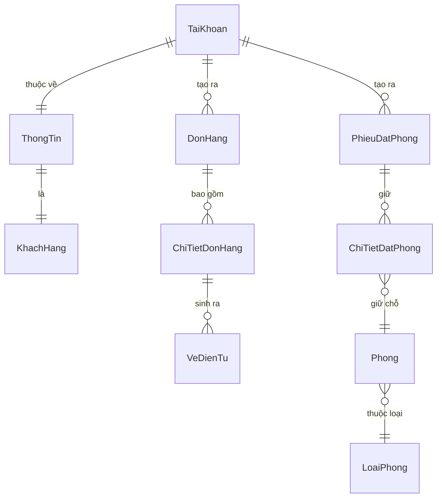

# Khu Du Lịch Đại Nam
# Đặc Tả Yêu Cầu Phần Mềm
# Mã dự án: DN01
# Mã tài liệu: DN01_SRS_Web_KhachHang_v1.0

Hồ Chí Minh, Tháng 05/2026

---

## Lịch sử thay đổi

| Ngày hiệu lực | Hạng mục thay đổi | A/M/D | Mô tả | Phiên bản |
|---|---|---|---|---|
| 08/05/2026 | Phát hành lần đầu | A | Khởi tạo tài liệu SRS Web Portal khách hàng | 1.0 |

*A - Thêm mới, M - Chỉnh sửa, D - Xóa bỏ*

---

## 0. Phạm vi tài liệu

Tài liệu này đặc tả phân hệ **Cổng thông tin Khách hàng (Web Portal)** thuộc hệ thống quản lý vận hành Khu Du lịch Đại Nam.

- **Phạm vi bao gồm:** Đăng ký và đăng nhập tài khoản, mua vé tham quan trực tuyến, đặt phòng khách sạn, hủy đặt phòng, và theo dõi lịch sử sử dụng dịch vụ.
- **Không bao gồm:** Quản lý nội bộ sản phẩm và bảng giá (do phân hệ Desktop POS đảm nhiệm), thanh toán qua cổng ngân hàng thực tế (hiện dùng giả lập), quản lý nhân sự.
- **Đối tượng đọc:** BA, Lập trình viên (Dev), Chuyên viên kiểm thử (Tester), Giảng viên hướng dẫn.

---

## Mục lục

1. [Cổng thông tin Khách hàng (Web Portal)](#1-cổng-thông-tin-khách-hàng)
   - 1.1. [Xác thực tài khoản khách hàng](#11-xác-thực-tài-khoản-khách-hàng)
   - 1.2. [Mua vé tham quan trực tuyến](#12-mua-vé-tham-quan-trực-tuyến)
   - 1.3. [Đặt phòng khách sạn](#13-đặt-phòng-khách-sạn)
   - 1.4. [Quản lý thông tin cá nhân và lịch sử](#14-quản-lý-thông-tin-cá-nhân-và-lịch-sử)
2. [Yêu cầu khác](#2-yêu-cầu-khác)
   - 2.1. [Định dạng dữ liệu](#21-định-dạng-dữ-liệu)
   - 2.2. [Danh mục dữ liệu tham chiếu](#22-danh-mục-dữ-liệu-tham-chiếu)
   - 2.3. [Bảng mã thông báo lỗi](#23-bảng-mã-thông-báo-lỗi)

---

# 1. Cổng thông tin Khách hàng

Phân hệ Web Portal dành cho khách hàng cá nhân bên ngoài truy cập qua trình duyệt. Khách hàng tự phục vụ hoàn toàn: đăng ký tài khoản bằng số điện thoại, chọn và mua vé tham quan khu du lịch, đặt trước phòng khách sạn, và theo dõi tình trạng sử dụng dịch vụ cá nhân của mình. Mọi giao dịch đều yêu cầu phiên đăng nhập hợp lệ để xác định danh tính khách hàng, tránh trường hợp dữ liệu đặt chỗ bị trống người nhận.

---

## 1.1. Xác thực tài khoản khách hàng

### 1.1.1. Tổng quan

Khách hàng truy cập trang Đăng ký để tạo tài khoản mới dựa trên số điện thoại cá nhân, hoặc trang Đăng nhập nếu đã có tài khoản. Sau khi xác thực thành công, hệ thống cấp phát phiên đăng nhập (token) lưu trên thiết bị, cho phép thực hiện mua vé và đặt phòng mà không cần nhập lại thông tin ở các bước tiếp theo.

### 1.1.2. Tác nhân

- **Khách hàng chưa có tài khoản:** thực hiện Đăng ký.
- **Khách hàng đã có tài khoản:** thực hiện Đăng nhập.

### 1.1.3. Biểu đồ use-case

```text
Khách hàng ──── Đăng ký tài khoản mới
             └── Đăng nhập hệ thống
```

#### 1.1.3.1. Tiền điều kiện

- Khách hàng có thiết bị kết nối Internet và trình duyệt web.
- Hệ thống Web API đang hoạt động bình thường.

#### 1.1.3.2. Hậu điều kiện

- Phiên đăng nhập (Bearer Token) được lưu vào bộ nhớ phiên của trình duyệt.
- Thông tin khách hàng (Họ tên, Loại khách, Hạng thành viên) được hiển thị trên thanh điều hướng.
- Tất cả các chức năng yêu cầu xác thực (mua vé, đặt phòng, xem lịch sử) được mở khóa.

#### 1.1.3.3. Điểm kích hoạt

- Khách hàng nhấn vào liên kết Đăng nhập hoặc Đăng ký trên thanh điều hướng.
- Khách hàng cố gắng thực hiện một thao tác yêu cầu đăng nhập (ví dụ: nhấn Thanh toán khi chưa đăng nhập) — hệ thống tự động chuyển hướng sang trang Đăng nhập.

### 1.1.4. Luồng thao tác

#### 1.1.4.1. Tình huống 1 — Đăng ký tài khoản thành công

| | Khách hàng | Hệ thống |
|---|---|---|
| 1 | Nhấn Đăng ký trên thanh menu. | Hiển thị form Đăng ký với các trường nhập liệu ở trạng thái trống. |
| 2 | Nhập đầy đủ Họ tên, Số điện thoại, Mật khẩu và Xác nhận mật khẩu. | Không có hành động tức thì. |
| 3 | Nhấn nút Đăng ký. | Kiểm tra tất cả trường không trống. Kiểm tra mật khẩu và xác nhận mật khẩu khớp nhau. Gửi yêu cầu lên server. |
| 4 | — | Server kiểm tra số điện thoại chưa được đăng ký. Tạo bản ghi đối tác cá nhân, khách hàng hạng Thường và tài khoản Web. Mật khẩu được băm (hash) trước khi lưu. Trả về token. |
| 5 | — | Lưu token vào phiên trình duyệt. Hiển thị thông báo Đăng ký thành công. Chuyển hướng về trang chủ. Thanh điều hướng cập nhật hiển thị tên khách hàng. |

#### 1.1.4.2. Tình huống 2 — Đăng ký thất bại do số điện thoại đã tồn tại

| | Khách hàng | Hệ thống |
|---|---|---|
| 1 | Nhập đầy đủ thông tin đăng ký, trong đó số điện thoại đã được tài khoản khác sử dụng. Nhấn nút Đăng ký. | Gửi yêu cầu lên server. |
| 2 | — | Server phát hiện số điện thoại đã tồn tại. Trả về lỗi ERR_WEB_REG_TRUNG_SDT. |
| 3 | — | Hiển thị thông báo lỗi ngay bên dưới trường Số điện thoại. Giữ nguyên toàn bộ dữ liệu đã nhập, không xóa trắng form. |

#### 1.1.4.3. Tình huống 3 — Đăng nhập thành công

| | Khách hàng | Hệ thống |
|---|---|---|
| 1 | Nhấn Đăng nhập. Nhập Số điện thoại và Mật khẩu. | Hiển thị form Đăng nhập. |
| 2 | Nhấn nút Đăng nhập. | Kiểm tra hai trường không trống. Băm mật khẩu nhập vào và so sánh với giá trị lưu trên cơ sở dữ liệu. |
| 3 | — | Xác thực khớp. Cập nhật thời gian đăng nhập gần nhất. Trả về token kèm thông tin tên khách hàng và vai trò. |
| 4 | — | Lưu token. Cập nhật thanh điều hướng. Chuyển hướng về trang trước đó hoặc trang chủ. |

#### 1.1.4.4. Tình huống 4 — Đăng nhập thất bại

| | Khách hàng | Hệ thống |
|---|---|---|
| 1 | Nhập Số điện thoại hoặc Mật khẩu sai. Nhấn Đăng nhập. | Gửi yêu cầu lên server. |
| 2 | — | Không tìm thấy bản ghi khớp (sai mật khẩu hoặc tài khoản bị vô hiệu hóa). Trả về lỗi ERR_WEB_LOGIN_SAI. |
| 3 | — | Hiển thị thông báo lỗi chung. Không tiết lộ cụ thể sai ở trường nào để tránh kẻ tấn công dò tìm tài khoản. Giữ nguyên số điện thoại đã nhập, xóa trắng trường mật khẩu. |

### 1.1.5. Giao diện

#### 1.1.5.1. Mô tả màn hình — Form Đăng ký

| STT | Tên trường | Control type | Required | Data type | Default value | Mô tả |
|---|---|---|---|---|---|---|
| 1 | Họ và tên | Text Edit | Yes | Nvarchar(200) | Blank | Họ tên đầy đủ của khách hàng. Không được chỉ có khoảng trắng. |
| 2 | Số điện thoại | Text Edit | Yes | Nvarchar(20) | Blank | Dùng làm tên đăng nhập và định danh tài khoản duy nhất. (*) Placeholder: "0901234567" |
| 3 | Mật khẩu | Text Edit (Password) | Yes | Text | Blank | Ký tự bị ẩn khi nhập. |
| 4 | Xác nhận mật khẩu | Text Edit (Password) | Yes | Text | Blank | Phải khớp chính xác với trường Mật khẩu. |
| 5 | Đăng ký | Button | N/A | N/A | N/A | Gửi yêu cầu đăng ký. Hiển thị trạng thái đang xử lý khi đang chờ phản hồi. |
| 6 | Liên kết Đăng nhập | Hyperlink | N/A | N/A | N/A | Chuyển hướng sang trang Đăng nhập dành cho khách hàng đã có tài khoản. |

#### 1.1.5.2. Mô tả màn hình — Form Đăng nhập

| STT | Tên trường | Control type | Required | Data type | Default value | Mô tả |
|---|---|---|---|---|---|---|
| 1 | Số điện thoại | Text Edit | Yes | Nvarchar(20) | Blank | Tên đăng nhập của tài khoản. (*) Placeholder: "0901234567" |
| 2 | Mật khẩu | Text Edit (Password) | Yes | Text | Blank | Ký tự bị ẩn khi nhập. |
| 3 | Đăng nhập | Button | N/A | N/A | N/A | Gửi yêu cầu xác thực. Bị vô hiệu hóa trong khi hệ thống đang xử lý. |
| 4 | Liên kết Đăng ký | Hyperlink | N/A | N/A | N/A | Chuyển hướng sang trang Đăng ký dành cho khách hàng mới. |

#### 1.1.5.3. Hộp thông báo lỗi inline

| Trạng thái | Màu hiển thị |
|---|---|
| Lỗi nhập liệu / Xác thực thất bại | Đỏ (Danger) — hiển thị sát bên dưới form |
| Thành công | Xanh lá (Success) — thông báo ngắn tự ẩn sau 3 giây |

### 1.1.6. Mô tả nghiệp vụ

| STT | Tên | Quy tắc |
|---|---|---|
| 1 | Tài khoản duy nhất theo SĐT | Mỗi số điện thoại chỉ được đăng ký một tài khoản duy nhất. Nếu số điện thoại đã tồn tại, hệ thống từ chối và yêu cầu dùng số khác hoặc đăng nhập vào tài khoản cũ. |
| 2 | Khách hàng cá nhân mặc định | Khi đăng ký thành công, hệ thống tự động tạo hồ sơ đối tác loại Cá nhân và hồ sơ khách hàng với hạng thành viên Thường. Khách hàng không được tự chọn hạng thành viên. |
| 3 | Bảo mật mật khẩu | Mật khẩu không bao giờ được lưu dưới dạng văn bản thô. Hệ thống băm mật khẩu bằng thuật toán SHA-256 trước khi lưu vào cơ sở dữ liệu. Khi đăng nhập, hệ thống băm mật khẩu vừa nhập rồi so sánh với giá trị băm đã lưu. |
| 4 | Thời hạn phiên đăng nhập | Token được cấp có thời hạn 7 ngày kể từ thời điểm tạo. Sau khi hết hạn, khách hàng phải đăng nhập lại. |
| 5 | Tự động chuyển hướng đến đăng nhập | Nếu khách hàng chưa đăng nhập mà thực hiện thao tác mua vé hoặc đặt phòng, hệ thống lập tức chuyển hướng sang trang Đăng nhập thay vì để thao tác tiếp tục nhưng thất bại. |
| 6 | Thông báo lỗi chung | Khi đăng nhập thất bại, hệ thống không tiết lộ cụ thể sai số điện thoại hay sai mật khẩu để ngăn chặn tấn công liệt kê tài khoản (account enumeration). |

### 1.1.7. Quy tắc kiểm tra

| STT | Quy tắc | Mã thông báo |
|---|---|---|
| 1 | Tất cả trường đăng ký bắt buộc không được để trống | ERR_WEB_REG_TRONG |
| 2 | Xác nhận mật khẩu phải khớp với mật khẩu | ERR_WEB_REG_MATKHAU_KHONGKHOP |
| 3 | Số điện thoại đã được đăng ký trước đó | ERR_WEB_REG_TRUNG_SDT |
| 4 | Số điện thoại hoặc Mật khẩu đăng nhập không được để trống | ERR_WEB_LOGIN_TRONG |
| 5 | Thông tin đăng nhập không khớp hoặc tài khoản bị vô hiệu hóa | ERR_WEB_LOGIN_SAI |

### 1.1.8. Liên kết use-case

- Mua vé tham quan trực tuyến (1.2)
- Đặt phòng khách sạn (1.3)
- Quản lý thông tin cá nhân và lịch sử (1.4)

---

## 1.2. Mua vé tham quan trực tuyến

### 1.2.1. Tổng quan

Khách hàng truy cập danh sách vé tham quan (vé vào khu, vé trò chơi), điều chỉnh số lượng theo từng loại vé bằng nút cộng/trừ, và tiến hành thanh toán giả lập để nhận ngay vé điện tử dưới dạng mã vạch. Mỗi đơn hàng có thể bao gồm nhiều loại vé cùng lúc. Mỗi vé điện tử trong đơn nhận một mã vạch riêng biệt và độc lập, tương ứng với số lượt quét cổng được phép sử dụng.

### 1.2.2. Tác nhân

- Khách hàng (đã đăng nhập)

### 1.2.3. Biểu đồ use-case

```text
Khách hàng ──── Xem danh sách vé đang bán
             ├── Thêm vé vào giỏ hàng
             ├── Giảm số lượng vé trong giỏ
             └── Thanh toán và nhận vé điện tử
```

#### 1.2.3.1. Tiền điều kiện

- Khách hàng đã đăng nhập thành công.
- Bộ phận quản trị đã khai báo danh sách sản phẩm loại Vé (VeVaoKhu hoặc VeTroChoi) và thiết lập bảng giá còn trong thời hạn hiệu lực.

#### 1.2.3.2. Hậu điều kiện

- Đơn hàng được lưu vào cơ sở dữ liệu với mã đơn dạng WEByyMMddHHmmss.
- Mỗi đơn vị sản phẩm trong giỏ hàng tạo ra một bản ghi Vé điện tử riêng biệt, gắn mã vạch ngẫu nhiên duy nhất.
- Khách hàng nhìn thấy mã vạch ngay trên màn hình kết quả và có thể tra lại trong mục Thông tin của tôi.

#### 1.2.3.3. Điểm kích hoạt

- Khách hàng chọn mục Mua vé trên thanh điều hướng.

### 1.2.4. Luồng thao tác

#### 1.2.4.1. Tình huống 1 — Mua vé thành công

| | Khách hàng | Hệ thống |
|---|---|---|
| 1 | Chọn mục Mua vé trên menu. | Hiển thị trạng thái đang tải. Tải danh sách vé đang kinh doanh từ server. Hiển thị lưới thẻ vé. |
| 2 | Nhấn nút cộng trên thẻ vé để thêm số lượng. | Cập nhật số lượng trên thẻ vé đó. Nếu tổng giỏ hàng lớn hơn 0, hiển thị phần Tóm tắt giỏ hàng bên dưới kèm tổng tiền. |
| 3 | Điều chỉnh số lượng nhiều loại vé khác nhau tùy ý. | Tóm tắt giỏ hàng tự cập nhật theo thời gian thực. |
| 4 | Nhấn nút Thanh toán trong phần Tóm tắt giỏ hàng. | Kiểm tra trạng thái đăng nhập. Nếu chưa đăng nhập, chuyển sang trang Đăng nhập. |
| 5 | — | Gửi danh sách mặt hàng và ID tài khoản lên server. Vô hiệu hóa nút Thanh toán và hiển thị trạng thái Đang xử lý. |
| 6 | — | Server tính lại đơn giá từng sản phẩm tại thời điểm hiện tại (không tin tưởng giá từ giao diện). Tạo đơn hàng, sinh vé điện tử tương ứng số lượng, gắn mã vạch riêng cho mỗi vé. |
| 7 | — | Trả về kết quả thành công. Xóa trống giỏ hàng. Hiển thị khối Mua vé thành công kèm mã đơn hàng, tổng thanh toán và danh sách từng mã vạch vé. |

#### 1.2.4.2. Tình huống 2 — Giỏ hàng đang có dữ liệu, nhấn Thanh toán khi chưa đăng nhập

| | Khách hàng | Hệ thống |
|---|---|---|
| 1 | Chọn nhiều vé vào giỏ. Nhấn Thanh toán. | Phát hiện phiên đăng nhập không tồn tại hoặc đã hết hạn. |
| 2 | — | Lưu lại trạng thái ý định thanh toán. Chuyển hướng khách hàng đến trang Đăng nhập. |
| 3 | Đăng nhập thành công. | Chuyển hướng lại trang Mua vé. Giỏ hàng quay về trạng thái trống vì chưa lưu phía server — khách hàng cần chọn lại. |

#### 1.2.4.3. Tình huống 3 — Lỗi server khi thanh toán

| | Khách hàng | Hệ thống |
|---|---|---|
| 1 | Nhấn Thanh toán với giỏ hàng hợp lệ. | Gửi yêu cầu lên server. Server trả về lỗi (lỗi kết nối hoặc ngoại lệ nghiệp vụ). |
| 2 | — | Hiển thị thông báo Thanh toán thất bại. Tái kích hoạt nút Thanh toán. Giữ nguyên dữ liệu giỏ hàng để khách hàng thử lại mà không phải chọn lại từ đầu. |

#### 1.2.4.4. Tình huống 4 — Không có vé nào đang bán

| | Khách hàng | Hệ thống |
|---|---|---|
| 1 | Vào trang Mua vé. | Tải danh sách vé từ server. Danh sách trả về rỗng (tất cả vé đều đang Tạm ngưng hoặc Ngừng bán). |
| 2 | — | Hiển thị thông báo Hiện chưa có vé nào đang bán thay cho lưới thẻ vé. |

### 1.2.5. Giao diện

#### 1.2.5.1. Mô tả màn hình — Lưới thẻ vé (Card View, Read-only)

| STT | Tên trường | Control type | Data type | Mô tả |
|---|---|---|---|---|
| 1 | Biểu tượng loại vé | Icon | N/A | Biểu tượng cửa (vé vào khu) hoặc tay cầm (vé trò chơi), giúp phân biệt nhanh. |
| 2 | Nhãn loại vé | Label | Text | Hiển thị Vé vào khu hoặc Vé trò chơi. |
| 3 | Tên vé | Label | Text | Tên hiển thị của sản phẩm. |
| 4 | Khu vực áp dụng | Label | Text | Tên khu vực du lịch liên quan (ví dụ: Khu Trượt Nước). Ẩn nếu không có. |
| 5 | Giá bán | Label | Decimal | Đơn giá hiện hành. Định dạng: N,NNN ₫ |

#### 1.2.5.2. Mô tả màn hình — Điều chỉnh số lượng (trên từng thẻ vé)

| STT | Tên trường | Control type | Required | Data type | Default value | Mô tả |
|---|---|---|---|---|---|---|
| 1 | Nút giảm số lượng | Button | N/A | N/A | N/A | Giảm số lượng vé loại này xuống 1. Bị vô hiệu hóa nếu số lượng hiện tại bằng 0. |
| 2 | Số lượng | Label | N/A | Integer | 0 | Số lượng vé đang chọn mua của từng loại. |
| 3 | Nút tăng số lượng | Button | N/A | N/A | N/A | Tăng số lượng vé loại này lên 1. |

#### 1.2.5.3. Mô tả màn hình — Tóm tắt giỏ hàng (Panel)

Chỉ hiển thị khi tổng số lượng vé được chọn lớn hơn 0.

| STT | Tên trường | Control type | Data type | Mô tả |
|---|---|---|---|---|
| 1 | Danh sách dòng giỏ hàng | List (Read-only) | Text | Mỗi dòng hiển thị: Tên vé × Số lượng — Thành tiền |
| 2 | Tổng tiền | Label | Text | Tổng cộng toàn bộ đơn. Định dạng: Tổng: N,NNN ₫ |
| 3 | Thanh toán | Button | N/A | N/A | Chốt đơn. Hiển thị Đang xử lý trong lúc chờ server phản hồi. |

#### 1.2.5.4. Mô tả màn hình — Kết quả mua thành công (Panel)

| STT | Tên trường | Control type | Data type | Mô tả |
|---|---|---|---|---|
| 1 | Biểu tượng thành công | Icon | N/A | Dấu tích xanh lá kích thước lớn. |
| 2 | Mã đơn hàng | Label | Text | Mã định danh giao dịch (ví dụ: WEB2605081423). |
| 3 | Tổng thanh toán | Label | Decimal | Số tiền khách hàng đã thanh toán. Định dạng: N,NNN ₫ |
| 4 | Danh sách vé | List (Read-only) | Text | Mỗi dòng gồm: Tên sản phẩm — Mã vạch. Mã vạch hiển thị dạng chữ dùng để soát cổng. |

### 1.2.6. Mô tả nghiệp vụ

| STT | Tên | Quy tắc |
|---|---|---|
| 1 | Tính giá tại thời điểm thanh toán | Khi khách hàng nhấn Thanh toán, server phải truy vấn lại đơn giá hiện hành của từng sản phẩm thay vì dùng giá giao diện truyền lên. Quy tắc này ngăn chặn tình huống khách hàng chỉnh sửa giá trên gói yêu cầu trước khi gửi (client-side tampering). |
| 2 | Mỗi số lượng tạo một vé riêng | Nếu khách hàng mua 3 vé Người lớn Khu Trượt Nước, hệ thống tạo 3 bản ghi vé điện tử độc lập, mỗi bản ghi có mã vạch riêng. Các vé này dùng để soát riêng lẻ, không thể quét chung một mã cho cả 3 người. |
| 3 | Tiền tố mã đơn hàng | Mã đơn hàng trên web luôn bắt đầu bằng WEB để phân biệt với đơn hàng từ máy POS (bắt đầu bằng POS hoặc mã quầy). |
| 4 | Thanh toán giả lập | Phiên bản hiện tại sử dụng thanh toán giả lập — mọi yêu cầu thanh toán hợp lệ đều được chấp thuận ngay lập tức mà không cần liên kết thẻ ngân hàng hoặc ví điện tử. |
| 5 | Giỏ hàng chỉ lưu tạm trên trình duyệt | Dữ liệu giỏ hàng (số lượng đang chọn) không được lưu lên server cho đến khi nhấn Thanh toán. Nếu khách hàng tải lại trang, giỏ hàng sẽ bị xóa trắng. |

### 1.2.7. Quy tắc kiểm tra

| STT | Quy tắc | Mã thông báo |
|---|---|---|
| 1 | Khách hàng phải đăng nhập trước khi nhấn Thanh toán | ERR_WEB_CHUA_DANGNHAP |
| 2 | Giỏ hàng không được rỗng khi gửi yêu cầu thanh toán | ERR_WEB_GIOHANG_TRONG |
| 3 | Xử lý đơn hàng thất bại phía server | ERR_WEB_THANHTOAN_THATBAI |

### 1.2.8. Liên kết use-case

- Xác thực tài khoản khách hàng (1.1)
- Quản lý thông tin cá nhân và lịch sử (1.4)

---

## 1.3. Đặt phòng khách sạn

### 1.3.1. Tổng quan

Khách hàng chọn ngày nhận và trả phòng, yêu cầu hệ thống tìm các loại phòng còn chỗ trống. Kết quả trả về bao gồm tên loại phòng, mô tả, sức chứa, tiện nghi, giá mỗi đêm, tổng tiền tính sẵn và tiền cọc yêu cầu. Khách hàng nhấn Đặt phòng để hệ thống giữ ngay 1 phòng vật lý, tạo phiếu đặt phòng và thu cọc giả lập.

### 1.3.2. Tác nhân

- Khách hàng (đã đăng nhập)

### 1.3.3. Biểu đồ use-case

```text
Khách hàng ──── Tìm kiếm phòng trống theo ngày
             └── Đặt giữ loại phòng <<include>> Xác thực đăng nhập
```

#### 1.3.3.1. Tiền điều kiện

- Khách hàng đã đăng nhập.
- Hệ thống có khai báo ít nhất 1 loại phòng và phòng vật lý ở trạng thái Trống với bảng giá hợp lệ.

#### 1.3.3.2. Hậu điều kiện

- Phiếu đặt phòng mới được tạo ở trạng thái Đặt trước.
- Một phòng vật lý cụ thể được giữ riêng cho phiếu đó — không thể bị đặt trùng bởi khách hàng khác.
- Thông tin phiếu xuất hiện trong Tab Đặt phòng của trang Thông tin của tôi.

#### 1.3.3.3. Điểm kích hoạt

- Khách hàng chọn mục Đặt phòng trên thanh điều hướng.

### 1.3.4. Luồng thao tác

#### 1.3.4.1. Tình huống 1 — Tìm phòng và đặt thành công

| | Khách hàng | Hệ thống |
|---|---|---|
| 1 | Chọn mục Đặt phòng. | Hiển thị bộ lọc ngày nhận và trả phòng. Mặc định: Ngày nhận = ngày mai, Ngày trả = ngày mốt. |
| 2 | Thay đổi ngày nhận và ngày trả phòng. Nhấn nút Tìm phòng. | Kiểm tra ngày trả phải sau ngày nhận. Hiển thị trạng thái đang tìm. Gọi API lấy danh sách loại phòng còn chỗ. |
| 3 | — | Trả về danh sách thẻ loại phòng: tên, mô tả, sức chứa, tiện nghi, giá/đêm, tổng tiền, cọc 30%. Loại phòng hết chỗ hiển thị nhãn Hết phòng và nút bị vô hiệu hóa. |
| 4 | Xem thông tin, chọn loại phòng phù hợp. Nhấn nút Đặt loại phòng này. | Kiểm tra đăng nhập. Gửi yêu cầu đặt phòng lên server với loại phòng, ngày, ID tài khoản. |
| 5 | — | Server khóa hàng (UPDLOCK, ROWLOCK) trên bảng phòng vật lý để tránh 2 khách đặt trùng cùng lúc. Tìm 1 phòng vật lý trống. Tạo phiếu đặt phòng trạng thái Đặt trước. Thu cọc giả lập. |
| 6 | — | Trả về kết quả. Hiển thị thông báo Đặt phòng thành công kèm mã đặt phòng, tiền phòng và tiền cọc đã thu. |

#### 1.3.4.2. Tình huống 2 — Hết phòng vào thời điểm xác nhận (Race condition)

| | Khách hàng | Hệ thống |
|---|---|---|
| 1 | Thấy danh sách hiển thị còn phòng. Nhấn Đặt phòng. | Gửi yêu cầu lên server. |
| 2 | — | Trong khoảnh khắc giữa lúc trang hiển thị và lúc xác nhận, một khách hàng khác đã đặt mất phòng cuối cùng. Server không tìm được phòng vật lý trống. |
| 3 | — | Trả về lỗi ERR_WEB_HOTEL_HETPHONG. Hiển thị thông báo lỗi. Khuyến nghị khách hàng thử tìm lại với ngày khác. |

#### 1.3.4.3. Tình huống 3 — Chưa đăng nhập khi nhấn Đặt phòng

| | Khách hàng | Hệ thống |
|---|---|---|
| 1 | Tìm phòng thành công. Nhấn Đặt loại phòng này khi chưa đăng nhập. | Phát hiện chưa có phiên đăng nhập. |
| 2 | — | Chuyển hướng sang trang Đăng nhập. Sau khi đăng nhập, quay lại trang Đặt phòng — khách hàng cần nhấn Tìm phòng lại. |

### 1.3.5. Giao diện

#### 1.3.5.1. Mô tả màn hình — Bộ lọc tìm phòng

| STT | Tên trường | Control type | Required | Data type | Default value | Mô tả |
|---|---|---|---|---|---|---|
| 1 | Ngày nhận phòng | Date Edit | Yes | Date | Ngày mai | Ngày dự kiến check-in. Chỉ chọn từ hôm nay trở đi. |
| 2 | Ngày trả phòng | Date Edit | Yes | Date | Ngày mốt | Ngày dự kiến check-out. Tự động giới hạn tối thiểu bằng Ngày nhận + 1 ngày. |
| 3 | Tìm phòng | Button | N/A | N/A | N/A | Tải danh sách phòng theo ngày đã chọn. Hiển thị Đang tìm... trong khi chờ phản hồi. |

#### 1.3.5.2. Mô tả màn hình — Thẻ loại phòng (Card View, Read-only)

| STT | Tên trường | Control type | Data type | Mô tả |
|---|---|---|---|---|
| 1 | Tên loại phòng | Label | Text | Ví dụ: Phòng Deluxe, Phòng Suite. |
| 2 | Tình trạng phòng | Badge | Text | Hiển thị Còn N phòng (xanh lá) hoặc Hết phòng (đỏ). |
| 3 | Mô tả | Label | Text | Mô tả ngắn về đặc điểm phòng. Ẩn nếu không có. |
| 4 | Sức chứa | Label | Integer | Hiển thị: Tối đa N người. Ẩn nếu bằng 0. |
| 5 | Diện tích | Label | Decimal | Hiển thị: N m². Ẩn nếu bằng 0. |
| 6 | Tiện nghi | Tag List | Text | Danh sách tiện nghi hiển thị dạng nhãn (wifi, điều hòa, bồn tắm...). |
| 7 | Giá mỗi đêm | Label | Decimal | Định dạng: N,NNN ₫/đêm. |
| 8 | Số đêm và tổng tiền | Label | Text | Hiển thị: N đêm = Tổng N,NNN ₫. Tính tự động từ ngày đã chọn. |
| 9 | Tiền cọc | Label | Decimal | Hiển thị: Cọc 30%: N,NNN ₫. Được làm tròn về số nguyên. |
| 10 | Đặt phòng | Button | N/A | N/A | Thực hiện giữ phòng. Bị vô hiệu hóa nếu hết phòng hoặc đang xử lý. |

#### 1.3.5.3. Mô tả màn hình — Kết quả đặt phòng thành công (Panel)

| STT | Tên trường | Control type | Data type | Mô tả |
|---|---|---|---|---|
| 1 | Tiêu đề thành công | Label | Text | Đặt phòng thành công! kèm biểu tượng dấu tích. |
| 2 | Mã đặt phòng | Label | Text | Mã phiếu để đối chiếu khi đến khách sạn. |
| 3 | Tiền phòng | Label | Decimal | Tổng tiền lưu trú theo số đêm. |
| 4 | Tiền cọc đã thu | Label | Decimal | Số tiền cọc giả lập đã thu. |
| 5 | Ghi chú phân phòng | Label | Text | Thông báo cố định: Phòng cụ thể sẽ được sắp xếp khi đến check-in tại lễ tân. Nếu không đến đúng hạn, hệ thống tự động nhả phòng và cọc không được hoàn. |

### 1.3.6. Mô tả nghiệp vụ

| STT | Tên | Quy tắc |
|---|---|---|
| 1 | Tìm phòng theo khoảng thời gian | Một phòng vật lý được coi là trống trong khoảng ngày yêu cầu nếu không có phiếu đặt phòng nào đang ở trạng thái Đang ở, hoặc đang ở trạng thái Đặt trước mà chưa quá 1 giờ so với giờ nhận phòng dự kiến, trùng lịch với khoảng thời gian đó. |
| 2 | Chống đặt trùng (Concurrency Lock) | Khi khách hàng nhấn Đặt phòng, server dùng lệnh SELECT ... WITH (UPDLOCK, ROWLOCK) để khóa bản ghi phòng vật lý được chọn trong suốt giao dịch. Nếu hai khách cùng đặt cùng lúc, chỉ một người đặt thành công; người còn lại nhận lỗi ERR_WEB_HOTEL_HETPHONG. |
| 3 | Tiền cọc 30% | Hệ thống tự động tính tiền cọc bằng 30% tổng tiền phòng (làm tròn xuống số nguyên). Khách hàng không được tự thay đổi mức cọc. |
| 4 | Phân phòng vật lý ngầm | Khách hàng web chỉ chọn Loại phòng. Hệ thống tự phân bổ một phòng vật lý cụ thể phù hợp với loại đó. Số phòng thực tế sẽ được nhân viên lễ tân thông báo khi khách đến làm thủ tục nhận phòng trực tiếp. |
| 5 | Phòng tự nhả khi no-show | Phiếu đặt trước mà khách không đến nhận phòng sau khi quá 1 giờ so với giờ check-in dự kiến sẽ bị hệ thống tự động bỏ ra khỏi danh sách đang chiếm dụng. Phòng vật lý đó có thể được đặt lại bởi khách hàng khác. |

### 1.3.7. Quy tắc kiểm tra

| STT | Quy tắc | Mã thông báo |
|---|---|---|
| 1 | Khách hàng phải đăng nhập trước khi đặt phòng | ERR_WEB_CHUA_DANGNHAP |
| 2 | Ngày trả phòng phải sau ngày nhận phòng | ERR_WEB_HOTEL_NGAYSAI |
| 3 | Không còn phòng trống trong thời gian thực hiện giao dịch | ERR_WEB_HOTEL_HETPHONG |

### 1.3.8. Liên kết use-case

- Xác thực tài khoản khách hàng (1.1)
- Quản lý thông tin cá nhân và lịch sử (1.4)

---


## 1.4. Quản lý thông tin cá nhân và lịch sử

### 1.4.1. Tổng quan

Trang Thông tin của tôi là nơi khách hàng theo dõi toàn bộ giao dịch đã thực hiện. Giao diện chia thành 2 tab: Tab Vé của tôi hiển thị danh sách vé điện tử kèm mã vạch còn dùng được; Tab Đặt phòng liệt kê các phiếu đặt khách sạn kèm trạng thái và cho phép hủy các phiếu đang ở trạng thái Đặt trước với chính sách hoàn cọc rõ ràng.

### 1.4.2. Tác nhân

- Khách hàng (đã đăng nhập)

### 1.4.3. Biểu đồ use-case

```text
Khách hàng ──── Xem vé điện tử và mã vạch
             ├── Xem danh sách phiếu đặt phòng
             └── Hủy phiếu đặt phòng <<extend>> Áp dụng chính sách hoàn cọc
```

#### 1.4.3.1. Tiền điều kiện

- Khách hàng đã đăng nhập.

#### 1.4.3.2. Hậu điều kiện

- Nếu hủy phòng: phiếu chuyển sang trạng thái Đã hủy, phòng vật lý được giải phóng, tiền hoàn được thông báo rõ.

#### 1.4.3.3. Điểm kích hoạt

- Khách hàng chọn mục Thông tin của tôi trên thanh điều hướng.

### 1.4.4. Luồng thao tác

#### 1.4.4.1. Tình huống 1 — Xem vé điện tử và mã vạch

| | Khách hàng | Hệ thống |
|---|---|---|
| 1 | Chọn mục Thông tin của tôi. | Kiểm tra đăng nhập. Hiển thị tên khách hàng trên tiêu đề. Tab Vé của tôi hiển thị mặc định. Tải danh sách vé. |
| 2 | — | Hiển thị danh sách vé điện tử thuộc về tài khoản, sắp xếp từ mới nhất. |
| 3 | Đọc mã vạch, sử dụng để soát vé tại cổng vào khu. | — |

#### 1.4.4.2. Tình huống 2 — Hủy phòng được hoàn cọc (hủy sớm)

| | Khách hàng | Hệ thống |
|---|---|---|
| 1 | Nhấn Tab Đặt phòng. | Tải danh sách phiếu. Phiếu trạng thái Đặt trước có thêm nút Hủy phòng. |
| 2 | Nhấn nút Hủy phòng tại phiếu còn cách ngày nhận phòng từ 3 ngày trở lên. | Gửi yêu cầu hủy lên server. |
| 3 | — | Server xác nhận phiếu hợp lệ và thuộc tài khoản. Khoảng cách ngày từ 3 trở lên — hoàn 100% cọc. Cập nhật trạng thái Đã hủy. Giải phóng phòng vật lý. |
| 4 | — | Hiển thị thông báo: Hủy thành công. Hoàn cọc N,NNN ₫ (hủy trước N ngày). |

#### 1.4.4.3. Tình huống 3 — Hủy phòng không được hoàn cọc (hủy trễ)

| | Khách hàng | Hệ thống |
|---|---|---|
| 1 | Nhấn Hủy phòng tại phiếu chỉ còn chưa đến 3 ngày trước ngày nhận phòng. | Gửi yêu cầu hủy. |
| 2 | — | Khoảng cách ngày dưới 3 — không hoàn cọc. Thực hiện hủy phiếu và giải phóng phòng. |
| 3 | — | Hiển thị thông báo: Hủy thành công. Không hoàn cọc (hủy trong vòng 3 ngày trước ngày đến). |

#### 1.4.4.4. Tình huống 4 — Chưa đăng nhập khi truy cập

| | Khách hàng | Hệ thống |
|---|---|---|
| 1 | Truy cập trang Thông tin của tôi khi chưa đăng nhập. | Phát hiện chưa có phiên đăng nhập hợp lệ. |
| 2 | — | Hiển thị thông báo Vui lòng đăng nhập để xem thông tin kèm liên kết đến trang Đăng nhập. Không hiển thị bất kỳ dữ liệu cá nhân nào. |

### 1.4.5. Giao diện

#### 1.4.5.1. Mô tả màn hình — Thanh Tab điều hướng

| STT | Tên trường | Control type | Required | Data type | Default value | Mô tả |
|---|---|---|---|---|---|---|
| 1 | Tab Vé của tôi | Button (Toggle) | N/A | N/A | Đang chọn | Hiển thị danh sách vé điện tử. Hiển thị mặc định khi vào trang. |
| 2 | Tab Đặt phòng | Button (Toggle) | N/A | N/A | N/A | Hiển thị danh sách phiếu đặt phòng khách sạn. |

#### 1.4.5.2. Mô tả màn hình — Danh sách vé điện tử (Read-only)

| STT | Tên cột | Control type | Data type | Mô tả |
|---|---|---|---|---|
| 1 | Tên sản phẩm | Label | Text | Tên loại vé đã mua. |
| 2 | Mã vạch | Label | Text | Mã soát vé tại cổng. Hiển thị kiểu chữ đơn cách (monospace). |
| 3 | Trạng thái | Badge | Text | Chưa sử dụng (xanh lá), Đã sử dụng (xám), Đã hủy (đỏ). |
| 4 | Số lượt còn lại | Label | Integer | Số lần được phép quét cổng còn lại. |

#### 1.4.5.3. Row style — Vé điện tử

| Trạng thái | Màu badge |
|---|---|
| ChuaSuDung | Xanh lá (Success) |
| DaSuDung | Xám (Muted) |
| DaHuy | Đỏ (Danger) |

#### 1.4.5.4. Mô tả màn hình — Danh sách phiếu đặt phòng (Read-only)

| STT | Tên cột | Control type | Data type | Mô tả |
|---|---|---|---|---|
| 1 | Loại phòng | Label | Text | Tên loại phòng đã đặt. |
| 2 | Thời gian | Label | Text | Ngày nhận đến Ngày trả (số đêm). |
| 3 | Trạng thái | Badge | Text | Đã đặt, Đang ở, Đã trả, Đã hủy. |
| 4 | Tài chính | Label | Text | Cọc N,NNN ₫ / Tổng N,NNN ₫. |
| 5 | Hủy phòng | Button (Danger) | N/A | Chỉ xuất hiện khi trạng thái là Đã đặt. |

#### 1.4.5.5. Row style — Phiếu đặt phòng

| Trạng thái | Màu badge |
|---|---|
| DatTruoc | Xanh lam (Info) |
| DangO | Xanh lá (Success) |
| DaTra | Xám (Muted) |
| DaHuy | Đỏ (Danger) |

### 1.4.6. Mô tả nghiệp vụ

| STT | Tên | Quy tắc |
|---|---|---|
| 1 | Quyền riêng tư dữ liệu | Khách hàng chỉ thấy vé và phiếu đặt phòng của chính mình. ID tài khoản luôn được lấy từ token phiên đăng nhập, không nhận từ tham số URL để ngăn tấn công IDOR. |
| 2 | Điều kiện hiển thị nút Hủy | Nút Hủy phòng chỉ xuất hiện với phiếu ở trạng thái Đặt trước. Các trạng thái Đang ở, Đã trả, Đã hủy không có nút này. |
| 3 | Chính sách hoàn cọc 3 ngày | Hệ thống tính khoảng cách ngày từ hôm nay đến ngày nhận phòng. Nếu khoảng cách từ 3 ngày trở lên: hoàn 100% tiền cọc. Nếu dưới 3 ngày (bao gồm cùng ngày): không hoàn cọc. |
| 4 | Giải phóng phòng khi hủy | Sau khi phiếu được hủy thành công, phòng vật lý tương ứng ngay lập tức trở về trạng thái Trống và có thể được đặt bởi khách hàng khác. |

### 1.4.7. Quy tắc kiểm tra

| STT | Quy tắc | Mã thông báo |
|---|---|---|
| 1 | Phiếu không tồn tại hoặc không thuộc tài khoản yêu cầu | ERR_WEB_PHIEU_KHONGSOHUU |
| 2 | Không thể hủy phiếu ở trạng thái không cho phép | ERR_WEB_PHIEU_KHONGTHEHUY |

### 1.4.8. Liên kết use-case

- Xác thực tài khoản khách hàng (1.1)
- Mua vé tham quan trực tuyến (1.2)
- Đặt phòng khách sạn (1.3)

---

# 2. Yêu cầu khác

## 2.1. Định dạng dữ liệu

### 2.1.1. Ngày giờ

- Định dạng ngày hiển thị: dd/MM/yyyy. Ví dụ: 08/05/2026.

### 2.1.2. Số tiền

- Số tiền luôn kèm ký hiệu ₫ và phân cách hàng nghìn bằng dấu phẩy, không có số thập phân. Ví dụ: 450,000 ₫.
- Tiền cọc làm tròn xuống về số nguyên.

## 2.2. Danh mục dữ liệu tham chiếu

### 2.2.1. Trạng thái Vé điện tử

| Mã | Tên hiển thị | Ý nghĩa |
|---|---|---|
| ChuaSuDung | Chưa sử dụng | Vé còn ít nhất 1 lượt quét. |
| DaSuDung | Đã sử dụng | Vé hết lượt hoặc đã quét đủ. |
| DaHuy | Đã hủy | Vé bị vô hiệu hóa. |

### 2.2.2. Trạng thái Phiếu đặt phòng

| Mã | Tên hiển thị | Ý nghĩa |
|---|---|---|
| DatTruoc | Đã đặt | Đã giữ phòng, chưa đến nhận. |
| DangO | Đang ở | Đã làm thủ tục nhận phòng tại lễ tân. |
| DaTra | Đã trả | Khách đã trả phòng và thanh toán đầy đủ. |
| DaHuy | Đã hủy | Phiếu bị hủy bởi khách hàng hoặc hệ thống. |

## 2.3. Phân quyền truy cập

| Chức năng | Khách chưa đăng nhập | Khách đã đăng nhập |
|---|---|---|
| Xem danh sách vé / loại phòng | Được phép | Được phép |
| Mua vé | Không — chuyển đăng nhập | Được phép |
| Đặt phòng | Không — chuyển đăng nhập | Được phép |
| Xem vé và lịch sử đặt phòng | Không | Chỉ xem của chính mình |
| Hủy đặt phòng | Không | Chỉ hủy phiếu của chính mình |

## 2.4. Sơ đồ thực thể liên kết (ERD)



## 2.5. Yêu cầu phi chức năng

1. **Bảo mật API:** Tất cả endpoint thao tác cá nhân phải có header `Authorization: Bearer <token>`. Server trả về 401 nếu thiếu hoặc hết hạn.
2. **Chống giả mạo giá:** Server luôn tự tra cứu giá tại thời điểm giao dịch.
3. **Chống IDOR:** Server lọc dữ liệu theo ID tài khoản từ token, không theo ID từ request body.
4. **Hiệu năng:** Tải danh sách vé và phòng trong vòng 2 giây trên kết nối thông thường.
5. **Tương thích:** Chrome, Firefox, Safari, Edge. Responsive từ 375px chiều rộng.

## 2.6. Bảng mã thông báo lỗi

| Mã thông báo | Nội dung tiếng Việt |
|---|---|
| ERR_WEB_REG_TRONG | Vui lòng điền đầy đủ thông tin đăng ký |
| ERR_WEB_REG_MATKHAU_KHONGKHOP | Mật khẩu xác nhận không khớp |
| ERR_WEB_REG_TRUNG_SDT | Số điện thoại này đã được đăng ký |
| ERR_WEB_LOGIN_TRONG | Vui lòng điền số điện thoại và mật khẩu |
| ERR_WEB_LOGIN_SAI | Thông tin đăng nhập không chính xác |
| ERR_WEB_CHUA_DANGNHAP | Vui lòng đăng nhập để tiếp tục |
| ERR_WEB_GIOHANG_TRONG | Giỏ hàng trống. Vui lòng chọn ít nhất 1 vé |
| ERR_WEB_THANHTOAN_THATBAI | Thanh toán thất bại. Vui lòng thử lại |
| ERR_WEB_HOTEL_NGAYSAI | Ngày trả phòng phải sau ngày nhận phòng |
| ERR_WEB_HOTEL_HETPHONG | Rất tiếc, không còn phòng trống cho loại phòng này |
| ERR_WEB_PHIEU_KHONGSOHUU | Phiếu đặt phòng không hợp lệ hoặc không thuộc tài khoản của bạn |
| ERR_WEB_PHIEU_KHONGTHEHUY | Không thể hủy phiếu đặt phòng ở trạng thái hiện tại |
| MSG_WEB_DANGKY_THANHCONG | Đăng ký thành công! Chào mừng bạn đến với Đại Nam. |
| MSG_WEB_MUAVE_THANHCONG | Mua vé thành công! Lưu mã vạch để soát vé tại cổng. |
| MSG_WEB_DATPHONG_THANHCONG | Đặt phòng thành công! Mang mã đặt phòng đến lễ tân khi nhận phòng. |
| MSG_WEB_HUYPHONG_THANHCONG | Hủy phòng thành công. |

