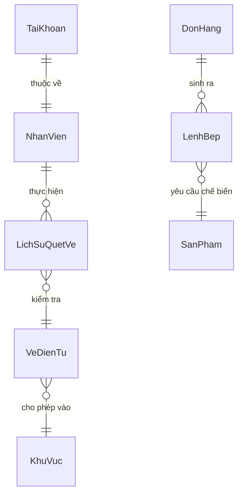

# Khu Du Lịch Đại Nam
# Đặc Tả Yêu Cầu Phần Mềm
# Mã dự án: DN01
# Mã tài liệu: DN01_SRS_DiDong_NhanVien_v1.0

Hồ Chí Minh, Tháng 05/2026

---

## Lịch sử thay đổi

| Ngày hiệu lực | Hạng mục thay đổi | A/M/D | Mô tả | Phiên bản |
|---|---|---|---|---|
| 08/05/2026 | Phát hành lần đầu | A | Khởi tạo tài liệu SRS Ứng dụng Nhân viên (Soát vé & Bếp KDS) | 1.0 |

*A - Thêm mới, M - Chỉnh sửa, D - Xóa bỏ*

---

## 0. Phạm vi tài liệu

Tài liệu này đặc tả phân hệ **Ứng dụng Nhân viên (Staff App)** thuộc hệ thống quản lý vận hành Khu Du lịch Đại Nam.

- **Phạm vi bao gồm:** Đăng nhập nhân viên nội bộ, soát vé cổng bằng thiết bị di động (camera QR / barcode), màn hình điều phối bếp KDS (Kitchen Display System).
- **Không bao gồm:** Quản lý nhân sự, bán hàng POS, báo cáo doanh thu (được đặc tả ở tài liệu riêng).
- **Đối tượng đọc:** BA, Lập trình viên (Dev), Chuyên viên kiểm thử (Tester), Giảng viên hướng dẫn.
- **Thiết bị triển khai:** Điện thoại thông minh hoặc máy tính bảng Android/iOS có kết nối mạng nội bộ. Ứng dụng chạy dưới dạng web app trên trình duyệt thiết bị di động (Blazor WebAssembly hoặc Progressive Web App).

---

## Mục lục

1. [Ứng dụng Nhân viên (Staff App)](#1-ứng-dụng-nhân-viên-staff-app)
   - 1.1. [Xác thực nhân viên](#11-xác-thực-nhân-viên)
   - 1.2. [Soát vé cổng bằng thiết bị di động](#12-soát-vé-cổng-bằng-thiết-bị-di-động)
   - 1.3. [Màn hình điều phối bếp (KDS)](#13-màn-hình-điều-phối-bếp-kds)
2. [Yêu cầu khác](#2-yêu-cầu-khác)
   - 2.1. [Định dạng dữ liệu](#21-định-dạng-dữ-liệu)
   - 2.2. [Danh mục dữ liệu tham chiếu](#22-danh-mục-dữ-liệu-tham-chiếu)
   - 2.3. [Bảng mã thông báo lỗi](#23-bảng-mã-thông-báo-lỗi)

---

# 1. Ứng dụng Nhân viên (Staff App)

Phân hệ Staff App phục vụ nhân viên vận hành tại hiện trường Khu du lịch. Ứng dụng được tối ưu cho màn hình nhỏ (điện thoại, máy quét chuyên dụng, tablet bếp). Giao diện ưu tiên thao tác nhanh, phản hồi tức thì và có thể đọc rõ ngay cả trong điều kiện ánh sáng ngoài trời. Ứng dụng gồm hai phân chức năng độc lập: Soát vé cổng (dành cho nhân viên kiểm soát ra vào) và Bếp KDS (dành cho nhân viên bếp theo dõi lệnh chế biến).

---

## 1.1. Xác thực nhân viên

### 1.1.1. Tổng quan

Nhân viên mở ứng dụng trên thiết bị di động và nhập số điện thoại cùng mật khẩu nội bộ do bộ phận nhân sự cấp phát. Hệ thống xác thực thông tin, cấp phát phiên làm việc và tự động điều hướng nhân viên đến màn hình Soát vé cổng. Mỗi lần đăng nhập được ghi nhận vào nhật ký hệ thống để phục vụ giám sát ca làm việc.

### 1.1.2. Tác nhân

- **Nhân viên soát vé:** Trực cổng, soát mã vạch khách hàng vào khu vực.
- **Nhân viên bếp:** Nhận và cập nhật lệnh chế biến từ hệ thống POS.

### 1.1.3. Biểu đồ use-case

```text
Nhân viên ──── Đăng nhập ứng dụng nội bộ
```

#### 1.1.3.1. Tiền điều kiện

- Bộ phận nhân sự đã tạo hồ sơ nhân viên trong hệ thống và cấp tài khoản nội bộ (LoaiTaiKhoan = NhanVien).
- Thiết bị di động kết nối được vào mạng nội bộ hoặc Internet.

#### 1.1.3.2. Hậu điều kiện

- Phiên làm việc được thiết lập trên thiết bị di động.
- Nhân viên được tự động điều hướng đến màn hình Soát vé cổng.
- Thời gian đăng nhập gần nhất được cập nhật trong cơ sở dữ liệu.

#### 1.1.3.3. Điểm kích hoạt

- Nhân viên mở ứng dụng trên thiết bị lần đầu tiên hoặc sau khi phiên làm việc hết hạn.

### 1.1.4. Luồng thao tác

#### 1.1.4.1. Tình huống 1 — Đăng nhập thành công

| | Nhân viên | Hệ thống |
|---|---|---|
| 1 | Mở ứng dụng Staff App. | Kiểm tra phiên làm việc đã lưu. Nếu còn hợp lệ, tự động vào thẳng màn hình Soát vé. Nếu chưa có hoặc hết hạn, hiển thị màn hình Đăng nhập. |
| 2 | Nhập Số điện thoại và Mật khẩu. Nhấn nút Đăng nhập. | Vô hiệu hóa nút, hiển thị trạng thái Đang xử lý. Gửi yêu cầu xác thực lên server. |
| 3 | — | Server kiểm tra: số điện thoại khớp với tài khoản loại NhanVien và đang ở trạng thái kích hoạt. So sánh hash mật khẩu. |
| 4 | — | Xác thực thành công. Cập nhật thời điểm đăng nhập gần nhất. Trả về token và thông tin nhân viên. |
| 5 | — | Lưu token vào phiên thiết bị. Chuyển hướng đến màn hình Soát vé cổng. |

#### 1.1.4.2. Tình huống 2 — Đăng nhập thất bại

| | Nhân viên | Hệ thống |
|---|---|---|
| 1 | Nhập sai Số điện thoại hoặc Mật khẩu. Nhấn Đăng nhập. | Gửi yêu cầu lên server. Server không tìm thấy bản ghi khớp hoặc tài khoản đã bị vô hiệu hóa. |
| 2 | — | Trả về lỗi ERR_STAFF_LOGIN_SAI. Hiển thị thông báo lỗi ngay trên form đăng nhập. Giữ nguyên trường Số điện thoại, xóa trắng trường Mật khẩu. Kích hoạt lại nút Đăng nhập. |

#### 1.1.4.3. Tình huống 3 — Mở lại ứng dụng khi phiên còn hiệu lực

| | Nhân viên | Hệ thống |
|---|---|---|
| 1 | Mở lại ứng dụng trong ca làm việc. | Phát hiện token còn hợp lệ trong bộ nhớ thiết bị. |
| 2 | — | Bỏ qua màn hình đăng nhập. Chuyển thẳng đến màn hình Soát vé cổng. |

### 1.1.5. Giao diện

#### 1.1.5.1. Mô tả màn hình — Form Đăng nhập nhân viên

| STT | Tên trường | Control type | Required | Data type | Default value | Mô tả |
|---|---|---|---|---|---|---|
| 1 | Logo ứng dụng | Image | N/A | N/A | N/A | Biểu tượng khiên bảo vệ và tên Đại Nam Staff. Hiển thị ở giữa trên cùng màn hình. |
| 2 | Thông báo lỗi | Label (Alert) | N/A | Text | Ẩn | Hiển thị thông báo lỗi đăng nhập. Màu đỏ (Danger). Tự ẩn sau khi nhân viên bắt đầu gõ lại. |
| 3 | Số điện thoại | Text Edit | Yes | Nvarchar(20) | Blank | Tên đăng nhập nội bộ. Keyboard dạng số điện thoại. (*) Placeholder: "0901234567" |
| 4 | Mật khẩu | Text Edit (Password) | Yes | Text | Blank | Mật khẩu nội bộ. Ký tự bị ẩn khi nhập. |
| 5 | Đăng nhập | Button | N/A | N/A | N/A | Gửi yêu cầu xác thực. Bị vô hiệu hóa trong khi đang chờ phản hồi server và hiển thị trạng thái Đang xử lý với biểu tượng xoay. |

### 1.1.6. Mô tả nghiệp vụ

| STT | Tên | Quy tắc |
|---|---|---|
| 1 | Tách biệt tài khoản nhân viên và khách hàng | Ứng dụng Staff chỉ xác thực tài khoản có LoaiTaiKhoan là NhanVien. Tài khoản Web (khách hàng) dù nhập đúng thông tin vẫn bị từ chối, hệ thống trả về lỗi ERR_STAFF_LOGIN_SAI để không tiết lộ sự tồn tại của tài khoản khách hàng. |
| 2 | Tự động bỏ qua màn hình đăng nhập | Nếu phiên làm việc (token) còn hợp lệ trong bộ nhớ thiết bị, ứng dụng tự điều hướng vào Soát vé cổng mà không yêu cầu đăng nhập lại. |
| 3 | Bảo mật mật khẩu | Mật khẩu nhân viên được băm SHA-256 trước khi gửi lên server. Server so sánh giá trị băm, không bao giờ truyền mật khẩu thô qua mạng. |
| 4 | Ghi nhận thời gian đăng nhập | Mỗi lần đăng nhập thành công, hệ thống ghi lại thời điểm vào trường LanDangNhapCuoi của tài khoản nhân viên. Thông tin này phục vụ giám sát và kiểm tra chấm công nếu cần. |

### 1.1.7. Quy tắc kiểm tra

| STT | Quy tắc | Mã thông báo |
|---|---|---|
| 1 | Số điện thoại hoặc Mật khẩu không được để trống | ERR_STAFF_LOGIN_TRONG |
| 2 | Thông tin đăng nhập không khớp hoặc tài khoản không phải nhân viên | ERR_STAFF_LOGIN_SAI |

### 1.1.8. Liên kết use-case

- Soát vé cổng bằng thiết bị di động (1.2)
- Màn hình điều phối bếp KDS (1.3)

---

## 1.2. Soát vé cổng bằng thiết bị di động

### 1.2.1. Tổng quan

Nhân viên gác cổng sử dụng camera của điện thoại hoặc máy quét mã vạch chuyên dụng để kiểm tra mã vạch trên màn hình điện thoại của khách hàng. Hệ thống xác minh tính hợp lệ của vé (mã tồn tại, còn lượt, đúng khu vực) và trừ ngay 1 lượt sử dụng một cách an toàn, tránh tình trạng 2 cổng cùng quét 1 vé trong cùng thời điểm. Kết quả trả về ngay lập tức dưới dạng màn hình PASS (xanh) hoặc FAIL (đỏ) đủ lớn để đọc trong điều kiện ngoài trời.

### 1.2.2. Tác nhân

- **Nhân viên soát vé** (đã đăng nhập)

### 1.2.3. Biểu đồ use-case

```text
Nhân viên soát vé ──── Cấu hình vị trí trực (khu vực / trò chơi)
                    ├── Quét mã vé qua Camera <<extend>> Tự động nhận diện
                    ├── Nhập mã vé thủ công
                    └── Xem lịch sử quét gần đây
```

#### 1.2.3.1. Tiền điều kiện

- Nhân viên đã đăng nhập.
- Khách hàng đã mua vé và nhận được mã vạch (từ Web Portal hoặc máy POS tại quầy).
- Quản trị viên đã khai báo danh sách khu vực và trò chơi trên hệ thống.

#### 1.2.3.2. Hậu điều kiện

- Nếu hợp lệ: Số lượt của vé điện tử giảm đúng 1. Lịch sử quét ghi nhận hành động thành công.
- Nếu không hợp lệ: Không có thay đổi nào trên vé. Lịch sử quét ghi nhận hành động thất bại kèm lý do.

#### 1.2.3.3. Điểm kích hoạt

- Khách hàng xuất trình mã vạch vé cho nhân viên gác cổng.

### 1.2.4. Luồng thao tác

#### 1.2.4.1. Tình huống 1 — Quét vé hợp lệ (PASS) qua Camera

| | Nhân viên soát vé | Hệ thống |
|---|---|---|
| 1 | Vào màn hình Soát vé. Chọn Khu Vực đang trực từ danh sách thả xuống. | Tải danh sách trò chơi thuộc khu vực được chọn. Cập nhật danh sách thả xuống Trò Chơi. Bật luồng camera. Tải lịch sử quét gần đây của khu vực này. |
| 2 | Chọn Trò Chơi cụ thể nếu đang phụ trách một trò chơi lẻ trong khu. | Ghi nhận lựa chọn. |
| 3 | Đưa thiết bị hướng vào mã QR hoặc Barcode trên điện thoại của khách. | Camera nhận diện mã tự động. Kích hoạt hàm xử lý quét. Tạm khóa ô nhập tay và nút quét trong lúc chờ server. |
| 4 | — | Gửi yêu cầu POST lên server với: mã vạch, ID khu vực, ID trò chơi. Mã vạch nằm trong body yêu cầu, không nằm trên URL. |
| 5 | — | Server tra cứu vé: tìm thấy, còn lượt, khu vực khớp. Thực hiện trừ 1 lượt bằng lệnh UPDATE có điều kiện WHERE SoLuotConLai > 0 (cơ chế khóa cấp hàng). |
| 6 | — | Xác nhận trừ lượt thành công (1 hàng bị ảnh hưởng). Ghi nhận lịch sử quét hợp lệ. Trả về kết quả PASS. |
| 7 | — | Hiển thị màn hình kết quả màu xanh lá với chữ PASS lớn, tên vé và số lượt còn lại. Thêm dòng vào đầu danh sách Lịch sử quét. Mở khóa ô nhập tay cho lượt quét tiếp theo. |

#### 1.2.4.2. Tình huống 2 — Vé không tồn tại hoặc mã sai (FAIL)

| | Nhân viên soát vé | Hệ thống |
|---|---|---|
| 1 | Quét hoặc nhập mã vạch không tồn tại trong hệ thống. | Gửi yêu cầu lên server. Server không tìm thấy bản ghi vé điện tử khớp với mã vạch này. |
| 2 | — | Trả về FAIL với mã lý do ERR_GATE_MA_SAI. Hiển thị màn hình đỏ với chữ FAIL và thông báo Vé không tồn tại trên hệ thống. Ghi vào lịch sử quét với trạng thái thất bại. |

#### 1.2.4.3. Tình huống 3 — Vé hết lượt (FAIL)

| | Nhân viên soát vé | Hệ thống |
|---|---|---|
| 1 | Quét mã vé của khách đã dùng hết lượt. | Server tìm thấy vé nhưng SoLuotConLai bằng 0. |
| 2 | — | Trả về FAIL với mã ERR_GATE_HET_LUOT. Hiển thị màn hình đỏ với thông báo Vé đã sử dụng hết số lượt. Nhân viên yêu cầu khách mua thêm vé. |

#### 1.2.4.4. Tình huống 4 — Vé không có quyền vào khu vực này (FAIL)

| | Nhân viên soát vé | Hệ thống |
|---|---|---|
| 1 | Quét vé Khu Trượt Nước tại cổng Khu Thú Cưng. | Server tìm thấy vé, còn lượt, nhưng cấu hình quyền truy cập của vé không bao gồm khu vực mà nhân viên đang trực. |
| 2 | — | Trả về FAIL với mã ERR_GATE_SAI_KHUVUC. Hiển thị thông báo Vé không hỗ trợ sử dụng tại khu vực này. Nhân viên hướng dẫn khách đến đúng cổng. |

#### 1.2.4.5. Tình huống 5 — Xung đột cổng quét đồng thời (Race condition — FAIL)

| | Nhân viên soát vé | Hệ thống |
|---|---|---|
| 1 | Hai nhân viên tại 2 cổng khác nhau cùng quét đúng 1 mã vạch trong cùng thời điểm (ví dụ: khách đưa điện thoại qua 2 cổng liền kề). | Cả 2 yêu cầu đến server gần như đồng thời. |
| 2 | — | Server xử lý tuần tự nhờ cơ chế khóa cấp hàng. Yêu cầu đến trước thực hiện UPDATE WHERE SoLuotConLai > 0 thành công (1 hàng bị ảnh hưởng). Yêu cầu đến sau thực hiện cùng lệnh nhưng SoLuotConLai đã bị trừ về 0 — UPDATE trả về 0 hàng bị ảnh hưởng. |
| 3 | — | Yêu cầu đến trước: nhận PASS. Yêu cầu đến sau: nhận FAIL với thông báo Vé đã được sử dụng đồng thời ở cổng khác. |

#### 1.2.4.6. Tình huống 6 — Nhập mã thủ công và nhấn Enter

| | Nhân viên soát vé | Hệ thống |
|---|---|---|
| 1 | Mã vạch bị mờ hoặc camera thiết bị bị lỗi. Nhân viên gõ tay mã vạch vào ô nhập liệu. | — |
| 2 | Nhấn phím Enter hoặc nhấn nút kính lúp. | Xử lý tương tự tình huống quét camera. Kiểm tra ô không trống, cắt bỏ khoảng trắng thừa hai đầu, gửi yêu cầu lên server. |
| 3 | — | Trả về PASS hoặc FAIL tương ứng với kết quả kiểm tra. |

### 1.2.5. Giao diện

#### 1.2.5.1. Mô tả màn hình — Tiêu đề và Cấu hình vị trí trực

| STT | Tên trường | Control type | Required | Data type | Default value | Mô tả |
|---|---|---|---|---|---|---|
| 1 | Tiêu đề trang | Label | N/A | N/A | N/A | Hiển thị Soát vé cổng kèm biểu tượng mã QR. |
| 2 | Chọn Khu Vực | Combo Box (Select) | Yes | Integer | Blank — Chọn Khu Vực | Danh sách khu vực đang hoạt động trên hệ thống. Khi thay đổi, danh sách Trò Chơi tự cập nhật và lịch sử quét tải lại theo khu vực mới. |
| 3 | Chọn Trò Chơi | Combo Box (Select) | No | Integer | Blank — Chọn Trò Chơi | Chỉ hiển thị các trò chơi thuộc Khu Vực đã chọn. Để trống nếu nhân viên trực cổng khu vực tổng, không chuyên trách 1 trò chơi cụ thể. |

#### 1.2.5.2. Mô tả màn hình — Vùng quét mã (Scanner Box)

| STT | Tên trường | Control type | Required | Data type | Default value | Mô tả |
|---|---|---|---|---|---|---|
| 1 | Vùng camera | Camera View | N/A | N/A | N/A | Tự động bật luồng video sau khi màn hình khởi tạo xong. Nhận diện mã QR và Barcode. Khi nhận diện được mã hợp lệ, tự động kích hoạt luồng xác thực mà không cần nhân viên nhấn nút. |
| 2 | Ô nhập mã thủ công | Text Edit | No | Text | Blank | Hỗ trợ nhập tay khi camera bị sự cố hoặc mã vạch in bị mờ. Nhấn Enter để gửi. (*) Placeholder: "Nhập mã vạch thủ công..." |
| 3 | Nút quét thủ công | Button | N/A | N/A | N/A | Biểu tượng kính lúp. Bị vô hiệu hóa khi ô nhập trống hoặc đang chờ phản hồi server. |

#### 1.2.5.3. Mô tả màn hình — Kết quả soát vé (Result Panel)

Hiển thị sau mỗi lượt quét. Ẩn đi khi nhân viên bắt đầu nhập mã mới.

| STT | Tên trường | Control type | Data type | Mô tả |
|---|---|---|---|---|
| 1 | Biểu tượng kết quả | Icon  | N/A | Dấu tích tròn xanh lá (PASS) hoặc dấu nhân tròn đỏ (FAIL). Kích thước đủ lớn để đọc từ xa. |
| 2 | Chữ PASS / FAIL | Label  | Text | Chữ PASS màu trắng trên nền xanh lá. Chữ FAIL màu trắng trên nền đỏ. |
| 3 | Tên vé | Label | Text | Chỉ hiển thị khi PASS. Tên sản phẩm vé điện tử (ví dụ: Vé Người Lớn Khu Trượt Nước). |
| 4 | Số lượt còn lại | Label | Integer | Chỉ hiển thị khi PASS. Số lượt có thể sử dụng tiếp theo sau lần quét này. |
| 5 | Lý do từ chối | Label | Text | Chỉ hiển thị khi FAIL. Mô tả ngắn gọn lý do từ chối (ví dụ: Vé đã sử dụng hết số lượt). |

#### 1.2.5.4. Row style — Kết quả soát vé

| Kết quả | Màu nền Panel | Màu chữ |
|---|---|---|
| PASS (HopLe = true) | Xanh lá đậm (Success) | Trắng |
| FAIL (HopLe = false) | Đỏ (Danger) | Trắng |

#### 1.2.5.5. Mô tả màn hình — Lịch sử quét gần đây

| STT | Tên cột | Control type | Data type | Mô tả |
|---|---|---|---|---|
| 1 | Mã vạch | Label | Text | Chuỗi mã vạch đã quét. |
| 2 | Tên sản phẩm | Label | Text | Tên vé điện tử tương ứng (nếu tìm thấy). |
| 3 | Thời gian | Label | Text | Giờ quét. Định dạng HH:mm. |
| 4 | Kết quả | Badge | Text | Dấu tích (✓) xanh lá nếu hợp lệ. Dấu nhân (✗) đỏ nếu thất bại. |

Dòng có kết quả thất bại được tô nền đỏ nhạt để phân biệt nhanh.

### 1.2.6. Mô tả nghiệp vụ

| STT | Tên | Quy tắc |
|---|---|---|
| 1 | Bảo mật mã vạch — POST thay vì GET | Yêu cầu soát vé được gửi lên server bằng phương thức POST với mã vạch nằm trong body yêu cầu thay vì nằm trên URL (tham số GET). Điều này đảm bảo mã vạch của khách hàng không bị lộ trong server log, CDN access log hay lịch sử trình duyệt — nơi mà kẻ tấn công có thể khai thác để sao chép vé. |
| 2 | Chống quẹt đôi (Concurrency Lock) | Khi server nhận yêu cầu soát vé, lệnh cập nhật số lượt được thực hiện theo cú pháp UPDATE ... SET SoLuotConLai = SoLuotConLai - 1 WHERE Id = @Id AND SoLuotConLai > 0. Lệnh này đảm bảo: nếu 2 cổng gửi yêu cầu quét cùng lúc, cơ sở dữ liệu chỉ chấp nhận đúng 1 lệnh thành công. Cổng nào nhận lại 0 hàng bị ảnh hưởng sẽ nhận kết quả FAIL. |
| 3 | Đổi khu vực đang trực | Khi nhân viên thay đổi lựa chọn Khu Vực trên thanh cấu hình, hai hành động xảy ra đồng thời: danh sách Trò Chơi được làm mới theo khu vực mới, và lịch sử quét được tải lại để hiển thị đúng các lượt quét tại khu vực mới được chọn. |
| 4 | Không bắt buộc chọn Trò Chơi | Nhân viên được phép để trống trường Trò Chơi. Trong trường hợp này, hệ thống kiểm tra quyền truy cập ở cấp độ khu vực, không kiểm tra trò chơi cụ thể. |
| 5 | Dọn dẹp camera khi rời trang | Khi nhân viên điều hướng sang màn hình khác (ví dụ: sang Bếp KDS), luồng camera phải được tắt để tránh tiêu hao pin và tài nguyên hệ thống. |

### 1.2.7. Quy tắc kiểm tra

| STT | Quy tắc | Mã thông báo |
|---|---|---|
| 1 | Mã vạch nhập tay không được để trống khi nhấn nút quét | ERR_GATE_MAVAACH_RONG |
| 2 | Mã vạch không tồn tại trên hệ thống | ERR_GATE_MA_SAI |
| 3 | Vé đã sử dụng hết số lượt cho phép | ERR_GATE_HET_LUOT |
| 4 | Vé không có quyền truy cập vào khu vực / trò chơi đang chọn | ERR_GATE_SAI_KHUVUC |
| 5 | Vé bị quét đồng thời ở cổng khác trước đó một phần giây | ERR_GATE_DONG_THOI |

### 1.2.8. Liên kết use-case

- Xác thực nhân viên (1.1)

---

## 1.3. Màn hình điều phối bếp (KDS — Kitchen Display System)

### 1.3.1. Tổng quan

Màn hình KDS chạy trên máy tính bảng đặt cố định trong bếp nhà hàng. Khi thu ngân hoàn tất đơn hàng POS có chứa sản phẩm F&B, hệ thống tự động tạo lệnh bếp (Kitchen Order) và đẩy xuống màn hình KDS. Nhân viên bếp nhìn vào màn hình, bắt đầu chế biến, cập nhật trạng thái và đánh dấu xong. Màn hình tự động làm mới mỗi 3 giây, không cần nhân viên nhấn nút tải lại.

### 1.3.2. Tác nhân

- **Nhân viên bếp** (đã đăng nhập)

### 1.3.3. Biểu đồ use-case

```text
Nhân viên bếp ──── Xem danh sách lệnh bếp đang chờ
               ├── Cập nhật trạng thái Đang nấu
               └── Cập nhật trạng thái Nấu xong
```

#### 1.3.3.1. Tiền điều kiện

- Nhân viên bếp đã đăng nhập.
- Thu ngân POS đã hoàn tất ít nhất một đơn hàng có sản phẩm F&B và đẩy lệnh xuống bếp.

#### 1.3.3.2. Hậu điều kiện

- Trạng thái lệnh bếp thay đổi tương ứng.
- Thống kê trên bảng tóm tắt (chờ, đang nấu, xong) được cập nhật.
- Lệnh đã xong biến mất khỏi danh sách hiển thị.

#### 1.3.3.3. Điểm kích hoạt

- Nhân viên điều hướng sang mục Lệnh Bếp trên thanh menu dưới màn hình.
- Timer tự động làm mới sau mỗi 3 giây.

### 1.3.4. Luồng thao tác

#### 1.3.4.1. Tình huống 1 — Nhận lệnh mới và bắt đầu chế biến

| | Nhân viên bếp | Hệ thống |
|---|---|---|
| 1 | Nhìn vào màn hình tablet. | Hiển thị danh sách thẻ lệnh bếp trạng thái Chờ (ChoNau) và Đang nấu (DangNau). Bảng thống kê trên cùng hiển thị số lượng từng trạng thái. |
| 2 | Đọc thẻ lệnh mới nhất. | Timer tự động gọi lại API lấy dữ liệu mỗi 3 giây để cập nhật lệnh mới từ thu ngân POS. |
| 3 | Nhấn nút Bắt đầu nấu trên thẻ lệnh có trạng thái Chờ. | Gửi yêu cầu cập nhật trạng thái sang DangNau lên server. |
| 4 | — | Server cập nhật thành công. Trả về xác nhận. |
| 5 | — | Thẻ lệnh đổi sang kiểu hiển thị Đang nấu (nền cam). Nút Bắt đầu nấu biến mất, nút Xong xuất hiện thay thế. Bảng thống kê cập nhật: giảm 1 ở Chờ, tăng 1 ở Đang nấu. |

#### 1.3.4.2. Tình huống 2 — Hoàn thành chế biến và giao cho nhân viên phục vụ

| | Nhân viên bếp | Hệ thống |
|---|---|---|
| 1 | Hoàn thành chế biến. Nhấn nút Xong trên thẻ lệnh đang ở trạng thái Đang nấu. | Gửi yêu cầu cập nhật trạng thái sang DaXong. |
| 2 | — | Server cập nhật thành công. Trả về xác nhận. |
| 3 | — | Thẻ lệnh biến mất khỏi danh sách hiển thị (chỉ giữ lại lệnh chưa xong). Bảng thống kê: giảm 1 ở Đang nấu, tăng 1 ở Xong hôm nay. |

#### 1.3.4.3. Tình huống 3 — Lệnh bếp quá lâu chưa được xử lý (Cảnh báo khẩn)

| | Nhân viên bếp | Hệ thống |
|---|---|---|
| 1 | Nhân viên bận, không xử lý lệnh bếp trong 15 phút. | Timer vẫn tự chạy mỗi 3 giây. Khi dữ liệu được cập nhật, hệ thống tính toán PhutCho cho từng lệnh. |
| 2 | — | Lệnh bếp nào có PhutCho vượt quá 15 phút được hệ thống gắn nhãn khẩn cấp. Thẻ lệnh đó tự động đổi kiểu hiển thị sang viền đỏ hoặc nhấp nháy để thu hút sự chú ý. |

#### 1.3.4.4. Tình huống 4 — Không có lệnh bếp nào đang chờ

| | Nhân viên bếp | Hệ thống |
|---|---|---|
| 1 | Vào màn hình Lệnh Bếp. | Gọi API lấy danh sách lệnh. |
| 2 | — | Danh sách trả về rỗng (không có lệnh nào ở trạng thái ChoNau hoặc DangNau). Hiển thị thông báo Không có món nào đang chờ kèm biểu tượng dấu tích. |
| 3 | — | Timer vẫn chạy, chờ lệnh mới từ thu ngân POS. |

### 1.3.5. Giao diện

#### 1.3.5.1. Mô tả màn hình — Bảng thống kê tổng quan (Header, Read-only)

| STT | Tên trường | Control type | Data type | Mô tả |
|---|---|---|---|---|
| 1 | Tiêu đề trang | Label | Text | Lệnh bếp kèm biểu tượng ngọn lửa. |
| 2 | Số món Chờ | Badge | Integer | Tổng số lệnh bếp đang ở trạng thái ChoNau. |
| 3 | Số món Đang nấu | Badge | Integer | Tổng số lệnh đang ở trạng thái DangNau. |
| 4 | Số món Xong hôm nay | Badge | Integer | Tổng số lệnh đã chuyển sang DaXong trong ngày. |

#### 1.3.5.2. Row style — Bảng thống kê

| Trạng thái | Màu Badge |
|---|---|
| Chờ | Vàng (Warning) |
| Đang nấu | Cam (Primary) |
| Xong hôm nay | Xanh lá (Success) |

#### 1.3.5.3. Mô tả màn hình — Thẻ lệnh bếp (Card)

| STT | Tên trường | Control type | Data type | Mô tả |
|---|---|---|---|---|
| 1 | Mã đơn hàng | Label | Text | Số hóa đơn POS gốc để thu ngân và bếp đối chiếu (ví dụ: POS20260508-014). |
| 2 | Đồng hồ đếm thời gian chờ | Label | Integer | Số phút tính từ lúc lệnh được tạo đến thời điểm hiện tại. Định dạng: N phút. Tự cập nhật theo chu kỳ refresh. |
| 3 | Tên sản phẩm | Label | Text | Tên món ăn cần chế biến (ví dụ: Cơm chiên hải sản). |
| 4 | Số lượng | Label | Integer | Số lượng phần cần xuất bếp. Hiển thị dạng × N. |
| 5 | Ghi chú món | Label | Text | Ghi chú dặn dò của khách hàng (ví dụ: Không hành, Ít cay). Ẩn nếu không có. |
| 6 | Nút Bắt đầu nấu | Button | N/A | Chỉ hiện khi trạng thái là ChoNau. Nhấn để báo bếp đang bắt tay vào làm. |
| 7 | Nút Xong | Button | N/A | Chỉ hiện khi trạng thái là DangNau. Nhấn để báo đã xong, giao nhân viên phục vụ. |

#### 1.3.5.4. Row style — Thẻ lệnh bếp

| Trạng thái | Kiểu hiển thị thẻ |
|---|---|
| ChoNau | Nền trắng/xám nhạt, viền tiêu chuẩn. |
| DangNau | Nền cam nhạt, viền cam — nhận biết nhanh từ xa. |
| PhutCho > 15 | Bất kể trạng thái nào: viền đỏ đậm hoặc hiệu ứng nhấp nháy (urgent). |

### 1.3.6. Mô tả nghiệp vụ

| STT | Tên | Quy tắc |
|---|---|---|
| 1 | Auto-Polling không cần F5 | Màn hình KDS tích hợp bộ đếm thời gian (Timer) tự động gọi API lấy danh sách lệnh và thống kê mỗi 3 giây một lần mà không cần nhân viên tương tác. Khi có lệnh mới từ POS, lệnh đó tự động xuất hiện trên màn hình bếp trong tối đa 3 giây. |
| 2 | Cảnh báo lệnh trễ 15 phút | Bất kỳ lệnh bếp nào (ChoNau hoặc DangNau) có thời gian chờ vượt quá 15 phút, hệ thống tự động áp kiểu hiển thị khẩn cấp (viền đỏ) lên thẻ lệnh đó để bếp trưởng nhận thấy ngay. |
| 3 | Không hiển thị lệnh đã xong | Sau khi nhân viên nhấn Xong, lệnh đó được lưu vào lịch sử nhưng không còn xuất hiện trên màn hình KDS, tránh làm rối danh sách đang hoạt động. |
| 4 | Xóa timer khi thoát màn hình | Khi nhân viên điều hướng sang màn hình Soát vé, bộ đếm thời gian polling phải bị hủy để tránh gọi API không cần thiết và tiêu hao pin thiết bị. |
| 5 | Lệnh từ POS, không tự tạo | Nhân viên bếp không thể tạo lệnh bếp từ màn hình KDS. Toàn bộ lệnh bếp được tạo tự động khi thu ngân hoàn tất đơn POS có sản phẩm F&B. |

### 1.3.7. Quy tắc kiểm tra

| STT | Quy tắc | Mã thông báo |
|---|---|---|
| 1 | Lệnh bếp không tồn tại hoặc đã bị hủy ở POS khi cố cập nhật | ERR_KITCHEN_LENH_KHONGTON |
| 2 | Cập nhật trạng thái thất bại do lỗi kết nối | ERR_KITCHEN_CAPNHAT_THATBAI |

### 1.3.8. Liên kết use-case

- Xác thực nhân viên (1.1)

---

# 2. Yêu cầu khác

## 2.1. Định dạng dữ liệu

### 2.1.1. Ngày giờ

- Giờ quét hiển thị trong Lịch sử soát vé: HH:mm. Ví dụ: 14:35.
- Số phút chờ lệnh bếp hiển thị dạng số nguyên kèm đơn vị phút. Ví dụ: 7 phút.

### 2.1.2. Số lượng

- Số lượng món ăn, số lượt vé còn lại: hiển thị số nguyên, không có số thập phân.

## 2.2. Danh mục dữ liệu tham chiếu

### 2.2.1. Trạng thái lệnh bếp

| Mã | Tên hiển thị | Ý nghĩa |
|---|---|---|
| ChoNau | Chờ chế biến | Thu ngân đẩy xuống bếp, chưa ai bắt đầu làm. |
| DangNau | Đang chế biến | Bếp đã nhận và đang làm. |
| DaXong | Đã nấu xong | Bếp đặt ra quầy, nhân viên phục vụ mang ra cho khách. |
| DaHuy | Đã hủy | Đơn hàng POS bị hủy. Không hiển thị trên KDS. |

### 2.2.2. Kết quả soát vé

| Mã | Tên hiển thị | Ý nghĩa |
|---|---|---|
| PASS | Hợp lệ | Vé hợp lệ, đã trừ lượt. |
| FAIL | Không hợp lệ | Từ chối do mã sai, hết lượt hoặc sai khu vực. |

### 2.2.3. Loại tài khoản hỗ trợ

| Mã | Ý nghĩa |
|---|---|
| NhanVien | Tài khoản nhân viên nội bộ — dùng cho Staff App |
| Web | Tài khoản khách hàng — không được đăng nhập Staff App |

## 2.3. Phân quyền truy cập

| Chức năng | Nhân viên chưa đăng nhập | Nhân viên đã đăng nhập |
|---|---|---|
| Màn hình soát vé | Không — chuyển đăng nhập | Được phép |
| Cập nhật kết quả quét cổng | Không | Được phép |
| Xem lịch sử quét | Không | Được phép (chỉ xem phiên hiện tại) |
| Màn hình KDS bếp | Không — chuyển đăng nhập | Được phép |
| Cập nhật trạng thái lệnh bếp | Không | Được phép |

## 2.4. Sơ đồ thực thể liên kết (ERD — Staff App)



## 2.5. Yêu cầu phi chức năng

1. **Phản hồi tức thì:** Kết quả soát vé (PASS/FAIL) phải hiển thị trong vòng 1 giây kể từ lúc camera nhận diện được mã vạch.
2. **Tối ưu cho màn hình nhỏ:** Giao diện responsive từ 360px. Chữ và nút đủ lớn để thao tác bằng ngón tay trong điều kiện ngoài trời (nút tối thiểu 44×44px theo chuẩn WCAG).
3. **Tắt camera đúng cách:** Khi rời màn hình soát vé, ứng dụng phải gọi stop() trên MediaStream để giải phóng camera.
4. **Tiết kiệm tài nguyên KDS:** Polling API bếp dừng hoàn toàn khi nhân viên rời màn hình bếp.
5. **Bảo mật API:** Tất cả yêu cầu đến server phải kèm header `Authorization: Bearer <token>`. Server trả về 401 nếu thiếu hoặc hết hạn.

## 2.6. Bảng mã thông báo lỗi

| Mã thông báo | Nội dung tiếng Việt |
|---|---|
| ERR_STAFF_LOGIN_TRONG | Vui lòng điền số điện thoại và mật khẩu |
| ERR_STAFF_LOGIN_SAI | Số điện thoại hoặc mật khẩu không đúng |
| ERR_GATE_MAVAACH_RONG | Vui lòng nhập mã vạch trước khi quét |
| ERR_GATE_MA_SAI | Vé không tồn tại trên hệ thống |
| ERR_GATE_HET_LUOT | Vé đã sử dụng hết số lượt |
| ERR_GATE_SAI_KHUVUC | Vé không hỗ trợ sử dụng tại khu vực này |
| ERR_GATE_DONG_THOI | Vé đã được sử dụng đồng thời ở cổng khác |
| ERR_KITCHEN_LENH_KHONGTON | Lệnh bếp không tồn tại hoặc đã bị hủy |
| ERR_KITCHEN_CAPNHAT_THATBAI | Cập nhật trạng thái món ăn thất bại |
| MSG_GATE_PASS | PASS — Vé hợp lệ. Còn N lượt sử dụng. |
| MSG_GATE_FAIL | FAIL — [Lý do từ chối cụ thể] |
| MSG_KITCHEN_BATDAUNAU | Đã ghi nhận: Đang chế biến. |
| MSG_KITCHEN_XONG | Đã ghi nhận: Xong — Giao nhân viên phục vụ mang ra. |
