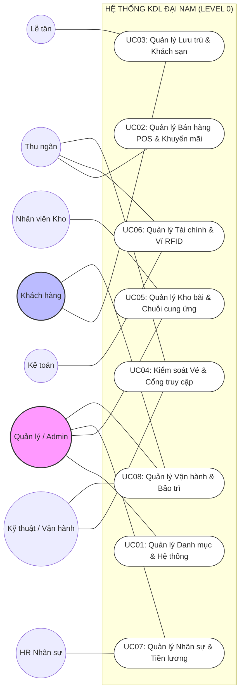

# Sơ đồ Use Case Tổng thể (Level 0) - Khu du lịch Đại Nam

Dưới đây là sơ đồ Use Case mức cao nhất (Level 0) thể hiện mối quan hệ giữa các Tác nhân (Actors) và các Phân hệ chức năng chính.

### Giải thích các mối quan hệ chính:

1.  **Quản lý / Admin**: Có quyền can thiệp vào hầu hết các thiết lập hệ thống, phê duyệt các phiếu kho và nhân sự cấp cao.
2.  **Nhân viên vận hành (Thu ngân, Lễ tân, Kho)**: Tập trung vào các nghiệp vụ giao dịch và quản lý tài sản trực tiếp.
3.  **Kỹ thuật / Vận hành**: Đóng vai trò kép vừa kiểm soát cổng (soát vé) vừa thực hiện các tác vụ bảo trì hệ thống.
4.  **Khách hàng**: Tương tác với hệ thống qua các kênh đặt phòng (Web/App) và gửi phản hồi dịch vụ.

---
*Ghi chú: Đây là sơ đồ mức 0 nhằm mục đích giới thiệu kiến trúc chức năng. Các chi tiết logic cụ thể sẽ được trình bày ở các sơ đồ Level 1 và Sequence Diagram.*
