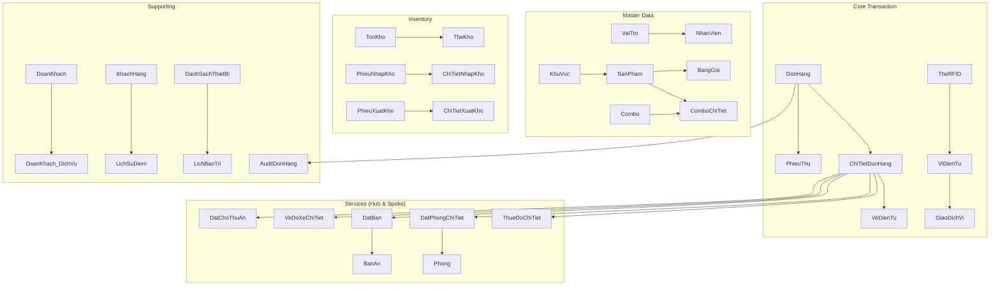

# 📊 PHÂN TÍCH DATABASE — TỔNG QUAN (INDEX)

> **Database**: DaiNamResort | **Tổng**: 56 bảng, 6 Views, 2 Triggers, 1 SP | **SQL Server** + **.NET 4.7.2**

---

## 📁 Mục lục chi tiết

| Phần | File | Nội dung | Số bảng |
|------|------|----------|---------|
| **1** | [db_01_master_data.md](file:///C:/Users/ADMIN/.gemini/antigravity/brain/3d20a017-25b8-425b-a1c0-eaa6ca19ec9d/db_01_master_data.md) | Master Data: VaiTro, NhanVien, SanPham, BangGia, Combo, DoanKhach | 13 |
| **2** | [db_02_transactions.md](file:///C:/Users/ADMIN/.gemini/antigravity/brain/3d20a017-25b8-425b-a1c0-eaa6ca19ec9d/db_02_transactions.md) | Giao dịch & Tài chính: DonHang, ViDienTu, GiaoDichVi, VeDienTu | 10 |
| **3** | [db_03_operations.md](file:///C:/Users/ADMIN/.gemini/antigravity/brain/3d20a017-25b8-425b-a1c0-eaa6ca19ec9d/db_03_operations.md) | Vận hành: Thuê đồ, KS, Bãi xe, Biển, Trường đua, Vườn thú, Nhà hàng | 25+ |
| **4** | [db_04_inventory_audit.md](file:///C:/Users/ADMIN/.gemini/antigravity/brain/3d20a017-25b8-425b-a1c0-eaa6ca19ec9d/db_04_inventory_audit.md) | Kho hàng, Bảo trì, Loyalty, Audit, Views, Triggers, Thống kê | 8+ |

---

## 🏗 5 Design Patterns Cốt Lõi

### 1. Universal Product Catalog
```
1 bảng SanPham → phân biệt bằng LoaiSanPham (Ve/AnUong/LuuTru/Thue/...)
→ ChiTietDonHang chỉ cần 1 FK IdSanPham
→ BangGia engine apply cho TẤT CẢ loại sản phẩm
```

### 2. Hub & Spoke (Universal Line Item)
```
DonHang → ChiTietDonHang (HUB) → ThueDoChiTiet / DatPhongChiTiet / DatBan / VeDoXeChiTiet / DatChoThuAn
→ 1 SP duy nhất (SpGetChiTietDonHangToanPhan) query tất cả dịch vụ
```

### 3. Weak Entity Pattern
```
KhuVucBien(PK=FK→KhuVuc), KhuVucThu(PK=FK→KhuVuc), SanPham_Ve(PK=FK→SanPham), VeKhanDai(PK=FK→VeDienTu)
→ Mở rộng thuộc tính mà không thêm cột thừa vào bảng cha
```

### 4. Immutable Ledger
```
GiaoDichVi, TheKho, LichSuDiem, AuditDonHang → KHÔNG BAO GIỜ sửa/xóa
PhieuThu, PhieuChi, DonHang → Không có IsDeleted, hủy = đổi TrangThai
```

### 5. Optimistic Concurrency Control (OCC)
```
RowVersion/RowVer trên: ViDienTu, Phong, BanAn, ChoiNghiMat, TonKho, ViTriNgoi
→ Chống 2 nhân viên cùng thao tác 1 resource
```

---

## 🎯 Quick Reference — Câu hỏi phỏng vấn

| # | Câu hỏi | Trả nhanh | Bằng chứng |
|---|---------|-----------|------------|
| 1 | Tại sao chỉ 1 bảng SanPham? | Universal Product Catalog — giảm join, đơn giản FK | SQL line 159-174 |
| 2 | Chống đặt trùng phòng? | RowVersion trên bảng Phong + TransactionScope trong BUS | SQL line 446, BUS_Phong.cs |
| 3 | Chống double-spending ví? | RowVersion trên ViDienTu + TransactionScope | SQL line 340, BUS_DonHang.ThanhToanBangVi |
| 4 | Sao biết Vé đã qua cổng? | VeDienTu.SoLuotConLai trừ dần, TrangThai → DaSuDung | BUS_VeDienTu.CheckTicket |
| 5 | Giá thay đổi theo ngày? | BangGia: 3 cột giá × khung giờ. Engine chọn: Lễ > CuoiTuan > Thuong | BUS_BangGia.ChonGiaTheoNgay |
| 6 | Combo tổng phải 100%? | Trigger TrgComboChiTietTyLe100 kiểm tra AFTER INSERT/UPDATE/DELETE | SQL line 1087-1114 |
| 7 | Hoàn cọc thuê đồ? | BUS_ThueDo.ReturnItem: giải phóng SoDuDongBang → SoDuKhaDung | BUS_ThueDo.cs line 130 |
| 8 | Audit đơn hàng? | Trigger TrgAuditDonHang ghi log mỗi thay đổi TrangThai | SQL line 1388-1399 |
| 9 | Tích điểm thế nào? | 100k = 1 điểm × hệ số loại khách. Auto-upgrade VIP ≥200đ, VVIP ≥500đ | BUS_TichDiem.cs line 50-73 |
| 10 | Tiêu điểm giới hạn? | Tối đa 50% giá trị đơn hàng. 1 điểm = 1,000 VND | BUS_TichDiem.TinhDiemKhaDung |
| 11 | Đoàn khách lifecycle? | DaDat → DangPhucVu → DaXuatVe → DaHoanTat \| DaHuy | BUS_DoanKhach.CheckBookingValid |
| 12 | Rút dịch vụ đoàn? | Append-Only: giảm SoLuong gốc + tạo dòng ÂM + PhieuChi hoàn tiền | BUS_DoanKhach.RutBotDichVu |
| 13 | Bảo trì xe vs ngựa? | Exclusive OR constraint: (IdXe XOR IdNgua) per row | SQL line 621-624 |
| 14 | Kho trừ khi bán? | BUS_KhoHang.GhiXuatKho: TonKho.SoLuong -= N + ghi TheKho ledger | BUS_KhoHang.cs |
| 15 | Kiểm kê chênh lệch? | ChiTietKiemKho.ChenhLech = PERSISTED computed column | SQL line 887 |
| 16 | Gửi xe OCR? | LuotVaoRaBaiXe.AnhBienSo — lưu ảnh chụp, BUS_GuiXe so khớp | BUS_GuiXe.cs |
| 17 | Tại sao không xóa cứng? | IsDeleted = soft delete cho Master Data. Giao dịch = immutable | Toàn bộ schema |
| 18 | Phân quyền? | 5 VaiTro × 36 QuyenHan qua junction PhanQuyen. Admin full, NV limited | SQL seed section 19 |
| 19 | Computed columns? | ThanhTien (CTDH), ThanhTien (DoanKhach_DichVu), ChenhLech (CTKK) | PERSISTED |
| 20 | Filtered indexes? | IxSanPham_Active WHERE IsDeleted=0 — chỉ index row active | SQL line 1282-1284 |

---

## 📊 Sơ đồ tổng quan hệ thống


