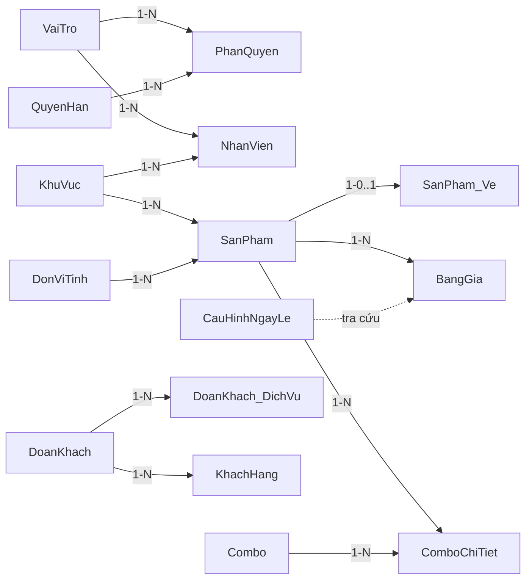

# PHÂN TÍCH DATABASE — PHẦN 1: MASTER DATA (Danh Mục Gốc)

> Phân tích 5W1H cho từng bảng. Mọi thông tin đều lấy từ `Database_DaiNam.sql` và source code BUS/DAL.

---

## Tổng quan nhóm

Nhóm này gồm **13 bảng** chứa dữ liệu nền tảng (ít thay đổi, được tham chiếu bởi tất cả module khác). Xóa mềm (`IsDeleted = 0`) được áp dụng cho các bảng cần giữ lại lịch sử.

---

## 1. VaiTro

| Câu hỏi | Trả lời |
|---------|---------|
| **What** (Là gì) | Lưu danh sách vai trò trong hệ thống: Admin, QuanLy, NhanVien, LeTan, ThuKho, BaoVe... |
| **Why** (Tại sao cần) | Phân quyền — mỗi nhân viên được gán 1 vai trò, vai trò quyết định được làm gì |
| **Who** (Ai dùng) | Admin quản lý; hệ thống tra cứu khi kiểm tra quyền truy cập |
| **When** (Khi nào) | Tạo 1 lần khi cài đặt hệ thống, hiếm khi thay đổi |
| **Where** (Dùng ở đâu) | GUI đăng nhập, phân quyền menu |
| **How** (Cấu trúc) | `Id` (PK, auto), `TenVaiTro` (NVARCHAR 50, UNIQUE) — chỉ 2 cột, đơn giản nhất hệ thống |

**Quan hệ**: `VaiTro` → `PhanQuyen` (1-N), `VaiTro` → `NhanVien` (1-N)

---

## 2. QuyenHan

| Câu hỏi | Trả lời |
|---------|---------|
| **What** | Danh sách quyền hạn cụ thể: `XemDonHang`, `SuaGia`, `XoaNhanVien`... |
| **Why** | Tách quyền ra khỏi vai trò → 1 vai trò có nhiều quyền, linh hoạt hơn hard-code |
| **Who** | Admin cấu hình; `BUS_PhanQuyen` kiểm tra runtime |
| **When** | Seed data lúc cài đặt |
| **Where** | Mọi form GUI đều check quyền trước khi cho phép thao tác |
| **How** | `Id` (PK), `MaQuyen` (VARCHAR 50, UNIQUE — mã code `XemKho`, `SuaGia`...), `MoTa` (text giải thích) |

**Quan hệ**: `QuyenHan` → `PhanQuyen` (1-N)

---

## 3. PhanQuyen

| Câu hỏi | Trả lời |
|---------|---------|
| **What** | Bảng nối (junction table) giữa VaiTro và QuyenHan — quan hệ N-N |
| **Why** | 1 vai trò có nhiều quyền, 1 quyền thuộc nhiều vai trò |
| **Who** | Admin cấu hình |
| **When** | Cấu hình 1 lần, thỉnh thoảng điều chỉnh |
| **Where** | `BUS_PhanQuyen.cs` kiểm tra khi user thao tác |
| **How** | PK kép `(IdVaiTro, IdQuyen)`, cả 2 đều là FK. Không có cột thừa |

**Thiết kế**: Composite PK = tự động UNIQUE + tự động INDEX → không cần constraint thêm.

---

## 4. NhanVien

| Câu hỏi | Trả lời |
|---------|---------|
| **What** | Lưu thông tin nhân viên: họ tên, chức vụ, bộ phận, tài khoản đăng nhập |
| **Why** | Là bảng trung tâm của audit trail — mọi bảng giao dịch đều có `CreatedBy` FK về đây |
| **Who** | Admin quản lý; tất cả module đều tham chiếu |
| **When** | Thêm khi tuyển dụng, cập nhật khi thay đổi chức vụ, xóa mềm khi nghỉ việc |
| **Where** | Đăng nhập, phân quyền, audit trail toàn hệ thống |
| **How** | 22 cột. Đáng chú ý: |

**Chi tiết cột quan trọng**:
- `MaCode` VARCHAR(20) UNIQUE — mã nhân viên, NULL-able (hệ thống tự sinh)
- `TenDangNhap` NVARCHAR(50) UNIQUE — tên đăng nhập, *xác minh từ schema line 58*
- `MatKhau` NVARCHAR(100) — lưu password (plaintext trong phiên bản academic, production cần hash)
- `IdVaiTro` INT NOT NULL — FK → VaiTro (bắt buộc)
- `IdKhuVuc` INT NULL — FK → KhuVuc (*comment trong SQL: "Gỡ FK inline để tránh circular reference, thêm ở cuối file"*)
- `TrangThai` CHECK IN ('ThuViec', 'Đang làm việc', 'Tạm nghỉ', 'Nghỉ việc')
- `IsDeleted` BIT DEFAULT 0 — xóa mềm
- `Email`, `Cccd` đều UNIQUE — tránh trùng nhân viên

**Quan hệ**: Nhân viên → VaiTro (N-1), Nhân viên → KhuVuc (N-1). Nhân viên được tham chiếu bởi ~20 bảng qua `CreatedBy`.

---

## 5. DoanKhach

| Câu hỏi | Trả lời |
|---------|---------|
| **What** | Lưu thông tin đoàn khách du lịch: tên đoàn, mã booking, chiết khấu, lịch trình |
| **Why** | Công viên phục vụ cả khách lẻ và khách đoàn — đoàn có chiết khấu riêng, quota vé riêng |
| **Who** | Sales tạo khi đoàn đặt trước; Gate quét `MaBooking` khi đoàn đến |
| **When** | Tạo trước ngày đoàn đến, cập nhật trạng thái theo lifecycle |
| **Where** | `frmDoanKhach`, `frmQuayVe_LeTan`, Gate soát vé |
| **How** | 15 cột. Đáng chú ý: |

**Chi tiết cột quan trọng**:
- `MaBooking` VARCHAR(20) UNIQUE — mã quét tại cổng, format `BK-yyMMdd-xxxx` (*xác minh từ `BUS_DoanKhach.cs` line 40*)
- `ChietKhau` DECIMAL(5,2) CHECK (0-100) — phần trăm giảm giá cho đoàn
- `SoLuongKhach` INT CHECK (≥ 0) — headcount (pax), dùng để tính quota
- `NgayDen`, `NgayDi` DATE — khoảng thời gian hợp lệ của booking
- `TrangThai` CHECK IN: `DaDat` → `DangPhucVu` → `DaXuatVe` → `DaHoanTat` | `HetHan` | `DaHuy`
- `IdCombo` INT NULL — *DEPRECATED, comment trong SQL: "Dùng DoanKhach_DichVu thay thế"*

**State Machine** (xác minh từ `BUS_DoanKhach.CheckBookingValid` line 250-268):
```
DaDat → DangPhucVu → DaXuatVe → DaHoanTat
  ↓                                    
DaHuy / HetHan (nếu quá NgayDi)
```

**Quan hệ**: DoanKhach → DoanKhach_DichVu (1-N), DoanKhach → KhachHang (1-N), DoanKhach → DonHang (1-N)

---

## 6. DoanKhach_DichVu

| Câu hỏi | Trả lời |
|---------|---------|
| **What** | Chi tiết dịch vụ đoàn đã đặt: vé, combo, phòng, bàn ăn... kèm quota sử dụng |
| **Why** | 1 đoàn đặt nhiều loại dịch vụ → cần bảng riêng để track từng loại + số lượng đã dùng |
| **Who** | Sales tạo khi lên package; các trạm (Gate, POS, Lễ tân) khấu trừ khi phục vụ |
| **When** | Tạo khi đoàn đặt dịch vụ; cập nhật `SoLuongDaDung` mỗi khi trạm phục vụ |
| **Where** | Gate soát vé (trừ quota vé), POS bán hàng (trừ quota ăn uống), Lễ tân khách sạn |
| **How** | 14 cột. Đáng chú ý: |

**Chi tiết cột quan trọng**:
- `LoaiDichVu` CHECK IN ('Ve', 'Combo', 'Phong', 'BanAn', 'DichVu') — phân loại quota
- `SoLuong` INT CHECK (> 0), `SoLuongDaDung` INT DEFAULT 0 — track tiêu thụ
- `ThanhTien` AS (SoLuong * DonGia) PERSISTED — computed column, DB tự tính
- `SoLuongConLai` — *được tính trong C# = SoLuong - SoLuongDaDung* (xác minh từ `BUS_DoanKhach.KhauTruQuota` line 235-243)
- `IdChiTietDonHang` INT NULL — NULL = chưa xuất hóa đơn, NOT NULL = đã chốt tài chính
- `TrangThai`: ChuaXuLy → DaDatCho → DangPhucVu → DaThanhToan | DaHuy

**Quan hệ**: FK → DoanKhach, FK (optional) → Combo, SanPham, ChiTietDonHang

---

## 7. KhachHang

| Câu hỏi | Trả lời |
|---------|---------|
| **What** | Lưu thông tin khách hàng: tên, SĐT, email, loại khách, điểm tích lũy |
| **Why** | Liên kết với ví RFID, đơn hàng, tích điểm, đánh giá dịch vụ |
| **Who** | Lễ tân tạo khi khách đăng ký ví; POS liên kết khi thanh toán |
| **When** | Tạo khi khách lần đầu đăng ký thẻ RFID hoặc nhập thông tin |
| **Where** | `frmCustomerWallet`, POS, khách sạn, nhà hàng |
| **How** | 18 cột. Đáng chú ý: |

**Chi tiết cột quan trọng**:
- `LoaiKhach` CHECK IN: `CaNhan`, `Doan`, `DoanhNghiep`, `HocSinhSinhVien`, `VIP`, `NoiBo`
- `DiemTichLuy` INT CHECK (≥ 0) DEFAULT 0 — tích điểm loyalty
- `IdDoan` INT NULL — FK → DoanKhach, liên kết khách thuộc đoàn nào
- **Auto-upgrade** (xác minh từ `BUS_TichDiem.CongDiem` line 121-133): điểm ≥ 200 → VIP, ≥ 500 → VVIP

**Quan hệ**: KhachHang → ViDienTu (1-1), KhachHang → DonHang (1-N), KhachHang → DoanKhach (N-1)

---

## 8. KhuVuc

| Câu hỏi | Trả lời |
|---------|---------|
| **What** | Danh sách khu vực vật lý trong công viên: Khu trò chơi, Biển nhân tạo, Vườn thú, Trường đua... |
| **Why** | Phân vùng quản lý: sản phẩm thuộc khu nào, nhân viên làm ở đâu, soát vé đúng khu |
| **Who** | Admin cấu hình |
| **When** | Seed lúc cài đặt, thỉnh thoảng thêm khu mới |
| **Where** | Quản lý sản phẩm, nhân viên, soát vé |
| **How** | `Id`, `MaCode`, `TenKhuVuc`, `TrangThai` (Hoạt động/Bảo trì/Tạm đóng/Ngừng hoạt động), `IsDeleted` |

**Quan hệ**: KhuVuc → SanPham (1-N), KhuVuc → NhanVien (1-N), KhuVuc → NhaHang (1-N), KhuVuc → KhuVucBien (1-1 weak entity), KhuVuc → KhuVucThu (1-1 weak entity)

---

## 9. DonViTinh

| Câu hỏi | Trả lời |
|---------|---------|
| **What** | Danh sách đơn vị tính: Lon, Chai, Thùng, Kg, Vé, Cái... |
| **Why** | Tách UoM (Unit of Measure) ra bảng riêng → SanPham biết DonGia là giá của Lon hay Thùng |
| **Who** | Admin/thủ kho cấu hình |
| **When** | Seed lúc cài đặt |
| **Where** | SanPham, QuyDoiDonVi, nhập/xuất kho |
| **How** | `Id`, `Ten`, `KyHieu` (VD: "L" cho Lít), `IsDeleted` |

**Quan hệ**: DonViTinh → SanPham.IdDonViCoBan (1-N), DonViTinh → QuyDoiDonVi (1-N)

---

## 10. SanPham

| Câu hỏi | Trả lời |
|---------|---------|
| **What** | Bảng sản phẩm trung tâm — chứa MỌI THỨ bán được: vé, đồ ăn, đồ lưu niệm, phòng khách sạn, dịch vụ thuê đồ |
| **Why** | Thiết kế "Universal Product Catalog" — 1 bảng duy nhất cho mọi loại sản phẩm, phân biệt bằng `LoaiSanPham` |
| **Who** | Admin cấu hình; POS, Gate, Kho, Khách sạn đều tra cứu |
| **When** | Thêm khi có sản phẩm mới, cập nhật giá/trạng thái |
| **Where** | Mọi module nghiệp vụ |
| **How** | 14 cột. Đáng chú ý: |

**Chi tiết cột quan trọng**:
- `LoaiSanPham` CHECK IN: `Ve`, `Combo`, `Thue`, `AnUong`, `LuuTru`, `DoLuuNiem`, `GuiXe`, `DichVu`, `Khac`
- `IdDonViCoBan` INT NOT NULL — FK → DonViTinh, xác định đơn vị cơ bản (Lon, Cái, Vé...)
- `DonGia` DECIMAL(15,0) CHECK (≥ 0) — giá gốc fallback, BangGia override nếu có
- `TrangThai`: DangBan / TamNgung / NgungBan / HetHang

**Tại sao thiết kế 1 bảng thay vì nhiều bảng**: 
- `ChiTietDonHang` chỉ cần 1 FK `IdSanPham` thay vì nhiều FK cho mỗi loại
- BOM decomposition (Combo) chỉ cần `ComboChiTiet.IdSanPham`
- Trade-off: bảng lớn hơn, nhưng join đơn giản hơn rất nhiều

**Quan hệ**: SanPham → BangGia (1-N), SanPham → ComboChiTiet (1-N), SanPham → ChiTietDonHang (1-N), SanPham → SanPham_Ve (1-0..1 weak entity)

---

## 11. SanPham_Ve (Weak Entity)

| Câu hỏi | Trả lời |
|---------|---------|
| **What** | Thuộc tính mở rộng cho sản phẩm loại "Vé" — không phải bảng độc lập |
| **Why** | Chỉ sản phẩm loại Vé mới cần `SoLuotQuyDoi` và `IdThietBi`, không muốn thêm cột thừa vào SanPham |
| **Who** | `BUS_DonHang` tra cứu khi sinh vé điện tử |
| **When** | Cấu hình khi thêm sản phẩm vé mới |
| **Where** | `ThemDonHangVaChiTiet` — quyết định có sinh VeDienTu hay không |
| **How** | PK = FK (`IdSanPham`), `CanTaoToken` BIT, `SoLuotQuyDoi` INT DEFAULT 1, `IdThietBi` INT NULL |

**Cách dùng trong code** (xác minh từ `BUS_DonHang.cs` line 66-71):
```csharp
// Pre-fetch SanPham_Ve để xét ticket generation
foreach (var sp in allSanPhamCache.Values.Where(x => x.LoaiSanPham == "Ve"))
{
    var veInfo = DAL_SanPham_Ve.Instance.LayTheoIdSanPham(sp.Id);
    if (veInfo != null) allVeInfoCache[sp.Id] = veInfo;
}
```
→ Nếu sản phẩm KHÔNG có bản ghi trong `SanPham_Ve` → không sinh vé điện tử.

---

## 12. BangGia (Ma Trận Giá Phẳng / Flat Pricing Matrix)

| Câu hỏi | Trả lời |
|---------|---------|
| **What** | Bảng giá động: 3 cột giá (Ngày thường / Cuối tuần / Ngày lễ) + khung giờ + config thuê giờ |
| **Why** | Giá sản phẩm thay đổi theo ngày + giờ (VD: vé trò chơi buổi tối rẻ hơn) |
| **Who** | Admin cấu hình; `BUS_BangGia` tra cứu realtime khi POS tính giá |
| **When** | Cấu hình trước, engine tự chọn giá đúng lúc bán |
| **Where** | POS (`GetDynamicPrice`), Thuê đồ (`TinhTienThueTheoPhut`), Khách sạn (`TinhGiaPhong`) |
| **How** | 13 cột. Đáng chú ý: |

**Chi tiết cột quan trọng**:
- `GiaNgayThuong`, `GiaCuoiTuan`, `GiaNgayLe` — 3 mức giá
- `GioBatDau`, `GioKetThuc` TIME — khung giờ áp dụng, mặc định `00:00`-`23:59` (cả ngày)
- `PhutBlock` INT NULL — thời lượng block đầu (VD: 60 phút). NULL = bán đứt, NOT NULL = thuê giờ
- `PhutTiep`, `GiaPhuThu` — phụ thu lố giờ: cứ mỗi `PhutTiep` phút = +`GiaPhuThu`đ
- `TienCoc` DECIMAL NULL — tiền cọc (chỉ cho sản phẩm thuê)

**Engine chọn giá** (xác minh từ `BUS_BangGia.cs` line 82-103):
1. Tra `DAL_BangGia.LayGiaHienTai(idSanPham, gio)` — lấy dòng BangGia khớp khung giờ
2. `ChonGiaTheoNgay`: Ngày lễ (tra `CauHinhNgayLe`) → Cuối tuần (T7/CN) → Ngày thường
3. Nếu không có dòng BangGia → fallback về `SanPham.DonGia`

---

## 13. Các bảng hỗ trợ nhỏ

### CauHinhNgayLe
| Item | Detail |
|------|--------|
| **What** | Danh sách ngày lễ để engine BangGia biết áp dụng `GiaNgayLe` |
| **How** | PK = `Ngay` (DATE), `TenNgayLe` NVARCHAR — chỉ 2 cột |
| **Dùng ở đâu** | `DAL_CauHinhNgayLe.Instance.LaNgayLe(thoiDiem)` trong `BUS_BangGia.ChonGiaTheoNgay` |

### QuyDoiDonVi
| Item | Detail |
|------|--------|
| **What** | Quy đổi giữa đơn vị: 1 Thùng = 24 Lon, cho phép nhập sỉ xuất lẻ |
| **How** | `IdSanPham`, `IdDonViNho`, `IdDonViLon`, `TyLeQuyDoi` DECIMAL, `GiaBanRieng` (có thể NULL) |
| **Dùng ở đâu** | Nhập kho (nhập theo Thùng, hệ thống quy ra Lon), chi tiết nhập/xuất kho |

### Combo + ComboChiTiet
| Item | Detail |
|------|--------|
| **What** | Combo = gói sản phẩm (VD: "Combo Gia Đình" = 2 vé + 1 bữa ăn + 1 phòng). ComboChiTiet = BOM (Bill of Materials) |
| **How** | Combo: `MaCode`, `Ten`, `Gia`, `TrangThai` (Bản nháp/Kích hoạt/Ngừng). ComboChiTiet: `IdCombo` FK, `IdSanPham` FK, `SoLuong`, `TyLePhanBo` DECIMAL (tổng phải = 100%) |
| **Bảo vệ** | Trigger `TrgComboChiTietTyLe100` kiểm tra tổng `TyLePhanBo` = 100% mỗi khi INSERT/UPDATE/DELETE (xác minh từ SQL line 1087-1114) |
| **Dùng ở đâu** | POS bán Combo → `BUS_DonHang` bóc tách BOM → sinh vé cho từng SP trong combo, trừ kho cho từng SP vật lý |

---

## Sơ đồ quan hệ nhóm Master Data


