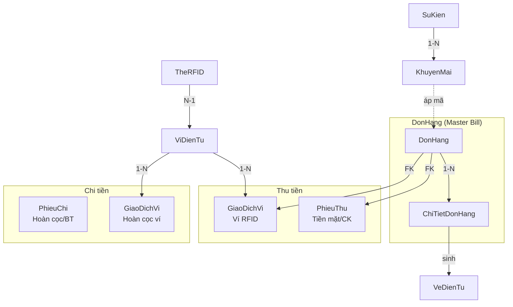

# PHÂN TÍCH DATABASE — PHẦN 2: GIAO DỊCH & TÀI CHÍNH

> Phân tích 5W1H cho từng bảng. Mọi thông tin đều lấy từ `Database_DaiNam.sql` và source code BUS/DAL.

---

## Tổng quan nhóm

Nhóm này gồm **10 bảng** xử lý dòng tiền và giao dịch. Đây là nhóm QUAN TRỌNG NHẤT vì liên quan trực tiếp đến tài chính. Đặc điểm chung: **Immutable Ledger** — dữ liệu giao dịch KHÔNG BAO GIỜ bị xóa hay sửa (chỉ thêm bản ghi mới để đối trừ).

---

## 1. DonHang (Master Bill / Folio)

| Câu hỏi | Trả lời |
|---------|---------|
| **What** | Đơn hàng tổng — bill gốc cho MỌI giao dịch: POS, khách sạn, nhà hàng, thuê đồ, gửi xe |
| **Why** | Trung tâm tài chính — mọi dòng tiền đều phải gắn vào 1 DonHang |
| **Who** | Hệ thống tự tạo; nhân viên POS, lễ tân, bảo vệ bãi xe đều trigger |
| **When** | Tạo auto khi: bán vé, check-in phòng, mở bàn nhà hàng, nhận xe, thanh toán thuê đồ |
| **Where** | Mọi module nghiệp vụ |
| **How** | 11 cột. Đáng chú ý: |

**Chi tiết cột quan trọng**:
- `MaCode` VARCHAR(20) UNIQUE — format theo module: `DH-KS-yyMMddHHmmss-xxxx` (khách sạn), `NH-yyMMddHHmmss-xxxx` (nhà hàng), `DX-yyMMddHHmmss` (gửi xe)
- `IdKhachHang` INT NULL — FK → KhachHang (NULL = khách vãng lai)
- `IdDoan` INT NULL — FK → DoanKhach (NULL = khách lẻ, NOT NULL = đoàn)
- `IdKhuyenMai` INT NULL — FK → KhuyenMai (nếu có áp mã giảm giá)
- `TienGiamGia` DECIMAL CHECK (≥ 0) — số tiền giảm (tính sẵn từ KhuyenMai)
- `TongTien` DECIMAL CHECK (≥ 0) — tổng tiền phải trả
- `TrangThai` CHECK IN: `ChoThanhToan`, `DaThanhToan`, `DangXuLy`, `GhiNoCongTy`, `DaHuy`, `HoanTienMotPhan`, `DaHoanTien`

**State Machine** (xác minh từ nhiều file BUS):
```
[Nhà hàng]     ChoThanhToan → DangXuLy → DaThanhToan
[POS/Vé]       → DaThanhToan (thanh toán tức thì)
[Khách sạn]    DaDatCoc → DaThanhToan (check-out)
[Bị hủy]       * → DaHuy
```

**Immutable**: DonHang KHÔNG có `IsDeleted`. Hủy = set TrangThai = `DaHuy`, dữ liệu vẫn giữ nguyên.

---

## 2. ChiTietDonHang (Universal Line Item)

| Câu hỏi | Trả lời |
|---------|---------|
| **What** | Dòng chi tiết trong đơn hàng — sản phẩm X, số lượng Y, giá Z |
| **Why** | 1 DonHang có nhiều sản phẩm → cần bảng chi tiết. Thiết kế "Universal Line Item" — tất cả module dùng chung |
| **Who** | Hệ thống tự sinh khi bán hàng/check-in/mở bàn |
| **When** | Tạo cùng lúc hoặc sau DonHang |
| **Where** | POS, nhà hàng (gọi món), khách sạn (check-in), thuê đồ, gửi xe |
| **How** | 7 cột. Đáng chú ý: |

**Chi tiết cột quan trọng**:
- `IdDonHang` INT NOT NULL — FK → DonHang (bắt buộc)
- `IdSanPham` INT NULL — FK → SanPham (NULL khi mua combo hoặc phụ thu dịch vụ)
- `IdCombo` INT NULL — FK → Combo (NULL khi mua sản phẩm đơn)
- `SoLuong` INT CHECK (> 0)
- `DonGiaGoc` DECIMAL — giá gốc (trước giảm)
- `TienGiamGiaDong` DECIMAL DEFAULT 0 — số tiền giảm trên dòng này
- `DonGiaThucTe` DECIMAL — giá thực trả = DonGiaGoc - TienGiamGiaDong/SoLuong *(tính ở BUS, không phải computed column)*

**Thiết kế Universal Line Item** (xác minh từ toàn bộ BUS layer):
- POS bán vé: `IdSanPham` = sản phẩm vé, `IdCombo` = NULL
- POS bán combo: `IdSanPham` = NULL, `IdCombo` = combo ID
- Nhà hàng gọi món: `IdSanPham` = món ăn
- Khách sạn: `IdSanPham` = sản phẩm loại LuuTru (thông qua `Phong.IdSanPham`)
- Thuê đồ: `IdSanPham` = sản phẩm loại Thue
- Gửi xe: `IdSanPham` = NULL (dịch vụ không liên kết SP cụ thể)
- Phụ thu nhà hàng/KS: `IdSanPham` = NULL, `DonGiaGoc` = tiền phụ thu

**Index**: `IxCTDH_IdDonHang ON ChiTietDonHang(IdDonHang)` — tăng tốc tra cứu bill

---

## 3. PhieuThu (Cash Receipt)

| Câu hỏi | Trả lời |
|---------|---------|
| **What** | Chứng từ thu tiền — ghi nhận tiền vào quỹ (tiền mặt/chuyển khoản) |
| **Why** | Tách dòng tiền THU ra khỏi DonHang → 1 DonHang có thể có nhiều lần thu (cọc + thanh toán lần 2) |
| **Who** | Hệ thống tự tạo khi thanh toán tiền mặt/chuyển khoản |
| **When** | Khi bán vé (tiền mặt), check-in/check-out KS, thanh toán nhà hàng, trả xe |
| **Where** | Mọi module có thanh toán tiền mặt |
| **How** | `Id`, `MaCode`, `IdDonHang` FK, `IdGiaoDichVi` FK (NULL), `SoTien`, `PhuongThuc`, `ThoiGian`, `CreatedBy` |

**Lưu ý**: Khi thanh toán bằng ví RFID → KHÔNG tạo PhieuThu, mà tạo GiaoDichVi thay thế.

---

## 4. PhieuChi (Cash Disbursement)

| Câu hỏi | Trả lời |
|---------|---------|
| **What** | Chứng từ chi tiền — ghi nhận tiền ra khỏi quỹ |
| **Why** | Hoàn cọc thuê đồ, hoàn tiền đoàn, bảo trì thiết bị... đều cần chứng từ chi |
| **Who** | Hệ thống tạo khi hoàn tiền; kế toán tạo thủ công cho chi phí khác |
| **When** | Hoàn cọc thuê đồ (`BUS_ThueDo.ReturnItem`), rút bớt dịch vụ đoàn (`BUS_DoanKhach.RutBotDichVu`) |
| **Where** | Module thuê đồ, đoàn khách, bảo trì |
| **How** | `Id`, `MaCode`, `SoTien`, `LyDo`, `ThoiGian`, `CreatedBy` |

**Xác minh** (từ `BUS_ThueDo.ReturnItem` line 153-161): khi hoàn cọc tiền mặt → tạo PhieuChi với `LyDo = "Hoàn cọc (Đã trừ lố giờ/phạt)" hoặc "Hoàn full cọc"`.

---

## 5. ViDienTu (Digital Wallet)

| Câu hỏi | Trả lời |
|---------|---------|
| **What** | Ví điện tử của khách hàng — lưu số dư khả dụng và số dư đóng băng (cọc) |
| **Why** | Hệ thống cashless — khách nạp tiền 1 lần, quẹt thẻ RFID thanh toán ở mọi quầy |
| **Who** | Lễ tân tạo khi cấp thẻ RFID; POS/khách sạn/bãi xe trừ tiền khi thanh toán |
| **When** | Tạo khi cấp thẻ, cập nhật mỗi giao dịch |
| **Where** | `frmCustomerWallet`, mọi module thanh toán |
| **How** | Đáng chú ý: |

**Chi tiết cột quan trọng**:
- `IdKhachHang` INT — FK → KhachHang (1 khách = 1 ví)
- `SoDuKhaDung` DECIMAL — số tiền có thể dùng ngay
- `SoDuDongBang` DECIMAL — tiền bị khóa (cọc thuê đồ, đặt phòng...)
- `RowVersion` ROWVERSION — **Optimistic Concurrency Control**. Khi 2 giao dịch cùng trừ ví, `RowVersion` tự động phát hiện xung đột

**Cơ chế đóng băng** (xác minh từ `BUS_ThueDo.RentMultipleItems` line 40-42):
```csharp
vi.SoDuKhaDung -= tongThue;  // Trừ tiền thuê (chi tiêu)
vi.SoDuKhaDung -= tongCoc;   // Trừ tiền cọc (đóng băng)
vi.SoDuDongBang += tongCoc;  // Chuyển sang cột đóng băng
```
Khi hoàn cọc (line 130-131):
```csharp
vi.SoDuDongBang -= td.SoTienCoc;    // Giải phóng đóng băng
vi.SoDuKhaDung += tienHoanVeVi;     // Trả lại khả dụng
```

---

## 6. TheRFID

| Câu hỏi | Trả lời |
|---------|---------|
| **What** | Thẻ RFID vật lý — liên kết với ví điện tử |
| **Why** | 1 ví có thể gắn nhiều thẻ (VD: thẻ cho bố + thẻ cho con cùng 1 ví gia đình) |
| **Who** | Lễ tân phát thẻ |
| **When** | Cấp khi khách đăng ký ví |
| **Where** | POS quẹt thẻ, bãi xe quét RFID, Gate soát vé |
| **How** | `MaRfid` VARCHAR PK, `IdVi` FK → ViDienTu, `TrangThai`, metadata |

**Quan hệ**: TheRFID → ViDienTu (N-1). FK `LuotVaoRaBaiXe.MaRfid` → TheRFID (bãi xe ghi nhận xe bằng RFID).

---

## 7. GiaoDichVi (Wallet Transaction Ledger)

| Câu hỏi | Trả lời |
|---------|---------|
| **What** | Sổ cái giao dịch ví — ghi LẠI MỌI thay đổi số dư ví |
| **Why** | Immutable ledger — không bao giờ xóa/sửa. Mỗi giao dịch = 1 bản ghi mới |
| **Who** | Hệ thống tự ghi khi nạp/trừ ví |
| **When** | Mỗi khi ví bị thay đổi: nạp tiền, thanh toán, thu cọc, hoàn cọc |
| **Where** | `BUS_GiaoDichVi`, `BUS_ThueDo`, `BUS_Phong`, `BUS_DonHang`, `BUS_GuiXe` |
| **How** | Đáng chú ý: |

**Chi tiết cột quan trọng**:
- `MaCode` VARCHAR — format theo nghiệp vụ: `GD-RENT-` (thuê đồ), `GD-DEP-` (cọc), `GD-REF-` (hoàn), `GD-XE-` (gửi xe)
- `IdVi` INT — FK → ViDienTu
- `LoaiGiaoDich` — `NapTien`, `ThanhToanDichVu`, `ThuCoc`, `HoanCoc`
- `SoTien` DECIMAL — số tiền giao dịch
- `IdDonHangLienQuan` INT NULL — FK → DonHang (truy vết đơn hàng nào)
- `ParentTransactionId` INT NULL — FK tự tham chiếu → GiaoDichVi (chuỗi giao dịch: nạp → đóng băng → hoàn)
- `HashSignature` — **chống sửa tay DB** (phiên bản production)

**Index**: `IxGiaoDichVi_IdVi ON GiaoDichVi(IdVi, ThoiGian DESC)` — xem lịch sử ví mới nhất trước.

---

## 8. VeDienTu (Electronic Ticket / Token)

| Câu hỏi | Trả lời |
|---------|---------|
| **What** | Vé điện tử — token kỹ thuật số sinh ra sau khi mua vé, quét tại cổng/trò chơi |
| **Why** | Anti-fraud — vé giấy dễ làm giả, vé điện tử có mã code duy nhất + kiểm soát lượt dùng |
| **Who** | Hệ thống sinh auto khi bán vé; Gate quét khi khách vào cổng |
| **When** | Sinh khi `BUS_DonHang.ThemDonHangVaChiTiet` xử lý sản phẩm loại Vé |
| **Where** | POS (sinh), Gate (quét), báo cáo |
| **How** | Đáng chú ý: |

**Chi tiết cột quan trọng**:
- `MaCode` VARCHAR UNIQUE — mã QR 12 ký tự (random), scan tại cổng
- `IdChiTietDonHang` FK → ChiTietDonHang — truy vết ai mua, khi nào
- `IdSanPham` INT — **denormalized** cho O(1) lookup tại Gate (*xác minh từ `BUS_VeDienTu.CheckTicket`*) thay vì join 3 bảng
- `SoLuotConLai` INT — ban đầu = `SoLuotQuyDoi` từ SanPham_Ve, mỗi lần quét trừ 1
- `IdKhachHangSuDung` INT NULL — FK, gắn khi quét (biết ai dùng vé)
- `TrangThai`: `ChuaSuDung` → `DaSuDung` | `HetLuot` | `DaHuy`

**Index**: `IxVeDienTu_IdCTDH ON VeDienTu(IdChiTietDonHang)` — tra nhanh vé theo đơn hàng.

---

## 9. SuKien & KhuyenMai

### SuKien
| Item | Detail |
|------|--------|
| **What** | Sự kiện (Tết, Giáng sinh, Black Friday...) — container cho các chương trình khuyến mãi |
| **How** | `TenSuKien`, `NgayBatDau`, `NgayKetThuc`, `TrangThai` (Sắp diễn ra/Đang diễn ra/Kết thúc/Hủy) |

### KhuyenMai
| Item | Detail |
|------|--------|
| **What** | Mã khuyến mãi: giảm % hoặc giảm tiền cố định |
| **How** | `LoaiGiamGia` IN (PhanTram/SoTien/DongGia/MuaXTangY), `GiaTriGiam`, `DonToiThieu`, `NgayBatDau/KetThuc` |
| **Dùng ở đâu** | POS áp mã khi thanh toán, gắn vào `DonHang.IdKhuyenMai` |

---

## Sơ đồ dòng tiền



---

## Nguyên tắc thiết kế tài chính

1. **Immutable Ledger**: DonHang, GiaoDichVi KHÔNG có `IsDeleted`. Hủy = đổi TrangThai, KHÔNG xóa dữ liệu.
2. **Double-entry mindset**: Thu = PhieuThu hoặc GiaoDichVi(ThanhToan). Chi = PhieuChi hoặc GiaoDichVi(HoanCoc).
3. **RowVersion trên ViDienTu**: Chống race condition khi 2 quầy cùng trừ ví 1 khách.
4. **TransactionScope**: Mọi hàm tài chính đều bọc trong `TransactionScope` (xác minh từ tất cả BUS files).
