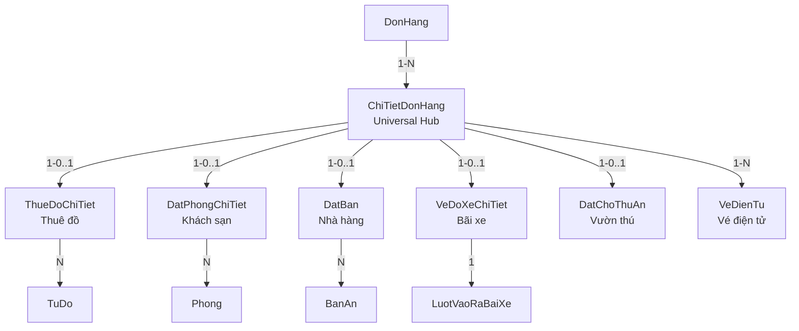

# PHÂN TÍCH DATABASE — PHẦN 3: DỊCH VỤ VẬN HÀNH

> Phân tích 5W1H cho từng nhóm bảng. Mọi thông tin đều lấy từ `Database_DaiNam.sql` và source code BUS/DAL.

---

## Tổng quan nhóm

Nhóm này gồm **25+ bảng** xử lý nghiệp vụ vận hành hàng ngày. Đặc điểm chung: mọi bảng dịch vụ đều kết nối về `ChiTietDonHang` (Universal Line Item Pattern) thay vì FK trực tiếp về `DonHang`.

**Pattern "Hub & Spoke":**
```
DonHang → ChiTietDonHang (HUB) → ThueDoChiTiet / DatPhongChiTiet / DatBan / VeDoXeChiTiet / DatChoThuAn
```

---

## 1. THUÊ ĐỒ & TỦ ĐỒ

### ThueDoChiTiet

| Câu hỏi | Trả lời |
|---------|---------|
| **What** | Chi tiết giao dịch thuê đồ: phao, tủ đồ, xe điện, xe đạp... |
| **Why** | Thuê đồ cần track thời gian (bắt đầu/kết thúc), cọc, phạt lố giờ — phức tạp hơn bán đứt |
| **Who** | Nhân viên quầy thuê; hệ thống tự tính khi trả |
| **When** | Tạo khi khách thuê; cập nhật khi trả đồ |
| **Where** | `BUS_ThueDo`, quầy thuê đồ khu biển |
| **How** | 12 cột. Đáng chú ý: |

**Chi tiết cột quan trọng**:
- `IdChiTietDonHang` INT NOT NULL — FK → ChiTietDonHang *(Hub Pattern)*
- `IdSanPham` INT NOT NULL — FK → SanPham (denormalized cho O(1) lookup)
- `ThoiGianBatDau` DATETIME, `ThoiGianKetThuc` DATETIME NULL (NULL = chưa trả)
- `SoTienCoc` DECIMAL CHECK (≥ 0) — cọc thu trước
- `TrangThaiCoc` CHECK IN: `ChuaHoan` → `DaHoan` | `DaPhat`
- `IdGiaoDichCoc`, `IdGiaoDichHoanCoc`, `IdGiaoDichPhat` — 3 FK → GiaoDichVi, truy vết dòng tiền cọc
- `TienThueDaThu` DECIMAL DEFAULT 0 — tiền thuê đã thanh toán (phân biệt với cọc)

**Lifecycle** (xác minh từ `BUS_ThueDo.cs`):
```
RentMultipleItems → ThueDoChiTiet (TrangThaiCoc=ChuaHoan)
                   → GiaoDichVi (ThuCoc + ThanhToanDichVu)
                   → ViDienTu (trừ khả dụng, tăng đóng băng)

ReturnItem        → Tính lố giờ (PhutBlock/PhutTiep)
                   → GiaoDichVi (HoanCoc - phạt nếu có)
                   → ViDienTu (giảm đóng băng, cộng hoàn)
                   → PhieuChi (nếu hoàn cọc tiền mặt)
```

### TuDo

| Item | Detail |
|------|--------|
| **What** | Tủ gửi đồ vật lý — 50 tủ khu biển (seed data), 3 kích thước S/M/L |
| **How** | `IdKhuVuc` FK, `MaTu` (TU01-TU50), `KichThuoc` CHECK (S/M/L), `TrangThai` (Trong/DangThue/BaoTri) |
| **Dùng ở đâu** | `BUS_ThueDo.RentMultipleItems` — gán tủ cụ thể khi thuê, giải phóng khi trả |

### ThueTu (Junction: Thuê → Tủ Cụ Thể)

| Item | Detail |
|------|--------|
| **What** | Bảng nối: 1 giao dịch thuê có thể gán nhiều tủ |
| **How** | `IdChiTietThue` FK → ThueDoChiTiet, `IdTuDo` FK → TuDo, `MaPin` (mã PIN giữ tủ) |

---

## 2. KHÁCH SẠN

### LoaiPhong

| Câu hỏi | Trả lời |
|---------|---------|
| **What** | Danh mục loại phòng: Superior / Deluxe / Family / Villa VIP |
| **Why** | Tách "loại phòng" ra khỏi "phòng vật lý" → 1 loại có nhiều phòng, giá chung |
| **How** | `MaLoai`, `TenLoai`, `SucChuaMoiPhong`, `DienTich`, `LaVilla` BIT, `IdSanPham` FK → SanPham |

**Thiết kế đặc biệt**: `IdSanPham` FK cho phép reuse `BangGia` pricing engine (Phòng → LoaiPhong → SanPham → BangGia). Không tạo bảng giá phòng riêng.

### Phong

| Câu hỏi | Trả lời |
|---------|---------|
| **What** | Phòng vật lý cụ thể: Phòng 101, 102, Villa 01... |
| **Why** | Quản lý trạng thái từng phòng riêng biệt |
| **How** | `MaCode`, `TenPhong`, `IdLoaiPhong` FK, `SucChua` INT, `RowVer` ROWVERSION (OCC) |
| **TrangThai** | CHECK IN: `Trong`, `DaDat`, `DangSuDung`, `BaoTri`, `DonDep`, `TamKhoa` |

**State Machine** (xác minh từ `BUS_Phong.cs`):
```
Trong → DaDat → DangSuDung → DonDep → Trong
         ↓                      ↓
       DaHuy                  BaoTri
```

**RowVersion**: Chống xung đột khi 2 lễ tân cùng đặt 1 phòng — giống ViDienTu.

### DatPhongChiTiet + ChiTietDatPhong

| Item | Detail |
|------|--------|
| **DatPhongChiTiet** | Booking header: `IdChiTietDonHang` FK *(Hub)*, `NgayNhan`, `NgayTra`, `TrangThai` (DaDat/DaNhan/DaTra/DaHuy/HoanTat) |
| **ChiTietDatPhong** | Bảng nối: 1 booking gắn N phòng cụ thể + giá thực tế mỗi phòng: `IdDatPhongChiTiet`, `IdPhong`, `DonGiaThucTe` |
| **Tại sao 2 bảng** | 1 booking = nhiều phòng (gia đình đặt 2 phòng). Giá mỗi phòng có thể khác (upgrade) |

**Seed**: 18 phòng (8 Superior, 5 Deluxe, 3 Family, 2 Villa).

---

## 3. BÃI ĐỖ XE

### LuotVaoRaBaiXe

| Câu hỏi | Trả lời |
|---------|---------|
| **What** | Ghi nhận xe vào/ra bãi: biển số, loại xe, thời gian vào/ra, trạng thái |
| **Why** | Tính phí gửi xe theo thời gian + DOC (OCR nhận dạng biển số) |
| **Who** | Bảo vệ bãi xe; OCR engine (Tesseract) |
| **When** | Xe vào → insert. Xe ra → update ThoiGianRa |
| **How** | 8 cột. Đáng chú ý: |

**Chi tiết cột quan trọng**:
- `BienSo` NVARCHAR(20) — khách nhập hoặc OCR đọc
- `LoaiXe` CHECK IN: `XeDap`, `XeMay`, `OTo`, `XeDien`
- `MaRfid` NVARCHAR NULL — FK → TheRFID (nếu khách có thẻ RFID)
- `AnhBienSo` NVARCHAR(500) — đường dẫn ảnh chụp biển số (OCR demo)
- `TrangThai` CHECK IN: `DangGui` → `DaTra` | `MatVe`
- CHECK constraint: `ThoiGianRa IS NULL OR ThoiGianRa >= ThoiGianVao`

### GiaGuiXe

| Item | Detail |
|------|--------|
| **What** | Bảng giá gửi xe đơn giản — riêng biệt, KHÔNG dùng BangGia engine |
| **How** | `LoaiXe` UNIQUE, `TenLoaiXe`, `GiaBanNgay`, `GiaQuaDem` |
| **Tại sao tách** | Giá gửi xe ít thay đổi, không cần complexity của BangGia (3 mức giá + khung giờ) |

### VeDoXeChiTiet + BaiDoXe

| Item | Detail |
|------|--------|
| **VeDoXeChiTiet** | Link giao dịch xe → đơn hàng: `IdChiTietDonHang` FK *(Hub)*, `IdLuotVaoRa` FK, `TienPhaiTra` |
| **BaiDoXe** | Danh mục bãi đỗ vật lý: `TenBai`, `TongCho`, `IdKhuVuc` FK |
| **Seed**: 3 bãi (Trung tâm 500 chỗ, Biển 200, Trường đua 300) |

---

## 4. BIỂN NHÂN TẠO

### KhuVucBien (Weak Entity)

| Câu hỏi | Trả lời |
|---------|---------|
| **What** | Mở rộng KhuVuc cho đặc thù khu biển: độ sâu, yêu cầu phao |
| **Why** | Chỉ khu biển mới cần `DoSauToiDa` và `YeuCauPhao` — không muốn thêm cột thừa vào KhuVuc |
| **How** | PK = FK (`IdKhuVuc`), `DoSauToiDa` DECIMAL, `YeuCauPhao` BIT |
| **Thiết kế** | **Weak Entity Pattern**: PK = FK = IdKhuVuc → không có ID riêng |

**Seed**: 10 khu biển (KVB01-KVB10), từ khu nông trẻ em (0.8m) đến khu sóng mạnh (2.2m).

### ThietBiTaoSong + LichTaoSong + ChatLuongNuoc + CaTrucCuuHo

| Bảng | Vai trò |
|------|---------|
| **ThietBiTaoSong** | 3 máy tạo sóng (2 hoạt động, 1 bảo trì) |
| **LichTaoSong** | Lịch chạy sóng theo ca: UNIQUE(IdThietBi, BatDau, KetThuc) |
| **ChatLuongNuoc** | Nhật ký chất lượng nước hàng ngày: pH, độ mặn, nhiệt độ. UNIQUE(KhuVuc, Ngay) |
| **CaTrucCuuHo** | Lịch trực cứu hộ: nhân viên nào, khu nào, ca nào |

### ChoiNghiMat + ThueChoi

| Item | Detail |
|------|--------|
| **ChoiNghiMat** | 10 chòi nghỉ mát khu biển (seed). `IdSanPham` FK → SanPham (dùng BangGia cho thuê chòi). `RowVer` cho OCC |
| **ThueChoi** | Link thuê chòi → ThueDoChiTiet: `IdChiTietThue` FK, `IdChoi` FK |

---

## 5. TRƯỜNG ĐUA

| Bảng | Vai trò |
|------|---------|
| **DuongDua** | 4 đường đua (ngựa 1600m, chó 500m, go-kart 2200m, mô tô 1800m) |
| **LoaiHinhDua** | 5 loại (Đua ngựa, chó, go-kart, mô tô, Flyboard) |
| **GiaiDua** | Giải đua: tên giải, thời gian |
| **LichThiDau** | Lịch thi đấu: FK GiaiDua + DuongDua + LoaiHinhDua + ThoiGian |
| **VanDongVien** | VĐV: `LoaiVdv` CHECK (NaiNgua/TayDua/ChoDua) |
| **NguaDua** | Ngựa: `IdVdv` FK, `Tuoi`, `ThanhTich` |
| **PhuongTienDua** | Xe đua: `IdVdv` FK, `TinhTrang` (Tot/BaoTri) |
| **BaoTriPhuongTienDua** | Bảo trì xe/ngựa: **Exclusive OR constraint**: (IdPhuongTienDua XOR IdNguaDua) |
| **KetQuaDua** | Kết quả: VĐV + Phương tiện/Ngựa + ThuTu + ThanhTich. Cùng CHECK constraint XOR |
| **KhanDai** | 3 khán đài (A-5000, B-3000, VIP-500) |
| **ViTriNgoi** | Ghế cụ thể: Hàng + SoGhe + LoaiGhe (Thuong/Vip). UNIQUE(KhanDai, Hàng, SoGhe). `IdSanPham` FK để lấy giá từ BangGia |
| **VeKhanDai** | Weak Entity: PK=FK(IdVeDienTu), `IdViTriNgoi` FK — map vé vào ghế cụ thể |

**Thiết kế Exclusive OR** (SQL line 621-624):
```sql
CONSTRAINT CHK_BaoTri_Exclusive CHECK (
    (IdPhuongTienDua IS NOT NULL AND IdNguaDua IS NULL) OR 
    (IdPhuongTienDua IS NULL AND IdNguaDua IS NOT NULL)
)
```
→ Mỗi bản ghi bảo trì CHỈ cho xe HOẶC ngựa, không cả hai.

---

## 6. VƯỜN THÚ

### KhuVucThu (Weak Entity)

| Item | Detail |
|------|--------|
| **What** | Mở rộng KhuVuc cho đặc thù vườn thú: diện tích, sức chứa, loại môi trường |
| **How** | PK=FK(IdKhuVuc), `DienTich` DECIMAL (ha), `SucChuaDongVat` INT, `LoaiMoiTruong` (NgoaiTroi/NuocNgot/RungRam/Chuong) |
| **Seed** | 10 khu (Hổ, Voi, Gấu, Hươu, Sư tử, Linh trưởng, Đảo khỉ, Chim, Bò sát, Hà mã) |

### DongVat + ChuongTrai + LichChoAn + DatChoThuAn

| Bảng | Vai trò |
|------|---------|
| **DongVat** | 29 cá thể (seed), info: Tên, Loài, NgàySinh, SứcKhỏe |
| **ChuongTrai** | Chuồng vật lý: FK KhuVucThu + DongVat, `TrangThai` (HoatDong/BaoTri) |
| **LichChoAn** | Lịch cho thú ăn: DongVat, ThucAn, NguoiPhuTrach (FK NhanVien) |
| **DatChoThuAn** | Đặt chỗ cho thú ăn (trải nghiệm khách): `IdChiTietDonHang` FK *(Hub)*, `IdDongVat`, `IdVeDienTu` (link vé), `TrangThai` (ChuaSuDung/DaSuDung) |

---

## 7. NHÀ HÀNG & ĐẶT BÀN

### NhaHang + BanAn

| Bảng | Vai trò |
|------|---------|
| **NhaHang** | 4 nhà hàng (seed): Đại Nam (2000 chỗ), Ngũ Hành Sơn (300), Fast-food Biển (200), Phố ẩm thực (500) |
| **BanAn** | 50 bàn (seed): 30 bàn NH Đại Nam + 20 bàn Phố ẩm thực. `TrangThai` (Trong/DaDat/DangSuDung), `RowVer` ROWVERSION, UNIQUE(IdNhaHang, MaBan) |

### DatBan + ChiTietDatBan

| Câu hỏi | Trả lời |
|---------|---------|
| **What** | Booking bàn nhà hàng |
| **How** | `DatBan`: `IdChiTietDonHang` FK *(Hub)*, `IdNhaHang`, `ThoiGianDenDuKien`, `SoLuongKhach`, `TienCoc`, `IdKhachHang` NULL (cho phép vãng lai). `TrangThai`: DaDat→DaNhan→HoanTat; DaHuy; DaTra |
| **ChiTietDatBan** | Bảng nối: 1 booking gán N bàn cụ thể: `IdDatBan`, `IdBanAn` |

---

## Sơ đồ Hub & Spoke



---

## Nguyên tắc thiết kế vận hành

1. **Universal Line Item**: Tất cả dịch vụ đi qua `ChiTietDonHang` → chỉ cần 1 stored procedure `SpGetChiTietDonHangToanPhan` để xem tổng hợp toàn bộ dịch vụ của 1 đơn hàng.
2. **RowVersion trên tài nguyên vật lý**: Phòng, Bàn, Chòi, Tủ → chống 2 nhân viên cùng đặt 1 resource.
3. **Weak Entity Pattern**: KhuVucBien, KhuVucThu, SanPham_Ve, VeKhanDai → PK = FK, không ID riêng.
4. **Exclusive OR Constraint**: BaoTriPhuongTienDua, KetQuaDua → đảm bảo 1 bản ghi chỉ cho xe HOẶC ngựa.
5. **Denormalized FK**: ThueDoChiTiet.IdSanPham, VeDienTu.IdSanPham → redundant nhưng giúp O(1) lookup tại runtime.
