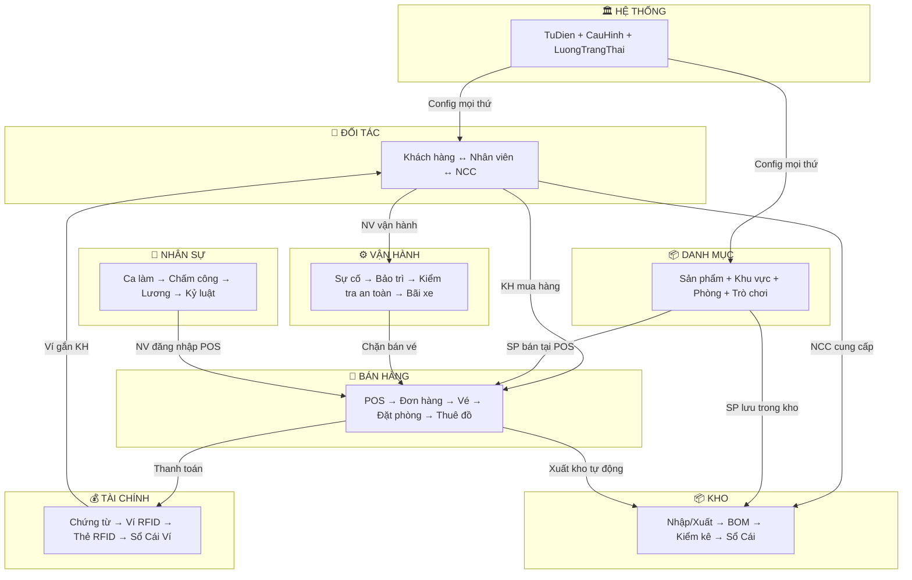

# 🏗️ PHASE 0: NỀN TẢNG — TRƯỚC KHI VIẾT DÒNG CODE ĐẦU TIÊN

> **Mục đích**: Thiết lập mọi quy chuẩn + phân tích nghiệp vụ → đẻ ra chức năng đúng.
> **Quy tắc bất di bất dịch**: Không có file này → không code.

---

## PHẦN I — CODING CONVENTIONS (Nâng cấp)

### 1. Cấu trúc thư mục chuẩn

```
QuanLyDaiNam.sln
│
├── 📦 ET/                          ← Entity Layer (POCO + Constants)
│   ├── Models/                     ← 1 file = 1 bảng DB
│   │   ├── HeThong/
│   │   │   └── ET_TuDien.cs
│   │   ├── DoiTac/
│   │   │   ├── ET_ThongTin.cs      ← Base party
│   │   │   ├── ET_KhachHang.cs
│   │   │   ├── ET_NhanVien.cs
│   │   │   └── ET_NhaCungCap.cs
│   │   ├── DanhMuc/
│   │   ├── BanHang/
│   │   ├── Kho/
│   │   ├── TaiChinh/
│   │   ├── VanHanh/
│   │   └── NhanSu/
│   ├── Constants/
│   │   ├── AppConstants.cs         ← Magic strings TOÀN HỆ THỐNG
│   │   ├── TrangThaiConstants.cs   ← Trạng thái theo entity
│   │   ├── SchemaNames.cs          ← "HeThong", "BanHang"...
│   │   ├── ConfigKeys.cs           ← Keys cho HeThong.CauHinh
│   │   └── LoaiChungTu.cs          ← "NHAP_NCC", "XUAT_SANXUAT"...
│   ├── DTOs/                       ← Data Transfer Objects (grid binding)
│   │   ├── DTO_KhachHangChiTiet.cs ← KH + ví + điểm + thẻ RFID
│   │   └── DTO_DonHangTong.cs      ← DonHang + ChiTiet join sẵn
│   ├── Results/
│   │   └── OperationResult.cs      ← { Success, Message, Data }
│   └── Interfaces/
│       ├── IEntity.cs              ← { int Id; }
│       └── ISoftDelete.cs          ← { bool DaXoa; }
│
├── 📦 DAL/                         ← Data Access Layer
│   ├── DataQuanLyDaiNam.dbml       ← LINQ to SQL designer
│   ├── DbFactory.cs                ← Connection string factory
│   └── Repositories/               ← 1 file = 1 bảng (hoặc nhóm)
│       ├── HeThong/
│       │   ├── DAL_TuDien.cs
│       │   └── DAL_LuongTrangThai.cs
│       ├── DoiTac/
│       │   ├── DAL_KhachHang.cs    ← JOIN sẵn ThongTin + KhachHang + Vi
│       │   └── DAL_NhanVien.cs
│       ├── BanHang/
│       │   ├── DAL_DonHang.cs
│       │   └── DAL_SP.cs           ← Gọi Stored Procedures
│       ├── Kho/
│       ├── TaiChinh/
│       ├── VanHanh/
│       └── NhanSu/
│
├── 📦 BUS/                         ← Business Logic Layer
│   ├── Services/                   ← 1 file = 1 nghiệp vụ
│   │   ├── HeThong/
│   │   │   ├── BUS_TuDien.cs       ← Cache startup
│   │   │   ├── BUS_CauHinh.cs      ← Cache startup
│   │   │   └── StateService.cs     ← LuongTrangThai engine
│   │   ├── DoiTac/
│   │   │   ├── BUS_KhachHang.cs    ← CRUD + Ví + Điểm + Thẻ
│   │   │   └── BUS_NhanVien.cs
│   │   ├── BanHang/
│   │   │   ├── BUS_DonHang.cs
│   │   │   ├── BUS_Ve.cs
│   │   │   └── BUS_ThanhToan.cs
│   │   ├── Kho/
│   │   ├── TaiChinh/
│   │   │   ├── BUS_ViDienTu.cs     ← Nạp/Trừ/Khóa/Hoàn
│   │   │   └── BUS_ChungTuTC.cs
│   │   ├── VanHanh/
│   │   └── NhanSu/
│   └── Validators/
│       └── ValidationHelper.cs
│
├── 📦 GUI/                         ← WinForms Application
│   ├── Infrastructure/             ← Services dùng chung
│   │   ├── AppStyle.cs             ← 🎨 Theme 1 nơi duy nhất
│   │   ├── UIHelper.cs             ← i18n + dialog tiện ích
│   │   ├── EventBus.cs             ← Publish/Subscribe
│   │   ├── NavigationService.cs    ← Tab management
│   │   └── SessionManager.cs       ← User đang đăng nhập
│   ├── Resources/
│   │   ├── Lang.resx               ← Tiếng Việt (mặc định)
│   │   ├── Lang.en.resx
│   │   ├── Lang.ja.resx
│   │   └── Lang.zh.resx
│   ├── Controls/                   ← UserControls tái sử dụng
│   │   ├── ucToolbar.cs
│   │   └── ucSearchBar.cs
│   ├── Modules/                    ← Forms theo nghiệp vụ
│   │   ├── DoiTac/
│   │   │   ├── frmKhachHang.cs     ← RICH: hồ sơ + ví + điểm + lịch sử
│   │   │   └── frmNhanVien.cs
│   │   ├── BanHang/
│   │   │   ├── frmPOS.cs
│   │   │   └── frmDatPhong.cs
│   │   ├── Kho/
│   │   ├── TaiChinh/
│   │   ├── VanHanh/
│   │   └── NhanSu/
│   ├── Shell/
│   │   ├── frmLogin.cs
│   │   ├── frmMain.cs              ← Shell chính + menu + tabs
│   │   └── frmSplash.cs
│   └── Program.cs
│
└── docs/                           ← Tài liệu nộp bài
    ├── Sprint1/
    │   ├── SRS_S1.docx
    │   ├── TestCases_S1.xlsx
    │   └── ...
    └── Sprint2/
```

---

### 2. Quy tắc đặt tên — LUẬT SẮT

#### Classes & Files

| Layer | Pattern | Ví dụ | Vị trí |
|-------|---------|-------|--------|
| Entity | `ET_[TenBang]` | `ET_KhachHang` | `ET/Models/DoiTac/` |
| DTO | `DTO_[MucDich]` | `DTO_KhachHangChiTiet` | `ET/DTOs/` |
| DAL | `DAL_[TenBang]` | `DAL_KhachHang` | `DAL/Repositories/DoiTac/` |
| BUS | `BUS_[NghiepVu]` | `BUS_KhachHang` | `BUS/Services/DoiTac/` |
| Form | `frm[TenChucNang]` | `frmKhachHang` | `GUI/Modules/DoiTac/` |
| UserControl | `uc[TenControl]` | `ucToolbar` | `GUI/Controls/` |
| Constants | `[NhomHangSo]` | `TrangThai_DonHang` | `ET/Constants/` |

#### Controls trên Form (prefix bắt buộc)

| Prefix | Control | Ví dụ |
|--------|---------|-------|
| `txt` | TextEdit / TextBox | `txtHoTen`, `txtDienThoai` |
| `cbo` | ComboBoxEdit | `cboTrangThai`, `cboLoaiKhach` |
| `slk` | SearchLookUpEdit | `slkKhachHang`, `slkSanPham` |
| `btn` | SimpleButton | `btnLuu`, `btnXoa`, `btnTimKiem` |
| `lbl` | LabelControl | `lblHoTen`, `lblTongTien` |
| `grid` | GridControl | `gridKhachHang`, `gridDonHang` |
| `gridView` | GridView | `gridViewKhachHang` |
| `pnl` | PanelControl | `pnlChiTiet`, `pnlToolbar` |
| `gb` | GroupControl | `gbThongTinCaNhan`, `gbViRFID` |
| `split` | SplitContainer | `splitMain` |
| `tab` | XtraTabControl | `tabChiTiet` |
| `dtFrom` | DateEdit | `dtFromNgayTao`, `dtToNgayTao` |
| `chk` | CheckEdit | `chkConHoatDong` |
| `pic` | PictureEdit | `picAnhDaiDien` |
| `spin` | SpinEdit | `spinSoLuong` |
| `memo` | MemoEdit | `memoGhiChu` |

#### Methods trong BUS

| Pattern | Mô tả | Trả về |
|---------|-------|--------|
| `GetAll()` | Lấy danh sách | `List<ET_X>` |
| `GetById(int id)` | Lấy 1 record | `ET_X` hoặc `null` |
| `GetChiTiet(int id)` | Lấy DTO giàu (JOIN nhiều bảng) | `DTO_X` |
| `Them(ET_X entity)` | Thêm mới | `OperationResult` |
| `CapNhat(ET_X entity)` | Cập nhật | `OperationResult` |
| `Xoa(int id)` | Xóa mềm (DaXoa=1) | `OperationResult` |
| `TimKiem(string keyword)` | Tìm kiếm | `List<ET_X>` |
| `[NghiepVuCuThe]()` | Logic đặc thù | `OperationResult` |

**Ví dụ BUS_KhachHang**:
```csharp
public class BUS_KhachHang
{
    // ── CRUD cơ bản ──
    public List<ET_KhachHang> GetAll() { }
    public DTO_KhachHangChiTiet GetChiTiet(int idKH) { }
    public OperationResult Them(ET_KhachHang kh) { }
    public OperationResult CapNhat(ET_KhachHang kh) { }
    public OperationResult Xoa(int id) { }
    public List<ET_KhachHang> TimKiem(string keyword) { }

    // ── Ví RFID ──
    public OperationResult MoVi(int idKH) { }
    public OperationResult KhoaVi(int idKH) { }
    public OperationResult NapVi(int idKH, decimal soTien) { }
    public decimal LaySoDuVi(int idKH) { }
    public List<ET_SoCaiVi> LichSuGiaoDichVi(int idKH) { }

    // ── Thẻ RFID ──
    public OperationResult GanThe(int idKH, string maThe) { }
    public OperationResult ThuHoiThe(int idKH) { }

    // ── Điểm tích lũy ──
    public int LayDiemTichLuy(int idKH) { }
    public List<ET_DonHang> LichSuMuaHang(int idKH) { }
}
```

---

### 3. Magic Strings — CẤM CHẾT

```csharp
// ❌ CẤM — Hard-code string trực tiếp
if (donHang.TrangThai == "ChoThanhToan") { }
chungTu.LoaiChungTu = "NHAP_NCC";

// ✅ BẮT BUỘC — Dùng Constants
if (donHang.TrangThai == TrangThai_DonHang.ChoThanhToan) { }
chungTu.LoaiChungTu = LoaiChungTu.NHAP_NCC;
```

**File AppConstants.cs**:
```csharp
namespace ET.Constants
{
    // Trạng thái entity — 1 class = 1 entity
    public static class TrangThai_DonHang
    {
        public const string Moi = "Moi";
        public const string ChoThanhToan = "ChoThanhToan";
        public const string DaThanhToan = "DaThanhToan";
        public const string DaHuy = "DaHuy";
        public const string DaHoanTien = "DaHoanTien";
    }

    public static class TrangThai_TheRFID
    {
        public const string ChuaKichHoat = "ChuaKichHoat";
        public const string DangDung = "DangDung";
        public const string DaKhoa = "DaKhoa";
        public const string DaMat = "DaMat";
    }

    // Loại chứng từ
    public static class LoaiChungTuKho
    {
        public const string NHAP_NCC = "NHAP_NCC";
        public const string XUAT_BAN = "XUAT_BAN";
        public const string XUAT_SANXUAT = "XUAT_SANXUAT";
        public const string KIEM_KE = "KIEM_KE";
        public const string CHUYEN_KHO = "CHUYEN_KHO";
    }

    public static class LoaiChungTuTC
    {
        public const string THU = "THU";
        public const string CHI = "CHI";
        public const string NAP_VI = "NAP_VI";
        public const string TRU_VI = "TRU_VI";
        public const string HOAN_VI = "HOAN_VI";
        public const string THU_COC = "THU_COC";
        public const string HOAN_COC = "HOAN_COC";
    }

    // Config keys
    public static class ConfigKeys
    {
        public const string CHIEU_CAO_MIEN_PHI = "CHIEU_CAO_MIEN_PHI_CM";
        public const string CHIEU_CAO_TRE_EM = "CHIEU_CAO_TRE_EM_CM";
        public const string NGUONG_DUYET_TC = "NGUONG_DUYET_TC";
        public const string SO_PHUT_GIU_HANG = "SO_PHUT_GIU_HANG";
    }
}
```

---

### 4. Comment Standards — XML Documentation

```csharp
// ❌ CẤM — Comment vô nghĩa
// Lấy danh sách khách hàng
public List<ET_KhachHang> GetAll() { }

// ✅ CHỈ COMMENT KHI CÓ NGHIỆP VỤ ĐẶC BIỆT
/// <summary>
/// Lấy chi tiết KH bao gồm: thông tin cá nhân, ví RFID, 
/// điểm tích lũy, thẻ đang gán. JOIN 4 bảng.
/// </summary>
/// <returns>null nếu KH không tồn tại hoặc đã xóa mềm</returns>
public DTO_KhachHangChiTiet GetChiTiet(int idKH) { }

/// <summary>
/// Nạp tiền vào ví. Tự tạo ChungTu loại NAP_VI.
/// </summary>
/// <remarks>
/// Bọc trong TransactionScope. 
/// Nếu ví bị khóa (ConHoatDong=0) → trả Fail.
/// </remarks>
public OperationResult NapVi(int idKH, decimal soTien) { }
```

**Khi nào PHẢI comment**:
| Trường hợp | Bắt buộc |
|------------|:--------:|
| Nghiệp vụ không hiển nhiên (tại sao, không phải cái gì) | ✅ |
| JOIN nhiều bảng → ghi rõ JOIN gì | ✅ |
| Transaction / Race condition | ✅ |
| Gọi Stored Procedure | ✅ |
| CRUD đơn giản (GetAll, GetById) | ❌ |
| Logic một dòng dễ đọc | ❌ |

---

### 5. Error Handling — Pattern thống nhất

```csharp
// OperationResult.cs
public class OperationResult
{
    public bool Success { get; set; }
    public string Message { get; set; }
    public object Data { get; set; }

    public static OperationResult Ok(string msg = "Thành công")
        => new() { Success = true, Message = msg };
    public static OperationResult Ok(object data, string msg = "Thành công")
        => new() { Success = true, Message = msg, Data = data };
    public static OperationResult Fail(string msg)
        => new() { Success = false, Message = msg };
}

// ── BUS: KHÔNG throw exception, trả OperationResult ──
public OperationResult Xoa(int id)
{
    var kh = DAL_KhachHang.Instance.GetById(id);
    if (kh == null)
        return OperationResult.Fail("Khách hàng không tồn tại");

    if (DAL_DonHang.Instance.CoDonChuaThanhToan(id))
        return OperationResult.Fail("KH có đơn hàng chưa thanh toán, không thể xóa");

    DAL_KhachHang.Instance.SoftDelete(id);
    return OperationResult.Ok("Xóa khách hàng thành công");
}

// ── GUI: Xử lý OperationResult ──
private void btnXoa_Click(object sender, EventArgs e)
{
    if (!UIHelper.ConfirmDelete()) return;

    var result = BUS_KhachHang.Instance.Xoa(selectedId);
    if (result.Success)
    {
        UIHelper.ShowSuccess(result.Message);
        LoadData();
    }
    else
    {
        UIHelper.ShowError(result.Message);
    }
}
```

---

## PHẦN II — BẢN ĐỒ NGHIỆP VỤ ĐẠI NAM

### 8 Domain → Mối quan hệ thực



---

## PHẦN III — CHỨC NĂNG "GIÀU" (Không phèn)

> **Triết lý**: 1 chức năng = 1 NGHIỆP VỤ HOÀN CHỈNH, không phải 1 bảng DB.
> Khách hàng ≠ CRUD bảng DoiTac.KhachHang.
> Khách hàng = Hồ sơ + Ví + Thẻ + Điểm + Lịch sử + Đoàn.

### Danh sách 10 chức năng nghiệp vụ giàu

---

#### CN01: Quản lý Hồ sơ Khách hàng & Ví RFID
**Không chỉ CRUD.** Đây là "trung tâm khách hàng".

| Sub-feature | Mô tả | Bảng DB |
|-------------|-------|---------|
| Hồ sơ KH | CRUD thông tin + phân loại (Cá nhân/DN/VIP) | ThongTin, KhachHang |
| Ví điện tử | Mở ví / Khóa ví / Xem số dư | ViDienTu |
| Nạp ví | Nạp tiền → tạo ChungTu NAP_VI + SoCaiVi | ChungTu TC, SoCaiVi |
| Lịch sử giao dịch ví | Sao kê: nạp/trừ/hoàn khi nào, bao nhiêu | SoCaiVi |
| Thẻ RFID | Gán thẻ / Thu hồi thẻ / Xem trạng thái | TheRFID |
| Điểm tích lũy | Xem điểm + tổng chi tiêu | KhachHang.DiemTichLuy |
| Lịch sử mua hàng | Xem đơn hàng cũ, vé đã mua | DonHang, VeDienTu |
| Thuộc đoàn? | Nếu KH thuộc đoàn → link đến đoàn | DoanKhach |

**Form layout**: Tab control nhiều tab (Hồ sơ | Ví & Thẻ | Lịch sử | Đoàn)

---

#### CN02: Quản lý Nhân viên & Phân ca
| Sub-feature | Mô tả | Bảng DB |
|-------------|-------|---------|
| Hồ sơ NV | CRUD + upload ảnh + sơ đồ tổ chức | ThongTin, NhanVien |
| Phân quyền | Gán vai trò → hệ thống ẩn/hiện menu | TaiKhoan, VaiTro, PhanQuyen |
| Lịch sử chuyển trạng thái | Đang làm → Nghỉ phép → Thôi việc | LichSuTrangThai |
| Ca làm & Chấm công | Xem ca, quẹt thẻ, giờ vào/ra | CaLam, BangChamCong |

---

#### CN03: POS Bán vé & FnB
**Form phức tạp nhất.** Tích hợp mọi thứ.

| Sub-feature | Mô tả | Bảng DB |
|-------------|-------|---------|
| Chọn điểm bán | Load menu theo DiemBanHang_POS | Menu_POS |
| Bán vé | Phân loại chiều cao → auto chọn giá | SanPham_Ve, BangGia |
| Bán FnB | Thêm giỏ hàng, combo | DonHang, ChiTietDonHang |
| Vé Combo | Tạo QuyenTruyCap, quét QR trừ lượt | Ve_QuyenTruyCap, ChiTietLuotQuet |
| Khuyến mãi | Áp mã, check SoLanDaDung | KhuyenMai |
| Thanh toán đa PT | Tiền mặt + RFID + Split | ChungTu TC |
| In bill | Tạo + in hóa đơn | DonHang |
| Mở/đóng ca | PhienThuNgan mở → kiểm tiền → đóng | PhienThuNgan |
| BOM auto xuất kho | Bán ly cafe → trừ nguyên liệu | DinhMucNguyenLieu, ChungTu Kho |

---

#### CN04: Quản lý Đặt phòng & Check-in/out
| Sub-feature | Mô tả | Bảng DB |
|-------------|-------|---------|
| Xem phòng trống | Calendar view / Grid | Phong, DatPhongChiTiet |
| Đặt phòng | Chọn loại phòng, ngày, giá | DatPhong, ChiTietDatPhong |
| Check-in | Gán thẻ RFID, kích hoạt ví | TheRFID |
| Check-out | Thu hồi thẻ, tính phụ thu, hoàn ví dư | ChungTu TC |
| Phụ thu late checkout | Auto tạo dòng ChiTietDonHang | ChiTietDonHang |

---

#### CN05: Cho thuê đồ & Quản lý tài sản
| Sub-feature | Mô tả | Bảng DB |
|-------------|-------|---------|
| Quét barcode tài sản | Tìm ván lướt, phao, xe | TaiSanChoThue |
| Thu cọc | Tạo ChungTu THU_COC | ChungTu TC |
| Timer đếm giờ | Tính phí theo block + phụ thu | BangGia_ThueTheoGio |
| Trả đồ | Check tình trạng, hoàn cọc | ThueDoChiTiet |
| Quản lý tủ đồ/chòi | Gán/giải phóng, xem trạng thái | TuDo, ChoiNghiMat |

---

#### CN06: Quản lý Kho & Nguyên liệu
| Sub-feature | Mô tả | Bảng DB |
|-------------|-------|---------|
| Phiếu nhập NCC | Tạo chứng từ + chi tiết + lô hàng | ChungTu, ChiTietChungTu, LoHang |
| Phiếu xuất bán | Auto từ POS (BOM backflushing) | ChungTu, SoCai |
| Kiểm kê | So SoLuongHeThong vs SoLuongThucTe | ChiTietChungTu |
| Cảnh báo tồn kho thấp | Alert khi < MucCanhBao | MucTonToiThieu, V_TonKho |
| Trả hàng NCC | Tạo phiếu trả link ChungTuGoc | ChungTu.IdChungTuGoc |

---

#### CN07: Quản lý Đoàn khách B2B
| Sub-feature | Mô tả | Bảng DB |
|-------------|-------|---------|
| Báo giá + Hợp đồng | Tạo BaoGia → chốt → tạo DonHang | BaoGia, DonHang |
| Thu cọc đoàn | 50% trước, trừ vào bill cuối | ChungTu TC |
| Quyền lợi đoàn | Quét QR trừ suất ăn | QuyenLoiDoanKhach |
| Lệnh bếp BEO | Chọn NhaHang, SoLuongSuat, in phiếu | LenhPhucVuDoan_BEO |
| Phát sinh tại chỗ | Thêm phòng, upgrade, hủy 1 phần | ChiTietDonHang |

---

#### CN08: Kiểm tra An toàn & Vận hành
| Sub-feature | Mô tả | Bảng DB |
|-------------|-------|---------|
| Daily sign-off | Tích Đạt/Không đạt từng trò chơi | KiemTraAnToanNgay |
| Chặn bán vé | Chưa kiểm tra → CHẶN bán vé trò đó | Logic BUS_Ve |
| Báo sự cố | CRUD + severity + assign NV xử lý | SuCo |
| Bảo trì định kỳ | Lịch bảo trì + xuất kho phụ tùng | BaoTri, ChungTu Kho |

---

#### CN09: Quản lý Sản phẩm & Danh mục
| Sub-feature | Mô tả | Bảng DB |
|-------------|-------|---------|
| Sản phẩm + BOM | CRUD + Định mức nguyên liệu | SanPham, DinhMucNguyenLieu |
| Bảng giá | Giá theo mùa, ngày lễ, giờ thuê | BangGia, BangGia_ThueTheoGio |
| Combo | Gộp nhiều SP thành combo | Combo, ComboChiTiet |
| Cấu hình vé | LoaiVe, DoiTuongVe, QuyenTruyCap | SanPham_Ve, Ve_QuyenTruyCap |
| Khu vực | CRUD + Biển/Thú/Trò chơi con | KhuVuc, KhuVucBien, KhuVucThu |

---

#### CN10: Dashboard & Báo cáo
| Sub-feature | Mô tả | Bảng DB |
|-------------|-------|---------|
| Doanh thu theo ngày/tháng | Chart + Grid | VIEW tổng hợp |
| Top sản phẩm bán chạy | Pie chart | ChiTietDonHang |
| Tồn kho theo kho | Grid + cảnh báo | V_TonKho |
| Lượt khách theo khu vực | Bar chart | ChiTietLuotQuet |

---

## PHẦN IV — PHÂN BỔ VÀO SPRINT

| Sprint | Chức năng | Ghi chú |
|:------:|-----------|---------|
| S1 | **CN01** (KH + Ví RFID) + **CN09** (SP & Danh mục) | Nền tảng data, form mẫu |
| S2 | **CN03** (POS) + **CN05** (Cho thuê) | Core business |
| S3 | **CN04** (Đặt phòng) + **CN06** (Kho) | Workflow phức tạp |
| S4 | **CN07** (Đoàn khách) + **CN08** (An toàn) | Nâng cao + ấn tượng |
| S5 | **CN02** (NV) + **CN10** (Dashboard) + Polish | Hoàn thiện |

---

## PHẦN V — CHECKLIST TRƯỚC KHI CODE

```
Đã có:
✅ Database V2 (95 bảng, 8 schema)
✅ TODO_CODE_V2.md (29 business logic tasks)
✅ Coding conventions (file này)

Cần tạo tiếp (trong order):
[ ] 1. Tạo Solution 4 project (ET/DAL/BUS/GUI)
[ ] 2. Kéo .dbml LINQ to SQL
[ ] 3. Tạo ET/Constants/ (AppConstants, TrangThaiConstants...)
[ ] 4. Tạo ET/Results/OperationResult.cs
[ ] 5. Tạo GUI/Infrastructure/ (AppStyle, UIHelper, EventBus)
[ ] 6. Tạo Program.cs chuẩn (AppStyle.Init + ErrorHandler)
[ ] 7. Tạo frmLogin + frmMain (shell)
---  ↑ Xong Phase 0, bắt đầu Sprint 1 ↓ ---
[ ] 8. SRS Sprint 1 (CN01 + CN09)
[ ] 9. Code Sprint 1
```
